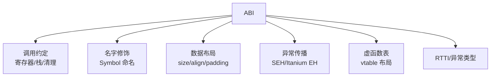
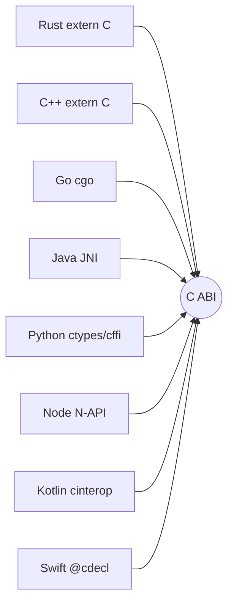

# 4.ABI 与调用约定

> 📍 **本篇位置**：第 7 卷 · 编译与链接之道 · 第 4 篇
> 🎯 **核心矛盾**：**一段 C 的 `.so` 能被 Python / Java / Rust / Go / Node.js 全都调，但一段 C++ 的 `.so` 换个编译器就"链接不上"——同样是二进制，凭什么"契约"差这么大？**
> 🧭 **设计灵魂**：ABI = **"两段陌生代码之间的二进制契约"**——它固定了参数传哪里、返回值放哪里、谁清栈、名字怎么拼、struct 怎么排布。契约越少 → 越灵活但越易碎；契约越多 → 越稳定但演进越难。**C 之所以成"事实通用语言"，正是因为它主动选择了"契约极少"的路。**
> 🌐 **跨平台覆盖**：System V AMD64 (Linux/macOS x86_64) · Windows x64 · ARM64 AAPCS · C++ Itanium/MSVC · Rust extern"C" · JNI · Kotlin C interop · Go cgo
> 🔗 **延伸阅读**：← [7.3 静态链接 vs 动态链接](./03.静态链接与动态链接.md) · → [7.5 语言到机器的三种路线](./05.语言到机器的三种路线.md) · [2.4 调用栈与栈帧设计](https://yccoding.com/pages/dc94ae/)

---

> 前 3 篇我们讲了"怎么编、怎么补、什么时候补"，但都默默假设了**"补上就能跑"**。这一篇要拆穿这个假设——**能不能跑得对，取决于双方是否遵守同一份"二进制契约"**，这份契约就叫 ABI。

> 📢 **语言无关声明**
> ABI 是"两个二进制模块之间"的接口约定，跨语言时**总是要选一个"最小公约数"**：
>
> - **C ABI**：几乎所有平台都稳定 → 成为**事实上的通用 ABI**，Python/Java/Rust/Go 的 FFI 都靠它。
> - **C++ ABI**：不同编译器（GCC / MSVC / Clang）**互不兼容**；同一编译器不同大版本也可能断裂。
> - **Rust ABI**：官方声明**不稳定** → 只对 `extern "C"` 保证稳定。
> - **Java JNI**：JVM 定义了自己的 ABI，让 C 代码能反过来调 Java。
> - **Kotlin / Swift**：分别用 `cinterop` 和 `@_cdecl` 实现 C ABI 桥接。
> - **Go cgo**：跨 goroutine 栈调用 C，需要额外的栈切换协议。
> - **动态语言**：没有"编译级 ABI"，靠字符串 + 字典查询，代价是每次调用都要 marshal。

## 目录介绍

- [00.真实事故引入](#00真实事故引入)
- [01.根本矛盾：一份契约的两难](#01根本矛盾一份契约的两难)
- [02.调用约定：参数与返回值](#02调用约定参数与返回值)
- [03.名字修饰：符号命名的契约](#03名字修饰符号命名的契约)
- [04.数据布局：struct 的二进制契约](#04数据布局struct-的二进制契约)
- [05.C ABI 为什么成了"世界语"](#05c-abi-为什么成了世界语)
- [06.C++ ABI 为什么"总在炸"](#06c-abi-为什么总在炸)
- [07.经典陷阱与反模式](#07经典陷阱与反模式)
- [08.经典案例串讲](#08经典案例串讲)
- [09.一句话总结](#09一句话总结)

---

## 00.真实事故引入

### 0.1 GCC 5 的 `std::string` ABI 大断裂

> 【写作提纲】
> - 事件：GCC 5 引入 C++11 兼容的 `std::string` 新 ABI（COW → SSO），老库和新库互相链接直接崩。
> - 解药：`_GLIBCXX_USE_CXX11_ABI` 宏；整整一代人被这个开关折腾。
> - 冲击点：**改一个标准库的内部布局，居然能让整个 Linux 生态"两半分裂"**——ABI 稳定的分量。

### 0.2 一段 Rust 库为什么不能被 Kotlin 直接用

> 【写作提纲】
> - 场景：Android 团队想复用一段 Rust 加密库，直接编 `.so` 给 Kotlin 调 → 链接不上。
> - 解药：Rust 里加 `extern "C"` + `#[no_mangle]` 才行。
> - 冲击点：**Rust 自己都不敢保证自己两个版本 ABI 一致**——只有 C ABI 是唯一通行证。

### 0.3 灵魂三问

- **Q1**：为什么 C 函数是"通用语言"，C++ 函数不是？
- **Q2**：调用一个函数，参数放寄存器还是放栈？谁决定？
- **Q3**：Java JNI 里为什么方法签名要写 `(Ljava/lang/String;)I` 这种奇怪东西？

### 0.4 本篇的探索路径

先看"一次函数调用需要哪些约定" → 拆成 3 层（调用约定 / 命名 / 数据布局） → 用 C 和 C++ 做正反两面对照 → 最后归到"跨语言 FFI 的通用形态"。

---

## 01.根本矛盾：一份契约的两难

### 1.1 什么是 ABI

- **API** = 源码级契约（"这个函数怎么调"）——**编译时**。
- **ABI** = 二进制级契约（"这个函数编译后长什么样"）——**链接和运行时**。
- API 稳定不等于 ABI 稳定：换个编译器、换个 struct 顺序，源码没变、ABI 就变。

### 1.2 ABI 里包含哪些东西



- 一份 ABI 是**上面所有约定的合集**——只要有一处不同，就"炸"。

### 1.3 稳定与演进的两难

- **稳定 ABI**：三方库能安全升级，好比"电源插座"永远两插三插。
- **演进 ABI**：语言能做优化（比如 std::string 塞 SSO）、加新功能。
- 结论：**任何长期存在的 ABI 都在"做承诺 + 留出口"之间反复挣扎**。

---

## 02.调用约定：参数与返回值

### 2.1 一次函数调用要约定的 6 件事

1. 参数放哪里（寄存器还是栈）；
2. 参数入栈顺序（左到右还是右到左）；
3. 返回值放哪里；
4. 谁负责清栈（调用者还是被调者）；
5. 谁负责保存寄存器（caller-saved 还是 callee-saved）；
6. 栈对齐要求。

### 2.2 三大主流调用约定对照

| 约定 | 平台 | 前 N 个整型参数 | 前 N 个浮点参数 | 返回值 | 栈对齐 |
|------|------|---------------|---------------|-------|-------|
| **System V AMD64** | Linux/macOS x86_64 | RDI, RSI, RDX, RCX, R8, R9 | XMM0-7 | RAX | 16B |
| **Windows x64** | Windows x86_64 | RCX, RDX, R8, R9 | XMM0-3 | RAX | 16B |
| **AAPCS64** | ARM64 全平台 | X0-X7 | V0-V7 | X0 | 16B |

> 【写作提纲】
> - 同一个 CPU，Linux 和 Windows 的调用约定完全不同 —— **Windows 上的 dll 拷到 Linux 上不能直接调**（连符号名匹配的问题都轮不上）。
> - ARM64 全平台统一，是"后来者"的红利。

### 2.3 caller-saved vs callee-saved

- **caller-saved**：调用前调用者自己保存 → 灵活但可能多余保存。
- **callee-saved**：被调用者保证不动 → 大函数省事。
- 每种约定会把 16 个通用寄存器分成两组，编译器据此生成 prolog/epilog。

### 2.4 汇编视角看一次调用

> 【写作提纲】
> - 展示 `int add(int a, int b) { return a + b; }` 在 SysV 和 Win64 下的汇编差异。
> - 用 `godbolt.org` 截图对比（写作时补图）。
> - 关键观察：**同一段 C 代码，两个平台产出的机器码差别显著，源自调用约定不同**。

---

## 03.名字修饰：符号命名的契约

### 3.1 C 的干净世界

- `void foo()` → 符号名就是 `foo`（或 `_foo`）。
- 缺点：无法支持重载。
- 优点：**其他语言都能拼出这个名字** → FFI 的基石。

### 3.2 C++ 的 name mangling

| 源码 | GCC/Clang (Itanium) | MSVC |
|------|-------------------|------|
| `void foo()` | `_Z3foov` | `?foo@@YAXXZ` |
| `void foo(int)` | `_Z3fooi` | `?foo@@YAXH@Z` |
| `namespace ns { void foo(); }` | `_ZN2ns3fooEv` | `?foo@ns@@YAXXZ` |

> **要害**：**mangling 规则本身就是 ABI 的一部分**，两个编译器 mangling 不同 = 二进制不兼容。

### 3.3 Rust 的复杂 mangling

- Rust 符号带**哈希后缀**（版本无关性）+ crate 路径 → 极长。
- 例：`_ZN9mycrate89foo17ha8f8...`。
- 官方明确说明：**跨 rustc 版本的 Rust ABI 不保证稳定**。

### 3.4 `extern "C"` / `#[no_mangle]` / `[DllImport]` 的作用

- 所有语言的对外 FFI 桥接，几乎都是"退化到 C 命名规则"。
- 这就是"C ABI 世界语"的入口。

---

## 04.数据布局：struct 的二进制契约

### 4.1 struct 内存布局的规则

- 每个成员按**类型对齐**放置（4 字节 int 对齐 4）。
- 中间可能有 padding。
- 结构体总大小要能被最大成员的对齐整除。

```c
struct S {
    char  a;   // offset 0
    // 3B padding
    int   b;   // offset 4
    char  c;   // offset 8
    // 3B padding
};             // sizeof = 12
```

### 4.2 为什么 struct 布局是 ABI 的一部分

- 你在 A 库里定义 `struct S`，B 程序按 `offsetof(S, b) == 4` 生成的代码，一旦你在 A 里加一个字段 → B 全崩。
- **绝不能"随便加字段"**——这是所有 C 库演进的头号铁律。

### 4.3 布局差异的坑

| 差异来源 | 影响 |
|---------|------|
| 32 位 vs 64 位 | 指针大小不同、long 大小不同 |
| Windows vs Linux | `long` 在 Windows 64 位仍是 32 位 |
| 编译器 pragma pack | 不同工程默认对齐不同 |
| 字节序（大端/小端） | 现代 CPU 基本小端，但网络协议大端 |

### 4.4 稳定 struct 的常见手法

- 用固定宽度类型（`int32_t`、`uint64_t`）；
- 显式加 padding，宁多勿少；
- 提供 `sizeof(S)` 查询 API，让老程序知道当前版本的 struct 大小；
- 或者：**只暴露"不透明句柄"**（返回 `void*`，成员藏起来），是许多 C 库的看家本领（zlib、SQLite）。

---

## 05.C ABI 为什么成了"世界语"

### 5.1 C ABI 的"极简契约"

- 只约定了：调用约定 + 无 mangling + 简单类型布局。
- **不涉及**：泛型、异常、RTTI、vtable、模板。
- 结果：**契约面积小 → 稳定**。

### 5.2 一张"跨语言 FFI 都靠 C ABI"的地图



> **只要目标是"给别的语言用"，就必须回到 C ABI**——这是 40 年沉淀下来的事实标准。

### 5.3 代价：你必须"降级"

- 无泛型 → 手写多个 `add_i32` / `add_i64`。
- 无异常 → 返回错误码。
- 无 RAII → 手动 free。
- 无 String → 转 `char*` + 长度。

**这些代价，是"跨语言复用"必须付的通行税**。

---

## 06.C++ ABI 为什么"总在炸"

### 6.1 C++ ABI 要约定的东西多得多

- name mangling；
- vtable 布局；
- 异常抛出/展开机制（Itanium EH vs SEH）；
- RTTI 结构；
- 模板实例化的名字；
- 标准库容器的内部布局；
- **noexcept、inline、default member 是否影响 ABI**。

### 6.2 两大阵营的分裂

- **Itanium C++ ABI**：GCC / Clang / macOS。
- **MSVC C++ ABI**：Windows。
- 两者互不兼容——你没法直接把 GCC 编的 `.so` 让 MSVC 程序用。

### 6.3 "标准库 ABI 断裂"的历史时刻

- GCC 5 的 `std::string` COW → SSO 大改。
- MSVC 每个大版本几乎都断裂一次（`_ITERATOR_DEBUG_LEVEL`、`_HAS_ITERATOR_DEBUGGING`）。
- 结论：**C++ 的强大表达力 = ABI 的巨大表面积 = 兼容性的持续煎熬**。

### 6.4 现代做法：`extern "C"` 边界 + PIMPL

- 对外接口全部 `extern "C"`；
- 内部实现用 C++；
- struct 全部藏在 `void*` handle 后（PIMPL）。
- 这就是几乎所有 C++ SDK 的标准姿势（LLVM libclang、Skia、V8 embedding）。

---

## 07.经典陷阱与反模式

- **陷阱 1｜跨编译器传 `std::string`** → GCC 编的 `.so` 给 Clang 用直接 UB。
- **陷阱 2｜跨 dll 的 `new/delete` 不匹配** → 一边分配一边释放，heap 崩溃。
- **陷阱 3｜C++ 库随便加一个虚函数** → 全部老 vtable 索引错位。
- **陷阱 4｜C 库中间插入 struct 字段** → 老程序 `offsetof` 全错。
- **陷阱 5｜Rust ABI 假设稳定** → 换个 rustc 版本就崩。
- **陷阱 6｜Windows 上把 `stdcall` 和 `cdecl` 混调** → 栈平衡错误。
- **陷阱 7｜跨语言 FFI 传"字符串"没约定编码** → UTF-8 / UTF-16 / 系统 ANSI 混战。

---

## 08.经典案例串讲

### 8.1 案例：SQLite 的"永久 ABI 稳定"

> 【写作提纲】
> - 手法：全部 `void*` handle、所有 struct 藏起来、公开 API 全部 C ABI。
> - 结果：**20 年不变、跨所有语言、无兼容问题**。
> - 教训：**主动降级到 C ABI，是二进制生态里的最大红利**。

### 8.2 案例：Chrome / V8 embedding 的 C++ ABI 之痛

> 【写作提纲】
> - 每次 V8 版本升级，embedder 都要重编。
> - Google 自己内部才能 hold 住；第三方难以跟随。
> - 出路：把 V8 的 embedding 层包成 C ABI（Node N-API）→ 立刻拉平生态。

### 8.3 案例：Android JNI 的桥接设计

> 【写作提纲】
> - JNI 定义了自己的 ABI 层（JNIEnv、方法签名字符串）。
> - 关键洞察：**JVM 用一个"专门 ABI"把自己封起来，让 C 反过来"跪着调"**——这是"运行时接管一切"的极致体现。

---

## 09.一句话总结

### 9.1 三层认知阶梯

- **青铜**：听说过"ABI"这个词。
- **白银**：能解释"为什么 C 兼容、C++ 不兼容"。
- **黄金**：能从**调用约定、命名、布局、异常、vtable** 5 个层次系统地评估一个库的 ABI 稳定性。

### 9.2 三条铁律

- **对外只暴露 C ABI**——除非你能控制两端编译器。
- **struct 只增不改，且改就换名字**——`api_v1` / `api_v2`。
- **想 ABI 稳定，就藏起来**——PIMPL、opaque handle。

### 9.3 七字真言

> **契约、面积、稳定**——**契约面积越大，稳定越难**；**这就是 C 打败 C++ 成为"通用语言"的根本原因**。

### 9.4 与下篇的承接

现在我们把编译、链接、加载、ABI 都拆完了。是时候站在最高处，回望**"每种语言在这条流水线上的整体选择"**——下一篇 [7.5 语言到机器的三种路线](./05.语言到机器的三种路线.md) 就是这一卷的总收官。

---

## 🔗 延伸阅读

- 前置：[7.2 符号表与重定位](./02.符号表与重定位.md) · [7.3 静态链接 vs 动态链接](./03.静态链接与动态链接.md)
- 后续：[7.5 语言到机器的三种路线](./05.语言到机器的三种路线.md)
- 相关：[2.3 对象和函数访问原理](https://yccoding.com/pages/126560/) · [2.4 调用栈与栈帧设计](https://yccoding.com/pages/dc94ae/) · [4.4 内存对齐与缓存局部性](https://yccoding.com/pages/97b075/)
