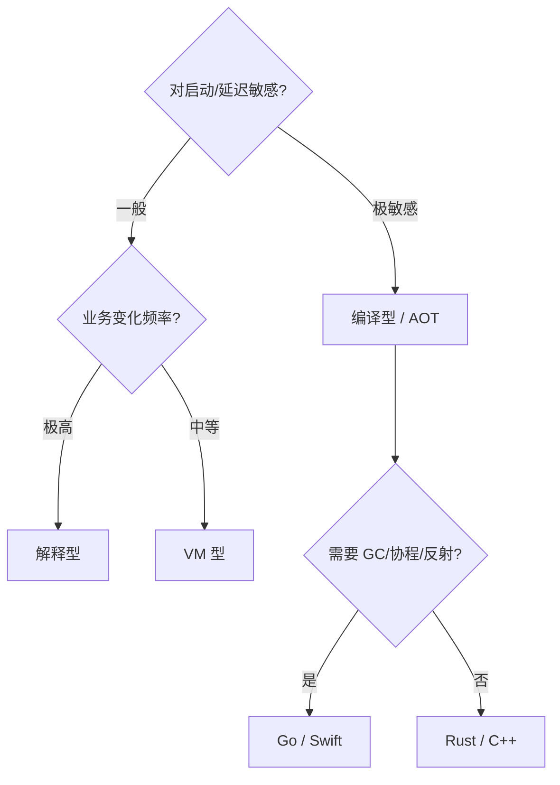

# 5.语言到机器的三种路线

> 📍 **本篇位置**：第 7 卷 · 编译与链接之道 · 第 5 篇（收官）
> 🎯 **核心矛盾**：**同样是"让 CPU 跑我的代码"，C/C++/Rust 编译一小时才能跑、Java 编几秒但启动要 3 秒、Python 几乎不编译但每次运行都比 C 慢 30 倍——这三种截然不同的路线，究竟是怎么被"逼出来"的？未来还有第四种吗？**
> 🧭 **设计灵魂**：语言到机器的路线不是"选好一种就行"，而是**在"翻译时刻、翻译产物、拼装时刻、优化时机、跨平台方式" 5 个坐标上找的不同均衡点**。三大主流路线覆盖了这条光谱的三个稳定区间——**理解了这三块，你就能给任何一门新语言在图上找到坐标**。
> 🌐 **跨平台覆盖**：C/C++/Rust（编译型）· Java/Kotlin/C#/Scala（VM 型）· Python/JavaScript/Lua/Ruby（解释型）· Go（AOT + Runtime 边界）· WebAssembly（新中间层）· GraalVM / .NET Native AOT（新趋势）
> 🔗 **延伸阅读**：← [7.4 ABI 与调用约定](./04.ABI与调用约定.md) · [2.5 字节码虚拟机执行](https://yccoding.com/pages/d0c877/) · [2.6 JIT 与运行时优化](https://yccoding.com/pages/f551ab/)

---

> 前 4 篇我们像拆一台发动机一样把编译-链接-加载全拆了。这一篇要把镜头拉到最远——**看整台车**：编译型、VM 型、解释型三条大路线，各自在解决什么矛盾，付出了什么代价，未来往哪走。

> 📢 **语言无关声明**
> 本篇讨论的是**所有编程语言在"如何跑起来"这个问题上的三大稳定选择**：
>
> - **编译型（AOT，Ahead-Of-Time）**：C / C++ / Rust / Swift / Go / Zig / Nim。
> - **VM 型（AOT + JIT 混合）**：Java / Kotlin / Scala / C# / F# / Clojure。
> - **解释型（Interpret / JIT）**：Python / JavaScript / Ruby / Lua / PHP。
> - **边界形态**：
>   - **Go**：形式上编译型，但自带 runtime，工程属性介乎两者之间。
>   - **WebAssembly**：新一代"通用字节码 + 静态验证"层，正在成为第四条路线的候选。
>   - **GraalVM Native Image / .NET Native AOT**：让 VM 型语言获得编译型的启动性能。

## 目录介绍

- [00.真实事故引入](#00真实事故引入)
- [01.根本矛盾：五个坐标](#01根本矛盾五个坐标)
- [02.编译型路线：把一切前置](#02编译型路线把一切前置)
- [03.VM 型路线：一半前置，一半留给运行时](#03vm-型路线一半前置一半留给运行时)
- [04.解释型路线：一切留到运行时](#04解释型路线一切留到运行时)
- [05.Go 与 WebAssembly：光谱上的新点](#05go-与-webassembly光谱上的新点)
- [06.同一段代码：三条路线全流程对照](#06同一段代码三条路线全流程对照)
- [07.经典陷阱与反模式](#07经典陷阱与反模式)
- [08.经典案例串讲](#08经典案例串讲)
- [09.一句话总结](#09一句话总结)

---

## 00.真实事故引入

### 0.1 同一个团队，三种技术栈的"发版体验"

> 【写作提纲】
> - 场景：一家公司三条业务线分别用 Rust / Java / Python。
> - 发版对比：Rust 编译 40 分钟、Java 3 分钟、Python 秒发；但 Rust 上线后零 P0、Java 首次抖动、Python 出过 3 次 `AttributeError`。
> - 冲击点：**代价没消失，只是从"发版环节"搬到了"运行环节"**。

### 0.2 同一段"加法"，三条路线跑完的耗时

> 【写作提纲】
> - C：程序启动 <1ms、加法执行几纳秒。
> - Java：启动 200ms、首次 30ns、稳态 3ns（JIT 起效）。
> - Python：启动 40ms、每次 300ns（解释器循环开销）。
> - 冲击点：**三种性能差 100 倍以上，全部源自"翻译时刻的选择"**。

### 0.3 灵魂三问

- **Q1**：都说"编译比解释快"——那为什么 V8 能让 JS 跑到 C 的 50%？
- **Q2**：Java 是编译型还是解释型？为什么争论了 20 年？
- **Q3**：GraalVM Native Image 把 Java 变成静态可执行——它到底"改变"了什么？

### 0.4 本篇的探索路径

先给出 5 个坐标 → 三条路线依次在坐标上打点 → 用同一段代码走三条路线做对照 → 最后看新趋势（Go / WASM / Native Image）在光谱上的位置。

---

## 01.根本矛盾：五个坐标

### 1.1 五个坐标决定"路线"

| 坐标 | 编译型 | VM 型 | 解释型 |
|------|-------|-------|-------|
| **翻译时刻** | 发布前 | 发布前 + 运行时 JIT | 运行时（每次） |
| **翻译产物** | 机器码 | 字节码 → 机器码 | AST / 字节码，常驻内存 |
| **拼装时刻** | 静态链接（多为） | 类加载（动态） | 每次 `import` |
| **优化时机** | 编译期（静态） | JIT（利用运行时信息） | 少量或无优化 |
| **跨平台方式** | 每平台重编 | 字节码一次编、平台一次翻 | 源码到处跑 |

### 1.2 五个坐标背后的三大矛盾

- **启动速度 vs 峰值性能**：越早翻译 → 启动快；越晚翻译 → 能用运行时信息做更好优化。
- **发布简单 vs 运行灵活**：编译型 = 一份二进制走天下；解释型 = 源码修改即生效。
- **可预测 vs 可自适应**：静态编译性能可预测；JIT/解释器性能会"忽然变好或变坏"。

### 1.3 三大路线的取舍地图


---

## 02.编译型路线：把一切前置

### 2.1 特征

- 翻译时刻：全部在发布前完成。
- 产物：目标平台的机器码。
- 拼装：静态或动态链接，任选。
- 跨平台：**为每个目标平台各编一次**。

### 2.2 优点

- **启动瞬间**：加载完就跑。
- **可预测的稳态性能**：无 JIT 抖动、无 GC 顿卡（如果没 GC）。
- **可跨语言 FFI**：ABI 层清晰（见 7.4）。
- **对小设备友好**：无 runtime、无解释器。

### 2.3 缺点

- **编译慢**：模板、宏、类型推导都在编译期完成 → C++/Rust 常见小时级 CI。
- **无法利用运行时信息**：所有优化决策都基于"编译时能看到的东西"。
- **发布多平台成本高**：iOS + Android + Linux + Windows + macOS 五份。

### 2.4 代表语言的路线细节

| 语言 | 前端 | 中端 | 后端 | 特色 |
|------|------|------|------|------|
| C | 简 | GIMPLE / LLVM IR | 平台后端 | 最纯的编译型 |
| C++ | 巨复杂 | 同上 | 同上 | 模板 = 编译期图灵完备 |
| Rust | rustc | MIR + LLVM IR | LLVM | 借用检查在前端 |
| Swift | swiftc | SIL + LLVM IR | LLVM | 支持 ARC 引用计数 |
| Go | gc | Go SSA | 自研 | 自带 runtime，特殊光谱位 |
| Zig | zig | 自研 IR + LLVM | LLVM | 编译期即执行（comptime） |

---

## 03.VM 型路线：一半前置，一半留给运行时

### 3.1 特征

- 翻译时刻：分两段——**发布前编译到字节码 + 运行时 JIT 到机器码**。
- 产物：字节码（平台无关） + 运行时机器码（平台相关）。
- 拼装：字节码在类加载时动态解析。
- 跨平台：**一次编译，处处 JIT**。

### 3.2 优点

- **一份产物跑所有平台**（"Write Once, Run Anywhere"）。
- **JIT 可利用运行时热点信息**：内联热函数、去虚化虚调用。
- **灵活的类加载**：热部署、动态代理、插件系统天然支持。
- **托管内存**：GC 让业务少犯 100 种指针错误。

### 3.3 缺点

- **启动慢**：类加载 + JIT 热身。
- **首次调用抖动**：JIT 前是解释执行。
- **额外内存**：需要携带 VM、GC、类元数据。
- **不适合冷启动敏感场景**：Serverless 首次触发被诟病多年。

### 3.4 代表语言的路线细节

| 语言 | 编译产物 | 运行时 | JIT/AOT |
|------|---------|-------|---------|
| Java | .class → JAR | JVM (HotSpot / OpenJ9 / GraalVM) | C1/C2/Graal JIT，可 Native Image AOT |
| Kotlin | 同 Java，或 JS/Native | JVM / JS / LLVM | 全谱 |
| C# | CIL / .dll | CLR | RyuJIT + Native AOT |
| Scala | .class | JVM | 同 Java |
| Clojure | 动态生成字节码 | JVM | 同 Java |

### 3.5 混合演进：AOT 的回归

- GraalVM Native Image：把 Java 静态编译成可执行文件。
- .NET Native AOT：把 C# 静态编译。
- 目的：**牺牲 JIT 峰值，换 Serverless 冷启动**——本质是在 5 个坐标上重新称重。

---

## 04.解释型路线：一切留到运行时

### 4.1 特征

- 翻译时刻：**每次运行都做一遍前 3 步**（词法/语法/字节码或直接遍历 AST）。
- 产物：字节码（内存中，可能落盘为 `.pyc`）。
- 拼装：全部字符串查表 → 动态到极致。
- 跨平台：**源码到处跑**（有解释器就行）。

### 4.2 优点

- **改代码即生效**：交互式 REPL、热重载。
- **极简部署**：源码 + 解释器就够了。
- **元编程强大**：运行时可以随意"改类"。
- **粘合能力**：脚本语言天生适合胶水层。

### 4.3 缺点

- **性能低**：解释循环的 dispatch 开销固有。
- **无类型检查安全网**：错误常到运行时才炸。
- **难以并行**：Python GIL、Ruby GVL 都是历史包袱。

### 4.4 现代解释型的救赎：JIT 也来了

- V8 (JS)：Ignition 解释器 + TurboFan JIT。
- PyPy (Python)：Tracing JIT，某些场景比 CPython 快 10 倍。
- LuaJIT：史上最快的 JIT 之一。
- **趋势**：**"解释型" 越来越像 "VM 型"** —— 界限在模糊。

---

## 05.Go 与 WebAssembly：光谱上的新点

### 5.1 Go：静态编译 + 自带 runtime

- 编译型的**编译速度 + 单文件部署**。
- VM 型的**GC + 协程调度**（无 VM 但有 runtime）。
- 相当于：**"没有 JIT 的托管语言"**——在启动和峰值间取了个特别的平衡。

### 5.2 WebAssembly：新一代通用字节码

- 一次编译，多平台"验证 + 执行"（浏览器 / 边缘 / Serverless）。
- 有静态类型、有栈式指令、有沙箱模型。
- 相当于：**"JVM 字节码"的现代重写版**，但更精简、更安全、更多语言支持。
- 未来赢家可能是：**"用 Rust/C++/Kotlin 写业务 → 编译到 WASM → 在任意平台跑"** 的组合。

### 5.3 三种趋势汇聚

- 编译型往**更快启动 + 更好跨平台**发展 → Zig、Rust。
- VM 型往**AOT + 更小 runtime**发展 → GraalVM、.NET AOT。
- 解释型往**更强 JIT**发展 → V8、PyPy。
- **三条路线正在向"更少的取舍、更好的均衡"收敛**。

---

## 06.同一段代码：三条路线全流程对照

### 6.1 三个 `add` 函数

```c
// C
int add(int a, int b) { return a + b; }
```

```java
// Java
public static int add(int a, int b) { return a + b; }
```

```python
# Python
def add(a, b): return a + b
```

### 6.2 三条流水线对照表

| 阶段 | C | Java | Python |
|------|---|------|--------|
| 前端翻译 | Clang → LLVM IR | javac → bytecode | 每次运行 → bytecode |
| 平台产物 | ELF/Mach-O/PE 机器码 | `.class` 字节码 | 内存中的 `code object` |
| 链接 | 静态或动态 | 类加载时 | `import` 时字典查询 |
| 首次执行 | 直接跳指令 | 解释 → JIT | 解释（可选 JIT） |
| 稳态性能 | 几纳秒 | 几纳秒（JIT 后） | 几百纳秒 |
| 启动开销 | ~1ms | ~200ms | ~40ms |

### 6.3 关键洞见

> **性能不是被"语言"决定的，是被"翻译时刻的选择"决定的**——一旦某个坐标改变，性能画像立刻改变。

---

## 07.经典陷阱与反模式

- **陷阱 1｜以为"C 一定比 Java 快"** → Java JIT 稳态可能反超（内联深度更大）。
- **陷阱 2｜以为"编译型 = 无 runtime"** → Go / Swift / Rust 都有 runtime（GC、ARC、异步）。
- **陷阱 3｜以为"解释型 = 慢"** → V8 / LuaJIT 在特定场景可打到 C 的 50%。
- **陷阱 4｜把"跨平台"和"字节码"绑死** → WASM 让编译型语言也能跨平台。
- **陷阱 5｜以为"启动快 = 峰值好"** → Native Image 启动秒杀 JIT，但稳态往往不如 JIT。
- **陷阱 6｜以为"选路线就是选语言"** → 现代语言常见多路线并存（Kotlin/JVM/JS/Native、C# JIT/AOT）。

---

## 08.经典案例串讲

### 8.1 案例：Discord 从 Go 迁到 Rust

> 【写作提纲】
> - 起因：Go GC 停顿在 P99 延迟场景不可接受。
> - 迁移后：无 GC → 稳态延迟稳定，代价是开发速度略降。
> - 关键洞察：**当业务对"可预测性"要求高时，编译型（无 GC）路线优势极大**。

### 8.2 案例：Cloudflare Workers 选 V8 而不是 JVM

> 【写作提纲】
> - 需求：毫秒级冷启动、多租户隔离。
> - 决策：V8 Isolate 启动只需微秒级，JVM 无法做到。
> - 关键洞察：**"启动开销"这一个坐标，就能否决一整条路线**。

### 8.3 案例：Kotlin Multiplatform 的"多路线"策略

> 【写作提纲】
> - 同一份 Kotlin 源码 → JVM 字节码 / JavaScript / LLVM 原生码。
> - 意味着：**语言路线不再和语言绑定，而是"编译目标"决定路线**。
> - 未来：更多语言会走"一源多编"路线（Rust → WASM、Java → Native Image）。

---

## 09.一句话总结

### 9.1 三层认知阶梯

- **青铜**：知道有"编译"和"解释"两种。
- **白银**：能说出 3 条路线各自的取舍。
- **黄金**：能用 5 个坐标给任何一门新语言画像，并预测它未来的演进方向。

### 9.2 决策树：给一个新项目选路线



### 9.3 七字真言

> **时刻、产物、代价**——**任何路线的选择都是"把代价搬到不同的时刻和不同的产物里"**。

### 9.4 全卷收官

- 7.1 拆开了流水线；
- 7.2 讲清了符号与重定位；
- 7.3 权衡了静态 vs 动态；
- 7.4 拆解了 ABI；
- 7.5 把它们组装回三条大路线。

**看完这五篇，你对"程序怎么跑起来"的理解，已经从"运行时" 前推到了"发布前"——正好补上第 2 卷的上游。**

---

## 🔗 延伸阅读

- 前置：[7.1 从源码到可执行](./01.从源码到可执行.md) · [7.2 符号表与重定位](./02.符号表与重定位.md) · [7.3 静态链接 vs 动态链接](./03.静态链接与动态链接.md) · [7.4 ABI 与调用约定](./04.ABI与调用约定.md)
- 承接：[2.5 字节码虚拟机执行](https://yccoding.com/pages/d0c877/) · [2.6 JIT 与运行时优化](https://yccoding.com/pages/f551ab/) · [2.1 类加载机制核心原理](https://yccoding.com/pages/74953e/)
- 拓展：[3.13 协程核心设计思想](https://yccoding.com/pages/5ebc69/) · [4.5 内存回收机制设计](https://yccoding.com/pages/8327cf/)
