## 01.通用架构设计方案

> **本篇定位**：架构是所有方案的"地基"，但绝大多数团队谈架构都停留在"MVC/MVP/MVVM 三个字母的选择题"上。本文从一次因架构缺失导致的 200 万损失事故讲起，从底层的"复杂度守恒定律"出发，把架构还原成一门**在耦合、可测性、演进成本之间做联合最优化**的工程学。读完这一篇，就能在方案评审里回答"我们为什么这样切、代价是什么、什么时候必须重构"这三个决定架构生死的问题。

- [01.通用架构设计方案](#01通用架构设计方案)
- [1. 案例引入](#1-案例引入)
  - [1.1 一段反常代码](#11-一段反常代码)
  - [1.2 顺藤摸到根因](#12-顺藤摸到根因)
  - [1.3 我们要回答什么](#13-我们要回答什么)
- [2. 架构概览](#2-架构概览)
  - [2.1 架构决策三角](#21-架构决策三角)
  - [2.2 为什么这么切](#22-为什么这么切)
- [3. 复杂度守恒律](#3-复杂度守恒律)
  - [3.1 复杂度不可消灭](#31-复杂度不可消灭)
  - [3.2 本质与偶然复杂度](#32-本质与偶然复杂度)
  - [3.3 熵增与腐坏定律](#33-熵增与腐坏定律)
  - [3.4 边界即是价值](#34-边界即是价值)
- [4. 依赖倒置本质](#4-依赖倒置本质)
  - [4.1 依赖方向决定命运](#41-依赖方向决定命运)
  - [4.2 抽象层的物理边界](#42-抽象层的物理边界)
  - [4.3 稳定依赖原则证明](#43-稳定依赖原则证明)
  - [4.4 依赖注入的代价](#44-依赖注入的代价)
- [5. 分层演化脉络](#5-分层演化脉络)
  - [5.1 MVC 诞生原因](#51-mvc-诞生原因)
  - [5.2 MVP 被动化改造](#52-mvp-被动化改造)
  - [5.3 MVVM 响应式跃迁](#53-mvvm-响应式跃迁)
  - [5.4 单向数据流终局](#54-单向数据流终局)
- [6. 三种模式解剖](#6-三种模式解剖)
  - [6.1 MVC 数据流剖析](#61-mvc-数据流剖析)
  - [6.2 MVP 契约爆炸原理](#62-mvp-契约爆炸原理)
  - [6.3 MVVM 绑定的代价](#63-mvvm-绑定的代价)
  - [6.4 三模式指标对比](#64-三模式指标对比)
- [7. 分层依赖法则](#7-分层依赖法则)
  - [7.1 单向依赖铁律](#71-单向依赖铁律)
  - [7.2 跨层调用禁忌](#72-跨层调用禁忌)
  - [7.3 洋葱与端口适配](#73-洋葱与端口适配)
  - [7.4 依赖规则可执行化](#74-依赖规则可执行化)
- [8. 架构常见反例](#8-架构常见反例)
  - [8.1 过度设计反例](#81-过度设计反例)
  - [8.2 欠缺设计反例](#82-欠缺设计反例)
  - [8.3 选型错配反例](#83-选型错配反例)
  - [8.4 隐式循环反例](#84-隐式循环反例)
- [9. 演进与治理](#9-演进与治理)
  - [9.1 V1 单体启动](#91-v1-单体启动)
  - [9.2 V2 分层规范](#92-v2-分层规范)
  - [9.3 V3 组件治理](#93-v3-组件治理)
  - [9.4 何时该重构](#94-何时该重构)
- [10. 综合案例串讲](#10-综合案例串讲)
  - [10.1 案例真相揭晓](#101-案例真相揭晓)
  - [10.2 一个需求的一生](#102-一个需求的一生)
  - [10.3 设计哲学回扣](#103-设计哲学回扣)
  - [10.4 架构速查表](#104-架构速查表)


## 1. 案例引入

### 1.1 一段反常代码

某电商 App 上线 3 年，某次产品提了一个看似简单的需求："**登录后给老用户弹一张优惠券**"。开发在 `MainActivity` 里加了如下 12 行代码：

```java
// MainActivity.java —— 4200 行超大 Activity 的最后 12 行
@Override
protected void onResume() {
    super.onResume();
    if (UserManager.INSTANCE.isLogin()                       // ① 静态单例
        && UserManager.INSTANCE.getUser().isVip()             // ② 依赖 getUser 已就绪
        && CouponConfig.enable                                // ③ 全局配置变量
        && !CouponCache.get().hasShownToday()) {              // ④ 静态缓存
        Coupon c = CouponService.getInstance().fetchNew();    // ⑤ 同步网络调用
        new CouponDialog(this, c).show();                     // ⑥ 依赖 c 非空
    }
}
```

**看起来毫无问题**——静态方法调用、null 判断齐全、逻辑清晰。上线后监控看板显示：

```
灰度前 12 小时:  日活 210 万 崩溃率 0.08%
灰度后 12 小时:  日活 172 万 崩溃率 3.6%（暴涨 45 倍）
Top1 崩溃堆栈:   NullPointerException @ CouponDialog.<init>
影响用户:        约 63 万老用户闪退
直接损失:        丢单约 200 万
```

**代码只加了 12 行、每行都做了 null 判断、UT 覆盖率 100%，为什么线上炸了？**

### 1.2 顺藤摸到根因

抓 Crash 堆栈发现，`CouponDialog` 构造函数里第 3 行 `coupon.getTitle()` NPE。倒推链路：

- `CouponService.getInstance().fetchNew()` 在**弱网**下抛 `TimeoutException` 被外层默默吞掉，`c` 为 null；
- 但 IDE 静态分析显示 `fetchNew()` 声明返回 `@NonNull`——因为 3 年前它被标注过；
- 3 年间这个方法被 4 个团队各改过一次，某次悄悄改成"超时返回 null"，但注解没同步；
- `MainActivity` 已经 4200 行，谁也不敢通读，没人发现问题。

深挖发现 **12 行代码依赖了 11 个"你必须相信它已就绪"的隐含前提**：

| 隐含前提 | 谁负责保证？ | 3 年后是否还成立？ |
|---|---|---|
| `UserManager` 单例已初始化 | Application.onCreate | ✅ |
| `getUser()` 已从磁盘反序列化 | UserManager 内部异步任务 | ⚠️ 冷启动前 300ms 内可能未完成 |
| `CouponConfig.enable` 已从服务端拉取 | ConfigService 异步拉取 | ⚠️ 弱网可能超时 |
| `CouponCache` 已初始化 | 首次 get 时懒加载 | ✅ |
| `fetchNew()` 保证非 null 返回 | **注解已过期 3 年** | ❌ 已破坏 |
| ... | ... | ... |

**真正的根因不是这 12 行代码，而是过去 3 年没有人定义过"什么逻辑应该写在哪一层、依赖关系该如何声明"。**

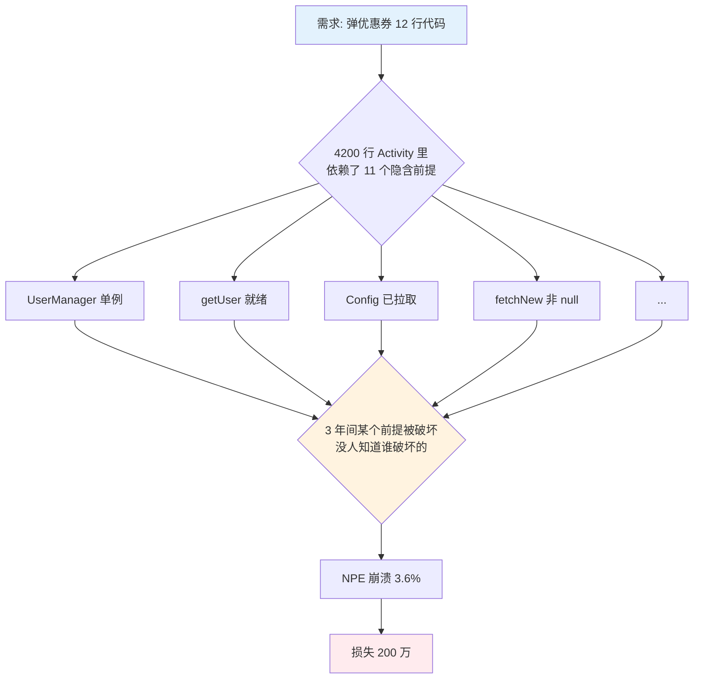

### 1.3 我们要回答什么

带着这个 200 万的痛，本文要**逐一回答**下面 7 个问题：

- **Q1**：架构真正解决的是什么问题？为什么 12 行代码能引发 3.6% 崩溃？
- **Q2**：复杂度真的能"通过好架构消灭"吗？还是只能"搬家"？
- **Q3**：MVC 为什么会演化成 MVP 又演化成 MVVM？每次演化解决的痛点是什么？
- **Q4**：三种模式的可测试性、代码量、性能开销的量化差距是多少？
- **Q5**：分层依赖的"单向铁律"，用什么工程手段能真正执行？
- **Q6**：过度设计和欠缺设计的边界在哪？有没有量化指标？
- **Q7**：什么时候该从 V1 演进到 V2 到 V3？信号是什么？

后续 8 章会依次拆解，第 10 章统一回扣。

## 2. 架构概览

### 2.1 架构决策三角

先建立总图。架构不是"选一个模式"，而是**在三个维度上做联合决策**：

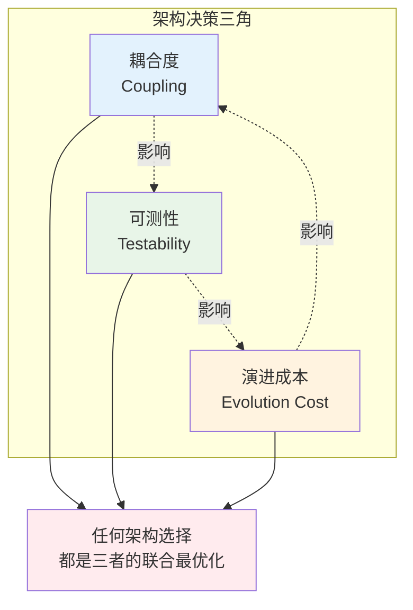

**三维含义**：

| 维度 | 指标 | 反例 |
|---|---|---|
| **耦合度** | 改一个类，直接受影响的类数量 | Activity 依赖 11 个单例 → 耦合度 = 11 |
| **可测性** | 不启动 UI 能测试的逻辑比例 | 逻辑在 Activity 里 → 可测性 ≈ 0% |
| **演进成本** | 新增一个类似需求需要改动的模块数 | 加个新弹窗要看 4200 行 → 成本极高 |

三者互相牵制：**降耦合往往靠增加抽象层，抽象层带来更多模块；提升可测性要求 Mock，Mock 又依赖接口——每一个动作都在这三角上移动**。

### 2.2 为什么这么切

为什么用这三个维度，而不是用"性能、扩展性、健壮性"这些常见词？

**疑惑**：性能、扩展性不应该是架构的核心吗？

**论证**：
1. 性能主要由**算法 + 硬件**决定，架构最多影响常数因子（如多一次抽象调用 = 几 ns）。
2. 扩展性是个模糊词——真正可度量的"扩展性"就是"改动成本"，本质是**演进成本**的一部分。
3. 健壮性是**结果**而非原因——耦合度低、可测性高的架构自然健壮。

**结论**：**架构真正能撬动的只有耦合、可测、演进三件事**。性能是硬件的事，健壮性是前三者的果。所以本文所有章节都会围绕这三角展开。

## 3. 复杂度守恒律

### 3.1 复杂度不可消灭

**疑惑**：好架构不是能"消灭复杂度"吗？为什么 §1 那个团队引入 MVP 之后代码量还是暴涨？

**论证**：软件复杂度类似热力学第二定律，服从"守恒"：

$$
C_{\text{总}} = C_{\text{本质}} + C_{\text{偶然}}
$$

- $C_{\text{本质}}$：业务本身的固有难度（金融风控规则、并发一致性）——**架构无能为力**。
- $C_{\text{偶然}}$：因为组织方式差带来的额外难度（全局变量、循环依赖）——**架构能压到最低**。

**架构的作用不是消灭复杂度，而是把复杂度"搬到最容易管理的地方"**：

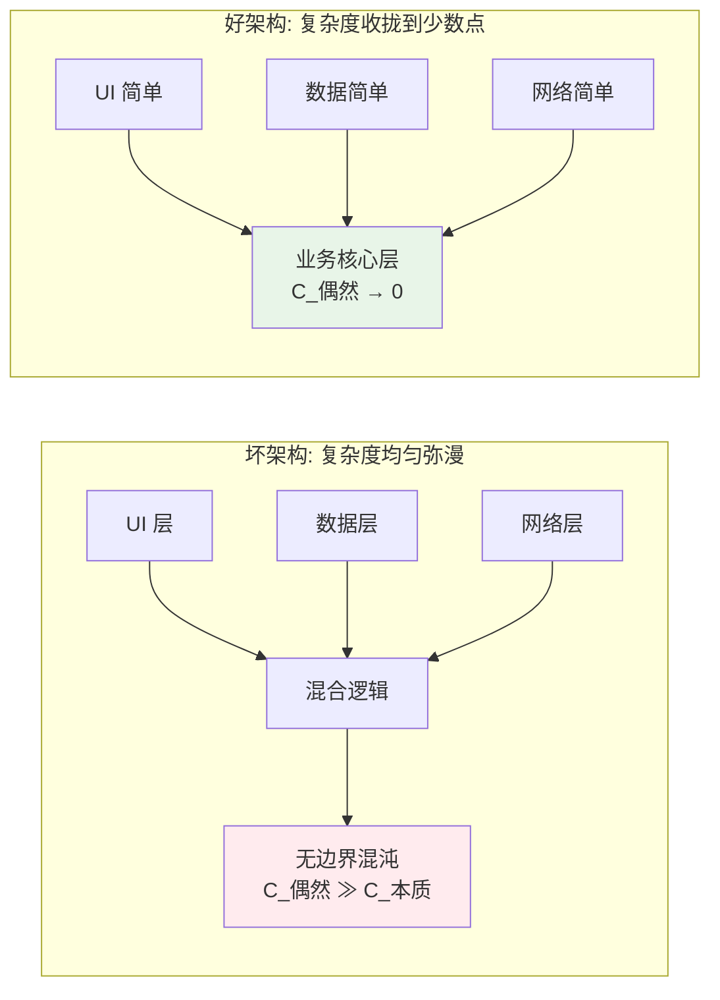

**结论**：架构的价值 = **降低 $C_{\text{偶然}}$**。所有关于"减代码量、少加类"的争论如果没考虑到偶然复杂度是否降低了，都是伪命题。

**复杂度的三种可度量方法**——光说"复杂度"是空的，必须有数字才能评判架构好坏：

| 度量方法 | 测什么 | 公式 | 能测偶然复杂度吗 |
|---|---|---|---|
| **McCabe 圈复杂度** | 单函数分支密度 | $V(G) = E - N + 2P$（边-节点+连通块） | 部分（高圈复杂度常源于偶然嵌套） |
| **Halstead 指标** | 代码词汇量 | $N = N_1 + N_2$（运算符+操作数总数） | 弱（词汇多≠偶然复杂） |
| **变更传播代价 CPM** | 改一个模块波及多少模块 | $\text{CPM}(m) = \lvert \text{Ripple}(m) \rvert$ | **强**（直接量化耦合传染） |

**关键洞察**：McCabe 和 Halstead 测的是"局部难度"，CPM 测的是"架构耦合度"。**评判架构好坏必须用 CPM**——因为架构的本质是管理依赖，而 CPM 直接度量依赖的传染性。§1 那个 4200 行 Activity 的 CPM = 11（改它波及 11 个模块），这才是它"碰不得"的真正原因。

**偶然复杂度的五种典型来源**（架构能消灭的都在这五类里）：

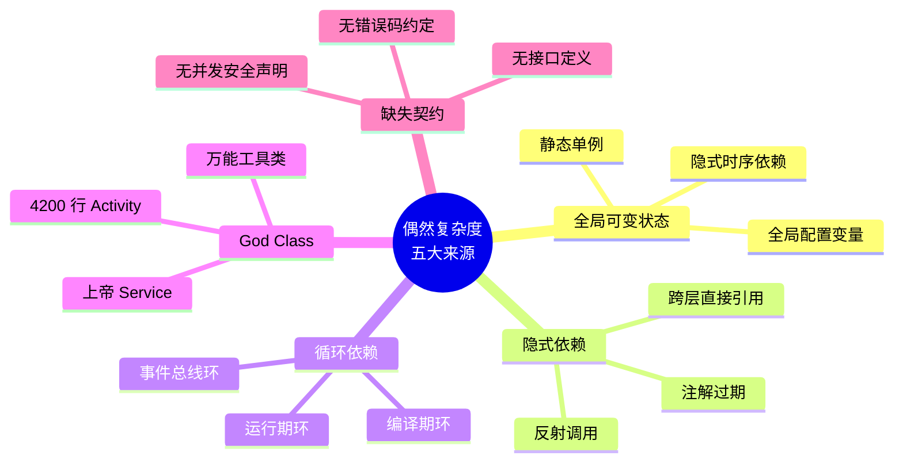

§1 的 12 行代码命中了其中 4 类（全局状态、隐式依赖、God Class、缺失契约），所以 $C_{\text{偶然}} / C_{\text{总}} \approx 80\%$——正好压在 Brooks 给的上限。

### 3.2 本质与偶然复杂度

Fred Brooks 在《No Silver Bullet》里给的经验值：**大型软件中偶然复杂度占总复杂度的 60%~80%**。这就是"架构价值"的天花板——**理论上一个理想架构能消除的复杂度是原代码的 60%~80%**。

回到 §1 那 12 行代码：本质复杂度是"给老用户弹优惠券"（≈ 3 行代码就够），偶然复杂度是"11 个隐含前提校验 + 单例依赖 + null 处理"（≈ 9 行代码 + 无数隐藏耦合）。**80% 都是偶然复杂度**——这就是可以被架构消灭的部分。

### 3.3 熵增与腐坏定律

**疑惑**：好架构上线时很整齐，为什么 3 年后总会腐坏？

**论证**：软件系统天然熵增。每次改动都会**局部破坏架构约束**：

| 时间 | 违规次数 | 累积效应 |
|---|---|---|
| 上线 | 0 | 架构清晰 |
| 6 个月 | 5 | 局部有点乱 |
| 1 年 | 20 | 出现 3 处循环依赖 |
| 2 年 | 100+ | 已经找不到"这个逻辑应该改在哪" |
| 3 年 | ∞ | §1 的那 4200 行 Activity |

**熵增速率不是常数**——它受三个因子放大：

$$
\frac{dS}{dt} = \alpha \cdot \underbrace{N_{\text{dev}}}_{\text{团队规模}} \cdot \underbrace{f_{\text{change}}}_{\text{变更频率}} \cdot \underbrace{(1 - \rho_{\text{guard}})}_{\text{约束缺失度}}
$$

- $\alpha$：基础熵增系数（与语言、领域相关，遗留代码 $\alpha$ 更大）
- $N_{\text{dev}}$：并行开发人数——**人越多违规机会指数级增长**（$N$ 人间通信路径 = $N(N-1)/2$）
- $f_{\text{change}}$：每周变更次数——敏捷迭代 $f$ 高，熵增快
- $\rho_{\text{guard}}$：约束覆盖率——CI 规则、ArchUnit、Code Review 覆盖的代码比例

**关键洞察**：$\rho_{\text{guard}}$ 是唯一能被架构主动控制的因子。$\rho = 0$（无约束）时熵增最快；$\rho = 1$（全量约束）时熵增趋近于 0。**这就是为什么 §7.4 的"依赖规则可执行化"是架构生命线**——它把 $\rho$ 从 0 推向 1。

**抑制熵增的三层防御**：

| 层级 | 机制 | 作用阶段 | 成本 |
|---|---|---|---|
| L1 编译期 | 类型系统、访问修饰符、模块边界 | 违规发生前阻止 | 极低 |
| L2 CI 期 | ArchUnit、detekt、lint、依赖分析 | 违规进主干前拦截 | 低 |
| L3 评审期 | Code Review、ADR（架构决策记录） | 设计阶段劝阻 | 中（人力） |

**三层必须叠加**——只靠 Code Review（L3）的团队，熵增速率取决于 reviewer 精力；只靠 CI（L2）的团队，规则一旦滞后就失效。**真正稳态的架构是 L1+L2+L3 三层闭环**。

**结论**：**架构不是一次性建成，而是持续对抗熵增的过程**。这引出了第三个核心认知——**边界必须可执行**（见 §7.4）。

### 3.4 边界即是价值

**架构真正提供的价值**不是"漂亮的分层图"，而是**边界**：

> **边界 = 一条你违反了就会立刻被 CI 拦下的规则**

有边界，才有降低耦合的强制力；有边界，才有单向依赖；有边界，才能让新人第一天就知道"代码该写在哪"。**§1 那个团队真正缺的不是 MVC/MVP/MVVM 的选择，而是任何一条能强制执行的边界**。

## 4. 依赖倒置本质

### 4.1 依赖方向决定命运

架构里最核心的一条原理是 **DIP（依赖倒置）**——上层不应该依赖下层，两者都依赖抽象。

**疑惑**：为什么"改依赖方向"能降低耦合？

**论证**（用图证明）：

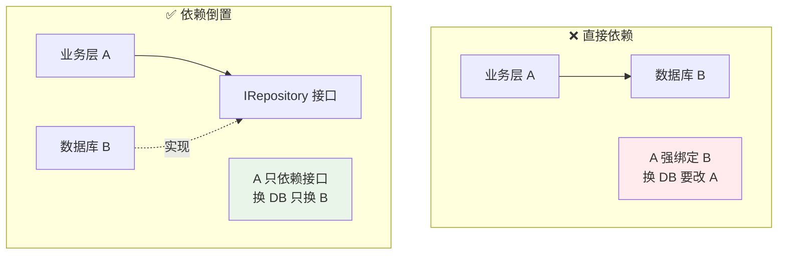

- 直接依赖：耦合度 $\text{Coupling}(A, B) = 1$，且 A 变化 B 也可能被迫变。
- 依赖倒置：耦合度 $\text{Coupling}(A, I) = 1$，$\text{Coupling}(B, I) = 1$，A 和 B **在编译期完全解耦**。

**结论**：把依赖箭头指向"更稳定"的接口层，是所有架构模式共同的底层原理。**MVP、MVVM、Clean Architecture、Hexagonal Architecture 全部是这条原理的不同落地**。

### 4.2 抽象层的物理边界

抽象接口层通常在**独立的目录/包/模块**里，物理上就把上下层隔开：

```
📦 app/
├── 📦 domain/           ← 抽象接口层（稳定）
│   ├── IUserRepository
│   └── IPaymentService
├── 📦 data/             ← 数据实现
│   └── UserRepositoryImpl (implements IUserRepository)
├── 📦 net/              ← 网络实现
│   └── PaymentServiceImpl (implements IPaymentService)
└── 📦 ui/               ← UI 层
    └── LoginActivity (only depends on domain)
```

**关键点**：ui/ 目录只需要在编译时能看到 domain/，**根本不需要看到 data/、net/**。这从物理上杜绝了"UI 直接调数据库"的可能。

### 4.3 稳定依赖原则证明

Robert C. Martin 在《敏捷软件开发》里提出：**依赖必须指向更稳定的方向**。稳定度用数字量化：

$$
I = \frac{C_e}{C_a + C_e}
$$

- $C_a$（Afferent Coupling）：**被谁依赖**的数量（进箭头）
- $C_e$（Efferent Coupling）：**依赖谁**的数量（出箭头）
- $I \in [0, 1]$：不稳定度。$I=0$ 最稳定（只被别人依赖），$I=1$ 最不稳定。

**规则**：依赖箭头只能从**高 I 值**指向**低 I 值**。

回到 §1 的例子：

| 模块 | $C_a$ | $C_e$ | $I$ | 说明 |
|---|---|---|---|---|
| MainActivity | 0 | 11 | 1.0 | 完全不稳定（依赖 11 个东西） |
| UserManager | 15 | 3 | 0.17 | 稳定（被 15 个地方用） |
| CouponConfig | 8 | 0 | 0.0 | 极稳定 |

MainActivity 依赖 UserManager 是**符合规则的**（从 I=1.0 → I=0.17），问题不在这。**问题在于 MainActivity 里塞了本该拆到独立层的逻辑**，让它 $C_e$ 高到无法维护。

**公式为什么是这样**——$I = C_e / (C_a + C_e)$ 的设计意图：

- 分子 $C_e$（出箭头）= "我依赖别人" = **我不稳定的来源**
- 分母 $C_a + C_e$ = 总耦合度（进出箭头和）
- 比值 = "我对外的依赖占总耦合的比例"

极端情况验证：只被依赖、不依赖任何人（$C_e = 0$）→ $I = 0$ → 最稳定；只依赖别人、无人依赖它（$C_a = 0$）→ $I = 1$ → 最不稳定。**公式符合直觉**。

**违反 SDP 的后果**：若依赖箭头从 $I=0.2$（稳定）指向 $I=0.8$（不稳定），意味着"稳定的东西依赖了不稳定的东西"——不稳定模块一改，稳定模块被迫跟着改，**稳定性被反向污染**。这就是"上层依赖下层"看似自然、实则危险的根本原因。

**SDP 的伴生原则 SAP（稳定抽象原则）**——Robert Martin 给出的对偶原则：

> **稳定度与抽象度成正比**：越稳定的模块应越抽象，越不稳定的模块应越具体。

定义抽象度 $A \in [0, 1]$（抽象类/接口占该模块类的比例）。SAP 要求 $A$ 与 $I$ 满足主序列 $A + I \approx 1$：

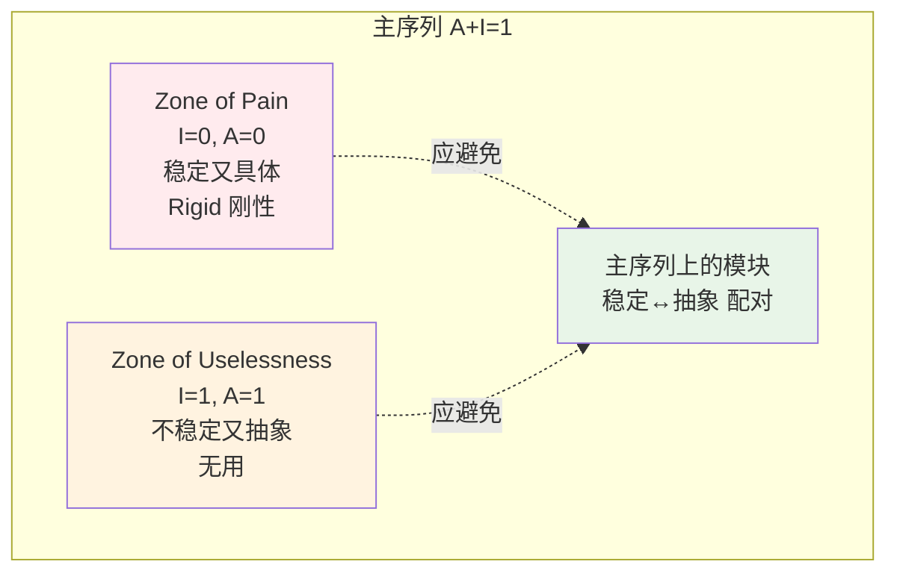

- **痛苦区**（$I=0, A=0$）：稳定又具体——改不动又不能换（如硬编码工具类被全工程依赖）
- **无用区**（$I=1, A=1$）：不稳定又抽象——天天变但没人用（过度设计的接口）
- **主序列**（$A+I \approx 1$）：稳定↔抽象配对——稳定接口被多人依赖，具体实现可随时替换

**SDP + SAP 联合才是完整的依赖治理**：SDP 管"箭头方向"，SAP 管"箭头两端的形态"。§1 那个 `UserManager`（$I=0.17$, $A=0$——具体类）就落在痛苦区，被 15 处依赖又无法替换——这就是它成为"全工程地雷"的数学原因。

### 4.4 依赖注入的代价

DIP 的落地手段是 **DI（依赖注入）**——把依赖从"内部 new 出来"改成"外部传进来"。但 DI 不是免费的：

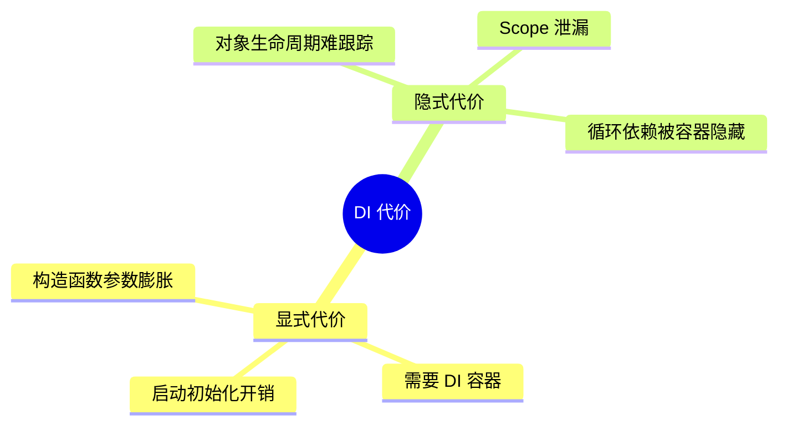

**权衡**：小项目（< 10 个类）用 DI 是负收益，直接 new 即可；大项目不用 DI 会窒息。**阈值经验：类数 > 100 或跨模块调用 > 20 处**，就该上 DI 容器。

## 5. 分层演化脉络

### 5.1 MVC 诞生原因

**1979 年，Trygve Reenskaug 在 Smalltalk-80 里首次提出 MVC**。当时要解决的问题极具体：

**疑惑**：Smalltalk 的图形界面代码全部混在一个 Class 里，一个"改变按钮颜色"的动作居然要修改"数据模型代码"——为什么？

**论证**：因为当时的编程语言还没有"事件"概念。UI 改动是通过**过程调用 + 全局变量修改**实现的。所有代码都在同一个入口点。

**结论**：MVC 的第一次贡献是**把"数据"和"表现"从代码层面切开**——Model 管数据、View 管展示、Controller 管衔接。这是 GUI 编程史上第一次分层。

### 5.2 MVP 被动化改造

**1990 年代，Mike Potel 在 IBM 提出 MVP**。要解决的痛点变了：

**疑惑**：MVC 里 View 会订阅 Model 的变化（观察者模式），导致 View 依赖 Model 结构。想给 View 写单元测试？必须启动 UI 框架。**GUI 单元测试怎么做？**

**论证**：Potel 的方案是"**View 变被动**"——View 完全不知道 Model 存在，所有逻辑收敛到 Presenter，Presenter 通过接口调 View：

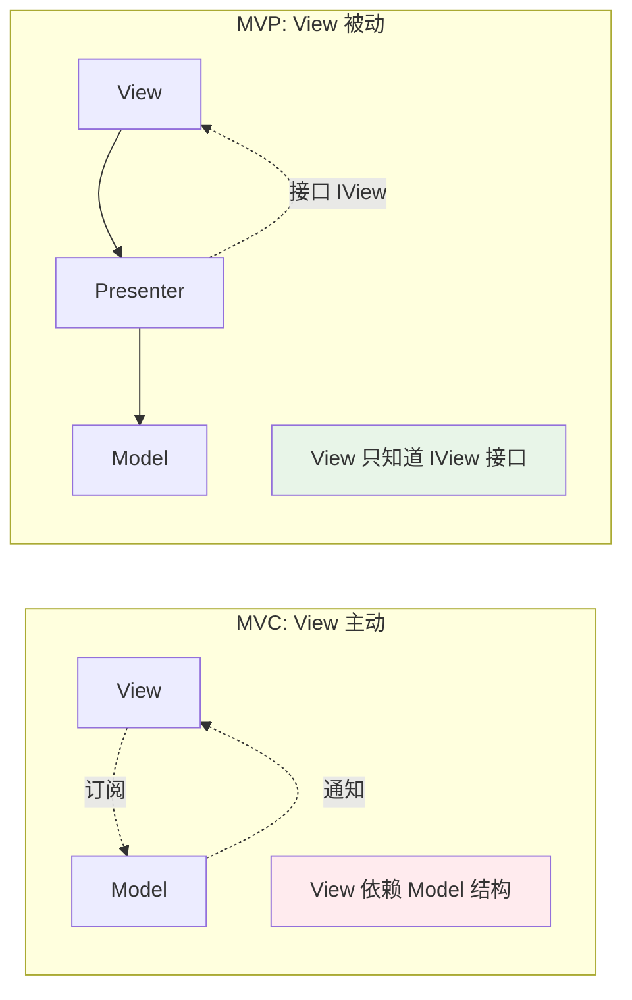

单元测试时 Mock 一个 `IView` 实现，**完全不启动 UI 就能测 100% 表现逻辑**。

**结论**：MVP 的核心贡献是**让 GUI 变得可测**。代价是接口爆炸（每个页面 1 IView + 1 IPresenter），代码量增加 40~80%。

### 5.3 MVVM 响应式跃迁

**2005 年，微软 WPF 团队提出 MVVM**。痛点又变了：

**疑惑**：MVP 里 Presenter 里到处是 `view.setText("...")` 这种命令式代码。XAML 已经能声明式写 `<TextBlock Text="{Binding userName}"/>`，为什么 Presenter 里还要一句句手写 setter？

**论证**：微软引入了**数据绑定**——ViewModel 只暴露状态和命令，View 通过绑定语法自动响应变化：

```
<!-- View 声明式绑定 -->
<Button Content="{Binding LoginText}"
        Command="{Binding LoginCommand}"
        IsEnabled="{Binding CanLogin}"/>

<!-- ViewModel: 完全不知道 View -->
class LoginViewModel {
    val loginText = MutableState("Login")
    val canLogin = MutableState(true)
    val loginCommand = Command { doLogin() }
}
```

**关键跃迁**：ViewModel **完全不持有 View 引用**——比 MVP 的"接口引用"更彻底。这是**响应式编程范式**在 GUI 里的第一次落地。

**结论**：MVVM 的核心贡献是**用声明式绑定消除命令式 UI 更新代码**。代价是"数据流变隐式"，Debug 时链路容易断在绑定框架内部。

### 5.4 单向数据流终局

**2013 年，Facebook 提出 Flux / Redux**：**数据流强制单向**，所有状态变更走 Action → Reducer → Store → View 一个方向：

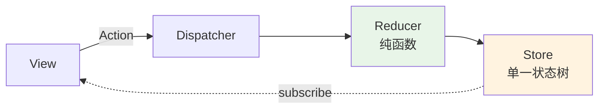

**这是分层演化的终局**——彻底消灭了"View 直接改 Model 又直接改 View"的循环。Compose、SwiftUI、Vue 3 的 Composition API、Jetpack MVI 全部走这条路。

**演化总览**：

| 阶段 | 年份 | 解决痛点 | 代价 |
|---|---|---|---|
| MVC | 1979 | GUI 与业务分离 | View 仍依赖 Model |
| MVP | 1990s | GUI 可测试 | 接口爆炸 |
| MVVM | 2005 | 声明式 UI | 数据流隐式 |
| MVI/Redux | 2013+ | 单向数据流 | 状态膨胀 |

**每一次演化都是解决前一代留下的具体痛点，不是"更先进"**。

**演化的统一驱动力模型**——四代演化不是随机发生，而是遵循同一个"约束-痛点-跃迁"循环：

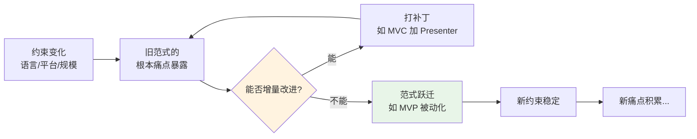

**四代演化的驱动力对照**：

| 演化 | 约束变化 | 旧范式根本痛点 | 能否增量补 | 跃迁方式 |
|---|---|---|---|---|
| MVC→MVP | 测试成为刚需 | View 依赖 Model 结构，无法脱离 UI 测试 | 否（结构耦合） | View 被动化 |
| MVP→MVVM | 声明式 UI 出现 | Presenter 满是命令式 setter | 否（范式冲突） | 数据绑定 |
| MVVM→MVI | 状态管理复杂化 | 双向绑定状态来源不清 | 否（状态爆炸） | 单向数据流 |

**关键洞察**：**演化的触发条件是"旧范式的根本痛点无法用增量改进解决"**。MVC 加个 Presenter 就能测？不行——View 订阅 Model 的结构耦合是范式级的，不是补丁能修。这就是为什么演化是"跃迁"而非"改进"。

**演化的终止条件**——MVI/Redux 是终局吗？**不是**。当前 MVI 痛点是"状态树膨胀"和"副作用管理复杂"，下一个可能的跃迁方向是**响应式副作用编排**（如 Compose 的 Effect API、Redux Toolkit 的 listener middleware）。**只要约束还在变，演化就不会停**。

## 6. 三种模式解剖

### 6.1 MVC 数据流剖析

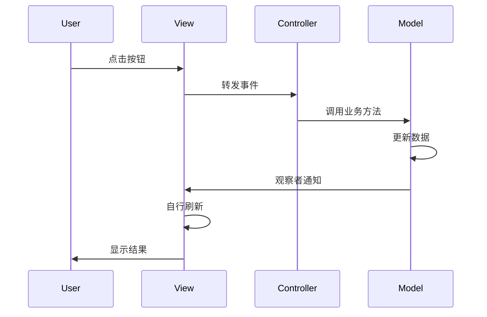

**MVC 的"原罪"**：View 会订阅 Model 变化，所以 **View 必须知道 Model 长什么样**。这是后来 MVP 要切断的那条边。

**Android 特有的畸形**：Android 里 `Activity` 既是 Controller 又是 View 的容器。XML 是 View，但布局逻辑（动态显隐、颜色变化）只能写在 Activity 里，于是 Activity 就胀成了"超级类"——**§1 那个 4200 行 Activity 就是这么长出来的**。

### 6.2 MVP 契约爆炸原理

**疑惑**：MVP 号称降低耦合，为什么实际用起来代码量翻倍？

**论证**：每个页面需要定义完整的 **Contract**：

```kotlin
// 一个简单登录页面的 MVP 契约
interface LoginContract {
    interface View {
        fun showLoading()
        fun hideLoading()
        fun showError(msg: String)
        fun navigateToHome()
        fun setLoginEnabled(enabled: Boolean)
        // ...每加一个 UI 行为就多一个方法
    }
    interface Presenter {
        fun onLoginClicked(user: String, pwd: String)
        fun onDestroy()
        // ...
    }
}

class LoginPresenter(private val view: LoginContract.View) : LoginContract.Presenter {
    override fun onLoginClicked(user: String, pwd: String) {
        view.showLoading()
        // ... 30 行业务逻辑
    }
}

class LoginActivity : AppCompatActivity(), LoginContract.View {
    private val presenter = LoginPresenter(this)
    override fun showLoading() { progressBar.visibility = VISIBLE }
    override fun hideLoading() { progressBar.visibility = GONE }
    // ... 每个接口方法都要实现
}
```

**代码量对比**（同一个登录页面）：

| 模式 | 类数 | 代码行数 | 单测覆盖上限 |
|---|---|---|---|
| MVC | 1 | 120 | 30% |
| MVP | 4 | 220 | 95% |
| MVVM | 2 | 150 | 90% |

**结论**：MVP 用"接口爆炸"的代价换来了可测性。**这个代价对于 10 页面以下的项目是过高的**，对 50+ 页面且有强测试要求的项目是划算的。

### 6.3 MVVM 绑定的代价

**疑惑**：MVVM 号称"View 完全被动"，代价在哪？

**论证**：绑定框架本身有性能开销。以 Android LiveData 为例：

```
LiveData.observe() 每次注册:
  1. 创建 LifecycleBoundObserver 对象  ≈ 50 ns
  2. 关联 LifecycleOwner              ≈ 20 ns
  3. 注册到 mObservers Map            ≈ 100 ns

LiveData.setValue() 每次触发:
  1. 遍历所有 Observer                ≈ N × 30 ns
  2. 主线程 dispatch                  ≈ 200 ns
```

**响应式绑定的代价不止性能——它是"三重税"，任何响应式系统（不只 LiveData）都要交**：

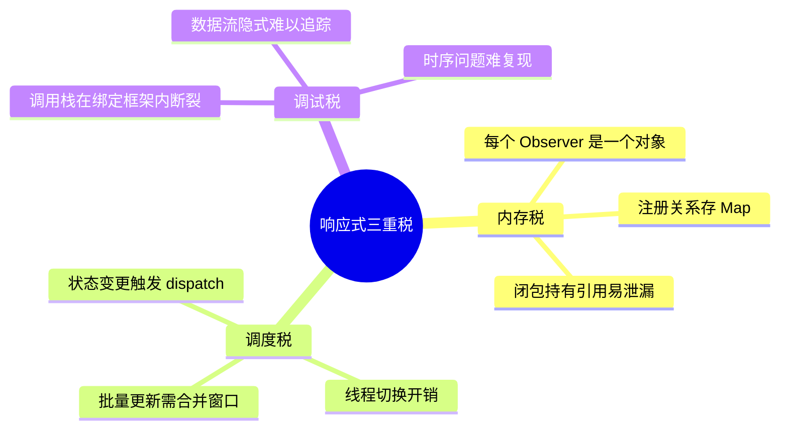

**三重税的量化**：

| 税种 | 单次开销 | 放大场景 | 后果 |
|---|---|---|---|
| 内存税 | Observer ≈ 50 ns + 80 字节 | 100 Cell × 5 Observer | 40 KB + 注册耗时 |
| 调度税 | dispatch ≈ 200 ns/Observer | 60 帧 × 500 Observer | 6 ms/帧（掉帧） |
| 调试税 | 断点跳进框架内部 | 任何 Bug | 排查时间 ×3 |

**内存税和调度税是可量化的性能问题，调试税是不可量化的工程效率问题**——后者往往更致命，因为它让线上问题变得"无法定位"。

**这在单个页面完全无感（1000 ns 尺度），但在列表 Cell 高频复用时会放大**：

| 场景 | Cell 数 | 每 Cell Observer | 滑动 1s 触发次数 | 总开销 |
|---|---|---|---|---|
| 简单列表 | 10 | 2 | 60 帧 | 3.6 ms |
| 复杂列表 | 100 | 5 | 60 帧 | 90 ms（**掉帧**） |

**结论**：**列表 Cell 场景禁用 MVVM 绑定**，用普通 ViewHolder + setter 即可。这就是为什么 Compose 团队后来加了 `remember` 优化——正是为了缓解这个问题。

### 6.4 三模式指标对比

用架构决策三角量化对比：

| 维度 | MVC | MVP | MVVM |
|---|---|---|---|
| **耦合度**（View→Model） | 高 | 无（接口） | 无（绑定） |
| **可测性**（不启 UI 测比例） | 30% | 95% | 90% |
| **演进成本**（加新 UI 行为） | 改 1 处 | 改 4 处（Contract） | 改 2 处 |
| **代码量**（同页面） | 100% | 180% | 125% |
| **性能开销** | ≈0 | ≈0 | 3-5% |
| **学习曲线** | 1 天 | 3 天 | 1 周 |
| **推荐团队规模** | 3-8 人 | 10-30 人 | 30+ 人（配声明式 UI） |

## 7. 分层依赖法则

### 7.1 单向依赖铁律

**铁律 1**：**依赖箭头只能指向下方，禁止反向、禁止跨层**。

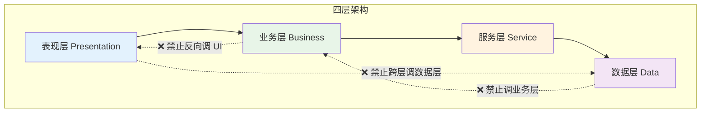

**为什么单向**？因为循环依赖会让编译单元耦合、让改动无法局部化。**任何"环路"都意味着 3 个类必须同时改**。

### 7.2 跨层调用禁忌

**疑惑**：跨层性能更好（少一次转发），为什么要禁止？

**论证**：
- 跨层调用第 1 次省了 1 次转发（≈ 100 ns）。
- 但 1 年后需要改中间层时，跨层调用是"隐藏的依赖"——你以为改 Service 只影响 Business，实际 Presentation 也依赖它。
- 一次跨层依赖 → 未来改动成本 ×2。

**结论**：**用 100 ns 换 3 年后的重构成本，永远不划算**。

### 7.3 洋葱与端口适配

现代架构（Clean Architecture、Hexagonal / 六边形架构）把分层升级为**同心圆**：

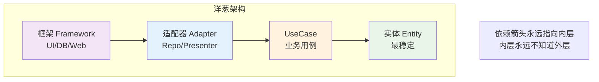

**关键洞察**：**换 UI 框架、换 DB、换 HTTP 库都不影响 Entity 和 UseCase**。§1 那个团队如果用洋葱架构，"弹优惠券"的核心逻辑就 3 行，放在 UseCase 里，永远不会 NPE。

### 7.4 依赖规则可执行化

**边界必须可执行**——写在文档里的规则等于没有。业界工程手段：

| 工具 | 平台 | 能力 |
|---|---|---|
| **ArchUnit** | Java/Kotlin | 单元测试语法写依赖规则 |
| **Dependency Analyzer** | Android | Gradle 插件，编译期检测 |
| **eslint-plugin-boundaries** | JS/TS | ESLint 规则 |
| **import-linter** | Python | 独立 CLI |
| **ktlint / detekt** | Kotlin | 自定义规则 |

示例（ArchUnit）：

```java
@Test
void ui_layer_should_not_depend_on_data_layer() {
    ArchRule rule = noClasses()
        .that().resideInAPackage("..ui..")
        .should().dependOnClassesThat()
        .resideInAPackage("..data..");
    rule.check(importedClasses);
}
```

**这条规则一旦进 CI，就再也没有人能悄悄跨层调用**——这才是架构真正落地的方式。

## 8. 架构常见反例

### 8.1 过度设计反例

**反例**：5 人团队的内部 OA 工具，团队负责人引入 Clean Architecture（4 层 + UseCase + Repository + Mapper + DTO），一个"获取列表"接口写 8 个类。

**指标**：
- 加一个字段要改 8 个文件
- 开发效率对比纯 MVC 慢 **3 倍**
- 团队士气：6 个月后 2 人离职

**教训**：**架构复杂度必须与团队规模 + 业务复杂度匹配**。Clean Architecture 是为 100 人级别团队 + 高频变更业务设计的，5 人内部工具用它就是用大炮打蚊子。

### 8.2 欠缺设计反例

**反例**：§1 那个 4200 行 Activity 就是典型欠缺设计。团队从来没有约定过任何分层规则。

**指标**：
- 崩溃率 0.08% → 3.6%（45 倍）
- 新员工独立提交时间 3 周
- 每周合并冲突 12 次

**教训**：**架构最低标准 = 团队对"代码该写在哪"达成共识**，哪怕只有一张纸的规则。

### 8.3 选型错配反例

**反例**：一个图片浏览 App（核心是图片列表 + 详情页），团队全面铺 MVVM + DataBinding。

**指标**：滑动列表帧率从 60 → 42，用户投诉率翻倍。

**归因**（对照 §6.3）：每个 Cell 4 个 LiveData，100 个 Cell = 400 个 Observer，滑动 1 秒触发 24000 次 dispatch = 90 ms 主线程占用。

**教训**：**性能敏感场景慎用 MVVM 绑定**，列表 Cell 用普通 ViewHolder + 手动 setter。

### 8.4 隐式循环反例

**反例**：user 模块和 order 模块本来单向依赖（order → user）。某天开发在 UserProfile 里加了个"我的订单"入口，直接 `startActivity(OrderListActivity.class)`——**user 模块反向依赖了 order**。

**后果**：编译期不报错（因为在同一个模块），但从此 order 模块无法独立编译。3 个月后想把 user 抽成 SDK 给另一个 App 用，发现抽不出来。

**教训**：**任何跨模块跳转必须走路由**（详见 02 篇组件化）。**§4 依赖倒置不是理论，是防止未来抽不出模块的保险**。

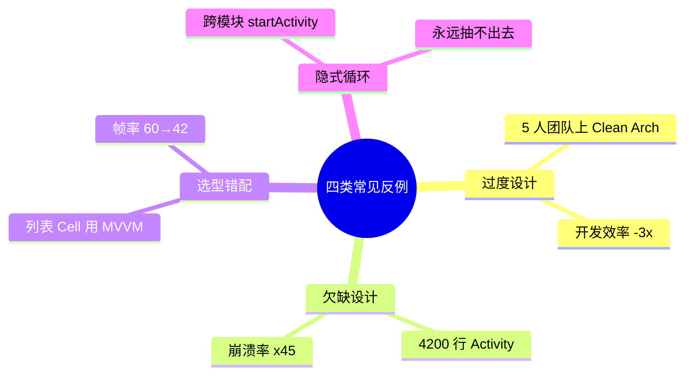

## 9. 演进与治理

**演化的底层驱动力——康威定律**：Melvin Conway 在 1968 年提出"系统架构终将镜像组织沟通结构"。这不是管理学鸡汤，而是**可观测的工程规律**：

$$
\text{Architecture}(t) \approx \text{Org Communication Graph}(t - \Delta t)
$$

- 3 人团队 → 沟通图是全连接 → 架构必然是单体（V1）
- 10 人分 3 组 → 沟通图分层 → 架构必然分层（V2）
- 30 人按业务线切 → 沟通图分域 → 架构必然组件化（V3）

**关键洞察**：**架构演进不是技术决策，而是组织决策的技术投影**。强行让 3 人团队上 V3 组件化（§8.1 过度设计反例）会失败，因为组织沟通结构撑不起组件边界；反过来，30 人团队停在 V1（§8.2 欠缺设计）也会失败，因为沟通图已分层但代码没分层，导致"组织在分层、代码在塌方"的撕裂。

**V1→V2→V3 的阈值不是拍脑袋，是康威定律的量化映射**：当团队规模 $N$ 跨过阈值，沟通路径数 $N(N-1)/2$ 超过人脑可维护上限（Dunbar 数 ≈ 150，工程团队实际约 8-10），就**必须**把全连接图切成分层图——架构随之跃迁。

### 9.1 V1 单体启动

**规模**：3 人 / 5 个核心页面 / MVP 起步阶段

**架构**：Activity + Service 直接调用

**依赖箭头**：极简，无分层

**编译时间**：< 90 秒

**是否需要架构治理**：❌ 不需要，写清楚就行

**升级信号**：页面数 > 15 或团队 > 8 人 → 进入 V2

### 9.2 V2 分层规范

**规模**：10 人 / 30 个页面 / 产品验证期

**架构**：MVP + Repository

**依赖箭头**：Activity → Presenter → Repository → (Network / DB)

**引入手段**：
- 强制分层（violated → CI fail）
- Contract 接口规范
- 单元测试覆盖 Presenter 层 80%+

**编译时间**：2-5 分钟

**升级信号**：跨业务线复用需求强烈 / 团队 > 30 人 → 进入 V3

### 9.3 V3 组件治理

**规模**：30+ 人 / 100+ 页面 / 平台化阶段

**架构**：MVVM + 组件化 + 单向数据流

**依赖箭头**：Shell → Business Components → Interface Layer / Common Layer

**引入手段**：
- 组件独立编译独立发布
- 路由 + SPI + EventBus 三件套（详见 02 篇）
- BOM 版本管理
- ArchUnit 依赖规则

**编译时间**：单组件 30 秒，全量 3-5 分钟

**升级信号**：需要跨 App 复用 → 进入 SDK 化（详见 03 篇）

### 9.4 何时该重构

**疑惑**：架构重构风险大、耗时长，什么时候必须做？

**论证**（用架构决策三角量化）：

| 信号 | 阈值 | 严重度 |
|---|---|---|
| 单文件行数 > 3000 | 是 | 🔴 立刻 |
| 循环依赖 > 5 处 | 是 | 🔴 立刻 |
| 全量编译 > 15 分钟 | 是 | 🟡 半年内 |
| 团队并发冲突 > 10 次/周 | 是 | 🟡 半年内 |
| 新员工独立提交 > 2 周 | 是 | 🟢 1 年内 |
| 崩溃率 > 1% 且集中在少数文件 | 是 | 🔴 立刻 |

**重构的边际成本曲线**——为什么"再拖一拖"是最差决策：

$$
C_{\text{refactor}}(t) = C_0 \cdot e^{k \cdot t} + D \cdot t
$$

- $C_0$：当下重构的基础成本
- $k$：熵增系数（见 §3.3，与团队规模、变更频率正相关）
- $D \cdot t$：拖延期间累计的技术债利息（每次在烂架构上加功能多花的时间）

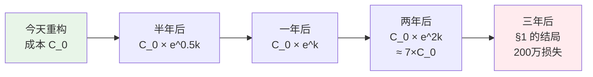

**关键洞察**：重构成本随时间**指数增长**，而业务收益是线性的——**拖延的每一天成本都在加速**。§1 那个团队 3 年前重构成本 $C_0$，3 年后变成 $C_0 \cdot e^{3k}$，加上 3 年累计技术债利息，最终以 200 万事故形式爆发。

**重构时机的数学判据**：当下重构成本 $C_0$ 与拖延期望损失 $D \cdot t + C_0(e^{kt}-1)$ 的交叉点就是最优时机。**红灯亮起 = 交叉点已过**——所以 §9.4 的红灯表本质是"拖延成本已超过重构成本"的预警。

**结论**：**任意一个红灯亮起，重构不是"要不要做"，而是"多快做"**。§1 那个团队命中了 4 个红灯，早就该重构了。

## 10. 综合案例串讲

### 10.1 案例真相揭晓

回到 §1 那 200 万的事故，7 个疑问逐条作答：

**Q1（架构真正解决什么？）**：回到 §3.4，架构提供的是**边界**。那 12 行代码本身没错，错在整个系统没有"UI 层不能持有业务状态"这条边界。

**Q2（复杂度能消灭吗？）**：不能，只能搬家（§3.1）。那 12 行代码里 9 行都是偶然复杂度，如果放到 UseCase 层，UI 层只需要写 `viewModel.showCouponIfEligible()`。

**Q3（MVC/MVP/MVVM 演化原因）**：分别解决 GUI/业务分离、GUI 可测、声明式 UI 三个不同痛点（§5）。**§1 团队用的是"没有任何模式的 MVC"**，等价于欠缺设计。

**Q4（可测性差距）**：从 30% → 95% → 90%（§6.4）。**§1 团队想给"弹优惠券"写单测？必须启动整个 App**。

**Q5（依赖规则可执行化）**：ArchUnit / DA 插件写进 CI（§7.4）。如果那个团队一年前上了 ArchUnit，"UI 层依赖 Service 层" 就会立刻被拒。

**Q6（过度 vs 欠缺边界）**：用红灯阈值判断（§9.4）。团队 3 年一直是"欠缺设计"，V2 都没走到。

**Q7（何时演进）**：4 个红灯亮起早该重构。事故只是"最后一根稻草"。

### 10.2 一个需求的一生

把"弹优惠券"这个需求在**理想架构**（V3 MVVM + 洋葱）里的完整生命周期串一遍：

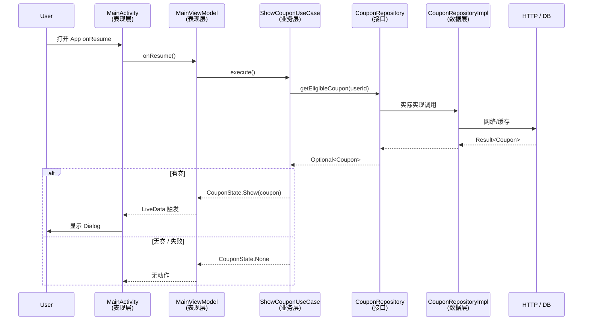

**关键点**：
1. UI 层只有 2 行代码（`onResume` + `observe`）——极简，不会腐坏。
2. 业务逻辑在 UseCase 里，**独立可测**，Mock CouponRepository 即可。
3. Repository 接口在 domain 层，实现在 data 层，**未来换 HTTP 库不影响任何上层**。
4. 所有依赖单向指向内层——**没有任何"隐含前提"**。

**如果 3 年前团队就是这样组织的**，那 12 行代码只需要在 UseCase 里加 3 行判断，NPE 无处发生。**这就是 200 万损失和 0 损失的差距**。

### 10.3 设计哲学回扣

从这一切归纳出 4 条跨篇适用的设计哲学：

**哲学 1：边界优于选择**——选 MVC 还是 MVVM 是次要的，有没有可执行的边界才是决定性的。**能被 CI 拦下的规则，才叫架构**。

**哲学 2：依赖箭头指向稳定**——所有解耦手段的本质都是把依赖箭头指向更稳定的东西（DIP、洋葱、单向数据流）。**箭头方向定命运**。

**哲学 3：复杂度守恒**——不要指望架构消灭复杂度，只能把它搬到最合适的地方（UseCase、Domain）。**评判架构好坏的核心指标是"偶然复杂度占比"**。

**哲学 4：演进优于设计**——V1 → V2 → V3 走的是渐进路径，一次性设计最完美的架构 = 一次性错到无法挽回。**架构是长出来的，不是画出来的**。

### 10.4 架构速查表

| 场景 | 推荐 | 反例 |
|---|---|---|
| 3 人小团队 / 内部工具 | MVC + 分包 | Clean Architecture |
| 10-30 人 / 表单密集 | MVP + Repository | 全 MVVM |
| 30+ 人 / 声明式 UI | MVVM + 组件化 | 无边界 MVC |
| 100+ 人 / 高频变更业务 | Clean + MVI + 微前端 | 单体 |
| 列表 Cell / 高频复用 | 普通 ViewHolder | MVVM 绑定 |
| 跨平台业务复用 | UseCase 抽出到 KMP | 平台各写一份 |

**架构自检 10 问**（每个红灯都是警报）：

- [ ] 单文件行数 < 800？
- [ ] 循环依赖 = 0？
- [ ] 编译时间 < 10 分钟？
- [ ] 依赖规则写进 CI？
- [ ] 单元测试覆盖率 > 60%？
- [ ] 新员工独立提交 < 1 周？
- [ ] 一个需求的改动集中在 ≤ 5 个文件？
- [ ] 团队都能说清"这个逻辑应该改在哪"？
- [ ] 每个模块能独立编译？
- [ ] 每个层都能被 Mock 单测？

> **架构 = 让 3 年后的你，敢于改动 3 年前的代码**。

下一篇（02 组件化）我们顺着"分层"这条线，进入更粗粒度的物理隔离——**用仓库/模块边界固化逻辑边界**，看看大型 App 如何把 45 人团队组织成 12 个可以并行开发的独立组件。
