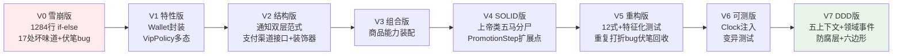
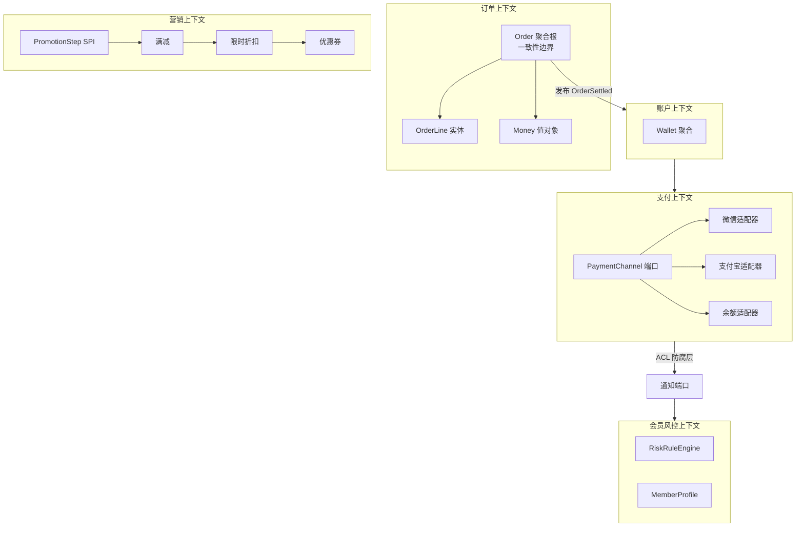
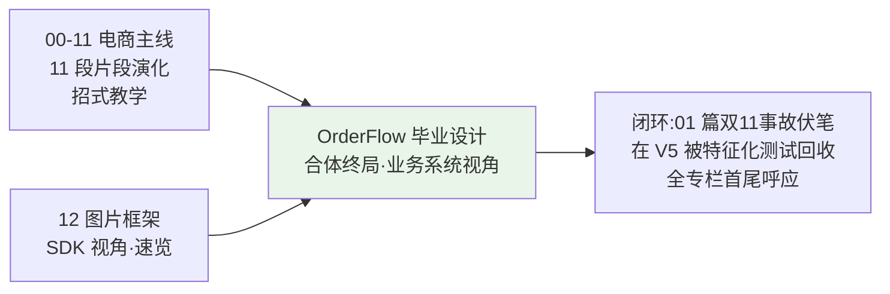

# 综合案例 · OrderFlow 电商订单结算引擎 —— 毕业设计方案

> 本篇是「面向对象设计」系列的**毕业设计方案**：先评估专栏 12 篇的知识覆盖现状，对比四个候选案例后选定方向，再给出完整设计——**把 00-11 篇主线演化的 11 段半成品代码，合体成一个真实可跑的订单结算工程**，从 1284 行屎山（双 11 雪崩现场原景重现）演化到 DDD 工程级，仿照《C++ 迷你 KV 存储引擎》的"5 次会话 + 灵魂三问 + 造 BUG 修复"教学结构，把 12 篇内容一次性串成一条可运行的主线。

---

## 目录介绍

- [01.评估篇：专栏现状与缺口](#01评估篇专栏现状与缺口)
  - [1.1 十二篇知识点全量盘点](#11-十二篇知识点全量盘点)
  - [1.2 三个覆盖缺口](#12-三个覆盖缺口)
  - [1.3 综合案例的四条选型标准](#13-综合案例的四条选型标准)
  - [1.4 四个候选方案对比](#14-四个候选方案对比)
  - [1.5 评估结论](#15-评估结论)
- [02.案例元信息](#02案例元信息)
- [03.业务全景与需求](#03业务全景与需求)
  - [3.1 业务故事](#31-业务故事)
  - [3.2 功能清单](#32-功能清单)
  - [3.3 V0 起点：1284 行雪崩现场原景重现](#33-v0-起点1284-行雪崩现场原景重现)
- [04.知识点覆盖映射](#04知识点覆盖映射)
  - [4.1 博客案例回收映射表（方案 A 的核心）](#41-博客案例回收映射表方案-a-的核心)
  - [4.2 工程问题 → 博客知识点 → 案例落点](#42-工程问题--博客知识点--案例落点)
  - [4.3 覆盖矩阵总表](#43-覆盖矩阵总表)
- [05.版本演进路线 V0→V7](#05版本演进路线-v0v7)
- [06.教学结构设计](#06教学结构设计)
  - [6.1 五次会话切分](#61-五次会话切分)
  - [6.2 灵魂三问设计](#62-灵魂三问设计)
  - [6.3 造 BUG → 修复设计](#63-造-bug--修复设计)
  - [6.4 每版硬验收点](#64-每版硬验收点)
- [07.终局架构](#07终局架构)
- [08.与现有十二篇的关系](#08与现有十二篇的关系)
- [09.实施计划与写作规范](#09实施计划与写作规范)

---

## 01.评估篇：专栏现状与缺口

### 1.1 十二篇知识点全量盘点

先把 12 篇的核心知识点拉平成一张清单——这是综合案例必须**全部接住**的物料：

| 篇 | 主题 | 核心知识点（拆到可验收粒度） |
|---|---|---|
| 01 | 设计思想 | 对象=数据+行为绑定、OOA/OOD/OOP 三阶段、复杂度阈值、伪 OOP 判别（字段全 public 还对吗）、"怎么做"→"谁来做" |
| 02 | 四大特性 | 封装=不变量守卫、抽象=意图方法、继承= is-a 且共享不变量、多态=消灭 switch、四大特性各治哪类病 |
| 03 | 接口vs抽象类 | is-a vs can-do 两问决策、接口+骨架抽象类双层范式（Spring/Netty 同款）、模板方法、default 方法的局限 |
| 04 | 面向接口 | DIP 本质、接口按"调用场景"切而非按实现抄、变化轴预判、横切关注用装饰器不用接口、五个反转教训 |
| 05 | 组合优于继承 | 继承三宗罪（强耦合/层级膨胀/静态绑定）、能力接口+字段组合三步、何时继承仍是首选 |
| 06 | SOLID 全景 | 五条原则各一句话、互为因果（DIP 是地基）、三大陷阱（行数≠SRP、YAGNI、DIP≠全抽象） |
| 07 | SOLID 案例汇 | 30 秒诊断五步法、actor 判定、何时刻意不遵守、四原则全失效的根因是 DIP 缺失 |
| 08 | 坏味道 | 六大家族 30+ 病历卡、top10 速辨（长函数/大类/Switch 惊悚/散弹式修改/依恋情结…）、给直觉以词汇 |
| 09 | 重构十二式 | 函数级 6 式 + 对象级 4 式 + 关系级 2 式、小步快跑节奏、特征化测试、安全网三件套 |
| 10 | 可测试性 | 可测三要素（可观测/可控制/可隔离）、不可测五基因、可测改造五步、Clock 抽象、变异测试、测试金字塔 |
| 11 | DDD | 通用语言、限界上下文、战术四件套（值对象/实体/聚合根/领域服务）、领域事件、防腐层、六边形架构 |
| 12 | 综合实战 | V0→V5 演化方法论、为什么不一刀重写、每步一个小目标、与 Glide/OkHttp 对照 |

### 1.2 三个覆盖缺口

对照这张清单，专栏现状存在三个结构性缺口——**这正是综合案例要补的位**：

| # | 缺口 | 表现 | 后果 |
|---|---|---|---|
| ① | **主线案例是"片段集"而非"工程"** | 00-11 每篇演化订单系统的一小块（钱包→日志器→支付渠道→…），读者手里是 11 段孤立代码记忆，**没有一个能 `mvn test` 全绿跑起来的完整工程** | 学的是"招式"，没体验过"整场战役" |
| ② | **第 12 篇与主线割裂且偏速览** | 图片框架是 SDK/中间件视角，与 00-11 的电商业务主线无衔接；V0→V5 每版只给关键改造点，**没有 Step-by-Step 与验收命令** | 知道"应该变成什么样"，不知道"怎么一步步变过去" |
| ③ | **"识别→重构"技能缺实训场** | 坏味道（08）与重构十二式（09）只能拿"别人的病历"练，读者**没亲手把一个屎山救活过** | 评审时仍说不出病灶名，动手时仍不敢下刀 |

**结论**：专栏需要一个**毕业设计级**案例——像《C++ 迷你 KV 存储引擎》之于 C++ 卷一那样：独立完整、真实可跑、从屎山开始、每步带验收，把 12 篇知识在**同一个工程的同一次演化**里全部落地。

### 1.3 综合案例的四条选型标准

从 12 篇知识点反推，选出的业务领域必须同时满足：

| 标准 | 为什么 |
|---|---|
| **S1：规则天然持续叠加** | 01 篇的核心论点是"复杂度持续叠加 vs 代码不能持续返工"——业务土壤必须自带"每两周加一条规则"的属性，才能让 V0 屎山"合理地长出来" |
| **S2：自带不变量与多态土壤** | 02 篇需要"余额守恒"这类不变量、需要"一族可替换行为"（没有不变量的领域教不会封装） |
| **S3：天然存在可替换外部依赖** | 04/10 篇需要支付渠道/通知通道/时钟这类**必须面向接口 + 必须可注入**的依赖（抽不出变化轴的领域教不会 DIP） |
| **S4：天然多上下文** | 11 篇需要能切出 ≥4 个限界上下文的领域（单模块业务上 DDD 就是过度设计） |

### 1.4 四个候选方案对比

**候选 A：电商订单结算系统「终局合体版」**——把 00-11 篇的订单主线片段整合成完整工程。

**候选 B：网约车计费引擎「RideFlow」**——九层计价规则叠加，全新领域，从屎山到五上下文 DDD 工程。

**候选 C：短视频会员订阅计费系统**——会员等级 × 权益包 × 订阅周期 × 支付渠道。

**候选 D：图片框架「续篇」**——续写第 12 篇，加按量计费业务层，SDK + 业务双线。

| 维度 | A 订单终局 | B 网约车计费 | C 会员订阅 | D 图片框架续 |
|---|---|---|---|---|
| S1 规则叠加层数 | **最强（九层：小计/满减/折扣/券/会员/运费/税/积分/拆单分摊）** | 强（9 层） | 中 | 弱 |
| S2 不变量+多态土壤 | 强（钱包守恒 + 营销策略族） | 强 | 强 | 中 |
| S3 可替换依赖丰富度 | **强**（支付三渠道 + 通知三通道 + 存储 + Clock） | 强 | 中 | 中 |
| S4 限界上下文数量 | **5 个**（订单/营销/账户/支付/会员风控） | 5 个 | 3 个 | 2 个 |
| **与 00-11 主线的衔接** | **完美：11 篇半成品代码直接回收，双 11 事故代码就是 V0 原型** | 零衔接 | 零衔接 | 仅衔接 12 篇 |
| Clock 注入刚需度 | **最强**（秒杀限时折扣、优惠券有效期判定） | 强 | 强 | 弱 |
| 读者旧知识激活 | **每篇案例再次出现并继续演化，回收感最强** | 无 | 无 | 弱 |
| 内容重复风险 | ⚠️ 需用"合体叙事"化解（见 §1.5） | 无 | 无 | 中 |
| 写作成本 | **最低（大量代码博客已有雏形）** | 高 | 中 | 中 |

### 1.5 评估结论

**选定候选 A：电商订单结算引擎（项目代号 OrderFlow）**。三个决定性理由：

1. **衔接即回收**：00-11 的主线案例（订单/钱包/日志器/支付渠道/商品组合/风控/退款）本来就是同一个系统的 11 次片段演化——OrderFlow 不是"重讲"，而是**把每篇留下的半成品代码接回去继续演化**，读者的旧知识在每一版被直接激活，"串起来"的体验最强；
2. **V0 有"原景重现"的天然剧本**：01 篇开篇的双 11 雪崩事故（`OrderUtil.calculate()` 1284 行、17 个 `else if`、`total` 被读写 17 次、满减与会员折扣重复打折）**就是 V0 的原型**——伏笔从第 01 篇埋到第 14 篇回收，全专栏首尾闭环；
3. **Clock 与多上下文同样硬**：秒杀限时折扣（20:00-22:00）、优惠券有效期判定让 Clock 注入成为硬刚需；订单/营销/账户/支付/会员风控天然五上下文，11 篇 DDD 施展空间拉满。

**"重复感"的化解策略**（方案 A 唯一风险）：采用"**合体叙事**"——每个知识点不再重讲原理（博客原文已讲透，只放回链），案例只回答一个问题：**"这篇留下的代码，进入完整工程后长成了什么样、又遇到了什么新问题"**。旧代码是入场券，新工程是新战场。

---

## 02.案例元信息

| 项目 | 说明 |
|------|------|
| 案例名 | OrderFlow 电商订单结算引擎 |
| 定位 | 面向对象设计专栏毕业设计：**把 00-11 篇主线演化的 11 段半成品，合体为一个真实可跑的工程** |
| 难度 | ★★★★☆ |
| 预估时长 | 16-20 小时（**5 次会话**，每次 1.5-2 小时，独立可验收） |
| 语言/技术栈 | Java 17+（与专栏全部示例同语言）、JUnit 5、Maven 多模块、零第三方业务依赖 |
| 前置 | 12 篇全部（每篇对应至少一个 V 版本的"主刀理由"） |
| 起点 | V0：`OrderUtil.calculate()` 单类 1284 行过程式屎山（**双 11 雪崩事故代码原景重现，保留 17 处坏味道 + 1 个重复打折伏笔 bug**） |
| 终点 | V7：五个限界上下文 + 领域事件 + 六边形端口 + 30+ 单测全绿 + 变异测试可跑 |
| 最终产物 | `orderflow/` 多模块 Maven 工程：`order-domain` / `promotion-context` / `account-context` / `payment-context` / `member-context` / `shared-kernel` + `demo` 可运行入口 |
| 代码规模 | V0 约 1284 行 → V7 约 3000 行（含测试）；8 个版本 git tag |
| 核心承诺 | **每一版回收 1-2 篇博客的代码、解决一个真实工程问题、有 30 秒可跑的验收命令** |

---

## 03.业务全景与需求

### 3.1 业务故事

一个最小的电商订单闭环：用户下单 → 商品小计 → **结算引擎叠加营销规则** → 账户/第三方支付扣款 → 扣库存 → 订单确认通知 → 积分/风控事后处理 →（可能）退款逆向流程。

**结算规则（业务复杂度的发动机）**，共九层，V0 里全部糊在一个函数——与 01 篇双 11 雪崩现场完全同构：

```
实付金额 = ( Σ(单价 × 数量)                     ← 商品小计
           - 满减阶梯(满300-50 / 满500-100 / 满1000-250)   ← 阶梯满减
           × 限时折扣(秒杀时段 8 折, 20:00-22:00)          ← Clock 刚需
           - 优惠券抵扣(有效期判定, 过期不可用)             ← Clock 刚需
           ) × (1 - 会员等级折扣)                  ← GOLD 15% / SILVER 10%
           + 运费(满 99 包邮, 否则 12 元; 生鲜冷链另计)
           + 跨境税费(跨境商品 11.9%)
           - 积分抵扣(100 积分 = 1 元)
最低消费兜底、四舍五入到分、
拆单分摊(多商品共享优惠时, 按金额比例摊到每个 SKU —— 退款按 SKU 算)
```

### 3.2 功能清单

| 模块 | 功能 | 承载的知识点（详见 §4） | 回收的博客代码 |
|---|---|---|---|
| 订单 | 下单、结算、拆单分摊、取消 | 01/06/11 | 01 篇 Order 雏形 |
| 营销 | 满减/限时折扣/优惠券/积分四层叠加 | 02/06/07/11 | 01 篇 Activity 接口 |
| 账户 | 钱包、充值、扣款、退款守恒 | 02/08/11 | **02 篇 Wallet/transfer** |
| 支付 | 余额/微信/支付宝三渠道、失败重试 | 03/04/10 | 04 篇 PaymentChannel/FileStore |
| 通知 | 订单确认：短信/APP 推送/邮件账单 | 03 | **03 篇 MyLogger 双层范式** |
| 商品 | 实物/虚拟/生鲜/跨境 × 能力（需物流/冷链/可退款/需清关） | 05 | 05 篇 Dragon 能力组合 |
| 会员 | 等级折扣、积分发放与抵扣 | 06/11 | 11 篇会员 3 套含义 |
| 风控 | 异常订单、金额突变、黑产优惠券熔断 | 07 | 07 篇 RiskCheckProcessor |
| 事件 | OrderSettled → 扣库存 → 通知 → 积分 → 风控 | 11 | 11 篇领域事件 |

### 3.3 V0 起点：1284 行雪崩现场原景重现

V0 `OrderUtil.java`——**就是 01 篇开篇那场双 11 事故的代码**（病历全数保留，每一处坏味道对应 08 篇的一张病历卡，重构时逐一回收）：

```java
// V0 骨架示意（完整版在正式案例中展开, 与 01 篇事故代码同构）
public class OrderUtil {
    // 上帝类：同时伺候用户端/运营端/财务端三个 actor（→ 06 篇 SRP）
    public static double calculate(double[] prices, int[] counts,
                                   int activityType, int vipLevel,
                                   String couponId, boolean isFlashSale,
                                   boolean hasCrossBorder, boolean isFresh) {
        double total = 0;
        for (int i = 0; i < prices.length; i++) total += prices[i] * counts[i];
        if (activityType == 1) {                    // 满减：魔法数（→ Switch 惊悚）
            if (total >= 300) total -= 50;
            else if (total >= 500) total -= 100;     // ← 顺序写反了, 又一个隐藏 bug
        } else if (activityType == 2 || activityType == 22) {
            total = total * 0.9;
            if (vipLevel == 3) total -= 30;
            // ... 200 行后
            total = total * (1 - 0.15);   // ← 伏笔 bug：满减后又打了一次会员折
                                          //   与 01 篇事故"重复打折"完全同款
        }
        if (isFlashSale) { /* 又 60 行, 里面 new Date() 判时段 */ }
        // …… 共 1284 行, 9 种规则交织, total 被读写 17 次
        return total;
    }
    public static void sendSms(...)   { /* 通知也在这（→ 依恋情结） */ }
    public static void deductBalance(...) { /* 扣款也在这（→ 全局状态） */ }
}
```

> **设计原则**：V0 不是"为了教学故意写烂"，而是**九层规则 + 三个 actor + 无任何抽象**下的必然产物——它就是 01 篇那场凌晨 1 点告警的真实样子，读者第一眼就会想起自己的生产代码。

---

## 04.知识点覆盖映射

### 4.1 博客案例回收映射表（方案 A 的核心）

方案 A 与其他方案的本质区别：**12 篇博客留下的每一段代码，都会在 OrderFlow 里"再次出现并继续演化"**——旧代码是入场券，新工程是新战场：

| 博客篇 | 博客留下的代码/事故 | 在 OrderFlow 中的归宿 | 演化动作 |
|---|---|---|---|
| 01 思想 | `OrderUtil.calculate()` 1284 行、双 11 雪崩、17 个 else if | **V0 原景重现**（含重复打折伏笔 bug） | 直接成为案例起点 |
| 02 特性 | `Account.transfer()` 余额对不上、`balance ≥ 0` 不变量 | V1 的 `Wallet` | 从 5 行伪 OOP 长成带校验的完整聚合 |
| 02 特性 | 会员折扣 if-else | V1 的 `VipPolicy` 多态族 | `switch(vipLevel)` 消失 |
| 03 接口vs抽象类 | `MyLogger` 47 次改动、双层范式骨架 | V2 的 `BillingNotifier`（短信/推送/邮件三通道） | 模板方法骨架 + 三实现 |
| 04 面向接口 | 62873 个 `OSSClient`、`FileStore` 场景接口 | V2 的 `PaymentChannel`（余额/微信/支付宝） | 按调用场景切接口 + `RetryableChannel` 装饰器 |
| 05 组合 | 企鹅会飞、`Dragon` 五次重构 | V3 的 `ProductType`（虚拟商品不该继承"物流能力"） | 能力接口 + 字段组合装配 |
| 06 SOLID | `OrderManager` 8194 行上帝类 | V4 的 `SettlementEngine` 拆分 | 五马分尸 + `PromotionStep` SPI |
| 07 SOLID 案例汇 | `RiskCheckProcessor` 3142 行、五人评审 40 分钟 | V4 的风控模块 + 会话 3 诊断演练 | 30 秒诊断五步法实战 |
| 08 坏味道 | PR 被驳回 18 次、"为什么你能闻到我闻不到" | 会话 1 对 V0 的 17 处坏味道扫描赛 | 六大家族病历卡逐一回收 |
| 09 重构十二式 | 1200 行结算函数救援 | V5 的 12 式全程 + 特征化测试 | 挖出 V0 的重复打折伏笔 bug |
| 10 可测试性 | 94.7% 覆盖率上线即崩 | V6 的 `Clock` + 变异测试 | 秒杀折扣测试从"等到晚 8 点"到 10ms |
| 11 DDD | "会员"3 套含义、订单从贫血到聚合根 | V7 的五上下文 + 领域事件 + 防腐层 | 会员在营销/账户上下文各归各位 |
| 12 综合实战 | 图片框架 V0→V5 方法论 | 会话 5 毕设复盘 | 两个案例对照答辩 |

### 4.2 工程问题 → 博客知识点 → 案例落点

这是整个案例的**设计总纲**：每个知识点不是"贴上去的练习题"，而是某个真实工程问题的**唯一正解**——就像 KV 案例里"AOF 天然需要文件 IO"一样。

| # | OrderFlow 的工程问题 | 唯一正解 | 对应博客 | 案例落点 |
|---|---|---|---|---|
| 1 | 结算函数 1284 行，三个 actor 都在改 | 数据+行为绑定，拆分归位 | 01 思想 | V0→V1 动机叙事 |
| 2 | `wallet.balance -= pay` 扣成负数 | 封装不变量：withdraw 内校验 | 02 封装 | V1 Wallet |
| 3 | `if(vipLevel==3)` 切会员折扣 | 多态：VipPolicy 一族 | 02 多态 | V1 VipPolicy |
| 4 | 账单要走短信/推送/邮件，流程相同落地不同 | 接口+骨架抽象类双层、模板方法 | 03 | V2 BillingNotifier |
| 5 | 明天要接支付宝，代码里钉死微信 SDK | 面向接口、按调用场景切接口 | 04 | V2 PaymentChannel |
| 6 | 重试/记账横切关注不能塞进支付接口 | 装饰器层层包裹 | 04 | V2 RetryableChannel |
| 7 | 虚拟商品 `extends 实物商品` 却被迫有 `ship()`（企鹅会飞重现） | 能力接口 + 字段组合 | 05 | V3 ProductType 装配 |
| 8 | 加"积分抵扣"要改结算主流程 | OCP：加扩展点而非改老码 | 06/07 | V4 PromotionStep SPI |
| 9 | 五人评审说不清 V0 违反哪条 SOLID | 30 秒诊断五步法 | 07 | 会话 3 开场重现 |
| 10 | V0 的 17 处坏味道要能叫出名字 | 六大家族病历卡 | 08 | 会话 1 坏味道扫描赛 |
| 11 | 1284 行屎山怎么安全救活 | 12 式 + 特征化测试 + 小步快跑 | 09 | V5 全程 |
| 12 | 秒杀折扣测试不能等到晚上 8 点 | Clock 注入 | 10 | V6 Clock 抽象 |
| 13 | 覆盖率 94% 仍上线崩，mock 满天飞 | 测业务规则、变异测试 | 10 | V6 Mutation 演示 |
| 14 | "会员"在营销/账户/风控三处是三个不同的类 | 限界上下文 + 通用语言 | 11 | V7 上下文切分 |
| 15 | `0.1+0.2 != 0.3`，金额算错 | 值对象 Money（不可变） | 11 | V7 值对象 |
| 16 | 订单/优惠/支付一致性谁来守 | 聚合根 Order + 不变量 | 11 | V7 聚合设计 |
| 17 | 结算后要触发库存/通知/积分，但不能耦合 | 领域事件 | 11 | V7 事件总线 |
| 18 | 微信支付 SDK 的 DTO 不能污染领域 | 防腐层 ACL | 11 | V7 PaymentAdapter |
| 19 | 终局如何接 DB/MQ 而不动领域 | 六边形端口/适配器 | 11 | V7 端口清单 |
| 20 | 屎山救活全过程的复盘方法论 | 演化叙事（对照 Glide） | 12 | 会话 5 收官复盘 |

### 4.3 覆盖矩阵总表

| 博客篇 | 会话 | 版本 | 核心落点 | 验收动作 |
|---|---|---|---|---|
| 01 思想 | 1 | V0 | 屎山诊断叙事（双 11 原景） | 说清"复杂度摊给谁" |
| 02 特性 | 2 | V1 | Wallet 封装 + VipPolicy 多态 | 余额守恒测试通过 |
| 03 接口vs抽象类 | 2 | V2 | 通知双层范式 | 新增通道只加 1 类 |
| 04 面向接口 | 2 | V2 | 支付渠道 + 装饰器 | 换渠道 0 改调用点 |
| 05 组合 | 2 | V3 | 商品能力装配 | 新商品类型 0 新子类 |
| 06 SOLID | 3 | V4 | 上帝类拆分 | 新增营销步骤不改引擎 |
| 07 SOLID 案例汇 | 3 | V4 | 30 秒诊断演练 | 诊断 V0 五步全对 |
| 08 坏味道 | 1+3 | V0 | 17 处病历扫描 | 坏味道清单闭环 |
| 09 重构十二式 | 4 | V5 | 12 式救援 + 特征化测试 | 测试常绿走完全程 |
| 10 可测试性 | 4 | V6 | Clock/DI/变异测试 | 秒杀测试 <10ms |
| 11 DDD | 5 | V7 | 四件套 + 事件 + ACL + 六边形 | 新增订阅方 0 改结算 |
| 12 综合实战 | 5 | V7 | 演化复盘（对照图片框架 V5） | 完成毕设答辩自检 |

---

## 05.版本演进路线 V0→V7



| 版本 | 一句话目标 | 回收的博客代码 | 新增模块 | 关键决策 |
|---|---|---|---|---|
| **V0** | 看见病（双 11 原景） | 01 篇事故代码 | `OrderUtil` | 埋 1 个真实 bug（满减后重复打折） |
| **V1** | 数据有守卫 | 02 篇 Wallet/transfer | `Wallet` / `Money` 雏形 / `VipPolicy` 族 | 为什么 Money 不能用 double |
| **V2** | 依赖可替换 | 03 篇 MyLogger 双层 + 04 篇 FileStore | `BillingNotifier` / `PaymentChannel` / 装饰器 | 接口按调用场景切，不按实现抄 |
| **V3** | 能力可装配 | 05 篇 Dragon 组合 | `ProductType` 组合 | 虚拟商品翻版"企鹅会飞"现场 |
| **V4** | 变化有扩展点 | 06 篇 OrderManager 拆分 + 07 篇风控 | `SettlementEngine` + `PromotionStep` SPI | DIP 是地基的现场证明 |
| **V5** | 屎山安全救活 | 09 篇结算函数救援 | 特征化测试 + 12 式分步提交 | 每步 10 分钟一循环、测试常绿 |
| **V6** | 测得真 | 10 篇覆盖率事故 | `Clock` / 测试金字塔 / PIT 变异分 | 秒杀测试从"等晚 8 点"到 10ms |
| **V7** | 业务对齐 | 11 篇贫血→聚合 + 12 篇方法论 | 五上下文 / 领域事件 / ACL / 端口 | 毕设答辩：对照图片框架收官 |

---

## 06.教学结构设计

仿照《迷你 KV 存储引擎》的教学骨架，全部移植到 OOP 场景。

### 6.1 五次会话切分

每次会话独立可验收，开头"打开上次 commit 确认验收点还在"，结尾 `git commit`。

| 会话 | 版本 | 主题 | 内容量 | 毕业答辩点 |
|---|---|---|---|---|
| **会话 1：看见病** | V0 | 屎山解剖 + 坏味道扫描赛（对照 08 篇六大家族） | 1.5h | 能给 17 处坏味道逐一命名 |
| **会话 2：打地基** | V1→V3 | 封装不变量 → 双层范式 → 组合装配 | 4h | 三个"新增零修改"验收全过 |
| **会话 3：上图纸** | V4 | SOLID 五马分尸上帝类 + 30 秒诊断演练 | 3h | 新增营销步骤不动 SettlementEngine |
| **会话 4：动手术** | V5→V6 | 12 式救援 + 特征化测试 + Clock 注入 + 变异测试 | 4h | 挖出重复打折 bug 且全程测试常绿 |
| **会话 5：对业务** | V7 | DDD 五上下文 + 领域事件 + 防腐层 + 毕设复盘 | 4h | 对照 12 篇图片框架做总答辩 |

### 6.2 灵魂三问设计

四组动手前的"先想清楚"（对应 KV 案例同款设计）：

> - **V1 之前**：为什么金额不能用 `double`？为什么"余额不能为负"必须写在 `Wallet` 里而不是调用方？字段全 public 程序还对吗？
> - **V3 之前**：虚拟商品 `extends 实物商品` 会发生什么？能力该继承还是持有？什么时候继承仍是首选？
> - **V5 之前**：没有测试怎么重构？特征化测试和 TDD 是一回事吗？"不改外部行为"到底指什么？
> - **V6/V7 之前**：秒杀折扣测试为什么不能 `new Date()`？"会员"为什么在营销和风控上下文是两个类？聚合根的一致性边界画在哪？

### 6.3 造 BUG → 修复设计

五处"亲手制造、亲眼看见"（对应 KV 案例的造 BUG 高峰）：

> - **造封装洞**（V1）：`wallet.balance -= pay` 直写 → 余额 -37.5 → 补上不变量校验
> - **造 LSP 违反**（V3）：`VirtualProduct.ship()` 抛 `UnsupportedOperationException` → 统一结算流程炸 → 理解"契约不是编译期"
> - **造贫血模型**（V4 前的 V3.5）：`Order{30 个 getter/setter}` + `OrderService.checkout()` 1200 行 → 对照 11 篇阶段 1
> - **造时间依赖**（V6）：秒杀折扣测试等到 20:00 才跑 → 引入 Clock 后 10ms 跑完同一断言
> - **造事件耦合**（V7）：结算里直接 `new SmsClient().send()` → 加"发票订阅方"要改结算 → 领域事件解耦

### 6.4 每版硬验收点

| 版本 | 验收命令（30 秒） | 期望 |
|---|---|---|
| V1 | `mvn test -Dtest=WalletTest` | 超额扣款抛异常、退款守恒通过 |
| V2 | 加 `EmailBillingNotifier` | **只加 1 个类、0 行老代码修改** |
| V3 | 加"虚拟课程"商品类型 | 只组合已有能力，0 新子类 |
| V4 | 加"积分抵扣"营销步骤 | 不改 `SettlementEngine` 任何一行 |
| V5 | 全程跑特征化测试 | 12 式每步提交后测试全绿 |
| V6 | 秒杀折扣测试 | 注入 `Clock` 后 <10ms 完成 |
| V7 | 加"发票订阅方" | 监听 `OrderSettled`，结算代码 0 修改 |

---

## 07.终局架构

V7 的六边形 + 限界上下文全景：



**终局自检清单**（毕设答辩题）：值对象有哪些（Money/CouponId/TimeWindow）？实体有哪些（Order/Wallet）？聚合根为什么是 Order 不是 OrderLine？领域服务和应用服务各在哪？事件流上谁能加订阅方？

---

## 08.与现有十二篇的关系



- **是合体**：00-11 每篇留下的代码（Wallet/MyLogger/FileStore/Dragon/RiskCheckProcessor…）在 OrderFlow 中再次出现并继续演化，旧知识被直接激活；
- **是终局**：01 篇开篇的双 11 雪崩代码成为 V0 起点，其中"重复打折"的伏笔在第 14 篇 V5 被特征化测试挖出——**从第 1 篇到第 14 篇首尾闭环**；
- **是互补**：12 篇管"SDK/中间件怎么设计"（图片框架），14 篇管"业务系统怎么从屎山到 DDD"（订单结算）——两个视角合起来才是完整 OOP 工程观。

---

## 09.实施计划与写作规范

### 9.1 配套代码工程

参照 GoTodo / GoLog 模式：博客文档 + `code/Java/OrderFlow/` 配套可跑工程。

```
code/Java/OrderFlow/               # Maven 工程（JDK 17+, JUnit 5）
├── pom.xml
├── order-domain/  promotion-context/  account-context/
├── payment-context/  member-context/  shared-kernel/
└── demo/                          # main 入口：跑 3 个订单完整结算流程
```

- 早期版本（V0-V3）单模块，**V7 拆模块本身就是 DDD 教学内容**；
- git tag：`v0-avalanche` … `v7-ddd`，读者随时 `git checkout` 对照任意版本；
- 博客中每个 Step 的代码段 = 工程真实文件（标注路径），**先写代码跑验收、再写文档**，文档不出现未验证代码。

### 9.2 写作排期（5 篇连载或 1 篇长文分 5 次会话）

| 产出 | 内容 | 预估篇幅 |
|---|---|---|
| 总纲篇（本篇） | 评估 + 方案 + 覆盖矩阵 | 已完成 |
| 会话 1 | V0 屎山全文 + 坏味道扫描赛 | ~3000 字 + 1284 行代码 |
| 会话 2 | V1/V2/V3 三版 + 灵魂三问 | ~5000 字 |
| 会话 3 | V4 SOLID 手术 + 诊断演练 | ~3000 字 |
| 会话 4 | V5/V6 重构 + 可测改造 | ~5000 字 |
| 会话 5 | V7 DDD 终局 + 毕设答辩 | ~5000 字 |

### 9.3 写作规范（对齐 KV 案例风格）

1. **每节自带"为什么这样写"**：先抛工程问题，再给唯一正解，最后回链博客篇目；
2. **回收叙事**：每版开头放一张"本版回收的博客代码"对照表——旧代码是入场券，新工程是新战场，不重讲原理；
3. **每个 Step 都可跑**：代码段 = 可复制运行的增量，配验收命令与期望输出；
4. **伏笔回收**：V0 埋的重复打折 bug，到 V5 特征化测试锁定、V6 变异测试验证测试有效性；
5. **金句收尾**：每会话一句"复杂度的归宿"式总结，呼应 00 篇导航的文风。

---

## 10.快速总结

> **OrderFlow 的本质**：不是"又写一个项目"，而是把 12 篇博客的 50+ 个知识点和 11 段半成品代码，装进一个**天然需要它们全部**的业务容器——就像 KV 存储引擎天然需要 C++ 的 17 章一样。九层结算规则养出 1284 行屎山（01 篇双 11 事故原景），五个上下文逼出 DDD 终局，中间的每一刀，都是 12 篇内功的落点。**从第 01 篇的凌晨告警，到第 14 篇的特征化测试回收伏笔——全专栏首尾闭环。**
>
> **下一步**：确认方案后，从"会话 1：V0 屎山全文"开始动笔（先建 `code/Java/OrderFlow` 工程并跑通 V0 验收）。
