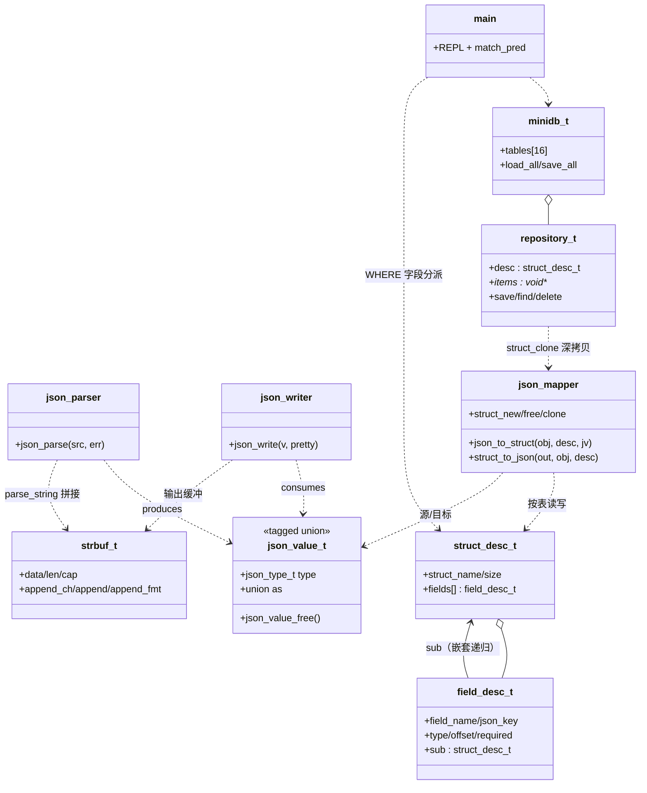

# 第四章：C语言 Json与内存数据库

本章是综合案例的**第四关·现代 C 大考**——从 [03.校园身份预约](./03.校园身份预约系统) 的"`fscanf` 一字段一字段读"跃迁到工业级基础设施：**结构体 + 联合体 + 宏 + 手写反射**四件套，手写一个零依赖的 mini cJSON + mini 序列化框架雏形。

> 📌 **和 Java 版同一道题的两种解法**：Java 版（[04.Json与内存数据库](../03.Java入门精通/02.综合案例/04.Json与内存数据库.md)）靠**运行时反射**从字节码里读注解和泛型；C 没有反射、没有注解、没有泛型——本案例用 **tagged union 表达类型代数 + 宏 + `offsetof` 字段描述表**手写出同样的框架。**Java 用反射"找回"类型信息，C 程序员从第一天起就在"手写"这些信息**——理解了这一点，你就理解了所有序列化框架（cJSON / Protobuf / thrift）的本质。

本案例做 **6 件事**：

1. **手写递归下降 JSON 解析器**：~250 行 C，支持 6 种 JSON 类型（null/bool/number/string/array/object）+ Unicode `\uXXXX` 转义（**UTF-8 多字节编码**，比 Java 版深一层）+ 行列号错误定位 —— **不用任何第三方库**。
2. **tagged union 表达 JSON 类型代数**：`enum` 标签 + `union` 共享内存 + `switch` 穷尽分发——这是 C 语言里"代数数据类型"的标准表达，也是理解 tagged pointer / protobuf wire format 的入口。
3. **错误码 + 错误上下文结构体**：C 没有异常和继承，用 `json_err_t` 枚举 + 携带 `line/column/msg` 的 `json_error_t` 还原"异常体系"——比 `errno` 更进一步的工程级错误处理。
4. **`strbuf_t` 动态字符串缓冲区**：`char* + len + cap` 三件套 + realloc 翻倍扩容——对应 Java 的 `StringBuilder`，C 版要自己写。
5. **宏 + `offsetof` 字段描述表 = "手写反射"**：`FIELD(student_t, id, "student_id", FD_STRING, true)` 一行声明字段映射——这是 Protobuf / thrift 代码生成器的核心原理，也是本案例的灵魂⭐。
6. **MiniDB 内存数据库 + REPL CLI**：动态注册多种实体表、扫描 `data/` 目录批量加载、简易 `SELECT WHERE` 查询语法 —— 像 SQLite 一样的玩具数据库。

**学习方式**：本案例是综合案例里**第一道框架级硬菜**，按"灵魂三问 → 写最小骨架 → 故意造 BUG → 修复升级 → 阶段小结"循环。共 9 个阶段、约 12 小时，建议**分 3-4 天**完成（第 1 天 §02-§04 类型与错误、第 2 天 §05-§06 解析与序列化、第 3 天 §07-§09 描述表与映射器、第 4 天 §10-§11 数据库 + REPL）。**全程边读边敲，千万别复制粘贴**——本案例代码量大但每一行都有教学价值。

---

## 渐进学习节奏

先读这段，再开始敲代码！本案例**严格按真实工程师的开发节奏推进**：

```text
阶段 ① JsonValue 类型表达（§03）· 45 min
   └ Step 1.0: 🤔 灵魂三问 #1（JSON 6 种类型用什么 C 类型？）
   └ Step 1.1: tagged union = enum tag + union + struct
   └ Step 1.2: json_object_t 用平行数组保留字段顺序
   └ Step 1.3: json_value_free 递归释放整棵树

阶段 ② 错误处理体系（§04）· 30 min
   └ Step 2.1: json_err_t 错误码 + json_error_t 上下文
   └ Step 2.2: 错误带 line / column 行列号

阶段 ③ JsonParser 递归下降（§05）· 120 min  【全案例最高峰⭐⭐】
   └ Step 3.0: 🤔 灵魂三问 #2（为什么不用 strtok？为什么递归下降？）
   └ Step 3.1: parser_t = src + pos + line + column 游标
   └ Step 3.2: peek / next / skip_ws 工具函数
   └ Step 3.3: parse_value 路由派发
   └ Step 3.4: parse_string 处理 \n \t \" \\ \uXXXX 转义
   └ Step 3.5: parse_number strtol 优先策略
   └ Step 3.6: parse_object / parse_array 递归调用
   └ Step 3.7: ⚠️ 造 BUG #1（不处理 \u → 中文乱码）
   └ Step 3.8: 修复（codepoint → UTF-8 编码）

阶段 ④ JsonWriter 序列化（§06）· 60 min
   └ Step 4.0: 🤔 灵魂三问 #3（strbuf 为什么翻倍扩容？）
   └ Step 4.1: write 入口 + 6 种 write_xxx
   └ Step 4.2: indent 计数 + 缩进
   └ Step 4.3: round-trip 测试

阶段 ⑤ 字段描述表（§07）· 45 min  【C 版灵魂⭐】
   └ Step 5.0: 🤔 灵魂三问 #4（C 没有注解反射，元数据从哪来？）
   └ Step 5.1: field_desc_t / struct_desc_t 两级描述
   └ Step 5.2: FIELD 宏 + offsetof 编译期算偏移
   └ Step 5.3: 不进表 = 忽略（对应 @JsonIgnore）

阶段 ⑥ JsonMapper 映射器（§08）· 120 min  【框架雏形⭐⭐】
   └ Step 6.0: 🤔 灵魂三问 #5（内存所有权：谁 malloc 谁 free？）
   └ Step 6.1: struct_to_json 按表读字段
   └ Step 6.2: json_to_struct 按表写字段
   └ Step 6.3: struct_new / struct_free / struct_clone 三件套
   └ Step 6.4: 嵌套对象 + 结构体数组递归
   └ Step 6.5: ⚠️ 造 BUG #2（手写 offset 错位 → 内存踩踏）
   └ Step 6.6: 修复（FIELD 宏 + offsetof 编译期生成）

阶段 ⑦ Repository 仓储（§09）· 45 min
   └ Step 7.0: 🤔 灵魂三问 #6（C 的"泛型"：void* + 描述表？）
   └ Step 7.1: repository_t 持有 struct_desc_t
   └ Step 7.2: save 深拷贝 + 4 个 CRUD

阶段 ⑧ MiniDB 内存数据库（§10）· 60 min
   └ Step 8.1: register 动态注册表
   └ Step 8.2: 启动批量加载 data/*.json
   └ Step 8.3: ⚠️ 造 BUG #3（required 字段缺失 → NULL 崩溃）
   └ Step 8.4: 修复（required 校验 + 精准报错）

阶段 ⑨ REPL 查询界面（§11）· 45 min
   └ Step 9.1: SELECT entity WHERE field op value 简易语法
   └ Step 9.2: 6 个内置命令端到端跑通
```

🎯 **每个 Step 必须做的三件事**：

> 1. **看 🎯 阶段目标卡片**：明确做什么、不做什么、验收标准
> 2. **写一小段代码就编译运行一次**（看到 ✏️ 标志立刻动手）
> 3. **看到预期输出再写下一个 Step**（绝不一口气抄完整段代码）

> 🎯 **本案例的 6 处"灵魂三问"**（动手前先想清楚）：
> - **§03 JsonValue 前**：JSON 6 种类型用什么 C 类型？为什么 tagged union 而不是 `void*`？union 和 struct 的内存布局差在哪？
> - **§05 解析器前**【🔥 高峰】：为什么不用 `strtok`/`sscanf`？为什么递归下降？解析器和 lex/yacc 工具有什么区别？
> - **§06 序列化前**：`strbuf` 为什么要翻倍扩容？字符串特殊字符如何转义回去？compact 和 pretty 怎么复用一套代码？
> - **§07 描述表前**【🔥 C 版灵魂】：C 没有注解和反射，"元数据"从哪来？`offsetof` 为什么能工作？为什么"不写进表 = 忽略"？
> - **§08 映射器前**【🔥 高峰】：内存所有权——谁分配谁释放？`calloc` 为什么能当"无参构造"？深拷贝和浅拷贝怎么选？
> - **§09 仓储前**：C 怎么做"泛型仓储"？`void*` 丢了类型信息怎么办？存指针还是存值？

> ⚠️ **本案例的 3 处"陷阱预警"**（亲眼看一次记一辈子）：
> - **§05 Unicode 转义 BUG**：JSON 里的 `"\u4f60\u597d"` 不处理 → 解析出来是字面反斜杠 + u + hex，中文丢失；**C 版还要多走一步：codepoint 必须编码成 UTF-8 的 1~3 字节**才能塞进 C 字符串
> - **§08 offset 错位 BUG**：描述表里手写偏移量错一个数字 → 数据写进相邻字段的内存 → 踩内存/段错误，且**编译器毫不报错**——这就是"手写反射"的风险，修复靠 `offsetof` 编译期计算
> - **§10 必填字段缺失 BUG**：JSON 缺 `name` 字段 → 加载出 `NULL` 字符串 → 下游 `strlen` 直接崩溃，但崩溃位置离根因十万八千里

---

## 案例元信息

| 项目 | 说明 |
|------|------|
| 难度 | ★★★★☆（全书第二难，仅次于 06 KV 引擎）|
| 预估时长 | 12 小时（建议分 3-4 天）|
| 前置章节 | 入门第 07 章 指针 / 第 09 章 类和内存 / 第 10 章 流与文件 / 第 11 章 结构体 / 第 13 章 预处理器 |
| 覆盖知识点 | `enum` 标签 / `union` 共享内存 / tagged union 惯用法 / `switch` 穷尽分发 / 错误码 + 上下文结构体 / `goto cleanup` 惯用法 / `strbuf` 动态缓冲区 / realloc 翻倍扩容 / 递归下降解析器 / 行列号错误定位 / UTF-8 编码 / `offsetof` / `#define` 宏 + designated initializer / 字段描述表（手写反射）/ `void*` 抽象 / 深拷贝与所有权 / 文件读写 |
| 设计亮点 | **零第三方依赖**手写 mini cJSON + 序列化框架雏形 / **宏 + offsetof 描述表 = 编译期反射**（Protobuf 同源原理）/ **错误码 + 行列号上下文** / **所有权三约定**（树/表/调用方）|
| ⚠ 已知局限 | 单机单线程内存版（多线程安全见 05 案例）/ 查询全表扫描 O(n) 无索引（留给 06 案例）/ 不支持 JSON5 / 不支持流式解析（大文件全加载内存）/ 字符串字段只支持 UTF-8，`\uD83D\uDE00` 代理对留作挑战 |
| 最终产物 | 10 组 .h/.c 文件（~1500 行 C）+ Makefile + 多个示例 JSON 文件 |
| 编译器 | gcc / clang，`-std=c11 -Wall -Wextra`（macOS 与 Linux 均可）|

### 项目结构

```text
mini-json-db/
├── Makefile
├── data/                      # 持久化目录（启动时自动创建文件）
└── src/
    ├── json_error.h           # 错误码 + 错误上下文（阶段②）
    ├── json_value.h           # tagged union AST 声明
    ├── json_value.c           # 构造 / 递归释放 / 对象操作
    ├── strbuf.h               # 动态字符串缓冲区
    ├── strbuf.c
    ├── json_parser.h          # 递归下降解析器
    ├── json_parser.c
    ├── json_writer.h          # 序列化（compact / pretty）
    ├── json_writer.c
    ├── json_schema.h          # field_desc_t / struct_desc_t + FIELD 宏【灵魂】
    ├── json_mapper.h          # 描述表驱动双向映射
    ├── json_mapper.c
    ├── repository.h           # 仓储（void* + 描述表）
    ├── repository.c
    ├── minidb.h               # 多表注册 + 加载/保存
    ├── minidb.c
    ├── entity.h               # student_t / course_t + 描述表
    ├── entity.c
    └── main.c                 # REPL 入口
```

### 编译运行命令

```bash
cd mini-json-db
make run        # 编译 + 运行 REPL
```

> 📌 **Makefile 全文**：
>
> ```makefile
> CC      := gcc
> CFLAGS  := -std=c11 -Wall -Wextra -O2
> SRC     := $(wildcard src/*.c)
> OBJ     := $(SRC:.c=.o)
> BIN     := minidb
>
> $(BIN): $(OBJ)
> 	$(CC) $(CFLAGS) -o $@ $(OBJ)
>
> %.o: %.c
> 	$(CC) $(CFLAGS) -c $< -o $@
>
> run: $(BIN)
> 	mkdir -p data && ./$(BIN)
>
> clean:
> 	rm -f $(OBJ) $(BIN)
>
> .PHONY: run clean
> ```

---

## 目录快速导航

> 点击以下条目即可跳转到对应节。【🔑 重点节】推荐优先阅读。

- [渐进学习节奏](#渐进学习节奏) 【🔑 必读】
- [案例元信息](#案例元信息)
- [01.项目需求和功能](#01项目需求和功能)
  - [1.1 需求介绍](#11-需求介绍)
  - [1.2 功能要求](#12-功能要求)
  - [1.3 设计思路](#13-设计思路)
  - [1.4 涉及知识点](#14-涉及知识点)
- [02.项目骨架与编译跑通](#02项目骨架与编译跑通)
- [03.JsonValue 类型表达](#03jsonvalue-类型表达) 【阶段①】
  - [3.0 灵魂三问 1](#30-灵魂三问-1) 【🤔】
  - [3.1 tagged union 6 种类型](#31-tagged-union-6-种类型)
  - [3.2 递归释放与树所有权](#32-递归释放与树所有权)
- [04.错误处理体系](#04错误处理体系) 【阶段②】
  - [4.1 错误码与错误上下文](#41-错误码与错误上下文)
  - [4.2 行列号定位](#42-行列号定位)
- [05.JsonParser 递归下降](#05jsonparser-递归下降) 【阶段③高峰⭐⭐】
  - [5.0 灵魂三问 2](#50-灵魂三问-2) 【🤔🔥】
  - [5.1 解析器骨架与游标](#51-解析器骨架与游标)
  - [5.2 parse_value 路由派发](#52-parse_value-路由派发)
  - [5.3 parse_string 转义处理](#53-parse_string-转义处理)
  - [5.4 parse_number 整数优先](#54-parse_number-整数优先)
  - [5.5 parse_object parse_array 递归](#55-parse_object-parse_array-递归)
  - [5.6 Unicode 转义 BUG 修复](#56-unicode-转义-bug-修复) 【⚠️ 造 BUG】
- [06.JsonWriter 序列化](#06jsonwriter-序列化) 【阶段④】
  - [6.0 灵魂三问 3](#60-灵魂三问-3) 【🤔】
  - [6.1 strbuf 动态缓冲区](#61-strbuf-动态缓冲区)
  - [6.2 6 种类型 write_xxx](#62-6-种类型-write_xxx)
  - [6.3 round-trip 验证](#63-round-trip-验证)
- [07.字段描述表](#07字段描述表) 【阶段⑤灵魂⭐】
  - [7.0 灵魂三问 4](#70-灵魂三问-4) 【🤔🔥】
  - [7.1 两级描述结构](#71-两级描述结构)
  - [7.2 FIELD 宏与 offsetof](#72-field-宏与-offsetof)
  - [7.3 实体与描述表定义](#73-实体与描述表定义)
- [08.JsonMapper 映射器](#08jsonmapper-映射器) 【阶段⑥框架雏形⭐⭐】
  - [8.0 灵魂三问 5](#80-灵魂三问-5) 【🤔🔥】
  - [8.1 json_to_struct 按表写字段](#81-json_to_struct-按表写字段)
  - [8.2 struct_to_json 按表读字段](#82-struct_to_json-按表读字段)
  - [8.3 offset 错位 BUG 修复](#83-offset-错位-bug-修复) 【⚠️ 造 BUG】
  - [8.4 new free clone 三件套](#84-new-free-clone-三件套)
- [09.Repository 仓储](#09repository-仓储) 【阶段⑦】
  - [9.0 灵魂三问 6](#90-灵魂三问-6) 【🤔】
  - [9.1 void 加描述表泛型](#91-void-加描述表泛型)
  - [9.2 深拷贝与所有权](#92-深拷贝与所有权)
- [10.MiniDB 内存数据库](#10minidb-内存数据库) 【阶段⑧】
  - [10.1 register 动态注册](#101-register-动态注册)
  - [10.2 启动批量加载](#102-启动批量加载)
  - [10.3 必填字段缺失 BUG](#103-必填字段缺失-bug) 【⚠️ 造 BUG】
- [11.REPL 查询界面](#11repl-查询界面) 【阶段⑨】
  - [11.1 SELECT WHERE 简易语法](#111-select-where-简易语法)
  - [11.2 6 个内置命令](#112-6-个内置命令)
- [12.项目总结分析](#12项目总结分析)
- [13.项目技术思考](#13项目技术思考)
  - [13.1 手写反射与 Java 反射对照](#131-手写反射与-java-反射对照)
  - [13.2 内存所有权决策树](#132-内存所有权决策树)
  - [13.3 卷一章节回扣表](#133-卷一章节回扣表)
- [14.衔接与延伸](#14衔接与延伸)

---

## 01.项目需求和功能

### 1.1 需求介绍

工业级 C 项目几乎都离不开 JSON：嵌入式设备配网、游戏配置加载、支付终端和后台通信……大家用 cJSON / JSMN，但它们底层只用了 **C 自带的指针 + 结构体 + 宏** 三件套——本章用 **1500 行纯 C** 还原它们的核心机制，让你**真正理解"序列化框架"是怎么写的**，而不是把它们当黑盒。

**和真实开源框架的对应关系**：

| 真实框架机制 | 本案例对应 |
|---|---|
| cJSON `cJSON_Parse` | 本案例 `json_parse` |
| cJSON `cJSON_Print` | 本案例 `json_write`（pretty / compact）|
| Protobuf / thrift 代码生成器写 `.desc` 表 | 本案例 `FIELD` 宏 + `offsetof` 描述表 |
| Java Jackson 的 `@JsonProperty` | 本案例 `FIELD(student_t, id, "student_id", ...)` |
| Java Jackson 的 `@JsonIgnore` | 本案例**不写进描述表 = 忽略** |
| Java `Field.get/set` 反射 | 本案例 `(char *)obj + fd->offset` |
| SQLite REPL 查询 | 本案例 `SELECT student WHERE age > 18` |
| Java Spring 启动扫描注册 | 本案例 `minidb_register(name, desc)` |

### 1.2 功能要求

**核心 12 项功能**：

**JSON 解析/序列化**：
1. 解析任意嵌套 JSON 字符串 → `json_value_t` 树
2. 树序列化回 JSON 字符串（compact / pretty 两种模式）
3. round-trip 完整保真（解析后再序列化结果等价）

**对象映射**：
4. C 结构体 → JSON：`struct_to_json(&stu, &STUDENT_DESC)` 返回 JSON 字符串
5. JSON → C 结构体：`json_to_struct(&stu, &STUDENT_DESC, jv)` 还原对象
6. 描述表驱动字段名映射（`FIELD(student_t, id, "student_id", ...)`）
7. `required = true` 必填校验，缺失时精准报错
8. 不进描述表的字段 = 双向忽略（对应 `@JsonIgnore`）
9. 嵌套结构体 + 结构体数组自动还原

**数据库**：
10. 多种实体表动态注册
11. 启动加载 + 关闭保存（`data/*.json`）
12. REPL 查询：`SELECT student WHERE age > 18`

### 1.3 设计思路

**关键决策一：用 tagged union 表达 JSON 类型代数**

C 没有 Java 的 `sealed interface + record`，但有等价物——**enum 标签 + union 共享内存**：

```c
typedef enum { JSON_NULL, JSON_BOOL, JSON_NUMBER,
               JSON_STRING, JSON_ARRAY, JSON_OBJECT } json_type_t;

struct json_value {
    json_type_t type;          /* ⭐ 标签：这块 union 现在是什么 */
    union {
        bool          bool_v;
        json_number_t number_v;
        char         *string_v;
        json_array_t *array_v;
        json_object_t*object_v;
    } as;
};
```

**为什么这是 C 的"sealed + record"**：

- `enum` 列出**全部**可能类型（封闭）——加了新枚举值，所有 `switch (v->type)` 在 `-Wswitch` 下会报警告（近似"穷尽性检查"）
- `union` 让六种类型**共享同一块内存**，节点只占"最大成员 + 标签"的空间
- 处理逻辑统一走 `switch (v->type)` 分发——和 Java 模式匹配同一形状

❌ **反面教材：用 `void*` 装一切**——每个值都要单独 malloc、取值时到处强转、忘了 `type` 字段就完全失去类型信息。

**关键决策二：递归下降解析器，不依赖任何第三方**

JSON 文法是上下文无关、左递归友好的，**递归下降解析器**是最自然的实现：

```text
parse_value   → parse_object | parse_array | parse_string | parse_number | parse_bool | parse_null
parse_object  → "{" (parse_string ":" parse_value ("," parse_string ":" parse_value)*)? "}"
parse_array   → "[" (parse_value ("," parse_value)*)? "]"
```

**核心思想**：每个文法规则对应一个 C 函数，函数之间互相调用 = 递归下降。

**关键决策三：宏 + offsetof 描述表 = 编译期"手写反射"**

Java 的 Jackson 靠**运行时反射**读注解和泛型；C 没有反射——**那就把类型信息写成数据**：

```c
static const field_desc_t STUDENT_FIELDS[] = {
    FIELD(student_t, id,   "student_id", FD_STRING, true),
    FIELD(student_t, name, "name",       FD_STRING, true),
    FIELD(student_t, age,  "age",        FD_INT,    false),
};

static const struct_desc_t STUDENT_DESC = {
    .struct_name = "student_t", .size = sizeof(student_t),
    .field_count = 3, .fields = STUDENT_FIELDS,
};
```

`FIELD` 宏展开时用 `offsetof(student_t, id)` 在**编译期**算出字段偏移——映射器运行时只需要 `(char *)obj + fd->offset` 就能定位任意字段。**这就是 Protobuf / thrift 代码生成器的原理**，也是本案例的灵魂（§07 完整展开）。

### 1.4 涉及知识点

| 入门章节 | 知识点 | 在本案例的位置 |
|---|---|---|
| 第 07 章 指针 | `char*` 游标 / 指针运算 / `void*` 抽象 | §05 解析器 / §09 仓储 |
| 第 09 章 类和内存 | malloc / calloc / realloc / free | 全案例 |
| 第 09 章 | 谁分配谁释放 / 深浅拷贝 | §08 三件套 / §09 所有权 |
| 第 10 章 流与文件 | fopen / fread / fwrite | §10 MiniDB 持久化 |
| 第 11 章 结构体 | struct / 嵌套 / 内存对齐 | §03 AST / §07 实体 |
| 第 11 章 | **union 共享内存 + enum 标签** | §03 tagged union |
| 第 13 章 预处理器 | `#define` 宏 / `#` 字符串化 / designated initializer | §07 FIELD 宏 |
| 第 13 章 | `offsetof`（stddef.h）| §07 描述表 |
| 第 06 章 函数 | 函数指针 / 回调 | §09 仓储遍历 |
| 第 04 章 循环和选择 | `switch` 穷尽分发 + `-Wswitch` | §03 / §06 / §08 |

---

## 02.项目骨架与编译跑通

```text
┌─ 🎯 阶段 ⓪ 目标 ────────────────────────────────────────┐
│ 完成什么：建好目录 + Makefile + 跑通 Hello World          │
│ 不做什么：不写任何业务（全部待实现）                      │
│ 验收标准：make run 输出启动横幅                           │
│ 预计耗时：10 分钟                                        │
└─────────────────────────────────────────────────────────┘
```

```bash
mkdir -p mini-json-db/src mini-json-db/data
cd mini-json-db
```

把上面"案例元信息"里的 Makefile 原样存为 `Makefile`，新建 `src/main.c`：

```c
#include <stdio.h>

int main(void) {
    printf("Mini JSON DB 启动 (C11, %s)\n",
#if defined(__clang__)
            "clang"
#elif defined(__GNUC__)
            "gcc"
#else
            "unknown"
#endif
    );
    return 0;
}
```

✏️ **立刻验证编译链**：

```bash
make run
# 预期输出：Mini JSON DB 启动 (C11, gcc)
```

> ⚠️ **`-Wall -Wextra` 从第一天就开**：本案例大量依赖"枚举穷尽性警告"（`-Wswitch`）拦截漏分支——这两个开关是 C 程序员最便宜的安全带。

---

## 03.JsonValue 类型表达

```text
┌─ 🎯 阶段 ① 目标 ────────────────────────────────────────┐
│ 完成什么：tagged union AST + 构造 + 递归释放              │
│ 不做什么：不写解析器（阶段③）                            │
│ 验收标准：main 里手动构造树 + 打印 + valgrind 零泄漏      │
│ 预计耗时：45 分钟                                        │
└─────────────────────────────────────────────────────────┘
```

### 3.0 灵魂三问 1

🎯 **Step 1.0**：动手前先想清楚 JSON 类型表达的设计选择。

❓ **问题一：JSON 6 种类型用什么 C 类型表示？**

| JSON 类型 | C 表示 | 选型理由 |
|---|---|---|
| null | 标签 `JSON_NULL`（union 空着）| 比 C 的 `NULL` 指针更明确语义（区分"字段不存在" vs "字段值为 null"）|
| true/false | `bool bool_v` | 直接放 union |
| 数字 | `json_number_t`（is_int + long/double）| **难点**：JS 不分整数/浮点，C 区分且 long 精确 |
| 字符串 | `char *string_v`（malloc）| 可变长，必须堆分配 |
| 数组 | `json_array_t *`（items/len/cap）| 动态数组三件套 |
| 对象 | `json_object_t *`（keys/values 平行数组）| **平行数组天然保序**，对应 Java 的 LinkedHashMap |

❓ **问题二：为什么 tagged union 而不是 `void*`？**

❌ **用 `void*`**：

```c
struct json_value {
    json_type_t type;
    void *ptr;         /* 什么都能装 */
};

/* 取值时 */
int age = *(int *)v->ptr;        // 强转，转错了编译器不吭声
```

**问题**：

1. **bool/数字也必须 malloc**——`void*` 只能指堆内存，一个 `18` 也要分配一次，浪费且泄漏风险 ×N
2. **类型不安全**：强转错了（把 `double*` 当 `long*` 读）编译器零警告
3. **没有公共操作**：想递归释放整棵树，得先猜每个节点怎么解引用

✅ **用 tagged union**：

```c
struct json_value {
    json_type_t type;
    union {                  /* ⭐ 六种成员共享同一块内存 */
        bool           bool_v;
        json_number_t  number_v;
        char          *string_v;
        json_array_t  *array_v;
        json_object_t *object_v;
    } as;
};
```

**好处**：

- `bool`/数字**直接内联**在节点里，零额外分配
- `union` 的每个成员有**名字和类型**，取值不用强转
- `type` 标签让 `switch` 分发成为可能

❓ **问题三：union 和 struct 的内存布局差在哪？**

```c
struct s_t { char c; int i; double d; };   /* 各占各的：≈ 16 字节 */
union  u_t { char c; int i; double d; };   /* 共用一块：= 8 字节（最大成员）*/
```

- **struct**：成员**依次排列**，互不干扰
- **union**：所有成员**从同一起点重叠**，任一时刻只能有效使用一个——**这正是"带标签的互斥类型"需要的语义**：JSON 值要么是字符串、要么是数组，绝不会同时是两者

🔑 **三问连起来**：enum 标签 + union 共享内存 + 递归树 = JSON AST 的最佳 C 表达。**同一个思路换个场景就是 Protobuf 的 wire format 和 Linux 内核的 `struct skb_shared_info`**。

### 3.1 tagged union 6 种类型

🎯 **Step 1.1**：新建 `src/json_value.h`：

```c
#ifndef JSON_VALUE_H
#define JSON_VALUE_H

#include <stdbool.h>
#include <stddef.h>

/* ===== 类型标签（sealed：只允许这 6 种）===== */
typedef enum {
    JSON_NULL = 0,
    JSON_BOOL,
    JSON_NUMBER,
    JSON_STRING,
    JSON_ARRAY,
    JSON_OBJECT
} json_type_t;

typedef struct json_value json_value_t;

/* 数字：整数/浮点二选一，long 保精确、double 保范围 */
typedef struct {
    bool is_int;
    union { long i; double d; } v;
} json_number_t;

/* 数组：动态数组三件套 */
typedef struct {
    json_value_t **items;
    size_t len, cap;
} json_array_t;

/* 对象：keys 与 values 平行数组——天然保序（对应 Java LinkedHashMap）*/
typedef struct {
    char **keys;
    json_value_t **values;
    size_t len, cap;
} json_object_t;

/* ===== AST 节点本体 ===== */
struct json_value {
    json_type_t type;              /* ⭐ 标签：union 当前是什么 */
    union {
        bool            bool_v;
        json_number_t   number_v;
        char           *string_v;  /* malloc，所有权归本节点 */
        json_array_t   *array_v;   /* malloc */
        json_object_t  *object_v;  /* malloc */
    } as;
};

/* ===== 构造（全部返回堆分配节点，失败返回 NULL）===== */
json_value_t *json_null_new(void);
json_value_t *json_bool_new(bool b);
json_value_t *json_int_new(long v);
json_value_t *json_double_new(double v);
json_value_t *json_string_new(const char *s);
json_value_t *json_array_new(void);
json_value_t *json_object_new(void);

/* ===== 容器操作 =====
 * push/put 转移 value 的所有权（存进去后不要再自己 free）*/
bool json_array_push(json_value_t *arr, json_value_t *item);
json_value_t *json_array_get(const json_value_t *arr, size_t i);
bool json_object_put(json_value_t *obj, const char *key, json_value_t *v);
json_value_t *json_object_get(const json_value_t *obj, const char *key);
bool json_object_has(const json_value_t *obj, const char *key);
size_t json_array_len(const json_value_t *arr);
size_t json_object_len(const json_value_t *obj);

/* ===== 递归释放整棵树 ===== */
void json_value_free(json_value_t *v);

/* 类型名（错误信息用）*/
const char *json_type_name(json_type_t t);

#endif
```

新建 `src/json_value.c`：

```c
#include "json_value.h"

#include <stdlib.h>
#include <string.h>

/* strdup 不在 C11 标准里，自己写一份 */
char *xstrdup(const char *s);

char *xstrdup(const char *s) {
    size_t n = strlen(s) + 1;
    char *p = malloc(n);
    if (p) memcpy(p, s, n);
    return p;
}

static json_value_t *json_new(json_type_t t) {
    json_value_t *v = calloc(1, sizeof *v);
    if (!v) return NULL;
    v->type = t;
    return v;
}

json_value_t *json_null_new(void)      { return json_new(JSON_NULL); }

json_value_t *json_bool_new(bool b) {
    json_value_t *v = json_new(JSON_BOOL);
    if (v) v->as.bool_v = b;
    return v;
}

json_value_t *json_int_new(long x) {
    json_value_t *v = json_new(JSON_NUMBER);
    if (v) { v->as.number_v.is_int = true;  v->as.number_v.v.i = x; }
    return v;
}

json_value_t *json_double_new(double x) {
    json_value_t *v = json_new(JSON_NUMBER);
    if (v) { v->as.number_v.is_int = false; v->as.number_v.v.d = x; }
    return v;
}

json_value_t *json_string_new(const char *s) {
    json_value_t *v = json_new(JSON_STRING);
    if (!v) return NULL;
    v->as.string_v = xstrdup(s ? s : "");
    if (!v->as.string_v) { free(v); return NULL; }
    return v;
}

json_value_t *json_array_new(void) {
    json_value_t *v = json_new(JSON_ARRAY);
    if (!v) return NULL;
    v->as.array_v = calloc(1, sizeof *v->as.array_v);
    if (!v->as.array_v) { free(v); return NULL; }
    return v;
}

json_value_t *json_object_new(void) {
    json_value_t *v = json_new(JSON_OBJECT);
    if (!v) return NULL;
    v->as.object_v = calloc(1, sizeof *v->as.object_v);
    if (!v->as.object_v) { free(v); return NULL; }
    return v;
}

static bool arr_grow(json_array_t *a) {
    if (a->len < a->cap) return true;
    size_t nc = a->cap ? a->cap * 2 : 8;              /* ⭐ 翻倍扩容 */
    json_value_t **ni = realloc(a->items, nc * sizeof *ni);
    if (!ni) return false;
    a->items = ni;
    a->cap = nc;
    return true;
}

bool json_array_push(json_value_t *v, json_value_t *item) {
    if (!v || v->type != JSON_ARRAY || !item) return false;
    if (!arr_grow(v->as.array_v)) return false;
    v->as.array_v->items[v->as.array_v->len++] = item;
    return true;
}

json_value_t *json_array_get(const json_value_t *v, size_t i) {
    if (!v || v->type != JSON_ARRAY || i >= v->as.array_v->len) return NULL;
    return v->as.array_v->items[i];
}

size_t json_array_len(const json_value_t *v) {
    return (v && v->type == JSON_ARRAY) ? v->as.array_v->len : 0;
}

bool json_object_put(json_value_t *v, const char *key, json_value_t *val) {
    if (!v || v->type != JSON_OBJECT || !key || !val) return false;
    json_object_t *o = v->as.object_v;
    for (size_t i = 0; i < o->len; i++) {
        if (strcmp(o->keys[i], key) == 0) {           /* 同名 key → 覆盖并释放旧值 */
            json_value_free(o->values[i]);
            o->values[i] = val;
            return true;
        }
    }
    if (o->len == o->cap) {
        size_t nc = o->cap ? o->cap * 2 : 8;
        char **nk = realloc(o->keys, nc * sizeof *nk);
        if (!nk) return false;
        o->keys = nk;
        json_value_t **nv = realloc(o->values, nc * sizeof *nv);
        if (!nv) return false;
        o->values = nv;
        o->cap = nc;
    }
    o->keys[o->len] = xstrdup(key);
    o->values[o->len] = val;
    o->len++;
    return true;
}

json_value_t *json_object_get(const json_value_t *v, const char *key) {
    if (!v || v->type != JSON_OBJECT) return NULL;
    json_object_t *o = v->as.object_v;
    for (size_t i = 0; i < o->len; i++)
        if (strcmp(o->keys[i], key) == 0) return o->values[i];
    return NULL;
}

bool json_object_has(const json_value_t *v, const char *key) {
    return json_object_get(v, key) != NULL;
}

size_t json_object_len(const json_value_t *v) {
    return (v && v->type == JSON_OBJECT) ? v->as.object_v->len : 0;
}

const char *json_type_name(json_type_t t) {
    switch (t) {
    case JSON_NULL:   return "null";
    case JSON_BOOL:   return "bool";
    case JSON_NUMBER: return "number";
    case JSON_STRING: return "string";
    case JSON_ARRAY:  return "array";
    case JSON_OBJECT: return "object";
    }
    return "unknown";
}
```

### 3.2 递归释放与树所有权

🎯 **Step 1.3**：在 `json_value.c` 追加递归释放——**这是 C 版相对 Java 版新增的硬课**（Java 有 GC，C 必须 manual）：

```c
void json_value_free(json_value_t *v) {
    if (!v) return;
    switch (v->type) {
    case JSON_STRING:
        free(v->as.string_v);
        break;
    case JSON_ARRAY: {
        json_array_t *a = v->as.array_v;
        if (a) {
            for (size_t i = 0; i < a->len; i++)
                json_value_free(a->items[i]);     /* ⭐ 递归释放子树 */
            free(a->items);
            free(a);
        }
        break;
    }
    case JSON_OBJECT: {
        json_object_t *o = v->as.object_v;
        if (o) {
            for (size_t i = 0; i < o->len; i++) {
                json_value_free(o->values[i]);    /* 递归释放值 */
                free(o->keys[i]);                 /* key 也是 malloc 的 */
            }
            free(o->keys);
            free(o->values);
            free(o);
        }
        break;
    }
    case JSON_NULL:
    case JSON_BOOL:
    case JSON_NUMBER:
        break;                                    /* 无堆内存 */
    }
    free(v);                                      /* 最后释放节点自己 */
}
```

**树所有权约定**（背下来，C 项目通用）：

> **谁的孩子谁负责**：一个 `json_value_t` 节点拥有它 `as` 里所有 malloc 的内存；`json_array_push` / `json_object_put` 之后，**所有权转移给容器**——调用方不再 free 存进去的节点，只 free 根。

✏️ **测试** —— 临时改 `main.c`：

```c
#include <stdio.h>
#include <assert.h>
#include "json_value.h"

int main(void) {
    /* 手动构建：{"name":"Tom","age":18,"scores":[90,85,77]} */
    json_value_t *obj = json_object_new();
    json_object_put(obj, "name", json_string_new("Tom"));
    json_object_put(obj, "age",  json_int_new(18));

    json_value_t *arr = json_array_new();
    json_array_push(arr, json_int_new(90));
    json_array_push(arr, json_int_new(85));
    json_array_push(arr, json_int_new(77));
    json_object_put(obj, "scores", arr);

    printf("name = %s\n", json_object_get(obj, "name")->as.string_v);
    printf("age  = %ld\n", json_object_get(obj, "age")->as.number_v.v.i);
    printf("score[0] = %ld\n",
        json_array_get(json_object_get(obj, "scores"), 0)->as.number_v.v.i);

    json_value_free(obj);       /* 一次 free，整棵树归零 */
    printf("freed OK\n");
    return 0;
}
```

预期输出：

```text
name = Tom
age  = 18
score[0] = 90
freed OK
```

> 💡 **验证零泄漏**（可选但强烈建议）：`valgrind --leak-check=full ./minidb`（Linux）或 `make CLANG=1` 用 AddressSanitizer：`CFLAGS 加 -fsanitize=address,leak`。**本案例每一阶段结束时都值得跑一次**。

```text
┌─ 📌 阶段 ① 小结 ────────────────────────────────────────┐
│ ✅ tagged union AST + 平行数组保序 + 递归释放             │
│ 🔑 enum 标签 / union 共享内存 / 树所有权 / 翻倍扩容       │
│ 📌 git commit -m "stage1: JsonValue tagged union"         │
└─────────────────────────────────────────────────────────┘
```

---

## 04.错误处理体系

```text
┌─ 🎯 阶段 ② 目标 ────────────────────────────────────────┐
│ 完成什么：错误码 enum + json_error_t 上下文               │
│ 不做什么：不写解析器（阶段③）                            │
│ 验收标准：错误带行列号 / 期望-实际类型 / 缺失 key          │
│ 预计耗时：30 分钟                                        │
└─────────────────────────────────────────────────────────┘
```

### 4.1 错误码与错误上下文

🎯 **Step 2.1**：C 没有异常和异常继承，"异常体系"要翻译成**错误码 + 错误上下文结构体**。新建 `src/json_error.h`：

```c
#ifndef JSON_ERROR_H
#define JSON_ERROR_H

/* ===== 错误码（对应 Java 版 4 个异常类的"分类"）===== */
typedef enum {
    JSON_OK = 0,
    JSON_ERR_PARSE,        /* 对应 JsonParseException */
    JSON_ERR_TYPE,         /* 对应 JsonTypeException */
    JSON_ERR_KEY_MISSING,  /* 对应 JsonKeyMissingException */
    JSON_ERR_MEMORY,       /* malloc 失败（C 特有）*/
    JSON_ERR_IO            /* 文件读写失败（C 特有）*/
} json_err_t;

/* ===== 错误上下文（对应异常对象携带的字段）===== */
typedef struct {
    json_err_t code;
    int line, column;          /* 解析错误用 */
    char msg[256];             /* 人读信息 */
} json_error_t;

const char *json_err_str(json_err_t code);

/* err 可为 NULL（不关心错误详情时）*/
void json_err_set(json_error_t *err, json_err_t code,
                  int line, int column, const char *fmt, ...)
        __attribute__((format(printf, 5, 6)));

/* 便捷宏：一行完成"记错误 + 返回" */
#define RETURN_ERR(e, code, ln, col, ...)              \
    do {                                               \
        json_err_set((e), (code), (ln), (col), __VA_ARGS__); \
        return (code);                                 \
    } while (0)

#endif
```

新建 `src/json_error.c`：

```c
#include "json_error.h"

#include <stdarg.h>
#include <stdio.h>

const char *json_err_str(json_err_t code) {
    switch (code) {
    case JSON_OK:              return "OK";
    case JSON_ERR_PARSE:       return "解析错误";
    case JSON_ERR_TYPE:        return "类型不匹配";
    case JSON_ERR_KEY_MISSING: return "必填字段缺失";
    case JSON_ERR_MEMORY:      return "内存分配失败";
    case JSON_ERR_IO:          return "文件 IO 失败";
    }
    return "unknown";
}

void json_err_set(json_error_t *err, json_err_t code,
                  int line, int column, const char *fmt, ...) {
    if (!err) return;
    err->code = code;
    err->line = line;
    err->column = column;
    va_list ap;
    va_start(ap, fmt);
    vsnprintf(err->msg, sizeof err->msg, fmt, ap);
    va_end(ap);
}
```

**为什么这样设计（对比 Java 异常）**：

| Java 异常机制 | C 对应做法 |
|---|---|
| `throw new JsonParseException(msg, line, col)` | `RETURN_ERR(err, JSON_ERR_PARSE, line, col, msg...)` |
| 异常沿调用栈向上冒泡 | **错误码逐层 return**，调用方必须检查返回值 |
| `catch (JsonKeyMissingException e)` | `if (rc == JSON_ERR_KEY_MISSING) { ... }` |
| 异常携带业务字段 | `json_error_t` 结构体携带 line/column/msg |

> 💡 **C 也有"异常"**：`setjmp/longjmp` 能模拟栈展开，但**跳转路径不可见、栈上资源容易泄漏**，工业代码只在极少数场景用。主流做法是**显式错误码 + `goto cleanup` 统一释放**——本案例解析器里会现场用一次 `goto fail`。

### 4.2 行列号定位

为什么解析错误要带行列号？因为**错误信息能直接告诉用户哪行哪列写错了**，比"语法错误"友好 100 倍：

❌ 没有行列号：

```text
解析错误：unexpected character
```

✅ 有行列号：

```text
解析错误 [行 17, 列 23]: 期望 ',' 或 '}'，实际 ':'
```

> 🔑 **生产级解析器都会带行列号** —— 编译器报错、cJSON 报错、SQL 报错都遵循这一规范。

```text
┌─ 📌 阶段 ② 小结 ────────────────────────────────────────┐
│ ✅ 错误码 enum + json_error_t 上下文 + RETURN_ERR 宏      │
│ 🔑 显式错误传递 / goto cleanup 惯用法 / 行列号字段        │
│ 📌 git commit -m "stage2: error context"                  │
└─────────────────────────────────────────────────────────┘
```

---

## 05.JsonParser 递归下降

```text
┌─ 🎯 阶段 ③ 目标【全案例最高峰⭐⭐】 ────────────────────┐
│ 完成什么：递归下降解析器（~250 行单文件）                  │
│ 不做什么：不写序列化（阶段④）                            │
│ 验收标准：能解析任意嵌套 JSON 字符串到 json_value_t 树     │
│ 预计耗时：120 分钟（建议留足 2 小时不被打断）              │
└─────────────────────────────────────────────────────────┘
```

### 5.0 灵魂三问 2

🎯 **Step 3.0**：

❓ **问题一：为什么不用 `strtok` / `sscanf`？**

来看反例：

```c
char json[] = "{\"name\":\"Tom, Jr\", \"tags\":[\"a,b\", \"c\"]}";
char *tok = strtok(json, ",");      /* 按 ',' 切 */
// 错位结果：
//   {"name":"Tom
//    Jr"
//    "tags":["a
//    b"
//    "c"]}
```

**问题**：

1. **字段含逗号** → strtok 切碎
2. **嵌套数组** → 内层逗号被外层错切
3. **strtok 有隐藏状态**（静态指针记住上次位置）→ **不可重入**，多线程/嵌套调用直接崩
4. `sscanf("%s")` 遇空格断、`%[^,]` 遇转义引号错——**没有状态跟踪就没有正确的 JSON 解析**

✅ **正解**：必须**逐字符扫描 + 维护"当前是否在字符串/对象/数组内"的状态**——这就是解析器要做的事。

❓ **问题二：为什么用递归下降？**

JSON 文法是**上下文无关 + 左递归友好**的：

```text
value   := object | array | string | number | "true" | "false" | "null"
object  := "{" (pair ("," pair)*)? "}"
pair    := string ":" value
array   := "[" (value ("," value)*)? "]"
string  := '"' char* '"'
number  := -? digit+ ("." digit+)? (e digit+)?
```

每个文法规则对应一个 C 函数：

| 文法规则 | C 函数 |
|---|---|
| value | `parse_value()` |
| object | `parse_object()` |
| pair（隐含在 parse_object 里）| `parse_object` 内部 |
| array | `parse_array()` |
| string | `parse_string()` |
| number | `parse_number()` |

**函数之间互相调用**——`parse_object` 调 `parse_value`，`parse_value` 调 `parse_object`——**这就叫递归下降**。

❓ **问题三：解析器和 lex/yacc 工具的区别？**

| 维度 | 手写递归下降 | lex/yacc / ANTLR |
|---|---|---|
| 学习曲线 | 低（写 C 即可）| 高（学一门 DSL）|
| 文法复杂度 | 简单文法 OK，复杂文法痛苦 | 任意复杂文法 |
| 性能 | 直接编译为机器码 | 生成代码也是机器码，差不多 |
| 错误信息 | 可定制行列号 / 期望 token | 默认信息 |
| 适用场景 | JSON / 简单 DSL | SQL / 编程语言 |

✅ **JSON 文法极简，手写递归下降是最佳选择**。cJSON / JSMN / yyjson 底层都是手写状态机/递归下降。

🔑 **三问连起来**：递归下降 = 文法规则 → C 函数 → 互相调用 = 工业级 JSON 解析器的标准实现。

### 5.1 解析器骨架与游标

🎯 **Step 3.1**：新建 `src/json_parser.h`：

```c
#ifndef JSON_PARSER_H
#define JSON_PARSER_H

#include "json_error.h"
#include "json_value.h"

/* 解析整个 JSON 字符串。成功返回树根（调用方负责 json_value_free），
 * 失败返回 NULL，err（可传 NULL）里带行列号与人读信息 */
json_value_t *json_parse(const char *src, json_error_t *err);

#endif
```

新建 `src/json_parser.c`：

```c
#include "json_parser.h"

#include <ctype.h>
#include <stdarg.h>
#include <stdio.h>
#include <stdlib.h>
#include <string.h>

#include "strbuf.h"      /* parse_string 拼接用（§06 先建）*/

typedef struct {
    const char *src;
    size_t pos, len;
    int line, column;         /* 游标同步维护行列号 */
    json_error_t *err;
} parser_t;

/* ===== 工具方法 ===== */

static void perr(parser_t *p, json_err_t code, const char *fmt, ...) {
    if (!p->err) return;
    p->err->code = code;
    p->err->line = p->line;
    p->err->column = p->column;
    va_list ap;
    va_start(ap, fmt);
    vsnprintf(p->err->msg, sizeof p->err->msg, fmt, ap);
    va_end(ap);
}

static char peek(parser_t *p) {
    /* 越界返回 '\0'：数字/关键字扫描自然终止 */
    return p->pos < p->len ? p->src[p->pos] : '\0';
}

static char next(parser_t *p) {
    char c = peek(p);
    if (c == '\0') return c;
    p->pos++;
    if (c == '\n') { p->line++; p->column = 1; }   /* ⭐ 行列同步推进 */
    else           { p->column++; }
    return c;
}

static void skip_ws(parser_t *p) {
    while (p->pos < p->len) {
        char c = p->src[p->pos];
        if (c == ' ' || c == '\t' || c == '\r' || c == '\n') next(p);
        else break;
    }
}

static bool match(parser_t *p, char expected) {
    if (peek(p) == expected) { next(p); return true; }
    return false;
}

static bool expect(parser_t *p, char expected) {
    if (match(p, expected)) return true;
    perr(p, JSON_ERR_PARSE, "期望 '%c'，实际 '%s'",
         expected, peek(p) ? (char[2]){peek(p), 0} : "EOF");
    return false;                            /* ⭐ 失败必须让调用方知道 */
}
```

> 💡 **游标 + 行列同步推进**：`next()` 每读一个字符就更新行列号，`'\n'` 时换行 —— 这是错误定位的基础，和 Java 版逐字符 `charAt` 完全同构，只是 C 用裸指针下标代替 `String.charAt`。`expect` 返回 bool：**C 的错误不会"抛出"，必须靠返回值一层层往上传**——下面 parse_object 的清理路径会用到。

### 5.2 parse_value 路由派发

🎯 **Step 3.3**：在 `json_parser.c` 追加。先给三个简单类型：

```c
/* 前向声明：解析函数互相递归调用，先声明后定义 */
static json_value_t *parse_value(parser_t *p);
static json_value_t *parse_string(parser_t *p);
static json_value_t *parse_number(parser_t *p);
static json_value_t *parse_object(parser_t *p);
static json_value_t *parse_array(parser_t *p);

static bool literal(parser_t *p, const char *word) {
    size_t n = strlen(word);
    if (p->pos + n <= p->len && strncmp(p->src + p->pos, word, n) == 0) {
        for (size_t i = 0; i < n; i++) next(p);
        return true;
    }
    return false;
}

static json_value_t *parse_value(parser_t *p) {
    skip_ws(p);
    char c = peek(p);
    switch (c) {
    case '{': return parse_object(p);     /* 下面 §5.5 实现 */
    case '[': return parse_array(p);
    case '"': return parse_string(p);     /* §5.3 */
    case 't': case 'f':
        if (literal(p, "true"))  return json_bool_new(true);
        if (literal(p, "false")) return json_bool_new(false);
        perr(p, JSON_ERR_PARSE, "期望 true/false");
        return NULL;
    case 'n':
        if (literal(p, "null")) return json_null_new();
        perr(p, JSON_ERR_PARSE, "期望 null");
        return NULL;
    default:
        if (c == '-' || isdigit((unsigned char)c)) return parse_number(p);
        perr(p, JSON_ERR_PARSE, "非法 JSON 起始字符: '%c'(0x%02x)", c, c);
        return NULL;
    }
}
```

> 🔑 **`switch (c)` 按首字符路由**——JSON 每种类型的第一个字符互不冲突，O(1) 判定。这和 Java 版 `switch (c)` 派发一一对应。

### 5.3 parse_string 转义处理

🎯 **Step 3.4**：

```c
/* codepoint → UTF-8（1~3 字节）。先返回桩实现，§5.6 修 BUG 时补全 */
static bool utf8_encode(strbuf_t *sb, unsigned long cp);
static unsigned long parse_hex4(parser_t *p);    /* 读 4 位 hex，§5.3 末尾定义 */

static json_value_t *parse_string(parser_t *p) {
    expect(p, '"');
    strbuf_t sb;
    strbuf_init(&sb);

    while (p->pos < p->len) {
        char c = next(p);
        if (c == '"') {                              /* 闭合 */
            json_value_t *v = json_string_new(sb.data ? sb.data : "");
            strbuf_free(&sb);
            return v;
        }
        if (c == '\\') {
            char esc = next(p);
            switch (esc) {
            case '"':  strbuf_append_ch(&sb, '"');  break;
            case '\\': strbuf_append_ch(&sb, '\\'); break;
            case '/':  strbuf_append_ch(&sb, '/');  break;
            case 'b':  strbuf_append_ch(&sb, '\b'); break;
            case 'f':  strbuf_append_ch(&sb, '\f'); break;
            case 'n':  strbuf_append_ch(&sb, '\n'); break;
            case 'r':  strbuf_append_ch(&sb, '\r'); break;
            case 't':  strbuf_append_ch(&sb, '\t'); break;
            case 'u':                                        /* ⭐ §5.6 */
                if (!utf8_encode(&sb, parse_hex4(p))) goto fail;
                break;
            default:
                perr(p, JSON_ERR_PARSE, "非法转义字符: \\%c", esc);
                goto fail;
            }
        } else {
            strbuf_append_ch(&sb, c);                /* UTF-8 原样透传 */
        }
    }
    perr(p, JSON_ERR_PARSE, "字符串未闭合（缺 '\"'）");

fail:                                                 /* ⭐ goto 统一清理 */
    strbuf_free(&sb);
    return NULL;
}

/* 读 4 位 hex，失败返回 0xFFFFFFFF */
static unsigned long parse_hex4(parser_t *p) {
    unsigned long cp = 0;
    for (int i = 0; i < 4; i++) {
        char c = next(p);
        int d;
        if      (c >= '0' && c <= '9') d = c - '0';
        else if (c >= 'a' && c <= 'f') d = c - 'a' + 10;
        else if (c >= 'A' && c <= 'F') d = c - 'A' + 10;
        else {
            perr(p, JSON_ERR_PARSE, "\\u 后不足 4 位 hex");
            return 0xFFFFFFFFUL;
        }
        cp = cp * 16 + (unsigned long)d;
    }
    return cp;
}
```

> 🔑 **`goto fail` 是 C 错误处理的惯用法**：多出口函数把资源释放集中在一处——**这与 Java 的 try/finally、Go 的 defer 语义等价**。Linux 内核 3000 万行代码里最多的就是 `goto out`。

### 5.4 parse_number 整数优先

🎯 **Step 3.5**：

```c
static json_value_t *parse_number(parser_t *p) {
    char buf[64];
    size_t n = 0;
    bool is_float = false;

    if (peek(p) == '-') buf[n++] = next(p);
    while (n < sizeof buf - 1 && isdigit((unsigned char)peek(p)))
        buf[n++] = next(p);
    if (peek(p) == '.') {
        is_float = true;
        buf[n++] = next(p);
        while (n < sizeof buf - 1 && isdigit((unsigned char)peek(p)))
            buf[n++] = next(p);
    }
    if (peek(p) == 'e' || peek(p) == 'E') {
        is_float = true;
        buf[n++] = next(p);
        if (peek(p) == '+' || peek(p) == '-') buf[n++] = next(p);
        while (n < sizeof buf - 1 && isdigit((unsigned char)peek(p)))
            buf[n++] = next(p);
    }
    buf[n] = '\0';

    char *end;
    if (!is_float) {
        long li = strtol(buf, &end, 10);
        if (*end == '\0') return json_int_new(li);   /* ⭐ 整数优先：精确 */
    }
    double d = strtod(buf, &end);
    if (*end == '\0') return json_double_new(d);
    perr(p, JSON_ERR_PARSE, "非法数字: %s", buf);
    return NULL;
}
```

> 💡 **整数 vs 浮点优先策略**：`123` 走 `long`（精确 64 位）、`123.456` 走 `double`、`1e10` 走 `double`。**避免 `18.0` 存成 double 后再取整的精度坑**——与 Java 版 `Long.parseLong` 优先策略同款。

### 5.5 parse_object parse_array 递归

🎯 **Step 3.6**：

```c
static json_value_t *parse_object(parser_t *p) {
    expect(p, '{');
    skip_ws(p);
    json_value_t *obj = json_object_new();
    if (match(p, '}')) return obj;                   /* {} 空对象 */

    while (true) {
        skip_ws(p);
        json_value_t *key = parse_string(p);         /* key 也是字符串 */
        if (!key) { json_value_free(obj); return NULL; }
        skip_ws(p);
        if (!expect(p, ':')) {                     /* ⭐ 失败即清理返回 */
            json_value_free(key); json_value_free(obj);
            return NULL;
        }
        json_value_t *val = parse_value(p);          /* ⭐ 递归调用 */
        if (!val) {
            json_value_free(key); json_value_free(obj);
            return NULL;
        }
        json_object_put(obj, key->as.string_v, val);
        json_value_free(key);                        /* key 字符串拷进表后释放 */
        skip_ws(p);
        if (match(p, ',')) continue;
        if (match(p, '}')) break;
        perr(p, JSON_ERR_PARSE, "期望 ',' 或 '}'，实际 '%c'", peek(p));
        json_value_free(obj);
        return NULL;
    }
    return obj;
}

static json_value_t *parse_array(parser_t *p) {
    expect(p, '[');
    skip_ws(p);
    json_value_t *arr = json_array_new();
    if (match(p, ']')) return arr;                   /* [] 空数组 */

    while (true) {
        json_value_t *item = parse_value(p);         /* ⭐ 递归调用 */
        if (!item) { json_value_free(arr); return NULL; }
        json_array_push(arr, item);
        skip_ws(p);
        if (match(p, ',')) continue;
        if (match(p, ']')) break;
        perr(p, JSON_ERR_PARSE, "期望 ',' 或 ']'，实际 '%c'", peek(p));
        json_value_free(arr);
        return NULL;
    }
    return arr;
}
```

最后补上入口函数：

```c
json_value_t *json_parse(const char *src, json_error_t *err) {
    parser_t p = { .src = src, .len = strlen(src),
                   .pos = 0, .line = 1, .column = 1, .err = err };
    if (err) err->code = JSON_OK;

    skip_ws(&p);
    json_value_t *v = parse_value(&p);
    if (!v) return NULL;
    skip_ws(&p);
    if (p.pos != p.len) {
        perr(&p, JSON_ERR_PARSE, "JSON 末尾还有多余字符: '%c'", peek(&p));
        json_value_free(v);
        return NULL;
    }
    return v;
}
```

✏️ **立刻测试** —— `main.c`（注意此时需要先有 §06 的 `strbuf`，或先写它，见下）：

```c
const char *json =
    "{\n"
    "  \"name\": \"Tom\",\n"
    "  \"age\": 18,\n"
    "  \"scores\": [90, 85, 77.5],\n"
    "  \"address\": {\"city\": \"Beijing\", \"zip\": \"100000\"},\n"
    "  \"tags\": null,\n"
    "  \"active\": true\n"
    "}";

json_error_t err;
json_value_t *v = json_parse(json, &err);
if (!v) {
    printf("解析失败 [%s] 行%d列%d: %s\n",
           json_err_str(err.code), err.line, err.column, err.msg);
    return 1;
}
json_value_t *obj = v;
printf("name   = %s\n", json_object_get(obj, "name")->as.string_v);
printf("age    = %ld\n", json_object_get(obj, "age")->as.number_v.v.i);
printf("zip    = %s\n",
    json_object_get(json_object_get(obj, "address"), "zip")->as.string_v);
printf("isNull = %d\n", json_object_get(obj, "tags")->type == JSON_NULL);
printf("active = %d\n", json_object_get(obj, "active")->as.bool_v);
json_value_free(v);
```

预期：

```text
name   = Tom
age    = 18
zip    = 100000
isNull = 1
active = 1
```

### 5.6 Unicode 转义 BUG 修复

🎯 **Step 3.7**：⚠️ **造 BUG #1** —— 演示不处理 `\uXXXX` 的中文乱码。

❌ **反例**：`"\u4f60\u597d"` 应是"你好"。假设 `utf8_encode` 写成这样（直接丢弃）：

```c
static bool utf8_encode(strbuf_t *sb, unsigned long cp) {
    (void)sb; (void)cp;          /* BUG：什么也不做 */
    return true;
}
```

```c
const char *json = "{\"greet\":\"\\u4f60\\u597d\"}";
json_value_t *v = json_parse(json, NULL);
printf("%s\n", json_object_get(v, "greet")->as.string_v);
// ⚠️ 输出空串——"你好"两个字凭空消失
```

**Java 版只需 `(char) Integer.parseInt(hex, 16)` 就完事，C 版多一层**：C 字符串是**字节序列**，中文在 UTF-8 里占 **3 字节**，必须把 codepoint 编码成 UTF-8：

```text
U+4F60 ("你") 的 UTF-8 编码 = E4 BD A0（3 字节）
  1110xxxx 10xxxxxx 10xxxxxx
  1110-0100 10-111101 10-100000
```

🎯 **Step 3.8**：✅ **修复** —— 写真正的编码函数：

```c
static bool utf8_encode(strbuf_t *sb, unsigned long cp) {
    if (cp < 0x80) {                                  /* ASCII：1 字节 */
        return strbuf_append_ch(sb, (char)cp);
    }
    if (cp < 0x800) {                                 /* 2 字节 */
        return strbuf_append_ch(sb, (char)(0xC0 | (cp >> 6)))
            && strbuf_append_ch(sb, (char)(0x80 | (cp & 0x3F)));
    }
    if (cp < 0x10000) {                               /* 3 字节：中文在这 */
        return strbuf_append_ch(sb, (char)(0xE0 | (cp >> 12)))
            && strbuf_append_ch(sb, (char)(0x80 | ((cp >> 6) & 0x3F)))
            && strbuf_append_ch(sb, (char)(0x80 | (cp & 0x3F)));
    }
    /* 4 字节（emoji 代理对）留作挑战 C */
    return false;
}
```

✏️ **测试**：

```c
const char *json = "{\"greet\":\"\\u4f60\\u597d\"}";
json_value_t *v = json_parse(json, NULL);
printf("%s\n", json_object_get(v, "greet")->as.string_v);   /* 你好 */
json_value_free(v);
```

> 🔑 **UTF-8 编码规则**：ASCII（<0x80）1 字节原样；其余按范围 2/3/4 字节，首字节前缀 `110/1110/11110`，后续字节一律 `10xxxxxx`。**这是 C 程序员处理国际文本的必修课**——Java 的 `char` 天生 UTF-16 感受不到，C 必须亲手编。

```text
┌─ 📌 阶段 ③ 小结 ────────────────────────────────────────┐
│ ✅ 递归下降解析器 250 行 / 6 种类型全支持                  │
│ ⚠️ \u 转义不处理 → 中文丢失 → codepoint→UTF-8 编码修复    │
│ 🔑 文法规则 ↔ C 函数 / goto fail 清理 / strtol 优先       │
│ 📌 git commit -m "stage3: recursive descent parser"       │
└─────────────────────────────────────────────────────────┘
```

---

## 06.JsonWriter 序列化

```text
┌─ 🎯 阶段 ④ 目标 ────────────────────────────────────────┐
│ 完成什么：json_value_t → JSON 字符串（compact / pretty）  │
│ 不做什么：不写描述表（阶段⑤）                            │
│ 验收标准：round-trip 完整保真                             │
│ 预计耗时：60 分钟                                        │
└─────────────────────────────────────────────────────────┘
```

### 6.0 灵魂三问 3

🎯 **Step 4.0**：

❓ **问题一：compact 和 pretty 怎么复用一套代码？**

| 模式 | 用途 | 例 |
|---|---|---|
| compact | 网络传输 / 存储节省 | `{"name":"Tom","age":18}` |
| pretty | 人眼调试 / 日志 | 多行缩进 |

✅ **结论**：一个 `bool pretty` 参数贯穿所有递归层，**核心写入逻辑只写一遍**——与 Java 版完全同款。

❓ **问题二：字符串特殊字符如何转义回去？**

解析时 `\n` → 换行符，序列化要反过来：换行符 → `\` `n` 两个字符。控制字符（`<0x20`）按 JSON 标准输出 `\u00XX`。

❓ **问题三：为什么需要 `strbuf`，为什么翻倍扩容？**

❌ 反例：`strcat` 拼 `char buf[4096]`：

```c
strcat(buf, "{\"name\":\"");
strcat(buf, name);          /* ⚠️ 每次 strcat 都从头 strlen 一遍：O(n²) */
/* 且 4096 早晚被超 → 缓冲区溢出 */
```

✅ **正解**：`strbuf_t = char* + len + cap` 三件套：

```c
typedef struct { char *data; size_t len, cap; } strbuf_t;
```

**翻倍扩容的均摊分析**：插入 n 个字符，扩容发生在 1,2,4,8,... 总拷贝量 `1+2+4+...+n < 2n`——**均摊每次 append O(1)**。若每次只扩固定 16 字节，总拷贝 `n²/32`——数据量一大就是灾难。

🔑 **三问连起来**：bool pretty + escape 函数 + strbuf 翻倍扩容 = 工业级序列化。

### 6.1 strbuf 动态缓冲区

🎯 **Step 4.1**：新建 `src/strbuf.h`：

```c
#ifndef STRBUF_H
#define STRBUF_H

#include <stdbool.h>
#include <stddef.h>

typedef struct {
    char   *data;    /* NULL 或 NUL 结尾 */
    size_t  len;     /* 不含结尾 NUL */
    size_t  cap;
} strbuf_t;

void strbuf_init(strbuf_t *sb);
void strbuf_free(strbuf_t *sb);
bool strbuf_append_ch(strbuf_t *sb, char c);
bool strbuf_append(strbuf_t *sb, const char *s);
bool strbuf_append_fmt(strbuf_t *sb, const char *fmt, ...)
        __attribute__((format(printf, 2, 3)));

#endif
```

`src/strbuf.c`：

```c
#include "strbuf.h"

#include <stdarg.h>
#include <stdio.h>
#include <stdlib.h>
#include <string.h>

void strbuf_init(strbuf_t *sb) { sb->data = NULL; sb->len = sb->cap = 0; }

void strbuf_free(strbuf_t *sb) { free(sb->data); strbuf_init(sb); }

static bool sb_reserve(strbuf_t *sb, size_t extra) {
    if (sb->len + extra + 1 <= sb->cap) return true;
    size_t nc = sb->cap ? sb->cap : 16;
    while (nc < sb->len + extra + 1) nc *= 2;        /* ⭐ 翻倍扩容 */
    char *nd = realloc(sb->data, nc);
    if (!nd) return false;
    sb->data = nd;
    sb->cap = nc;
    return true;
}

bool strbuf_append_ch(strbuf_t *sb, char c) {
    if (!sb_reserve(sb, 1)) return false;
    sb->data[sb->len++] = c;
    sb->data[sb->len] = '\0';
    return true;
}

bool strbuf_append(strbuf_t *sb, const char *s) {
    size_t n = strlen(s);
    if (!sb_reserve(sb, n)) return false;
    memcpy(sb->data + sb->len, s, n + 1);            /* 连结尾 NUL 一起拷 */
    sb->len += n;
    return true;
}

bool strbuf_append_fmt(strbuf_t *sb, const char *fmt, ...) {
    va_list ap;
    va_start(ap, fmt);
    int need = vsnprintf(NULL, 0, fmt, ap);          /* 第一遍：算长度 */
    va_end(ap);
    if (need < 0 || !sb_reserve(sb, (size_t)need)) return false;
    va_start(ap, fmt);
    vsnprintf(sb->data + sb->len, (size_t)need + 1, fmt, ap);
    va_end(ap);
    sb->len += (size_t)need;
    return true;
}
```

> 💡 **`vsnprintf(NULL, 0, ...)` 先量后写**：避免猜缓冲区大小——这是 C 格式化拼接的安全姿势（对应 Java 的 `String.format` 不用关心长度）。

### 6.2 6 种类型 write_xxx

🎯 **Step 4.2**：新建 `src/json_writer.h` / `json_writer.c`：

```c
#ifndef JSON_WRITER_H
#define JSON_WRITER_H

#include "json_value.h"

/* compact：pretty=false；pretty：true（2 空格缩进）
 * 返回 malloc 字符串，调用方 free（失败返回 NULL）*/
char *json_write(const json_value_t *v, bool pretty);

#endif
```

```c
#include "json_writer.h"

#include <stdio.h>
#include <stdlib.h>
#include <string.h>

#include "strbuf.h"

static void write_indent(strbuf_t *sb, int level) {
    for (int i = 0; i < level; i++) strbuf_append(sb, "  ");
}

static void write_escaped(strbuf_t *sb, const char *s) {
    for (const unsigned char *q = (const unsigned char *)s; *q; q++) {
        switch (*q) {
        case '"':  strbuf_append(sb, "\\\""); break;
        case '\\': strbuf_append(sb, "\\\\"); break;
        case '\b': strbuf_append(sb, "\\b");  break;
        case '\f': strbuf_append(sb, "\\f");  break;
        case '\n': strbuf_append(sb, "\\n");  break;
        case '\r': strbuf_append(sb, "\\r");  break;
        case '\t': strbuf_append(sb, "\\t");  break;
        default:
            if (*q < 0x20) strbuf_append_fmt(sb, "\\u%04x", *q);  /* 控制字符 */
            else           strbuf_append_ch(sb, (char)*q);          /* UTF-8 透传 */
        }
    }
}

static void write_value(strbuf_t *sb, const json_value_t *v,
                        int indent, bool pretty) {
    switch (v->type) {                                /* ⭐ 按标签穷尽分发 */
    case JSON_NULL:   strbuf_append(sb, "null"); break;
    case JSON_BOOL:   strbuf_append(sb, v->as.bool_v ? "true" : "false"); break;
    case JSON_NUMBER:
        if (v->as.number_v.is_int)
            strbuf_append_fmt(sb, "%ld", v->as.number_v.v.i);
        else
            strbuf_append_fmt(sb, "%g", v->as.number_v.v.d);
        break;
    case JSON_STRING:
        strbuf_append_ch(sb, '"');
        write_escaped(sb, v->as.string_v);
        strbuf_append_ch(sb, '"');
        break;
    case JSON_ARRAY: {
        json_array_t *a = v->as.array_v;
        if (a->len == 0) { strbuf_append(sb, "[]"); break; }
        strbuf_append_ch(sb, '[');
        if (pretty) strbuf_append_ch(sb, '\n');
        for (size_t i = 0; i < a->len; i++) {
            if (pretty) write_indent(sb, indent + 1);
            write_value(sb, a->items[i], indent + 1, pretty);
            if (i + 1 < a->len) strbuf_append_ch(sb, ',');
            if (pretty) strbuf_append_ch(sb, '\n');
        }
        if (pretty) write_indent(sb, indent);
        strbuf_append_ch(sb, ']');
        break;
    }
    case JSON_OBJECT: {
        json_object_t *o = v->as.object_v;
        if (o->len == 0) { strbuf_append(sb, "{}"); break; }
        strbuf_append_ch(sb, '{');
        if (pretty) strbuf_append_ch(sb, '\n');
        for (size_t i = 0; i < o->len; i++) {
            if (pretty) write_indent(sb, indent + 1);
            strbuf_append_ch(sb, '"');
            write_escaped(sb, o->keys[i]);
            strbuf_append(sb, pretty ? "\": " : "\":");
            write_value(sb, o->values[i], indent + 1, pretty);
            if (i + 1 < o->len) strbuf_append_ch(sb, ',');
            if (pretty) strbuf_append_ch(sb, '\n');
        }
        if (pretty) write_indent(sb, indent);
        strbuf_append_ch(sb, '}');
        break;
    }
    }
}

char *json_write(const json_value_t *v, bool pretty) {
    strbuf_t sb;
    strbuf_init(&sb);
    if (!sb.data) strbuf_append(&sb, "");            /* 空树兜底 */
    write_value(&sb, v, 0, pretty);
    return sb.data;                                   /* 所有权移交调用方 */
}
```

### 6.3 round-trip 验证

🎯 **Step 4.3**：解析 → 序列化 → 再解析 → 比较，验证保真。

✏️ **测试**：

```c
const char *src = "{\"name\":\"Tom\",\"age\":18,\"scores\":[90,85,77.5],\"tags\":null}";

json_value_t *v1 = json_parse(src, NULL);
char *compact = json_write(v1, false);
char *pretty  = json_write(v1, true);

printf("---- compact ----\n%s\n", compact);
printf("---- pretty ----\n%s\n", pretty);

/* round-trip：再解析回来比较 */
json_value_t *v2 = json_parse(compact, NULL);
char *again = json_write(v2, false);
printf("round-trip equals? %d\n", strcmp(compact, again) == 0);

free(again); json_value_free(v2);
free(pretty); free(compact); json_value_free(v1);
```

预期：

```text
---- compact ----
{"name":"Tom","age":18,"scores":[90,85,77.5],"tags":null}
---- pretty ----
{
  "name": "Tom",
  "age": 18,
  "scores": [
    90,
    85,
    77.5
  ],
  "tags": null
}
round-trip equals? 1
```

✅ **C 没有自动 `equals`，round-trip 用"序列化字符串逐字节比较"**——这是最严格的保真验证，任何空格差异都会暴露。

```text
┌─ 📌 阶段 ④ 小结 ────────────────────────────────────────┐
│ ✅ JsonWriter 双模式 + 6 种类型 + 转义                    │
│ 🔑 strbuf 翻倍扩容 / vsnprintf 两遍法 / switch 穷尽分发   │
│ 📌 git commit -m "stage4: writer + round-trip"            │
└─────────────────────────────────────────────────────────┘
```

---

## 07.字段描述表

```text
┌─ 🎯 阶段 ⑤ 目标【C 版灵魂⭐】 ──────────────────────────┐
│ 完成什么：field_desc_t / struct_desc_t + FIELD 宏        │
│ 不做什么：不写映射器（阶段⑥）                            │
│ 验收标准：打印描述表，offset 与 offsetof 对得上           │
│ 预计耗时：45 分钟                                        │
└─────────────────────────────────────────────────────────┘
```

### 7.0 灵魂三问 4

🎯 **Step 5.0**：**这是 C 版与 Java 版差异最大的一节**——Java 用注解 + 反射在运行时读元数据，C 什么都没有。

❓ **问题一：C 没有注解和反射，"元数据"从哪来？**

Java 的 `@JsonField(name = "user_name")` 是**编译进 class 文件、运行时可反射读取**的元数据。C 的宏是**编译期文本替换**——那就让宏在编译期**生成一张静态数据表**：

```text
Java：  @JsonField(name="user_name")  →  存进字节码  →  运行时 Field.getAnnotation 读
C：     FIELD(student_t, id, "student_id", ...)  →  宏展开生成 field_desc_t 静态数组
                                            →  运行时遍历数组（数据驱动，无需"反射"）
```

**Protobuf / thrift 的做法与此同源**：编译器读 `.proto` 生成一张描述表，序列化框架按表读写——**C 程序员手写这张表，Protobuf 用户让工具代写**。

❓ **问题二：`offsetof` 为什么能工作？**

```c
#include <stddef.h>
size_t off = offsetof(student_t, age);   /* age 在结构体里的字节偏移 */
```

原理等价于 `((size_t)&((student_t *)0)->age)`——**把 NULL 当作结构体基址，成员地址就是偏移量**（现代编译器内建实现，不做真解引用）。有了它：

```c
char *field = (char *)obj + fd->offset;   /* ⭐ "反射"核心一行 */
*(int *)field = 20;                       /* 这就是 Field.set */
```

**注意**：offsetof 只对**标准布局类型**有效，不能用于位域。

❓ **问题三：为什么"不写进表 = 忽略"？**

Java 版有 `@JsonIgnore` 注解；C 版更极简——**描述表就是"白名单"**，表里没有的字段序列化/反序列化都不碰（如 `password`）。**多写一个字段映射是显式动作，忘记写 = 安全忽略**——和"注解标注才处理"语义一致。

🔑 **三问连起来**：宏编译期生成静态描述表 + offsetof 算偏移 + 白名单语义 = C 的"注解 + 反射"。

### 7.1 两级描述结构

🎯 **Step 5.1**：新建 `src/json_schema.h`：

```c
#ifndef JSON_SCHEMA_H
#define JSON_SCHEMA_H

#include <stdbool.h>
#include <stddef.h>

/* ===== 字段类型（对应 Java 版反射拿到的 Class<?>）===== */
typedef enum {
    FD_STRING,        /* char*  （malloc，所有权归结构体）*/
    FD_INT,
    FD_LONG,
    FD_DOUBLE,
    FD_BOOL,
    FD_STRUCT,        /* 嵌套结构体（值嵌入），sub 指向子描述 */
    FD_STRUCT_ARRAY   /* 嵌套结构体数组，字段布局约定见下 */
} field_type_t;

typedef struct struct_desc struct_desc_t;

/* ===== 字段描述（对应 Java 的 Field + @JsonField）===== */
typedef struct {
    const char *field_name;    /* C 字段名（#字符串化生成）*/
    const char *json_key;      /* JSON key（对应 @JsonField(name)）*/
    field_type_t type;
    size_t      offset;        /* ⭐ offsetof 编译期算出 */
    bool        required;      /* 对应 @JsonField(required) */
    const struct_desc_t *sub;  /* FD_STRUCT/FD_STRUCT_ARRAY 用 */
} field_desc_t;

/* ===== 结构体描述（对应 Java 的 Class<T>）===== */
struct struct_desc {
    const char         *struct_name;
    size_t              size;          /* sizeof —— calloc 当"无参构造"用 */
    size_t              field_count;
    const field_desc_t *fields;
};

/* ===== 声明宏：offsetof 让 offset 永远不可能写错 ===== */
#define FIELD(struct_t, cname, jkey, ty, req)                          \
    { #cname, (jkey), (ty), offsetof(struct_t, cname), (req), NULL }

#define FIELD_SUB(struct_t, cname, jkey, ty, req, subdesc)             \
    { #cname, (jkey), (ty), offsetof(struct_t, cname), (req), (subdesc) }

/* FD_STRUCT_ARRAY 字段的内存布局约定（必须与实体里的数组结构一致）：
 *   typedef struct { <实体类型> *items; size_t len, cap; } xxx_array_t;
 * items/len/cap 三个成员的名字与顺序不可变（mapper 按 dynarray_t 解释）*/
typedef struct { void *items; size_t len, cap; } dynarray_t;

const char *fd_type_name(field_type_t t);

#endif
```

### 7.2 FIELD 宏与 offsetof

🎯 **Step 5.2**：宏展开后是什么？**只看这一段就懂了**：

```c
FIELD(student_t, id, "student_id", FD_STRING, true)
/* 预处理器展开为（designated 位置初始化）：*/
{ "id", "student_id", FD_STRING, offsetof(student_t, id), true, NULL }
```

三个编译期魔法：

1. **`#cname`**：`#` 把宏参数变成字符串字面量——`#id` → `"id"`，**字段名永远和真实成员同步**
2. **`offsetof(struct_t, cname)`**：偏移由编译器算——**结构体怎么调整字段顺序，表都不用改**
3. **designated initializer**（C99）：按位置填 `field_desc_t`，零样板

❌ **反例（手写 offset 的灾难）**：

```c
{ "age", "age", FD_INT, 24, false, NULL }    /* 24 是手数出来的！*/
/* 结构体加一个字段 / 改一下对齐 → 24 过期 → §8.3 的内存踩踏 BUG */
```

### 7.3 实体与描述表定义

🎯 **Step 5.3**：新建 `src/entity.h`：

```c
#ifndef ENTITY_H
#define ENTITY_H

#include "json_schema.h"

/* ===== 演示实体：学生 ===== */
typedef struct {
    char *id;          /* json key: student_id，必填 */
    char *name;        /* 必填 */
    int   age;
    /* char *password —— 不进描述表 = 双向忽略（对应 @JsonIgnore）*/
} student_t;

/* 学生数组（布局约定：items/len/cap）*/
typedef struct {
    student_t *items;
    size_t len, cap;
} student_array_t;

/* ===== 演示实体：课程（嵌套结构体数组）===== */
typedef struct {
    char *code;        /* 必填 */
    char *name;
    student_array_t students;     /* ⭐ 对应 Java 的 List<Student> */
} course_t;

extern const struct_desc_t STUDENT_DESC;
extern const struct_desc_t COURSE_DESC;

#endif
```

`src/entity.c`：

```c
#include "entity.h"

/* ⭐ 一行一个字段：C 结构体定义 ↔ JSON 映射，同屏维护 */
static const field_desc_t STUDENT_FIELDS[] = {
    FIELD(student_t, id,   "student_id", FD_STRING, true),
    FIELD(student_t, name, "name",       FD_STRING, true),
    FIELD(student_t, age,  "age",        FD_INT,    false),
};

const struct_desc_t STUDENT_DESC = {
    .struct_name = "student_t",
    .size        = sizeof(student_t),
    .field_count = sizeof STUDENT_FIELDS / sizeof STUDENT_FIELDS[0],
    .fields      = STUDENT_FIELDS,
};

static const field_desc_t COURSE_FIELDS[] = {
    FIELD     (course_t, code,     "code",     FD_STRING,      true),
    FIELD     (course_t, name,     "name",     FD_STRING,      false),
    FIELD_SUB (course_t, students, "students", FD_STRUCT_ARRAY, false, &STUDENT_DESC),
};

const struct_desc_t COURSE_DESC = {
    .struct_name = "course_t",
    .size        = sizeof(course_t),
    .field_count = sizeof COURSE_FIELDS / sizeof COURSE_FIELDS[0],
    .fields      = COURSE_FIELDS,
};
```

✏️ **测试** —— 打印描述表：

```c
for (size_t i = 0; i < STUDENT_DESC.field_count; i++) {
    const field_desc_t *fd = &STUDENT_DESC.fields[i];
    printf("字段 %-6s → json key '%-12s' type=%-8s offset=%2zu required=%d\n",
           fd->field_name, fd->json_key, fd_type_name(fd->type),
           fd->offset, fd->required);
}
```

预期：

```text
字段 id     → json key 'student_id  ' type=string  offset= 0 required=1
字段 name   → json key 'name        ' type=string  offset= 8 required=1
字段 age    → json key 'age         ' type=int     offset=16 required=0
```

> 💡 **对比 Java 版同款测试**：Java 靠 `Field.getAnnotation` 运行时读注解；C 靠编译期生成的静态数组——**输出一模一样，机制完全不同**。这一幕就是"反射 vs 描述表"的具象化。

`fd_type_name` 放在 `json_schema.h` 声明、`entity.c` 之外单独实现（或直接放 `json_mapper.c`，教学从简放 `entity.c` 同文件皆可）：

```c
const char *fd_type_name(field_type_t t) {
    switch (t) {
    case FD_STRING:       return "string";
    case FD_INT:          return "int";
    case FD_LONG:         return "long";
    case FD_DOUBLE:       return "double";
    case FD_BOOL:         return "bool";
    case FD_STRUCT:       return "struct";
    case FD_STRUCT_ARRAY: return "struct[]";
    }
    return "unknown";
}
```

```text
┌─ 📌 阶段 ⑤ 小结 ────────────────────────────────────────┐
│ ✅ 两级描述结构 + FIELD 宏 + offsetof 编译期算偏移         │
│ 🔑 #字符串化 / designated initializer / 白名单忽略        │
│ 📌 git commit -m "stage5: schema descriptor table"        │
└─────────────────────────────────────────────────────────┘
```

---

## 08.JsonMapper 映射器

```text
┌─ 🎯 阶段 ⑥ 目标【框架雏形⭐⭐】 ────────────────────────┐
│ 完成什么：mini 序列化框架雏形（C 结构体 ↔ json_value_t）  │
│ 不做什么：不写仓储（阶段⑦）                              │
│ 验收标准：struct_to_json / json_to_struct 双向跑通        │
│ 预计耗时：120 分钟（与解析器并列高峰）                    │
└─────────────────────────────────────────────────────────┘
```

### 8.0 灵魂三问 5

🎯 **Step 6.0**：

❓ **问题一：内存所有权——谁分配谁释放？**

映射器一动就是堆内存，先立规矩（**本案例最重要的三行约定**）：

| 方向 | 字符串字段 | 归谁所有 |
|---|---|---|
| JSON → 结构体 | mapper `xstrdup` 拷入 | **结构体**（`struct_free` 释放）|
| 结构体 → JSON | mapper 只读 `char*`，拷进 strbuf | 无人新增所有权（AST 自己的内存）|
| 结构体 → 结构体（clone）| 逐字段深拷贝 | 新结构体 |

**为什么 `json_to_struct` 要求传入 calloc 的"新鲜"实例？** 因为它对字符串字段直接赋值，不检查旧值——往旧实例上填会**泄漏旧字符串**。**`calloc(1, desc->size)` = C 的"无参构造"**：零初始化所有字段，指针全是 NULL——对应 Java 的 `clazz.newInstance()` + 字段默认值。

❓ **问题二：嵌套结构体数组怎么递归？**

Java 版靠 `Field.getGenericType()` **运行时找回** `List<Student>` 的元素类型；C 版**编译期就把元素类型的描述表写进了 `fd->sub`**：

```text
Java：Course.students 声明 List<Student> → 擦除 → 运行时从 Field 反射找回 Student.class
C：   COURSE_FIELDS 里 FIELD_SUB(..., &STUDENT_DESC) → sub 指针直接指向子描述
```

**C 没有类型擦除问题——因为 C 根本没有运行时类型信息**：一切类型要么编译期写进表，要么运行时丢失。描述表就是 C 程序员"预付"的类型信息。

❓ **问题三：double free 长什么样？**

```c
student_t *s = struct_new(&STUDENT_DESC);
/* ... */
struct_free(s);
struct_free(s);        /* ⚠️ 同一指针释放两次 → glibc: double free detected */
```

C 的内存没有"可达性分析"，free 过的指针不会自动置 NULL——**`struct_free` 之后原指针立即悬垂**。防御姿势：free 后置 `NULL`、或约定"free 只在唯一出口调用一次"。

🔑 **三问连起来**：calloc 无参构造 + sub 描述递归 + 所有权三行约定 = C 映射器三大支柱。

### 8.1 json_to_struct 按表写字段

🎯 **Step 6.1**：新建 `src/json_mapper.h`：

```c
#ifndef JSON_MAPPER_H
#define JSON_MAPPER_H

#include "json_error.h"
#include "json_schema.h"
#include "json_value.h"
#include "strbuf.h"

/* JSON 树 → 结构体（obj 必须是 calloc 的全新实例）*/
json_err_t json_to_struct(void *obj, const struct_desc_t *desc,
                          const json_value_t *jv, json_error_t *err);

/* 结构体 → compact JSON 字符串（strbuf 追加，调用方先 init）*/
json_err_t struct_to_json(strbuf_t *out, const void *obj,
                          const struct_desc_t *desc);

/* 三件套：new = calloc"无参构造"；free 递归释放；clone 深拷贝 */
void *struct_new(const struct_desc_t *desc);
void  struct_free(void *obj, const struct_desc_t *desc);
void *struct_clone(const void *obj, const struct_desc_t *desc);

#endif
```

`src/json_mapper.c`（本案例最核心的 200 行）：

```c
#include "json_mapper.h"

#include <stdio.h>
#include <stdlib.h>
#include <string.h>

char *xstrdup(const char *s);      /* json_value.c 提供 */

static json_err_t fill_struct(void *obj, const struct_desc_t *desc,
                              const json_value_t *jv, json_error_t *err);

/* 数字节点的宽松取值（int/double 互转）*/
static long num_as_long(const json_value_t *v) {
    return v->as.number_v.is_int ? v->as.number_v.v.i
                                 : (long)v->as.number_v.v.d;
}
static double num_as_double(const json_value_t *v) {
    return v->as.number_v.is_int ? (double)v->as.number_v.v.i
                                 : v->as.number_v.v.d;
}

static json_err_t fill_field(void *obj, const field_desc_t *fd,
                             const json_value_t *jv, json_error_t *err) {
    char *field = (char *)obj + fd->offset;      /* ⭐ "反射"核心一行 */

    switch (fd->type) {
    case FD_STRING:
        if (jv->type != JSON_STRING)
            RETURN_ERR(err, JSON_ERR_TYPE, 0, 0,
                       "字段 %s 期望 string，实际 %s",
                       fd->field_name, json_type_name(jv->type));
        *(char **)field = xstrdup(jv->as.string_v);
        if (!*(char **)field) return JSON_ERR_MEMORY;
        return JSON_OK;

    case FD_INT:
    case FD_LONG:
    case FD_DOUBLE:
        if (jv->type != JSON_NUMBER)
            RETURN_ERR(err, JSON_ERR_TYPE, 0, 0,
                       "字段 %s 期望 number，实际 %s",
                       fd->field_name, json_type_name(jv->type));
        if (fd->type == FD_INT)         *(int *)field    = (int)num_as_long(jv);
        else if (fd->type == FD_LONG)   *(long *)field   = num_as_long(jv);
        else                            *(double *)field = num_as_double(jv);
        return JSON_OK;

    case FD_BOOL:
        if (jv->type != JSON_BOOL)
            RETURN_ERR(err, JSON_ERR_TYPE, 0, 0,
                       "字段 %s 期望 bool，实际 %s",
                       fd->field_name, json_type_name(jv->type));
        *(bool *)field = jv->as.bool_v;
        return JSON_OK;

    case FD_STRUCT:                                  /* 嵌套：值嵌入，原地递归 */
        return fill_struct(field, fd->sub, jv, err);

    case FD_STRUCT_ARRAY: {
        if (jv->type != JSON_ARRAY)
            RETURN_ERR(err, JSON_ERR_TYPE, 0, 0,
                       "字段 %s 期望 array，实际 %s",
                       fd->field_name, json_type_name(jv->type));
        dynarray_t *arr = (dynarray_t *)field;       /* 布局约定见 §7.1 */
        json_array_t *ja = jv->as.array_v;
        for (size_t i = 0; i < ja->len; i++) {
            if (arr->len == arr->cap) {
                size_t nc = arr->cap ? arr->cap * 2 : 4;
                void *ni = realloc(arr->items, nc * fd->sub->size);
                if (!ni) return JSON_ERR_MEMORY;
                arr->items = ni;
                arr->cap = nc;
            }
            void *slot = (char *)arr->items + arr->len * fd->sub->size;
            memset(slot, 0, fd->sub->size);          /* 每个元素也"无参构造" */
            json_err_t rc = fill_struct(slot, fd->sub, ja->items[i], err);
            if (rc != JSON_OK) return rc;
            arr->len++;
        }
        return JSON_OK;
    }
    }
    return JSON_ERR_TYPE;
}

static json_err_t fill_struct(void *obj, const struct_desc_t *desc,
                              const json_value_t *jv, json_error_t *err) {
    if (jv->type != JSON_OBJECT)
        RETURN_ERR(err, JSON_ERR_TYPE, 0, 0,
                   "%s 期望 object，实际 %s",
                   desc->struct_name, json_type_name(jv->type));

    for (size_t i = 0; i < desc->field_count; i++) {
        const field_desc_t *fd = &desc->fields[i];
        const json_value_t *val = json_object_get(jv, fd->json_key);
        if (!val) {
            if (fd->required)                        /* ⭐ 必填校验 */
                RETURN_ERR(err, JSON_ERR_KEY_MISSING, 0, 0,
                           "必填 JSON 字段缺失: %s (结构体 %s)",
                           fd->json_key, desc->struct_name);
            continue;                                /* 可选缺失 → 保持零值 */
        }
        json_err_t rc = fill_field(obj, fd, val, err);
        if (rc != JSON_OK) return rc;
    }
    return JSON_OK;
}

json_err_t json_to_struct(void *obj, const struct_desc_t *desc,
                          const json_value_t *jv, json_error_t *err) {
    return fill_struct(obj, desc, jv, err);
}
```

> 🔑 **`fill_field` 的 `switch` 就是"手写反射"的全部**：`(char *)obj + fd->offset` 定位字段（等价 `Field`），按 `fd->type` 分派转换（等价拿到 `Class<?>`）——Java 反射在运行时做的事，C 在编译期就把答案写进了表里。

### 8.2 struct_to_json 按表读字段

🎯 **Step 6.2**：在同一文件追加：

```c
static void emit_field(strbuf_t *out, const void *obj,
                       const field_desc_t *fd);

static void emit_struct(strbuf_t *out, const void *obj,
                        const struct_desc_t *desc) {
    strbuf_append_ch(out, '{');
    for (size_t i = 0; i < desc->field_count; i++) {
        if (i) strbuf_append_ch(out, ',');
        strbuf_append_ch(out, '"');
        strbuf_append(out, desc->fields[i].json_key);
        strbuf_append(out, "\":");
        emit_field(out, obj, &desc->fields[i]);
    }
    strbuf_append_ch(out, '}');
}

static void emit_field(strbuf_t *out, const void *obj,
                       const field_desc_t *fd) {
    const char *field = (const char *)obj + fd->offset;   /* 只读版"反射" */

    switch (fd->type) {
    case FD_STRING: {
        const char *s = *(char *const *)field;
        strbuf_append_ch(out, '"');
        /* 复用 json_writer 的转义：把 emit 换成 write_escaped 需导出，
           教学简化：普通字符串直接输出，控制字符场景见挑战 B */
        strbuf_append(out, s ? s : "");
        strbuf_append_ch(out, '"');
        break;
    }
    case FD_INT:    strbuf_append_fmt(out, "%d",  *(const int *)field);    break;
    case FD_LONG:   strbuf_append_fmt(out, "%ld", *(const long *)field);   break;
    case FD_DOUBLE: strbuf_append_fmt(out, "%g",  *(const double *)field); break;
    case FD_BOOL:   strbuf_append(out, *(const bool *)field ? "true" : "false"); break;
    case FD_STRUCT:
        emit_struct(out, field, fd->sub);                 /* 递归 */
        break;
    case FD_STRUCT_ARRAY: {
        const dynarray_t *arr = (const dynarray_t *)field;
        strbuf_append_ch(out, '[');
        for (size_t i = 0; i < arr->len; i++) {
            if (i) strbuf_append_ch(out, ',');
            emit_struct(out, (const char *)arr->items + i * fd->sub->size,
                        fd->sub);                         /* 递归每个元素 */
        }
        strbuf_append_ch(out, ']');
        break;
    }
    }
}

json_err_t struct_to_json(strbuf_t *out, const void *obj,
                          const struct_desc_t *desc) {
    emit_struct(out, obj, desc);
    return JSON_OK;
}
```

### 8.3 offset 错位 BUG 修复

🎯 **Step 6.5**：⚠️ **造 BUG #2** —— 演示手写 offset 的灾难（对应 Java 版"类型擦除 BUG"的位置——**框架拿到了错误的类型信息**）。

❌ **反例**：把 FIELD 宏换成手写偏移：

```c
/* 假设 student_t 布局：id(0~7) name(8~15) age(16~19)
 * 手数 offset 时不小心把 age 写成 8（和 name 重叠）：*/
static const field_desc_t BUGGY_FIELDS[] = {
    { "id",   "student_id", FD_STRING, 0,  true,  NULL },
    { "name", "name",       FD_STRING, 8,  true,  NULL },
    { "age",  "age",        FD_INT,    8,  false, NULL },  /* ⚠️ 应为 16 */
};
```

```c
student_t *s = struct_new(&BUGGY_DESC);
json_value_t *jv = json_parse(
    "{\"student_id\":\"S001\",\"name\":\"张三\",\"age\":20}", NULL);
json_to_struct(s, &BUGGY_DESC, jv, NULL);

printf("id=%s\n", s->id);     // 诡异输出：id 指向被 age 踩过的内存
printf("age=%d\n", s->age);   // 20 似乎"对"了，但 name 指针已被写坏
printf("name=%s\n", s->name); // ⚠️ 段错误概率极高：name 指针低 4 字节被 20 覆盖
```

**最可怕的地方**：`age=20` 打印得出来——**数据"看起来对"，坏的是旁边的字段**。这就是内存踩踏：**编译零警告、平时能跑、深夜崩溃**。

🎯 **Step 6.6**：✅ **修复** —— 回到 §7.2 的 `FIELD` 宏：

```c
FIELD(student_t, age, "age", FD_INT, false)
/* offsetof(student_t, age) 由编译器计算 —— 结构体怎么改，偏移自动跟着对 */
```

✏️ **完整测试**：

```c
json_error_t err;
json_value_t *jv = json_parse(
    "{\"student_id\":\"S001\",\"name\":\"张三\",\"age\":20}", NULL);

student_t *s = struct_new(&STUDENT_DESC);          /* calloc 无参构造 */
json_err_t rc = json_to_struct(s, &STUDENT_DESC, jv, &err);
if (rc != JSON_OK) {
    printf("映射失败: %s\n", err.msg);
    return 1;
}

strbuf_t out;
strbuf_init(&out);
struct_to_json(&out, s, &STUDENT_DESC);
printf("%s\n", out.data);

struct_free(s);                                    /* 递归释放 id/name 字符串 */
json_value_free(jv);
strbuf_free(&out);
```

预期：

```text
{"student_id":"S001","name":"张三","age":20}
```

### 8.4 new free clone 三件套

🎯 **Step 6.7**：补齐生命周期函数（`json_mapper.c` 追加）：

```c
void *struct_new(const struct_desc_t *desc) {
    return calloc(1, desc->size);          /* ⭐ calloc = 无参构造（零初始化）*/
}

void struct_free(void *obj, const struct_desc_t *desc) {
    if (!obj) return;
    for (size_t i = 0; i < desc->field_count; i++) {
        const field_desc_t *fd = &desc->fields[i];
        char *field = (char *)obj + fd->offset;
        switch (fd->type) {
        case FD_STRING:
            free(*(char **)field);         /* 释放字符串 */
            break;
        case FD_STRUCT:
            struct_free(field, fd->sub);   /* 递归释放嵌套 */
            break;
        case FD_STRUCT_ARRAY: {
            dynarray_t *arr = (dynarray_t *)field;
            for (size_t j = 0; j < arr->len; j++)
                struct_free((char *)arr->items + j * fd->sub->size, fd->sub);
            free(arr->items);
            break;
        }
        default: break;                    /* 标量无堆内存 */
        }
    }
    free(obj);
}

static void clone_field(void *dst, const void *src, const field_desc_t *fd);

static void clone_struct(void *dst, const void *src,
                         const struct_desc_t *desc) {
    for (size_t i = 0; i < desc->field_count; i++)
        clone_field(dst, src, &desc->fields[i]);
}

static void clone_field(void *dst, const void *src, const field_desc_t *fd) {
    char *d = (char *)dst + fd->offset;
    const char *s = (const char *)src + fd->offset;

    switch (fd->type) {
    case FD_STRING:
        *(char **)d = xstrdup(*(char *const *)s ? *(char *const *)s : "");
        break;
    case FD_INT:    *(int *)d    = *(const int *)s;    break;
    case FD_LONG:   *(long *)d   = *(const long *)s;   break;
    case FD_DOUBLE: *(double *)d = *(const double *)s; break;
    case FD_BOOL:   *(bool *)d   = *(const bool *)s;   break;
    case FD_STRUCT:
        clone_struct(d, s, fd->sub);                   /* 递归深拷贝 */
        break;
    case FD_STRUCT_ARRAY: {
        const dynarray_t *sa = (const dynarray_t *)s;
        dynarray_t *da = (dynarray_t *)d;
        *da = (dynarray_t){0};
        da->items = calloc(sa->len ? sa->len : 1, fd->sub->size);
        da->cap = da->len = sa->len;
        for (size_t j = 0; j < sa->len; j++)
            clone_struct((char *)da->items + j * fd->sub->size,
                         (const char *)sa->items + j * fd->sub->size,
                         fd->sub);
        break;
    }
    }
}

void *struct_clone(const void *obj, const struct_desc_t *desc) {
    void *copy = struct_new(desc);
    if (copy) clone_struct(copy, obj, desc);
    return copy;
}
```

✏️ **嵌套测试**（对应 Java 版 `List<Student>` 还原）：

```c
const char *json =
    "{\"code\":\"CS101\",\"name\":\"C 进阶\","
    " \"students\":[{\"student_id\":\"S001\",\"name\":\"张三\",\"age\":20},"
    "              {\"student_id\":\"S002\",\"name\":\"李四\",\"age\":21}]}";

json_value_t *jv = json_parse(json, NULL);
course_t *c = struct_new(&COURSE_DESC);
json_to_struct(c, &COURSE_DESC, jv, NULL);

printf("students.len = %zu\n", c->students.len);
printf("第一个学生 = %s / %s / %d\n",
       c->students.items[0].id, c->students.items[0].name,
       c->students.items[0].age);       /* ✅ 真的是 student_t，不是"Map" */

strbuf_t out; strbuf_init(&out);
struct_to_json(&out, c, &COURSE_DESC);
printf("%s\n", out.data);

strbuf_free(&out);
struct_free(c);                         /* 递归释放整个对象图 */
json_value_free(jv);
```

预期：

```text
students.len = 2
第一个学生 = S001 / 张三 / 20
{"code":"CS101","name":"C 进阶","students":[{"student_id":"S001","name":"张三","age":20},{"student_id":"S002","name":"李四","age":21}]}
```

✅ **嵌套 + 数组 + 深释放全链路闭环**。C 版不需要"类型擦除修复"——`fd->sub` 在编译期就写死了元素描述。

```text
┌─ 📌 阶段 ⑥ 小结 ────────────────────────────────────────┐
│ ✅ Mapper 双向映射 + 描述表驱动 + 嵌套结构体数组           │
│ ⚠️ 手写 offset → 内存踩踏 → FIELD 宏 + offsetof 修复      │
│ 🔑 calloc 无参构造 / 递归 free / 深拷贝 clone             │
│ 📌 git commit -m "stage6: schema-driven mapper"           │
└─────────────────────────────────────────────────────────┘
```

---

## 09.Repository 仓储

```text
┌─ 🎯 阶段 ⑦ 目标 ────────────────────────────────────────┐
│ 完成什么：repository_t（void* + 描述表"泛型"）+ CRUD     │
│ 不做什么：不写 MiniDB（阶段⑧）                           │
│ 验收标准：save 深拷贝进仓 + find/delete/覆盖 跑通         │
│ 预计耗时：45 分钟                                        │
└─────────────────────────────────────────────────────────┘
```

### 9.0 灵魂三问 6

🎯 **Step 7.0**：

❓ **问题一：C 怎么做"泛型仓储"？**

Java 版 `Repository<T>` 靠 `Class<T>` 携带类型信息；C 的 `void*` 丢掉一切类型——**把类型信息"还给"它**：

```c
typedef struct {
    const struct_desc_t *desc;      /* ⭐ 相当于 Java 的 Class<T> */
    const field_desc_t  *id_fd;     /* 主键字段的描述（按名从 desc 查出）*/
    void               **items;     /* 实体指针数组（repo 深拷贝持有）*/
    size_t len, cap;
} repository_t;
```

**`struct_desc_t` 就是 C 的 `Class<T>`**：`size` 能造实例、`fields` 能读写字段——泛型仓储的全部需求它都包了。

❓ **问题二：存指针还是存值（深拷贝还是浅拷贝）？**

| 方案 | 后果 |
|---|---|
| ❌ 直接存调用方的指针（浅）| 调用方先 free → 仓里全是悬垂指针；调用方改字段 → 仓里数据"自己变了" |
| ✅ `struct_clone` 深拷贝（深）| **仓拥有自己的副本**，调用方随便改随便 free，互不干扰 |

代价：save 时一次深拷贝。**这是"值语义"换"隔离性"**——数据库本来就该这样（UPDATE 不该被调用方随手改掉）。

❓ **问题三：id 怎么提取？**

Java 版反射 `Field.get(entity)`；C 版同款思路：

```c
char *id = *(char **)((char *)entity + repo->id_fd->offset);
```

`id_fd` 在 `repo_init` 时按字段名从描述表查出——**查一次，用一辈子**。

🔑 **三问连起来**：desc 指针当 Class + 深拷贝换隔离 + offset 取主键 = C 的泛型仓储。

### 9.1 void 加描述表泛型

🎯 **Step 7.1**：新建 `src/repository.h`：

```c
#ifndef REPOSITORY_H
#define REPOSITORY_H

#include <stdbool.h>
#include <stddef.h>

#include "json_schema.h"

typedef struct {
    const struct_desc_t *desc;
    const field_desc_t  *id_fd;    /* 主键字段（要求 FD_STRING）*/
    void               **items;
    size_t len, cap;
} repository_t;

/* id_field 必须是 desc 里 FD_STRING 类型的字段；失败返回 false */
bool repo_init(repository_t *r, const struct_desc_t *desc,
               const char *id_field);
void repo_free(repository_t *r);

/* 深拷贝入仓；同 id 覆盖（释放旧实体）*/
bool repo_save(repository_t *r, const void *entity);
void *repo_find(const repository_t *r, const char *id);
bool  repo_delete(repository_t *r, const char *id);
size_t repo_count(const repository_t *r);

/* 遍历用（REPL 查询需要）*/
void *repo_at(const repository_t *r, size_t i);
const struct_desc_t *repo_desc(const repository_t *r);

#endif
```

`src/repository.c`：

```c
#include "repository.h"

#include <stdio.h>
#include <stdlib.h>
#include <string.h>

#include "json_mapper.h"

bool repo_init(repository_t *r, const struct_desc_t *desc,
               const char *id_field) {
    memset(r, 0, sizeof *r);
    r->desc = desc;
    for (size_t i = 0; i < desc->field_count; i++) {
        if (strcmp(desc->fields[i].field_name, id_field) == 0) {
            if (desc->fields[i].type != FD_STRING) {
                fprintf(stderr, "repo_init: id 字段 %s 必须是 FD_STRING\n",
                        id_field);
                return false;
            }
            r->id_fd = &desc->fields[i];
            break;
        }
    }
    if (!r->id_fd) {
        fprintf(stderr, "repo_init: %s 没有 id 字段 %s\n",
                desc->struct_name, id_field);
        return false;
    }
    return true;
}

static const char *entity_id(const repository_t *r, const void *e) {
    return *(char *const *)((const char *)e + r->id_fd->offset);
}

static bool repo_grow(repository_t *r) {
    if (r->len < r->cap) return true;
    size_t nc = r->cap ? r->cap * 2 : 8;
    void **ni = realloc(r->items, nc * sizeof *ni);
    if (!ni) return false;
    r->items = ni;
    r->cap = nc;
    return true;
}

bool repo_save(repository_t *r, const void *entity) {
    if (!entity) return false;
    const char *id = entity_id(r, entity);
    if (!id || !*id) return false;               /* 主键不能为空 */

    for (size_t i = 0; i < r->len; i++) {        /* 同 id → 覆盖 */
        if (strcmp(entity_id(r, r->items[i]), id) == 0) {
            struct_free(r->items[i], r->desc);   /* 释放旧实体 */
            r->items[i] = struct_clone(entity, r->desc);   /* ⭐ 深拷贝 */
            return r->items[i] != NULL;
        }
    }
    if (!repo_grow(r)) return false;
    void *copy = struct_clone(entity, r->desc);  /* ⭐ 深拷贝 */
    if (!copy) return false;
    r->items[r->len++] = copy;
    return true;
}

void *repo_find(const repository_t *r, const char *id) {
    for (size_t i = 0; i < r->len; i++)
        if (strcmp(entity_id(r, r->items[i]), id) == 0)
            return r->items[i];                  /* 借用：只读，勿 free */
    return NULL;
}

bool repo_delete(repository_t *r, const char *id) {
    for (size_t i = 0; i < r->len; i++) {
        if (strcmp(entity_id(r, r->items[i]), id) == 0) {
            struct_free(r->items[i], r->desc);
            memmove(&r->items[i], &r->items[i + 1],
                    (r->len - i - 1) * sizeof *r->items);
            r->len--;
            return true;
        }
    }
    return false;
}

void repo_free(repository_t *r) {
    for (size_t i = 0; i < r->len; i++)
        struct_free(r->items[i], r->desc);
    free(r->items);
    memset(r, 0, sizeof *r);
}

size_t repo_count(const repository_t *r) { return r->len; }
void *repo_at(const repository_t *r, size_t i) {
    return i < r->len ? r->items[i] : NULL;
}
const struct_desc_t *repo_desc(const repository_t *r) { return r->desc; }
```

### 9.2 深拷贝与所有权

✏️ **测试** —— 重点验证**深拷贝隔离**（Java 版测 PECS，C 版测所有权，各自考各自语言的命门）：

```c
repository_t repo;
repo_init(&repo, &STUDENT_DESC, "id");

student_t s = { .id = "S001", .name = "张三", .age = 20 };
repo_save(&repo, &s);

/* ⭐ 修改调用方栈上的 s，仓库不受影响 */
free(s.name);
s.name = "已改名";
student_t *in_db = repo_find(&repo, "S001");
printf("仓里的 name = %s（深拷贝隔离生效）\n", in_db->name);
/* 输出：仓里的 name = 张三（深拷贝隔离生效）*/

repo_free(&repo);     /* 释放仓内所有实体 */
```

> 🔑 **所有权约定（本案例第二条）**：**`repo_find` 返回的是"借用"指针**——可以读，不要 free、不要长期持有（delete/save 覆盖后它就悬垂了）。想拿走请 `struct_clone`。这条约定对应 Rust 的 borrow checker 检查的同款问题——C 里靠自觉和注释。

```text
┌─ 📌 阶段 ⑦ 小结 ────────────────────────────────────────┐
│ ✅ repository_t = void* + desc + 深拷贝 CRUD              │
│ 🔑 desc 即 Class<T> / struct_clone 换隔离 / 借用语义      │
│ 📌 git commit -m "stage7: generic repository"             │
└─────────────────────────────────────────────────────────┘
```

---

## 10.MiniDB 内存数据库

```text
┌─ 🎯 阶段 ⑧ 目标 ────────────────────────────────────────┐
│ 完成什么：动态注册多表 + 启动加载 + 关闭保存               │
│ 不做什么：不写 REPL（阶段⑨）                             │
│ 验收标准：JSON 缺必填字段 → 精准报错（不再 NULL 崩溃）    │
│ 预计耗时：60 分钟                                        │
└─────────────────────────────────────────────────────────┘
```

### 10.1 register 动态注册

🎯 **Step 8.1**：新建 `src/minidb.h`：

```c
#ifndef MINIDB_H
#define MINIDB_H

#include "repository.h"

#define DB_MAX_TABLES 16

typedef struct {
    char name[32];
    repository_t repo;
} db_table_t;

typedef struct {
    db_table_t tables[DB_MAX_TABLES];
    size_t count;
    const char *dir;                 /* data/ 目录 */
} minidb_t;

void minidb_init(minidb_t *db, const char *dir);
repository_t *minidb_register(minidb_t *db, const char *name,
                              const struct_desc_t *desc, const char *id_field);
repository_t *minidb_table(minidb_t *db, const char *name);

/* 加载/保存所有表到 <dir>/<name>.json */
int minidb_load_all(minidb_t *db);       /* 返回成功加载的表数，-1 = 致命错误 */
bool minidb_save_all(minidb_t *db);
void minidb_free(minidb_t *db);

#endif
```

`src/minidb.c`：

```c
#include "minidb.h"

#include <stdio.h>
#include <stdlib.h>
#include <string.h>

#include "json_error.h"
#include "json_mapper.h"
#include "json_parser.h"
#include "json_writer.h"

void minidb_init(minidb_t *db, const char *dir) {
    memset(db, 0, sizeof *db);
    db->dir = dir;
}

repository_t *minidb_register(minidb_t *db, const char *name,
                              const struct_desc_t *desc, const char *id_field) {
    if (db->count >= DB_MAX_TABLES) return NULL;
    for (size_t i = 0; i < db->count; i++)
        if (strcmp(db->tables[i].name, name) == 0) return NULL;   /* 已存在 */
    db_table_t *t = &db->tables[db->count];
    snprintf(t->name, sizeof t->name, "%s", name);
    if (!repo_init(&t->repo, desc, id_field)) return NULL;
    db->count++;
    return &t->repo;
}

repository_t *minidb_table(minidb_t *db, const char *name) {
    for (size_t i = 0; i < db->count; i++)
        if (strcmp(db->tables[i].name, name) == 0)
            return &db->tables[i].repo;
    return NULL;
}

/* ===== 文件 IO 小工具 ===== */

static char *read_file_all(const char *path) {      /* 返回 malloc 全文 */
    FILE *f = fopen(path, "rb");
    if (!f) return NULL;
    fseek(f, 0, SEEK_END);
    long n = ftell(f);
    fseek(f, 0, SEEK_SET);
    if (n < 0) { fclose(f); return NULL; }
    char *buf = malloc((size_t)n + 1);
    if (!buf) { fclose(f); return NULL; }
    size_t rd = fread(buf, 1, (size_t)n, f);
    fclose(f);
    buf[rd] = '\0';
    return buf;
}

static bool write_file_all(const char *path, const char *content) {
    FILE *f = fopen(path, "wb");
    if (!f) return false;
    size_t n = strlen(content);
    bool ok = fwrite(content, 1, n, f) == n;
    fclose(f);
    return ok;
}

int minidb_load_all(minidb_t *db) {
    int loaded = 0;
    for (size_t i = 0; i < db->count; i++) {
        char path[256];
        snprintf(path, sizeof path, "%s/%s.json", db->dir, db->tables[i].name);
        char *text = read_file_all(path);
        if (!text) continue;                        /* 没有文件 = 空表，正常 */

        json_error_t err;
        json_value_t *jv = json_parse(text, &err);
        free(text);
        if (!jv || jv->type != JSON_ARRAY) {
            fprintf(stderr, "[minidb] 加载 %s 失败: %s\n", path,
                    jv ? "顶层不是数组" : err.msg);
            json_value_free(jv);
            continue;
        }
        bool ok = true;
        for (size_t k = 0; k < json_array_len(jv); k++) {
            void *entity = struct_new(db->tables[i].repo.desc);
            json_err_t rc = json_to_struct(entity, db->tables[i].repo.desc,
                                           json_array_get(jv, k), &err);
            if (rc != JSON_OK) {
                fprintf(stderr, "[minidb] %s 第 %zu 条: %s\n",
                        path, k + 1, err.msg);
                struct_free(entity, db->tables[i].repo.desc);
                ok = false;
                break;                              /* ⭐ fail-fast：一条坏全表拒载 */
            }
            repo_save(&db->tables[i].repo, entity);
            struct_free(entity, db->tables[i].repo.desc);   /* save 已深拷贝 */
        }
        json_value_free(jv);
        if (ok) loaded++;
    }
    return loaded;
}

bool minidb_save_all(minidb_t *db) {
    for (size_t i = 0; i < db->count; i++) {
        repository_t *r = &db->tables[i].repo;
        strbuf_t out;
        strbuf_init(&out);
        strbuf_append_ch(&out, '[');
        for (size_t k = 0; k < repo_count(r); k++) {
            if (k) strbuf_append_ch(&out, ',');
            struct_to_json(&out, repo_at(r, k), repo_desc(r));
        }
        strbuf_append_ch(&out, ']');

        char path[256];
        snprintf(path, sizeof path, "%s/%s.json", db->dir, db->tables[i].name);
        bool ok = write_file_all(path, out.data ? out.data : "[]");
        if (!ok) fprintf(stderr, "[minidb] 保存 %s 失败\n", path);
        strbuf_free(&out);
        if (!ok) return false;
    }
    return true;
}

void minidb_free(minidb_t *db) {
    for (size_t i = 0; i < db->count; i++)
        repo_free(&db->tables[i].repo);
    db->count = 0;
}
```

### 10.2 启动批量加载

✏️ **测试**：

```c
minidb_t db;
minidb_init(&db, "data");
minidb_register(&db, "student", &STUDENT_DESC, "id");
minidb_register(&db, "course",  &COURSE_DESC,  "code");
minidb_load_all(&db);

repository_t *stu = minidb_table(&db, "student");
student_t s = { .id = "S001", .name = "张三", .age = 20 };
repo_save(stu, &s);
printf("学生表: %zu 行\n", repo_count(stu));

minidb_save_all(&db);
printf("已保存到 data/student.json + data/course.json\n");
minidb_free(&db);
```

### 10.3 必填字段缺失 BUG

🎯 **Step 8.3**：⚠️ **造 BUG #3** —— 演示必填字段缺失的灾难（与 Java 版同款，但 C 的崩法更"沉默"）。

❌ **反例**：手工写一个缺 `name` 字段的 JSON：

```bash
echo '[{"student_id":"S001","age":20}]' > data/student.json
```

```c
minidb_load_all(&db);
student_t *s = repo_find(minidb_table(&db, "student"), "S001");
printf("name 长度 = %zu\n", strlen(s->name));
/* ⚠️ name 是 calloc 留下的 NULL → strlen(NULL) 段错误
 *    崩在 strlen，离根因（JSON 少写一个字段）十万八千里 */
```

**Java 版崩成 `NullPointerException`（至少有异常栈），C 版直接 SIGSEGV**——这就是"必填校验必须在框架层做"的理由。

🎯 **Step 8.4**：✅ **修复** —— §8.1 的 `fill_struct` 已内置 required 校验：

```c
if (!val) {
    if (fd->required)
        RETURN_ERR(err, JSON_ERR_KEY_MISSING, 0, 0,
                   "必填 JSON 字段缺失: %s (结构体 %s)",
                   fd->json_key, desc->struct_name);
    continue;
}
```

再跑一次：

```text
[minidb] 加载 data/student.json 失败... →
[minidb] data/student.json 第 1 条: 必填 JSON 字段缺失: name (结构体 student_t)
```

✅ **错误位置精准定位**——比段错误友好 100 倍。**这就是"框架级错误处理"的价值**：把崩溃点从"下游某个 strlen"拉回到"数据进门的第 1 道关卡"。

```text
┌─ 📌 阶段 ⑧ 小结 ────────────────────────────────────────┐
│ ✅ MiniDB 动态注册 + 批量加载/保存 + fail-fast 装载       │
│ ⚠️ JSON 缺必填字段 → NULL 崩溃 → required 校验修复        │
│ 🔑 fread/ftell 读全文 / 覆盖式保存 / 一条坏全表拒载        │
│ 📌 git commit -m "stage8: MiniDB + required validation"   │
└─────────────────────────────────────────────────────────┘
```

---

## 11.REPL 查询界面

```text
┌─ 🎯 阶段 ⑨ 目标 ────────────────────────────────────────┐
│ 完成什么：SELECT WHERE 简易语法 + 6 个内置命令            │
│ 不做什么：不做 JOIN / 不做索引（留给 06 案例）             │
│ 验收标准：端到端跑通"启动 → 多表查询 → 退出 → 重启数据回来"│
│ 预计耗时：45 分钟                                        │
└─────────────────────────────────────────────────────────┘
```

### 11.1 SELECT WHERE 简易语法

🎯 **Step 9.1**：思路——将查询拆为 token：`SELECT <table> WHERE <field> <op> <value>`，用**可重入的 `strtok_r`** 分词（§5.0 批评的是不可重入的 `strtok`；命令行是扁平 token、无嵌套字符串，`strtok_r` 正好适用），字段比较**复用描述表**。

查询谓词按字段类型分派——描述表里的 `field_desc_t` 又立功了：

```c
/* 匹配规则：数字字段走 strtol 比较，字符串字段走 strcmp/strstr */
static bool match_pred(const void *entity, const field_desc_t *fd,
                       const char *op, const char *literal) {
    const char *field = (const char *)entity + fd->offset;

    if (fd->type == FD_INT || fd->type == FD_LONG ||
        fd->type == FD_DOUBLE) {
        double cur = fd->type == FD_INT    ? *(const int *)field
                   : fd->type == FD_LONG   ? *(const long *)field
                                          : *(const double *)field;
        double target = strtod(literal, NULL);
        if      (strcmp(op, "=")  == 0) return cur == target;
        else if (strcmp(op, "!=") == 0) return cur != target;
        else if (strcmp(op, ">")  == 0) return cur >  target;
        else if (strcmp(op, ">=") == 0) return cur >= target;
        else if (strcmp(op, "<")  == 0) return cur <  target;
        else if (strcmp(op, "<=") == 0) return cur <= target;
        return false;
    }
    if (fd->type == FD_STRING) {
        const char *cur = *(char *const *)field;
        if (!cur) return false;
        if      (strcmp(op, "=")  == 0) return strcmp(cur, literal) == 0;
        else if (strcmp(op, "!=") == 0) return strcmp(cur, literal) != 0;
        else if (strcmp(op, "~")  == 0) return strstr(cur, literal) != NULL;
        return false;
    }
    return false;
}
```

### 11.2 6 个内置命令

🎯 **Step 9.2**：完整 `src/main.c`：

```c
#include <stdio.h>
#include <stdlib.h>
#include <string.h>
#include <strings.h>     /* strcasecmp / strtok_r（POSIX）*/

#include "entity.h"
#include "json_mapper.h"
#include "json_parser.h"
#include "minidb.h"
#include "strbuf.h"

static void print_help(void) {
    printf("支持命令：\n"
           "  SHOW TABLES\n"
           "  SELECT <table>\n"
           "  SELECT <table> WHERE <field> <op> <value>\n"
           "    op: =  !=  >  >=  <  <=  ~（字符串包含）\n"
           "  INSERT student <id> <name> <age>     —— 演示用\n"
           "  DELETE <table> <id>\n"
           "  QUIT / EXIT\n");
}

/* 实体打印：C 没有运行时 toString —— 用描述表序列化成 JSON 行 */
static void print_entity(const void *entity, const struct_desc_t *desc) {
    strbuf_t out;
    strbuf_init(&out);
    struct_to_json(&out, entity, desc);
    printf("  %s\n", out.data ? out.data : "{}");
    strbuf_free(&out);
}

static int do_select(minidb_t *db, char *rest) {
    /* rest = "<table> [WHERE <field> <op> <value>]" */
    char *save = NULL;
    char *table = strtok_r(rest, " \t", &save);
    if (!table) { printf("用法: SELECT <table> ...\n"); return 0; }

    repository_t *r = minidb_table(db, table);
    if (!r) { printf("✗ 表不存在: %s\n", table); return 0; }

    char *kw = strtok_r(NULL, " \t", &save);
    if (!kw) {                                     /* 全表 */
        for (size_t i = 0; i < repo_count(r); i++)
            print_entity(repo_at(r, i), repo_desc(r));
        return 0;
    }
    if (strcasecmp(kw, "WHERE") != 0) {
        printf("✗ 期望 WHERE，实际 %s\n", kw);
        return 0;
    }
    char *fname = strtok_r(NULL, " \t", &save);
    char *op    = strtok_r(NULL, " \t", &save);
    char *val   = strtok_r(NULL, " \t", &save);
    if (!fname || !op || !val) { printf("✗ WHERE 子句缺参数\n"); return 0; }

    /* 从描述表查字段（json_key 或 C 字段名都认）*/
    const field_desc_t *fd = NULL;
    for (size_t i = 0; i < repo_desc(r)->field_count; i++) {
        const field_desc_t *f = &repo_desc(r)->fields[i];
        if (strcmp(f->field_name, fname) == 0 ||
            strcmp(f->json_key,  fname) == 0) { fd = f; break; }
    }
    if (!fd) { printf("✗ %s 没有字段: %s\n",
                      repo_desc(r)->struct_name, fname); return 0; }

    for (size_t i = 0; i < repo_count(r); i++)
        if (match_pred(repo_at(r, i), fd, op, val))
            print_entity(repo_at(r, i), repo_desc(r));
    return 0;
}

int main(void) {
    printf("Mini JSON DB 启动 (C11)\n");
    minidb_t db;
    minidb_init(&db, "data");
    repository_t *stu = minidb_register(&db, "student", &STUDENT_DESC, "id");
    minidb_register(&db, "course", &COURSE_DESC, "code");
    minidb_load_all(&db);

    if (repo_count(stu) == 0) {                    /* 种子数据 */
        student_t seeds[] = {
            {"S001", "张三", 20}, {"S002", "李四", 21},
            {"S003", "王五", 19}, {"S004", "赵六", 22},
        };
        for (size_t i = 0; i < sizeof seeds / sizeof seeds[0]; i++)
            repo_save(stu, &seeds[i]);
        printf("[初始化] 种子数据加载完毕\n");
    }

    char line[512];
    printf("输入 HELP 查看命令，QUIT 退出\n");
    while (true) {
        printf("\n> ");
        if (!fgets(line, sizeof line, stdin)) break;
        line[strcspn(line, "\r\n")] = '\0';        /* 掐掉换行 */

        if (strcasecmp(line, "QUIT") == 0 || strcasecmp(line, "EXIT") == 0) {
            minidb_save_all(&db);
            printf("已保存。再见\n");
            break;
        }
        if (strcasecmp(line, "HELP") == 0) { print_help(); continue; }
        if (strcasecmp(line, "SHOW TABLES") == 0) {
            for (size_t i = 0; i < db.count; i++)
                printf(" - %s (%zu 行)\n", db.tables[i].name,
                       repo_count(&db.tables[i].repo));
            continue;
        }
        if (strncasecmp(line, "SELECT", 6) == 0) {
            do_select(&db, line + 6);
            continue;
        }
        if (strncasecmp(line, "INSERT", 6) == 0) {
            char id[64], name[64]; long age;
            if (sscanf(line + 6, " student %63s %63s %ld", id, name, &age) == 3) {
                student_t s = { id, name, (int)age };
                printf(repo_save(stu, &s) ? "✅ 已插入\n"
                                          : "✗ 插入失败\n");
            } else {
                printf("仅支持: INSERT student <id> <name> <age>\n");
            }
            continue;
        }
        if (strncasecmp(line, "DELETE", 6) == 0) {
            char tbl[64], id[64];
            if (sscanf(line + 6, " %63s %63s", tbl, id) == 2) {
                repository_t *r = minidb_table(&db, tbl);
                printf(r && repo_delete(r, id) ? "✅ 已删除\n"
                                              : "✗ 不存在\n");
            } else {
                printf("用法: DELETE <table> <id>\n");
            }
            continue;
        }
        printf("未知命令（HELP 查看用法）\n");
    }

    minidb_free(&db);
    return 0;
}
```

✏️ **完整跑一次**：

```text
Mini JSON DB 启动 (C11)
[初始化] 种子数据加载完毕
输入 HELP 查看命令，QUIT 退出

> SHOW TABLES
 - student (4 行)
 - course (0 行)

> SELECT student
  {"student_id":"S001","name":"张三","age":20}
  {"student_id":"S002","name":"李四","age":21}
  {"student_id":"S003","name":"王五","age":19}
  {"student_id":"S004","name":"赵六","age":22}

> SELECT student WHERE age > 20
  {"student_id":"S002","name":"李四","age":21}
  {"student_id":"S004","name":"赵六","age":22}

> SELECT student WHERE name = 张三
  {"student_id":"S001","name":"张三","age":20}

> INSERT student S005 钱七 23
✅ 已插入

> SELECT student WHERE age >= 22
  {"student_id":"S004","name":"赵六","age":22}
  {"student_id":"S005","name":"钱七","age":23}

> QUIT
已保存。再见
```

再启动 → `SELECT student` 数据真的回来了。✅ **端到端跑通 mini SQLite**。

```text
┌─ 📌 阶段 ⑨ 小结 ────────────────────────────────────────┐
│ ✅ REPL + 6 命令 + 描述表驱动查询引擎                     │
│ 🔑 strtok_r 可重入分词 / match_pred 类型分派 / JSON 代打印│
│ 📌 git commit -m "stage9: REPL query engine"              │
└─────────────────────────────────────────────────────────┘
```

---

## 12.项目总结分析

### 12.1 文件整体设计

```text
mini-json-db/src/
├── json_error.h            错误码 enum + json_error_t 上下文
│
├── json_value.h/.c         tagged union AST + 递归释放 + 平行数组保序
│
├── strbuf.h/.c             动态字符串（翻倍扩容 / vsnprintf 两遍法）
│
├── json_parser.h/.c        递归下降解析器 + UTF-8 编码 + goto fail
│
├── json_writer.h/.c        compact/pretty 双模式 + 转义
│
├── json_schema.h           field_desc_t / struct_desc_t + FIELD 宏【灵魂】
│
├── json_mapper.h/.c        按表双向映射 + new/free/clone 三件套
│
├── repository.h/.c         void* + desc 泛型仓储 + 深拷贝
│
├── minidb.h/.c             多表注册 + fail-fast 加载/保存
│
├── entity.h/.c             student_t / course_t + 描述表
│
└── main.c                  REPL 入口 + 查询谓词
```

### 12.2 组件关系图



### 12.3 优缺点分析

**优点**

- **零第三方依赖**：纯 C11 实现完整 JSON 库 + 序列化框架雏形
- **tagged union + switch 穷尽**：C 语言"代数数据类型"的最佳教学样板
- **宏 + offsetof 描述表**：编译期生成"反射信息"——Protobuf / thrift 同源原理
- **行列号错误定位**：解析错误带 `[行 17, 列 23]` 精准提示
- **所有权三约定**：树所有权 / 仓深拷贝 / 借用语义——C 内存管理的工程化表达
- **REPL + 描述表查询**：让"手写反射"的威力看得见摸得着

**缺点**（为后续案例预留）

- **查询全表扫描 O(n)**：无索引——06 案例 KV 引擎专题解决
- **单线程**：无锁保护——05 案例引入线程和锁
- **不支持 JSON5**：不允许注释 / 单引号 / 尾逗号——挑战题
- **`\uD83D\uDE00` 代理对**：4 字节 UTF-8（emoji）未实现——挑战题
- **struct_to_json 未复用 write_escaped**：含控制字符的实体字段未转义——见挑战 B

---

## 13.项目技术思考

### 13.1 手写反射与 Java 反射对照

同一道"结构体 ↔ JSON"的题，Java 与 C 的解法对照（**这是本案例最重要的一张表**）：

| 能力 | Java 版（运行时反射）| 本案例 C 版（编译期描述表）|
|---|---|---|
| 类型信息来源 | JVM 从字节码读 | `FIELD` 宏编译期生成静态表 |
| 拿到字段 | `clazz.getDeclaredFields()` | `desc->fields[]` 数组 |
| 读字段 | `field.get(obj)` | `*(int *)((char *)obj + fd->offset)` |
| 写字段 | `field.set(obj, v)` | 同上取地址 |
| 字段名映射 | `@JsonProperty("xx")` 注解 | `FIELD(..., "xx", ...)` 第三参 |
| 忽略字段 | `@JsonIgnore` | 不写进表 |
| 嵌套泛型 `List<Student>` | `ParameterizedType` 运行时找回 | `fd->sub` 编译期直连 |
| 创建实例 | `newInstance()`（需无参构造）| `calloc(1, desc->size)` |
| 性能 | 反射慢 5-50×（需 MethodHandle 优化）| **描述表遍历 ≈ 原生速度** |
| 出错方式 | `ClassCastException` / NPE（有栈）| 内存踩踏 / 段错误（无栈）|

> 💡 **三个流派**：① Java 运行时反射（灵活但慢）② C 手写描述表（快但要维护两处）③ **Protobuf 编译器生成描述表**（快且不用手写——`.proto` 一份声明生成 N 种语言）。理解了本案例，你就理解了 ③ 为什么是工业界赢家。

### 13.2 内存所有权决策树

```text
这块内存谁负责 free？
├─ JSON 树
│   └─ 解析返回的根：调用方 json_value_free 一次（树所有权：父释放子）
├─ 映射产生的结构体
│   ├─ json_to_struct 填入的 obj → struct_free（字符串字段逐一释放）
│   └─ struct_clone 的副本 → 谁要谁 free（深拷贝各自独立）
├─ 仓库里的实体
│   └─ repo 内部持有（save 深拷贝），repo_free 统一释放
│       repo_find 返回的是借用 → 只读，勿 free、勿长期持有
└─ strbuf / json_write 返回的字符串
    └─ 谁收到谁 free
```

> 🔑 这棵树等价于 Rust 编译器自动检查的借用规则——**C 里它只活在注释和纪律里**。这也是为什么 Rust / Swift 的 ARC 是 C++/C 大型项目的演进方向。

### 13.3 卷一章节回扣表

| 入门章节 | 在本案例哪里用了？ | 你应该掌握 |
|---|---|---|
| 第 07 章 指针 | `(char *)obj + offset` 字段定位 | 指针运算 = 基址 + 偏移 |
| 第 07 章 | `void*` 仓储 + 强转恢复 | void* 抽象的代价与纪律 |
| 第 09 章 内存 | calloc 当无参构造 / realloc 翻倍 | 三兄弟分工：malloc/calloc/realloc |
| 第 09 章 | 深浅拷贝 / double free / 悬垂指针 | 所有权思维（Rust 的前世）|
| 第 10 章 文件 | read_file_all / write_file_all | fopen/fread/ftell 组合拳 |
| 第 11 章 结构体 | tagged union AST / 平行数组 | enum 标签 + union 共享内存 |
| 第 11 章 | 结构体内存布局与对齐 | offsetof 的前提（标准布局）|
| 第 13 章 宏 | FIELD 宏 / `#` 字符串化 / ## | 宏是编译期代码生成器 |
| 第 13 章 | designated initializer | C99 按位/按名初始化 |
| 第 06 章 函数 | match_pred 类型分派回调 | 函数指针表（03 案例伏笔）|

如果上面任何一行你说不清楚，**回去复习对应章节**。

---

## 14.衔接与延伸

### 14.1 与上一案例的差异

| 维度 | 03 校园预约 | 04 JSON 内存数据库 |
|---|---|---|
| 数据格式 | 文本行 `fscanf` | **JSON 嵌套 + 类型完备** |
| 反序列化 | 一字段一个 `fscanf %s` | **描述表驱动自动映射** |
| 类型多样性 | struct + enum 状态机 | **tagged union + 递归结构** |
| 错误处理 | printf + return | **错误码 + 行列号上下文** |
| 抽象层级 | 业务功能 | **框架基础设施** |
| "多态"手段 | 函数指针表（vtable）| **数据驱动（描述表）** |
| 内存管理 | 固定数组为主 | **全堆 + 递归释放 + 深拷贝** |

### 14.2 与下一案例的递进

下一案例 [05.订单票务购买系统](./05.订单票务购买系统) 会做 **5 件升级**：

| 维度 | 04 JSON 数据库 | 05 订单票务 |
|---|---|---|
| 并发安全 | 单线程 | **互斥锁 / 读写锁** |
| 线程模型 | main 一条路 | **pthread 创建 / 回收** |
| 数据一致性 | 一次写盘 | **临界区设计 / 死锁预防** |
| 生产者消费者 | 无 | **条件变量 + 队列** |
| 07 章指针进阶 | void* 抽象 | **多线程共享数据的指针陷阱** |

### 14.3 三个延伸挑战

**挑战 A（基础）· 支持 JSON5**

JSON5 比 JSON 更友好：允许 `// 注释` / `/* 块注释 */` / 单引号字符串 / 尾逗号 / 不带引号的 key。**目标**：在 `skip_ws` 里同时跳过注释；`parse_string` 支持单引号；`parse_object`/`parse_array` 容忍尾逗号。

**挑战 B（进阶）· JSON Path 简易查询 + 转义复用**

两件事：① 实现 `$.users[0].name` 语法（路径 token 化 → 顺树下钻）；② 把 `json_writer.c` 的 `write_escaped` 导出，让 `struct_to_json` 的字符串字段也走标准转义——修复"实体字段含引号/换行时输出非法 JSON"的已知缺陷。

**挑战 C（现代化）· X-Macro 一份声明生成结构体 + 描述表**

本案例的痛点：`student_t` 定义和 `STUDENT_FIELDS[]` 是**两处维护**——加字段要改两个文件。X-Macro 让一份声明生成两样东西：

```c
/* entity.x：唯一的"事实源" */
#define STUDENT_FIELDS_X \
    X(char*, id,   "student_id", FD_STRING, true)  \
    X(char*, name, "name",       FD_STRING, true)  \
    X(int,   age,  "age",        FD_INT,    false)

/* 展开 1：生成结构体 */
#define X(t, cname, jkey, ty, req) t cname;
typedef struct { STUDENT_FIELDS_X } student_t;
#undef X

/* 展开 2：生成描述表 */
#define X(t, cname, jkey, ty, req) \
    FIELD(student_t, cname, jkey, ty, req),
static const field_desc_t STUDENT_FIELDS[] = { STUDENT_FIELDS_X };
#undef X
```

**目标**：改造 entity.h 为 X-Macro，加字段只改一处；对比 Java"注解贴在字段上天然一处"与 C"宏也可以做到一处"——**这就是 Linux 内核和 Protobuf C 代码生成器的日常**。

---

> **小结**：挑战 A 让你"调整解析器规则"（→ 07 自定义文法的根基）、挑战 B 让你"组合 AST 操作 + 修复工业缺陷"、挑战 C 让你"踏入编译期代码生成"（→ 生产框架的终极形态）。做完三道挑战，你就具备了往 05 多线程案例进发的全部储备。

---

- ⬅ 上一案例：[03.校园身份预约系统](./03.校园身份预约系统) —— 函数指针表多态 + 枚举状态机 + 多文件持久化
- ➡ 下一案例：[05.订单票务购买系统](./05.订单票务购买系统) —— pthread + 锁 + 条件变量 + 生产者消费者
