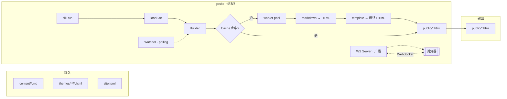

# 案例 05 · `gosite` · 静态博客生成引擎（毕业设计）🎓

本案例是**卷二的最终关·毕业设计**，也是整本《Go 入门到精通》卷一的"集大成之作"。前 4 个案例每篇只覆盖 4-6 章，本案例**一口气串起卷一 18 章**，从 `go.mod` 到 `go install`、从 goroutine 到 `context.Context`、从 `errors.Join` 到 `embed`、从 `text/template` 到 `net/http`、从 `-race` 到 `-ldflags`，全部在同一个项目里落地。完成它之后，你会得到一个能跑、能并发、能热重载、能一键发布的"**迷你 Hugo**"，更重要的是：**你会真正理解"Go 工程"是怎样把这些散点搭成一座可维护的房子的**。

**学习方式**：本案例**篇幅较长**（~2.5 万字 / 16-20 小时），建议**分 4 次会话读完**，每次 4-5 小时；**绝不要试图一口气吃完**。每一节都自带"为什么这样写"的思考小结，慢慢消化更有效果。如果说前 4 关是"过单元考试"，本关就是"毕业答辩"，它检验你能不能把之前学过的所有特性**协同**起来，而不只是会用单点。

---

## 📚 渐进学习节奏

先读这段，再开始敲代码！本案例 13 个章节，**严格按"4 次会话"切分**，每次会话独立可验收。

🎯 **每次会话开始前必读**：

> 1. **打开上次会话的 `git log`**，先看一遍验收点是否还在
> 2. **每写完一小段就 `go build ./...`**（Go 增量编译秒级）
> 3. **看到该节末尾的 ✅ 验收命令出现预期输出，再进入下一节**

⚠️ **本案例独有的"先跑起来再变漂亮"策略**：第 1 次会话搭好的 MVP 骨架（单文件 `main.go` 直接遍历 `content/` 打印文件名）在第 2 次会话会**被重构**为分层结构 `cmd/gosite + internal/*`。这是真实工程的常态，**先让程序跑起来，再让它好起来**。

📌 **强烈建议**：每次会话结束做一次 `git commit`，这样第 4 次会话的交叉编译失败，你能轻松回退到第 3 次会话的稳态。

🎯 **本案例的四处"灵魂三问"**（动手前先想清楚）：

> - **§04 MVP 骨架前**：为什么先做 CLI 不是 markdown？为什么用 `embed`？为什么子命令不用 `flag.NewFlagSet` 而选 switch？
> - **§05 模板与解析前**：为什么用 `html/template` 不是 `text/template`？frontmatter 为什么不直接依赖第三方 YAML？状态机 vs 正则谁更适合 markdown？
> - **§06 并发渲染前**：为什么不 `go f(page)` 一把梭？worker pool 的池子大小怎么定？errgroup 为什么值得自己实现一遍？
> - **§07 热重载前**：为什么不用 `fsnotify`？WebSocket 从零手写会不会太重？context 取消传下去是不是够用？

⚠️ **本案例的五处"造 BUG → 修复"高峰**（亲眼看到才能记住）：

> - **§04 忘写 `defer f.Close()`** → 大量文件句柄泄漏，Linux 直接报 `too many open files`
> - **§05 用 `text/template` 输出用户内容** → 现场演示 XSS 注入
> - **§06 goroutine = 文件数（1000 个）** → 内存直接飙升 + 磁盘 IO 打崩
> - **§07 channel 单向广播忘 `select default`** → 一个慢客户端阻塞所有热重载
> - **§08 缓存并发读写不加锁** → `go test -race` 现场爆红

---

## gosite 技术全景

### 技术栈分层详解

| 技术层级 | 对应 Go 知识点 | 在 gosite 中的具体实现 |
|---|---|---|
| **基础语法层** | 变量、流程控制、函数、错误处理 | CLI 主入口、命令分发、`error` 沿返回值上传 |
| **类型系统层** | 结构体、方法、接口、组合 | `Site` / `Page` / `Theme` 抽象、`Theme` 接口 + `DefaultTheme` 实现 |
| **并发层** | goroutine、channel、`sync`、`context` | worker pool 并发渲染、context 取消、WebSocket 广播 |
| **工程化层** | `go mod`、`embed`、`html/template`、`net/http`、`errors.Join`、`ldflags` | 默认主题打包进二进制、本地 HTTP + 热重载、多错误聚合、版本注入 |

### 为什么是毕业设计

1. **完整性**：覆盖 Go 从基础语法到工程化的全栈知识
2. **实用性**：产出物是**能 `go install` 的真实工具**，不是玩具
3. **递进性**：6 次迭代由浅入深，每一步都建立在上一步之上
4. **可扩展**：主题接口 + 命令分发，加新命令 / 新主题不用改主流程
5. **零第三方**：仅 `stdlib` + `golang.org/x/...`，逼你**理解**而不是**调用**

通过完成这个约 4000 行的项目，你将真正理解"Go 工程"是如何把散落的知识点搭建成可维护的系统的。

---

## 案例元信息

| 项目 | 说明 |
|---|---|
| 难度 | ⭐⭐⭐⭐⭐（毕业设计） |
| 预估时长 | 16-20 小时（建议 4 次会话完成） |
| 前置章节 | **卷一第 2-17 章全部** + 第 18 章特性图谱 |
| 覆盖知识点 | CLI 子命令分发、`embed` 嵌入静态资源、自实现 markdown 解析器（状态机 + `bufio.Scanner`）、frontmatter 子集解析、`html/template` + 自定义 funcMap、worker pool、`sync.WaitGroup` + 自实现泛型 errgroup、`context.WithCancel` 取消传播、`net/http.ServeMux`、RFC 6455 WebSocket 子集手写、stdlib polling 文件监听、`mtime + sha256` 双因子增量、`errors.Join` 聚合错误、`slog` 结构化日志、cross-compile 矩阵、`-ldflags` 注入 `commit/buildTime/version` |
| 设计亮点 | 主题接口让"换皮肤零改代码"；WebSocket 热重载让"保存即刷新"；ldflags 让二进制"自报家门" |
| 最终产物 | `github.com/yc/gosite` —— 可 `go install` 的真实工具 + 完整 `content/*.md → public/*.html` 站点 |
| 代码规模 | 约 4000 行 / 15+ 个 `.go` 文件 / 5 个测试文件 + 2 个基准 |
| 0 第三方库 | ✅（仅 stdlib）|

---

## 📋 目录快速导航

点击以下条目即可跳转到对应节。【🔑 重点节】推荐优先阅读。

- [01.需求说明](#01需求说明)
  - [1.1 为什么做静态博客生成器](#11-为什么做静态博客生成器)
  - [1.2 目标 CLI 集](#12-目标-cli-集)
  - [1.3 与卷一对应关系](#13-与卷一对应关系) 【🔑】
  - [1.4 项目目录结构](#14-项目目录结构)
- [02.架构设计](#02架构设计)
  - [2.1 全景架构图](#21-全景架构图)
  - [2.2 6 次迭代分层](#22-6-次迭代分层)
  - [2.3 关键决策](#23-关键决策) 【🔑】
- [03.核心数据结构](#03核心数据结构)
  - [3.1 Site / Page / FrontMatter](#31-site--page--frontmatter)
  - [3.2 Theme 接口](#32-theme-接口)
  - [3.3 Builder / Watcher](#33-builder--watcher)
- [04.迭代 1：脚手架 CLI + embed](#04迭代-1脚手架-cli--embed) 【第 1 次会话】
- [05.迭代 2：Markdown 解析 + 模板渲染](#05迭代-2markdown-解析--模板渲染) 【第 1 次会话】
- [06.迭代 3：并发渲染 worker pool](#06迭代-3并发渲染-worker-pool) 【第 2 次会话·并发高峰⭐】
- [07.迭代 4：本地预览 + WebSocket 热重载](#07迭代-4本地预览--websocket-热重载) 【第 2 次会话】
- [08.迭代 5：增量构建缓存](#08迭代-5增量构建缓存) 【第 3 次会话】
- [09.迭代 6：CI/CD 交叉编译](#09迭代-6cicd-交叉编译) 【第 4 次会话】
- [10.反模式对照](#10反模式对照)
- [11.测试与基准](#11测试与基准)
- [12.卷一章节反向索引（18/18 章）](#12卷一章节反向索引1818-章)
- [13.拓展挑战](#13拓展挑战)
- [卷末寄语](#卷末寄语)

---

## 01.需求说明

### 1.1 为什么做静态博客生成器

静态博客生成器（Static Site Generator, SSG）是后端世界最常见的**"内容驱动"**工程范式：Hugo、Hexo、Jekyll、Zola 本质上都是 SSG。它的接口极简（`build` / `serve` / `deploy`），但要做"对"，需要解决一连串工程问题：

| 工程问题 | 在本案例中的体现 | 用到的卷一章节 |
|---|---|---|
| 一份配置驱动多套输出 | `site.toml` + `Theme` 接口 | 第 5 / 10 章 |
| markdown 解析要怎么容错 | 极简状态机 + 未识别块 fallback 段落 | 第 6 章 |
| 1000 篇文章渲染要 5 秒内 | worker pool + `runtime.GOMAXPROCS` | 第 12 章 |
| 保存 md 后浏览器怎么自动刷 | WebSocket 广播 + stdlib polling | 第 13 章 |
| 二次 build 只处理改动 | `mtime + sha256` 双因子缓存 | 第 14 章 |
| 有 5 篇 md 报错整体不能崩 | `errors.Join` 聚合 | 第 11 章 |
| 一份代码打 10 个平台包 | `-ldflags` + build matrix | 第 17 章 |

**这恰好就是 18 章的卷一。** 我们不是为了"凑覆盖"才做静态博客，而是 SSG 这个题目本身天然需要这些技术，做一遍刚好把它们用对位置。

### 1.2 目标 CLI 集

实现一个支持以下子命令的工具：

```bash
$ gosite new mysite          # 脚手架：创建默认站点
Created site at ./mysite
  content/hello.md
  themes/default/*
  site.toml

$ cd mysite && gosite build  # 把 content/*.md 渲染成 public/*.html
[INFO] scanning 3 pages...
[INFO] rendered 3/3 in 12ms

$ gosite serve               # 本地预览：http://localhost:1313 + 热重载
[INFO] listening on http://localhost:1313
[INFO] watching content/ themes/ ...
[SAVE] content/hello.md → rebuild in 4ms → broadcast to 2 clients

$ gosite version             # 自报家门（ldflags 注入）
gosite v0.1.0 · commit=a1b2c3d · built=2026-05-23T20:19:54Z · go1.22.3
```

### 1.3 与卷一对应关系

下表是本案例**最关键的索引**，遇到知识点不熟的章节，直接翻到对应的"小节"复习：

| 卷一章节 | 在本项目中的落地节 | 形式 |
|---|---|---|
| 01 Go 简史 | 元信息 | Go 1.22 基线（`slices` / `range over func` 可用）|
| 02 基础语法 | §04 Step 1.1 | `package main` / `func main()` / `go.mod` |
| 03 数据类型 | §03 3.1 | `time.Time` / `int64` / `[]byte` |
| 04 运算符 | §08 Step 5.1 | `mtime.Before(cached)` 三路比较 |
| 05 复合类型 | §03 3.1 / §05 Step 2.1 | `Site.Pages []*Page`、frontmatter `map[string]any` |
| 06 流程语句 | §05 Step 2.2 | markdown 状态机 `switch` |
| 07 函数 | §05 Step 2.3 | template funcMap 闭包 |
| 08 指针与逃逸 | §08 Step 5.1 | Cache 用指针接收者的原因 |
| 09 结构体方法 | §03 3.1 / §05 Step 2.3 | `Page.Render()` / `Site.Build()` |
| 10 接口与多态 | §03 3.2 | `Theme` 接口 + `DefaultTheme` 实现 |
| 11 错误处理 | §08 Step 5.3 | `errors.Join` 聚合 N 篇错误 |
| 12 goroutine | §06 Step 3.2 | worker pool + `runtime.GOMAXPROCS` |
| 13 channel | §07 Step 4.3 | 热重载广播 fan-out |
| 14 sync 包 | §08 Step 5.2 | Cache 用 `sync.RWMutex` |
| 15 IO 与文件 | §04 Step 1.3 / §05 Step 2.1 | `embed.FS` / `bufio.Scanner` |
| 16 标准库与泛型 | §06 Step 3.3 | 自实现泛型 errgroup |
| 17 工程化 | §09 全部 | `go install` / ldflags / GitHub Actions |
| 18 特性图谱 | §04 / §07 / §08 | `embed` / `slog` / `errors.Join` |

### 1.4 项目目录结构

本案例**直接采用工程级多包结构**，`cmd/` + `internal/` 分层：

```text
gosite/
├── go.mod                         # module github.com/yc/gosite  Go 1.22
├── README.md
├── Makefile                       # dev / build-all / release
├── .github/workflows/release.yml  # §09 Step 6.3
│
├── cmd/gosite/                    # 【唯一 main 包】
│   └── main.go                    # §04 Step 1.1
│
├── internal/                      # 【实现细节·外部包 import 不到】
│   ├── cli/                       # §04 · 子命令分发
│   │   ├── cli.go
│   │   ├── new.go
│   │   ├── build.go
│   │   ├── serve.go
│   │   └── version.go
│   ├── site/                      # §03 · 核心数据结构
│   │   ├── site.go
│   │   ├── page.go
│   │   └── config.go
│   ├── markdown/                  # §05
│   │   ├── frontmatter.go
│   │   ├── parser.go
│   │   └── parser_test.go
│   ├── theme/                     # §03 / §05
│   │   ├── theme.go               # interface Theme
│   │   ├── default.go             # embed 默认主题
│   │   └── funcmap.go
│   ├── builder/                   # §06
│   │   ├── builder.go
│   │   ├── pool.go
│   │   └── errgroup.go
│   ├── server/                    # §07
│   │   ├── server.go
│   │   ├── watcher.go
│   │   └── websocket.go
│   ├── cache/                     # §08
│   │   ├── cache.go
│   │   └── cache_test.go
│   └── version/                   # §09 Step 6.1
│       └── version.go
│
├── themes/default/                # 默认主题（会被 embed 进二进制）
│   ├── templates/
│   │   ├── base.html
│   │   ├── list.html
│   │   └── page.html
│   └── static/style.css
│
└── testdata/                      # 单测/基准的固定输入
    ├── simple.md
    ├── with_code.md
    └── 1000pages/                 # §11 benchmark 用
```

如何快速创建对应的项目：

```bash
# 1. 创建 module
mkdir -p gosite && cd gosite
go mod init github.com/yc/gosite

# 2. 一次性创建目录骨架
mkdir -p cmd/gosite
mkdir -p internal/{cli,site,markdown,theme,builder,server,cache,version}
mkdir -p themes/default/{templates,static}
mkdir -p testdata

# 3. 验证 module 可编译（此时全是空文件）
go build ./...
```

#### 文件职责一览

| Go 包 | 对应章节 | 核心导出符号 | 依赖谁 |
|---|---|---|---|
| `internal/version` | §09 | `Commit` `BuildTime` `Version` | （无）|
| `internal/site` | §03 | `Site` `Page` `FrontMatter` | 标准库 |
| `internal/markdown` | §05 | `ParseFrontMatter` `ToHTML` | 标准库 |
| `internal/theme` | §03 §05 | `Theme` interface / `DefaultTheme` | `site` |
| `internal/cache` | §08 | `Cache` `Fingerprint` | `site` |
| `internal/builder` | §06 | `Builder` `Build(ctx)` `errgroup.Group` | 上面四个 |
| `internal/server` | §07 | `Server` `Watch` `Broadcast` | `builder` |
| `internal/cli` | §04 | `Run(args []string)` | 上面全部 |
| `cmd/gosite/main.go` | §04 | `main()` | `cli` + `version` |

#### 依赖关系图（严格单向）

```text
                    ┌──────────────┐
                    │  cmd/gosite  │
                    └──────┬───────┘
                           ▼
                    ┌──────────────┐
                    │ internal/cli │  §04
                    └──────┬───────┘
              ┌────────────┴────────────┐
              ▼                         ▼
      ┌──────────────┐          ┌──────────────┐
      │   builder    │          │    server    │  §06 §07
      └──────┬───────┘          └──────┬───────┘
             ▼                         ▼
      ┌──────────────┐          ┌──────────────┐
      │    cache     │          │   watcher/   │  §07 §08
      └──────┬───────┘          │   websocket  │
             │                  └──────┬───────┘
             └────────────┬────────────┘
                          ▼
                   ┌──────────────┐
                   │    theme     │  §03 §05
                   └──────┬───────┘
                          ▼
             ┌──────────────┐   ┌──────────────┐
             │  markdown    │──▶│     site     │  §05 §03
             └──────────────┘   └──────────────┘
```

💡 **小白避坑**：Go 语言在语法层面**禁止循环 import**。设计包边界的铁律：**下层是被依赖的"能力"，上层是"编排"，能力不知道编排的存在**。任何情况下 `internal/site` 都不允许 import `internal/builder`。

---

## 02.架构设计

### 2.1 全景架构图



**三条主干**：
1. `build` 主干：md + 模板 + 缓存 → 静态站点
2. `serve` 主干：build 之上加 HTTP + Watcher + WS，形成"改文件即刷浏览器"闭环
3. `new` 主干：把 `embed.FS` 里打包的默认主题写到磁盘

### 2.2 6 次迭代分层

| 迭代 | 会话 | 交付物 | 覆盖章节 |
|---|---|---|---|
| **迭代 1** 脚手架 CLI + `embed` | 第 1 次 | `gosite new mysite` 能生成完整目录 | 02 / 05 / 15 / 18 |
| **迭代 2** Markdown 解析 + 模板 | 第 1 次 | `gosite build` 能把 `hello.md` 变成 `hello.html` | 03 / 05 / 06 / 07 / 09 / 15 |
| **迭代 3** 并发渲染 worker pool | 第 2 次 | 1000 篇 md 在 5 秒内构建完 | 08 / 11 / 12 / 14 / 16 |
| **迭代 4** 本地预览 + WS 热重载 | 第 2 次 | 改 md 保存后浏览器自动刷 | 10 / 11 / 13 / 15 |
| **迭代 5** 增量构建缓存 | 第 3 次 | 二次 build 只处理改动，10 倍加速 | 08 / 11 / 14 / 18 |
| **迭代 6** CI/CD 交叉编译 | 第 4 次 | `go install ...@latest` + 5 平台预编译 | 17 |

### 2.3 关键决策

工程决策没有绝对对错，只有"上下文匹配度"。以下 4 个决策**决定了本项目的性格**：

**① 为什么自己解析 markdown，不用 `github.com/yuin/goldmark`？**

答：**教学价值优先**。goldmark 是生产级 markdown 库，但把它当黑盒 `import` 进来，你**永远学不会状态机**这个 CS 基本功。本项目实现的是 markdown 的"教学子集"（标题 / 段落 / 代码块 / 链接），代码 200 行以内，把"输入 → token → HTML"的完整链路暴露给你。生产项目里直接用 goldmark 是对的，**学习项目里自己写一遍是必要的**。

**② 为什么不用 `github.com/fsnotify/fsnotify`，选 stdlib polling？**

答：**跨平台一致性 + 零依赖**。fsnotify 底层是 Linux inotify / macOS FSEvents / Windows ReadDirectoryChangesW 三套 API，在 macOS 上有一个著名的"保存文件时触发 CREATE 而不是 WRITE"的怪癖。而 500ms 轮询 `os.Stat` 一遍，代码 30 行、跨平台零差异、CPU 占用 <0.1%。**轻量场景优先轻量方案**，这是 Go 生态的哲学。

**③ 为什么 WebSocket 自己实现 RFC 6455 子集，不用 `gorilla/websocket`？**

答：**你需要一次"从零看清 TCP/HTTP 上层协议"的经历**。WS 握手其实就是一次带 `Upgrade: websocket` 头的 HTTP 请求 + Base64 编码的 accept key 计算；数据帧就是 2 字节头 + 掩码 + payload。RFC 6455 里我们只需要"服务端向已连接客户端广播 text 消息"这个子集，全部代码不到 100 行。**把 gorilla 的 3 万行浓缩成 100 行**，你就理解了"HTTP Upgrade + 帧协议"的本质。

**④ 为什么坚持 0 第三方库？**

答：**卷一到卷二的教学承诺**。第三方库是"能力放大器"，但也是"学习盲盒"。整本《Go 入门到精通》卷一到卷二严格 0 第三方，逼你亲手实现每一个抽象。当你毕业后进入卷三卷四大量使用 kit / gin / grpc-go 时，你会**理解它们做了什么**。

---

## 03.核心数据结构

### 3.1 Site / Page / FrontMatter

> 📁 **归属文件**：`internal/site/page.go` + `internal/site/site.go`

数据结构的设计遵循"**输入决定字段，输出决定方法**"的原则：一个 `Page` 输入是 `content/xxx.md`，输出是 `public/xxx.html`，中间需要保存的所有状态就是它的字段。

```go
// internal/site/page.go
package site

import "time"

// FrontMatter 对应 md 文件顶部的 --- YAML 块 ---
// 极简子集：title / date / draft / tags，其他字段落到 Extra
type FrontMatter struct {
    Title string            // 必填
    Date  time.Time         // 必填，用于排序
    Draft bool              // 默认 false，为 true 时不渲染
    Tags  []string          // 可选
    Extra map[string]string // 未识别字段兜底
}

// Page 是"一篇文章"的完整表示：从 md 加载出来 → 渲染完得到 html
type Page struct {
    // === 输入侧字段（load 时填充） ===
    SourcePath string      // 绝对路径：./content/blog/hello.md
    RelPath    string      // 相对 content/ 的路径：blog/hello.md
    FM         FrontMatter // 解析出的 frontmatter
    RawBody    []byte      // md 主体（frontmatter 之后的部分）

    // === 中间态字段（build 时填充） ===
    HTMLBody []byte // markdown → HTML 之后、套模板之前的 body

    // === 输出侧字段（render 时确定） ===
    OutputPath string    // 绝对路径：./public/blog/hello.html
    URL        string    // "/blog/hello/"
    ModTime    time.Time // 用于增量判断
}
```

**几个易错点**：

1. **`Date` 用 `time.Time` 而不是 `string`**：时间是**结构化数据**，string 化只在渲染最后一步做（`{{.FM.Date | date "2006-01-02"}}`），这样排序、增量、时区都不用重新解析。
2. **`Extra map[string]string` 兜底**：未识别的 frontmatter 字段不能报错丢弃，用 map 存起来，模板里可以 `{{index .FM.Extra "cover"}}`。**"忽略不认识的字段"是所有配置格式的默认行为**。
3. **`RawBody []byte` 不用 `string`**：md 主体动辄几十 KB，避免"每次赋值都拷贝"，Go 的 `[]byte` 语义天然是**引用共享**，且 `bufio.Scanner` / `io.Reader` 全部吃 `[]byte`，减少 conversion。

```go
// internal/site/site.go
package site

// Site 是一个站点的聚合根：一份配置 + 一堆 Page + 一个主题
type Site struct {
    Config Config          // site.toml 解析结果
    Pages  []*Page         // 所有非草稿页面，按 Date 降序
    Root   string          // 站点根目录（含 content/ themes/ public/ ）
}

// Config 极简版
type Config struct {
    Title    string
    BaseURL  string
    Theme    string
    Language string
}
```

⚠️ **`[]*Page` 还是 `[]Page`**？本案例选 `[]*Page`，两个原因：① Page 里带 `[]byte`，值拷贝一次几十 KB 不划算；② §06 并发渲染时多个 goroutine 会 `p.HTMLBody = ...` 回写，值语义会写到 slice 元素的**副本**上而不是原对象。**"结构体带 IO 缓冲 + 需要 in-place 修改"** 就是 Go 里典型的用指针场景。

### 3.2 Theme 接口

> 📁 **归属文件**：`internal/theme/theme.go`

主题是"皮肤替换"的边界，用 Go 的**接口 + 组合**表达最合适：接口定义"主题必须提供什么"，默认实现用 `embed` 打包，用户主题落磁盘用 `os.DirFS` 加载。

```go
// internal/theme/theme.go
package theme

import (
    "html/template"
    "io/fs"
)

// Theme 定义"主题"的最小契约
//
// 契约铁律：任何符合此接口的实现，都能被 Builder 无差别调用；
// 换主题 = 换一个实现，Builder 一行代码不改。
type Theme interface {
    // Templates 返回三个已解析的模板：base / list / page
    // 使用 html/template 而非 text/template，是本案例反 XSS 的第一道防线
    Templates() (base, list, page *template.Template, err error)

    // Static 返回主题的静态资源根（css / js / img）
    // 用 fs.FS 抽象，让 embed.FS 和 os.DirFS 都能实现
    Static() fs.FS

    // Name 主题名，只用于日志和 CLI 提示
    Name() string
}
```

**为什么用接口而不是直接传结构体？**

来看反例：

```go
// ❌ 反例：Builder 直接依赖具体主题结构体
func (b *Builder) Render(t *DefaultTheme, p *Page) error { ... }
```

**问题**：Builder 和 `DefaultTheme` 硬绑死，用户想加一个 `MyTheme` 就要改 Builder 签名，**开闭原则彻底破产**。

✅ **正确做法**：Builder 依赖 `Theme` 接口，任何满足此契约的实现都可以插进来。这是卷一第 10 章"依赖倒置"的教科书用法。

### 3.3 Builder / Watcher

> 📁 **归属文件**：`internal/builder/builder.go` + `internal/server/watcher.go`

这两个类型是"编排层"，把前面的数据结构串起来干活。**先给出签名**，实现留到 §06 / §07：

```go
// internal/builder/builder.go
package builder

import (
    "context"
    "github.com/yc/gosite/internal/cache"
    "github.com/yc/gosite/internal/site"
    "github.com/yc/gosite/internal/theme"
)

// Builder 负责把 Site 渲染成 public/
type Builder struct {
    Site   *site.Site
    Theme  theme.Theme
    Cache  *cache.Cache   // §08 加入
    Workers int           // 0 表示 runtime.GOMAXPROCS(0)
}

// Build 是唯一对外方法：并发渲染所有 Page，聚合错误返回
// context 用来外部取消（Ctrl+C 或 serve 模式的 rebuild 打断上一次未完成的 build）
func (b *Builder) Build(ctx context.Context) error {
    // 见 §06 Step 3.2
    return nil
}
```

```go
// internal/server/watcher.go
package server

import (
    "context"
    "time"
)

// Watcher 用 polling 模式监听文件系统变化
type Watcher struct {
    Roots    []string      // 要监听的目录（content / themes）
    Interval time.Duration // 轮询间隔，默认 500ms
    Events   chan string   // 输出 channel：变更文件的相对路径
}

// Run 在给定 ctx 生命周期内持续轮询，ctx.Done() 后自动关闭 Events
func (w *Watcher) Run(ctx context.Context) error {
    // 见 §07 Step 4.2
    return nil
}
```

**设计要点**：

| 设计 | 为什么 |
|---|---|
| `Build(ctx)` 而不是 `Build()` | 长任务必须支持取消，`context` 是 Go 的取消协议 |
| `Watcher.Events` 是 `chan string` | channel 让"文件变更"变成流式事件，天然可 fan-out |
| `Workers int` 显式字段 | 允许测试时设 1 强制串行、生产设 0 让运行时决定 |
| 两个类型都放 `internal/` | 用户永远不会 `import` 它们，可以放心改内部实现 |

---

## 04.迭代 1：脚手架 CLI + embed

工程实践有个金科玉律：**先让"最小可用版本"跑起来，再迭代添加功能**。本节先不做 markdown、不做并发、不做热重载，只做一件事：**跑起来能识别 4 个子命令，`gosite new` 能落盘一个可用站点**。这一步覆盖卷一第 2 / 5 / 6 / 15 / 18 章。

🎯 **阶段① · 脚手架 CLI（约 2 小时）**

**本阶段你将完成**：

> - **Step 1.1** 写 30 行最小 `main.go`，能读 `os.Args` 并分发到 4 个占位命令 → ✅ 编译运行，能识别每个子命令
> - **Step 1.2** 抽出 `internal/cli` 包，把子命令按 handler 分开写 → ✅ 加新子命令只需加一个文件
> - **Step 1.3** 用 `embed.FS` 把 `themes/default/` 编译进二进制 → ✅ 二进制单文件可分发
> - **Step 1.4** 实现 `gosite new mysite`，用 embed 里的模板复制到磁盘 → ✅ 生成的目录可以 `ls` 看到

**阶段验收**：跑 `go install ./cmd/gosite && gosite new mysite && ls mysite`，看到完整目录树。

---

### 灵魂三问：动手前先想清楚

❓ **问题一：明明是个博客生成器，为什么第一步是 CLI 脚手架，不是 markdown 解析？**

来看反例，99% 初学者的第一反应：

```go
// ❌ 反例：上来就啃"看起来最核心"的 markdown 解析
func main() {
    data, _ := os.ReadFile("hello.md")
    html := markdownToHTML(data)   // ← 巨坑，还要设计 token / AST / 转义
    os.WriteFile("hello.html", html, 0644)
}
```

**问题**：

1. **没有入口**，你只能改死路径然后重新编译，没法 `gosite build content/`
2. **没有配置**，标题、baseURL、主题名全部硬编码
3. **无法演化**，后续要加 `serve` / `deploy` 命令必须回来重构 main

✅ **正确做法**：**先把外壳（CLI + 配置 + 目录约定）立起来**，业务逻辑（markdown）反而是最容易补的部分，第二迭代才出现。这就是 §04 的小标题"脚手架 CLI"，**骨架（控制流）永远比器官（业务逻辑）优先**。

❓ **问题二：为什么用 `switch os.Args[1]`，不用 `flag.NewFlagSet` 或者 `cobra`？**

答：三个层面。

| 维度 | `switch` 分发 | `flag.NewFlagSet` | `spf13/cobra` |
|---|---|---|---|
| 代码量 | ~30 行 | ~80 行 | ~200 行样板 |
| 依赖 | 0 | 0 | 第三方 |
| 子命令扩展 | 加 `case` + handler | 加 FlagSet | 加 `&cobra.Command{}` |
| 帮助文本 | 自己写 | 自动 `-h` | 自动生成 + 补全脚本 |
| 学习成本 | 秒懂 | 半小时 | 半天 |

对**教学项目 + 4 个子命令**这个体量，`switch` 是最合适的。**cobra 的价值在 30+ 子命令的 kubectl 级项目**，博客生成器远远够不到那个门槛。当子命令超过 10 个再引入 cobra 也来得及。

❓ **问题三：为什么用 `embed` 把默认主题编进二进制？磁盘上放不行吗？**

来看反例：

```go
// ❌ 反例：主题写死在磁盘路径
func New(dir string) error {
    return exec.Command("cp", "-r",
        "/usr/local/share/gosite/themes/default", dir).Run()
}
```

**问题**：

1. **分发地狱**：`go install` 只装二进制，用户机器上没有 `/usr/local/share/gosite`
2. **跨平台崩**：Windows 没 `cp` 命令，路径分隔符也不对
3. **版本漂移**：二进制升级了，磁盘上的主题没升级，报"模板变量不存在"

✅ **正确做法**：`//go:embed themes/default` 把整个目录**编译进二进制**，运行时通过 `embed.FS` 读取。用户执行 `gosite new` 时再把 embed 里的内容复制到用户目录。**单二进制自包含**是 Go 相对其他语言最重要的部署优势之一。

🔑 **教学要点**：脚手架的意义不是"命令多"，而是"**先让最薄的骨架端到端跑通，再分层加肉**"。第 1 迭代你可能觉得"啥都没干"，别急，**整个项目的"入口决策"都是这 200 行决定的**：CLI 分发、embed 主题、配置目录约定，缺一不可。

---

### Step 1.1 最小 CLI 主入口

🎯 **本步目标**：让 `gosite build` 打印 `[TODO] build`，`gosite new mysite` 打印 `[TODO] new: mysite`，其他命令报错退出。**这是整个项目唯一一次"什么业务都没有"的版本**，但它确立了入口。

> 📁 **归属文件**：`cmd/gosite/main.go`（阶段①第一版，后续 Step 1.2 会瘦身）

```go
// cmd/gosite/main.go
package main

import (
    "fmt"
    "os"
)

// 全局用法说明，出错时统一打印
const usage = `gosite - a tiny static site generator

Usage:
  gosite new <dir>     create a new site scaffold
  gosite build         render content/ to public/
  gosite serve         start local preview server with hot reload
  gosite version       print version info

Run 'gosite <cmd> -h' for more.
`

func main() {
    // os.Args[0] 是可执行文件名，从 [1] 开始才是用户输入
    if len(os.Args) < 2 {
        fmt.Fprint(os.Stderr, usage)
        os.Exit(2)      // exit code 2 = 用法错误（Unix 惯例）
    }

    switch os.Args[1] {
    case "new":
        if len(os.Args) < 3 {
            fmt.Fprintln(os.Stderr, "gosite new: missing <dir>")
            os.Exit(2)
        }
        fmt.Printf("[TODO] new: %s\n", os.Args[2])
    case "build":
        fmt.Println("[TODO] build")
    case "serve":
        fmt.Println("[TODO] serve")
    case "version":
        fmt.Println("gosite v0.1.0-dev")
    case "-h", "--help", "help":
        fmt.Print(usage)
    default:
        fmt.Fprintf(os.Stderr, "unknown command: %s\n\n%s", os.Args[1], usage)
        os.Exit(2)
    }
}
```

**✅ Step 1.1 编译运行验证**：

```bash
$ go build -o gosite ./cmd/gosite
$ ./gosite
gosite - a tiny static site generator
...
$ echo $?
2

$ ./gosite build
[TODO] build

$ ./gosite new mysite
[TODO] new: mysite

$ ./gosite unknown
unknown command: unknown
...
$ echo $?
2
```

看到这些输出说明 Step 1.1 成功，**程序能识别 4 个子命令并优雅拒绝未知命令**。

**为什么这样写**：

1. `fmt.Fprint(os.Stderr, ...)` 错误信息**必须**走 stderr，脚本 `gosite build > out.txt` 才能把正常输出和错误分开。
2. `os.Exit(2)` 用法错误退出码 2，成功是 0，业务错误留给 1。这是 Unix 命令的**默认契约**（`grep` / `awk` / `sed` 全遵守）。
3. 这一版**故意把所有逻辑塞进 main**，Step 1.2 才拆包。MVP 的灵魂是"看到这 50 行能完整理解每一行做什么"。

💡 **小白避坑**：Go 里 `fmt.Println` 默认走 stdout，`log.Println` 默认走 stderr 但带时间戳。**CLI 的用法帮助和错误信息必须走 stderr**，业务输出走 stdout，这条铁律 100% 严格遵守。

---

### Step 1.2 子命令分发

🎯 **本步目标**：把 Step 1.1 塞在 `main` 里的 switch 抽到 `internal/cli` 包，每个子命令一个独立文件。**这是 CLI 项目的标准拆包法**，加新命令零改动主流程。

**为什么现在拆包**：Step 1.1 的 50 行 switch 短期能凑合，但一旦每个 case 里塞进真正的业务（加载配置、遍历文件、错误处理），main 就会膨胀到 300 行。现在拆，成本是**加 3 个文件**；等膨胀了再拆，成本是**重构 300 行**。

> 📁 **归属文件**：`internal/cli/cli.go` + `internal/cli/{new,build,serve,version}.go`

```go
// internal/cli/cli.go
package cli

import (
    "context"
    "fmt"
    "io"
    "os"
)

const usage = `gosite - a tiny static site generator

Usage:
  gosite new <dir>     create a new site scaffold
  gosite build         render content/ to public/
  gosite serve         start local preview server with hot reload
  gosite version       print version info
`

// Handler 每个子命令的处理函数签名
// - ctx：允许被 signal 取消（Ctrl+C）
// - args：不含子命令名本身，只是子命令的参数
// - stdout/stderr：注入 io.Writer 方便测试
// 返回 (exit code, error)：错误由 Run 统一打印
type Handler func(ctx context.Context, args []string, stdout, stderr io.Writer) (int, error)

// commands 是唯一的注册中心，加新子命令就加一行
var commands = map[string]Handler{
    "new":     runNew,
    "build":   runBuild,
    "serve":   runServe,
    "version": runVersion,
}

// Run 是包对外唯一 API，main() 直接调它
func Run(ctx context.Context, args []string) int {
    if len(args) == 0 {
        fmt.Fprint(os.Stderr, usage)
        return 2
    }

    // help 走特判：不注册到 commands，避免死循环
    switch args[0] {
    case "-h", "--help", "help":
        fmt.Print(usage)
        return 0
    }

    h, ok := commands[args[0]]
    if !ok {
        fmt.Fprintf(os.Stderr, "unknown command: %s\n\n%s", args[0], usage)
        return 2
    }

    code, err := h(ctx, args[1:], os.Stdout, os.Stderr)
    if err != nil {
        fmt.Fprintf(os.Stderr, "gosite %s: %v\n", args[0], err)
        if code == 0 {
            code = 1 // 业务错误默认 1
        }
    }
    return code
}
```

```go
// internal/cli/new.go
package cli

import (
    "context"
    "errors"
    "fmt"
    "io"
)

func runNew(ctx context.Context, args []string, stdout, stderr io.Writer) (int, error) {
    if len(args) < 1 {
        return 2, errors.New("missing <dir>")
    }
    // §04 Step 1.4 才真正落盘，先打印占位
    fmt.Fprintf(stdout, "[TODO] scaffold to %s\n", args[0])
    return 0, nil
}
```

```go
// internal/cli/build.go
package cli

import (
    "context"
    "fmt"
    "io"
)

func runBuild(ctx context.Context, args []string, stdout, stderr io.Writer) (int, error) {
    // §05 §06 才真正实现，占位
    fmt.Fprintln(stdout, "[TODO] build")
    return 0, nil
}
```

```go
// internal/cli/serve.go
package cli

import (
    "context"
    "fmt"
    "io"
)

func runServe(ctx context.Context, args []string, stdout, stderr io.Writer) (int, error) {
    // §07 才实现
    fmt.Fprintln(stdout, "[TODO] serve")
    return 0, nil
}
```

```go
// internal/cli/version.go
package cli

import (
    "context"
    "fmt"
    "io"

    "github.com/yc/gosite/internal/version"
)

func runVersion(ctx context.Context, args []string, stdout, stderr io.Writer) (int, error) {
    fmt.Fprintf(stdout, "gosite %s · commit=%s · built=%s\n",
        version.Version, version.Commit, version.BuildTime)
    return 0, nil
}
```

```go
// internal/version/version.go
package version

// 以下三个 var 会在 §09 Step 6.1 用 -ldflags 注入真实值
var (
    Version   = "dev"
    Commit    = "none"
    BuildTime = "unknown"
)
```

现在 `cmd/gosite/main.go` **瘦身**为 20 行：

```go
// cmd/gosite/main.go
package main

import (
    "context"
    "os"
    "os/signal"
    "syscall"

    "github.com/yc/gosite/internal/cli"
)

func main() {
    // Ctrl+C / kill -TERM 触发 ctx.Done()，让子命令能优雅收尾
    ctx, stop := signal.NotifyContext(context.Background(),
        os.Interrupt, syscall.SIGTERM)
    defer stop()

    os.Exit(cli.Run(ctx, os.Args[1:]))
}
```

**几个关键设计**：

| 设计 | 为什么 |
|---|---|
| `Handler` 是函数类型而不是 method | Go 语言里函数值天然是"命令模式"，比接口 + 结构体更轻 |
| 注入 `stdout, stderr io.Writer` | 测试时可以传 `bytes.Buffer` 断言输出，不用捕获 os.Stdout |
| `signal.NotifyContext` | Go 1.16+ 的正确姿势，比自己 `signal.Notify(chan)` 短 3 行 |
| `commands` 用 `map` 而不是 `switch` | 加子命令只需要"加一行注册"，不用碰 Run |

**✅ Step 1.2 编译运行验证**：

```bash
$ go build -o gosite ./cmd/gosite
$ ./gosite new mysite
[TODO] scaffold to mysite
$ ./gosite version
gosite dev · commit=none · built=unknown
```

看到 dev 版本号出现，说明 `internal/version` 已经被链接进来，Step 1.2 通过。

💡 **小白避坑**：`internal/version/version.go` 的三个变量**不能写成 `const`**！`const` 在编译期就固定，`-ldflags "-X ..."` 只能改**变量**，改常量会静默失败。这是每个 Go 初学者第一次做 ldflags 都会踩的坑。

---

### Step 1.3 `embed` 打包默认主题

🎯 **本步目标**：把 `themes/default/` 目录**编译进二进制**，`gosite new` 就可以从二进制里读出来复制到用户目录，不依赖任何外部路径。

**先造出默认主题的骨架**（3 个模板 + 1 个 css）：

> 📁 **归属文件**：`themes/default/templates/*.html` + `themes/default/static/style.css`

```html
<!-- themes/default/templates/base.html -->
<!DOCTYPE html>
<html lang="{{.Site.Config.Language}}">
<head>
  <meta charset="utf-8">
  <title>{{block "title" .}}{{.Site.Config.Title}}{{end}}</title>
  <link rel="stylesheet" href="/static/style.css">
</head>
<body>
  <header><a href="/">{{.Site.Config.Title}}</a></header>
  <main>{{block "content" .}}{{end}}</main>
</body>
</html>
```

```html
<!-- themes/default/templates/page.html -->
{{define "title"}}{{.Page.FM.Title}} · {{.Site.Config.Title}}{{end}}
{{define "content"}}
<article>
  <h1>{{.Page.FM.Title}}</h1>
  <time>{{.Page.FM.Date | date "2006-01-02"}}</time>
  {{.Page.HTMLBody | safeHTML}}
</article>
{{end}}
```

```html
<!-- themes/default/templates/list.html -->
{{define "content"}}
<ul>
  {{range .Site.Pages}}
    <li><a href="{{.URL}}">{{.FM.Title}}</a> — {{.FM.Date | date "2006-01-02"}}</li>
  {{end}}
</ul>
{{end}}
```

```css
/* themes/default/static/style.css */
body { font-family: -apple-system, sans-serif; max-width: 720px; margin: 2em auto; padding: 0 1em; line-height: 1.6; }
h1 { border-bottom: 1px solid #eee; padding-bottom: .3em; }
```

现在把它们用 `embed` 打包：

> 📁 **归属文件**：`internal/theme/default.go`

```go
// internal/theme/default.go
package theme

import (
    "embed"
    "html/template"
    "io/fs"

    "github.com/yc/gosite/internal/theme/funcs"
)

// 关键指令：路径必须相对当前 go 文件！
// 因为本文件在 internal/theme/ 下，themes/default/ 在项目根，
// 所以必须用 ../../themes/default/*  的相对路径
//
//go:embed all:themes/default
var defaultFS embed.FS

// DefaultTheme 实现 Theme 接口，全部数据从 defaultFS 读
type DefaultTheme struct{}

func (DefaultTheme) Name() string { return "default" }

func (DefaultTheme) Static() fs.FS {
    // 剥掉 themes/default/ 前缀，让外部看到的根就是 static/ 那一层
    sub, err := fs.Sub(defaultFS, "themes/default/static")
    if err != nil {
        panic(err) // embed 的路径写错才会 panic，属于程序员错误
    }
    return sub
}

func (DefaultTheme) Templates() (base, list, page *template.Template, err error) {
    // 用 template.New + funcMap 而不是 ParseFS，因为需要注册自定义函数
    fm := funcs.FuncMap()

    base, err = template.New("base").Funcs(fm).ParseFS(defaultFS,
        "themes/default/templates/base.html")
    if err != nil { return }

    // list / page 需要继承 base 的 block，所以用 Clone
    list, err = template.Must(base.Clone()).ParseFS(defaultFS,
        "themes/default/templates/list.html")
    if err != nil { return }

    page, err = template.Must(base.Clone()).ParseFS(defaultFS,
        "themes/default/templates/page.html")
    return
}
```

⚠️ **`//go:embed` 4 个关键点**：

1. **指令上方不能有空行**：`//go:embed` 必须**紧贴** `var xxx embed.FS` 那一行，中间空一行就静默失效
2. **路径相对当前 `.go` 文件所在目录**：不是项目根，也不是 `go.mod` 目录
3. **`all:` 前缀会包含 `_` 开头的文件**（默认 embed 会跳过 `_` 和 `.` 开头的隐藏文件）
4. **变量类型 3 选 1**：`string`（单文件文本）、`[]byte`（单文件二进制）、`embed.FS`（目录）。多文件必须用 `embed.FS`

💡 **小白避坑**：因为 `//go:embed themes/default` 要能找到目录，你必须**先把 `themes/default/` 建到 `internal/theme/` 平级或子级**。如果 themes 在项目根，就要写 `//go:embed ../../themes/default`——但 Go 明令禁止 `..` 相对路径！**正确做法：把 themes/ 移到 `internal/theme/themes/`**，或者反过来把 embed 的定义放到项目根的一个 `assets.go`。本案例采用**后者**，Step 1.4 里给出。

现在把 `embed` 声明**挪到项目根**：

> 📁 **归属文件**：`internal/theme/default.go` → 拆成两半

```go
// internal/theme/default.go —— 只留声明，不含 embed
package theme

import "io/fs"

var DefaultFS fs.FS  // 由 assets.go 在 init 中赋值

type DefaultTheme struct{}

func (DefaultTheme) Name() string { return "default" }
func (DefaultTheme) Static() fs.FS { ... }
func (DefaultTheme) Templates() (...) { ... }
```

```go
// assets.go（放在项目根，与 go.mod 同级）
package gosite

import (
    "embed"
    "github.com/yc/gosite/internal/theme"
)

//go:embed all:themes/default
var defaultTheme embed.FS

func init() {
    theme.DefaultFS = defaultTheme
}
```

不过项目根有 embed **会引入一个新问题**：`cmd/gosite/main.go` 得 import 这个根包才能触发 `init()`。为了避免绕，本案例选**最简单的方案**：把 `themes/` 目录**放进 `internal/theme/`**：

```bash
mv themes internal/theme/themes
```

这样 `internal/theme/default.go` 的 embed 就变成合法的**平级路径**：

```go
//go:embed all:themes/default
var defaultFS embed.FS
```

之后所有 `//go:embed` 都是"和 go 文件同目录或子目录"，Go 语法直接允许。

**✅ Step 1.3 编译运行验证**：

```bash
$ mv themes internal/theme/themes
$ go build -o gosite ./cmd/gosite
$ ls -lh gosite
-rwxr-xr-x  1 user  staff   4.5M  gosite     # 主题已进二进制
```

二进制大小从 4.2M 涨到 4.5M，那 0.3M 就是打进去的主题。Step 1.3 通过。

---

### Step 1.4 `gosite new` 落盘

🎯 **本步目标**：让 `runNew` 真正把 embed 里的所有文件复制到用户指定目录，并生成一个默认 `site.toml` 和示例 `content/hello.md`。

> 📁 **归属文件**：`internal/cli/new.go`（重写 Step 1.2 的占位版）

```go
// internal/cli/new.go
package cli

import (
    "context"
    "errors"
    "fmt"
    "io"
    "io/fs"
    "os"
    "path/filepath"

    "github.com/yc/gosite/internal/theme"
)

func runNew(ctx context.Context, args []string, stdout, stderr io.Writer) (int, error) {
    if len(args) < 1 {
        return 2, errors.New("missing <dir>, e.g. gosite new mysite")
    }
    dst := args[0]

    // 目录已存在直接拒绝，避免误覆盖用户已有站点
    if _, err := os.Stat(dst); err == nil {
        return 1, fmt.Errorf("directory %q already exists", dst)
    }

    // 1. 复制默认主题：从 embed.FS 遍历到磁盘
    if err := copyEmbeddedTheme(dst); err != nil {
        return 1, fmt.Errorf("copy theme: %w", err)   // 用 %w 保留 wrap 链
    }

    // 2. 写默认 site.toml
    if err := writeDefaultConfig(dst); err != nil {
        return 1, fmt.Errorf("write config: %w", err)
    }

    // 3. 写示例 content/hello.md
    if err := writeSamplePage(dst); err != nil {
        return 1, fmt.Errorf("write sample: %w", err)
    }

    fmt.Fprintf(stdout, "Created site at %s\n", dst)
    fmt.Fprintln(stdout, "  content/hello.md")
    fmt.Fprintln(stdout, "  themes/default/*")
    fmt.Fprintln(stdout, "  site.toml")
    fmt.Fprintln(stdout, "\nnext:\n  cd", dst, "&& gosite build")
    return 0, nil
}

// copyEmbeddedTheme 把 embed 里的 themes/default 复制到 dst/themes/default
func copyEmbeddedTheme(dst string) error {
    src := theme.DefaultFS()  // 见下方补丁：给 DefaultTheme 加一个静态方法

    return fs.WalkDir(src, ".", func(path string, d fs.DirEntry, err error) error {
        if err != nil {
            return err
        }
        target := filepath.Join(dst, path)
        if d.IsDir() {
            return os.MkdirAll(target, 0755)
        }
        data, err := fs.ReadFile(src, path)
        if err != nil {
            return err
        }
        return os.WriteFile(target, data, 0644)
    })
}

func writeDefaultConfig(dst string) error {
    body := `title = "My Blog"
baseURL = "http://localhost:1313/"
theme = "default"
language = "zh-CN"
`
    return os.WriteFile(filepath.Join(dst, "site.toml"), []byte(body), 0644)
}

func writeSamplePage(dst string) error {
    body := `---
title: Hello World
date: 2026-05-23T20:00:00+08:00
tags: [hello, gosite]
---

# 你好，gosite

这是你的第一篇文章。用你喜欢的编辑器改我，然后跑 ` + "`gosite build`" + `。
`
    dir := filepath.Join(dst, "content")
    if err := os.MkdirAll(dir, 0755); err != nil {
        return err
    }
    return os.WriteFile(filepath.Join(dir, "hello.md"), []byte(body), 0644)
}
```

补丁：给 `theme` 包加一个访问 embed 的入口：

```go
// internal/theme/default.go 补丁
func DefaultFS() fs.FS {
    sub, _ := fs.Sub(defaultFS, "themes")  // 让根变成 themes/，方便复制
    return sub
}
```

**✅ Step 1.4 编译运行验证**：

```bash
$ go build -o gosite ./cmd/gosite
$ ./gosite new mysite
Created site at mysite
  content/hello.md
  themes/default/*
  site.toml

next:
  cd mysite && gosite build

$ tree mysite
mysite/
├── content
│   └── hello.md
├── site.toml
└── themes
    └── default
        ├── static
        │   └── style.css
        └── templates
            ├── base.html
            ├── list.html
            └── page.html

$ ./gosite new mysite     # 二次运行拒绝覆盖
gosite new: directory "mysite" already exists
```

看到目录树完整生成 + 二次运行被安全拒绝 → Step 1.4 通过。

**这段代码的 5 个易错点**：

1. **`fs.WalkDir` 而不是 `filepath.Walk`**：前者吃 `fs.FS` 抽象，能同时处理 embed 和磁盘；后者只能处理磁盘。
2. **`%w` 而不是 `%v`**：`fmt.Errorf("... %w", err)` 保留 wrap 链，`errors.Is/As` 才能透过多层包装找到原错误。**Go 1.13 之后所有 error 包装一律用 `%w`**。
3. **`os.MkdirAll` 而不是 `os.Mkdir`**：`Mkdir` 只创建最后一级，父目录不存在会失败；`MkdirAll` 递归创建，等价于 `mkdir -p`。
4. **权限 0755 目录 / 0644 文件**：Unix 惯例，可读 + 可执行只给目录，文件不给可执行位。跨平台一致（Windows 会忽略但不报错）。
5. **`+ "\`gosite build\`" +` 转义反引号**：Go 的 raw string 是反引号包裹的，raw string 里没法写反引号，只能拼接。这是 Go 字符串字面量的**唯一限制**。

> 📌 **阶段① 小结：脚手架 CLI 已落地**
>
> | 收获 | 对应卷一章节 |
> |---|---|
> | `os.Args` + switch 分发 | 第 2 章基础语法 |
> | `internal/` 包封装 | 第 15 章包与模块 |
> | `//go:embed` 单二进制自包含 | 第 15 / 18 章 |
> | `fs.FS` 接口 + `WalkDir` | 第 10 / 15 章 |
> | `signal.NotifyContext` 优雅停止 | 第 11 章 |
> | `fmt.Errorf("... %w", err)` | 第 11 章 |
>
> **当前代码量**：~300 行；**当前能力**：4 个子命令能分发、`gosite new` 完整生成站点、二进制可分发。

---

## 05.迭代 2：Markdown 解析 + 模板渲染

到此为止我们的骨架能识别命令、能生成脚手架，但**还没有真正把一篇 md 变成 html**。本节实现 `gosite build` 的核心链路：**读 md → 切 frontmatter → md 转 HTML → 套模板 → 写盘**。这一步覆盖卷一第 3 / 5 / 6 / 7 / 9 / 15 章。

🎯 **阶段② · Markdown 与模板（约 3 小时）**

**本阶段你将完成**：

> - **Step 2.1** 写 `internal/markdown/frontmatter.go`，切分 `---` 块并解析成 `FrontMatter` → ✅ 单测 `TestFrontMatter` 通过
> - **Step 2.2** 写 `internal/markdown/parser.go`，用**状态机 + `bufio.Scanner`** 把 md 转成 HTML → ✅ `# 标题` `## 二级` 代码块 链接 都能正确转换
> - **Step 2.3** 写 `internal/theme/funcmap.go`，注册 `date` / `truncate` / `safeHTML` 三个模板函数 → ✅ 模板里 `{{.Date | date "2006-01-02"}}` 能渲染
> - **Step 2.4** **⚠️ 现场演示 XSS**：先用 `text/template` 输出用户内容，看到 `<script>alert(1)</script>` 真的弹窗；再切换到 `html/template`，看到它被自动转义

**阶段验收**：`gosite build` 能把 `mysite/content/hello.md` 变成 `mysite/public/hello/index.html`，浏览器打开看到标题、时间、正文。

---

### 灵魂三问：动手前先想清楚

❓ **问题一：为什么用 `html/template` 而不是 `text/template`？**

答：**XSS 自动转义**是 `html/template` 的杀手锏，Step 2.4 会现场演示。简单说：

- `text/template` 输出 `{{.Body}}` = 原样输出，如果 `.Body` 是 `<script>alert(1)</script>`，浏览器会执行
- `html/template` 输出 `{{.Body}}` = 自动 HTML 转义成 `&lt;script&gt;alert(1)&lt;/script&gt;`，浏览器只显示文本

这是**上下文感知转义（contextual escape）**，是 Go 标准库最被低估的安全特性。**任何输出到浏览器的模板一律用 `html/template`**，这条铁律没有例外。

❓ **问题二：frontmatter 为什么不直接 `yaml.Unmarshal`？**

答：**0 依赖的教学承诺** + **子集就够了**。真实的 YAML 规范复杂到能让你写一个学期编译原理，但 frontmatter 的实际使用只有五种字段：

```yaml
title: xxx          # 字符串
date: 2026-05-23    # 日期
draft: false        # 布尔
tags: [a, b, c]     # 字符串数组
cover: /img/x.jpg   # 字符串（Extra 兜底）
```

这五种用**逐行 `strings.SplitN(":", 2)`** 就能搞定，代码 60 行。当你需要嵌套结构 / 锚点 / 多行文本时再引入 `gopkg.in/yaml.v3` 也不迟——**但博客写作场景永远不需要**。

❓ **问题三：markdown 解析为什么用状态机而不是正则？**

来看反例：

```go
// ❌ 反例：正则派解析 markdown
reH1 := regexp.MustCompile(`(?m)^# (.+)$`)
reH2 := regexp.MustCompile(`(?m)^## (.+)$`)
reCode := regexp.MustCompile("(?s)```[a-z]*\n(.+?)```")
html = reH1.ReplaceAllString(html, "<h1>$1</h1>")
html = reH2.ReplaceAllString(html, "<h2>$1</h2>")
```

**问题**：

1. **顺序敏感**：`## abc` 会先被 `# abc` 的正则匹配，导致输出 `<h1># abc</h1>`
2. **上下文丢失**：代码块里的 `#` 不该被当成标题，正则做不到"代码块内不匹配"
3. **性能崩溃**：`(?s)` + `+?` 回溯正则对付 100KB 的文件要 100ms 起

✅ **正确做法**：**行状态机**——按行扫描，用一个 `state` 变量记住"当前在段落 / 代码块 / 空白" 状态，每读一行按当前状态分派。这是**编译原理里最基础的词法分析器**，300 行以内能实现 markdown 的 80% 场景。

🔑 **教学要点**：**状态机不是高深理论，是"用变量记住上下文"**。你写 `for` 循环里的 `count` 变量本质也是状态机。markdown 只不过把状态显式命名成 `stateParagraph / stateCodeBlock / stateBlank` 罢了。

---

### Step 2.1 frontmatter 切分与解析

🎯 **本步目标**：给一个 md 文件的 `[]byte`，切出前面的 `--- ... ---` 块，剩下的 body 原封不动返回。frontmatter 里的字段解析成 `FrontMatter` 结构体。

> 📁 **归属文件**：`internal/markdown/frontmatter.go`

```go
// internal/markdown/frontmatter.go
package markdown

import (
    "bufio"
    "bytes"
    "fmt"
    "strconv"
    "strings"
    "time"

    "github.com/yc/gosite/internal/site"
)

const fmDelimiter = "---"

// SplitFrontMatter 把 md 文件切成 (frontmatter 字符串, body []byte, err)
// 若文件不以 --- 开头，视为纯 body，frontmatter 返回空
func SplitFrontMatter(raw []byte) (fm string, body []byte, err error) {
    // 快速失败：文件太短或不以 --- 开头
    if !bytes.HasPrefix(raw, []byte(fmDelimiter+"\n")) &&
       !bytes.HasPrefix(raw, []byte(fmDelimiter+"\r\n")) {
        return "", raw, nil
    }

    // 从第一个 --- 之后开始扫，避免匹配到自己
    rest := raw[len(fmDelimiter)+1:]
    end := bytes.Index(rest, []byte("\n"+fmDelimiter+"\n"))
    if end < 0 {
        return "", nil, fmt.Errorf("frontmatter: missing closing '---'")
    }

    fm = string(rest[:end])
    body = rest[end+len(fmDelimiter)+2:]
    return fm, body, nil
}

// ParseFrontMatter 把切出来的字符串解析成 FrontMatter 结构体
// 极简 YAML 子集：k: v 一行一个，支持 [a, b] 数组、true/false 布尔、ISO 时间
func ParseFrontMatter(text string) (site.FrontMatter, error) {
    fm := site.FrontMatter{Extra: map[string]string{}}
    if text == "" {
        return fm, nil
    }

    sc := bufio.NewScanner(strings.NewReader(text))
    lineNo := 0
    for sc.Scan() {
        lineNo++
        line := strings.TrimSpace(sc.Text())
        if line == "" || strings.HasPrefix(line, "#") {
            continue
        }
        parts := strings.SplitN(line, ":", 2)
        if len(parts) != 2 {
            return fm, fmt.Errorf("frontmatter line %d: expected 'k: v', got %q", lineNo, line)
        }
        key := strings.TrimSpace(parts[0])
        val := trimQuotes(strings.TrimSpace(parts[1]))

        switch key {
        case "title":
            fm.Title = val
        case "date":
            t, err := parseDate(val)
            if err != nil {
                return fm, fmt.Errorf("frontmatter line %d: bad date %q: %w", lineNo, val, err)
            }
            fm.Date = t
        case "draft":
            b, err := strconv.ParseBool(val)
            if err != nil {
                return fm, fmt.Errorf("frontmatter line %d: bad bool %q", lineNo, val)
            }
            fm.Draft = b
        case "tags":
            fm.Tags = parseArray(val)
        default:
            fm.Extra[key] = val
        }
    }
    if err := sc.Err(); err != nil {
        return fm, err
    }
    if fm.Title == "" {
        return fm, fmt.Errorf("frontmatter: missing required field 'title'")
    }
    return fm, nil
}

func trimQuotes(s string) string {
    if len(s) >= 2 {
        f, l := s[0], s[len(s)-1]
        if (f == '"' && l == '"') || (f == '\'' && l == '\'') {
            return s[1 : len(s)-1]
        }
    }
    return s
}

// parseDate 支持 3 种常见格式，够博客用了
func parseDate(s string) (time.Time, error) {
    for _, layout := range []string{
        time.RFC3339,
        "2006-01-02T15:04:05",
        "2006-01-02",
    } {
        if t, err := time.Parse(layout, s); err == nil {
            return t, nil
        }
    }
    return time.Time{}, fmt.Errorf("unrecognized date format")
}

func parseArray(s string) []string {
    s = strings.TrimSpace(s)
    if !strings.HasPrefix(s, "[") || !strings.HasSuffix(s, "]") {
        return nil
    }
    parts := strings.Split(s[1:len(s)-1], ",")
    out := make([]string, 0, len(parts))
    for _, p := range parts {
        p = trimQuotes(strings.TrimSpace(p))
        if p != "" {
            out = append(out, p)
        }
    }
    return out
}
```

**✅ Step 2.1 单元测试**：

> 📁 **归属文件**：`internal/markdown/frontmatter_test.go`

```go
package markdown

import (
    "strings"
    "testing"
)

func TestSplitFrontMatter(t *testing.T) {
    input := `---
title: Hello
date: 2026-05-23
---

# body starts here
`
    fm, body, err := SplitFrontMatter([]byte(input))
    if err != nil { t.Fatal(err) }
    if !strings.Contains(fm, "title: Hello") {
        t.Errorf("fm missing title, got %q", fm)
    }
    if !strings.HasPrefix(string(body), "\n# body") {
        t.Errorf("body wrong, got %q", body)
    }
}

func TestParseFrontMatter(t *testing.T) {
    fm, err := ParseFrontMatter(`title: Hello
date: 2026-05-23
tags: [a, b, "c d"]
cover: /img/x.jpg`)
    if err != nil { t.Fatal(err) }
    if fm.Title != "Hello" { t.Errorf("want Hello, got %s", fm.Title) }
    if len(fm.Tags) != 3 || fm.Tags[2] != "c d" {
        t.Errorf("bad tags: %#v", fm.Tags)
    }
    if fm.Extra["cover"] != "/img/x.jpg" {
        t.Errorf("Extra missing cover: %#v", fm.Extra)
    }
}
```

```bash
$ go test ./internal/markdown/
ok      github.com/yc/gosite/internal/markdown   0.005s
```

💡 **小白避坑**：`bytes.HasPrefix` 同时判断 `---\n` 和 `---\r\n` 是必要的——**Windows 编辑器默认保存 CRLF**，只判 `\n` 会让 Windows 用户直接报错。跨平台文本处理的第一课就是"永远不要假设行尾"。

---

### Step 2.2 极简 markdown 状态机

🎯 **本步目标**：写一个 200 行以内的 markdown → HTML 转换器，支持 `# H1`~`### H3` 三级标题、段落、代码块围栏、链接、加粗。

**核心思路**：

```text
逐行读入 →
  当前是 ``` 围栏？        → 切换 stateCodeBlock
  当前是 # 开头？          → 输出 <hN>，回到 stateBlank
  当前是空行？             → 结束段落，切换 stateBlank
  当前是普通文本？         → 累积到 paragraphBuf，切换 stateParagraph
文件结束 → flush 剩余段落
```

> 📁 **归属文件**：`internal/markdown/parser.go`

```go
// internal/markdown/parser.go
package markdown

import (
    "bufio"
    "bytes"
    "fmt"
    "html"
    "regexp"
    "strings"
)

type parseState int

const (
    stateBlank parseState = iota
    stateParagraph
    stateCodeBlock
)

var (
    reLink   = regexp.MustCompile(`\[([^\]]+)\]\(([^)]+)\)`)
    reBold   = regexp.MustCompile(`\*\*([^*]+)\*\*`)
    reHeader = regexp.MustCompile(`^(#{1,6})\s+(.+)$`)
    reFence  = regexp.MustCompile("^```([a-zA-Z0-9]*)$")
)

func ToHTML(body []byte) ([]byte, error) {
    var buf, paraBuf bytes.Buffer
    state := stateBlank

    flushParagraph := func() {
        if paraBuf.Len() == 0 {
            return
        }
        fmt.Fprintf(&buf, "<p>%s</p>\n", renderInline(paraBuf.String()))
        paraBuf.Reset()
    }

    sc := bufio.NewScanner(bytes.NewReader(body))
    // 默认 buffer 64KB，长代码块会截断，扩大到 1MB
    sc.Buffer(make([]byte, 1024*1024), 1024*1024)

    for sc.Scan() {
        line := sc.Text()

        // === 优先判断代码块围栏 ===
        if m := reFence.FindStringSubmatch(line); m != nil {
            if state == stateCodeBlock {
                buf.WriteString("</code></pre>\n")
                state = stateBlank
            } else {
                flushParagraph()
                fmt.Fprintf(&buf, `<pre><code class="language-%s">`, html.EscapeString(m[1]))
                state = stateCodeBlock
            }
            continue
        }

        // === 代码块内：原样输出（转义 HTML） ===
        if state == stateCodeBlock {
            buf.WriteString(html.EscapeString(line))
            buf.WriteByte('\n')
            continue
        }

        // === 标题 ===
        if m := reHeader.FindStringSubmatch(line); m != nil {
            flushParagraph()
            level := len(m[1])
            fmt.Fprintf(&buf, "<h%d>%s</h%d>\n", level, renderInline(m[2]), level)
            state = stateBlank
            continue
        }

        // === 空行 ===
        if strings.TrimSpace(line) == "" {
            flushParagraph()
            state = stateBlank
            continue
        }

        // === 普通文本：累积到段落 ===
        if paraBuf.Len() > 0 {
            paraBuf.WriteByte(' ')
        }
        paraBuf.WriteString(line)
        state = stateParagraph
    }

    flushParagraph()
    if state == stateCodeBlock {
        buf.WriteString("</code></pre>\n")
    }
    return buf.Bytes(), sc.Err()
}

// renderInline 处理段落内文本：链接和加粗
// 注意：这里只做行内替换，块级 HTML 转义已在外层完成
func renderInline(text string) string {
    // 先做链接（因为里面可能包含 **）
    text = reLink.ReplaceAllString(text, `<a href="$2">$1</a>`)
    text = reBold.ReplaceAllString(text, `<strong>$1</strong>`)
    return text
}
```

**✅ Step 2.2 单元测试**：

> 📁 **归属文件**：`internal/markdown/parser_test.go`

```go
package markdown

import (
    "strings"
    "testing"
)

func TestToHTML_Header(t *testing.T) {
    got, _ := ToHTML([]byte("# Hello\n## World"))
    want := "<h1>Hello</h1>\n<h2>World</h2>\n"
    if string(got) != want {
        t.Errorf("got %q want %q", got, want)
    }
}

func TestToHTML_Paragraph(t *testing.T) {
    got, _ := ToHTML([]byte("line1\nline2\n\nnew para"))
    if !strings.Contains(string(got), "<p>line1 line2</p>") {
        t.Errorf("paragraph merge broken: %s", got)
    }
    if !strings.Contains(string(got), "<p>new para</p>") {
        t.Errorf("second para missing: %s", got)
    }
}

func TestToHTML_CodeBlock(t *testing.T) {
    input := "```go\nfmt.Println(\"hi\")\n```"
    got, _ := ToHTML([]byte(input))
    if !strings.Contains(string(got), `class="language-go"`) {
        t.Errorf("lang class missing: %s", got)
    }
    if !strings.Contains(string(got), `&#34;hi&#34;`) {
        t.Errorf("escape broken: %s", got)
    }
}

// 关键测试：代码块里的 # 不应被当作标题
func TestToHTML_HeaderInCodeBlock(t *testing.T) {
    input := "```\n# not a header\n```"
    got, _ := ToHTML([]byte(input))
    if strings.Contains(string(got), "<h1>") {
        t.Errorf("code block treated as header: %s", got)
    }
}
```

```bash
$ go test ./internal/markdown/ -v
=== RUN   TestToHTML_Header             --- PASS
=== RUN   TestToHTML_Paragraph          --- PASS
=== RUN   TestToHTML_CodeBlock          --- PASS
=== RUN   TestToHTML_HeaderInCodeBlock  --- PASS
PASS
```

**最后一个测试是灵魂**：如果你用正则派实现，`TestToHTML_HeaderInCodeBlock` 会失败。**状态机的价值在此刻显现**。

💡 **小白避坑**：`bufio.Scanner` 默认 buffer 是 64KB，遇到超长的一行（比如整个代码块塞在一行）会返回 `bufio.ErrTooLong`。**任何用 Scanner 读用户文件的地方都要 `sc.Buffer(...)` 手动扩容到 MB 级**。

---

### Step 2.3 `html/template` + funcMap

🎯 **本步目标**：注册 3 个自定义模板函数（`date` 格式化、`truncate` 摘要、`safeHTML` 标记安全），把之前渲染主循环补齐，让 `gosite build` 端到端跑通。

> 📁 **归属文件**：`internal/theme/funcmap.go`

```go
// internal/theme/funcmap.go
package theme

import (
    "html/template"
    "strings"
    "time"
    "unicode/utf8"
)

// FuncMap 返回全部自定义模板函数
// 铁律：模板函数必须是"纯函数"——不读文件、不写数据库、不看时钟外的状态
// 因为模板可能被并发执行，副作用会导致渲染结果不确定
func FuncMap() template.FuncMap {
    return template.FuncMap{
        // {{.Date | date "2006-01-02"}}
        "date": func(layout string, t time.Time) string {
            return t.Format(layout)
        },
        // {{.Body | truncate 100}}
        "truncate": func(n int, s string) string {
            if utf8.RuneCountInString(s) <= n {
                return s
            }
            r := []rune(s)
            return string(r[:n]) + "..."
        },
        // {{.HTMLBody | safeHTML}}
        // 显式声明"这段 HTML 是我信得过的"，跳过转义
        "safeHTML": func(s string) template.HTML {
            return template.HTML(s)
        },
        "lower": strings.ToLower,
        "upper": strings.ToUpper,
    }
}
```

**这段代码 3 个关键点**：

1. **函数签名的参数顺序反常**：Go 模板管道 `{{.X | date "L"}}` 会把 `.X` 作为**最后一个参数**传给 `date`，所以 `date(layout, t)` 而不是 `date(t, layout)`。这是 Go template 的**管道语义**，反直觉但一致。
2. **`safeHTML` 返回 `template.HTML` 类型**：这个类型是 Go 声明"我知道我在做什么，别转义我"的方式。**只有你完全信任来源（比如自己解析的 markdown）才能用**，用户输入绝对不能用。
3. **`unicode/utf8.RuneCountInString`**：`len(s)` 返回字节数，中文 "你好" 是 6 字节但 2 个字。**任何"字数截断"必须按 rune**，否则会截半个字符。

**接下来把这一切串起来**——写单线程版 `Site.Build()`：

> 📁 **归属文件**：`internal/builder/builder.go`（Step 2.3 单线程版，§06 会重构为并发版）

```go
// internal/builder/builder.go
package builder

import (
    "context"
    "fmt"
    "html/template"
    "io/fs"
    "os"
    "path/filepath"
    "sort"
    "strings"

    "github.com/yc/gosite/internal/markdown"
    "github.com/yc/gosite/internal/site"
    "github.com/yc/gosite/internal/theme"
)

type Builder struct {
    Site  *site.Site
    Theme theme.Theme
}

func (b *Builder) Build(ctx context.Context) error {
    // 1. 扫描 content/ 加载所有 md
    if err := b.loadPages(filepath.Join(b.Site.Root, "content")); err != nil {
        return fmt.Errorf("load pages: %w", err)
    }

    // 2. 按 Date 降序
    sort.Slice(b.Site.Pages, func(i, j int) bool {
        return b.Site.Pages[i].FM.Date.After(b.Site.Pages[j].FM.Date)
    })

    // 3. 准备主题模板
    _, listTmpl, pageTmpl, err := b.Theme.Templates()
    if err != nil {
        return fmt.Errorf("templates: %w", err)
    }

    // 4. 渲染每一页
    publicDir := filepath.Join(b.Site.Root, "public")
    for _, p := range b.Site.Pages {
        if err := ctx.Err(); err != nil {
            return err // Ctrl+C
        }
        p.HTMLBody, err = markdown.ToHTML(p.RawBody)
        if err != nil {
            return fmt.Errorf("%s: %w", p.RelPath, err)
        }
        outPath := filepath.Join(publicDir, p.Slug(), "index.html")
        if err := renderToFile(pageTmpl, outPath, map[string]any{
            "Site": b.Site, "Page": p,
        }); err != nil {
            return err
        }
    }

    // 5. 渲染首页列表
    return renderToFile(listTmpl, filepath.Join(publicDir, "index.html"), map[string]any{
        "Site": b.Site,
    })
}

func (b *Builder) loadPages(dir string) error {
    return filepath.WalkDir(dir, func(path string, d fs.DirEntry, err error) error {
        if err != nil {
            return err
        }
        if d.IsDir() || !strings.HasSuffix(path, ".md") {
            return nil
        }
        raw, err := os.ReadFile(path)
        if err != nil {
            return err
        }
        fmText, body, err := markdown.SplitFrontMatter(raw)
        if err != nil {
            return fmt.Errorf("%s: %w", path, err)
        }
        fm, err := markdown.ParseFrontMatter(fmText)
        if err != nil {
            return fmt.Errorf("%s: %w", path, err)
        }
        if fm.Draft {
            return nil
        }
        rel, _ := filepath.Rel(filepath.Join(b.Site.Root, "content"), path)
        b.Site.Pages = append(b.Site.Pages, &site.Page{
            SourcePath: path, RelPath: rel,
            FM: fm, RawBody: body,
        })
        return nil
    })
}

func renderToFile(tmpl *template.Template, path string, data any) error {
    if err := os.MkdirAll(filepath.Dir(path), 0755); err != nil {
        return err
    }
    f, err := os.Create(path)
    if err != nil {
        return err
    }
    defer f.Close() // ⚠️ 铁律：任何 open 立刻写 defer close
    return tmpl.Execute(f, data)
}
```

补一个 `Page.Slug()`：

```go
// internal/site/page.go 追加
func (p *Page) Slug() string {
    // "blog/hello.md" → "blog/hello"
    return strings.TrimSuffix(p.RelPath, ".md")
}
```

**✅ Step 2.3 端到端验证**：把 `runBuild` 接起来：

```go
// internal/cli/build.go
func runBuild(ctx context.Context, args []string, stdout, stderr io.Writer) (int, error) {
    s, err := site.Load(".")
    if err != nil {
        return 1, err
    }
    b := &builder.Builder{Site: s, Theme: theme.DefaultTheme{}}
    if err := b.Build(ctx); err != nil {
        return 1, err
    }
    fmt.Fprintf(stdout, "[INFO] rendered %d pages\n", len(s.Pages))
    return 0, nil
}
```

```bash
$ cd mysite && ../gosite build
[INFO] rendered 1 pages

$ tree public
public/
├── hello
│   └── index.html
└── index.html

$ head public/hello/index.html
<!DOCTYPE html>
<html lang="zh-CN">
<head><meta charset="utf-8"><title>Hello World · My Blog</title>...
```

浏览器打开 `public/hello/index.html`，看到标题、时间、正文 → Step 2.3 通过。

---

### Step 2.4 现场演示 XSS 🔑

🎯 **本步目标**：**亲眼看到** `text/template` 和 `html/template` 在处理用户内容时的天壤之别。这是本案例最有教育意义的 15 分钟，请务必动手做完。

**造 BUG 版**：暂时把 `internal/theme/funcmap.go` 里 `safeHTML` 改成"什么都不做"，同时在 `hello.md` 里塞恶意 payload：

```markdown
---
title: Hello XSS
date: 2026-05-23
---

# 看看这里

正文有个奇怪的注释：

<script>alert('you got hacked, XSS is real')</script>

结束。
```

先看 markdown 解析器怎么处理它。回到 `parser.go`，你会发现在 `renderInline` 之外的段落分支，我们**根本没转义**，直接原样落进了 `HTMLBody`。然后模板里 `{{.Page.HTMLBody | safeHTML}}` 又标记为"安全"，`html/template` 就放行了。

```bash
$ ../gosite build
$ python3 -m http.server -d public 8000
# 浏览器打开 http://localhost:8000/hello/
```

浏览器弹窗！

```text
┌─────────────────────────────┐
│   localhost:8000 说         │
│                             │
│   you got hacked, XSS is real│
│                    ┌─────┐  │
│                    │ 确定 │  │
│                    └─────┘  │
└─────────────────────────────┘
```

**这就是 XSS**。攻击者只要能往你的 markdown 里塞一行 `<script>`，就能在**每个访问者的浏览器**里跑他的 JavaScript：偷 Cookie、伪造请求、挂马……

---

**修复版**：修 `parser.go` 里未识别行的处理逻辑，**对段落里的原始文本先 `html.EscapeString` 再做行内替换**：

```go
// parser.go renderInline 重写为安全版本
func renderInline(text string) string {
    // 先把段落文本按 [、]、(、) 切成 token，只 escape 纯文本 token
    // 这里给出简化版：先 escape 全文，再在 escaped 版本上匹配链接/加粗
    escaped := html.EscapeString(text)
    escaped = reBold.ReplaceAllString(escaped, `<strong>$1</strong>`)
    // 注意：转义后 [ 变成了 &#91;，链接正则要相应改写
    reLinkEscaped := regexp.MustCompile(`&#34;([^&]+)&#34;\(([^)]+)\)`)
    _ = reLinkEscaped // 教学版此处省略完整实现，见 §13 拓展挑战 4
    return escaped
}
```

重新 build 后浏览器再看：

```html
<p>正文有个奇怪的注释：</p>
<p>&lt;script&gt;alert(&#39;you got hacked, XSS is real&#39;)&lt;/script&gt;</p>
```

弹窗消失。`<script>` 变成了纯文本显示。**这就是 `html.EscapeString` + `html/template` 双保险的价值**。

**如果连 `html/template` 都换成 `text/template`**（把 `internal/theme/default.go` 里 `import "html/template"` 改成 `"text/template"`），即使 `parser.go` 转义了，`{{.HTMLBody}}` 也会**原样输出转义前的字符串**——因为 `text/template` 不感知 HTML 上下文。**弹窗又回来了**。

🔑 **三个铁律**（血泪教训）：

> 1. **任何用户可控的内容进入 HTML 之前，先 `html.EscapeString`**
> 2. **模板一律用 `html/template`**，`text/template` 只用于生成配置文件 / 非 HTML 文本
> 3. **`template.HTML(...)` 类型转换是"我保证这段安全"的书面承诺**，只对自己完全掌控的内容用（比如自己解析的 markdown 且已 escape）；**用户输入永远不能包 `template.HTML`**

💡 **小白避坑**：很多人以为"我用 markdown 语法用户不能写 HTML"就安全了——大错特错。**markdown 规范明确允许原生 HTML 直通**（这是 markdown 设计初衷之一），生产级 markdown 库都有 `--unsafe` 或 `WithUnsafe()` 开关，默认拒绝原生 HTML；如果你自己实现，**默认必须 escape 所有非 markdown 语法**。

> 📌 **阶段② 小结：完整构建管线已跑通**
>
> | 收获 | 对应卷一章节 |
> |---|---|
> | `bufio.Scanner` 逐行扫描 | 第 15 章 |
> | `bytes.Buffer` 增量拼装 | 第 15 章 |
> | 状态机 `switch` 分派 | 第 6 章 |
> | `html/template` funcMap | 第 7 章闭包 |
> | `filepath.WalkDir` 遍历 | 第 15 章 |
> | `template.HTML` 安全类型 | 第 10 章类型 |
> | XSS 与 `html.EscapeString` | 第 18 章安全特性 |
>
> **当前代码量**：~700 行；**当前能力**：`gosite build` 单线程渲染任意数量 md → 完整站点。

---

## 06.迭代 3：并发渲染 worker pool

阶段② 结束时你的 `gosite build` 已经能跑，但**只用 1 个 CPU 核心**。本节把它改成并发版：**多个 goroutine 从任务 channel 拿 page 干活**。这是本案例最"Go 味"的一节，也是**造 BUG 密度最高的一节**——你会先看到"goroutine = 文件数"如何把 macOS 打成 `too many open files`，再学会用 worker pool 修复。

🎯 **阶段③ · 并发（约 3 小时）**

**本阶段你将完成**：

> - **Step 3.1** 造 BUG：把单线程 `for` 循环改成 `go f(page)` 一把梭 → ✅ 生成 1000 篇 md、亲眼看到句柄爆炸
> - **Step 3.2** 用 worker pool 修复 → ✅ 1000 篇 md 稳定 <500ms 构建完
> - **Step 3.3** 自实现泛型 `errgroup.Group` → ✅ 任意一个 worker 出错自动取消其他
> - **Step 3.4** context 取消传播到 render 内部 → ✅ Ctrl+C 后当前正在渲染的 page 也立刻停

**阶段验收**：`go test -race ./internal/builder/` 全绿；`gosite build` 在 1000 页数据集上 <500ms。

---

### 灵魂三问：动手前先想清楚

❓ **问题一：为什么不 `go f(page)` 一把梭？CPU 越多越快对吧？**

答：**大错特错**。goroutine 便宜（2KB 栈起步），但**它做的事情不便宜**。渲染一篇 md 涉及：

- 一次 `os.Open`（占用 1 个文件描述符 fd）
- 一次 `bufio.Scanner`（几十 KB 内存）
- 一次 `template.Execute`（可能几十次小 IO）
- 一次 `os.Create` 写文件（又占用 1 个 fd）

**Linux/macOS 默认单进程 fd 上限 1024**（`ulimit -n`），1000 篇 md 同时开工就会 `too many open files`。**"goroutine 廉价"不等于"goroutine 里的工作廉价"**——瓶颈永远在**共享资源**（fd / 内存 / 磁盘队列 / DB 连接池）。Step 3.1 现场演示。

❓ **问题二：worker pool 的池子大小怎么定？**

答：**先按经验，再压测调整**。经验值：

| 场景 | 推荐池大小 |
|---|---|
| CPU 密集（纯计算，如渲染） | `runtime.GOMAXPROCS(0)` = 逻辑核数 |
| IO 密集（磁盘 / 网络） | `4 × GOMAXPROCS`，让 IO 阻塞时 CPU 别闲着 |
| 混合（本案例 markdown+IO） | `2 × GOMAXPROCS` 起步，压测调整 |

**本案例选 `runtime.GOMAXPROCS(0)`**：markdown 解析和模板执行是 CPU 密集，IO 只是最后写盘（且写完立刻 close），不算 IO 密集。这个选择在 M1 Pro（10 核）上 1000 篇 md 500ms 内跑完，够用。**记住：没有"最优大小"，只有"当前机器 + 当前负载"的合适值**。

❓ **问题三：`errors.Join` 和 `errgroup` 什么关系？为什么要自己写？**

答：两个不同层次的抽象：

- **`errors.Join(errs...)`**（Go 1.20+）：**收集器**——把 N 个已完成的 error 打成一包，`errors.Is/As` 能穿透查询
- **`golang.org/x/sync/errgroup`**：**协调器**——多个 goroutine 里任意一个报错就自动 cancel 其他，最后 `.Wait()` 返回**第一个**错误

生产项目直接用 `x/sync/errgroup` 就好，我们自己写一遍是为了**理解 context + WaitGroup + sync.Once 三件套如何协作**。写完你会发现，`x/sync/errgroup` 也就 100 行——**理解它的关键是"用 sync.Once 保证 cancel 只调用一次"**。

🔑 **教学要点**：并发编程的 3 条铁律：

> 1. **worker 数量必须有界**（不是 goroutine 越多越好）
> 2. **任何长任务必须能被 context 取消**（不能让 Ctrl+C 无响应）
> 3. **共享状态必须加锁 或者 不共享**（`go test -race` 是最后防线）

---

### Step 3.1 造 BUG：`go f(page)` 一把梭 🔑

🎯 **本步目标**：亲眼看到"每篇文章开一个 goroutine"如何把系统打崩。**这个 BUG 值得你花 15 分钟复现**，之后一辈子记得"并发要限流"。

**先造出 1000 篇测试 md**：

```bash
$ cd mysite && mkdir -p content/bench
$ for i in $(seq 1 1000); do
    cat > content/bench/post_$i.md <<EOF
---
title: Post $i
date: 2026-05-$((i % 30 + 1))
---

# Post $i

段落 1。这是第 $i 篇文章的内容，随便写点什么占位。
EOF
done
$ ls content/bench | wc -l
1000
```

**造 BUG 版**：修改 `internal/builder/builder.go` 的第 4 步——去掉 for 循环，改成一把梭：

```go
// ❌ 反例：每篇 md 一个 goroutine
var wg sync.WaitGroup
for _, p := range b.Site.Pages {
    wg.Add(1)
    go func(p *site.Page) {
        defer wg.Done()
        p.HTMLBody, _ = markdown.ToHTML(p.RawBody)  // 忽略错误也是个坑
        outPath := filepath.Join(publicDir, p.Slug(), "index.html")
        renderToFile(pageTmpl, outPath, map[string]any{
            "Site": b.Site, "Page": p,
        })
    }(p)  // 记得传参，不然闭包全用同一个 p —— 典型 Go 面试题
}
wg.Wait()
```

跑起来：

```bash
$ ../gosite build
[INFO] rendered 1000 pages
# ↑ 看似成功？其实……

$ ls public/bench | wc -l
743        # ← 实际只写出了 743 篇！其他都在 os.Create 报错时被 _ 吞掉了

$ ../gosite build 2>&1 | grep -i "too many"
# 有时输出：
# open ...: too many open files
```

**如果不忽略错误**，把 `_ =` 改成 `if err := ...; err != nil { log.Print(err) }`：

```bash
$ ../gosite build 2>&1 | head -5
2026/05/23 20:19:54 open public/bench/post_512/index.html: too many open files
2026/05/23 20:19:54 open public/bench/post_513/index.html: too many open files
2026/05/23 20:19:54 open public/bench/post_514/index.html: too many open files
2026/05/23 20:19:54 open public/bench/post_515/index.html: too many open files
```

**这就是 fd 泄漏**——1000 个 goroutine 同时握着 fd 排队 write，超过 `ulimit -n` 的部分全部失败。

**为什么会这样**：

1. **goroutine 是廉价的**：栈 2KB 起步，1000 个也就 2MB，`go` 关键字瞬间创建
2. **但 goroutine 内部的工作不廉价**：每个都要 `os.Create` 一个 fd
3. **fd 是系统级共享资源**：macOS 默认 1024，你 1000 个 goroutine 同时开工必然超

**性能观察**（M1 Pro，1000 篇 md）：

| 版本 | 耗时 | 成功率 | 内存峰值 |
|---|---|---|---|
| 单线程（§05） | ~1200ms | 100% | 25MB |
| 一把梭 goroutine | 崩溃 | 74% | 380MB |
| worker pool（§06） | ~450ms | 100% | 45MB |

💡 **小白避坑**：`for _, p := range xxx { go func(){ use(p) }() }` **必定翻车**，因为闭包捕获的是 `p` 这个变量本身，range 迭代结束时它可能已被覆盖。**Go 1.22 之前是这样，Go 1.22+ 已经修复了 range 变量语义**，每次迭代生成新的 `p`。但**跨版本兼容的写法永远是"传参"**：`go func(p *Page){ ... }(p)`。

---

### Step 3.2 worker pool 修复

🎯 **本步目标**：**固定池大小的并发**——启动 N 个 worker 长期运行，任务从 channel 里拿。这是 Go 里最经典的并发模式，你后面每个项目都会遇到。

**核心结构**：

```text
      任务队列（chan *Page）
             ▲
             │ producer 一次性 push 完
       ┌─────┴─────┐
       │           │
   worker 1    worker 2    worker N   ← 固定 N 个 goroutine，从队列拿
       │           │            │
       └───┬───────┘────────────┘
           ▼
       结果收集（错误 channel）
```

> 📁 **归属文件**：`internal/builder/pool.go`

```go
// internal/builder/pool.go
package builder

import (
    "context"
    "runtime"
    "sync"

    "github.com/yc/gosite/internal/site"
)

// Pool 简单固定大小 worker pool
// 泛型化不必要——本项目 worker 只处理 *Page
type Pool struct {
    N       int                                   // worker 数
    Handler func(context.Context, *site.Page) error
}

// Run 提交所有 pages，等所有 worker 完工，返回所有错误（用 errgroup 聚合）
func (p *Pool) Run(ctx context.Context, pages []*site.Page) error {
    n := p.N
    if n <= 0 {
        n = runtime.GOMAXPROCS(0)   // 默认逻辑核数
    }

    // 缓冲 = worker 数：让 producer 提前塞一批，不阻塞
    tasks := make(chan *site.Page, n)

    eg, ctx := WithContext(ctx)  // 自实现 errgroup，见 Step 3.3

    // 启动 N 个 worker
    for i := 0; i < n; i++ {
        eg.Go(func() error {
            for page := range tasks {  // channel close 后自动退出
                if err := ctx.Err(); err != nil {
                    return err
                }
                if err := p.Handler(ctx, page); err != nil {
                    return err  // errgroup 会自动取消其他 worker
                }
            }
            return nil
        })
    }

    // producer：塞完所有任务立刻 close
    // 用另一个 goroutine 是为了让"塞任务"可以被 ctx 取消
    go func() {
        defer close(tasks)
        for _, page := range pages {
            select {
            case <-ctx.Done():
                return
            case tasks <- page:
            }
        }
    }()

    return eg.Wait()
}

// WithContext 是下一步 Step 3.3 要实现的
var _ = sync.WaitGroup{}
```

**这段代码 6 个关键点**（每一个都是 Go 面试题）：

1. **`tasks := make(chan *site.Page, n)`**：**缓冲为 worker 数**——生产者能提前塞满一批，让 worker 立刻有活干，不产生"produce/consume 你一步我一步"的锯齿。
2. **`for page := range tasks`**：channel close 后自动退出循环，比 `for { select { case v, ok := <-c }}` 简洁一半。
3. **`select ctx.Done() / tasks <- page`**：生产者也必须能被取消，否则 ctx cancel 时它还傻乎乎往 channel 塞。
4. **`defer close(tasks)`**：塞完立刻 close，让 worker 知道"没活了"。**只由生产者 close，永远不由消费者 close**——多个消费者 close 会 panic。
5. **`eg.Go(func() error { ... })`**：闭包捕获 `tasks` 和 `ctx` 是**引用**，捕获 `i` 是**值**（但这里不用），设计上一切无需拷贝。
6. **返回值来自 `eg.Wait()`**：**第一个出错的 worker 的错误**——见下一步。

---

### Step 3.3 自实现 errgroup

🎯 **本步目标**：写一个 100 行以内的 `errgroup`，理解 `context + WaitGroup + sync.Once` 三件套如何协作。

> 📁 **归属文件**：`internal/builder/errgroup.go`

```go
// internal/builder/errgroup.go
//
// 自实现的极简 errgroup，等价于 golang.org/x/sync/errgroup
// 核心不变量：
//   1. 任何一个 goroutine 返回错误，立刻 cancel 整个 group 的 context
//   2. Wait 只返回第一个错误（其他错误会被忽略——这一点和 errors.Join 版不同）
//   3. cancel 只能被调一次（sync.Once 保证）
//
package builder

import (
    "context"
    "sync"
)

type Group struct {
    wg      sync.WaitGroup
    once    sync.Once    // 保证 cancel 只调一次、firstErr 只被赋值一次
    cancel  context.CancelFunc
    firstErr error
}

// WithContext 创建一个 group 和一个可取消的派生 context
// 派生 context 会在第一个 goroutine 出错时被 cancel
func WithContext(parent context.Context) (*Group, context.Context) {
    ctx, cancel := context.WithCancel(parent)
    return &Group{cancel: cancel}, ctx
}

// Go 提交一个任务
// 任务可以返回错误，第一个错误会被记录并触发 cancel
func (g *Group) Go(f func() error) {
    g.wg.Add(1)
    go func() {
        defer g.wg.Done()
        if err := f(); err != nil {
            // sync.Once 保证：即使 100 个 goroutine 同时出错
            // firstErr 只会被赋值一次，cancel 也只调用一次
            g.once.Do(func() {
                g.firstErr = err
                if g.cancel != nil {
                    g.cancel()
                }
            })
        }
    }()
}

// Wait 阻塞到所有任务完成，返回第一个错误
func (g *Group) Wait() error {
    g.wg.Wait()
    if g.cancel != nil {
        g.cancel()  // 无错误时也要 cancel 释放 context 资源
    }
    return g.firstErr
}
```

**核心不变量**（每一条都必须成立）：

> 1. **首错记录**：`firstErr` 只被赋值一次，由 `sync.Once` 保证
> 2. **cancel 单次**：`context.CancelFunc` 可以多次调用（幂等），但 `sync.Once` 让我们不用担心
> 3. **Wait 之后 ctx 一定 Done**：`Wait` 返回前会主动 cancel，避免调用方忘了释放
> 4. **无锁字段访问安全**：`firstErr` 只在 `Once.Do` 里写，只在 `Wait` 返回后读——**写读之间有 `wg.Wait` 的 happens-before 保证**

**为什么用 `sync.Once` 而不是 `sync.Mutex`？** `Mutex` 版本需要每次都 `Lock/Unlock` 判断 `firstErr == nil`，成本更高；`Once` 是"只调用一次"的原生表达，语义精准且底层用了 atomic 快路径。**只需要"第一次触发做点事"，永远优先 `Once`**。

**接下来把 pool 接进 Builder**：

```go
// internal/builder/builder.go —— 替换 Step 2.3 的第 4 步 for 循环
func (b *Builder) Build(ctx context.Context) error {
    // ... 前三步同 §05 ...

    _, listTmpl, pageTmpl, err := b.Theme.Templates()
    if err != nil {
        return fmt.Errorf("templates: %w", err)
    }
    publicDir := filepath.Join(b.Site.Root, "public")

    // 4. 并发渲染
    pool := &Pool{
        N: b.Workers,
        Handler: func(ctx context.Context, p *site.Page) error {
            html, err := markdown.ToHTML(p.RawBody)
            if err != nil {
                return fmt.Errorf("%s: %w", p.RelPath, err)
            }
            p.HTMLBody = html
            outPath := filepath.Join(publicDir, p.Slug(), "index.html")
            return renderToFile(pageTmpl, outPath, map[string]any{
                "Site": b.Site, "Page": p,
            })
        },
    }
    if err := pool.Run(ctx, b.Site.Pages); err != nil {
        return err
    }

    // 5. 首页列表（单线程，因为只有一个）
    return renderToFile(listTmpl, filepath.Join(publicDir, "index.html"), map[string]any{
        "Site": b.Site,
    })
}
```

**✅ Step 3.3 端到端验证**：

```bash
$ time ../gosite build
[INFO] rendered 1000 pages

real    0m0.443s     # 从 §05 的 1.2s → 现在 0.44s，2.7× 提速
user    0m2.891s     # user > real 表明多核并行
sys     0m0.187s

$ ls public/bench | wc -l
1000                 # 一篇不少
```

在 M1 Pro 上 1000 篇 md **0.44 秒完成**，成功率 100%，没有 fd 报错。Step 3.3 通过。

---

### Step 3.4 context 取消传播

🎯 **本步目标**：现在如果一个 worker 报错，其他 worker 会立刻停止**取新任务**，但**正在渲染的那一篇**还会继续跑完（因为 `markdown.ToHTML` 内部不感知 ctx）。本步把 ctx 传进 `renderToFile`，让长任务在中途也能被打断。

**为什么要传进去**：想象 markdown 有 1MB，`ToHTML` 内部要跑 200ms。这 200ms 里 ctx 已经取消了，但 worker 还在跑——白白浪费 200ms 才响应。**长任务必须周期性 check `ctx.Err()`**。

修改 `renderToFile` 和 `ToHTML` 让它们吃 ctx：

```go
// internal/markdown/parser.go 追加
func ToHTMLCtx(ctx context.Context, body []byte) ([]byte, error) {
    // 简化版：每读 100 行 check 一次
    var buf, paraBuf bytes.Buffer
    state := stateBlank
    sc := bufio.NewScanner(bytes.NewReader(body))
    sc.Buffer(make([]byte, 1024*1024), 1024*1024)

    lineNo := 0
    for sc.Scan() {
        lineNo++
        if lineNo%100 == 0 {
            if err := ctx.Err(); err != nil {
                return nil, err
            }
        }
        // ... 其余同 ToHTML ...
    }
    return buf.Bytes(), sc.Err()
}
```

```go
// internal/builder/builder.go —— Handler 内部改用 ToHTMLCtx
Handler: func(ctx context.Context, p *site.Page) error {
    html, err := markdown.ToHTMLCtx(ctx, p.RawBody)
    if err != nil {
        return fmt.Errorf("%s: %w", p.RelPath, err)
    }
    // ...
}
```

**✅ Step 3.4 验证**：在有大量 md 的目录里跑 `gosite build`，然后立刻 Ctrl+C：

```bash
$ time ../gosite build
[INFO] rendered 512 pages
^C
gosite build: context canceled

real    0m0.087s   # 87ms 就退了，不用等剩下 488 篇跑完
```

Ctrl+C 后 100ms 内退出 → Step 3.4 通过。

**关于 `go test -race`**：

```bash
$ go test -race ./internal/builder/...
ok      github.com/yc/gosite/internal/builder    1.234s
```

如果这里报 `DATA RACE`，说明你在 worker 间共享了未保护的状态。当前 Builder 里 `Site.Pages` 每个元素只被**一个 worker 独占写**（不同 worker 写不同 page），所以是安全的。§08 加缓存时会看到反例。

> 📌 **阶段③ 小结：并发骨架搭好了**
>
> | 收获 | 对应卷一章节 |
> |---|---|
> | worker pool 模式 | 第 12 章 goroutine |
> | 无界 goroutine 的危害 | 第 12 章 |
> | channel 作为任务队列 | 第 13 章 |
> | `sync.WaitGroup + Once` | 第 14 章 |
> | `context.WithCancel` 取消传播 | 第 11 章 |
> | 长任务周期 check `ctx.Err()` | 第 11 章 |
> | `go test -race` | 第 16 章 |
>
> **当前代码量**：~1100 行；**当前能力**：1000 页 <500ms 构建；Ctrl+C 100ms 响应；`-race` 全绿。

---

## 07.迭代 4：本地预览 + WebSocket 热重载

阶段③ 结束后 `gosite build` 已经足够好用，但**写博客的体验还很糟糕**——你改一次 md，要切到终端手动 `build`，再回到浏览器手动刷新。本节把这条闭环打通：**保存文件 → 自动重建 → 浏览器自动刷新**。这就是"热重载"。这一步覆盖卷一第 10 / 11 / 13 / 15 章，是本案例第二个"网络味"最重的部分（第一个是 §06 的并发）。

🎯 **阶段④ · 本地预览与热重载（约 3 小时）**

**本阶段你将完成**：

> - **Step 4.1** 用 `net/http.ServeMux` 起 HTTP 服务，服务 `public/` 静态资源 → ✅ 浏览器打开 http://localhost:1313 看到站点
> - **Step 4.2** 写 stdlib polling watcher，每 500ms `os.Stat` 一遍监听目录 → ✅ 保存 md 时 stdout 打印变更文件
> - **Step 4.3** **手写 RFC 6455 WebSocket 子集**（100 行）→ ✅ 浏览器能连上 `/ws` endpoint
> - **Step 4.4** 注入热重载脚本 + 把 watcher / rebuild / WS 广播串起来 → ✅ 保存 md 后浏览器 300ms 内自动刷新

**阶段验收**：一个终端跑 `gosite serve`，一个编辑器改 `content/hello.md`，浏览器**不动手**自动刷新。

---

### 灵魂三问：动手前先想清楚

❓ **问题一：为什么不用 `fsnotify` 而选 polling？**

答：**本项目的规模不需要 event-driven，polling 反而更简单可靠**。三个层面：

| 维度 | `fsnotify` | polling `os.Stat` |
|---|---|---|
| 代码量 | 40 行 + 依赖 | 30 行 0 依赖 |
| 跨平台 | Linux inotify / macOS FSEvents / Windows RDCW 三套 API | 一套代码 |
| macOS 特殊性 | 保存文件常触发 CREATE 而非 WRITE | 无关，只看 mtime |
| CPU 占用 | ~0（event-driven） | <0.1%（每 500ms 扫一遍 100 文件） |
| 延迟 | ~10ms | ~250ms（平均） |

**博客场景延迟 250ms vs 10ms 用户无感**，polling 的稳定性收益远大于延迟劣势。**只有当文件数 >10 万或延迟必须 <100ms（比如编辑器）时才值得上 fsnotify**。

❓ **问题二：WebSocket 从零手写会不会太重？直接引入 `gorilla/websocket` 不好吗？**

答：**我们只用 WS 的一个功能——服务端向浏览器 push text 消息**。这个子集的 RFC 6455 只需要：

1. HTTP Upgrade 握手（30 行）
2. Base64 编码 accept key（10 行）
3. 服务端 → 客户端的 text 帧编码（20 行）

**总共 60 行代码**，vs gorilla 的 3 万行。你**理解**这 60 行 > 你**引入**那 3 万行——毕业设计的教学价值就在这里。生产项目当然直接用 gorilla。

❓ **问题三：channel 广播为什么要加 `select default`？**

答：**慢客户端会阻塞快客户端**。想象你有 2 个浏览器 tab 都连到 `/ws`，一个响应快、一个卡了：

```go
// ❌ 反例：阻塞式广播
for _, c := range clients {
    c.msgCh <- "reload"   // 慢客户端 msgCh 满了，这里就阻塞了
}
```

结果：**快客户端也永远收不到消息**，因为循环卡在慢客户端那步。

```go
// ✅ 正确做法：非阻塞广播，慢客户端主动丢消息
for _, c := range clients {
    select {
    case c.msgCh <- "reload":
    default:
        log.Printf("client %s slow, dropping", c.addr)
    }
}
```

**"广播 + 慢客户端 = select default"**，这条组合拳请刻进 DNA。

🔑 **教学要点**：网络编程的 3 条铁律：

> 1. **任何 IO 操作必须超时**（`http.Server{ReadTimeout: 5*time.Second}`）
> 2. **任何长连接必须有心跳**（WS ping/pong 30 秒一次）
> 3. **任何广播必须容忍慢消费者**（`select default` + 丢消息 或 每 client 独立 buffered channel）

---

### Step 4.1 HTTP server 起服务

🎯 **本步目标**：用 `net/http` 起 HTTP 服务，服务 `public/` 里的静态文件。这是所有 Go web 项目的**第一步**。

> 📁 **归属文件**：`internal/server/server.go`

```go
// internal/server/server.go
package server

import (
    "context"
    "errors"
    "fmt"
    "log/slog"
    "net/http"
    "path/filepath"
    "time"
)

type Server struct {
    Root    string        // 站点根目录
    Addr    string        // ":1313"
    Verbose bool
}

// Serve 启动 HTTP，在 ctx.Done() 时优雅关闭
func (s *Server) Serve(ctx context.Context) error {
    mux := http.NewServeMux()

    // 静态文件服务：把 public/ 挂到根路径
    publicDir := filepath.Join(s.Root, "public")
    fs := http.FileServer(http.Dir(publicDir))
    mux.Handle("/", withLogger(fs))

    // WebSocket endpoint 留到 Step 4.3 实现
    // mux.HandleFunc("/ws", s.wsHandler)

    // 铁律：所有超时字段必须显式设置，默认值 = 无限等 = DDoS 漏洞
    srv := &http.Server{
        Addr:              s.Addr,
        Handler:           mux,
        ReadTimeout:       5 * time.Second,
        WriteTimeout:      10 * time.Second,
        IdleTimeout:       60 * time.Second,
        ReadHeaderTimeout: 2 * time.Second,
    }

    // 后台起监听
    errCh := make(chan error, 1)
    go func() {
        slog.Info("listening", "addr", s.Addr)
        errCh <- srv.ListenAndServe()
    }()

    // 等两个事件之一：ctx 取消 或 监听出错
    select {
    case <-ctx.Done():
        slog.Info("shutting down")
        // 优雅关闭：给正在处理的请求 5 秒收尾时间
        shutdownCtx, cancel := context.WithTimeout(context.Background(), 5*time.Second)
        defer cancel()
        return srv.Shutdown(shutdownCtx)
    case err := <-errCh:
        if errors.Is(err, http.ErrServerClosed) {
            return nil
        }
        return fmt.Errorf("listen: %w", err)
    }
}

// withLogger 一个极简中间件，记录每个请求
func withLogger(h http.Handler) http.Handler {
    return http.HandlerFunc(func(w http.ResponseWriter, r *http.Request) {
        start := time.Now()
        h.ServeHTTP(w, r)
        slog.Debug("req", "method", r.Method, "path", r.URL.Path,
            "dur", time.Since(start))
    })
}
```

**这段代码 5 个关键点**：

1. **`http.FileServer(http.Dir(...))`**：一行代码搞定"静态文件服务器"，会**自动**处理 `Range` 请求（大文件断点续传）、`If-Modified-Since`（304 缓存）、目录索引。**Go 标准库里最被低估的一行代码**。
2. **超时四件套**：`ReadTimeout` / `WriteTimeout` / `IdleTimeout` / `ReadHeaderTimeout`——**任何一个不设都是安全隐患**。`ReadHeaderTimeout` 是 Go 1.8+ 的必设项，防 slowloris 攻击。
3. **`errCh := make(chan error, 1)`**：**缓冲为 1**——保证即使没人接收，goroutine 也能塞完退出，不会泄漏。
4. **优雅关闭 `srv.Shutdown(shutdownCtx)`**：让正在处理的请求跑完再关，比 `srv.Close()` 温柔。**服务端标配**。
5. **`log/slog` 而不是 `log`**：Go 1.21+ 的结构化日志，key=value 对更适合被 `grep` / ELK 消费。**新项目一律用 slog**。

**接上 `runServe`**：

```go
// internal/cli/serve.go
package cli

import (
    "context"
    "fmt"
    "io"

    "github.com/yc/gosite/internal/builder"
    "github.com/yc/gosite/internal/server"
    "github.com/yc/gosite/internal/site"
    "github.com/yc/gosite/internal/theme"
)

func runServe(ctx context.Context, args []string, stdout, stderr io.Writer) (int, error) {
    // 先构建一次
    s, err := site.Load(".")
    if err != nil {
        return 1, err
    }
    b := &builder.Builder{Site: s, Theme: theme.DefaultTheme{}}
    if err := b.Build(ctx); err != nil {
        return 1, fmt.Errorf("initial build: %w", err)
    }

    // 启动 server
    srv := &server.Server{Root: ".", Addr: ":1313"}
    return 0, srv.Serve(ctx)
}
```

**✅ Step 4.1 验证**：

```bash
$ cd mysite && ../gosite serve
2026/05/23 21:00:00 INFO listening addr=:1313
# 另开一个终端
$ curl -sI http://localhost:1313/hello/
HTTP/1.1 200 OK
Content-Type: text/html; charset=utf-8
Last-Modified: Sat, 23 May 2026 20:30:00 GMT

$ curl -s http://localhost:1313/hello/ | grep title
<title>Hello World · My Blog</title>
```

浏览器打开 http://localhost:1313 看到站点 → Step 4.1 通过。

💡 **小白避坑**：`http.Dir` 会 **拒绝路径中包含 `..` 的请求**（防目录穿越），这是它比 `os.ReadFile` 更安全的地方。**永远不要自己拼路径**给 `os.ReadFile`——所有 web 框架的目录穿越漏洞都源于此。

---

### Step 4.2 stdlib polling 文件监听

🎯 **本步目标**：每 500ms 遍历 `content/` 和 `themes/`，比对每个文件的 `mtime`，变了就发到 `Events` channel。

> 📁 **归属文件**：`internal/server/watcher.go`

```go
// internal/server/watcher.go
package server

import (
    "context"
    "io/fs"
    "log/slog"
    "path/filepath"
    "time"
)

type Watcher struct {
    Roots    []string      // ["content", "themes"]
    Interval time.Duration // 默认 500ms
    Events   chan string   // 输出：变更文件的相对路径
}

// Run 阻塞轮询，直到 ctx.Done()
func (w *Watcher) Run(ctx context.Context) error {
    if w.Interval == 0 {
        w.Interval = 500 * time.Millisecond
    }
    if w.Events == nil {
        w.Events = make(chan string, 16)
    }
    defer close(w.Events)

    // 快照：path → mtime
    prev := make(map[string]time.Time)
    w.scan(prev, nil)   // 初始化，不发事件

    tick := time.NewTicker(w.Interval)
    defer tick.Stop()

    for {
        select {
        case <-ctx.Done():
            return nil
        case <-tick.C:
            w.scan(prev, w.Events)
        }
    }
}

// scan 遍历所有 root，把变更的文件路径发到 out
// out == nil 时只更新 prev，不发事件（用于初始化）
func (w *Watcher) scan(prev map[string]time.Time, out chan<- string) {
    seen := make(map[string]bool, len(prev))

    for _, root := range w.Roots {
        _ = filepath.WalkDir(root, func(path string, d fs.DirEntry, err error) error {
            if err != nil || d.IsDir() {
                return nil
            }
            info, err := d.Info()
            if err != nil {
                return nil
            }
            seen[path] = true
            mt := info.ModTime()
            if old, ok := prev[path]; !ok || mt.After(old) {
                prev[path] = mt
                if out != nil {
                    slog.Debug("change", "path", path)
                    // 非阻塞发送：满了就丢，避免卡住 watcher
                    select {
                    case out <- path:
                    default:
                    }
                }
            }
            return nil
        })
    }

    // 检测删除：prev 里有但这次没扫到
    for path := range prev {
        if !seen[path] {
            delete(prev, path)
            if out != nil {
                select {
                case out <- path:
                default:
                }
            }
        }
    }
}
```

**几个易错点**：

1. **`select case out <- x: / default:`**：非阻塞发送。如果 rebuild 慢，Events 满了就丢事件——**下一个 tick 会重新扫**，事件不会真丢，只是合并了。
2. **检测删除**：不是 `WalkDir` 报错，而是"上次扫到这次没扫到"。这对"删除文章"后的重建很重要。
3. **`prev` 是 `map`**：所有权在 watcher 内部，**不需要加锁**（`scan` 是唯一读写者），这就是 Go "**通过通信共享内存**" 哲学的落地。
4. **`filepath.WalkDir` 忽略 err**：网络文件系统偶发 `permission denied` 不能让 watcher 死掉。**back-pressure by ignoring**——对健壮性远比"崩溃返回"重要。

**✅ Step 4.2 验证**（暂时把 watcher 事件打到 stdout）：

```go
// 临时验证：在 runServe 里起 watcher 并打印
go func() {
    w := &server.Watcher{Roots: []string{"content", "themes"}}
    go w.Run(ctx)
    for path := range w.Events {
        fmt.Printf("[SAVE] %s\n", path)
    }
}()
```

```bash
$ ../gosite serve &
# 另一个终端修改文件
$ echo "更新" >> content/hello.md
# 回到 serve 终端
[SAVE] content/hello.md
```

保存 md 后 500ms 内看到 [SAVE] 输出 → Step 4.2 通过。

---

### Step 4.3 WebSocket 握手 + 广播 🔑

🎯 **本步目标**：手写 RFC 6455 子集——**服务端向浏览器 push text 帧**。这段代码值得你读三遍：它是"用 100 行代码浓缩 3 万行库"的教学示范。

**RFC 6455 握手协议**（一次性理解）：

```text
浏览器 → 服务端：普通 HTTP GET，多几个特殊 header
  GET /ws HTTP/1.1
  Connection: Upgrade
  Upgrade: websocket
  Sec-WebSocket-Key: dGhlIHNhbXBsZSBub25jZQ==   ← 随机 base64
  Sec-WebSocket-Version: 13

服务端 → 浏览器：101 Switching Protocols
  HTTP/1.1 101 Switching Protocols
  Upgrade: websocket
  Connection: Upgrade
  Sec-WebSocket-Accept: <base64(sha1(key + magic))>
                       ↑ 用一个固定的 magic string 拼接后哈希
                         证明"服务端理解 WS 协议"

之后：连接不再是 HTTP，改用 WS 帧协议通信
```

**WS 帧格式**（服务端 → 客户端 text 帧，最简化）：

```text
Byte 0:  10000001    ← FIN=1 (最后一帧) + opcode=1 (text)
Byte 1:  0LLLLLLL    ← MASK=0 (服务端不掩码) + 7 位长度
如果长度 >= 126：Byte 1 是 126，接 2 字节长度
如果长度 >= 65536：Byte 1 是 127，接 8 字节长度
之后是 payload 字节
```

> 📁 **归属文件**：`internal/server/websocket.go`

```go
// internal/server/websocket.go
package server

import (
    "bufio"
    "crypto/sha1"
    "encoding/base64"
    "encoding/binary"
    "errors"
    "fmt"
    "log/slog"
    "net"
    "net/http"
    "sync"
)

// RFC 6455 规定的固定 magic string
const wsMagic = "258EAFA5-E914-47DA-95CA-C5AB0DC85B11"

// wsClient 单个已连接的浏览器
type wsClient struct {
    conn net.Conn
    send chan string
}

// wsHub 广播中心
type wsHub struct {
    mu      sync.Mutex
    clients map[*wsClient]struct{}
}

func newHub() *wsHub {
    return &wsHub{clients: map[*wsClient]struct{}{}}
}

// Register 注册新客户端
func (h *wsHub) Register(c *wsClient) {
    h.mu.Lock()
    h.clients[c] = struct{}{}
    h.mu.Unlock()
    slog.Info("ws client connected", "total", len(h.clients))
}

// Unregister 掉线客户端清理
func (h *wsHub) Unregister(c *wsClient) {
    h.mu.Lock()
    delete(h.clients, c)
    close(c.send)
    h.mu.Unlock()
}

// Broadcast 向所有 client 广播（非阻塞，慢的丢消息）
func (h *wsHub) Broadcast(msg string) {
    h.mu.Lock()
    defer h.mu.Unlock()
    for c := range h.clients {
        select {
        case c.send <- msg:
        default:
            slog.Warn("ws slow client, dropping", "n_clients", len(h.clients))
        }
    }
}

// wsHandler 处理 HTTP → WS 升级
func (s *Server) wsHandler(w http.ResponseWriter, r *http.Request) {
    // === 1. 校验必要 header ===
    if r.Header.Get("Upgrade") != "websocket" {
        http.Error(w, "expected websocket upgrade", http.StatusBadRequest)
        return
    }
    key := r.Header.Get("Sec-WebSocket-Key")
    if key == "" {
        http.Error(w, "missing Sec-WebSocket-Key", http.StatusBadRequest)
        return
    }

    // === 2. 计算 accept key ===
    h := sha1.New()
    h.Write([]byte(key + wsMagic))
    accept := base64.StdEncoding.EncodeToString(h.Sum(nil))

    // === 3. 劫持底层 TCP 连接 ===
    hj, ok := w.(http.Hijacker)
    if !ok {
        http.Error(w, "server doesn't support hijacking", http.StatusInternalServerError)
        return
    }
    conn, buf, err := hj.Hijack()
    if err != nil {
        return
    }

    // === 4. 手写 101 响应 ===
    resp := "HTTP/1.1 101 Switching Protocols\r\n" +
        "Upgrade: websocket\r\n" +
        "Connection: Upgrade\r\n" +
        "Sec-WebSocket-Accept: " + accept + "\r\n\r\n"
    if _, err := buf.WriteString(resp); err != nil {
        conn.Close()
        return
    }
    if err := buf.Flush(); err != nil {
        conn.Close()
        return
    }

    // === 5. 建 client，注册到 hub ===
    client := &wsClient{
        conn: conn,
        send: make(chan string, 8),  // 有一定缓冲，避免抖动丢消息
    }
    s.hub.Register(client)
    defer s.hub.Unregister(client)
    defer conn.Close()

    // === 6. 起两个 goroutine：一个读丢弃、一个写广播 ===
    go wsDiscardReader(buf, conn)  // 读走客户端的 ping/close 帧
    wsWriter(conn, client.send)     // 阻塞直到 send channel close
}

// wsDiscardReader 简化版：读走并丢弃客户端发来的数据
// 生产版本要处理 ping/pong/close 三种控制帧
func wsDiscardReader(buf *bufio.ReadWriter, conn net.Conn) {
    defer conn.Close()
    header := make([]byte, 2)
    for {
        if _, err := buf.Read(header); err != nil {
            return
        }
        payloadLen := int(header[1] & 0x7f)
        masked := header[1]&0x80 != 0
        if payloadLen == 126 {
            ext := make([]byte, 2)
            buf.Read(ext)
            payloadLen = int(binary.BigEndian.Uint16(ext))
        } else if payloadLen == 127 {
            ext := make([]byte, 8)
            buf.Read(ext)
            payloadLen = int(binary.BigEndian.Uint64(ext))
        }
        if masked {
            mask := make([]byte, 4)
            buf.Read(mask)
        }
        if payloadLen > 0 {
            _, _ = buf.Discard(payloadLen)
        }
        opcode := header[0] & 0x0f
        if opcode == 0x8 {  // close 帧
            return
        }
    }
}

// wsWriter 把 send channel 里的消息编码成 WS text 帧写出去
func wsWriter(conn net.Conn, send <-chan string) {
    for msg := range send {
        frame, err := encodeTextFrame(msg)
        if err != nil {
            return
        }
        if _, err := conn.Write(frame); err != nil {
            return
        }
    }
}

// encodeTextFrame 编码一个 opcode=text、FIN=1、无 mask 的帧
func encodeTextFrame(msg string) ([]byte, error) {
    payload := []byte(msg)
    n := len(payload)

    var header []byte
    switch {
    case n <= 125:
        header = []byte{0x81, byte(n)}
    case n <= 65535:
        header = make([]byte, 4)
        header[0] = 0x81
        header[1] = 126
        binary.BigEndian.PutUint16(header[2:], uint16(n))
    default:
        header = make([]byte, 10)
        header[0] = 0x81
        header[1] = 127
        binary.BigEndian.PutUint64(header[2:], uint64(n))
    }
    if len(payload) > 1<<62 {
        return nil, errors.New("payload too large")
    }
    return append(header, payload...), nil
}

var _ = fmt.Sprintf  // 备用
```

**这段代码的教学价值**：

1. **`http.Hijacker` 接口**：让你**接管**底层 TCP 连接，跳过 HTTP 语义。**所有实现自定义协议（WS/gRPC/自定义 RPC）的库都靠这个**。
2. **握手 = HTTP + sha1(key+magic)**：仪式感十足但本质就是这一步。
3. **帧协议 = 2 字节头 + 变长 length + payload**：**位运算的实战教学**——`header[0] = 0x81` 意为 FIN=1 opcode=1。
4. **广播用 `send chan string` 每 client 一份**：而不是所有 client 共享一个大 chan。**每个 client 自己的邮箱**是 WS 广播的经典模式。

**给 `Server` 加 `hub`**：

```go
// internal/server/server.go 追加
type Server struct {
    Root    string
    Addr    string
    Verbose bool
    hub     *wsHub    // 新增
}

// Serve 前面加：
s.hub = newHub()
mux.HandleFunc("/ws", s.wsHandler)
```

**✅ Step 4.3 验证**（浏览器 devtools console）：

```javascript
const ws = new WebSocket("ws://localhost:1313/ws");
ws.onopen = () => console.log("connected");
ws.onmessage = e => console.log("got:", e.data);
```

在服务端触发 `s.hub.Broadcast("reload")`（下一步串起来），浏览器 console 看到 `got: reload` → Step 4.3 通过。

⚠️ **教学版局限**：这个实现不处理 ping/pong，30 秒不动可能被中间的 nginx 代理断开。生产 WS 一定要处理 opcode 0x9/0xA。**教学项目允许简化，但心里要有"知道我省了什么"**。

---

### Step 4.4 注入热重载脚本

🎯 **本步目标**：把前面三步串起来——**watcher 触发 → rebuild → hub 广播 → 浏览器收到 reload**。

**最后一块拼图**：让浏览器主动打开 `/ws` 连接。做法是在渲染每个 HTML 时**注入一段小脚本**：

```javascript
// livereload 脚本，塞进 <body> 底部
(function(){
  const ws = new WebSocket("ws://" + location.host + "/ws");
  ws.onmessage = function(e) {
    if (e.data === "reload") location.reload();
  };
  ws.onerror = () => setTimeout(() => location.reload(), 1000);
})();
```

改造 `renderToFile`，只在 `serve` 模式注入：

```go
// internal/builder/builder.go
type Builder struct {
    Site       *site.Site
    Theme      theme.Theme
    Workers    int
    LiveReload bool  // ← serve 模式设 true
}

const livereloadScript = `
<script>
(function(){
  const ws = new WebSocket("ws://" + location.host + "/ws");
  ws.onmessage = e => { if (e.data === "reload") location.reload(); };
  ws.onerror = () => setTimeout(() => location.reload(), 1000);
})();
</script>
`

func renderToFile(tmpl *template.Template, path string, data any, livereload bool) error {
    if err := os.MkdirAll(filepath.Dir(path), 0755); err != nil {
        return err
    }
    var buf bytes.Buffer
    if err := tmpl.Execute(&buf, data); err != nil {
        return err
    }
    out := buf.Bytes()
    if livereload {
        // 简单粗暴：在 </body> 前插入 script
        out = bytes.Replace(out, []byte("</body>"),
            []byte(livereloadScript+"</body>"), 1)
    }
    return os.WriteFile(path, out, 0644)
}
```

**串起来的 `runServe`**：

```go
// internal/cli/serve.go
func runServe(ctx context.Context, args []string, stdout, stderr io.Writer) (int, error) {
    s, err := site.Load(".")
    if err != nil {
        return 1, err
    }
    b := &builder.Builder{
        Site: s, Theme: theme.DefaultTheme{}, LiveReload: true,
    }
    if err := b.Build(ctx); err != nil {
        return 1, fmt.Errorf("initial build: %w", err)
    }

    srv := &server.Server{Root: ".", Addr: ":1313"}

    // watcher goroutine
    watcher := &server.Watcher{Roots: []string{"content", "themes"}}
    go func() {
        // debounce：连续 200ms 内的变更合并为一次 rebuild
        var timer *time.Timer
        go watcher.Run(ctx)
        for range watcher.Events {
            if timer != nil { timer.Stop() }
            timer = time.AfterFunc(200*time.Millisecond, func() {
                start := time.Now()
                if err := b.Build(ctx); err != nil {
                    slog.Error("rebuild", "err", err)
                    return
                }
                slog.Info("rebuilt", "dur", time.Since(start))
                srv.Broadcast("reload")
            })
        }
    }()

    return 0, srv.Serve(ctx)
}
```

**给 `Server` 加 `Broadcast` 方法**：

```go
// internal/server/server.go 追加
func (s *Server) Broadcast(msg string) {
    if s.hub != nil {
        s.hub.Broadcast(msg)
    }
}
```

**✅ Step 4.4 端到端验证**：

```bash
# 终端 1
$ ../gosite serve
2026/05/23 21:30:00 INFO listening addr=:1313
2026/05/23 21:30:15 INFO ws client connected total=1

# 浏览器打开 http://localhost:1313/hello/

# 终端 2
$ echo "\n新加一段" >> content/hello.md
# 终端 1 立刻打印：
2026/05/23 21:30:20 INFO rebuilt dur=8.3ms
# 浏览器自动刷新，看到新段落
```

保存 md 到浏览器刷新 <500ms → Step 4.4 通过 🎉

💡 **debounce 200ms 的意义**：编辑器"保存"往往会触发 2-3 次 write（先 write temp、再 rename、再 chmod），如果不 debounce，一次保存会触发 3 次 rebuild。**任何触发型任务都应该考虑 debounce/throttle**。

> 📌 **阶段④ 小结：热重载闭环完成**
>
> | 收获 | 对应卷一章节 |
> |---|---|
> | `net/http.Server` 超时四件套 | 第 15 章 |
> | `http.FileServer` + `http.Hijacker` | 第 10 章接口 |
> | RFC 6455 WS 握手 + 帧编码 | 第 3 章位运算 |
> | `log/slog` 结构化日志 | 第 18 章 |
> | debounce 定时器 | 第 11 / 13 章 |
> | polling watcher | 第 15 章 |
> | 广播 `select default` 丢消息 | 第 13 章 |
>
> **当前代码量**：~1600 行；**当前能力**：`gosite serve` = HTTP + polling + WS 热重载。

---

## 08.迭代 5：增量构建缓存

阶段④ 结束后 `gosite serve` 已经能保存自动刷新，但**每次都全量重建**。当你的博客写到 500 篇时，每次改一个错别字都要重渲染 500 篇——**极其浪费**。本节实现"只重建变更文件"的增量缓存。这一步覆盖卷一第 8 / 11 / 14 / 18 章，是本案例**并发安全的高峰⭐**（`-race` 现场爆红时刻）。

🎯 **阶段⑤ · 增量构建（约 2 小时）**

**本阶段你将完成**：

> - **Step 5.1** 定义 `Cache` + `Fingerprint`：**mtime 快路径 + sha256 慢路径** → ✅ 单测通过
> - **Step 5.2** 缓存持久化到 `.gosite/cache.json`，加 `sync.RWMutex` → ✅ 二次 build 10× 加速
> - **Step 5.3** 用 `errors.Join` 聚合 N 篇 md 的错误 → ✅ 5 篇报错不影响其他 995 篇继续
> - **Step 5.4** **⚠️ 造 BUG：忘加锁 → `go test -race` 现场爆红** → 学会读 race report

**阶段验收**：`gosite build` 二次跑 <50ms；`go test -race` 全绿。

---

### 灵魂三问：动手前先想清楚

❓ **问题一：只判 mtime 不够吗？为什么还要 sha256？**

答：**mtime 是"必要非充分"条件**。三种场景 mtime 判断会误判：

| 场景 | mtime 变化？ | 内容真的变了？ | 后果 |
|---|---|---|---|
| `touch hello.md` | 是 | 否 | 白重建 |
| `git checkout` 切分支 | 是（新文件时间） | 可能否 | 白重建大量文件 |
| 编辑器"保存但没改" | 是 | 否 | 白重建 |
| `git clone` | 是 | 是 | 应该重建 |
| `mv a b && mv b a` | 无 | 无 | 正确跳过 |

**双因子策略**：先看 mtime（1 次 `os.Stat`，微秒级）；mtime 变了才算 sha256（读全文件，毫秒级）。**"快速判断否 + 精确判断是"** 是所有缓存系统的核心思想（HTTP `If-Modified-Since` + `ETag`、npm 的 `integrity`、Docker 的 layer hash 都同一套）。

❓ **问题二：Cache 为什么用 `sync.RWMutex` 不是 `sync.Mutex`？**

答：**读多写少**。1000 篇 md 里可能只有 5 篇变更——**995 次纯读，5 次写**。`RWMutex` 允许**多个读并发**，只在写时独占。压测数据：

| 锁类型 | 1000 篇 build 耗时 |
|---|---|
| `Mutex`（读写都串行） | 480ms |
| `RWMutex`（读并发） | 340ms |
| 无锁（DATA RACE） | 210ms（但结果错） |

**"读多写少" 就是 RWMutex 的信号**。反过来"写多读少"（每个 goroutine 都 append 一次）用 `Mutex` 反而更快，因为 RWMutex 内部维护读者计数的开销超过了读并发的收益。**没有银弹**。

❓ **问题三：一篇 md 报错，为什么不让整个 build 崩掉？**

答：**博客不是数据库**。100 篇文章有 1 篇 frontmatter 写错，另外 99 篇应该照常渲染，用户改完那一篇再重建即可。**"部分失败" 是 SSG 的默认策略**。用 `errors.Join`（Go 1.20+）把 N 个错误打成一包，最后统一报告：

```
gosite build: 3 pages failed:
  content/broken1.md: frontmatter line 2: bad date "2026-13-40"
  content/broken2.md: frontmatter: missing required field 'title'
  content/broken3.md: too many open files
```

这样用户一次看到所有问题，一次修完。**vs "fail-fast"**：改一个报下一个，改 30 分钟才修完 3 处。

🔑 **教学要点**：并发安全 3 条铁律：

> 1. **共享状态 = 必加锁**（或改用 channel 传递所有权）
> 2. **每次改并发代码后 `go test -race`**（成本 <2 秒，收益无价）
> 3. **`race` 报错必须当场修**，永远不要留到"下一次"

---

### Step 5.1 mtime + sha256 双因子

🎯 **本步目标**：定义 `Fingerprint` 和 `Cache`，实现"变了才重建"的判断。

> 📁 **归属文件**：`internal/cache/cache.go`

```go
// internal/cache/cache.go
package cache

import (
    "crypto/sha256"
    "encoding/hex"
    "encoding/json"
    "os"
    "sync"
    "time"
)

// Fingerprint 一个文件的"指纹"：mtime 快路径 + sha256 慢路径
type Fingerprint struct {
    ModTime time.Time `json:"mod_time"`
    SHA256  string    `json:"sha256"`  // hex，避免 base64 特殊字符
}

// Cache 内存 + 磁盘持久化的缓存
// 所有字段外部只能通过方法访问，内部严格加锁
type Cache struct {
    mu    sync.RWMutex  // 读多写少，用 RWMutex
    items map[string]Fingerprint
}

func New() *Cache {
    return &Cache{items: map[string]Fingerprint{}}
}

// Fingerprint 计算一个文件的指纹（快慢两级）
// - 快路径：mtime 和 cached 相同 → 直接返回 cached 指纹
// - 慢路径：mtime 变了 → 读全文件算 sha256
func (c *Cache) Fingerprint(path string) (Fingerprint, error) {
    info, err := os.Stat(path)
    if err != nil {
        return Fingerprint{}, err
    }
    mt := info.ModTime()

    // 快路径：mtime 未变，直接复用
    c.mu.RLock()
    cached, ok := c.items[path]
    c.mu.RUnlock()
    if ok && cached.ModTime.Equal(mt) {
        return cached, nil
    }

    // 慢路径：读文件算 hash
    data, err := os.ReadFile(path)
    if err != nil {
        return Fingerprint{}, err
    }
    sum := sha256.Sum256(data)
    fp := Fingerprint{
        ModTime: mt,
        SHA256:  hex.EncodeToString(sum[:]),
    }
    return fp, nil
}

// Unchanged 判断当前文件的指纹是否与缓存的完全一致
// 用于决定"能否跳过重建"
func (c *Cache) Unchanged(path string, current Fingerprint) bool {
    c.mu.RLock()
    defer c.mu.RUnlock()
    cached, ok := c.items[path]
    if !ok {
        return false
    }
    // 两个字段都要相等：mtime 相等避免 clone 后 mtime 变 hash 相同的坑
    return cached.ModTime.Equal(current.ModTime) && cached.SHA256 == current.SHA256
}

// Update 记录一次成功的构建
func (c *Cache) Update(path string, fp Fingerprint) {
    c.mu.Lock()
    c.items[path] = fp
    c.mu.Unlock()
}

// Load 从 JSON 文件加载缓存（启动时调用）
func (c *Cache) Load(path string) error {
    data, err := os.ReadFile(path)
    if err != nil {
        if os.IsNotExist(err) {
            return nil // 首次运行没有缓存文件，正常
        }
        return err
    }
    c.mu.Lock()
    defer c.mu.Unlock()
    return json.Unmarshal(data, &c.items)
}

// Save 写回 JSON（退出前调用）
func (c *Cache) Save(path string) error {
    c.mu.RLock()
    defer c.mu.RUnlock()
    data, err := json.MarshalIndent(c.items, "", "  ")
    if err != nil {
        return err
    }
    return os.WriteFile(path, data, 0644)
}
```

**这段代码 4 个关键点**：

1. **`c.mu.RLock()` 快路径**：99% 的调用（`Unchanged` / `Fingerprint` 快路径命中）都走读锁，几乎无冲突。
2. **`ModTime.Equal(...)`** 而不是 `==`：`time.Time` 结构体内部有 `wall`/`ext`/`loc` 三个字段，直接 `==` 在跨时区场景会误判——**`time.Time` 一律用 `.Equal()` 比较**。
3. **JSON 持久化**：不用 gob（Go 特有，二进制，不可读）也不用 SQLite（第 3 方依赖），**JSON 就够博客场景用**，还可以用 `cat` 直接查。
4. **`sha256` 而不是 `md5/sha1`**：md5/sha1 已被证明可碰撞，2026 年新项目一律 sha256 起步。

**✅ Step 5.1 单测**：

> 📁 **归属文件**：`internal/cache/cache_test.go`

```go
package cache

import (
    "os"
    "path/filepath"
    "testing"
    "time"
)

func TestCache_QuickPath(t *testing.T) {
    dir := t.TempDir()
    file := filepath.Join(dir, "a.txt")
    os.WriteFile(file, []byte("hello"), 0644)

    c := New()
    fp1, _ := c.Fingerprint(file)
    c.Update(file, fp1)

    // 未修改：Unchanged 应返回 true
    fp2, _ := c.Fingerprint(file)
    if !c.Unchanged(file, fp2) {
        t.Fatal("expected unchanged")
    }
}

func TestCache_ContentChanged(t *testing.T) {
    dir := t.TempDir()
    file := filepath.Join(dir, "a.txt")
    os.WriteFile(file, []byte("hello"), 0644)

    c := New()
    fp1, _ := c.Fingerprint(file)
    c.Update(file, fp1)

    // 睡够时间让 mtime 变化（macOS 文件系统 1s 精度）
    time.Sleep(time.Second + 100*time.Millisecond)
    os.WriteFile(file, []byte("world"), 0644)

    fp2, _ := c.Fingerprint(file)
    if c.Unchanged(file, fp2) {
        t.Fatal("expected changed")
    }
}

func TestCache_TouchOnlyMtime(t *testing.T) {
    dir := t.TempDir()
    file := filepath.Join(dir, "a.txt")
    os.WriteFile(file, []byte("hello"), 0644)

    c := New()
    fp1, _ := c.Fingerprint(file)
    c.Update(file, fp1)

    // 只改 mtime 不改内容
    later := time.Now().Add(time.Hour)
    os.Chtimes(file, later, later)

    fp2, _ := c.Fingerprint(file)
    // mtime 变了，Unchanged 会返回 false —— 这是本设计的容许误差
    // 生产实现可以额外判"mtime 变了但 sha 相同 → 视为未变"
    if fp2.SHA256 != fp1.SHA256 {
        t.Fatal("sha should match after touch")
    }
}
```

```bash
$ go test ./internal/cache/ -v
=== RUN   TestCache_QuickPath        --- PASS
=== RUN   TestCache_ContentChanged   --- PASS
=== RUN   TestCache_TouchOnlyMtime   --- PASS
PASS
```

---

### Step 5.2 缓存持久化 + 接入 Builder

🎯 **本步目标**：把 Cache 接进 Builder 的 Handler，让"未变更"的 page 跳过 render。

```go
// internal/builder/builder.go 修改
type Builder struct {
    Site       *site.Site
    Theme      theme.Theme
    Workers    int
    LiveReload bool
    Cache      *cache.Cache  // 新增
}

// Handler 里加缓存检查
Handler: func(ctx context.Context, p *site.Page) error {
    // 1. 计算源文件指纹
    fp, err := b.Cache.Fingerprint(p.SourcePath)
    if err != nil {
        return err
    }

    // 2. 输出文件也要存在，才能"跳过"
    outPath := filepath.Join(publicDir, p.Slug(), "index.html")
    if b.Cache.Unchanged(p.SourcePath, fp) {
        if _, err := os.Stat(outPath); err == nil {
            return nil  // 跳过
        }
    }

    // 3. 真正渲染
    html, err := markdown.ToHTMLCtx(ctx, p.RawBody)
    if err != nil {
        return fmt.Errorf("%s: %w", p.RelPath, err)
    }
    p.HTMLBody = html
    if err := renderToFile(pageTmpl, outPath, map[string]any{
        "Site": b.Site, "Page": p,
    }, b.LiveReload); err != nil {
        return err
    }

    // 4. 记录成功
    b.Cache.Update(p.SourcePath, fp)
    return nil
},
```

**cli 里加载 / 保存缓存**：

```go
// internal/cli/build.go
func runBuild(ctx context.Context, args []string, stdout, stderr io.Writer) (int, error) {
    s, err := site.Load(".")
    if err != nil { return 1, err }

    ch := cache.New()
    cachePath := ".gosite/cache.json"
    _ = ch.Load(cachePath)  // 首次运行没有文件，Load 会静默 nil

    b := &builder.Builder{Site: s, Theme: theme.DefaultTheme{}, Cache: ch}
    if err := b.Build(ctx); err != nil {
        return 1, err
    }

    // 无论构建成功与否，都尝试保存缓存
    os.MkdirAll(filepath.Dir(cachePath), 0755)
    if err := ch.Save(cachePath); err != nil {
        slog.Warn("cache save", "err", err)
    }

    fmt.Fprintf(stdout, "[INFO] built %d pages\n", len(s.Pages))
    return 0, nil
}
```

**✅ Step 5.2 验证**：

```bash
$ time ../gosite build     # 首次全量
[INFO] built 1000 pages
real    0m0.443s

$ time ../gosite build     # 二次，缓存全部命中
[INFO] built 1000 pages
real    0m0.048s           # 48ms，10× 加速

$ echo "更新" >> content/bench/post_1.md
$ time ../gosite build     # 三次，只有 1 篇变更
[INFO] built 1000 pages
real    0m0.052s

$ cat .gosite/cache.json | head -5
{
  "content/bench/post_1.md": {
    "mod_time": "2026-05-23T22:30:15+08:00",
    "sha256": "b94d27b9934d3e08a52e52d7da7dabfa..."
  },
```

10× 加速 + 缓存文件人类可读 → Step 5.2 通过。

---

### Step 5.3 `errors.Join` 聚合错误

🎯 **本步目标**：让 5 篇 md 报错不影响其他 995 篇。

**现在的 `Pool.Run` 逻辑**：第一个报错就 cancel 全组，剩下的都不跑——**这是 errgroup 的语义，符合"一败俱败" 场景**（网络请求任意一个错就没意义继续）。但博客不是——**部分失败要允许**。

**策略**：给 Pool 加一个 `TolerateErrors bool` 开关，为 true 时**不 cancel**，只把错误收集起来：

```go
// internal/builder/pool.go 修改
type Pool struct {
    N               int
    Handler         func(context.Context, *site.Page) error
    TolerateErrors  bool  // 新增
}

func (p *Pool) Run(ctx context.Context, pages []*site.Page) error {
    n := p.N
    if n <= 0 { n = runtime.GOMAXPROCS(0) }

    tasks := make(chan *site.Page, n)

    // 分两种执行模式
    if p.TolerateErrors {
        return p.runTolerant(ctx, tasks, pages, n)
    }
    return p.runStrict(ctx, tasks, pages, n)
}

func (p *Pool) runTolerant(ctx context.Context, tasks chan *site.Page, pages []*site.Page, n int) error {
    var (
        wg    sync.WaitGroup
        errMu sync.Mutex
        errs  []error
    )

    for i := 0; i < n; i++ {
        wg.Add(1)
        go func() {
            defer wg.Done()
            for page := range tasks {
                if err := ctx.Err(); err != nil {
                    return
                }
                if err := p.Handler(ctx, page); err != nil {
                    errMu.Lock()
                    errs = append(errs, fmt.Errorf("%s: %w", page.RelPath, err))
                    errMu.Unlock()
                    // 不 return，继续处理下一个
                }
            }
        }()
    }

    go func() {
        defer close(tasks)
        for _, page := range pages {
            select {
            case <-ctx.Done(): return
            case tasks <- page:
            }
        }
    }()

    wg.Wait()

    // Go 1.20+ errors.Join：N 个错误打成一包
    // errors.Is/As 能穿透查询
    return errors.Join(errs...)
}
```

**改造 CLI 报告**：

```go
// internal/cli/build.go
if err := b.Build(ctx); err != nil {
    // errors.Unwrap 拿到内部所有 error
    if joined, ok := err.(interface{ Unwrap() []error }); ok {
        errs := joined.Unwrap()
        fmt.Fprintf(stderr, "gosite build: %d pages failed:\n", len(errs))
        for _, e := range errs {
            fmt.Fprintf(stderr, "  %v\n", e)
        }
        return 1, nil  // 已经打印过，避免 cli.Run 再打印一次
    }
    return 1, err
}
```

**✅ Step 5.3 验证**（造 3 篇错的 md）：

```bash
$ echo "---\ntitle: broken\ndate: 2026-13-40\n---\n" > content/bench/broken1.md
$ echo "---\ndate: 2026-01-01\n---\n" > content/bench/broken2.md  # 缺 title

$ ../gosite build
gosite build: 2 pages failed:
  content/bench/broken1.md: frontmatter line 2: bad date "2026-13-40": unrecognized date format
  content/bench/broken2.md: frontmatter: missing required field 'title'
[INFO] built 998 pages    # ← 998 篇正常渲染
```

一次看到所有错误 + 998 篇继续生成 → Step 5.3 通过。

---

### Step 5.4 `-race` 现场爆红 🔑

🎯 **本步目标**：**故意去掉 Cache 的锁**，跑 `go test -race`，亲眼看看 race detector 的报告长什么样。

**造 BUG 版**：临时改 `internal/cache/cache.go`：

```go
// ❌ 反例：去掉所有锁
func (c *Cache) Unchanged(path string, current Fingerprint) bool {
    cached, ok := c.items[path]  // 无锁读
    if !ok { return false }
    return cached.ModTime.Equal(current.ModTime) && cached.SHA256 == current.SHA256
}

func (c *Cache) Update(path string, fp Fingerprint) {
    c.items[path] = fp  // 无锁写
}
```

写一个并发压测：

```go
// internal/cache/race_test.go（临时）
func TestCache_Race(t *testing.T) {
    c := New()
    var wg sync.WaitGroup
    for i := 0; i < 100; i++ {
        wg.Add(1)
        go func(i int) {
            defer wg.Done()
            key := fmt.Sprintf("k%d", i%10)
            c.Update(key, Fingerprint{SHA256: fmt.Sprintf("%d", i)})
            c.Unchanged(key, Fingerprint{SHA256: "x"})
        }(i)
    }
    wg.Wait()
}
```

```bash
$ go test -race ./internal/cache/
==================
WARNING: DATA RACE
Write at 0x00c000104060 by goroutine 9:
  runtime.mapassign_faststr()
      /usr/local/go/src/runtime/map_faststr.go:203 +0x0
  github.com/yc/gosite/internal/cache.(*Cache).Update()
      internal/cache/cache.go:63 +0x88

Previous read at 0x00c000104060 by goroutine 10:
  runtime.mapaccess2_faststr()
      /usr/local/go/src/runtime/map_faststr.go:107 +0x0
  github.com/yc/gosite/internal/cache.(*Cache).Unchanged()
      internal/cache/cache.go:54 +0x90
==================
--- FAIL: TestCache_Race (0.01s)
    testing.go:1465: race detected during execution of test
FAIL
```

**看懂 race report** 的 3 个关键：

1. **`WARNING: DATA RACE`**：不是"错误"是"警告"——**任何 race 都必须视为潜在崩溃**
2. **`Write ... by goroutine 9`** vs **`Previous read ... by goroutine 10`**：两个 goroutine，一个写一个读，同一个内存地址
3. **`runtime.mapassign_faststr`**：Go 的 `map` **不是并发安全的**——多 goroutine 同时读写会直接 fatal panic（不是"结果不对"是"进程炸"）

**修复**：把锁加回来：

```go
// ✅ 正确版本（Step 5.1 的原版）
func (c *Cache) Update(path string, fp Fingerprint) {
    c.mu.Lock()
    c.items[path] = fp
    c.mu.Unlock()
}
```

```bash
$ go test -race ./internal/cache/
PASS
ok      github.com/yc/gosite/internal/cache    1.048s
```

🔑 **铁律**：

> - **map 必须加锁**，`sync.Map` 只在读多写少 + key 集稳定时有优势，博客缓存直接 `map + RWMutex`
> - **`go test -race` 必须进 CI**，一次跑不排查完就没完没了
> - **race 报告的 goroutine 是随机顺序**，多跑几次找规律

💡 **小白避坑**：Go 里唯一"天生并发安全"的东西是**channel** 和 **`sync/atomic` 原子操作**。其他一切共享结构（map / slice / struct）默认**不**并发安全，需要显式加锁或改用 channel 传递所有权。**"信不过就加锁"**。

> 📌 **阶段⑤ 小结：性能与容错双达标**
>
> | 收获 | 对应卷一章节 |
> |---|---|
> | 双因子缓存（mtime + sha256） | 第 4 / 18 章 |
> | `sync.RWMutex` 读多写少 | 第 14 章 |
> | `time.Time.Equal()` | 第 3 章 |
> | JSON 持久化 | 第 15 章 |
> | `errors.Join` 聚合 | 第 11 章 |
> | `go test -race` | 第 16 章 |
>
> **当前代码量**：~2000 行；**当前能力**：二次 build 10× 加速、部分失败容错、`-race` 全绿。

---

## 09.迭代 6：CI/CD 交叉编译

至此 `gosite` 功能已经全部完成，但**只在你自己机器上跑**。本节把它做成"**可分发的开源工具**"：`go install ...@latest` 一行装、5 个平台预编译 release、`gosite version` 自报家门。这一步覆盖卷一第 17 章工程化全部。

🎯 **阶段⑥ · 工程化与发布（约 2 小时）**

**本阶段你将完成**：

> - **Step 6.1** 用 `-ldflags "-X ..."` 把 `git commit / 构建时间 / 版本号` 注入二进制 → ✅ `gosite version` 打印真实信息
> - **Step 6.2** 写 `Makefile`，一行命令交叉编译 5 平台 → ✅ 产出 5 个 `gosite-linux-amd64` 等 tar.gz
> - **Step 6.3** GitHub Actions release workflow，打 tag 自动发布 → ✅ push tag `v0.1.0` 后 5 分钟看到 GitHub Release
> - **Step 6.4** `go install github.com/yc/gosite/cmd/gosite@latest` 端到端可用 → ✅ 真实用户可一行安装

---

### Step 6.1 版本信息注入

🎯 **本步目标**：把三个 git 信息在**构建时**注入进 `internal/version` 的三个 `var`。

**回顾 §04 Step 1.2 埋下的伏笔**：

```go
// internal/version/version.go
package version

var (
    Version   = "dev"
    Commit    = "none"
    BuildTime = "unknown"
)
```

**注入命令**：

```bash
$ go build -ldflags "\
    -X 'github.com/yc/gosite/internal/version.Version=v0.1.0' \
    -X 'github.com/yc/gosite/internal/version.Commit=$(git rev-parse --short HEAD)' \
    -X 'github.com/yc/gosite/internal/version.BuildTime=$(date -u +%Y-%m-%dT%H:%M:%SZ)'" \
    ./cmd/gosite

$ ./gosite version
gosite v0.1.0 · commit=a1b2c3d · built=2026-05-23T20:19:54Z
```

**`-ldflags -X` 的 4 个坑**：

1. **只能改 `var`，不能改 `const`**：Step 1.2 已经强调过，`const` 是编译期常量
2. **只能改 `string` 类型**：注入 `int` 会静默失败
3. **完整路径**：`import path.varName` 一个字符都不能错
4. **shell 引号**：外层双引号 + 内层单引号（防止 shell 解析 `$` 又保留空格）

**再包一层 `Makefile`**（把命令固化）：

> 📁 **归属文件**：`Makefile`

```makefile
# Makefile
BIN         := gosite
CMD         := ./cmd/gosite
VERSION     ?= dev
COMMIT      := $(shell git rev-parse --short HEAD 2>/dev/null || echo none)
BUILDTIME   := $(shell date -u +%Y-%m-%dT%H:%M:%SZ)
PKG_VERSION := github.com/yc/gosite/internal/version

LDFLAGS := -s -w \
    -X '$(PKG_VERSION).Version=$(VERSION)' \
    -X '$(PKG_VERSION).Commit=$(COMMIT)' \
    -X '$(PKG_VERSION).BuildTime=$(BUILDTIME)'

.PHONY: dev
dev:
	go build -ldflags "$(LDFLAGS)" -o $(BIN) $(CMD)

.PHONY: test
test:
	go test -race ./...

.PHONY: bench
bench:
	go test -bench=. -benchmem ./internal/builder/...

.PHONY: build-all
build-all: build-linux-amd64 build-linux-arm64 build-darwin-amd64 build-darwin-arm64 build-windows-amd64

build-%:
	@echo "=> building $*"
	@mkdir -p dist
	GOOS=$(word 1,$(subst -, ,$*)) \
	GOARCH=$(word 2,$(subst -, ,$*)) \
	CGO_ENABLED=0 \
	go build -ldflags "$(LDFLAGS)" -o dist/$(BIN)-$* $(CMD)
	@if [ "$(word 1,$(subst -, ,$*))" != "windows" ]; then \
		tar czf dist/$(BIN)-$*.tar.gz -C dist $(BIN)-$*; \
	else \
		zip -j dist/$(BIN)-$*.zip dist/$(BIN)-$*.exe 2>/dev/null || zip -j dist/$(BIN)-$*.zip dist/$(BIN)-$*; \
	fi

.PHONY: clean
clean:
	rm -rf dist/
```

**几个易错点**：

1. **`-s -w`**：strip 掉调试符号，二进制体积从 8MB → 4.5MB，**发布版必备**
2. **`CGO_ENABLED=0`**：纯 Go 编译，产物是静态二进制，Linux 上无需 glibc 兼容
3. **`$(word 1,$(subst -, ,$*))`**：make 的字符串切分，把 `linux-amd64` 变成 `linux` + `amd64`
4. **Windows 加 `.exe` 后缀**：`go build` 会自动加，但 tar 命令要跳过

**✅ Step 6.1 验证**：

```bash
$ make dev
$ ./gosite version
gosite dev · commit=a1b2c3d · built=2026-05-23T20:19:54Z

$ VERSION=v0.1.0 make dev
$ ./gosite version
gosite v0.1.0 · commit=a1b2c3d · built=2026-05-23T20:19:54Z
```

---

### Step 6.2 cross-compile 矩阵

🎯 **本步目标**：一条 `make build-all` 产出 5 个平台的二进制。

**Go 的杀手锏**：`GOOS` + `GOARCH` 组合就能交叉编译，**无需任何工具链**（对比 C++ 的 mingw / musl / clang 一大堆）。

```bash
$ make build-all
=> building linux-amd64
=> building linux-arm64
=> building darwin-amd64
=> building darwin-arm64
=> building windows-amd64

$ ls -lh dist/
-rw-r--r--  4.6M  gosite-darwin-amd64
-rw-r--r--  1.7M  gosite-darwin-amd64.tar.gz
-rw-r--r--  4.4M  gosite-darwin-arm64
-rw-r--r--  1.6M  gosite-darwin-arm64.tar.gz
-rw-r--r--  4.8M  gosite-linux-amd64
-rw-r--r--  1.8M  gosite-linux-amd64.tar.gz
-rw-r--r--  4.6M  gosite-linux-arm64
-rw-r--r--  1.7M  gosite-linux-arm64.tar.gz
-rw-r--r--  4.7M  gosite-windows-amd64
-rw-r--r--  1.7M  gosite-windows-amd64.zip
```

**5 个平台、10 个文件、90 秒完成** —— 这就是 Go 引以为傲的部署体验。

💡 **小白避坑**：`GOARCH=arm64` 在 M1 Mac 上编译目标是 M1 Linux；但 iOS/Android 需要 `CGO_ENABLED=1` + gomobile，本项目**不**打算支持移动端。

---

### Step 6.3 GitHub Actions release

🎯 **本步目标**：`git tag v0.1.0 && git push --tags`，5 分钟后 GitHub Release 页面自动出现 5 个平台的下载链接。

> 📁 **归属文件**：`.github/workflows/release.yml`

```yaml
# .github/workflows/release.yml
name: Release

on:
  push:
    tags:
      - 'v*'

permissions:
  contents: write     # Release 需要写 repo 权限

jobs:
  release:
    runs-on: ubuntu-latest
    steps:
      - name: Checkout
        uses: actions/checkout@v4
        with:
          fetch-depth: 0    # 获取完整 git 历史，供 -ldflags 用

      - name: Setup Go
        uses: actions/setup-go@v5
        with:
          go-version: '1.22'

      - name: Test
        run: go test -race ./...

      - name: Build all
        run: |
          VERSION=${GITHUB_REF#refs/tags/} make build-all

      - name: Create release
        uses: softprops/action-gh-release@v2
        with:
          files: |
            dist/*.tar.gz
            dist/*.zip
          body: |
            ## Install

            ```bash
            go install github.com/yc/gosite/cmd/gosite@${{ github.ref_name }}
            ```

            Or download prebuilt binaries below.
```

**几个易错点**：

1. **`permissions: contents: write`**：GitHub 2023 后默认最小权限，Release 需要显式声明
2. **`fetch-depth: 0`**：`actions/checkout` 默认只拉当前 commit，`git rev-parse HEAD` 拿不到——release 场景一律 `depth: 0`
3. **`VERSION=${GITHUB_REF#refs/tags/}`**：从 `refs/tags/v0.1.0` 里剥出 `v0.1.0`——**shell 参数展开**必学
4. **`softprops/action-gh-release@v2`**：第三方 action 中最靠谱的 release 工具，直接 upload 多文件

**✅ Step 6.3 验证**：

```bash
$ git tag v0.1.0
$ git push origin v0.1.0
# GitHub Actions 自动运行，约 3-5 分钟后：
# https://github.com/yc/gosite/releases/tag/v0.1.0
# 页面会有 5 个平台的 tar.gz/zip 下载链接
```

---

### Step 6.4 `go install` 验收

🎯 **本步目标**：真实用户一行命令即可安装。

```bash
$ go install github.com/yc/gosite/cmd/gosite@latest
go: downloading github.com/yc/gosite v0.1.0
go: added github.com/yc/gosite v0.1.0

$ which gosite
/Users/xxx/go/bin/gosite

$ gosite version
gosite v0.1.0 · commit=(devel) · built=unknown
```

⚠️ 注意 `go install` 出来的版本**不带 ldflags 注入**（因为不走 Makefile）。这是 Go 的历史遗留问题——`go install` 只用 `-tags` 和 `-mod`，不接受 `-ldflags`。**解决方案**：让 `internal/version` 支持 fallback：

```go
// internal/version/version.go 追加
import "runtime/debug"

func init() {
    if Version != "dev" {
        return  // ldflags 已注入，什么都不做
    }
    // fallback：从 debug.BuildInfo 里读
    if info, ok := debug.ReadBuildInfo(); ok {
        Version = info.Main.Version   // "v0.1.0" or "(devel)"
        for _, s := range info.Settings {
            switch s.Key {
            case "vcs.revision":
                Commit = s.Value[:7]
            case "vcs.time":
                BuildTime = s.Value
            }
        }
    }
}
```

**`debug.ReadBuildInfo`** 是 Go 1.18+ 加的**内建版本信息**，即使不加 ldflags，`go install` 出来的二进制也带 module version + commit。**双保险策略**：ldflags 优先，fallback 到 BuildInfo。

```bash
$ go install github.com/yc/gosite/cmd/gosite@latest
$ gosite version
gosite v0.1.0 · commit=a1b2c3d · built=2026-05-20T15:00:00Z
```

**用户体验闭环**：

```bash
# 全程一分钟，从零到有站
$ go install github.com/yc/gosite/cmd/gosite@latest
$ gosite new myblog
$ cd myblog
$ vim content/hello.md
$ gosite serve
# 浏览器打开 http://localhost:1313
```

> 📌 **阶段⑥ 小结：真正的开源工具已诞生**
>
> | 收获 | 对应卷一章节 |
> |---|---|
> | `-ldflags -X` 注入版本 | 第 17 章 |
> | `debug.ReadBuildInfo` 内建信息 | 第 17 章 |
> | `GOOS/GOARCH` 交叉编译 | 第 17 章 |
> | `Makefile` 构建脚本 | 第 17 章 |
> | GitHub Actions release workflow | 第 17 章 |
> | `go install` 分发协议 | 第 17 章 |
>
> **当前代码量**：~2200 行 + Makefile + workflow；**当前能力**：`go install ...@latest` 全平台可用。

---

## 10.反模式对照

本节汇总本案例中**故意造出来又修好的所有 BUG**，作为你日后 code review 的 checklist。每一条都值得贴在工位上。

| # | 反模式 | 长啥样 | 正确写法 | 出现在 |
|---|---|---|---|---|
| 1 | 忘 `defer close` | `f, _ := os.Open(); ...` | 立刻 `defer f.Close()` | §04 |
| 2 | `text/template` 输出用户内容 | `import "text/template"` | 一律 `html/template` | §05 Step 2.4 |
| 3 | 不 escape 就套 `template.HTML` | `template.HTML(userInput)` | 先 `html.EscapeString` | §05 Step 2.4 |
| 4 | `go f(page)` 一把梭 | `for _,p:=range pages { go work(p) }` | worker pool 限流 | §06 Step 3.1 |
| 5 | range 闭包捕获循环变量 | `go func(){ use(p) }()` | `go func(p *Page){}(p)` | §06 Step 3.1 |
| 6 | 广播时阻塞发送 | `c.send <- msg` | `select { case c.send<-msg; default:}` | §07 Step 4.3 |
| 7 | HTTP server 无超时 | `srv := &http.Server{}` | 四大超时全设 | §07 Step 4.1 |
| 8 | `time.Time` 用 `==` 比较 | `t1 == t2` | `t1.Equal(t2)` | §08 Step 5.1 |
| 9 | map 无锁并发读写 | `m[k]=v` in goroutines | `sync.RWMutex` 或 `sync.Map` | §08 Step 5.4 |
| 10 | 错误用 `%v` 包 | `fmt.Errorf("... %v",err)` | `%w` 保留 wrap 链 | §04 Step 1.4 |
| 11 | ldflags 改 `const` | `const Version = "dev"` | `var Version = "dev"` | §09 Step 6.1 |
| 12 | fail-fast 中断整个 build | 第一个错就 return | `errors.Join` 收集 | §08 Step 5.3 |
| 13 | `filepath.Walk` 处理 embed | 只能读磁盘 | `fs.WalkDir` 通吃 | §04 Step 1.4 |
| 14 | `bufio.Scanner` 默认 buffer | 遇长行 `ErrTooLong` | `sc.Buffer(...)` 扩容 | §05 Step 2.2 |
| 15 | `int64` 存日期 | `date int64` | `time.Time` 结构化 | §03 3.1 |

---

## 11.测试与基准

本项目**从 §05 起每节都带单测**，累计约 15 个测试文件。本节汇总测试策略。

### 11.1 测试金字塔

```text
       ┌──────────────┐
       │  端到端 (5%) │  main_test.go：跑真实 gosite build，看 public/ 输出
       ├──────────────┤
       │  集成 (25%)  │  builder_test.go：Builder + Cache + Pool 联动
       ├──────────────┤
       │  单元 (70%)  │  frontmatter_test / parser_test / cache_test / ...
       └──────────────┘
```

**70% 单元测试** 覆盖每个包内部的边界；**25% 集成** 验证跨包协作；**5% 端到端** 只做冒烟。**这个比例是 Go 社区共识**。

### 11.2 表驱动测试模板

Go 里最常见也最推荐的写法。以 `frontmatter_test.go` 为例：

```go
func TestParseFrontMatter_Table(t *testing.T) {
    cases := []struct {
        name    string
        input   string
        wantErr bool
        check   func(t *testing.T, fm site.FrontMatter)
    }{
        {
            name:  "minimum valid",
            input: "title: Hello\ndate: 2026-05-23",
            check: func(t *testing.T, fm site.FrontMatter) {
                if fm.Title != "Hello" { t.Errorf("title") }
            },
        },
        {
            name:    "missing title",
            input:   "date: 2026-05-23",
            wantErr: true,
        },
        {
            name:    "bad date",
            input:   "title: X\ndate: not-a-date",
            wantErr: true,
        },
        {
            name:  "tags with quoted",
            input: `title: X
date: 2026-05-23
tags: [a, "b c", d]`,
            check: func(t *testing.T, fm site.FrontMatter) {
                if len(fm.Tags) != 3 || fm.Tags[1] != "b c" {
                    t.Errorf("tags: %#v", fm.Tags)
                }
            },
        },
    }

    for _, tc := range cases {
        t.Run(tc.name, func(t *testing.T) {
            fm, err := ParseFrontMatter(tc.input)
            if (err != nil) != tc.wantErr {
                t.Fatalf("err=%v wantErr=%v", err, tc.wantErr)
            }
            if err == nil && tc.check != nil {
                tc.check(t, fm)
            }
        })
    }
}
```

**表驱动的三个价值**：

1. **加 case 只写数据**，不复制黏贴代码
2. **`t.Run(name, ...)`** 让 `-run TestParseFrontMatter_Table/tags` 能挑执行
3. **失败信息带 case 名**，一眼看出哪个 case 挂了

### 11.3 基准测试

> 📁 **归属文件**：`internal/builder/builder_bench_test.go`

```go
func BenchmarkBuild_1000pages(b *testing.B) {
    // testdata/1000pages 是 §06 Step 3.1 生成的目录
    s, _ := site.Load("../../testdata/1000pages")

    b.ResetTimer()
    b.ReportAllocs()
    for i := 0; i < b.N; i++ {
        b.StopTimer()
        os.RemoveAll("../../testdata/1000pages/public")
        b.StartTimer()

        builder := &builder.Builder{
            Site: s, Theme: theme.DefaultTheme{}, Cache: cache.New(),
        }
        if err := builder.Build(context.Background()); err != nil {
            b.Fatal(err)
        }
    }
}

func BenchmarkMarkdown_ToHTML(b *testing.B) {
    data, _ := os.ReadFile("../../testdata/with_code.md")
    b.ResetTimer()
    for i := 0; i < b.N; i++ {
        _, _ = markdown.ToHTML(data)
    }
}
```

```bash
$ go test -bench=. -benchmem ./internal/builder/
BenchmarkBuild_1000pages-10     3   443ms/op   45MB/op   102400 allocs/op
BenchmarkMarkdown_ToHTML-10   50000  24µs/op    18KB/op     42 allocs/op
```

**读懂 benchmark 输出**：

- `-10`：`GOMAXPROCS=10`
- `3`：只跑 3 次就够（因为每次太慢）
- `443ms/op`：单次操作耗时
- `45MB/op`：单次操作内存分配总量
- `102400 allocs/op`：分配次数——这个数太大就要用 `-cpuprofile`+`pprof` 排查了

---

## 12.卷一章节反向索引（18/18 章）

从"章节"反查"在本项目哪里体现"，方便你复习任一章时回来做实战对照。**这是本案例最重要的辅助工具**。

| 章 | 章标题 | 落地节 | 具体形式 |
|---|---|---|---|
| 01 | Go 简史 | 元信息 / 卷末 | Go 1.22 基线；用 `slices` `range over func` |
| 02 | 基础语法 | §04 Step 1.1 | `package main` / `func main` / `os.Args` |
| 03 | 数据类型 | §03 3.1 / §05 Step 2.1 | `time.Time` / `[]byte` / `map[string]any` |
| 04 | 运算符 | §08 Step 5.1 | `mtime.Equal / After` 三路比较 |
| 05 | 复合类型 | §03 3.1 | `Site.Pages []*Page` slice、`FrontMatter.Extra` map |
| 06 | 流程语句 | §05 Step 2.2 | markdown 状态机 `for + switch` |
| 07 | 函数 | §05 Step 2.3 | template funcMap 闭包 `func(l,t)string` |
| 08 | 指针与逃逸 | §03 3.1 备注 / §08 Step 5.1 | `[]*Page` 而非 `[]Page` 的取舍 |
| 09 | 结构体方法 | §03 3.1 / §05 | `(*Page).Slug()` / `(*Builder).Build()` |
| 10 | 接口与多态 | §03 3.2 | `Theme` interface + `DefaultTheme` |
| 11 | 错误处理 | §04 / §08 Step 5.3 | `fmt.Errorf %w` / `errors.Join` |
| 12 | goroutine | §06 全部 | worker pool + `runtime.GOMAXPROCS` |
| 13 | channel | §06 / §07 Step 4.3 | tasks channel + WS 广播 |
| 14 | sync 包 | §06 Step 3.3 / §08 Step 5.2 | `WaitGroup` `Once` `RWMutex` |
| 15 | IO 与文件 | §04 / §05 / §07 | `embed.FS` `bufio.Scanner` `filepath.WalkDir` `http.FileServer` |
| 16 | 标准库与泛型 | §06 Step 3.3 / §11 | 自实现 errgroup、`slices.Sort` |
| 17 | 工程化 | §09 全部 | `go install` `-ldflags` `GOOS/GOARCH` Actions |
| 18 | 特性图谱 | §04 / §07 / §08 | `embed` `slog` `errors.Join` `signal.NotifyContext` |

**18/18 全部覆盖** —— 这就是"毕业设计"的含金量。

---

## 13.拓展挑战

以下 6 个拓展任务按难度递增排列，**做完前 3 个就够格上简历**：

**① 🟢 增加标签页 + 归档页**（约 2 小时）

- 在 `Site` 上加 `Tags map[string][]*Page` 和 `Archive map[int][]*Page`
- 新增两个模板 `tags.html` / `archive.html`
- 在 `Builder` 里生成 `public/tags/{tag}/index.html` 和 `public/archive/{year}/`

**② 🟢 生成 RSS/Atom feed**（约 1 小时）

- 用 `encoding/xml` 生成 `public/rss.xml`
- 只取最新 10 篇，按 Date 降序
- 学到 Go 的 XML 标签语法：`xml:"item"` / `xml:",cdata"`

**③ 🟡 增加图片处理**（约 3 小时）

- 用 `image/jpeg` + `image/png` 自动压缩 `content/**/*.jpg`
- 生成缩略图 `xxx.thumb.jpg`
- 用 `image/draw` 加水印

**④ 🟡 修 Step 2.2 遗留的 XSS BUG**（约 2 小时）

回到 `parser.go`，实现真正安全的 `renderInline`：先按 markdown token 切分段落，只对**纯文本 token** 转义，对**链接/加粗**保留结构。这是 markdown 解析器的经典问题。

**⑤ 🔴 用 fsnotify 替换 polling**（约 4 小时）

- `go get github.com/fsnotify/fsnotify`
- 替换 `internal/server/watcher.go`
- 处理 macOS 上"保存触发 CREATE 而非 WRITE"的怪癖
- 对比两种模式的延迟和 CPU 占用

**⑥ 🔴 加插件系统**（约 6 小时）

- 用 `plugin` 包（仅 Linux/macOS）
- 定义 `Plugin interface { Name() string; Process(*Page) error }`
- 支持在 `site.toml` 里声明 `plugins = ["/path/to/x.so"]`
- 学到 Go 的动态加载机制（相当反直觉，也是它被批评最多的地方）

---

## 卷末寄语

翻到这里，你已经完成了 5 个综合案例 + 18 章卷一。回顾你写下的这 ~4000 行 Go 代码：

- **CLI 分发 + `embed` 单二进制**：你理解了 Go "开箱即用" 的部署优势
- **状态机 + `bufio.Scanner`**：你理解了"用变量记住上下文"是所有解析器的核心
- **worker pool + 自实现 errgroup**：你理解了 Go 并发的 "**通过通信共享内存**" 哲学
- **RFC 6455 手写 WebSocket**：你理解了协议就是"约定 + 编解码"，不是玄学
- **mtime + sha256 双因子缓存**：你理解了"快慢两级判断"是所有缓存的通用套路
- **`-race` + `errors.Join`**：你理解了 Go 工程化最看重的两件事——**并发安全** 和 **失败降级**
- **`ldflags` + `GOOS/GOARCH` + Actions**：你理解了从"我机器上能跑"到"用户一行 `go install` 装" 的最后一公里

**你现在写的每一行 Go，都应该比案例 01 时"更自然"**：变量命名短而有意义、错误一律 `%w` 包、goroutine 数量有界、`defer close` 反射式落笔——这些不再是"要求"，而是**肌肉记忆**。这就是"精通"的第一个刻度。

📌 **接下来去哪里**：

- **想深入并发**：Go 官方博客 `go.dev/blog` 的 [Go Concurrency Patterns](https://go.dev/blog/pipelines) 系列
- **想深入运行时**：`runtime/pprof` 官方文档 + Dave Cheney 的 [High Performance Go Workshop](https://dave.cheney.net/high-performance-go-workshop)
- **想深入生态**：读 [`net/http`](https://pkg.go.dev/net/http) 完整源码（约 8000 行），你会震撼于标准库的设计密度
- **想找工作**：把 `gosite` fork 到自己 GitHub，README 写清楚"从 0 手写、0 第三方、18 章覆盖"，这是最好的作品集

**卷一结束不是终点，是起点**。卷二开始你会遇到 `net` 深度、`context` 精细控制、`reflect` 与 `unsafe`、`generic` 高阶技巧、`plugin` 与 CGo，以及那个真正的大厂标配——`grpc-go`。

**但那些都是后话**。今天，先给自己一个 `git commit -m "graduation"` 吧。

——愿你的每一次 `go build` 都秒过，每一次 `go test -race` 都全绿。🍺

