## 13.可靠请求机制设计

**本篇定位**：通用的可靠请求机制，核心就三件事——**先落盘（不丢）、幂等（不重）、退避重试（不雪崩）**，让断网、断电、进程被杀都不再导致数据静默丢失。

- [13.可靠请求机制设计](#13可靠请求机制设计)
- [1. 案例引入](#1-案例引入)
  - [1.1 两场事故](#11-两场事故)
  - [1.2 顺藤摸到根因](#12-顺藤摸到根因)
  - [1.3 我们要回答什么](#13-我们要回答什么)
- [2. 全景架构](#2-全景架构)
  - [2.1 五层架构](#21-五层架构)
  - [2.2 可靠性决策三角](#22-可靠性决策三角)
  - [2.3 第一性原理](#23-第一性原理)
  - [2.4 统一上报网关](#24-统一上报网关)
- [3. 送达语义原理](#3-送达语义原理)
  - [3.1 三种送达语义](#31-三种送达语义)
  - [3.2 两将军问题](#32-两将军问题)
  - [3.3 先落盘再发送](#33-先落盘再发送)
  - [3.4 丢失窗口模型](#34-丢失窗口模型)
  - [3.5 时钟与序号](#35-时钟与序号)
- [4. 可靠队列设计](#4-可靠队列设计)
  - [4.1 五态状态机](#41-五态状态机)
  - [4.2 超时回收机制](#42-超时回收机制)
  - [4.3 状态迁移原子性](#43-状态迁移原子性)
  - [4.4 优先级与分级](#44-优先级与分级)
  - [4.5 状态合并](#45-状态合并)
  - [4.6 存储选型矩阵](#46-存储选型矩阵)
  - [4.7 单写者并发模型](#47-单写者并发模型)
  - [4.8 多进程数据收口](#48-多进程数据收口)
  - [4.9 队列数据结构设计](#49-队列数据结构设计)
  - [4.10 队列清理机制](#410-队列清理机制)
  - [4.11 冷启动恢复全流程](#411-冷启动恢复全流程)
- [5. 重试逻辑设计](#5-重试逻辑设计)
  - [5.1 裸重试的雪崩模型](#51-裸重试的雪崩模型)
  - [5.2 指数退避与抖动](#52-指数退避与抖动)
  - [5.3 退避参数推导](#53-退避参数推导)
  - [5.4 错误分类学](#54-错误分类学)
  - [5.5 重试上限与死信](#55-重试上限与死信)
  - [5.6 熔断与半开恢复](#56-熔断与半开恢复)
  - [5.7 超时分层设计](#57-超时分层设计)
  - [5.8 重试与幂等的联动](#58-重试与幂等的联动)
  - [5.9 毒消息定位](#59-毒消息定位)
  - [5.10 弱网动态退避](#510-弱网动态退避)
- [6. 幂等标识设计](#6-幂等标识设计)
  - [6.1 必然重复证明](#61-必然重复证明)
  - [6.2 幂等键生成路线](#62-幂等键生成路线)
  - [6.3 幂等键的生命周期](#63-幂等键的生命周期)
  - [6.4 服务端去重四方案](#64-服务端去重四方案)
  - [6.5 批量双层幂等](#65-批量双层幂等)
  - [6.6 状态版本收敛](#66-状态版本收敛)
  - [6.7 防重放与签名](#67-防重放与签名)
  - [6.8 幂等键层次设计](#68-幂等键层次设计)
  - [6.9 服务端幂等表设计](#69-服务端幂等表设计)
  - [6.10 幂等键设计反例](#610-幂等键设计反例)
- [7. 批量聚合与调度](#7-批量聚合与调度)
  - [7.1 三阈值聚合](#71-三阈值聚合)
  - [7.2 批次生命周期](#72-批次生命周期)
  - [7.3 分组批量](#73-分组批量)
  - [7.4 部分成功处理](#74-部分成功处理)
  - [7.5 并发发送控制](#75-并发发送控制)
  - [7.6 触发时机四类](#76-触发时机四类)
  - [7.7 系统调度集成](#77-系统调度集成)
  - [7.8 能效优化](#78-能效优化)
  - [7.9 退出保护机制](#79-退出保护机制)
- [8. 传输与网络优化](#8-传输与网络优化)
- [9. 背压与降级](#9-背压与降级)
- [10. 数据治理与安全](#10-数据治理与安全)
- [11. 常见反例陷阱](#11-常见反例陷阱)
- [12. 综合案例串讲](#12-综合案例串讲)
  - [12.1 案例真相揭晓](#121-案例真相揭晓)
  - [12.2 订单状态的一生](#122-订单状态的一生)
  - [12.3 设计哲学回扣](#123-设计哲学回扣)
  - [12.4 速查表与自检清单](#124-速查表与自检清单)


## 1. 案例引入

### 1.1 两场事故

**事故 A：一场排查了一周的"DAU 暴跌"乌龙**

v8.2.0 把上报队列从落盘改成内存（为了性能），弱网下 30% 数据静默丢失，DAU 从 2100w 虚跌到 1480w。排查一周才定位，期间已基于假数据砍掉两个功能模块、扣了两个团队的绩效。

**事故 B：3 天 2400 单"幽灵订单"**

用户在地铁里支付成功、银行已扣款，**订单却停在"待支付"**。原因是状态上报 fire-and-forget（发完不管）：请求发出后 App 被划掉，服务端从未收到，也没有任何重试——3 天积累 2400+ 工单，客服只能人工比对银行流水。

### 1.2 顺藤摸到根因

两场事故的代码形态不同，但复盘后锁定的是**同一张缺陷清单**——"裸发送 + 裸重试"方案的七宗罪：

| # | 缺陷 | 事故 A 的体现 | 事故 B 的体现 |
|---|---|---|---|
| ① | **数据只存内存** | 弱网/被杀即丢 30% | App 被杀丢 1 条关键状态 |
| ② | **失败无重试** | 丢了就丢了 | fire-and-forget |
| ③ | **无幂等键** | （不敢重试的深层原因） | （重试会产生重复扣款风险） |
| ④ | **无退避机制** | — | 服务端抖动时无重试节奏 |
| ⑤ | **无错误分类** | 参数错误也当作"没发出去" | — |
| ⑥ | **无状态机** | 无从得知哪些数据"悬在半空" | 发送中 App 死亡，数据蒸发 |
| ⑦ | **无监控** | 丢了 30% 完全无感知 | 直到客诉才发现 |

**关键认知**：缺陷 ③ 是"不敢重试"的根源——**因为没有幂等保护，团队潜意识里认为"重发 = 重复风险"，于是选择了"不重发 = 丢失"**。这是可靠请求机制必须端云一起设计的根本原因。

### 1.3 我们要回答什么

带着这两场事故，本文回答十二个问题：

- **Q1**：客户端为什么无法单方面保证 100% 到达？"100%"到底指什么？
- **Q2**：先落盘再发送的安全边界在哪？断电还会丢吗？
- **Q3**：退避为什么必须加随机抖动？三种抖动方案怎么选？
- **Q4**：退避参数（首次延迟、倍数、上限）怎么推导出来？
- **Q5**：幂等键由谁生成？为什么重试必须复用同一个键？
- **Q6**：状态类数据（订单状态）和记录类数据（埋点）的幂等语义为什么不同？
- **Q7**：SENDING 状态为什么会永久卡死？怎么救？
- **Q8**：批量上报部分成功怎么处理？poison message 怎么定位？
- **Q9**：服务端幂等记录要保留多久？怎么控制容量？
- **Q10**：本地存储写满了怎么办？淘汰策略怎么设计？
- **Q11**：怎么知道到底丢了多少数据？
- **Q12**：省电和可靠怎么两全？

## 2. 全景架构

### 2.1 五层架构

任何可靠请求机制（无论 App、IoT、服务间调用）剖开来看都是五层：

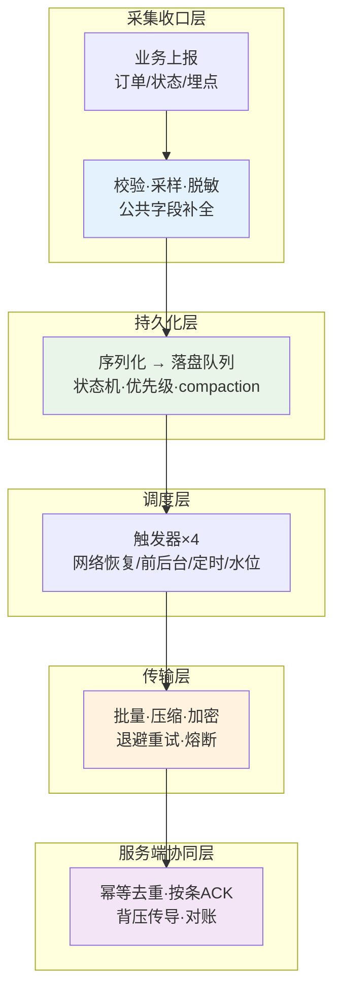

| 层 | 天职 | 不管什么 |
|---|---|---|
| 采集收口 | 数据合法性、脱敏、收口到统一队列 | 不关心怎么发 |
| 持久化 | 落盘、状态机、优先级、合并 | 不关心网络 |
| 调度 | 决定"什么时候发" | 不关心数据内容 |
| 传输 | 怎么发得省、发得稳 | 不关心业务语义 |
| 服务端协同 | 收得准（幂等）、回得明（ACK） | 不关心客户端实现 |

### 2.2 可靠性决策三角

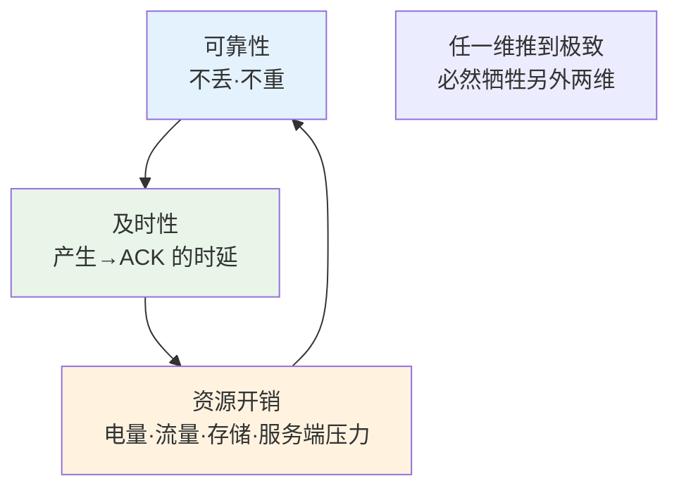

**三维互斥的论证**：

- **极致可靠**（每条数据同步落盘 + 单条发送 + 无限重试）→ 每条一次磁盘 IO + 一次 HTTP 请求，**及时性和资源开销双崩**（事故 B 的反面：不能为了省电丢订单）。
- **极致及时**（产生即发、不等批量）→ Radio 频繁唤醒，**电量崩**；高并发下服务端压力**雪崩**。
- **极致省资源**（攒大包、长间隔、能丢就丢）→ **可靠性崩**（事故 A）。

**设计就是在三角里找业务对应的"甜蜜点"**——而分级策略（§4.4）就是"一个系统里同时存在多个甜蜜点"的手段。

### 2.3 第一性原理

客户端单方面**做不到** 100%：手机掉海里、磁盘损坏、永久断网。工程上说的"100%"，是三层叠加：

```
① 客户端保证 At-least-once（至少一次）
   —— 只要落盘成功，就永不静默丢弃

② 服务端保证幂等（不会重复生效）
   —— 同一幂等键只处理一次

③ 系统保证可观测 + 对账
   —— 丢了多少能看见，缺口能补

① + ② + ③ = 业务视角的 Exactly-once
```

**缺一不可**：只有 ① 会重复；只有 ② 会丢失；只有 ③ 是事后补救而非预防。这是全文的总纲，后面所有机制都在落实这三条。

### 2.4 统一上报网关

**疑惑**：大 App 里有十几个团队各自上报（埋点 SDK、性能监控、业务订单、push 回执），每家自建队列吗？

**论证**：自建会带来三重浪费——存储重复（N 个 SQLite 队列）、调度重复（N 个定时器、N 套网络监听）、行为不一致（有的可靠有的不可靠，排查困难）。

**结论**：通用方案是**收口到统一上报网关**（一个进程内单例服务），所有业务方只调一个 API：

```java
// 所有业务统一入口，数据分级由参数声明
ReportGateway.enqueue(ReportEvent.of(
    "order_paid",                    // 类型
    payload,                         // 业务数据
    Priority.P0,                     // 分级：P0 订单 / P1 状态 / P2 埋点
    Idempotency.BUSINESS_KEY,        // 幂等策略：业务主键 or UUID
    Durability.SYNC                  // 落盘策略：同步 or 异步
));
```

网关内部统一实现落盘、调度、重试、幂等、监控——**这是本文所有机制的宿主**。

## 3. 送达语义原理

### 3.1 三种送达语义

| 语义 | 含义 | 典型代表 | 后果 |
|---|---|---|---|
| **At-most-once** | 至多一次（可能丢，绝不重） | UDP、fire-and-forget | 事故 B |
| **At-least-once** | 至少一次（绝不丢，可能重） | TCP 重传、落盘队列 | 重复需幂等兜底 |
| **Exactly-once** | 恰好一次 | 单系统内事务 | **跨网络不存在**（见 3.2） |

**关键结论**：跨不可靠网络，**Exactly-once 不是一种"送达方式"，而是"At-least-once + 幂等"的合成结果**（§2.3）。Kafka 的 Exactly-once 也是这个原理：消息层 at-least-once + 事务/幂等生产者。

### 3.2 两将军问题

**疑惑**：客户端把请求发出去、也收到了 ACK，是不是就"确定送达"了？为什么说永远有不确定性？

**论证**：经典分布式问题——两支军队隔谷扎营，信使可能被俘。A 军发信"明早进攻"，B 军必须回 ACK；但 B 军的 ACK 也可能丢，A 军要回"确认你的确认"……**确认的确认需要无穷递归，不存在有限回合的确定性共识**。

映射到上报场景，一个请求只有三种结局：

```
结局① 请求没到服务端            → 客户端超时，可安全重发
结局② 请求到了，响应（ACK）丢了  → 客户端超时，重发 → 服务端收到两次！
结局③ 请求到了，ACK 也到了      → 真正确定送达
```

**推论（本文最重要的推论之一）**：

> **客户端永远无法区分结局①和②**。因此任何 at-least-once 系统的重复是**结构性的、不可避免的**——不是 bug，是物理。唯一解法是服务端幂等。

这也解释了 §1.2 的缺陷③：不是"要不要重试"的选择题，而是"重试 + 幂等"的必选题。

### 3.3 先落盘再发送

数据库的 Write-Ahead Log：**先写日志再改数据，崩溃后靠日志重放**。上报队列完全同构：

```
数据库 WAL:  事务 → 先写 WAL（顺序追加，快） → 再改数据页 → 崩溃后回放 WAL
上报队列:    事件 → 先落盘（入队）          → 再发送      → 崩溃后重发（回放）
```

**安全边界的精确表述**：

- 数据**落盘成功**（且 fsync 完成）之后，可靠性责任从"内存"移交到"磁盘"——断电、被杀都存活；
- 落盘**之前**的数据，处于危险窗口（见 3.4 的量化）；
- **ACK 成功之后**，责任从客户端移交到服务端，本地可删除。

**推论**："发送成功"不是删除数据的依据，**"收到 ACK"才是**。发了但没收到 ACK 的数据必须保留（结局②的可能性）。

### 3.4 丢失窗口模型

**疑惑**：内存队列到底比落盘队列差多少？值不值得为落盘付出性能代价？

**论证**：设进程日均异常退出（被杀/崩溃）次数为 $k$，单次窗口内未发送数据均值为 $E[w]$，则

$$
\text{内存队列日丢失期望} = k \times E[w]
$$

代入事故 A 的真实数字：Android 中高端机型日均进程死亡 $k \approx 3 \sim 5$ 次（后台回收 + 崩溃），弱网用户窗口积压 $E[w] \approx 300$ 条 → **日均丢失 900~1500 条/人**。按 30% 用户处于弱网，全量 DAU 的上报缺口恰好是 30% 量级——与事故 A 的 DAU 虚跌吻合。

落盘队列的丢失只剩一个窗口：**落盘到 fsync 完成之间**：

$$
\text{落盘队列日丢失期望} = P(\text{断电}) \times E[w_{\text{fsync 窗口}}]
$$

异步批量落盘（5s 窗口）下 $E[w_{\text{fsync}}] \approx 5\text{s}$ 的数据量，且断电概率远低于进程死亡概率——**丢失率下降 3~4 个数量级**。

**结论**：内存队列和落盘队列不是"性能优化程度不同"，而是**可靠性代际差异**。分级落盘（P0 同步落盘、P2 攒批落盘）是性能与安全的联合最优（见 §4.4）。

### 3.5 时钟与序号

**疑惑**：为什么上报数据不能用客户端本地时间做排序和去重依据？

**论证**：客户端时钟有三种病：

| 病 | 场景 | 后果 |
|---|---|---|
| **不准** | 没开自动同步的设备 | 时间偏差分钟~小时级 |
| **回拨** | NTP 校时、手动改时间 | 乱序：后发生的事件时间戳更早 |
| **跳变** | 时区切换、闰秒 | 排序键断裂 |

**解法**：引入**单调递增序号 seq**，与时间戳并存：

- `seq`：每次入队时 `last_seq + 1`（或按会话持久化的计数器），**只保证单调，不保证间隔均匀**；
- `timestamp`：仍携带，但仅作展示，**不参与排序和去重**；
- 服务端按 `(sessionId, seq)` 检测空洞（§6.8）、按 seq 排序还原真实顺序。

**进阶**：需要跨端合并顺序时用 **HLC（混合逻辑时钟）**——物理时间 + 逻辑计数器的组合，Kafka/CockroachDB 同款思想。绝大多数客户端场景用单调 seq 足够。

## 4. 可靠队列设计

### 4.1 五态状态机

每条数据从产生到终结，走这张状态图：

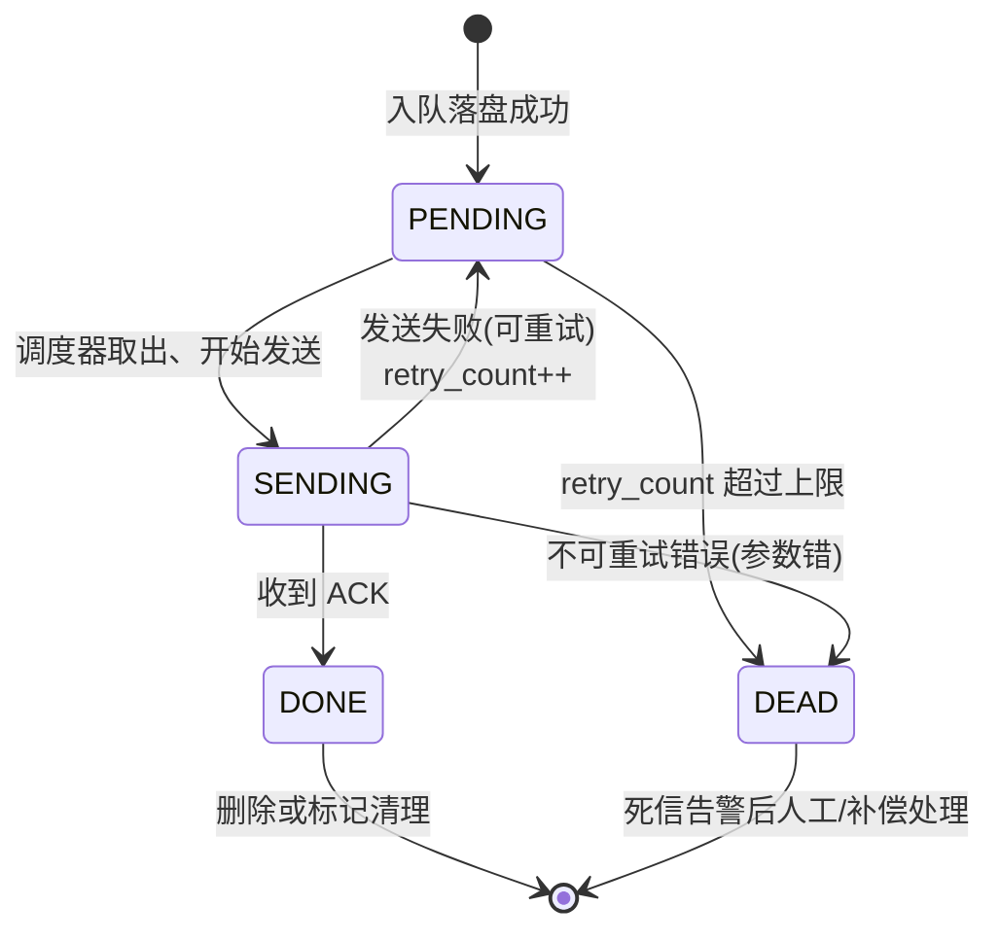

| 状态 | 含义 | 存储 | 可恢复性 |
|---|---|---|---|
| PENDING | 待发送 | 磁盘 | 崩溃后自动恢复 |
| SENDING | 发送中（悬空态） | 磁盘 | 崩溃后需超时回收（§4.2） |
| DONE | 已确认 | 磁盘标记 | 终态 |
| RETRY | 等待下次重试 | 磁盘（带 next_retry_at） | 自动 |
| DEAD | 超限/永久失败 | 磁盘 | 需告警介入 |

**为什么 RETRY 不是独立状态而是"PENDING + next_retry_at"**：状态越少，状态机越不易出 bug；重试等待本质是"未来的 PENDING"，用时间戳表达比用状态表达更简洁。

### 4.2 超时回收机制

**疑惑**：SENDING 是最阴险的状态——App 在发送中途被杀，这条数据会**永久卡在 SENDING**，调度器再也不会取它（调度器只取 PENDING）。怎么办？

**论证**：无法在发送前预防（进程死亡不可预测），只能在**下次启动时回收**：

```
冷启动恢复扫描：
  UPDATE report_queue
  SET status = PENDING            -- 重置为待发
  WHERE status = SENDING
    AND sending_at < now - 10min  -- 超过 10 分钟仍"发送中"
```

**重置后重发会不会重复？** 会——如果服务端其实收到了（结局②）。**但这正是安全的**：因为幂等键没有变（§5.8、§6.3），服务端会去重。**SENDING 回收的底气来自幂等**——没有幂等的系统不敢回收，不敢回收就永久丢数据。

**超时阈值取多少**：必须大于"最大合法发送时长"（含重试的 HTTP 总超时，如 §5.7 的分层超时之和约 2~3 分钟），再留裕量，**通常取 10 分钟**。太短会把在途请求误判为死亡，太长会延迟补发。

### 4.3 状态迁移原子性

**疑惑**：发送一条数据涉及两次状态迁移（PENDING→SENDING、SENDING→DONE）。先改状态还是先发请求？崩溃点在哪？

**论证**：把每个动作序列的崩溃点全部枚举：

| 序列 | 崩溃点 | 后果 | 是否安全 |
|---|---|---|---|
| **A：先置 SENDING，再发请求** | 置完状态、请求未发 | 数据卡 SENDING | ✅ 超时回收兜底（§4.2） |
| | 请求发了、没等到 ACK | 卡 SENDING | ✅ 回收重发 + 幂等 |
| **B：先发请求，成功后置 DONE** | 请求成功、状态未更新 | 下次重发 | ✅ 幂等兜底 |
| **C（错误）：先置 DONE 再发请求** | 置完状态、请求没发出去 | **数据永久丢失** | ❌ 绝对禁止 |

**结论**：
1. **宁可多发，不可先删**——"DONE"和"删除"永远放在 ACK 之后；
2. 状态迁移和业务写入要放在**同一事务**（如 SQLite 的 `BEGIN...COMMIT`）；
3. 所有中间态都必须有**超时回收**路径，不能存在"只能前进不能自愈"的状态。

### 4.4 优先级与分级

**疑惑**：可靠性要求不同的数据（订单 vs 曝光埋点）混在一条队列里，会发生什么？

**论证**：混合队列必然发生**劣币驱逐良币**——P2 埋点海量积压时，P0 订单排在队尾等不到发送；或反过来，为了 P0 的及时性让海量 P2 也走高成本通道（同步落盘 + 单条发送），资源开销爆炸。

**结论**：分级不是"文档约定"，而是**队列结构**——三条物理独立（或逻辑分区）的子队列：

| 级别 | 队列特征 | 落盘 | 发送形态 | 重试上限 | 淘汰策略 |
|---|---|---|---|---|---|
| **P0 订单/支付** | 独立短队列 | **同步落盘**（fsync） | 单条即发 | 无限（带上限退避） | 永不淘汰 |
| **P1 状态/核心行为** | 独立队列 | 异步即时落盘 | 小批量（≤20 条） | 8 次 | 超存储上限淘汰最旧 |
| **P2 一般埋点** | 大队列 | 攒批落盘（1~5s 窗口） | 大批量（≤200 条） | 3 次 | 超限 + 过期双淘汰 |

**调度采用抢占式**：发送窗口到来时，**P0 清空后才轮到 P1**，P1 清空后才是 P2——保证关键数据的最坏等待时间有上界。

### 4.5 状态合并

**疑惑**：状态类数据（"订单 123 的当前状态"）有天然的特殊性——**旧状态会被新状态覆盖**。断网 1 小时积累了 300 条同一订单的状态变更，恢复后要发 300 条吗？

**论证**：不需要。Kafka 的 Log Compaction 同款思想：**同一 key 保留最新值，发送前压缩**。

```
断网期间积压：
  (order:123, status=PAYING,    v=1)
  (order:123, status=PAID,      v=2)
  (order:123, status=SHIPPING,  v=3)
  ... 共 300 条

发送前 compaction：
  (order:123, status=DELIVERED, v=300)   ← 只剩 1 条
```

**收益量化**：300 → 1，**流量降 99.7%**，服务端少写 299 条无意义的中间状态。

**约束**：
1. **只适用于"最新值有意义"的状态类数据**——埋点这种"每次都重要"的记录类数据**绝对不能 compaction**（否则丢 299 次行为）；
2. 合并必须保留**最高版本号/最大 seq**（§6.6 的 LWW 依据）；
3. 已经处于 SENDING 的数据不参与合并（正在飞的不能动）。

### 4.6 存储选型矩阵

| 方案 | 写入 | 查询/状态管理 | 可靠性 | 适用 |
|---|---|---|---|---|
| **SQLite（WAL 模式）** | 中（事务开销） | **强**（SQL 状态更新/索引/分区） | 高 | **首选**：需要状态机、优先级、按条 ACK |
| 追加文件（AOF） | **极快**（顺序写） | 弱（需自建索引） | 高 | 海量埋点、只追加不改状态 |
| MMKV/SP 等 KV | 快 | **不适合队列**（无排序、无范围查） | 高 | 只存少量控制标记 |
| 内存队列 | 最快 | 强 | **零**（事故 A） | ❌ 不可单独使用 |

**推荐组合**：SQLite 承载 P0/P1（需要状态机精确管理），追加文件承载 P2 埋点（海量、只写不改）。SQLite 关键配置：

```sql
PRAGMA journal_mode = WAL;        -- 读写不互斥
PRAGMA synchronous = NORMAL;      -- 性能与安全折中（FULL 太慢，OFF 不安全）
```

### 4.7 单写者并发模型

**疑惑**：多业务线程同时入队、调度线程同时取队、GC 线程同时清理——三方正并发地操作队列，锁怎么设计？

**论证**：经典解法不是"更聪明的锁"，而是**消除并发写**——MPSC（Multi-Producer Single-Consumer，多生产单消费）：

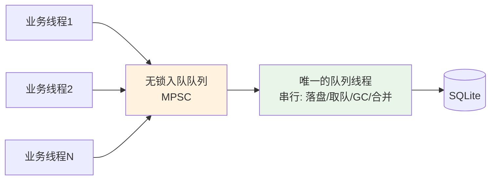

- **生产端**：业务线程只做一件事——把事件塞进内存 MPSC 队列（无锁或细锁），**立即返回**（业务零感知）；
- **消费端**：唯一的队列线程串行执行落盘、状态迁移、compaction、GC——**单线程内天然无竞争**，SQLite 也无需跨线程事务。

**收益**：消灭了 90% 的锁设计，剩下 10%（MPSC 本身）用成熟组件（如 `ConcurrentLinkedQueue` + 批量 drain）。**"串行是最大的并发技巧"**。

### 4.8 多进程数据收口

**疑惑**：App 有独立进程（push 进程、webview 进程、支付进程），各进程的数据怎么统一上报？

**方案对比**：

| 方案 | 做法 | 问题 |
|---|---|---|
| 各进程独立上报 | 每进程一个队列 | 调度重复、网络重复唤醒、行为不一致 |
| **主进程收口** | 子进程通过 IPC/AIDL 把事件转给主进程队列 | 主进程死了子进程数据丢 |
| **共享存储** | 各进程写同一个 SQLite/文件队列，主进程统一发 | **推荐**：存储天然跨进程，数据不丢 |

**共享存储的并发要点**：跨进程写 SQLite 必须依赖其文件锁；更高吞吐的场景用 mmap 共享内存做缓冲（参考 04 篇 §9.3 的多进程协议）。

### 4.9 队列数据结构设计

一张生产级的队列表结构（SQLite）：

```sql
CREATE TABLE report_queue (
    id            INTEGER PRIMARY KEY AUTOINCREMENT,
    request_id    TEXT    NOT NULL UNIQUE,     -- 幂等键（§6）
    session_id    TEXT    NOT NULL,            -- 会话标识
    seq           INTEGER NOT NULL,            -- 单调序号（§3.5）
    type          INTEGER NOT NULL,            -- 数据类型：订单/状态/埋点
    key           TEXT,                        -- 业务key（状态类compaction用，如 order:123）
    version       INTEGER NOT NULL DEFAULT 1,  -- 状态类版本号（LWW用）
    priority      INTEGER NOT NULL,            -- 0=P0 1=P1 2=P2
    payload       BLOB    NOT NULL,            -- 压缩+加密后的业务数据
    status        INTEGER NOT NULL DEFAULT 0,  -- 0=PENDING 1=SENDING 2=DONE 3=DEAD
    retry_count   INTEGER NOT NULL DEFAULT 0,
    next_retry_at INTEGER,                     -- 最早可重试时间戳
    sending_at    INTEGER,                     -- 进入SENDING的时间（回收判断）
    created_at    INTEGER NOT NULL
);

-- 调度器取数的核心索引：按状态+优先级+可重试时间取
CREATE INDEX idx_dispatch ON report_queue(status, priority, next_retry_at);
-- 空洞检测索引（§6.8）
CREATE INDEX idx_session ON report_queue(session_id, seq);
-- compaction 扫描索引（§4.5）
CREATE INDEX idx_key ON report_queue(key, version) WHERE key IS NOT NULL;
```

**设计要点**：
1. `request_id` **UNIQUE**——数据库层第一道防重防线；
2. 调度索引 `(status, priority, next_retry_at)` 与取数语句完全匹配，避免全表扫描；
3. `payload` 存 BLOB（压缩后）而非 JSON 文本——省 5~10 倍空间。

### 4.10 队列清理机制

DONE 数据不能立刻物理删除（高频 DELETE 会带来 SQLite 碎片和写放大），采用**两级清理**：

1. **标记软删**：ACK 后置 `status=DONE`，但行保留（供对账/排查）；
2. **批量物理回收**：低峰期（如每天凌晨 / 每次 App 冷启动）执行
   `DELETE FROM report_queue WHERE status=DONE AND done_at < now - 7day LIMIT 1000`（分批删，避免长事务）；
3. **水位触发**：队列总条数超过水位线（如 5w）时立即触发回收，回收后仍超限则按优先级淘汰（§9.1）。

### 4.11 冷启动恢复全流程

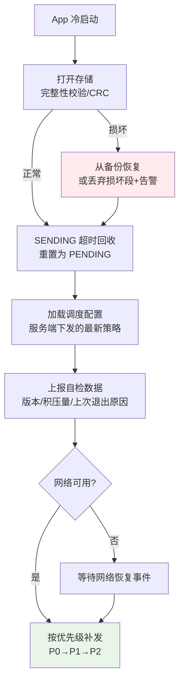

**为什么上报"自检数据"**：这是端到端丢失率测量（可观测）的锚点——服务端知道"设备 X 在 T 时刻冷启动、带着 N 条积压"，如果后续没收到这 N 条，缺口暴露。

## 5. 重试逻辑设计

### 5.1 裸重试的雪崩模型

**疑惑**：重试还能把服务端打死？不就是多发几次吗？

**论证**：设客户端规模 $N$，服务端故障时长 $T$，重试间隔固定 $r$（无退避）：

$$
\text{故障期间总重试请求} = N \times \frac{T}{r}
$$

代入真实数字：$N = 100\text{w}$（活跃客户端），$T = 5\text{min}$，$r = 1\text{s}$：

$$
100\text{w} \times 300 = 3\text{亿请求}
$$

更糟的是**同步性**：所有客户端的重试节拍一致（都在失败后第 1 秒重试），服务端刚恢复一点就迎来下一波齐射，**永远恢复不了**——这就是雪崩的正反馈。

**退避 + 抖动后的对比**：指数退避到 5min 封顶时，故障期间人均重试约 **7 次**；抖动把重试打散在时间轴上。**3 亿 → 700w，且从"齐射"变成"散布"**——服务端恢复窗口得以保留。

### 5.2 指数退避与抖动

**指数退避**：$delay = base \times 2^{retryCount}$，但**裸指数退避仍有同步性**（所有客户端节拍仍然是倍增关系，会在某些时间点聚集）。AWS 的经典论文给出三种抖动：

```java
// ① Full Jitter（完全随机，AWS 推荐用于客户端集群）
long fullJitter(int n) {
    long max = Math.min(CAP, BASE * (1L << n));
    return ThreadLocalRandom.current().nextLong(0, max + 1);
}

// ② Equal Jitter（保留一半指数性，减少过度延迟）
long equalJitter(int n) {
    long max = Math.min(CAP, BASE * (1L << n));
    return max / 2 + ThreadLocalRandom.current().nextLong(0, max / 2 + 1);
}

// ③ Decorrelated Jitter（基于上次延迟，重试节奏不与失败次数强绑定）
long decorrelated(long prevDelay) {
    return Math.min(CAP, ThreadLocalRandom.current().nextLong(BASE, prevDelay * 3 + 1));
}
```

| 方案 | 分布 | 优点 | 适用 |
|---|---|---|---|
| 无抖动 | 确定性 | 可预测 | ❌ 雪崩风险 |
| Full Jitter | uniform(0, max) | **打散最彻底** | **客户端海量集群（本文场景）** |
| Equal Jitter | uniform(max/2, max) | 延迟不过分极端 | 服务端之间的重试 |
| Decorrelated | 基于 prev×3 | 避免低延迟扎堆 | 长重试链（如 RPC 中间件） |

**结论**：客户端上报场景选 **Full Jitter**——百万级客户端的打散效果是第一诉求。

### 5.3 退避参数推导

参数不是抄来的，是可以推导的：

| 参数 | 取值 | 推导依据 |
|---|---|---|
| **base（首次延迟）** | 2s | 服务端瞬时抖动的典型恢复时间（秒级）；小于 1s 的重试基本是浪费（还没恢复） |
| **倍数** | ×2 | 指数增长在 10 次内覆盖 base→cap（2s→512s 约 8 次翻倍），过快进入"低频长等" |
| **cap（上限）** | 5min | 数据时效性（埋点超过 1 小时价值骤降）与"App 生命周期内至少重试多次"的平衡；后台受限场景可放宽到 15min |
| **抖动比例** | Full Jitter | 见 §5.2 |
| **最大重试次数** | P0 无限 / P1 8 次 / P2 3 次 | P0 交给退避封顶自然限流；P1/P2 由数据价值决定 |

**验证**：8 次重试 + Full Jitter 的期望总耗时 ≈ $\sum E[\text{delay}_i] \approx 2+2+4+8+16+32+64+128$ 的一半 ≈ 128s——**两分钟内完成 8 次尝试**，之后进入 5min 长周期，节奏合理。

### 5.4 错误分类学

**不是所有失败都值得重试**。三分法：

| 类别 | 判定 | 处理 | 例子 |
|---|---|---|---|
| **可重试错误** | 瞬态故障，重试有意义 | 指数退避重试 | 网络超时、连接重置、5xx、429 |
| **永久失败** | 数据/请求本身有问题，重试一万次也失败 | **直接 DEAD + 告警** | 400 参数错误、401/403 鉴权失败、payload 超限 |
| **业务码失败** | HTTP 200 但业务层拒绝 | 按业务码细分 | `INVALID_PARAM`→DEAD；`SERVER_BUSY`→重试 |

**429 的特殊处理**：优先遵守响应头 `Retry-After`（服务端亲口说的等待时间），没有才用自己的退避值。

**事故 A 的教训重放**：参数错误的数据被当作"没发出去"反复重试，不仅浪费，还把真正可重试的数据堵在后面（队头阻塞，§5.9）。

### 5.5 重试上限与死信

超过重试上限的数据进入 **DEAD（死信）**：

- **不是删除**——死信保留在队列中（带 `status=DEAD`），携带完整上下文（错误类型、最后一次响应体）；
- **必须告警**——死信量 > 0 且突增，是数据质量或服务端故障的信号；
- **可人工重放**——排查出原因（如服务端 bug 修复后）后，一键把死信重置为 PENDING 批量补发。

**P0 为什么"无限重试"**：订单数据不能因为服务端坏了 2 小时就丢。退避封顶 5min 已经天然限制了重试频率，"无限次"实际是"每 5 分钟一次直到送达"，成本可控。

### 5.6 熔断与半开恢复

**疑惑**：退避只解决"单条数据"的节奏。如果服务端彻底故障，百万客户端仍然每 5 分钟齐射一次，怎么办？

**论证**：需要在**发送器层面**加熔断（而不仅是单条数据的退避）：

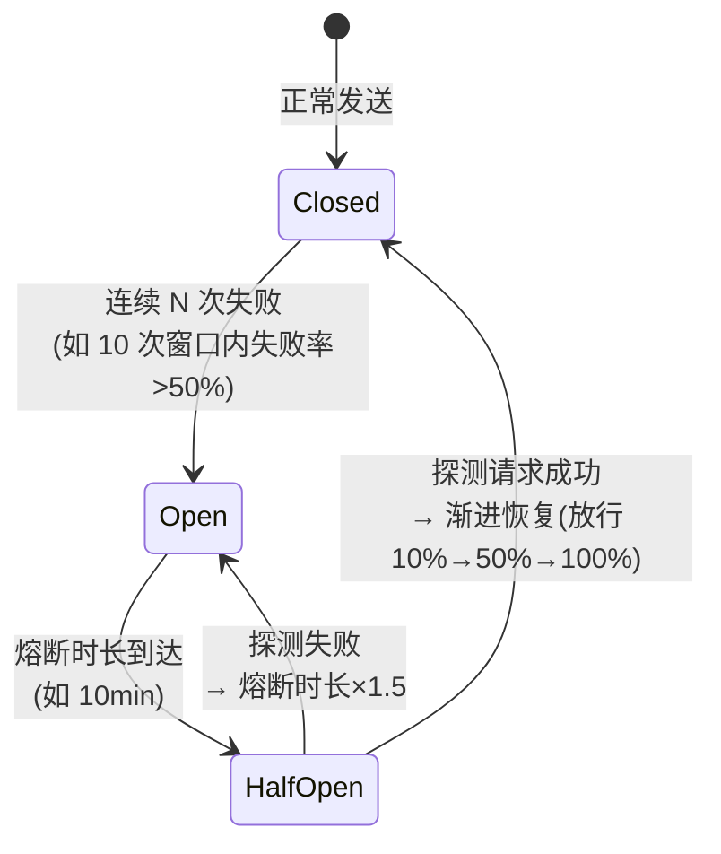

**与单条退避的关系**：熔断管**全局开关**（这段时间干脆不发，连请求都不构造），退避管**单条节奏**（这条数据下次什么时候试）。熔断期间数据安静地趴在队列里——**可靠队列让"暂停发送"变得零成本**，这是裸重试做不到的。

### 5.7 超时分层设计

一个 HTTP 请求有三种超时，混用一个值是常见错误：

| 超时 | 含义 | 推荐值 | 依据 |
|---|---|---|---|
| **connectTimeout** | TCP/TLS 建连 | 5~10s | 弱网下建连本身就慢，太短会误杀 |
| **readTimeout** | 等待响应首字节 | 10~15s | 服务端处理 + 网络往返 |
| **totalTimeout** | 整个请求生命周期 | 20~30s | 兜底上限 |

**弱网动态调整**：维护一个简单的网络质量分（近 N 次请求的成功率/RTT 滑动平均），弱网时 connectTimeout 放宽到 15s、readTimeout 到 30s——**弱网下"慢但成功"远优于"快但失败"**（失败了要重试，总耗时反而更长）。

### 5.8 重试与幂等的联动

**全文最容易被忽视的一节**。先看反例：

```java
// ❌ 反例：幂等键在发送时生成
void send(Event e) {
    String requestId = UUID.randomUUID().toString();  // 每次调用都新建！
    http.post(url, wrap(e, requestId));
}
// 第一次超时（结局①或②）→ 重试调用 send() → 新 UUID
// → 服务端视为两条不同数据 → 重复落库

// ✅ 正例：幂等键随数据生成并持久化，重试永远复用
void enqueue(Event e) {
    Record r = new Record(e, UUID.randomUUID().toString()); // 生成一次
    db.insert(r);                                            // 持久化
}
void resend(Record r) {
    http.post(url, wrap(r.payload, r.requestId));           // 永远同一个
}
```

**结论**：**幂等键的生命周期 = 数据的生命周期，而不是请求的生命周期**。一次"逻辑数据"无论物理上发了多少次 HTTP 请求，携带的都是同一个键——这是结局②（§3.2）不产生业务重复的唯一保证。

### 5.9 毒消息定位

**疑惑**：批量发送时，一批 50 条里混了一条格式损坏的数据（服务端永远返回 400），会发生什么？

**论证**：如果整批判定失败 → 整批重试 → 那条坏数据永远让其余 49 条陪葬 → **无限重试 + 无限失败**。这条坏数据就是 **poison message**。

**解法：二分拆批定位**：

```
批 [1..50] 失败（含坏数据）
  → 拆成 [1..25] [26..50] 分别重发
  → [1..25] 失败 → 继续拆 [1..12] [13..25]
  → ... 最多 log₂(50) ≈ 6 轮，定位到那 1 条
  → 坏数据 → DEAD + 告警；好数据全部正常送达
```

**成本量化**：定位一条 poison message 的额外请求开销 ≈ $2\log_2 n$（每轮每半批各一次），**可控**。配合"永久失败立即 DEAD"（§5.4），正常情况下根本走不到拆批——拆批是最后防线。

### 5.10 弱网动态退避

静态退避参数在"永远弱网"的环境（地铁、电梯）会退化成固定间隔的低频轮询。增强：**网络质量分驱动退避系数**：

```
quality = f(近20次请求成功率, 平均RTT)     // 0~100
退避系数 = quality > 80 ? 1.0            // 好网：正常退避
          quality > 50 ? 1.5            // 弱网：退避拉长 50%
          : 2.5                          // 极弱：退避拉长 150%，且暂停 P2 发送
```

**注意**：只对 P1/P2 生效——**P0 永远不因弱网放弃尝试**（订单的时效性优先）。

## 6. 幂等标识设计

### 6.1 必然重复证明

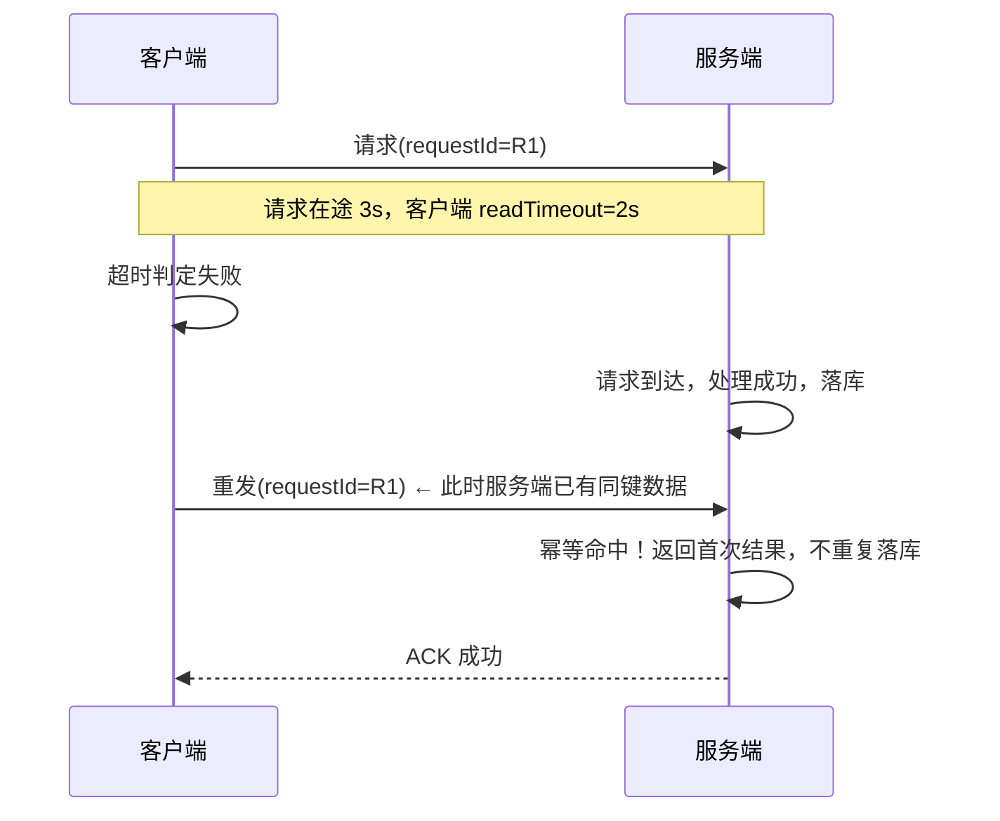

**没有幂等会发生什么**：第二次请求被当作新数据落库——重复订单/重复埋点/重复状态跳变。**这不是低概率**：超时率 1% 的系统，每天亿次上报 = 每天百万次结构性重复。

### 6.2 幂等键生成路线

| 路线 | 例子 | 优点 | 缺点 | 适用 |
|---|---|---|---|---|
| **随机 UUID** | `550e8400-e29b...` | 简单，绝不撞 | 无业务语义，服务端只能"存了再说" | 事件流（埋点/日志） |
| **业务主键** | `order:123:paid` | 有语义，天然去重；跨端/重装也一致 | 依赖业务有稳定主键 | **订单/状态类（推荐）** |
| **复合键** | `deviceId+sessionId+seq` | 层次化，支持空洞检测（§6.8） | 需维护计数器 | 通用会话数据 |

**选型口诀**：**有业务主键用业务主键，没有才用 UUID**——业务主键让服务端可以"理解"重复（订单 123 已支付，再收到支付请求直接返回成功），而 UUID 只能机械去重。

### 6.3 幂等键的生命周期


**三个不变式**：
1. **生成一次**：键在数据产生时创建，终生不变；
2. **先持久化再使用**：键必须和数据原子落盘（防止"发了请求但键没存下来，重试时被迫换键"）；
3. **重试复用**：任何重发路径（超时重试、SENDING 回收、死信重放、拆批发送）读取的都是记录里存的那个键。

### 6.4 服务端去重四方案

| 方案 | 做法 | 优点 | 缺点 | 适用 |
|---|---|---|---|---|
| **DB 唯一索引** | 幂等键建 UNIQUE，冲突即重复 | 最简单，强一致 | 依赖 DB，异常时吞掉 | 小规模 |
| **幂等表** | 独立表存 `(request_id, result)`，处理前先查/插 | 可返回首次结果 | 两次 DB 操作，需事务 | **通用推荐** |
| **Redis SETNX** | `SETNX requestId EX ttl` | 快 | Redis 挂了防线消失 | 高 QPS 前置防线 |
| **状态机** | 业务状态本身约束（已支付订单不可再支付） | 零额外存储 | 依赖状态建模 | 订单类 |

**生产组合拳**：Redis SETNX（快筛）+ 幂等表（兜底 + 返回首次结果）+ 业务状态机（最后防线）。三层任何一层漏了，下一层接住。（详细展开见姊妹篇《14.幂等性设计方案》）

### 6.5 批量双层幂等

批量场景有**批次**和**单条**两级重复可能，需要双层去重：

```json
// 请求：批次有自己的 batchId，每条有自己的 eventId
{
  "batchId": "b-20260914-000123",
  "events": [
    {"eventId": "e-1001", "type": "order_paid", "...": "..."},
    {"eventId": "e-1002", "type": "state_change", "...": "..."}
  ]
}

// 响应：按条返回结果
{
  "code": 0,
  "accepted": ["e-1001", "e-1002"],
  "rejected": [{"eventId": "e-1003", "reason": "INVALID_PARAM"}]
}
```

- **batchId 层**：服务端整体判重（收到过 b-xxx 直接返回上次的响应）——处理"整批重发"（结局②），省去逐条处理；
- **eventId 层**：batchId 未命中时逐条判重——处理"拆批发送"（§5.9）和"部分成功后重发"造成的单条重复。

### 6.6 状态版本收敛

**状态数据（订单状态）与记录数据（埋点）的幂等语义本质不同**：

| | 记录型（埋点） | 状态型（订单状态） |
|---|---|---|
| 语义 | 每一条都是独立事实 | 只有最新值有意义 |
| 重复的后果 | 数据多一条（统计翻倍） | **无**（重复设置同值无害） |
| 乱序的后果 | 无（无顺序依赖） | **致命**（旧状态覆盖新状态） |
| 幂等策略 | 去重（§6.4） | **版本号 LWW** |
| compaction | 禁止 | 推荐（§4.5） |

**LWW（Last-Write-Win）规则**：每条状态带 `version`（或 seq），服务端落库时加条件：

```sql
UPDATE order_status SET status = :new, version = :v
WHERE order_id = :id AND version < :v;   -- 只接受更新的版本
```

**收益**：重复、乱序、重发、多端并发上报，全部**收敛到最新状态**——不需要精确的去重，只需要单调的版本号。这是状态上报可靠性的"降维打击"式解法。

### 6.7 防重放与签名

幂等解决"重复"，但**恶意重放**（攻击者抓包后原样重发）需要签名体系：

```
sign = HMAC_SHA256(secret, requestId + timestamp + nonce + body摘要)
```

- **timestamp**：服务端校验时间窗（如 ±5min），拒绝陈旧请求；
- **nonce**：一次性随机数，服务端在时间窗内记忆已见 nonce，重放即拒；
- **HMAC**：防篡改（改了 body 签名对不上）。

**与幂等的关系**：幂等是"友好重复的收敛"，防重放是"恶意重复的拒绝"——两层都要，且共享 `requestId` 基础设施。（防抓包的传输层加固见姊妹篇《17.移动端防抓包实践》）

### 6.8 幂等键层次设计

把幂等键、seq、多端冲突统一到一个结构里：

```
requestId = {deviceId} : {sessionId} : {seq}
             设备标识      会话标识     单调递增序号
```

**一石三鸟**：

1. **全局唯一 + 可追溯**：任何一条数据能定位到"哪台设备的哪次会话的第几条"；
2. **空洞检测**：服务端按 `(deviceId, sessionId)` 记录已收到的 seq 区间，出现 `1,2,3,5`——4 号缺失，**主动通知客户端补发**（这是对账的基础，也回答 Q11）；
3. **多端冲突消解**：同一账号多设备时，`deviceId` 隔离了各自的 seq 空间，状态类数据再由 version LWW（§6.6）裁决最终值。

### 6.9 服务端幂等表设计

幂等记录不是无限保留的，其设计三要素：

| 要素 | 推荐值 | 依据 |
|---|---|---|
| **保留窗口** | 7 天 | 大于客户端最长重试链路（P0 无限重试 + 5min 退避，数天级） |
| **容量控制** | 按 QPS × 窗口预估算 + 30% 余量 | 超容量会挡不住重复 |
| **过期清理** | Redis 用 TTL 自动过期；DB 用每日分区删除 | 避免无限膨胀 |

```sql
CREATE TABLE idempotent_record (
    request_id  VARCHAR(64) PRIMARY KEY,
    result      BLOB,             -- 首次处理结果（重复时直接返回）
    created_at  BIGINT NOT NULL
) PARTITION BY RANGE (created_at);  -- 按天分区，过期 DROP PARTITION 秒级清理
```

**陷阱**：保留窗口 < 客户端最长重试周期时，会出现"客户端第 8 天重发、服务端幂等记录已清"的重复——**窗口长度必须与退避策略联动评审**。

### 6.10 幂等键设计反例

| 反例 | 后果 | 正解 |
|---|---|---|
| 用**时间戳**做幂等键 | 同毫秒并发碰撞；时钟回拨后新旧不辨 | UUID 或业务主键 |
| **未持久化**的自增计数 | 重启后从 1 重新计数，键重复 | 计数器随队列落盘 |
| **重试时重新生成** | 结构性重复（§5.8） | 键随数据持久化 |
| `userId + eventId` **拼接不加分隔符** | `"1"+"23"` 与 `"12"+"3"` 撞键 | 用冒号等分隔符或定长编码 |
| 业务主键**不含事件类型** | 订单 123 的"支付"和"发货"互相吞 | `order:123:paid` 三段式 |

## 7. 批量聚合与调度

### 7.1 三阈值聚合

单条发送是电量杀手（Radio 反复唤醒），聚合触发用三个阈值**任一满足即发**：

| 阈值 | P0 | P1 | P2 |
|---|---|---|---|
| 条数 | 1（不聚合） | 20 | 200 |
| 字节 | — | 256KB | 1MB |
| 时间窗 | — | 15s | 60s |

**为什么 P0 不聚合**：订单数据的及时性要求（用户等着看到"支付成功"）高于一切省电诉求。P0 落盘后**立即触发**发送。

### 7.2 批次生命周期

一个批次（batch）也有自己的状态机，与单条数据的状态机（§4.1）分层并存：

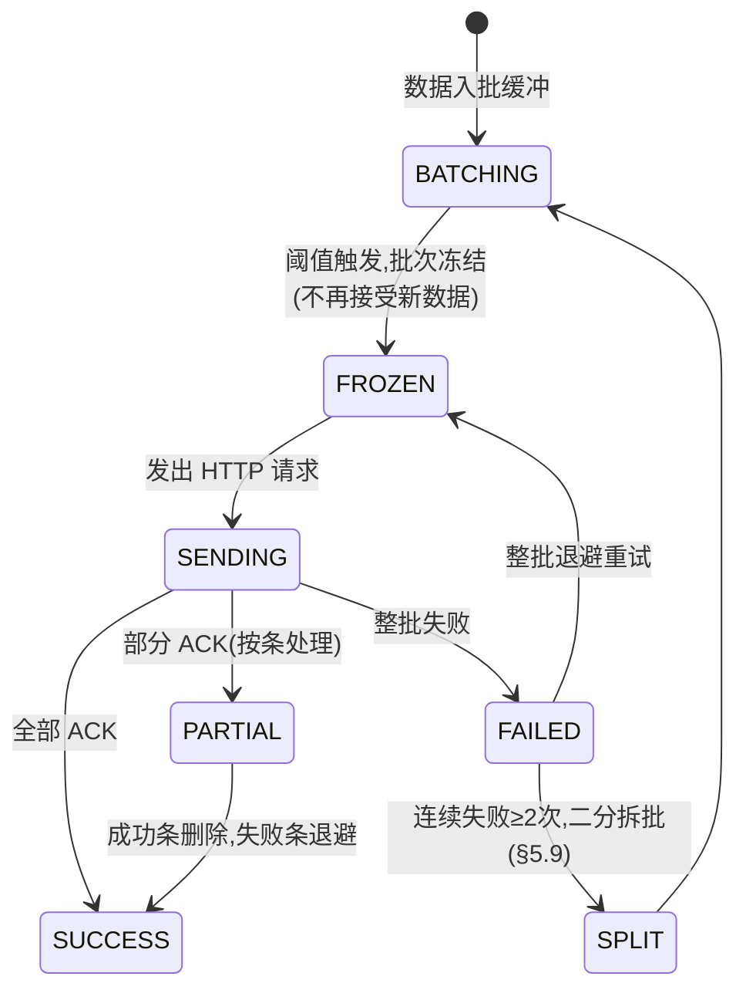

**FROZEN（冻结）的意义**：批次一旦开始发送，成员就固定了——发送中途又有新数据到达时开新批，**绝不动正在飞的批次**（否则 ACK 的条数对不上）。

### 7.3 分组批量

**疑惑**：不同类型的数据混在一个批次里发送，有什么问题？

**论证**：三个问题——

1. **错误放大**：批内混入一条参数错误的数据，整批被判失败的概率上升（某些网关实现）；
2. **QoS 错配**：订单和曝光埋点混批，埋点的"最多 3 次重试"会连累订单提前进死信；
3. **服务端路由浪费**：不同类型数据归属不同服务，混批需要服务端再拆分转发。

**结论**：按 `(type, priority)` 分组，**各组独立成批**，各自走各自的聚合阈值和重试策略。批次键 = `type + priority + 分组哈希`。

### 7.4 部分成功处理

批量上报最容易被忽略的场景——**50 条里服务端成功 48 条、拒绝 2 条**。协议必须支持按条确认（§6.5 的 JSON 结构），客户端处理规则：

| 响应分类 | 客户端动作 |
|---|---|
| `accepted` 中的 eventId | 删除对应记录（收到 ACK 才删，§4.3） |
| `rejected(reason=可重试)` | 退避重试该条 |
| `rejected(reason=永久失败)` | 该条 → DEAD + 告警 |
| 整批超时/网络错误 | 整批退避（保持 batchId 重发） |
| 整批连续失败 ≥2 次 | 二分拆批（§5.9） |

**禁止的行为**：把部分成功当整批失败重发——会让 48 条已成功的数据重复进入服务端（虽然幂等能挡，但白白消耗服务端幂等表容量和 QPS）。

### 7.5 并发发送控制

**疑惑**：调度器被触发时队列里积压了 1 万条，一口气组 50 个批次并发发出？

**论证**：并发批次数（in-flight）无上限会带来——客户端侧内存暴涨（50 个批次的 payload 常驻）、服务端侧单设备瞬时 QPS 过高（触发风控）、失败时 50 个批次同时退避又同时重发（微缩版雪崩）。

**结论**：维护 **in-flight 窗口**：

```
in-flight 上限 = 3（P0 批次） + 2（P1） + 1（P2）
规则：窗口满时新批次排队等待；
     批次 ACK 后释放窗口名额，队列中的下一批自动补位；
     弱网时窗口减半（quality < 50 时 P2 窗口清零）。
```

### 7.6 触发时机四类

| 触发器 | 监听方式 | 典型延迟 | 说明 |
|---|---|---|---|
| **网络恢复** | ConnectivityManager / NWPathMonitor | 秒级 | **最重要的补传时机**（事故 A/B 的解药） |
| **数量水位** | 入队时检查积压量 | 实时 | 达到阈值立即触发 |
| **定时** | 前台 15s / 后台 5min | 周期性 | 兜底节奏 |
| **前后台切换** | 生命周期回调 | 实时 | **退后台立即 flush**（后台随时被杀） |

**退后台 flush 的特殊性**：利用 iOS 的 `beginBackgroundTask`（约 30s 后台宽限）或 Android 的 onStop 后短暂窗口，把内存缓冲全部落盘 + 尽量发一轮——这是"退出保护"的第一道防线（§7.9）。

### 7.7 系统调度集成

自建 Handler/Timer 定时在后台会被系统冻结（Doze/App Standby），必须接入系统调度：

| 平台 | 组件 | 能力 |
|---|---|---|
| Android | **WorkManager** | 约束：网络可用 / 充电中 / 空闲 / 存储不紧张；系统重启后任务保留 |
| iOS | **BGTaskScheduler** | BGAppRefreshTask（周期）/ BGProcessingTask（大任务，充电+空闲时） |

**约束示例**（P2 埋点）：`NetworkType.UNMETERED`（仅 WiFi）+ `requiresBatteryNotLow`——用系统级约束表达"省电省流量"策略，比自己监听电池/网络可靠得多。

### 7.8 能效优化

移动端 Radio（蜂窝射频）的能耗特性决定了批量策略：

```
Radio 状态机（简化）：
  IDLE --(传输数据)--> HIGH_POWER（~1-2s 保持）
  HIGH_POWER --(无数据 ~5s)--> DRAIN（过渡态，功耗 ~50%）
  DRAIN --(无数据 ~12s)--> IDLE

成本模型：一次 Radio 唤醒 ≈ 固定开销 C（含状态切换能耗）
  逐条发 100 次 = 100 × C
  攒批发 1 次（100条/批）= 1 × C + 略增的传输时间
  → 耗电差 1~2 个数量级
```

**实践要点**：
1. **聚合窗口对齐 Radio 保持期**——数据攒在 Radio 已激活的窗口内发（如收到推送后顺带上报），搭便车；
2. **避免高频短定时**——每 15s 一次的定时器会阻止 Radio 回 IDLE；
3. **WiFi 策略**——大数据量（P2）配置为仅 WiFi 上报。

### 7.9 退出保护机制

**App 生命周期末端是数据丢失高发区**，两道防线：

**防线一（临终抢救）**：退后台 / onTrimMemory 时——
1. 内存 MPSC 队列全部 drain 到磁盘（落盘不等攒批）；
2. in-flight 批次等待 ACK 或超时（利用后台宽限时间）；
3. 写入"退出快照"（时间戳 + 队列水位 + 未决批次数）。

**防线二（死后复活）**：冷启动时（§4.11）——
1. 读取退出快照，比对当前水位，**差异即丢失候选**，上报自检事件；
2. SENDING 超时回收；
3. 按优先级补发。

两道防线之间仍有极小窗口（被 SIGKILL 时连落盘都来不及）——**这个残余风险的量化与兜底就是可观测的职责**：丢失率虽不能归零，但可以"被看见、被对账、被补发"。

## 8. 传输与网络优化

前 7 章解决"发不发得出、发得对不对"，本章解决"发得快不快、省不省"。

**8.1 协议选型**：

| 协议 | 特性 | 对上报的意义 |
|---|---|---|
| HTTP/1.1 + 长连接 | 连接复用 | 基线方案，keep-alive 省去重复建连 |
| HTTP/2 | 多路复用、头部压缩(HPACK) | 多批次并发共享单连接，头部开销降 80%+ |
| QUIC/HTTP3 | 0-RTT 建连、弱网抗性 | **弱网场景收益显著**（切网不断连、丢包不队头阻塞） |

**8.2 压缩与序列化**：埋点 JSON → gzip 压缩率 5~10×；换 protobuf 再省 30~50% 且解析更快。**schema 向后兼容**：字段只增不删、新老版本共存（服务端按 `schemaVersion` 路由解析器）。

**8.3 多域名容灾**：主域名 DNS 污染/证书故障时——备用域名列表 + **HTTPDNS**（绕过 LocalDNS 劫持）+ 降级通道（如长连接通道顶替 HTTP）。域名列表由配置中心动态下发。

**8.4 连接管理**：DNS 预解析（启动时并行解析上报域名）、连接池预热、IP 直连 + 测速选优。

**8.5 双通道冗余**：P0 数据可配置双发（HTTP 通道 + 长连接通道各发一次，幂等键相同）——单通道故障时另一通道兜底，服务端幂等吸收重复。**成本 ×2，可靠性从"单通道可用性"提升到"双通道并联可用性"**（99%² → 99.99% 量级）——仅用于最高价值数据。

## 9. 背压与降级

**生产速度 > 消费速度**（弱网/服务端故障/磁盘写满）时的生存策略。

**9.1 背压三策略**：

| 策略 | 做法 | 适用 | 代价 |
|---|---|---|---|
| **丢弃** | 新数据直接拒收（按优先级） | P2 埋点 | 有意识丢失（必须计数） |
| **阻塞** | 入队等待（限流信号反压给业务） | 不适合客户端（卡 UI） | ❌ 客户端基本不用 |
| **采样** | 按比例接收 | 高频埋点 | 统计精度下降（可估算） |

**9.2 动态采样**：采样率由服务端**配置下发**，按事件类型独立控制（曝光埋点 10%、支付事件 100%）。服务端过载时下发"紧急降采样"，流量瞬间下降——**这是服务端主动反压客户端的通道**。

**9.3 状态合并**：弱网期间状态类数据持续 compaction（§4.5），只保最新——背压下状态数据"降维"而非"丢失"。

**9.4 服务端背压传导**：429 + `Retry-After` 响应头是标准传导信号；更主动的是配置通道下发"全局暂停 10min"——百万客户端同时静默，服务端恢复窗口立现。

**9.5 洪峰削峰**：大促/春晚场景，客户端启动时随机延迟 0~N 分钟再开始历史补发（错峰因子），避免零点后集体回放积压形成第二洪峰。

## 10. 数据治理与安全

**10.1 存储水位与淘汰**：配额（如 50MB）+ 水位线（80% 告警）+ 三级淘汰（优先级淘汰 → TTL 过期 → 紧急清空指令）。**每次淘汰计数上报**——"丢了 N 条 P2"是已知缺口，"无声无息丢"是灾难。

**10.2 schema 版本演进**：payload 带 `schemaVersion`；服务端保留老版本解析器至少 N 个版本周期；字段**只增不删**（删字段=老客户端数据被静默丢弃）。

**10.3 敏感数据合规**：采集前校验用户授权（隐私协议）；PII 字段（手机号/IMEI/定位）脱敏或哈希后落盘；提供**用户数据删除通道**（GDPR/个保法要求——服务端按 deviceId 删除，客户端清空本地队列）。

**10.4 加密与防篡改**：传输 TLS + 证书锁定（防抓包，详见姊妹篇 17）；敏感字段落盘前二次加密（密钥存 KeyStore/Keychain）；签名防篡改（§6.7）。

**10.5 数据质量校验**：payload 落盘前 CRC 校验；服务端入库前抽样比对（端云双算指标差异 > 阈值告警）；对账通道按 seq 空洞双向核对。

## 11. 常见反例陷阱

| # | 陷阱 | 一句话症状 | 对应正解 |
|---|---|---|---|
| 1 | 数据只存内存 | 弱网/被杀全丢 | §3.3 先落盘再发送 |
| 2 | 无限裸重试 | 雪崩 + 耗电 | §5.2 退避 + 抖动 |
| 3 | 所有错误都重试 | 参数错误重试一万次 | §5.4 错误三分法 |
| 4 | SENDING 无回收 | 数据永久卡死 | §4.2 超时重置 |
| 5 | 重试时重新生成幂等键 | 结构性重复 | §5.8 键随数据持久化 |
| 6 | 用本地时间排序去重 | 时钟回拨乱序 | §3.5 单调 seq |
| 7 | 主线程写库 | 卡顿 ANR | §4.7 单写者线程 |
| 8 | 部分成功当整批失败 | 已成功数据重复重发 | §7.4 按条 ACK |
| 9 | 存储无上限 | 磁盘写满 App 崩 | §10.1 水位淘汰 |
| 10 | 幂等窗口短于重试周期 | 服务端过期后重复落库 | §6.9 窗口联动评审 |
| 11 | 退后台不 flush | 后台被杀丢窗口数据 | §7.9 退出保护 |
| 12 | 无监控 | 丢了 30% 三周才发现 | §12.4 自检清单 |

## 12. 综合案例串讲

### 12.1 案例真相揭晓

**事故 A（DAU 暴跌）根因链**：

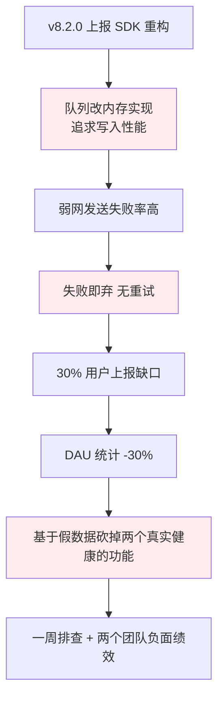

**对应解法**：B→§3.3 落盘队列；D→§5 重试体系；E→§12.4 监控让缺口当天可见。

**事故 B（幽灵订单）根因链**：

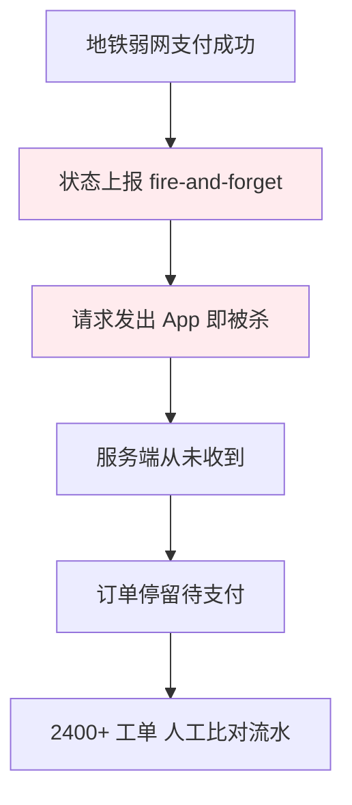

**对应解法**：B→§4.4 P0 同步落盘；C→§4.2 SENDING 回收 + §7.9 退出保护；D→§5.5 P0 无限重试 + §6.6 版本号 LWW。

### 12.2 订单状态的一生

用一条"支付完成"状态数据走完全部机制（本文的微缩全图）：

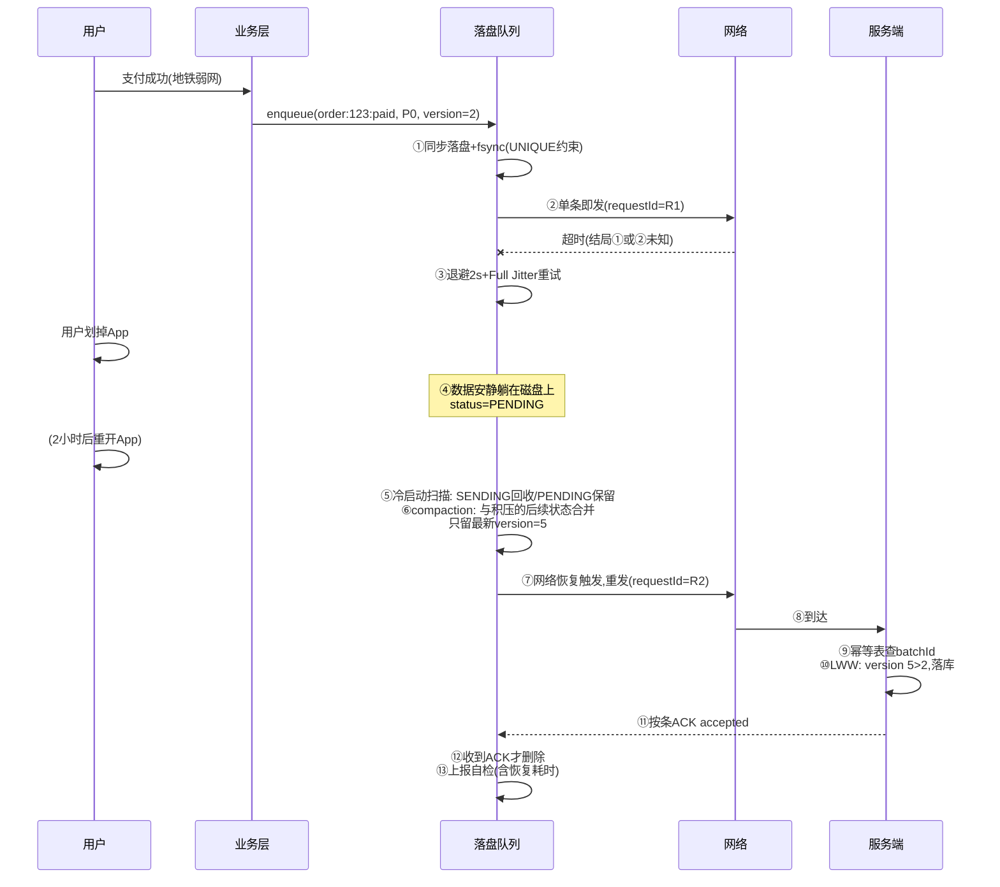

这条数据经历了：**同步落盘 → 超时 → 退避 → App 死亡 → 磁盘存活 → 冷启动恢复 → compaction 合并 → 网络恢复补发 → 服务端幂等 + LWW → ACK → 清理**——全部 13 个机制点，一个都没少。

### 12.3 设计哲学回扣

**哲学 1：不丢靠磁盘，不重靠幂等，两靠缺一不可**。客户端的可靠 = 把数据尽早交给磁盘；服务端的可靠 = 用幂等吸收一切重发。**只做一头都是半成品**。

**哲学 2：重复是物理，丢失是选择**。两将军问题决定了重复不可避免（§3.2）；但"静默丢失"永远是工程缺陷——可以降级、可以采样、可以淘汰，但必须**计数、可观测**。

**哲学 3：宁可多发，不可先删**。所有状态迁移的安全方向是"多发"（幂等能挡），删除只发生在 ACK 之后（§4.3）。

**哲学 4：所有中间态必须有自愈路径**。SENDING 会卡死、批次会失败、进程会死在任何一行代码之间——设计的不是"不出意外"，而是**任何意外之后的恢复路径都预先铺好**。

### 12.4 速查表与自检清单

**重试参数速查表**：

| 参数 | P0 订单 | P1 状态 | P2 埋点 |
|---|---|---|---|
| 落盘 | 同步 fsync | 异步即时 | 攒批 1~5s |
| 聚合 | 不聚合 | ≤20 条/256KB/15s | ≤200 条/1MB/60s |
| 首次退避 | 2s | 2s | 5s |
| 退避上限 | 5min | 5min | 15min |
| 抖动 | Full Jitter | Full Jitter | Full Jitter |
| 重试上限 | 无限 | 8 次 | 3 次 |
| in-flight | 3 | 2 | 1 |
| 淘汰 | 永不 | 超限淘汰旧 | 超限+7天过期 |

**错误分类速查表**：超时/5xx/429 → 退避重试；4xx/参数错 → 立即 DEAD；HTTP200+业务码 → 按码分流。

**上线自检清单**：

- [ ] 数据是否**先落盘再发送**？P0 是否同步落盘？
- [ ] 每条数据是否有**唯一幂等键**，且随数据持久化、重试复用？
- [ ] 退避是否**指数 + Full Jitter + 封顶**？
- [ ] 是否区分**可重试错误与永久失败**？
- [ ] `SENDING` 是否有**超时回收**？
- [ ] 批量是否支持**按条 ACK** 与**二分拆批**？
- [ ] 状态类数据是否用**版本号 LWW** 而非机械去重？
- [ ] 是否有**熔断半开**与 **in-flight 窗口**？
- [ ] 退后台是否 **flush**？冷启动是否**扫描恢复 + 自检上报**？
- [ ] 存储是否有**水位淘汰**，淘汰是否**计数**？
- [ ] 服务端幂等窗口是否**长于**客户端最长重试周期？
- [ ] 是否有**成功率/积压/死信/丢弃**四类监控看板？

---

**最后一句话**：可靠请求 = **落盘保命（不丢）+ 幂等去重（不重）+ 退避重试（不雪崩）+ compaction 收敛（不冗余）+ 按条 ACK（不糊涂）+ 自检对账（不盲飞）**。事故 A 丢的是洞察，事故 B 丢的是信任——而它们的解法，都藏在这六个机制的组合里。
