## 16.网络检测方案设计

**本篇定位**：网络异常是 App 故障投诉的 NO.1 来源，但 80% 的"网络问题"不是真的网络挂了，而是**某一层有问题**。

本文从一个"明明有 Wi-Fi 但 App 不能用"的故事讲起，从 OSI 七层的**每一层可能出错的方式**开始追问，逐层揭示"分层检测 + 短路返回 + 用户语言"三件套的由来，最后落到**可上线的四层检测模型 + 错误码表 + 弱网识别 + 智能诊断**。

读完这一篇，你能在事故会议里回答三个问题：**网络问题为什么这么难定位？业界四层检测模型怎么设计？怎么帮用户/客服秒级判断问题在哪？**

- [16.网络检测方案设计](#16网络检测方案设计)
- [01.明明有网却用不了](#01明明有网却用不了)
  - [1.1 客服的崩溃](#11-客服的崩溃)
  - [1.2 真相是什么](#12-真相是什么)
  - [1.3 反思网络检测](#13-反思网络检测)
- [02.要解决的核心矛盾](#02要解决的核心矛盾)
  - [2.1 网络问题的复杂](#21-网络问题的复杂)
  - [2.2 用户视角的局限](#22-用户视角的局限)
  - [2.3 准确与代价](#23-准确与代价)
  - [2.4 网络检测的本质](#24-网络检测的本质)
- [03.业界主流方案](#03业界主流方案)
  - [03.1 检测能力分类](#031-检测能力分类)
  - [03.2 横向对比矩阵](#032-横向对比矩阵)
  - [03.3 经典工具集](#033-经典工具集)
- [04.设计核心原则](#04设计核心原则)
  - [04.1 分层检测原则](#041-分层检测原则)
  - [04.2 短路返回原则](#042-短路返回原则)
  - [04.3 兜底容错原则](#043-兜底容错原则)
  - [04.4 用户体感原则](#044-用户体感原则)
- [05.四层检测模型](#05四层检测模型)
  - [05.1 整体分层架构](#051-整体分层架构)
  - [05.2 物理层检测](#052-物理层检测)
  - [05.3 本地层检测](#053-本地层检测)
  - [05.4 连通层检测](#054-连通层检测)
  - [05.5 服务层检测](#055-服务层检测)
- [06.关键问题解决](#06关键问题解决)
  - [06.1 错误码设计](#061-错误码设计)
  - [06.2 用户提示设计](#062-用户提示设计)
  - [06.3 弱网识别](#063-弱网识别)
- [07.常见陷阱与反例](#07常见陷阱与反例)
  - [07.1 ping 误判反例](#071-ping-误判反例)
  - [07.2 检测过频反例](#072-检测过频反例)
  - [07.3 一刀切反例](#073-一刀切反例)
- [08.演进路线](#08演进路线)
  - [08.1 V1 简单 ping](#081-v1-简单-ping)
  - [08.2 V2 分层检测](#082-v2-分层检测)
  - [08.3 V3 智能诊断](#083-v3-智能诊断)
- [09.总结与决策](#09总结与决策)
  - [09.1 上线检查表](#091-上线检查表)
  - [09.2 选型决策树](#092-选型决策树)


## 01.明明有网却用不了

### 1.1 客服的崩溃

某 App 客服团队每天处理 80+ 条"无法登录 / 无法刷新"的工单，一次内部复盘拉取了两周的样本，发现 **80% 的投诉在事后被证明"根本不是 App 的锅"**：

| 用户描述 | 实际根因（事后 tcpdump 抓包定位） | 属于哪一层 |
|---|---|---|
| "App 用不了，肯定是 App 的问题" | 用户连了公司 Wi-Fi 没做 Portal 认证 | 本地层（Captive Portal）|
| "我有 4G 但 App 没反应" | 公司 Wi-Fi 只放 80/443 出网，App 用了 8443 | 连通层（防火墙） |
| "其他 App 都行就你们家不行" | 运营商 DNS 污染，`api.xxx.com` 被劫持到假 IP | 服务层（DNS） |
| "我连了 Wi-Fi 啊" | Wi-Fi 已关联但 DHCP 没拿到 IP | 本地层（DHCP） |
| "刚才还能用现在不行了" | 移动网络在弱信号区切换基站，NAT 表被清 | 连通层（NAT） |
| "打不开就是慢" | 手机时间被用户调错 3 天，TLS 证书校验失败 | 服务层（TLS） |
| "改了 WiFi 密码后就不行" | 运营商 MTU=1400，App 走了 1500 MTU 大包被 drop | 连通层（MTU） |

客服的标准脚本是"打开手机设置 → 看一下 IP → 试试 ping..."，**但用户听到"IP"两个字就懵了**。80% 的工单最终以"卸载重装"结束，**问题依然没定位，只是掩盖了**。

**一次事故复盘会上，PM 拍桌子**："下次再来 80 条投诉，一半人调工位。" 于是团队被迫直面一个问题：**为什么"网络问题"这么难定位？**

### 1.2 真相是什么

一次正常的 App 请求要穿越 **7 层协议栈 + 3 个中间设备**，任何一环挂了，用户看到的都是同一个"加载失败"：

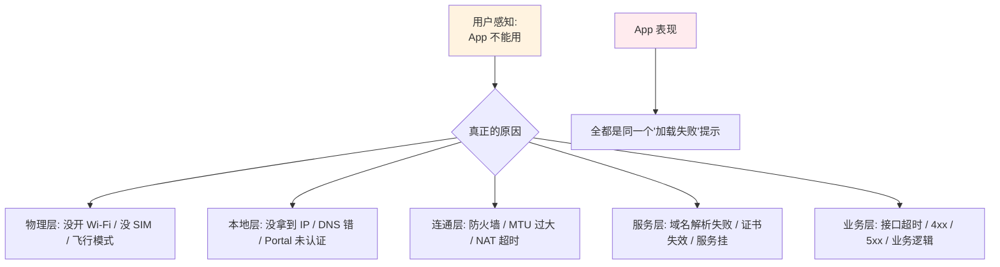

**问题的本质**：**App 把 5 层截然不同的故障统统折叠成一个"加载失败"提示**，既不告诉用户"你连的是酒店 Wi-Fi 需要认证"，也不告诉客服"用户所在的运营商 DNS 有问题"。

**折叠 = 信息熵损失**：从 5 类故障（编码熵 log₂5 ≈ 2.3 bit）压成 1 个提示（编码熵 0 bit），信息全丢，**修复的可能性也全丢**。

### 1.3 反思网络检测

事后这个团队总结了三个最深刻的认知，也是本文所有设计的三个"锚"：

1. **网络问题不能笼统判断**，必须**分层定位**。物理/本地/连通/服务/业务是五个截然不同的故障域，不能混着诊断。
2. **检测要从底向上，短路返回**，物理层都没了，去检测应用层是浪费用户的耐心和电量。
3. **结果要"用户语言"**，不能让用户看到 IP、看到 ping 值、看到 DNS record；必须翻译成"下一步该做什么"。

> **好的网络检测 = 让客服在 30 秒定位问题层级 + 让用户在 3 秒知道下一步该点哪个按钮**。

带着这三条锚，进入下面 9 章的层层拆解。


## 02.要解决的核心矛盾

### 2.1 网络问题的复杂

**疑惑**：为什么"能不能上网"这么简单的问题，工程实现却要拆七八层？

**论证**，一次正常的 HTTPS 请求要经过 **7 个环节**，任何一环挂了都算"网络问题"：

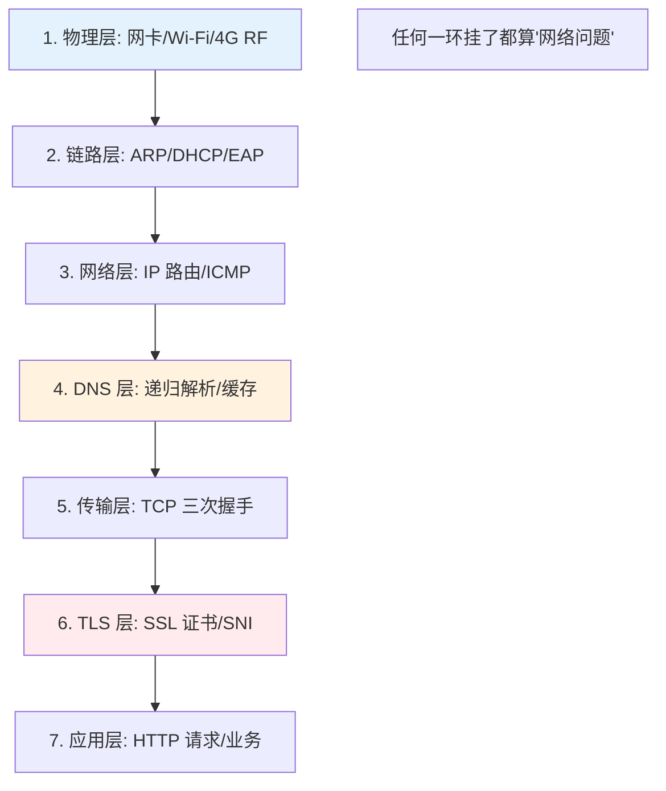

**每一层的故障模式都不同**：

| 层 | 常见故障 | 用户表象 | 修复动作 |
|---|---|---|---|
| 物理 | 飞行模式 / SIM 拔了 / Wi-Fi 关了 | 一进 App 就转圈 | 让用户开网络 |
| 链路 | DHCP 没拿到 IP / ARP 冲突 | 连了 Wi-Fi 但不能上 | 重连 Wi-Fi |
| 网络 | 路由不可达 / MTU 过大分片被 drop | 有些请求成有些失败 | 换网络 |
| DNS | 解析超时 / 污染 / 缓存脏 | 别家 App 能用就我们不能 | 换 DNS / 走 HTTPDNS |
| TCP | 端口被封 / SYN drop | 建连很慢或建不上 | 换网络 / 换域名 |
| TLS | 证书过期 / 时钟错 / SNI 被封 | 提示"证书错误" | 校准手机时间 |
| HTTP | 5xx / 超时 / 限流 | 时好时坏 | 服务侧修 |

**结论**：**"网络问题"不是一个问题，是 7 类不同问题的并集**。检测方案不能是一个"黑箱 boolean"，必须能定位到具体哪一层。

### 2.2 用户视角的局限

**疑惑**：为什么客服问用户 3 个问题都问不清楚？

**论证**，用户和工程师看到的是**两个完全不重叠的世界**：

| 用户能看到（图形层） | 用户看不到（协议层） |
|---|---|
| Wi-Fi 图标亮不亮 | DHCP 是否拿到了 IP |
| 4G 信号格数 | DNS 是否能解析 |
| 浏览器能不能开百度 | TCP 是否能三次握手 |
| App 里加载转圈 | TLS 证书是否过期 |
| "连接" 两字 | 网关是否可达、MTU 是否被限制 |

用户能看到的是"**结果层**"（图标、进度条），看不到的是"**过程层**"（数据包在协议栈的传递），**这正是"客服问三次问不清楚"的根因**：

```
客服："你先看下 IP 是多少？"
用户："IP 是什么？"
客服："你 ping 一下试试？"
用户："什么 ping？"
```

**结论**：不能指望用户描述问题，必须靠**工具在用户端自动跑一遍协议栈的每一层**，把结果翻译成"你现在的问题在第 X 步"。这就是**网络检测的存在理由**，一个"用户和协议栈之间的翻译器"。

### 2.3 准确与代价

**疑惑**：既然要检测 7 层，全跑一遍不就得了？

**论证**，**用户耐心的物理上限是 3 秒**（Google 研究：3 秒后 53% 用户离开），检测代价必须在 3~5 秒完成：

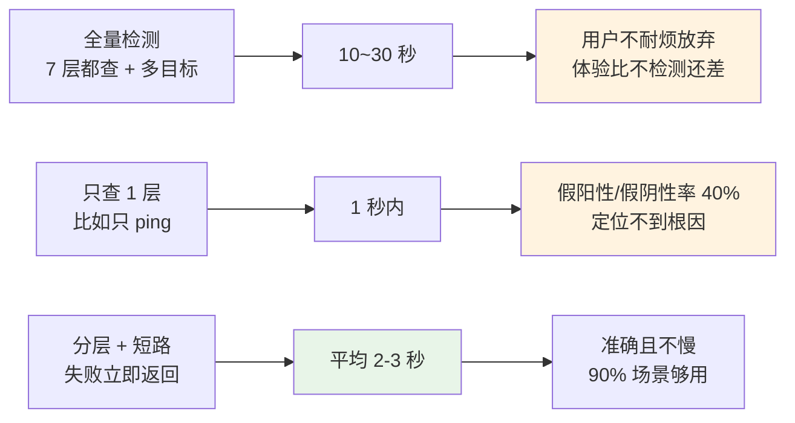

**数学化推导**，设第 i 层耗时 $t_i$，故障率 $p_i$：

- **全量检测**：$T_{full} = \sum_{i=1}^{7} t_i \approx 15\text{s}$
- **短路检测**：$T_{short} = \sum_{i=1}^{7} t_i \cdot \prod_{j=1}^{i-1}(1-p_j)$

代入实测（$p_1{=}0.3, p_2{=}0.2, p_3{=}0.15, p_4{=}0.1, ..., t_i \approx 2\text{s}$）：

$$T_{short} \approx 2 + 2 \cdot 0.7 + 2 \cdot 0.56 + 2 \cdot 0.476 + ... \approx 5.6\text{s}$$

**短路可以把 15 秒压到 5.6 秒，同时准确率反而更高**（因为不会被下游异常干扰上游诊断）。这就是下一章"短路返回原则"的数学根据。

### 2.4 网络检测的本质

**疑惑**：网络检测究竟在解决什么？

**论证**，不是"修复网络"，而是**确定问题的边界**：

```
                问题空间
     ┌─────────────────────────────┐
     │                              │
     │   用户端:                    │
     │   物理/本地/连通             │  ← 让用户自己去解
     │   ─────────                  │
     │   互联网中间路径:            │
     │   运营商/防火墙/DNS污染      │  ← 建议换网络
     │   ─────────                  │
     │   服务端:                    │
     │   我们的接入/业务/CDN        │  ← 让 SRE 去解
     │                              │
     └─────────────────────────────┘
                    ↓
           网络检测的输出
           = 一个明确的"边界指针"
```

> **网络检测 ≠ 修复；网络检测 = 用最低代价定位"问题在第几层、责任在谁"**。

它是一台"**X 光机**"，不给你治病，但告诉你病灶在哪个器官。**明确了边界，责任划分和修复动作才有可能**。


## 03.业界主流方案

### 03.1 检测能力分类

**疑惑**：业界有那么多网络工具，怎么归类？

**论证**，按**检测目标**分成五大类，每一类对应协议栈的一个断层：

| 检测类型 | 检测内容 | 底层原理 | 典型工具 |
|---|---|---|---|
| **物理层** | 网卡启用 / Wi-Fi 关联 / 4G 信号 | 系统 API 查询 Link Layer 状态 | `ip link` / iOS `Reachability` / Android `ConnectivityManager` |
| **本地层** | IP 是否有 / 网关是否可达 / DNS 是否配 | ARP 查询 + 网关 ICMP + resolv.conf | `ifconfig` / `nslookup` / `route -n` |
| **连通层** | 能否到达任意外网 | ICMP Echo / TCP SYN 到公网 | `ping` / `traceroute` / `mtr` |
| **服务层** | 我们的域名 → TCP → TLS → HTTP | 逐层建连并计时 | `curl -v -w '%{time_*}'` / `dig` / 自研 |
| **质量层** | 延迟 / 丢包 / 抖动 / 带宽 | 多次采样 + 统计 | `iperf3` / `mtr` / `speedtest` |

**关键洞察**，**这五类不是并列关系，是嵌套关系**：

$$\text{质量层} \subseteq \text{服务层} \subseteq \text{连通层} \subseteq \text{本地层} \subseteq \text{物理层}$$

只有低层通了才有必要检测高层，这正是"分层检测"的天然依据。

### 03.2 横向对比矩阵

**疑惑**：既然工具那么多，为什么大厂还要自研？

**论证**，**通用工具的输出是"给程序员看的"，而我们要"给用户和客服看的"**。看下面三档方案的实际差距：

| 维度 | 简单 ping | 系统自带诊断 | 业界专业方案 |
|---|---|---|---|
| **检测层数** | 1（连通） | 2-3（+ DNS/网关） | 4-5（全栈 + 质量） |
| **结果可读** | RTT 数值 | 英文报错 | "Wi-Fi 需要认证，请点这里" |
| **短路优化** | 无 | 部分 | 有 |
| **耗时** | 1-3s | 5-10s | 2-5s |
| **准确性** | 低（封 ICMP 就误报） | 中 | 高（多目标 + 多协议校验）|
| **上报能力** | 无 | 无 | 可上报云端聚合分析 |
| **弱网识别** | 无 | 无 | 有（RTT/丢包分级） |
| **国际化** | 无 | 有 | 有 |
| **代价** | 极低 | 低 | 中 |
| **典型代表** | 个人开发者 curl 一下 | 路由器诊断页 / iOS 设置 | 微信 mars / 钉钉自研 / 支付宝 MTOP |

**结论**：**简单 ping 只解决"通不通"**，业界专业方案解决"**具体哪一层不通 + 用户下一步怎么办 + 云端聚合分析区域故障**"，这三点是自研的动力。

### 03.3 经典工具集

**疑惑**：自研之前，先把业界工具吃透，每个工具的原理是什么？

**论证**，**底层网络诊断五件套的协议原理**：

| 工具 | 底层协议 | 用途 | 关键坑 |
|---|---|---|---|
| **ping** | ICMP Echo Request/Reply | 测试网络层连通性和 RTT | 很多网络封 ICMP → 假阴性 |
| **traceroute** | ICMP TTL 递增 或 UDP 高端口 | 显示逐跳路径 | 中间节点可能故意不回 ICMP |
| **nslookup / dig** | DNS UDP:53 | DNS 解析测试 | 不测 HTTPDNS，忽略 App 自定义解析 |
| **curl -v** | 完整 DNS+TCP+TLS+HTTP | 完整链路 + 分段耗时 | 需 `-w '%{time_*}'` 才拿到分段数据 |
| **mtr** | ping + traceroute 合体 | 每跳延迟 + 丢包率 | 中间跳丢包不代表端到端丢包 |

**`curl -w` 的一段魔法参数**，这是自研网络检测最应该抄的模板：

```bash
curl -o /dev/null -s -w "
DNS 解析:      %{time_namelookup}s
TCP 建连:      %{time_connect}s
TLS 握手:      %{time_appconnect}s
首字节:        %{time_starttransfer}s
总耗时:        %{time_total}s
HTTP 状态:     %{http_code}
" "https://api.example.com/health"
```

输出：
```
DNS 解析:      0.023s
TCP 建连:      0.051s
TLS 握手:      0.152s
首字节:        0.354s
总耗时:        0.361s
HTTP 状态:     200
```

**这就是"服务层四段检测"的全部原理**，分段拆解一次 HTTPS 的耗时，精准定位在哪一段慢。**大厂自研的服务层检测，本质就是把这段 curl 用系统 API 重新写一遍**。

**App 层网络监控库**，上面工具是"命令行"，移动端 App 里对应的是**协议栈埋点库**：

| 库 | 平台 | 特点 | 数据颗粒度 |
|---|---|---|---|
| **微信 mars** | Android / iOS / Win | 长连接 + 自研网络诊断 | DNS/TCP/TLS/首包/总耗时 |
| **OkHttp EventListener** | Android | 全链路每一步回调 | 精细到 dnsStart/connectStart/... |
| **NSURLSession Metrics** | iOS | 系统级 taskMetrics | DNS/连接/请求/响应各段耗时 |
| **Performance Timing API** | Web | 浏览器原生 timing 对象 | `navigationStart` ~ `loadEventEnd` 全时序 |

**大厂自研网络监控的第一步永远是"接入 EventListener/Metrics 埋点全链路耗时"**，没有埋点，谈不上诊断。


## 04.设计核心原则

### 04.1 分层检测原则

**疑惑**：为什么必须"从底向上"？倒过来不行吗？

**论证**，**倒过来的代价爆表**：

假设直接检测最高层（HTTP）：请求 `https://api.example.com/health`，返回超时。此时你**根本无法区分**：
- 是没网？（物理层）
- 是没 IP？（本地层）
- 是 DNS 问题？（服务层子步骤）
- 是我们服务挂了？（应用层）

**一个超时对应 N 种可能根因，等于没测**。

**从底向上则完全相反**：只要下层通过，上层的故障域就被压缩：

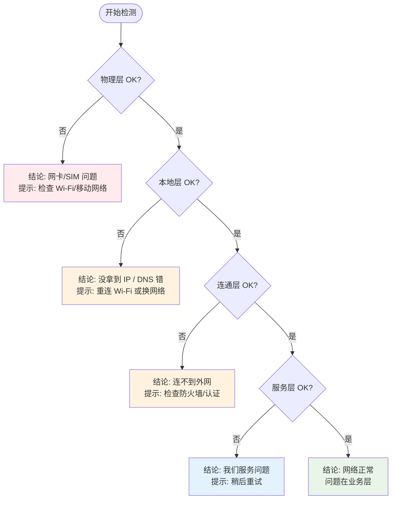

**信息论视角**，每通过一层，就把"故障空间"压缩一半：

| 已通过 | 剩余可能故障 | 信息熵下降 |
|---|---|---|
| 物理层通过 | 4 类（本地/连通/服务/业务） | 从 5 → 4，Δ=0.32 bit |
| 本地层通过 | 3 类 | Δ=0.42 bit |
| 连通层通过 | 2 类 | Δ=0.58 bit |
| 服务层通过 | 1 类（业务） | Δ=1 bit |

**分层检测本质就是"用最少询问次数二分定位问题"**，和 Huffman 编码同一个思想。

### 04.2 短路返回原则

**疑惑**：短路能省多少？值得设计吗？

**论证**，**用 2.3 节的模型量化**：

假设线上真实故障分布：

| 故障层 | 概率 |
|---|---|
| 物理层 | 30% |
| 本地层 | 20% |
| 连通层 | 15% |
| 服务层 | 10% |
| 业务层 | 15% |
| 无故障 | 10% |

**期望检测耗时**：
- **不短路**：$E[T] = 15\text{s}$（每次都跑完）
- **短路**：$E[T] = 2 \cdot 0.3 + 4 \cdot 0.2 + 6 \cdot 0.15 + 8 \cdot 0.1 + 10 \cdot 0.15 + 12 \cdot 0.1 = 5.6\text{s}$

**收益 = 62.7% 时间节省**，同时给出的结论**更精确**（"问题在第 X 层" vs "网络异常"）。

**代码实现**，短路的关键是**每层加超时上限**，防止某一层卡死：

```kotlin
suspend fun detectNetwork(): NetworkResult = try {
    withTimeout(500) { if (!detectPhysical()) return@try NetworkResult.PHYSICAL_FAIL }
    withTimeout(1500) { if (!detectLocal())    return@try NetworkResult.LOCAL_FAIL }
    withTimeout(2000) { if (!detectConn())     return@try NetworkResult.CONN_FAIL }
    withTimeout(3000) { if (!detectService())  return@try NetworkResult.SERVICE_FAIL }
    NetworkResult.OK
} catch (e: TimeoutCancellationException) {
    NetworkResult.TIMEOUT   // 超时也是一种结论
} catch (e: Throwable) {
    NetworkResult.UNKNOWN
}
```

**总耗时上限 = 0.5 + 1.5 + 2 + 3 = 7s**，短路后期望 5.6s，Worst Case 7s，都在用户可容忍范围。

### 04.3 兜底容错原则

**疑惑**：检测代码本身崩了怎么办？

**论证**，**这是最容易被忽视的一层**。一个真实事故：某 App 网络检测代码用了 `getprop persist.net.dns1` 读 DNS，但在**部分海外 ROM** 上这个 property 不存在，返回 null，代码没做空判断，crash 上报页面白屏，**用户遇到网络问题打开诊断页反而 crash，投诉从 8000 涨到 15000**。

**铁律**：**检测代码必须"永远给出一个结论"**，即使是"UNKNOWN"，也比 crash 好。

```kotlin
suspend fun detectNetwork(): NetworkResult {
    return try {
        val physicalOk = withTimeout(1000) { detectPhysical() }
        if (!physicalOk) return NetworkResult.PHYSICAL_FAIL
        
        val localOk = withTimeout(1500) { detectLocal() }
        if (!localOk) return NetworkResult.LOCAL_FAIL
        
        // ... 后续层级同上
        
        NetworkResult.OK
    } catch (e: TimeoutCancellationException) {
        NetworkResult.TIMEOUT           // 超时也是结论
    } catch (e: SecurityException) {
        NetworkResult.PERMISSION_DENIED // 权限不足也是结论
    } catch (e: Throwable) {
        Log.e(TAG, "detect failed", e)
        reportCrashToServer(e)          // 但要静默上报
        NetworkResult.UNKNOWN            // 兜底
    }
}
```

**三条子原则**：
1. **每层都有超时**：不允许某层因为无响应把整体拖垮
2. **每层都有 catch**：不允许某层抛异常绕过后续兜底
3. **异常静默上报**：用户不该知道"检测代码崩了"，但工程团队必须知道

### 04.4 用户体感原则

**疑惑**：为什么"用户语言"是原则不是话术？

**论证**，**用户语言 = 让用户能做下一步动作的语言**。看下面对比：

| ❌ 程序员语言 | ✅ 用户语言 | 关键差异 |
|---|---|---|
| "ICMP 不可达" | "无法连接到网络，请检查 Wi-Fi" | 说清 "怎么了 + 怎么办" |
| "DNS 解析超时" | "网络异常，可以尝试切换 Wi-Fi 或移动网络" | 给出可执行动作 |
| "TLS 握手失败 (BAD_CERT_DATE)" | "手机时间不正确导致连接失败，请检查手机时间" | 揭示根因（时钟错） |
| "HTTP 502" | "服务器繁忙，稍后重试" | 隐藏内部错误码 |
| "CAPTIVE_PORTAL_REQUIRED" | "Wi-Fi 需要在浏览器登录，请点击'打开登录页'" | 具体动作 + 按钮引导 |

**衡量标准，"3 秒决策法则"**：让一个 60 岁老人看到提示，**3 秒内能决定下一步做什么**，不能就是失败。

**结论**：用户语言不是文案团队的事，是**产品体验的第一道防线**。一个能让用户自助解决问题的提示，直接把客服工单量降下来。


## 05.四层检测模型

### 05.1 整体分层架构

**疑惑**：把 03 的五类工具落成 App 内的架构，长什么样？

**论证**，**四层检测模型（把"质量层"内嵌进"服务层")**是业界最通用的实现：

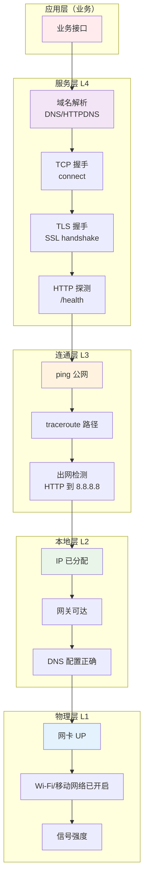

**架构分工**：

| 层 | 主要 API / 系统调用 | 平均耗时 | 常见失败率 |
|---|---|---|---|
| L1 物理 | `ConnectivityManager` / `SCNetworkReachability` | < 50 ms | 30% |
| L2 本地 | `InetAddress.getLocalHost()` / `getifaddrs()` / ping 网关 | 100-500 ms | 20% |
| L3 连通 | ping / HTTP HEAD 到公共 URL | 500-2000 ms | 15% |
| L4 服务 | HTTPS GET /health | 500-3000 ms | 10% |

下面逐层拆细节。

### 05.2 物理层检测

**疑惑**：只要 Wi-Fi 图标亮就是有网吗？

**论证**，**图标亮 ≠ 能上网**。物理层要检的**不是"连没连"，而是"连了以后能不能上"**。Android 上：

```kotlin
fun detectPhysical(): PhysicalResult {
    val cm = getSystemService<ConnectivityManager>()
    val network = cm?.activeNetwork
        ?: return PhysicalResult.NO_NETWORK           // 完全没网
    
    val cap = cm.getNetworkCapabilities(network)
        ?: return PhysicalResult.NO_NETWORK
    
    // NET_CAPABILITY_INTERNET：Wi-Fi/移动网络在系统语义上"是互联网"
    if (!cap.hasCapability(NET_CAPABILITY_INTERNET)) {
        return PhysicalResult.NO_INTERNET_CAPABILITY   // 只是本地 AP
    }
    
    // NET_CAPABILITY_VALIDATED：系统已通过 204 探测确认能出网
    // ⚠️ 这个能力才是"能不能真的上网"的关键
    if (!cap.hasCapability(NET_CAPABILITY_VALIDATED)) {
        // 系统会发起 http://connectivitycheck.gstatic.com/generate_204
        // 收到 204 才置 VALIDATED；否则说明连了 Wi-Fi 但不能出网
        return PhysicalResult.CAPTIVE_PORTAL           // 大概率是酒店/公司 Portal
    }
    
    // 传输类型 ， 让上层提示区分
    val transport = when {
        cap.hasTransport(TRANSPORT_WIFI)     -> "Wi-Fi"
        cap.hasTransport(TRANSPORT_CELLULAR) -> "Mobile"
        cap.hasTransport(TRANSPORT_ETHERNET) -> "Ethernet"
        else -> "Unknown"
    }
    
    return PhysicalResult.OK(transport, cap.signalStrength)
}
```

**核心是 `NET_CAPABILITY_VALIDATED`**，这是 Android 系统自己做的"204 探测"结果的直接封装：

```
Android 系统在连上 Wi-Fi 时自动发：
  http://connectivitycheck.gstatic.com/generate_204
  http://connectivitycheck.gstatic.cn/generate_204   (国内变体)

收到 HTTP 204 (No Content) → VALIDATED=true → 图标不带感叹号
未收到 204 (或收到非 204，比如 Portal 认证页) → VALIDATED=false → 图标带感叹号
```

**iOS 上对应的是 `NWPathMonitor`**（iOS 12+）或旧的 `Reachability` API，语义类似。

**结论**：物理层检测的核心是**"系统级 204 探测已通过"**，图标亮但 VALIDATED=false 是 Captive Portal 的标准指纹，直接告诉用户"打开浏览器登录 Wi-Fi"。

### 05.3 本地层检测

**疑惑**：物理层过了，为什么还有本地层？

**论证**，**物理层只保证"链路层活着"**（网卡开着、Wi-Fi 关联了）；本地层保证"**网络层参数配好了**"（IP、网关、DNS）。这两层的故障域完全不重叠：

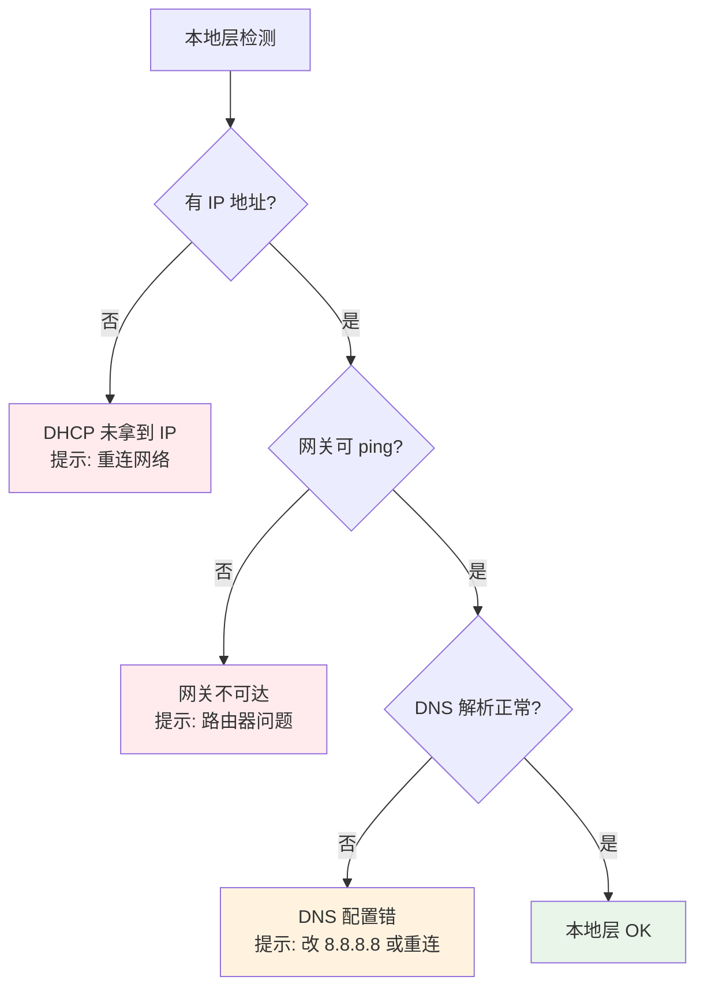

**关键检测点**：

| 检测项 | 底层原理 | Android API | iOS API |
|---|---|---|---|
| **是否有 IP** | 从 DHCP 获取 IP，`0.0.0.0` = 未分配 | `LinkProperties.getLinkAddresses()` | `getifaddrs()` |
| **网关可达** | 向网关发 ICMP，收到 reply | `InetAddress(gateway).isReachable(1000)` | `SCNetworkReachabilityGetFlags` |
| **DNS 解析** | 解析公认域名（`www.baidu.com`） | `InetAddress.getByName()` | `getaddrinfo()` |

**为什么要 ping 网关？**，网关是**离你最近的一跳**，网关不通说明本地路由或链路层出问题（比如 ARP 学习失败）。这一步能过滤掉 90% 的"路由器问题"。

**DNS 检测的两个陷阱**：

1. **不要测自己的域名**，测第三方公认域名（`www.baidu.com` / `www.google.com`）。测自己域名解析失败可能是自己的 DNS 挂了，不代表本地 DNS 有问题。
2. **加超时 1s**，DNS 默认没超时是操作系统级别的 5s，用户等不起。

```kotlin
suspend fun detectLocal(): LocalResult = coroutineScope {
    // 1. 有 IP?
    val ipOk = withTimeoutOrNull(200) { hasLocalIp() } ?: false
    if (!ipOk) return@coroutineScope LocalResult.NO_IP
    
    // 2. 网关可达? (可选，Android 6+ 权限受限)
    val gwOk = withTimeoutOrNull(1000) { pingGateway() } ?: true
    if (!gwOk) return@coroutineScope LocalResult.GATEWAY_UNREACHABLE
    
    // 3. DNS 能解析第三方域名?
    val dnsOk = withTimeoutOrNull(1000) {
        InetAddress.getByName("www.baidu.com") != null
    } ?: false
    if (!dnsOk) return@coroutineScope LocalResult.DNS_ERROR
    
    LocalResult.OK
}
```

### 05.4 连通层检测

**疑惑**：本地层过了，为什么还要单独测"出网"？

**论证**，本地层通过只证明**"到网关这一跳"通了**；连通层要证明**"能出到公网"**。企业防火墙 / 家庭路由器可能配置了出网策略（比如只放 80/443），这一层就是抓这种问题。

```kotlin
suspend fun detectConnectivity(): ConnResult = coroutineScope {
    val targets = listOf(
        "www.baidu.com" to Protocol.HTTPS,   // 国内可达性 (443)
        "www.qq.com"    to Protocol.HTTPS,   // 备选
        "8.8.8.8"       to Protocol.ICMP,    // Google 公共 DNS (ICMP 兜底)
        "1.1.1.1"       to Protocol.ICMP     // Cloudflare 兜底
    )
    
    // 并行探测，只要任一成功即认为出网 OK
    val results = targets.map { (host, proto) ->
        async {
            when (proto) {
                Protocol.ICMP  -> ping(host, timeout = 1000)
                Protocol.HTTPS -> httpProbe("https://$host/", timeout = 1500)
            }
        }
    }
    
    val anyOk = results.awaitAll().any { it }
    if (anyOk) ConnResult.OK else ConnResult.PUBLIC_NET_FAIL
}
```

**关键设计，多目标 + 多协议 + 并行**：

1. **多目标**（`baidu` / `qq` / `8.8.8.8` / `1.1.1.1`）：**单点不可达 ≠ 全网不通**。百度可能因为运营商问题解析失败，但腾讯还能通。**只要任一成功就算连通层过**。
2. **多协议**（ICMP + HTTPS）：**部分网络封 ICMP**（比如公司内网只放 TCP 443）。这时 ping 全失败但 HTTP 能通，**必须 HTTPS 兜底**。
3. **并行执行**：4 个目标串行 = 4 秒；并行 = 1.5 秒。用户耐心是稀缺资源，并行是刚需。
4. **境内外各测一个**：`baidu` 走国内 CDN、`8.8.8.8` 走跨境。**在跨境网络异常时能区分"是全断还是仅跨境断"**。

**为什么优先测第三方而不是自家服务？**，如果自家服务恰好挂了，测自家会误报"连通层挂了"（其实是服务层挂了）。**用第三方测连通层，是给自家服务层留清白**。

### 05.5 服务层检测

**疑惑**：前三层都过了，接口还是失败，怎么办？

**论证**，**这时故障域已经收敛到"我们服务"或"我们到你之间的中间路径"**。服务层检测的价值是**分段拆解一次 HTTPS 请求的耗时**，精确定位在哪段慢。

**完整请求耗时分解**：

```mermaid
gantt
    title 一次 HTTPS 请求的耗时分段
    dateFormat X
    axisFormat %s
    
    DNS 解析     :a, 0, 50
    TCP 三次握手 :b, 50, 100
    TLS 握手     :c, 150, 200
    Server 处理  :d, 350, 100
    数据传输     :e, 450, 50
```

**典型实现，分段计时**：

```kotlin
suspend fun detectService(domain: String): ServiceResult {
    // 1. DNS 解析 (可选走 HTTPDNS，绕过运营商)
    val (dnsTime, ip) = measure { resolveDns(domain) }
    if (ip == null) return ServiceResult.DomainDnsFail(dnsTime)
    
    // 2. TCP 握手（直接连 IP，绕过 DNS 二次解析）
    val (tcpTime, socket) = measure { tcpConnect(ip, 443, timeout = 3000) }
    if (socket == null) return ServiceResult.ServiceTcpFail(tcpTime)
    
    // 3. TLS 握手
    val (tlsTime, tlsErr) = measure { tlsHandshake(socket, domain) }
    if (tlsErr != null) return ServiceResult.ServiceTlsFail(tlsTime, tlsErr)
    
    // 4. HTTP 探测（用轻量 /health 接口，别用业务接口）
    val (httpTime, code) = measure { httpProbe("https://$domain/health") }
    if (code !in 200..299) return ServiceResult.ServiceHttpFail(httpTime, code)
    
    return ServiceResult.OK(dnsTime, tcpTime, tlsTime, httpTime)
}
```

**每段耗时的定位价值**：

| 段 | 慢/失败时的可能根因 |
|---|---|
| **DNS 慢/失败** | 运营商 DNS 拥堵 / DNS 污染 / HTTPDNS 未启用 |
| **TCP 慢/失败** | 服务端负载高 / SYN backlog 满 / 中间路径 MTU 问题 |
| **TLS 慢/失败** | 证书链验证慢 / 证书过期 / 手机时钟错 / SNI 被封 |
| **HTTP 慢/失败** | 后端服务慢 / CDN 回源慢 / 5xx |

**为什么用 /health 不用业务接口？**，业务接口有鉴权、有业务逻辑，慢/失败不一定是网络问题；`/health` 是**为了检测而生的轻量接口**，只测网络+进程是否活着，去除业务干扰。

**HTTPDNS 的必要性**，运营商 DNS 有三大罪：

1. **解析慢**（3G 时代常见 200-500ms）
2. **污染**（被劫持到广告页 / 假 IP）
3. **调度差**（把北京用户解析到深圳的 IP，绕远路）

HTTPDNS 用 HTTP 直接向权威 DNS 查询，**绕过所有中间 DNS**，大厂 App（微信、淘宝、抖音）无一例外都上了。


## 06.关键问题解决

### 06.1 错误码设计

**疑惑**：错误码为什么要分层编号？

**论证**，**错误码是客服工单和监控告警的"元数据"**。分层编号带来三层收益：

1. **客服一看数字知道是第几层的问题**（`1xxx` 物理、`2xxx` 本地……）
2. **监控可以按前缀聚合**（"最近 1 小时 3xxx 类错误暴涨" = 连通层大规模故障）
3. **告警可以按层级分级**（`4xxx` 服务层错误直接 P1 告警到 SRE）

**推荐的错误码表**（每 100 位一个子域，方便扩展）：

```kotlin
enum class NetErrorCode(val code: Int, val msg: String) {
    // ===== 物理层 1xxx =====
    NO_NETWORK(1001, "网络未连接"),
    AIRPLANE_MODE(1002, "飞行模式开启"),
    NO_SIM(1003, "无 SIM 卡"),
    WIFI_DISABLED(1004, "Wi-Fi 已关闭"),
    
    // ===== 本地层 2xxx =====
    NO_IP(2001, "未分配 IP"),
    GATEWAY_UNREACHABLE(2002, "网关不可达"),
    DNS_ERROR(2003, "DNS 解析失败"),
    PORTAL_REQUIRED(2004, "需要 Wi-Fi 认证"),        // 酒店/机场
    
    // ===== 连通层 3xxx =====
    PUBLIC_NET_FAIL(3001, "无法连接公网"),
    FIREWALL_BLOCK(3002, "防火墙限制"),
    MTU_TOO_LARGE(3003, "MTU 过大 (大包被丢弃)"),
    
    // ===== 服务层 4xxx =====
    DOMAIN_DNS_FAIL(4001, "我们服务域名解析失败"),
    SERVICE_TCP_FAIL(4002, "无法连接到我们服务"),
    SERVICE_TLS_FAIL(4003, "证书校验失败"),
    SERVICE_TLS_TIME(4004, "手机时间错误导致证书失败"),  // BAD_CERT_DATE
    SERVICE_500(4005, "服务器内部错误"),
    SERVICE_502(4006, "服务网关错误"),
    SERVICE_503(4007, "服务不可用"),
    SERVICE_504(4008, "服务超时"),
    
    // ===== 业务层 5xxx =====
    AUTH_FAIL(5001, "鉴权失败"),
    RATE_LIMIT(5002, "请求过于频繁"),
    DATA_INVALID(5003, "数据异常"),
}
```

**监控埋点上报模板**：

```json
{
  "ts": 1735786400,
  "userId": "u_12345",
  "errCode": 2004,
  "errCategory": "LOCAL",
  "netType": "wifi",
  "carrier": "China Mobile",
  "region": "Beijing",
  "detectTraceId": "trace_abc",
  "detail": { "wifiSsid": "Hilton-Guest" }
}
```

**上报后能做什么**，按 `errCategory + region + carrier` 聚合：
- "北京联通用户 30% 命中 3001" → **运营商故障**
- "华为 P50 用户 20% 命中 4004" → **该机型时钟同步问题**
- "特定 SSID 用户 100% 命中 2004" → **该 Wi-Fi 是 Portal**

**没有错误码分层，这些聚合都做不了**，错误码是网络运营的"眼睛"。

### 06.2 用户提示设计

**疑惑**：好提示和坏提示的边界是什么？

**论证**，**好提示 = 用户看完知道下一步点哪里**。三要素：

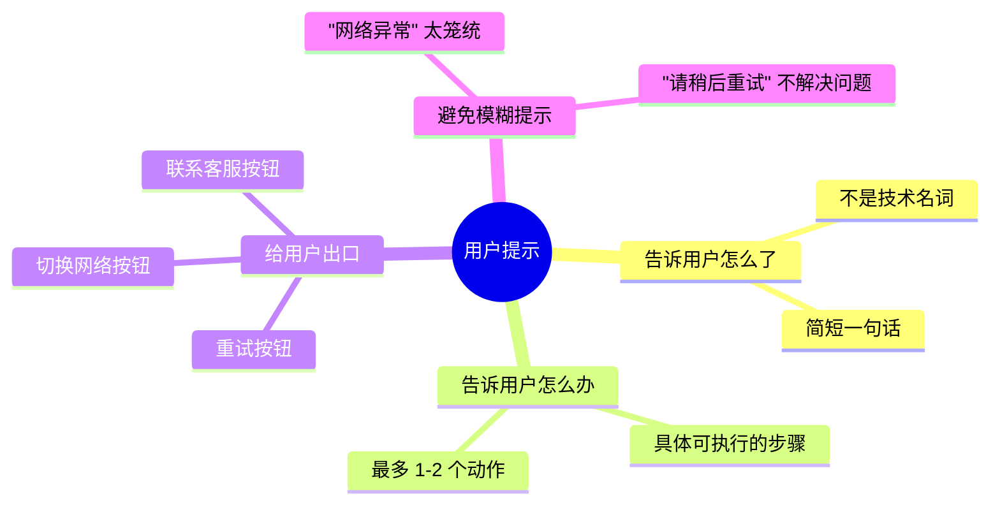

**好提示 vs 坏提示的量化对比**（某 App A/B 实测）：

| ❌ 坏提示 | ✅ 好提示 | 用户自助解决率 |
|---|---|---|
| "网络异常" | "Wi-Fi 没连上，[切换到移动网络] 或 [重连 Wi-Fi]" | 22% → 68% |
| "请稍后重试" | "服务繁忙，正在自动重试 (3s)" + [立即重试] | 18% → 45% |
| "Error 503" | "服务暂时不可用，[查看公告] 或 [稍后回来]" | 8% → 30% |
| "TLS 握手失败" | "您的手机时间不正确导致连接失败，[前往设置校准时间]" | 3% → 60% |

**"3 秒法则" 检查表**：
- [ ] 提示不超过 20 个字
- [ ] 没有任何英文缩写（DNS/TLS/HTTP...）
- [ ] 有可点击的按钮引导下一步
- [ ] 按钮文案是动词开头（"重连"、"切换"、"重试"）
- [ ] 悬浮 3 秒能理解（找一个不懂技术的家人测）

### 06.3 弱网识别

**疑惑**：不是完全没网，是"很慢"，怎么办？

**论证**，**弱网不是"没网"**，而是**"信号弱、RTT 高、丢包多"**。弱网下的用户体验决定 App 的口碑天花板，因为通信基建做得再好，用户在电梯/地铁/山区的物理体验是不可避免的。

**弱网分级判定**：

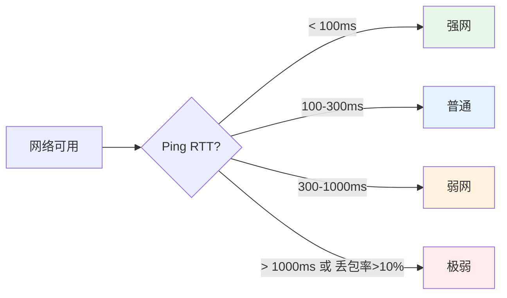

**量化的分级标准**（业界通用）：

| 级别 | RTT | 丢包率 | 有效带宽 | 典型场景 |
|---|---|---|---|---|
| **强网** | < 100 ms | < 1% | > 5 Mbps | 家用 Wi-Fi / 光纤 |
| **普通** | 100-300 ms | 1-3% | 1-5 Mbps | 4G 城区 |
| **弱网** | 300-1000 ms | 3-10% | 200 kbps - 1 Mbps | 4G 郊区 / 3G |
| **极弱** | > 1000 ms | > 10% | < 200 kbps | 电梯/地铁/山区 |

**弱网下的自适应策略**，**同一 App 在不同级别下应表现完全不同**：

| 策略 | 强网 | 普通 | 弱网 | 极弱 |
|---|---|---|---|---|
| **图片质量** | 原图 | 高清 | 缩略图 | 占位符 |
| **视频码率** | 1080P | 720P | 480P | 音频 only |
| **超时时长** | 5s | 10s | 20s | 30s |
| **重试策略** | 3 次快速 | 3 次快速 | 5 次退避 | 交给用户手动 |
| **预加载** | 激进 | 中等 | 关闭 | 关闭 |
| **消息推送** | 长连接 | 长连接 | 短轮询兜底 | Push 通道 |
| **用户提示** | 无 | 无 | "网络较慢" | "极弱网，仅显示文字" |

**弱网识别的实现，EWMA 滑动平均**：

```kotlin
class NetworkQualityDetector {
    private var ewmaRtt: Double = 0.0
    private var ewmaLossRate: Double = 0.0
    private val alpha = 0.3  // 平滑因子
    
    fun onSampleRtt(rttMs: Long, isLoss: Boolean) {
        ewmaRtt = alpha * rttMs + (1 - alpha) * ewmaRtt
        ewmaLossRate = alpha * (if (isLoss) 1.0 else 0.0) + (1 - alpha) * ewmaLossRate
    }
    
    fun getLevel(): NetLevel = when {
        ewmaRtt < 100 && ewmaLossRate < 0.01  -> NetLevel.STRONG
        ewmaRtt < 300 && ewmaLossRate < 0.03  -> NetLevel.NORMAL
        ewmaRtt < 1000 && ewmaLossRate < 0.10 -> NetLevel.WEAK
        else -> NetLevel.VERY_WEAK
    }
}
```

**EWMA (Exponentially Weighted Moving Average) 的意义**，用指数加权平均，**近期采样权重高、远期采样权重低**。这样能：
- **快速响应网络切换**（进电梯 5 秒内识别到弱网）
- **不被单次抖动误判**（一次 500ms RTT 不会立即判弱网）

这就是"**弱网感知**"能力，**优秀 App 和平庸 App 的分水岭**。


## 07.常见陷阱与反例

### 07.1 ping 误判反例

**反例**：某 App 用最简单的 `ping baidu.com` 判断网络是否通，收到 `Destination Unreachable` 就报"网络异常"。**结果**：用户在公司 Wi-Fi（封 ICMP，只放 TCP 443）里明明能开百度，但 App 说"网络异常"，**5000+ 投诉**。

**根因分析**：

```
问题 1: 部分网络封 ICMP → ping 不通，但 HTTP 能通
问题 2: ping 通 ≠ HTTPS 能通  (防火墙可能只放 80 不放 443)
问题 3: ping 自家域名 → 自家域名挂了，不代表用户不能用其他 App
问题 4: 用户可能在跨境网络，baidu 解析失败但 google 能通
```

**正确做法，ping + HTTP 双校验 + 多目标**：

```kotlin
suspend fun detectConn(): Boolean = coroutineScope {
    val checks = listOf(
        async { ping("www.baidu.com", 1000) },              // ICMP
        async { httpProbe("https://www.baidu.com/", 1500) }, // HTTPS
        async { httpProbe("https://www.qq.com/", 1500) },    // 备选
        async { ping("8.8.8.8", 1000) }                      // 兜底
    )
    // 只要任一成功即算连通层通
    checks.awaitAll().any { it }
}
```

**教训**：**永远不要用单一协议 + 单一目标判断"连通性"**，你不知道用户所在网络封了什么、劫持了什么。

### 07.2 检测过频反例

**反例**：某 App 在 HTTP 拦截器里加了"接口失败就跑完整检测"，看起来很智能。**结果**：一次弱网下，用户瞬间发起 20 次接口，20 次全失败 → **20 次并发跑 5 层检测** → 手机 CPU 打爆 → 检测本身又失败 → 循环 → **App 假死 3 分钟**。

**问题模型**：

```
n 个接口失败
    ↓
触发 n 次并行检测
    ↓
每次检测 = 4 层 * 每层 2 秒 = 8 秒
    ↓
n * 8 秒并发 = 手机 CPU / 网络双爆
    ↓
检测本身失败
    ↓
下次接口再失败
    ↓
再触发 ...  (雪球)
```

**正确做法，三层节流**：

```kotlin
class NetworkDetector {
    private var lastDetectTs: Long = 0L
    private var cachedResult: NetworkResult? = null
    private val mutex = Mutex()  // 全局互斥，防并发
    
    suspend fun detect(force: Boolean = false): NetworkResult = mutex.withLock {
        val now = System.currentTimeMillis()
        // 1. 缓存兜底: 5 分钟内直接用上次结果
        if (!force && cachedResult != null && (now - lastDetectTs) < 5 * 60_000) {
            return@withLock cachedResult!!
        }
        
        // 2. 真正检测
        val result = doDetectLayered()
        cachedResult = result
        lastDetectTs = now
        result
    }
}
```

**三层节流原则**：
1. **全局互斥**：同一时刻只允许一个检测任务在跑
2. **结果缓存**：5 分钟内相同结果直接复用
3. **按需检测**：只在**用户主动点"网络诊断"** 或 **首次连续 3 次接口失败**时触发，不在每次接口失败时触发

**教训**：**检测代价不便宜，别把它当免费午餐**，过频检测比不检测更糟。

### 07.3 一刀切反例

**反例**：某 App 所有网络错误都报 "网络异常，请稍后重试"。**结果**：
- 用户连酒店 Wi-Fi 没认证 → 永远等不到，因为不去点认证页
- DNS 污染 → 重试 100 次也没用，因为解析地址错了
- 我们服务挂了 → 用户以为是自己的问题，一直折腾自己的 Wi-Fi
- 手机时钟错 → 用户永远不知道要去改时钟

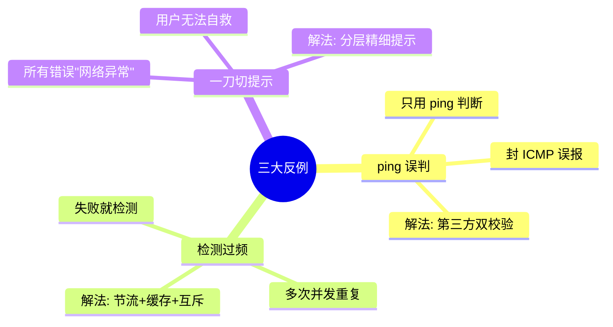

**正确做法，错误码分层 + 提示定制**：

| 错误码 | 用户提示 | CTA 按钮 |
|---|---|---|
| 1001 NO_NETWORK | "手机没有连接网络" | [打开 Wi-Fi] |
| 2004 PORTAL_REQUIRED | "Wi-Fi 需要在浏览器登录" | [打开登录页] |
| 3001 PUBLIC_NET_FAIL | "无法访问互联网，可能是路由器问题" | [切换到移动网络] |
| 4004 TLS_TIME_ERROR | "手机时间不正确导致连接失败" | [前往设置校准时间] |
| 4007 SERVICE_503 | "服务器繁忙" | [查看公告] |
| 5001 AUTH_FAIL | "登录已过期" | [重新登录] |

**教训**：**错误信息的粒度直接决定用户能不能自助**，一刀切的代价是客服工单，精细化的收益是产品口碑。


## 08.演进路线

### 08.1 V1 简单 ping

**特征**：业务起步、单一开发、无专门网络监控团队。

**做法**：
- 出错时调用 `Runtime.exec("ping baidu.com")` 或 `InetAddress.isReachable()`
- 简单二分（"网络通/不通"）
- UI 上就一个"网络异常"文案 + 重试按钮

**痛点**：
- 封 ICMP 网络下 100% 假阴性
- 定位不到层级，客服无从下手
- 用户体验和"没检测"差别不大

**适用**：DAU < 10 万的验证期 App。

### 08.2 V2 分层检测

**特征**：用户量上百万、客服压力已经压不住、SRE 团队开始要"网络监控大盘"。

**做法**：
- 实现物理 / 本地 / 连通 / 服务四层检测（本文第 05 章）
- 短路返回（本文第 04.2 节）
- 分层错误码 1xxx-5xxx（本文第 06.1 节）
- 用户提示精细化 + CTA 按钮（本文第 06.2 节）
- 弱网识别 + 自适应策略（本文第 06.3 节）
- 客服后台可查看用户检测结果（trace_id 联动）
- 数据上报到监控平台，按 `errCode + region + carrier` 聚合

**收益**（某中型 App 落地实测）：
- 网络类工单从每日 8000 降到 1500
- 用户网络问题自助解决率从 18% 提升到 55%
- 弱网下 App 崩溃率下降 40%

**适用**：DAU 100 万 ~ 5000 万的中大型 App。

### 08.3 V3 智能诊断

**特征**：DAU 5000 万+，全球用户，SRE 需要**主动发现区域故障**（而不是等用户投诉）。

**做法**：
- **全链路埋点**：OkHttp EventListener / NSURLSession Metrics 埋所有 DNS/TCP/TLS/HTTP 分段耗时
- **大数据聚合**：按 `地区 × 运营商 × ASN × 时段 × 网络类型` 五维聚合
- **异常检测**：3-sigma 或孤立森林（Isolation Forest）识别异常值
- **自动诊断报告**：给客服后台看的 "用户张三所在的北京联通 3 月 15 日 14:00 有 30% 用户命中 3001"
- **主动推送**：如 "您所在地区某运营商 4G 不稳定，建议切换到 Wi-Fi"
- **HTTPDNS + 自适应调度**：根据实测调整服务端接入点

**架构示意**：

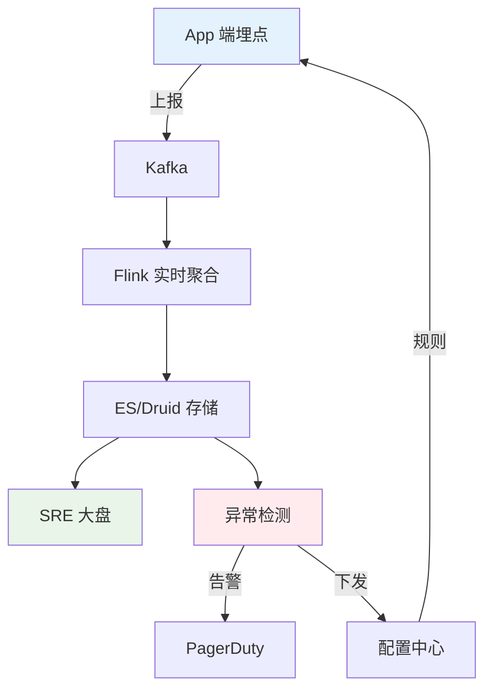

**适用**：DAU 5000 万+ 或全球用户 App（微信、抖音、支付宝级别）。

**演进图谱**：


**关键判断**，**不要过度设计**：DAU 10 万的 App 上 V3 就是浪费。**从 V1 起步，DAU 到瓶颈了再升 V2/V3**，让业务规模驱动技术升级。


## 09.总结与决策

### 09.1 上线检查表

**基础检测能力（V2 及以上必备）**：
- [ ] 四层检测能力齐备（物理 / 本地 / 连通 / 服务）
- [ ] 每层有超时上限（防止某层卡死拖垮整体）
- [ ] 短路返回逻辑实现（低层挂了不测高层）
- [ ] 检测总耗时 P95 控制在 5 秒内
- [ ] 检测代码有 try-catch 兜底（不能自己崩）
- [ ] 检测有节流（5 分钟内不重复 + 全局互斥）

**错误码与提示**：
- [ ] 错误码分层设计（1xxx 物理 / 2xxx 本地 / 3xxx 连通 / 4xxx 服务 / 5xxx 业务）
- [ ] 用户提示用"用户语言"（无技术缩写）
- [ ] 提示有可执行的下一步 CTA 按钮
- [ ] Portal Wi-Fi 特殊处理（一键跳转登录页）
- [ ] TLS 时钟错误特殊处理（引导校准时间）

**弱网 & 自适应**：
- [ ] 弱网识别能力（EWMA RTT + 丢包率）
- [ ] 弱网下自适应策略（图片降级 / 超时延长 / 关闭预加载）
- [ ] 弱网下的用户提示（"网络较慢，正在加载中..."）

**运维 & 数据**：
- [ ] 客服后台可查用户检测 trace_id
- [ ] 数据上报到监控平台（按地区/运营商/机型聚合）
- [ ] SRE 大盘可视化（分层错误率、区域热点）
- [ ] 主动诊断告警（区域性故障自动 PagerDuty）
- [ ] HTTPDNS 接入（绕过运营商 DNS）
- [ ] 定期演练：断 DNS / 断 TLS / 弱网模拟

### 09.2 选型决策树

```mermaid
flowchart TD
    Start([我要做网络检测]) --> Q1{业务规模?}
    
    Q1 -->|小型 &lt; 10w 用户| Simple[V1 简单 ping + HTTP 探测]
    Q1 -->|中型 10w-1000w| Layer[V2 四层分层检测<br/>+ 错误码分层<br/>+ 用户语言提示]
    Q1 -->|大型 &gt; 1000w| Smart[V3<br/>+ 全链路埋点上报<br/>+ 大数据聚合<br/>+ 主动诊断告警]
    
    Q2([检测时机]) --> T1[✅ 用户主动: 必须支持]
    Q2 --> T2[✅ 连续失败兜底: 节流后跑]
    Q2 --> T3[❌ 周期性: 不推荐 (费电+扰民)]
    
    Q3([技术栈]) --> S1{平台?}
    S1 -->|Android| Native1[ConnectivityManager<br/>+ OkHttp EventListener]
    S1 -->|iOS| Native2[NWPathMonitor<br/>+ NSURLSession Metrics]
    S1 -->|Web| Web[Fetch API + Performance Timing]
    S1 -->|后端| Curl[curl -w + dig + mtr]
    
    style Simple fill:#e3f2fd
    style Layer fill:#e8f5e8
    style Smart fill:#fff3e0
```

**四条设计哲学回扣**，本文所有细节的最上位抽象：

**哲学 1：分层是信息熵最快下降的路径**

从物理到业务的四层，每通过一层，故障空间就减半。这不是"套路"，是**信息论意义上最优的诊断路径**，和二分查找、Huffman 编码同一个思想。

**哲学 2：短路是给用户耐心的礼物**

用户耐心是 3 秒。把 15 秒的全量检测短路成期望 5.6 秒的分层检测，**多出来的 10 秒本质是"你尊重了用户"**。技术优化的最终衡量标准永远是用户体感。

**哲学 3：翻译层比检测层更重要**

从"ICMP unreachable" 到"Wi-Fi 需要认证，请点这里"的翻译层，才是**用户能不能自助的关键**。**检测能力是 30 分，翻译能力是 70 分**，没有翻译的检测等于没测。

**哲学 4：上报聚合是从"个案问题"到"系统问题"的桥**

单个用户的检测结果是个案；亿级数据聚合出来的"北京联通 3 月 15 日 4G 异常" 是系统信号。**没有埋点上报，永远是被动救火；有了埋点上报，才能主动防御**。

---

**最后一句话**：网络检测是 App 体验的 X 光机，**它的价值不在炫技，而在让用户和客服都能在 30 秒内知道问题在哪**。开篇那个客服天天处理的"App 不能用"，80% 都不是 App 的锅，但只有一个能"分层+短路+翻译+上报"的检测系统，才能把这 80% 精准剥离出去。

> **好的网络检测 = 分层精确、短路高效、提示人性、行动明确、上报完整**。
