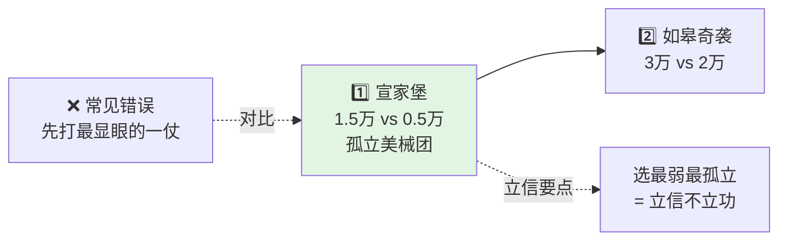

# Mermaid 插图提示词模板

> 让 AI 根据**已有文章内容**补充 Mermaid 图时，直接复制下面的提示词。
> 提示词里已经写死了本书的图型选择规则与样式规范，AI 输出即可直接粘贴，不需要二次返工。

---

## 一、三个让 AI 画出废图的原因

| 常见提示 | 结果 |
|---|---|
| "帮我根据文章加几个 mermaid 图" | AI 没吃透原文，只画出目录式骨架，换成任何一篇文章都成立 |
| 不指定图型 | 清一色 `flowchart TD`，全是"问题→分析→解决" |
| 不给样式约束 | 节点文案过长撑破图、括号导致语法报错、风格与全书不统一 |

**核心心法**：把"画图"拆成四个确定输入 —— **素材锚点**（必须来自原文的真实数字 / 年份 / 对比项）+ **图型** + **样式** + **落位**（插在哪句话后）。四者都给定，AI 才画不错。

---

## 二、三条铁律

1. **图必须"长"在原文上**：每个节点都要来自原文的具体事实，禁止"输入→处理→输出"这类放之四海皆准的抽象骨架。
2. **按表达目的选图型**：不要清一色 `flowchart`，见下方图型选择规则。
3. **一次不超过 3 张**：一次吐 10 张，后面几张必然开始套模板。

---

## 三、图型选择规则

| 想表达什么 | 用什么图 |
|---|---|
| 一个概念分几层 / 几个分支 | `mindmap` |
| 两个维度交叉出四种结果 | `quadrantChart` |
| 有先后次序的演进、阶段、步骤 | `flowchart LR` |
| 一个结论往下拆因果 / 条件 | `flowchart TB` 或 `graph TB` |
| 有明确时间刻度的历史进程 | `flowchart LR` 串年份节点（**不要用 timeline，渲染不稳**） |
| 多方博弈、来回拉扯（谈判、攻防） | `sequenceDiagram` |
| 市面说法 vs 正确说法的正面对撞 | `graph LR`，两侧节点分别用「市面：」「真解：」开头 |

---

## 四、硬性样式规范

1. 代码块语言为 `mermaid`，前后各留一个空行。
2. 节点文案一律用 `["..."]` 包裹，换行用 `<br/>`；**节点内禁止出现英文半角的引号、圆括号、方括号**，需要括号一律用中文「」或『』。
3. 每个节点不超过 3 行，每行不超过 12 个字。
4. 序号用 1️⃣ 2️⃣ 3️⃣；结论用 ✅，反面用 ❌ / ⚠️。
5. 补充关系的虚线写成 `A -.说明文字.-> B`。
6. 至少给 1 个关键节点上色：`style XX fill:#e2f5e2`（正面绿）/ `#ffe0e0`（反面红）/ `#fff4d6`（提醒黄）。
7. 每张图上方必须有一句**引导句**，以冒号结尾，点明"这张图回答什么"。禁止使用"如下图所示""见下图"这类空引导。

**参考样例**（照这个颗粒度和语气写，不要照抄内容）：



```mermaid
mindmap
  root((("🎯 不打无准备之仗<br/>= 3 层独家主张")))
    第1层 · 准备对象
      市面: 正常情况
      真解: 异常情况
    第2层 · 准备结构
      战略: 为什么打
      战术: 分几步 每步资源
```

---

## 五、提示词 A：单篇补图（主力）

````
你是一位擅长用 Mermaid 做信息可视化的技术书编辑。现在为我的一篇长文补充 Mermaid 图。

# 输入
文章全文：<粘贴完整文章>

# 背景
这是《毛选实战心法》专栏的一章，全书 53 章、每章约 1 万字，统一 12 节结构：
01 真实场景 / 02 市面误读 / 03 三层主张 / 04 历史现场 / 05 原文精读 / 06 体系拆解 /
07 落地工具 / 08 历史案例 / 09 商业切片 / 10 三个陷阱 / 11 三年复利 / 12 收束金句。
读者是程序员和管理者，要的是"能拿去用"，不是"看着漂亮"。

# 任务
通读全文，找出**必须靠图才能讲清楚**的地方，补充 7-10 张 Mermaid 图。宁可少一张，不要凑数。

# 铁律一：图必须"长"在原文上
每张图的每个节点，都必须来自原文的具体事实——真实的年份、兵力、数字、人名、原话、我踩过的坑。
禁止出现"输入→处理→输出""问题→分析→解决"这类放之四海皆准的抽象骨架。
自检：把标题遮住单独看这张图，如果看不出它是这一篇的图，就是废图，重写。

# 铁律二：按表达目的选图型（不要清一色 flowchart）
- 一个概念分几层 / 几个分支 → mindmap
- 两个维度交叉出四种结果（如"快 vs 慢" × "重 vs 轻"）→ quadrantChart
- 有先后次序的演进、阶段、步骤 → flowchart LR
- 一个结论往下拆因果 / 条件 → flowchart TB 或 graph TB
- 有明确时间刻度的历史进程 → flowchart LR 串年份节点（不要用 timeline，渲染不稳）
- 多方博弈、来回拉扯（谈判、攻防、对抗）→ sequenceDiagram
- 市面说法 vs 正确说法的正面对撞 → graph LR，两侧节点分别用「市面：」「真解：」开头

# 硬性样式规范（必须与全书一致）
1. 代码块语言为 mermaid，前后各留一个空行。
2. 节点文案一律用 ["..."] 包裹，换行用 <br/>；**节点内禁止出现英文半角的引号、圆括号、方括号**，需要括号一律用中文「」或『』。
3. 每个节点不超过 3 行，每行不超过 12 个字。
4. 序号用 1️⃣ 2️⃣ 3️⃣；结论用 ✅，反面用 ❌ / ⚠️。
5. 补充关系的虚线写成 A -.说明文字.-> B。
6. 至少给 1 个关键节点上色：style XX fill:#e2f5e2（正面绿）/ #ffe0e0（反面红）/ #fff4d6（提醒黄）。
7. 每张图上方必须有一句引导句，以冒号结尾，点明"这张图回答什么"，例如：
   「抓主要矛盾的火力分配一图看清 · 23 条待办只砍剩 1 条：」
   禁止使用"如下图所示""见下图"这类空引导。

# 参考样例（照这个颗粒度和语气写，不要照抄内容）

```mermaid
mindmap
  root((("🎯 不打无准备之仗<br/>= 3 层独家主张")))
    第1层 · 准备对象
      市面: 正常情况
      真解: 异常情况
    第2层 · 准备结构
      战略: 为什么打
      战术: 分几步 每步资源
```

# 输出格式（严格遵守，方便我直接粘贴）
每张图输出三块：
① 插入位置：贴出原文中紧邻其后的那一句话作为锚点（一字不改）
② 引导句：
③ mermaid 代码块（只给代码，不解释图）

最后附自检表（每张图一行）：图型 | 用到的原文事实 | 是否与其他图信息重复 | 节点字数是否超标。

# 禁止
- 不要改动原文任何一个字，你只输出"插在哪 + 插什么"
- 不要在 01 真实场景、05 原文精读、12 收束金句这三节插图（叙事段落插图会打断阅读）
- 不要一次输出超过 3 张图，我确认风格后再继续下一批
````

---

## 六、提示词 B：先选型，再画图（想要一张好图时用）

不要直接说"画个图"，先让 AI 给你选项，你掌握取舍权：

````
这一节内容是：<粘贴某一节原文，如 06.核心体系拆解>

先不要画图。请列出 5 种能表达这段内容的 Mermaid 图型（从 flowchart TB / flowchart LR / graph LR /
mindmap / quadrantChart / sequenceDiagram 中选），每种用一句话说明：
① 它能突出这段里的哪个信息
② 它会丢失哪个信息
③ 适不适合程序员读者扫读

我选定图型后，你再按样式规范画出来。
````

同样一段"体系拆解"，`mindmap` 突出层次、`flowchart TB` 突出依赖、`quadrantChart` 突出判断标准 —— 选错了图，再改文案都不对。

---

## 七、提示词 C：全书横向批量补同一类图

53 篇逐篇补会跑偏，**按图型横向批量**风格更容易统一：

````
对《毛选实战心法》目录下的全部 53 篇文章，只做一件事：
给每篇的「06.核心体系拆解」一节补 1 张主骨架图（flowchart TB）。

要求：
- 节点全部取自该篇原文的方法论骨架，禁止通用抽象词
- 每篇输出格式：文件名 | 插入锚点句 | 引导句 | mermaid 代码块
- 一次处理 5 篇，处理完等我确认再继续
- 如果某一篇该节已有的图已经合格，直接回复"已存在，跳过"，不要重复添加
````

可横向批量的组合：`03 三层主张` → 全书统一 `mindmap`；`10 三个陷阱` → 全书统一 `graph TD`（症状 → 后果 → 破解）。

---

## 八、提示词 D：反向用法 —— 给已有图挑毛病

````
检查这篇文章里已有的 Mermaid 图：<粘贴文章>

逐张输出：
① 图型是否匹配它要表达的信息，若不匹配建议换成什么
② 有没有"放之四海皆准"的空洞节点（有的话，用原文的具体事实替换掉）
③ 语法风险：节点内是否含半角引号/圆括号/方括号、node id 是否撞了 mermaid 关键字（如 end、graph、class）
④ 单行是否超过 12 字导致渲染撑破
⑤ 与文中其他图的信息是否重复

只输出问题和修改建议，我确认后再改。
````

---

## 九、图型 × 12 章 对照表

| 章节 | 推荐图型 | 说明 |
|---|---|---|
| 01 真实场景 | 不插图 | 叙事，插图打断阅读 |
| 02 市面误读之辨 | `graph LR` | 两侧「市面：」/「真解：」正面对撞 |
| 03 三层独家主张 | `mindmap` | 三层分支，全书统一 |
| 04 历史现场溯源 | `flowchart LR` | 按年份串起因果链 |
| 05 原文四维精读 | 不插图 | 文字精读为主 |
| 06 核心体系拆解 | `flowchart TB` | **全篇主图，最重要** |
| 07 落地方法与工具 | `flowchart LR` / `sequenceDiagram` | 步骤流或人机交互 |
| 08 历史示范案例 | `flowchart LR` | 阶段链 + 结果节点 |
| 09 商业切片一则 | `graph TB` / `quadrantChart` | 对比或二维定位 |
| 10 三个常见陷阱 | `graph TD` | 症状 → 后果 → 破解 |
| 11 三年认知复利 | `flowchart LR` | 第一年 → 第二年 → 第三年 |
| 12 收束三句金言 | 不插图 | 收束，留白 |

---

## 十、防坑清单

1. 节点文案里出现半角 `"` `(` `)` `[` `]` 是最高频的语法崩溃原因 → 一律中文「」『』。
2. `end` 是 mermaid 关键字，别当 node id。
3. 节点超过 3 行会撑破画布，长句宁可拆成两个节点。
4. `quadrantChart` 坐标是 0-1 的小数，`x-axis` / `y-axis` 用 `-->` 连接两端。
5. `mindmap` 的 `root((("...")))` 是三层括号，缩进用空格且保持一致。

---

## 十一、已有图密度参考

《毛选实战心法》53 章目前每篇 7-12 张图，`07.辩证思维矛盾论` 为 8 张。新增时按此密度控制，不要为了凑数而插图。
