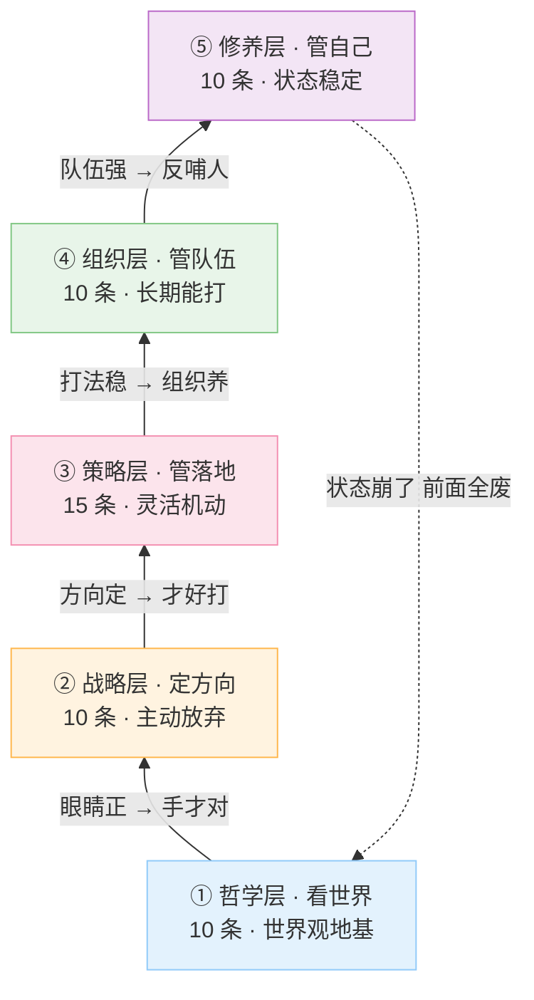
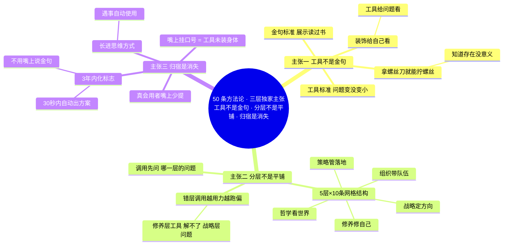
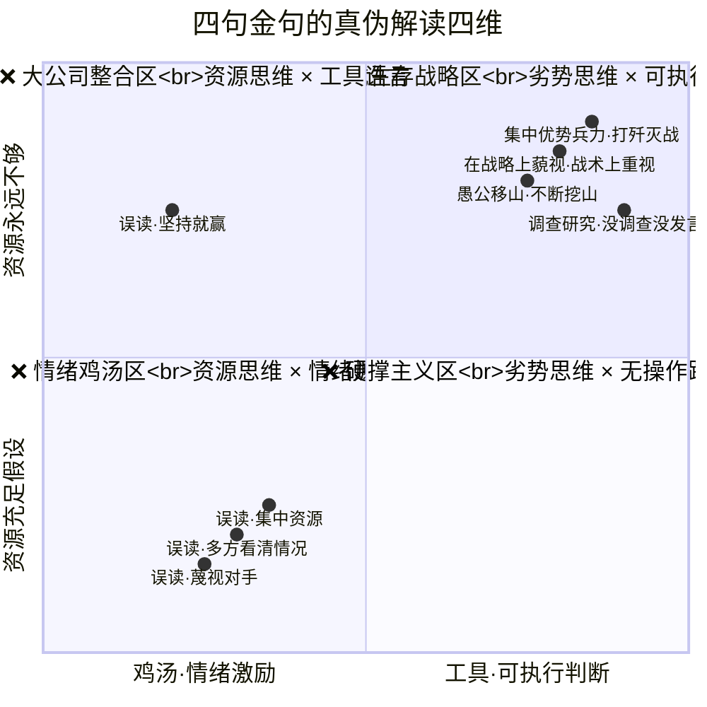
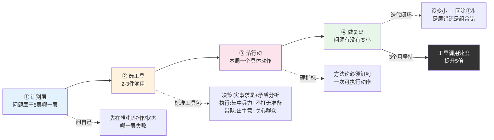
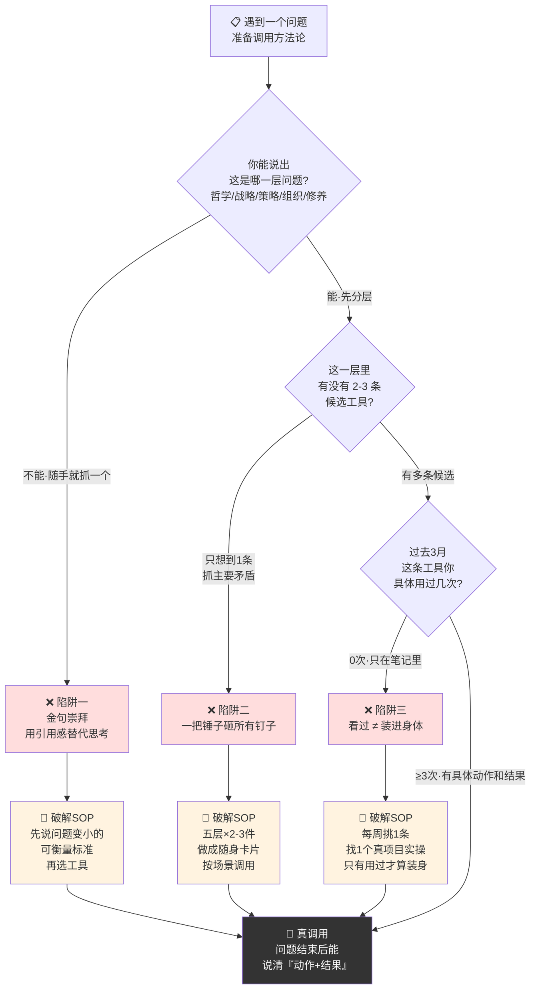
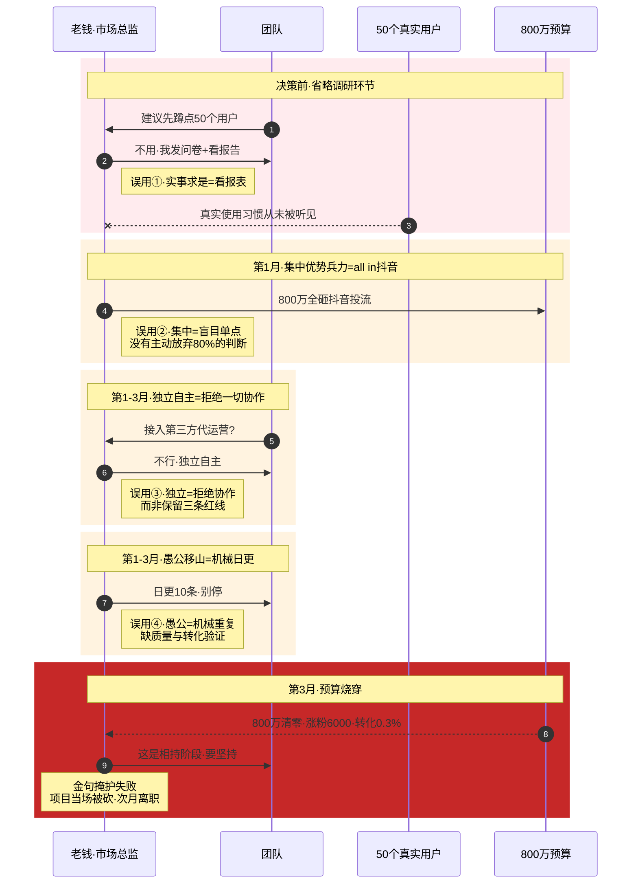
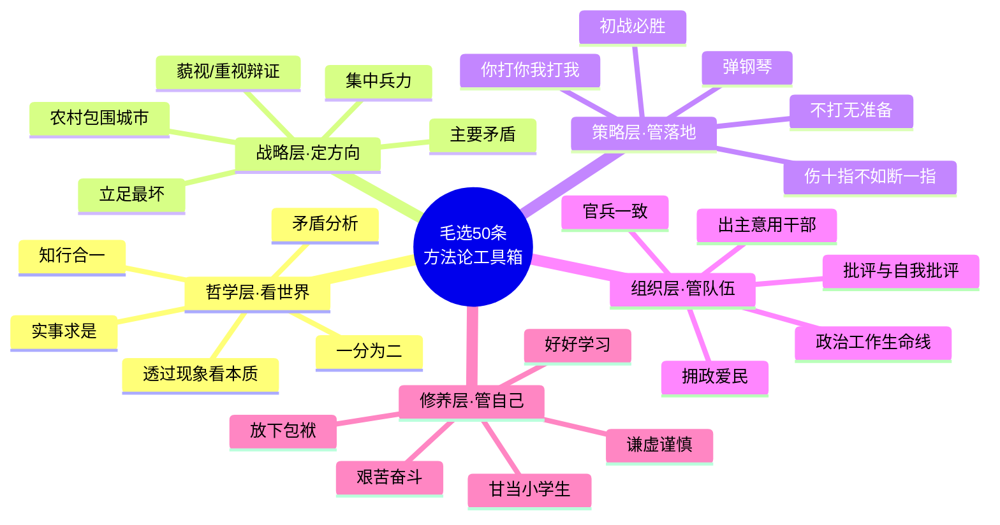

# 02.经典核心方法论

- 01.被同事翻白眼
- 02.市面误读之辨
- 03.工具箱的现场
- 04.原文四维精读
- 05.哲学思维基础
- 06.战略制定规划
- 07.策略执行实践
- 08.组织建设艺术
- 09.个人修养成长
- 10.方法论工具箱
- 11.三个认知陷阱
- 12.现实映射矩阵
- 13.一个反面教材
- 14.三年认知复利
- 15.收束三句金言

## 01.被同事翻白眼

去年读完《矛盾论》，我一度陷入理论亢奋。周会、评审、排期、绩效沟通，张口闭口都是“抓主要矛盾”。不到两周，同事闻声无感，技术 Leader 直接点破：“你总说抓矛盾，但当下具体矛盾到底是什么？”我当场愣住，能背出矛盾的普遍性与特殊性，却指不出当下项目的主要矛盾。**一句普适金句，代替了真正的具体判断。**

复盘下来我犯了三个典型错误：**一是把金句当万能开场白**，逢会就甩口号，从不点明具体矛盾是什么；**二是把“读过理论”等同于“想清问题”**，读过书不代表对当下场景的判断就正确；**三是把方法论变成自我表演**，只顾自我满足，不解决实际问题。同事的反感，本质是听出了我在用书本话术掩饰自己根本没想透。

痛定思痛，我花了一个周末，把毛选高频的 50 个核心方法论梳理成对照笔记，按“核心思想 + 适用场景 + 落地用法”逐条拆解，逼自己说清每一条的实战价值。梳理完我彻底通透：**方法论不是用来背的金句，是解决问题的工具箱**；“抓主要矛盾”的意义也从不是口头标榜，而是从一堆待办里精准筛出那个最高优先级的问题。

更关键的是，这 50 个方法论并非零散堆砌，而是有清晰的五层结构：**哲学层、战略层、策略层、组织层、修养层**。底层支撑上层、上层调度底层——就像开发工具链各有分工，按序调度才能发挥最大效用。

## 02.市面误读之辨

市面上讲毛选方法论的书和视频，常见三种错误用法：**第一种**，“要抓主要矛盾”，脱离场景的金句堆砌；**第二种**，“实事求是地说，我觉得……”，把方法论当口头禅；**第三种**，“毛主席说要群众路线”，用毛主席的名字代替自己的判断。

它们让讲的人显得有学问，却不解决任何具体问题。为什么这种用法最流行？因为它**最不需要思考**。引一句金句、念一个名词，就完成了“展示自己读过书”的全部任务，不需要真懂这个方法论的应用场景、判断标准、配套动作。这种“伪应用”是最廉价的优越感来源。

我想讲的方法论用法完全不同：

**第一，方法论是工具，不是金句**。工具的意义不在于“知道它存在”，而在于“什么时候拿出来用、怎么用、用完用得对不对”。一把螺丝刀放在工具箱里没意义，你必须知道遇到螺丝时拿出它、并且能拧得动。**金句和工具的差别，在于“能不能解决具体问题”**。

**第二，方法论之间是分层的，不是平铺的**。50 条方法论不是 50 个独立金句，而是 5 层 × 10 条的网格结构：哲学层看世界、战略层定方向、策略层选打法、组织层带队伍、修养层修自己。**调用工具时必须先识别“这是哪一层的问题”**，不然你会拿“修养层”的工具去解“战略层”的问题，越用力越跑偏。

**第三，方法论的最终归宿是“消失”**。真正会用方法论的人嘴上反而很少提它，因为它已经长进了思维方式里，遇事自动就用了、不需要每次“调用”。**还在嘴上挂着“抓主要矛盾”的人，本质上是工具还没装进身体里**。

## 03.工具箱的现场

毛选里这 50 个方法论不是毛主席坐在书房里冥想出来的。**它们每一条背后都对应一段具体的失败和代价**。

举几个例子，**“集中优势兵力，各个歼灭敌人”**，是 1947 年解放战争初期敌强我弱、毛主席总结出的“以一当十就死、以十当一就活”的血的教训；**“批评与自我批评”**，是 1929 年古田会议前红军内部派系撕裂、几乎散架时摸出来的；**“调查研究”**，是 1930 年毛主席在江西寻乌县蹲了 20 天、亲自记账才意识到“再不调查就被本本主义害死”。

每一个金句下面都压着一段历史的血。**这是它们至今管用的唯一原因**，它们不是设计出来的，是在错误中淬出来的。

理解这一点，方法论的性质就立刻清晰了：它们是**工具**，不是**装饰**。工具的标准只有一个：**能不能解决具体问题**。装饰的标准是“看起来有学问”，讲出来要漂亮、要有出处、要让对方觉得你读过书；工具的标准是“用完之后问题有没有变小”，你用“集中优势兵力”做了一次资源配置，这周项目的关键节点有没有真的被推进？没有，那这次“用”就没用过；用了，那才叫真用。**装饰是给自己看的，工具是给问题看的**。两种用法的差别，决定了你是进步还是原地表演。

毛选原书里方法论级别的句子远不止 50 个，保守估计在 200 条以上。我为什么只挑这 50 条？**筛选标准只有一个：“能跨场景使用”**。那些只在“打仗”或“农村工作”等具体场景下管用的金句，无论当时多重要都不入选；只有那些剥离了具体场景、能直接迁移到今天职场 / 创业 / 管理 / 个人成长的方法论，才入选。

## 04.原文四维精读

这是全篇最硬核的一节。我从字眼、历史现场、内在张力、反共识四个维度，拆解毛选核心方法论，**集中优势兵力，各个歼灭敌人**。

> 原文出自 1946 年《集中优势兵力，各个歼灭敌人》：“每战集中绝对优势兵力（两倍、三倍、四倍，有时甚至是五倍或六倍于敌之兵力），四面包围敌人，力求全歼，不使漏网。”

**一、字眼：两个被低估的关键字**

先看“**绝对**”二字。不是相对优势、略占优势，是绝对优势，还精确锚定了两倍至六倍的数字标准。这种量化要求在毛选里极为少见，本质是给执行层划硬红线，一线指挥员很容易自行打折扣，若只泛谈“集中优势”，有人会把 1.2 倍兵力也算达标，最终招致失败。数字钉死，就是明确规则：**少于两倍，不准开战**。

再看“**歼灭**”。不是击溃、打退、赶走，是彻底消灭。击溃的敌人会卷土重来，歼灭的敌人永久消失，二者的战略后果天差地别。

**二、现场：劣势者的生存法则**

这条原则写于 1946 年 9 月，解放战争仅开打四个月，国共兵力对比 3.4:1，我方整体处于绝对劣势。常人的本能反应是分兵守地盘，结果只会处处失守。毛主席的思路恰恰相反，**整体我是 1:3，但每一仗我都要打成 3:1**。实现的核心是主动放弃地盘，不贪多线防守，集中兵力专攻一处；打完即刻转移，下一仗再复刻局部绝对优势，用空间换时间、用整体劣势换局部胜势。

还原这个现场就会明白：它从来不是单纯的打仗技巧，而是**长期资源劣势者的生存策略**，创业者、职场新人、直面巨头的小团队，本质都身处这种“整体 1:3”的局面。

**三、张力：反向咬合的底层逻辑**

这句话内部藏着一层天然矛盾：“集中”要求把力量捏成拳头专攻一点，“各个”要求分头应对多个目标，二者看似无法共存。毛主席的解法是，**时间上分开，空间上集中**。同一时刻只打一个目标，通过时间差逐个击破，最终解决全部问题；用时间的先后顺序，消解空间上的分散压力。

毛选里这类“反向概念咬合”的结构反复出现：战略上藐视与战术上重视、放手发动与严格指导、既统一又独立。这不是修辞技巧，是一种世界观，**真正有效的方法永远诞生在两股反向力的平衡点上，走极端的方法从来都是次品**。

**四、反共识：不是整合，是取舍**

市面上常把这句话解读成“要把资源集中起来用”，这是彻底的误读。“集中资源”是**资源思维**，默认资源总量充足、问题只在有没有整合到一起；而“集中优势兵力”是**劣势思维**，前提是资源永远不够、必须主动放弃多数目标、只聚焦单点、人为制造局部优势。

比如做产品：前者是市场、研发、运营多部门合力出击，是力量整合；后者是主动放弃 80% 的市场、功能与用户，把全部力量压在 20% 的细分赛道上做到数倍于对手的优势，是主动取舍。前者是大公司的常规玩法，后者是小团队的生存活路。这就是鸡汤式解读和真正的生死战略的本质区别。

四句金句原文四维精读象限（横=解读方向 纵=资源前提）：

**图眼**：四句金句原本全部落在**第一象限（工具×劣势思维）**——毛的历史前提是资源永远不够、必须放弃多数目标制造局部优势。市面误读把它们全拽到第二、三、四象限——**要么改成资源充足的整合语言，要么剥离操作路径变成情绪鸡汤，要么保留劣势姿态但抽掉工具骨架**。判断你是不是在真读毛：**引用这些话时，你能不能同时说出下一步的具体动作？** 说不出，你就在鸡汤区。

## 05.哲学思维基础

**这一层是地基**。地基没打好，上面四层全是空中楼阁。哲学思维是世界观，决定你**用什么眼睛看世界**；后面四层是方法论，决定你**用什么手做事**。眼睛错了，手再勤也是白做。这一层的十条工具是：

**① 实事求是**，从客观实际出发探求内在规律，反对主观主义。它是科学决策的基石，一切工作从事实和数据出发。

**② 矛盾分析**，事物发展的根本动力在内部矛盾，要区分主次矛盾和矛盾的主次方面。它是分析复杂问题的核心工具，抓住关键、避免“一刀切”。

**③ 一分为二**，全面辩证看事物，看到积极与消极、成绩与缺点两面。它培养批判性思维，避免片面化和极端化。

**④ 实践论**，认识来源于实践并随实践发展而深化，实践是检验真理的唯一标准。它强调“干中学”，方案要在行动中检验和迭代。

**⑤ 没有调查没有发言权**，决策必须建立在周密系统的调查研究基础上。它反对“拍脑袋”决策，是用户调研、市场分析的根本原则。

**⑥ 从群众中来到群众中去**，将群众分散的意见集中起来化为系统政策，再回到群众中实践检验。这是民主决策、产品迭代、政策制定的核心循环。

**⑦ 物质决定意识**，社会存在决定社会意识，经济基础决定上层建筑。它提醒你分析问题要关注背后的物质利益和经济动因。

**⑧ 主观能动性**，在尊重客观规律的前提下充分发挥人的主动性和创造性。它激发个人和团队的潜力，克服困难、创造可能。

**⑨ 知行统一**，认识（知）与实践（行）是辩证统一的，重在行动。它反对空谈，理论必须能指导实践。

**⑩ 透过现象看本质**，不被表面迷惑，深入分析内在联系和规律。在信息爆炸时代，它决定你的洞察力上限。

## 06.战略制定规划

**战略层的核心是“取舍”**。这一层十条方法论几乎全部围绕一个动作，**主动放弃**。集中优势兵力意味着放弃次要战场，统一战线意味着放弃打击中间力量，农村包围城市意味着放弃城市先入。**没有取舍能力的人做不了战略**。

**① 战略上藐视，战术上重视**，整体上树立必胜信念，具体操作上严肃周密。它是应对巨大挑战时的心态和行动指南：保持信心，细致工作。

**② 集中优势兵力，各个歼灭敌人**，全局劣势中于关键局部创造绝对优势，实现以少胜多。它是资源配置的核心原则：聚焦核心、重点突破。

**③ 统一战线**，团结一切可以团结的力量，分化孤立主要对手。它指导你建联盟、争多数、构建生态。

**④ 独立自主，自力更生**，把命运掌握在自己手里，依靠自身力量为基点。它是企业掌握核心技术、个人培养独立能力的根本要求。

**⑤ 波浪式前进**，发展是螺旋式上升、波浪式前进的过程，有起有伏。它教你正确看待周期与挫折，保持战略定力。

**⑥ 抓主要矛盾**，复杂事物中有多个矛盾，必有一个是起决定作用的。它让你优先解决制约全局的瓶颈，达到“纲举目张”的效果。

**⑦ 枪杆子里出政权**，革命的根本问题是政权，必须依靠坚强的武装。它强调核心实力和硬实力，可引申为掌握核心资源 / 技术。

**⑧ 农村包围城市**，敌强我弱下先占广阔农村积蓄力量，最后夺取城市。它是差异化竞争、开辟第二战场、从边缘颠覆市场的策略。

**⑨ 又联合又斗争**，统一战线中既讲合作也保持原则性斗争。它是处理合作伙伴关系的艺术：保持独立性与原则性。

**⑩ 三个世界划分**，对国际力量进行战略划分，明确依靠、团结、打击的对象。它是宏观环境分析、市场定位的框架性思维。

## 07.策略执行实践

**策略层的核心是“机动”**。战略定方向、策略管落地，**地形会变、对手会变、自己的状态也会变**，所以策略层的方法论几乎全部强调“灵活 / 调整 / 试点 / 敏捷”。一个好的执行者最重要的能力不是“按计划打”，而是**“打得住计划之外的变化”**。

**① 一般号召与个别指导**，普遍动员与深入一点的试点相结合，取经验后再推广。它是政策试点、MVP 测试的工作方法。

**② 弹钢琴**，工作要统筹兼顾、各方面协调有节奏。它要求管理者系统思维，平衡各方利益和工作重点。

**③ 解剖麻雀**，通过深入分析一个典型个案，了解普遍规律。它是深度案例研究、用户访谈、标杆分析法的精髓。

**④ 不打无准备之仗**，凡事预则立，充分准备是成功的前提。它强调项目规划、风险评估、资源准备。

**⑤ 机动灵活**，根据实际情况的变化及时调整策略战术。它要求你保持敏捷，适应变化，不僵化执行。

**⑥ 两条腿走路**，同时兼顾矛盾两方面，如工业和农业、中央和地方。它教你平衡发展、多手准备，不搞单打一。

**⑦ 伤其十指不如断其一指**，击溃十个师不如歼灭一个师。它要求你追求彻底、有结果，避免浅尝辄止。

**⑧ 愚公移山**，认定目标坚持不懈，子子孙孙无穷匮也。它强调恒心、毅力、长期主义。

**⑨ 蘑菇战术**，利用地形和群众条件与敌周旋、疲惫敌人。它是弱势方持久消耗、等待时机的策略。

**⑩ 你打你的我打我的**，掌握主动权、不被敌人牵着走，发挥自身优势。它是竞争策略核心：建立自己的游戏规则，在优势领域竞争。

**⑪ 先打分散孤立之敌，后打集中强大之敌**，选薄弱环节入手，积小胜为大胜，是市场切入策略。

**⑫ 力求全歼，不使漏网**，解决问题要彻底，不留后患，是危机处理原则。

**⑬ 初战必胜**，第一个战役的胜利影响全局士气，重视开局、集中资源确保首战告捷。

**⑭ 立足于最坏情况，争取最好结果**，做好困难准备的同时尽最大努力争取胜利，是风险管理基本原则。

**⑮ 针锋相对，寸土必争**，原则性问题上坚决斗争，维护核心利益，是谈判博弈中的决心与底线。

## 08.组织建设艺术

**组织层的核心是“持续”**。战略和策略都管“打一仗”，组织管的是“长期能打”，**怎么让一群人三年、五年、十年地能持续作战**。这一层最容易被技术型管理者忽视，因为它的回报周期长、不立竿见影。但**所有最后崩盘的团队都是死在组织层**，不是死在战略层。

**① 批评与自我批评**，定期反思、揭露错误、澄清思想，是组织自我革新的武器。它建立团队复盘文化，营造坦诚沟通氛围。

**② 从团结的愿望出发**，批评的目的是“惩前毖后、治病救人”，不是打击。它决定绩效反馈和团队沟通的建设性态度。

**③ 关心群众生活**，解决群众的切身问题（柴米油盐）才能赢得拥护。它要求管理者关心团队成员的实际需求和福祉，这是领导力的基础。

**④ 出主意，用干部**，领导者的责任是制定战略（出主意）+ 选贤任能（用干部）。它要求高层聚焦战略决策和人才选拔，做到知人善任。

**⑤ 精兵简政**，机构精简、人员精干、提高效率、反对官僚主义。它追求组织扁平化、高效能，避免大企业病。

**⑥ 支部建在连上**，将组织建立在最基层，确保对队伍的绝对领导和凝聚力。它强化基层组织建设，确保战略在基层的有效执行。

**⑦ 政治工作是生命线**，思想建设和政治方向是组织生存发展的根本保证。它决定企业文化、价值观建设的战略地位。

**⑧ 拥干爱兵**，干部爱护士兵、士兵拥护干部，上下同心。它建立和谐上下级关系，提升团队凝聚力和战斗力。

**⑨ 劳武结合**，生产与战斗相结合，实现自我保障和持续斗争。它教企业追求商业价值与社会价值、短期收益与长期发展的平衡。

**⑩ 官兵一致**，政治上官兵平等、同甘共苦、废除特权。它建立平等尊重的组织文化，削弱官僚习气。

## 09.个人修养成长

**修养层的核心是“自己”**。前面四层都在管“做什么、怎么做”，这一层管“我自己是个什么状态”。**自己的状态崩了，前面所有方法论都用不出来**，焦虑的人抓不住主要矛盾，骄傲的人听不进反馈，浮躁的人做不了长期战略。这一层看起来最虚，实操中最硬。

**① 放下包袱，开动机器**，解除思想负担、轻装上阵、开动脑筋思考。它教你摆脱心理负担，保持开放心态。

**② 好好学习，天天向上**，持续学习不断进步。它倡导终身学习，个人和组织都要保持进化能力。

**③ 甘当小学生**，以谦虚态度向群众、向实践学习。它要求你保持空杯心态，不耻下问才能获真知。

**④ 艰苦奋斗**，保持勤劳节俭、不畏艰难的精神风貌。它培养坚韧不拔的意志品质。

**⑤ 谦虚谨慎，戒骄戒躁**，胜利时保持清醒防止骄傲自满。它是成功后的心态管理，避免因胜利犯战略性错误。

修养层的五条核心工具其实可以浓缩为一句话：**一切从实际出发（实事求是），用辩证发展的眼光看问题（矛盾分析），紧紧依靠实践和群众（从群众中来），集中力量解决主要矛盾，并在策略上保持高度的灵活性和主动性**。无论是制定国家战略、管理企业、领导团队，还是规划个人成长，深入理解并灵活运用这些历经考验的智慧，都能帮助我们更深刻地认识世界、更有效地解决问题。

## 10.方法论工具箱

把前面 50 条方法论收拢为四个可操作动作，这是把工具变成肌肉记忆的唯一方式。任何问题摆到你面前：

**第一步，识别它属于五层中的哪一层**。为什么必须先做这一步？因为用错层的工具是无效劳动。一个团队效率低，可能是哲学层（看问题方式不对）、可能是战略层（方向错了）、可能是策略层（打法低效）、可能是组织层（人没拧到一起）、可能是修养层（leader 自己心态崩了），五种诊断对应五种解法，**互不相通**！实操判断句：这个问题如果不解决，会先在“想”的层面失败、还是“打”的层面失败、还是“协作”的层面失败、还是“自己状态”的层面失败？找到那个最早失败的层，就是问题归属的那一层。

**第二步，从那一层里选两到三件工具**。为什么只能选两到三件？因为人类大脑同时调度三件以上工具就会精神过载。50 条方法论是工具箱，不是必须每次都用全套。真正的工具大师每次只拿两三件，刚好够解决眼前这个问题就行。具体怎么选？看场景：决策类问题用“实事求是 + 矛盾分析 + 透过现象看本质”；执行类问题用“集中优势兵力 + 不打无准备之仗 + 你打你的”；带团队问题用“出主意用干部 + 关心群众生活 + 批评与自我批评”。**不同场景的“工具组合包”是固定的，记住几个标准包，遇事直接调用**。

**第三步，选完工具之后立刻落到一个具体行动**。这一步是大多数人翻车的地方。很多人到第二步就停下来，“我已经分析清楚了”，然后回到原来的工作中继续按老办法做。**没落到行动的方法论调用都是空转**。具体怎么做？给自己一道指令：**这周之内必须有一个具体动作和这次的方法论挂钩**。比如你判断“主要矛盾是组织层的信任问题”，那这周必须做一次“和团队核心三人的深谈”，把方法论钉到一次具体行动上，否则就当这次没用过。

**第四步，行动完成后必须复盘“这次工具用得对不对”**。复盘的标准只有一个：问题有没有变小？变小了，说明工具选对了；没变小，必须重回第一步，是不是层识别错了？是不是工具组合错了？是不是行动太轻？很多人跳过复盘，觉得“用过就是用过了”。**没复盘的工具调用不会进化**。每次复盘都让你下一次的工具识别更准、组合更优、行动更狠。**三个月坚持复盘，你的工具调用速度会快 5 倍**。

四步走完，识别层、选工具、落行动、做复盘，一个复杂问题被压缩成一次精确的工具调用。**真正的高手不是知道工具多，是调用速度快**。

四步 SOP 一图带走：

## 11.三个认知陷阱

知道了 50 条方法论，不代表能用 50 条方法论。真正踩坑的地方在这三处：

**第一个陷阱，把方法论挂在嘴上当口号用**。我自己就犯过，周会上一句“要抓主要矛盾”成了开场白。口号化的方法论不仅没用还有反作用，同事会开始反感、自己会停止思考、整个组织会形成“嘴上说一套、手上做一套”的虚伪文化。识别方法：**问自己，过去一周里你嘴上提过的方法论，有没有任何一次真的指导了具体行动？** 如果答案是“没有”，那你就是在用口号、不是在用工具。

**第二个陷阱，所有问题都用同一个工具**。很多人读完毛选只记住了一句“抓主要矛盾”，于是所有问题都用它解，团队问题抓主要矛盾、产品问题抓主要矛盾、个人成长问题抓主要矛盾。**这就是“一把锤子砸所有钉子”**，砸到螺丝时它没用、砸到玻璃时它会把事情搞砸。正确的做法是，**记住五层、记住每层的两到三件代表工具、按场景调用**。这样你的工具箱才是真正的工具箱，不是只有一把锤子的演员。

**第三个陷阱，学了一堆工具，从不实操**。这是最隐蔽的陷阱，你以为自己懂了，其实只是看过。看过和懂了的差别，就是用没用。**没用过的工具不是你的工具**，它在书里、在你的笔记里、在你引用的金句里，但不在你的肌肉里。识别方法：**回想过去三个月，你具体用过 50 条方法论里的哪几条？每条用在了什么具体动作上？结果如何？** 如果你答不出“具体动作和结果”，那这个方法论你就还没装进身体。

三陷阱决策树——每次调用方法论前的自检 SOP：

**图眼**：三陷阱的共同基因是**用“知道”替代“用过”**——用引用感替代分层思考、用单一工具替代场景匹配、用笔记本收藏替代肌肉记忆。**唯一破解是用**——不是读第二遍、不是抄第三遍、是在真项目里出一次错、修一次、再出一次错、再修一次。工具是被磨出来的，不是被记出来的。

## 12.现实映射矩阵

为了让方法论真正落地，我做了一张矩阵，五层方法论在四种典型场景下的标准调用包：

**个人成长**这一行，哲学抓“实事求是”，战略抓“主要矛盾”，策略“立足最坏”，组织层暂时按下不表，修养层保持“谦虚谨慎”。**团队管理**这一行，哲学是“矛盾分析”，战略是“藐视对手/重视对手”的辩证切换，策略是“弹钢琴”般同时抓多个协作面，组织上“用好干部”，修养上要能“放下包袱”。**商业竞争**这一行，哲学“透过现象看本质”，战略“集中兵力打歼灭战”，策略“你打你的、我打我的”，组织抓“政治工作”（愿景与文化），修养保持“艰苦奋斗”。**创业从零**这一行，哲学“没有调查就没有发言权”，战略走“农村包围城市”的边缘切入，策略“不打无准备之仗”，组织上“关心群众生活”（团队与用户），修养“甘当小学生”。

**这张表的意义不在于填表，而在于你永远要先问“我现在在哪一行”**。识别清楚行，五件工具的调用顺序就立刻浮现。这比临时回忆 50 条名词高效 100 倍。

## 13.一个反面教材

再看一个反面切片：错把金句当方法，只会把好项目彻底做砸。

2021 年我认识一位市场总监老钱，自称读完毛选三卷，开会张口就是金句。他操盘新品牌冷启动，手握 800 万预算，拿“集中优势兵力”全砸抖音投流，拿“统一战线”找了三位 KOL 合作，拿“独立自主”拒绝第三方代运营，拿“愚公移山”坚持日更 10 条视频。

三个月预算花光，品牌仅涨粉 6000，转化率 0.3%。复盘时他还拿“这是相持阶段，要坚持”搪塞，项目当场被砍，他次月便离职。

后来喝酒聊起，他仍不解：“我每个动作都有方法论支撑啊。”我反问：“做决策前，你有没有花一周沉到 50 个目标用户身边，当面聊聊、看看他们真实的使用习惯？”他愣了很久：“没有，但我做了用户问卷，这不就是实事求是吗？”

这个案例的核心启示，从来不是“用错了方法论”，而是两个底层误区。

**一是金句替代不了具体判断。** 老钱每个决策都套着方法论名头，实则全是误用：集中优势兵力不是盲目 all in，独立自主不是拒绝一切协作，愚公移山也不是机械重复，统一战线更不是凑几个 KOL。金句是凝练的结论，落地需要结合场景的完整判断过程——**结论永远顶替不了过程**。

**二是流于表面的调研，恰恰是实事求是的反面。** 老钱以为发问卷、看报告就是求真，但真正的“求”是亲自蹲点、亲眼观察、亲口交谈。**隔着报表的“研究”，本质都是伪研究**。

老钱 3 个月 800 万预算烧穿时序图——四句金句四种误用：

**图眼**：4 处金句都装着方法论的名头，实则**每一处都抽掉了原文的操作前提**——集中优势兵力抽掉了“主动放弃 80%”、独立自主抽掉了“三条红线”、愚公移山抽掉了“质量校准”、实事求是抽掉了“亲自蹲点”。**金句是结论，不是过程；用结论替代过程，就是把方法论穿在了失败上**。

## 14.三年认知复利

整理完这张表的周一，我把“抓主要矛盾”从“演讲口号”变成“**决策 checklist**”。项目 10 个待办，我问自己：**哪一个不解决，其他 9 个都白干？** 选出来的就是主要矛盾，其余 9 个全部延后。那一周项目进度比之前两周加起来还多。

最深的感受是，**头脑里的“金句焦虑”突然消失了**。以前我开会前总担心“今天该引哪句话才显得有水平”，那一周开始我完全不再想“引什么”、只想“用什么”，心理负担少了一半，决策速度反而快了一倍。

一个月内我把 50 个方法论按**使用场景**重新编了组，**做判断时用**：实事求是、透过现象看本质、一分为二；**定方向时用**：抓主要矛盾、战略上藐视战术上重视、立足最坏情况争取最好结果；**配资源时用**：集中优势兵力、伤其十指不如断其一指、弹钢琴；**带团队时用**：出主意用干部、关心群众生活、批评与自我批评；**调心态时用**：放下包袱开动机器、愚公移山、谦虚谨慎。

不再“一个方法论打天下”，而是**对症下药**。同事再也没翻过白眼。更有意思的是，我嘴上引用毛选反而变少了，但同事开始反过来问我：“你最近做决策的逻辑是什么，能给我们讲讲吗？” **方法论从我“输出的内容”变成了“输出的方式”**。

半年过去，我发现我越来越少**嘴上**引用毛选了，但**脑子里**越来越像毛选。遇到复杂问题，我的第一反应不再是“我该引用哪句话装逼”，而是四问自答，主要矛盾是什么？我手里有哪些可调度的力量？能不能在局部形成绝对优势？最坏情况是什么、能兜住吗？这些问题在脑子里只要 10 秒钟过一遍，判断就出来了。**方法论最好的归宿，不是挂在嘴上，而是长进思维里**。

三年之后，我形成了一套几乎条件反射的工具调用，**任何复杂问题摆在面前，我大脑自动先识别“哪一层”，然后从那一层抽两到三件工具，直接出方案**。整个过程不超过 30 秒，而且不用嘴上说一个金句。

## 15.收束三句金言

**毛选的 50 个方法论不是金句合集，而是一个“按场景调用”的思维工具箱**，这是整张表留给我最硬的一句。

全书 50 条方法论按五层归类的知识地图，一张图带走：

**1. 哲学是根、战略是干、策略是枝、组织是叶、修养是果**，五层方法论形成完整生态，缺一不可。

**2. 方法论要“对症下药”**，不同问题调不同工具，避免“一个锤子砸所有钉子”。

**3. 内化比炫耀更重要**，嘴上讲得再多都不如脑子里自动运行一次。

**一句留给你的反问**：你过去一周嘴上引用过的方法论里，**有几条真的指导了你的具体行动**？如果一条都没有，先别学新工具，你现在缺的不是知识，是把已知的工具装进身体。
