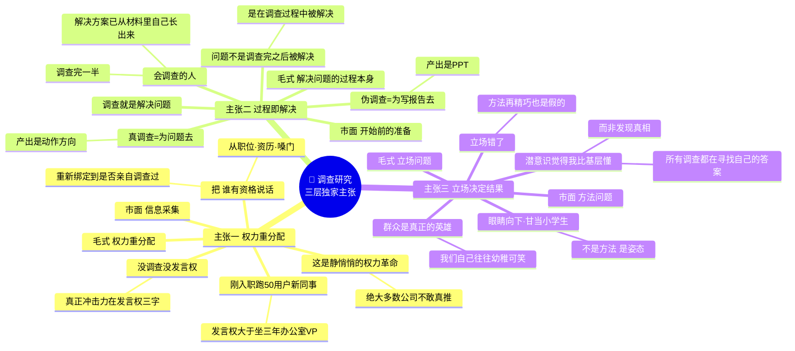
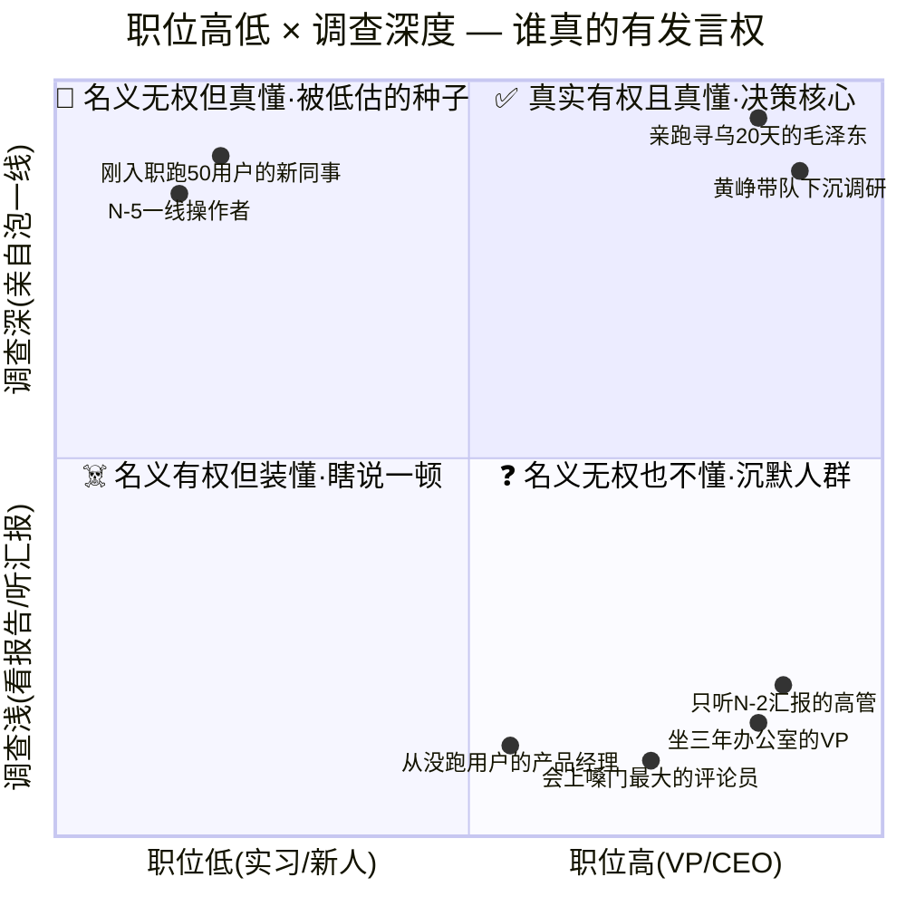
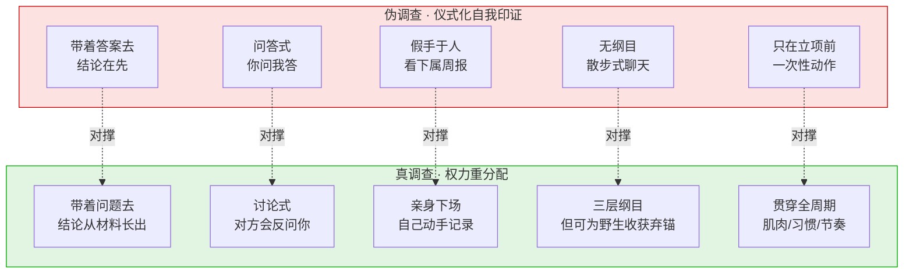
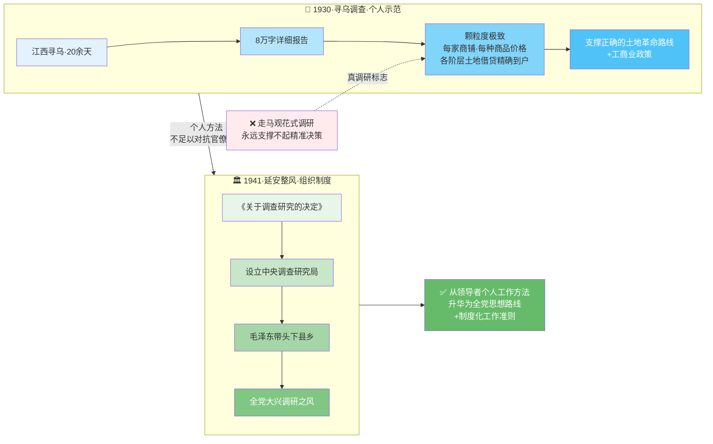
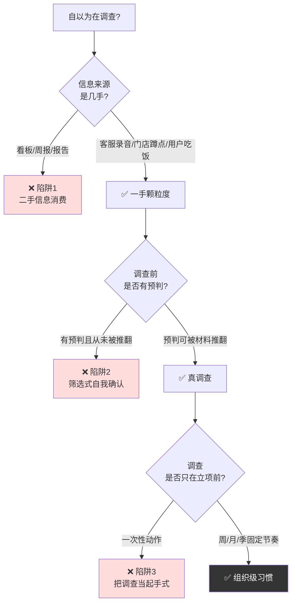
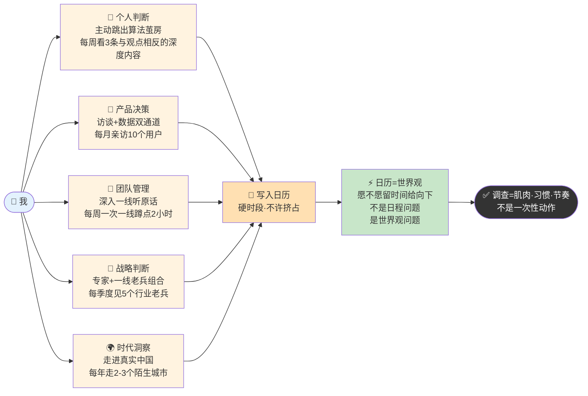

# 09.调查研究的功夫

- 01.拍脑袋的爆款
- 02.市面误读之辨
- 03.三层独家主张
- 04.文本四大现场
- 05.发言权之追问
- 06.调查就是解决
- 07.三个技术动作
- 08.立场决定态度
- 09.两份硬核案例
- 10.三个认知陷阱
- 11.现实映射矩阵
- 12.一个商业切片
- 13.眼睛向下三难
- 14.三年认知复利
- 15.收束三句金言

## 01.拍脑袋的爆款

去年我接手一个C端App社区打卡功能需求，产品只一句“打卡类应用正火，我们也要做”，我没深究便直接开工。

两周里我打磨交互、敲定技术方案，脑补了多类用户场景，PRD改了四版，在设计细节和技术实现上反复拉扯，满心等着上线后跑出爆款数据。结果上线次日数据惨淡：DAU渗透率仅0.7%，三日留存跌到3%。一条用户评论直击要害：“这功能到底给谁用的？找了半天都没找到入口。”

我这才惊觉：从立项到上线，我没访谈过一位真实用户，没看过一份行为数据，没分析过竞品的核心逻辑，所有判断全是坐在工位上凭空拍板。

当晚我翻到存了很久的《反对本本主义》，开篇那句“没有调查，没有发言权”瞬间点醒了我。我并非能力不足，而是在毫无调研的前提下，全程凭着主观认知写方案、做决策、定方向，每一步都在“发言”，却没有半点现实依据作支撑。

读完相关内容后，第二天我便向老板申请推倒重来：先完成20份用户访谈、落地真实用户数据分析，再讨论功能是否值得做、该怎么做。

## 02.市面误读之辨

今天一说"调查观"，大多数人的第一反应是，**啊，就是做做用户访谈、发发问卷**。这是把毛泽东的调查观**降维成了技能**，丢掉了它真正的灵魂。

把调查讲成"用户调研技巧"是市面书最爱做的事。原因很简单，讲技巧最安全：教你怎么写访谈提纲、怎么设计问卷、怎么做归类编码，读者觉得很实用，作者也不需要触碰任何深层的组织和权力问题。

**但这种讲法最大的问题是**，**它把一个本来挑战权力结构的思想，变成了一个温顺的工具包**。学了这套工具的人，可以在不挑战任何既有秩序的前提下，"做了用户调研"，而毛泽东的调查观，本质上就是用来挑战秩序的。

市面上的讲法把调查当成"**信息采集**"，而毛泽东讲的调查是"**权力重分配**"。"没有调查，没有发言权"这句话的真正冲击力不在"调查"上，而在"**发言权**"上，它把一个组织里"谁有资格说话"这件事，从职位、从资历、从嗓门，重新绑定到**是否亲自调查过**。这是一套**权力结构**，不是一个技能动作。

## 03.三层独家主张

这一篇我想讲三层在市面书里几乎看不到的东西：

第一层，**它把调查当成"信息采集"，而毛泽东讲的调查是"权力重分配"**。一旦你真信"没调查就没发言权"这句话，你在组织里的权力地图会立刻被重画，会上嗓门最大的那个人，如果三个月没接触过一线，他的发言就该被打折扣；刚入职但天天泡用户的实习生，他的判断就该被认真听。**这是一场静悄悄的权力革命**，绝大多数公司不敢真推。

第二层，**它把调查当成"开始前的准备动作"，而毛泽东讲的调查是"解决问题的过程本身"**。毛泽东说"调查就是解决问题"，这句话如果你真的读进去，会发现它在重塑一种工作观：**问题不是在"调查完之后"被解决的，而是"在调查的过程中"被解决的**。会调查的人，调查完一半，解决方案已经从材料里自己长出来了。

第三层，**它把调查当成"方法问题"，而毛泽东讲的是"立场问题"**。毛泽东反复强调"**眼睛向下**""**甘当小学生**"，这不是方法，是姿态。一个领导者在潜意识里觉得"我比基层懂"的时候，他做的所有调查都是在**寻找自己的答案**，而不是**发现真相**。**立场错了，方法再精巧也是假的**。

所以这一篇要讲的调查观，是这三层在市面书里几乎看不到的东西：**权力的重分配、过程即解决、立场决定结果**。

三层独家主张思维图（权力重分配 · 过程即解决 · 立场决定结果）：

## 04.文本四大现场

1930年的《调查工作》（后定名《反对本本主义》），是这一思想最集中的阐述，核心要义可归纳为四点：

其一，**立根本原则**。提出“没有调查，没有发言权”的著名论断，直指对问题的现实与历史毫无了解的发言本质是瞎说一顿；将脱离实际的粗枝大叶作风上升到主观主义学风高度批判，点明其根本性危害。

其二，**明调查本质**。提出“调查就是解决问题”，以“十月怀胎，一朝分娩”作比，说明调查是主动深入实践、获取真实感性材料的根本途径，所有问题的解决都必须建立在充分调研的基础上。

其三，**破教条误区**。强调马克思主义的“本本”必须结合中国实际，纠正本本主义、教条主义的唯一方法，就是面向真实情况开展调查。

其四，**正调研姿态**。调研必须抱有“眼睛向下”的决心，以恭谨平等的态度深入一线；浮在表面、居高临下永远摸不到实情，也找不出事物的内在规律。

这一思想的最终指向，是从客观实际出发提炼事物固有的联系与规律，以此作为行动的根本向导。

## 05.发言权之追问

**原文（《反对本本主义》，1930年）**："你对于某个问题没有调查，就停止你对于某个问题的发言权。这不太野蛮了吗？一点也不野蛮。你对那个问题的现实情况和历史情况既然没有调查，不知底里，对于那个问题的发言便一定是瞎说一顿。"

这段话的杀伤力，值得逐字拆解。今天我们默认"职位越高，发言权越大"，大老板拍板，小兵闭嘴。但毛泽东直接把这个默认规则砸碎：**发言权不是岗位给的，也不是职称给的，是调查给的**。

一个刚入职三个月、但跑了 50 个用户的新同事，**比一个坐了三年办公室却没见过真实用户的 VP，发言权更大**。这不是情绪，这是毛泽东的标准。

**这一条让很多组织不敢真正推行**。因为一旦真的照这个标准执行，公司里很多"发言权最大"的人会突然失去发言权。但正因为如此，这一条才是毛泽东最革命的洞察之一。

毛泽东自己抛出一个挑衅，**剥夺没调查过的人的发言权，不是太野蛮了吗？然后他自己答：一点也不野蛮**。这个问答的本质是，**组织里最致命的"不公平"不是剥夺发言权，而是让没调查过的人继续发言**。因为没调查的发言必然是"瞎说一顿"，而瞎说的代价是整个组织来付：错误的决策、浪费的资源、被误导的团队。

人的主观思想要正确地反映客观实际，唯一的通道就是调查。调查缺失，主观就和客观脱钩，必然陷入主观主义（唯心主义）。

**这一条在今天有一个新名字叫"信息茧房"**，人不出门、只刷推荐算法、只看支持自己观点的内容，主观和客观的距离越拉越大。**毛泽东的调查观在信息时代的价值反而更高**，因为今天你不主动去调查，你就一定活在算法给你筑造的茧房里。

## 06.调查就是解决

**原文**："调查就像'十月怀胎'，解决问题就像'一朝分娩'。调查就是解决问题。一切结论产生于调查情况的末尾，而不是在它的先头。"

这一段值得特别拆，因为它颠覆了今天大多数人的工作方式。"十月怀胎"这个比喻是在告诉你，**调查是有一个酝酿周期的**。你不能调查三天就指望出结论，也不能把调查压缩成一次会议、一份报告。它需要**反复、沉淀、消化**。

今天的互联网节奏把调查的酝酿期不断压缩，老板要"三天出结论"、要"明天就汇报"。这种节奏下做出来的调查，必然是"**七个月早产**"，看似有结果，实际上不成熟。

**调查的终极目的不是"了解情况"，是"解决问题"**。这一条是识别"真调查"和"伪调查"的分界线，真调查：你带着一个具体问题去，调查完这个问题有一个动作方向。伪调查：你为了写一份报告去，调查完你有了一份 PPT。大多数组织里的"调研"都是后者。他们不是在解决问题，他们是在**生产交付物**。

"一切结论产生于调查情况的末尾，而不是在它的先头。" 这句话是对 **"带着答案去调查"**的致命一击。

今天最常见的工作方式是：老板心里已经有一个答案，他让下属去调查，下属做出一份"印证老板想法"的报告。**这种调查是反向的**，结论在先、材料在后、材料被筛选来支持结论。毛泽东直接把这种调查定性为"瞎说一顿"，因为它根本不是调查，是**仪式化的自我印证**。

**真调查的前提，是你不知道答案**。你得抱着空杯去，让结论从材料里自己长出来。这件事很难，难就难在，大多数人潜意识里都**害怕调查的结果会推翻自己**。

## 07.三个技术动作

毛泽东不仅讲原则，还给了一整套具体、可操作的方法。这一节给你最具操作性的工具箱。

1.调查会应该是"**讨论式**"的，而非"**问答式**"的。这意味着调查者要和被调查者**平等互动、思想碰撞**，而不是"我问你答、我写你回答"。

**为什么这一字之差这么重要**，问答式调查里，调查者站在"评估者"的位置，被调查者站在"被审视者"的位置。这种姿态下，被调查者会本能地启动"自我保护机制"，只说安全的话、只说你想听的话、只说官方话术。**你拿到的不是真实，是表演**。

讨论式调查则把双方拉到同一张桌子上，你不是来"考核"他，是来"和他一起想这个问题"。这一刻被调查者的角色立刻从"被审视者"切换为"协同思考者"，他会从"我说什么对自己安全"切换到"这个问题真实的答案是什么"。**两种姿态产出的信息密度差 10 倍**。

**一个细节检验**：你的调查对话里，有没有出现**对方反问你、两个人一起想问题**的时刻？如果没有，你做的不是调查，是问卷录入。**对方一旦开始反问你，"那你觉得这个问题应该怎么破？"，这就是讨论式真正启动的信号**。这个信号没有出现，说明对方还在"应付模式"；这个信号出现了，说明你拿到的下一段对话才是金子。

**操作上的具体做法**，开场不要用"我来问你几个问题"，要用"我也在被这个问题困住，想找你一起聊聊"；中段每问完一个问题主动反问一次"我这样想对不对，你怎么看"；结尾不要用"谢谢配合"，要用"我们再约一次接着聊"，**这三个动作能让 80% 的对话从问答式翻转成讨论式**。

2.要有大纲，还要有细目。**没有纲目的调查是散步，有纲目的调查才是作战**。

**纲目的本质是什么**，它是你"上场前的假说图谱"。你不可能空着脑子去做调查，空着脑子去，你会被现场信息淹没、被对方思路带偏、最后回来满脑子杂音却抓不住任何有效结论。**纲目就是你出发前的"我准备验证哪些事"的清单**，这个清单越具体、越有层次，调查回来的产出越有价值。

一份合格的调查纲目应该有三层结构，**最上层是你要回答的核心问题**（一句话）；**中层是支撑这个核心问题的 3-5 个子问题**；**最下层是每个子问题对应的具体问法和数据要求**。这三层缺一层，调查现场就会乱。

但要注意，**纲目是起点不是终点**。你带着纲目去，但对方讲了纲目之外重要的东西，你要立刻转向。**最值钱的信息往往不在你的纲目里，它在对方的"题外话"里**。一个真正一线的人在你问"流程问题"时，可能突然抱怨"老板上周做的那个决定让我们全组都很懵"，这一句"题外话"可能比你纲目里所有问题加起来都重要。**你必须有能力立刻识别这种"金句"，扔掉纲目顺着这条线追下去**。

僵化地照着纲目走，你会错过真正重要的信息。**正确的姿态是，纲目放在脑子里当锚，但永远准备好为更重要的发现弃锚**。一份好的调查会，往往最后产出的洞见 50% 在纲目内、50% 是纲目外的"野生收获"，后者通常比前者更有杠杆。

3.**反对假手于人**。领导者必须"亲身"深入一线，"自己动手"做记录，**这样才能获得最真切、最一手的感受，避免信息失真**。

为什么不能让下属代劳？因为**信息经过一层转述，损失 30%；经过两层转述，就只剩不到一半了**。而且下属转述时会下意识过滤，把对自己不利的信息筛掉、把老板爱听的信息放大。**你听到的永远不是原声**。

所以任何一个真正重要的决策，**最后一公里必须自己走**。调查者必须抱有"**甘当小学生**"的真诚态度。如果摆出"钦差大臣"的架势，**群众就会敬而远之，知而不言，言而不尽**。

这里的核心不是"姿态要低"，而是**你要真的相信基层比你懂**。如果你心里其实觉得自己比他们懂，他们一眼就能看出来，然后你听到的就都是客套话。

## 08.立场决定态度

这一节单独拎出来讲，因为这是毛泽东调查观里**最深的一层**，也是市面解读最浅的一层。"群众是真正的英雄，而我们自己则往往是幼稚可笑的。"

这句话不是谦辞，是一个**认识论命题**，**真正的智慧蕴藏在具体的实践中，而实践发生在一线**。领导者离一线越远，离智慧就越远。

所以领导的作用不是"有智慧"，而是"**把群众分散的、无系统的意见集中起来，化为系统的意见，再回到群众中坚持下去**"。领导者是智慧的**组织者**，不是智慧的**来源**。

通过调查，领导者才能打破官僚主义的隔膜，真正了解一线的疾苦、情绪和要求，才能制定出符合实际的正确政策。

**长期脱离一线的干部，必然滋生官僚主义、主观主义，最终脱离真实**。这不是道德问题，是结构必然，**人的判断依赖于信息输入，信息一旦失真，判断必然跑偏**。今天的大公司病、大组织病，根子都在这里，**决策者离现实太远了**。

## 09.两份硬核案例

毛泽东的调查观在革命实践中锤炼成型，两个经典案例足以窥见其调研的实践深度与制度价值。

**1.寻乌调查：以极致颗粒度支撑精准决策**。1930年5月，毛泽东在江西寻乌开展20余天社会调查，形成8万余字的详细报告。调研颗粒度极高：县城每家商铺的名称、经营者与经营规模，各类商品的价格、产地、销量，以及农村各阶层的土地占有、借贷关系与家庭收支，均做到精确到户。

这份调研彻底摸清了当地城乡商业结构与阶级现状，为制定正确的土地革命路线与工商业政策提供了坚实的现实依据。真调研的标志是掌握具体细节与真实数据，而非空泛的总体判断。走马观花式的调研，永远支撑不起精准决策。

**2.延安整风：将调研升华为组织级工作制度**。延安整风以破除主观主义、教条主义为核心，调查研究是关键破局抓手。1941年党中央专门出台《关于调查研究的决定》，设立中央调查研究局；毛泽东带头深入县乡一线，调研边区经济、农民负担等实际问题，推动全党大兴调研之风。自此，调查研究从领导者的个人工作方法，正式升华为全党的思想路线与制度化工作准则。

调研不能仅停留在个人习惯层面，必须实现组织化、制度化，成为全员的工作共识与共同纪律，才能从根源上降低错误决策的概率。

## 10.三个认知陷阱

读了调查观的人很多，但大多数人的"调查"都落在这三个陷阱里：

**第一个误区是二手信息消费**。你每天看十份数据看板、二十份周报，觉得自己对业务了如指掌。**这不是调查，这是二手信息的消费**。数据看板是别人筛选过的；周报是别人措辞过的；报告是别人结论化的。**你看到的永远是别人希望你看到的版本**。真正的调查必须突破这层二手加工，亲自去客服听一次录音、亲自去门店蹲一天、亲自和用户吃一顿饭。**一手信息的颗粒度是报告给不了的**。

你心里其实已经有一个答案，然后去"调研"，调研的目的是**为自己的答案找证据**。这是最隐蔽也最普遍的陷阱。那么如何避免陷阱呢？你在调查前写下一个预判，然后问自己，**调查完后，有没有哪一条材料能推翻我这个预判**？如果没有，说明你的调查是"筛选式"的，不是真调查。

**第二个误区是筛选式自我确认**。真调查的标志，是你经常被自己的材料推翻。如果你调查十次，十次都印证了你原来的想法，那不是你直觉好，是你的调查被自我确认偏见污染了。很多团队把调查安排在"**项目立项前**"，立项完成后就再也不调查了。这是典型的把调查当"起手式"的误解。

**第三个误区是把调查当起手式**。毛泽东的调查是贯穿全过程的，**项目开始前要调查、项目中要调查、项目后也要调查**。因为条件在变，用户在变，市场在变，没有一次性完成的调查。**真正的调查型组织，是把调查嵌入到日常工作节奏里的**，每周必有一次"一线时间"、每月必有一次"用户访谈"、每季必有一次"行业摸底"。**调查是肌肉，是习惯，是节奏，不是一次性动作**。

## 11.现实映射矩阵

调查研究在五个维度上有不同形态。

**个人判断**层面，"调查"意味着亲自搜集一手信息，常见陷阱是被算法推荐喂养——只看到平台想让你看到的内容，落地动作是主动跳出信息茧房。

**产品决策**层面，"调查"是真实用户访谈叠加数据漏斗双通道，常见陷阱是只盯数据看板不见活人，落地动作是每月亲自访 10 个用户。

**团队管理**层面，"调查"是深入一线、听下属和一线员工的原话，常见陷阱是只看下属周报，落地动作是每周一次一线蹲点。

**战略判断**层面，"调查"是行业专家加一线老兵的组合信源，常见陷阱是只看研报和 PPT，落地动作是每季度见 5 个行业老兵。

**时代洞察**层面，"调查"是走进真实的中国，常见陷阱是活在精英叙事里，落地动作是每年走两三个陌生城市。

**矩阵的使用方法**，**挑你最薄弱的那一行，开始强制性地做**。大多数人薄弱的不是"知道要调查"，而是"真的跑起来"。

## 12.一个商业切片

拼多多早期能抓住阿里、京东都忽视的下沉市场，正是“眼睛向下”调研思路的典型商业实践。

2015年前后，国内电商的主流叙事是消费升级，阿里、京东的产品与运营均围绕一二线中产群体展开。黄峥没有盲从这一共识，而是带队深入下沉市场一线：走访县城集市、城乡小卖部、乡镇快递网点，摸到了主流调研从未覆盖的真实用户现状，低端手机装不下大体量App、用户没有主动搜索购物的习惯、消费决策多由熟人分享触发、对极致低价的敏感度远高于品牌。

这些一手发现直接定义了拼多多的产品形态：轻量化小程序入口、社交裂变玩法、极致低价策略，最终跑出了差异化的增长路径。

大厂并非没有做调研，而是困在既有用户圈层的信息茧房中，样本自带偏差，看不见“五环外”的真实需求。真正的调查从来不是坐在办公室看报告，而是放下预设、深入现场、倾听最原生的需求。调查本质是立场问题：你站在哪一群体的视角，就能看见哪一群体的真相。这家覆盖数亿用户的企业，正是一场彻底的“向下扎根”调研行动的产物。

## 13.眼睛向下三难

讲完正面，讲一个反面切片，为什么"眼睛向下"在今天的组织里会反复失败。今天的组织结构和信息结构都在反向奖励"**眼睛向上**"：**1.向上汇报的人获得晋升**，向下观察的人没人看见。**2.信息层层过滤**，到达决策者时已经失真。**3.一线员工自保心态强**，不敢向上说真话。

在这种结构里，**"眼睛向下"不是一个态度问题，是一个反人性的习惯**。你得有意识地、强制性地给自己安排"向下"的时间，亲自跑一次客服、亲自看一次用户录屏、亲自读一百条真实差评。不这样做，你就会慢慢失去对现实的感知，哪怕你自以为还在"管理"。

每个高管都会告诉自己"我和一线保持着联系"。这是**最危险的自我幻觉**，他口中的"一线"通常是 N-2 层级的中层经理，而不是 N-5 层级的真实操作者。

**检验方法**：让一个自称"接地气"的高管写下他过去一周里"亲自接触一线"的具体场景，见过谁、聊了多久、对方说了什么原话。十个里有九个写不出来，因为他所谓的"接触一线"其实是"听汇报"。

高管们最常见的辩解是"我没时间"。但仔细看他们的日历，开会、对齐、写邮件、应酬，**几乎所有时间都花在向上和平向**，没有一格留给向下。

**真相是**，不是没时间，是**潜意识里觉得"向下"不重要**。一个领导者愿不愿意在日历里强制留出"一线时间"，不是日程问题，是世界观问题。**他的日历就是他的世界观**。

## 14.三年认知复利

那周我立刻启动整改，做了三件事：筛选20位活跃、半活跃、流失用户做深度访谈，拉出90天用户行为漏斗拆解真实使用路径，全面拆解3款竞品的真实留存数据。三天后重写需求文档，砍掉六成功能与冗余用户路径，同时给自己定下铁规：所有主观判断必须匹配调研证据，评审结论必须附上访谈记录、数据截图等来源。

改版后的打卡功能重新上线，三日留存从3%跃升至17%，这套做法也被老板推广至其他项目。后来带三人小组，我定下“没调查不立项，没数据不评审，没访谈不上线”的工作准则。起初有实习生觉得麻烦，认为凭经验判断即可，三个月后他在复盘里写道：调查不是浪费时间，是省下重构成本的最好方式。

时至今日我已形成职业反射：会上越是言之凿凿、笃定判断的人，我越会暗自留意他最近一次接触真实用户与一线现场的时间。不少管理者口中的“用户肯定需要”，不过是陈旧印象叠加主观脑补，按调查研究的标准，这种脱离现实的发言权本就不该成立。这份清醒，让我始终不会被会议室里的嗓门带偏，永远采信真正扎根现场的判断。

```mermaid
gantt
    title 三年调查研究复利时间线（个人亲历）
    dateFormat X
    axisFormat 第%s天
    section 翻车期
    功能上线·DAU 0.7% 3日留存3%      :crit, done, 0, 3
    读反对本本主义·没有调查没有发言权 :milestone, 3, 0
    申请推倒重来·先做20份访谈       :active, 3, 4
    section 补课期(1周)
    20位活跃/流失用户深度访谈       :done, 4, 8
    90天用户行为漏斗拆解           :done, 4, 8
    竞品真实留存拆解               :done, 4, 8
    重写PRD·砍60%功能             :done, 8, 11
    section 制度期(1个月)
    铁规·所有主观判断必须匹配调研证据 :done, 11, 41
    评审必附访谈记录+数据截图       :done, 11, 41
    改版上线·3日留存3%→17%       :milestone, 20, 0
    section 组织化(6个月)
    团队铁规·没调查不立项 没数据不评审 :done, 41, 200
    每周一次一线时间·每月一次访谈    :done, 41, 200
    section 复利期(3年)
    形成职业反射·嗓门大者反而警惕    :done, 200, 800
    看人硬底线·最近一次接触一线时间  :done, 800, 1095
    日历即世界观·硬时段不许挤占     :milestone, 1095, 0
```

## 15.收束三句金言

**一句话核心**：**没有调查的判断，就是昂贵的瞎猜。**

**你应该带走的三件事**：

**1.调查是权力的真正来源**，任何决策前先问自己一句："我凭什么这么说？"凭职位、凭经验、凭书本都不算；只有凭调查才算。

**2.调查是过程，不是动作**，没有纲目、没有亲自下场、没有"眼睛向下"，你做的就只是走过场。

**3.让"调查—研究—解决问题"成为工作的默认流程**，结论永远产生于调查的末尾，而不是你脑子里的那个初始直觉。

**一句留给你的反问**：你今天在会议上说的那个判断，**你最近一次亲自接触真实现场，是多久以前**？如果超过一个月，建议你先闭嘴，然后今天就去一趟。

