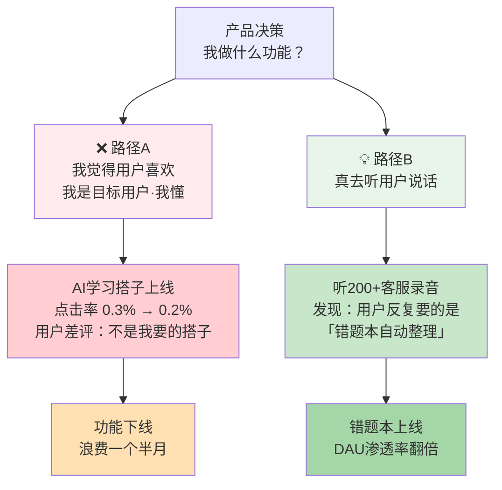
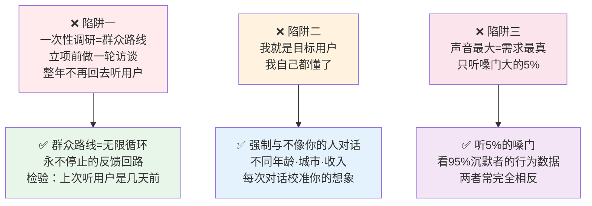
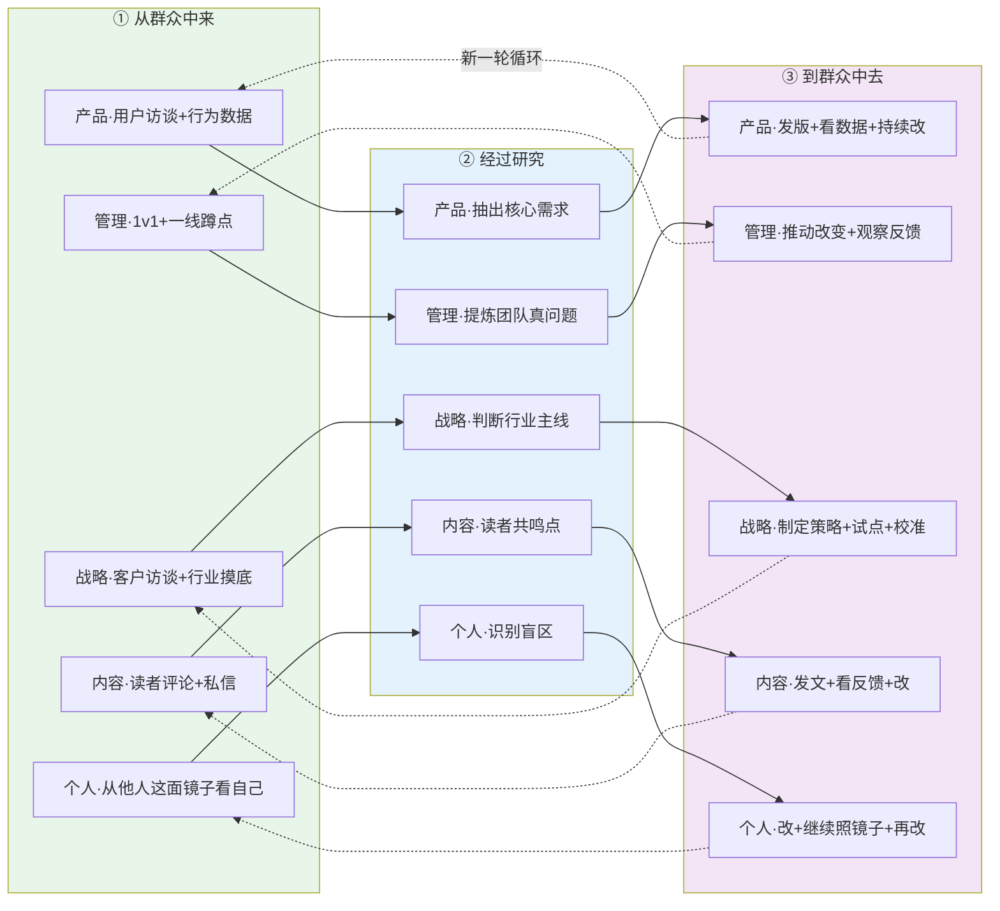

# 11.密切联系群众法

- 01.觉得用户喜欢
- 02.市面误读之辨
- 03.三层独家主张
- 04.群众路线四文本
- 05.路线的四重逻辑
- 06.从群众中来
- 07.到群众中去
- 08.一般号召个别
- 09.积极分子中介
- 10.立场决定路线
- 11.三个认知陷阱
- 12.现实映射矩阵
- 13.一个商业切片
- 14.三年认知复利
- 15.收束三句金言

## 01.觉得用户喜欢

我在一个教育产品团队做过一段时间的产品。有一次我主导了一个"AI 学习搭子"功能，你问啥它答啥，号称能陪你学一整天。我当时特别兴奋，认为这肯定是下一个增长点。

我没有做用户访谈，没有去客服那边听录音，没有去社群里看用户在骂什么。我所有的判断都来自一句话，"**我觉得用户会喜欢**"。团队里有同事提议说要不要先做 5 个真实用户的深访，我说："不用了，我自己就是目标用户，我懂。"

功能上线那天，我在工位上刷新后台数据。第一个小时，点击率 0.3%。第二天，点击率 0.2%。第三天，产品群里有人转了一个用户评论进来："**这个 AI 搭子，不是我想要的那种'搭子'，我想要的是一个能帮我整理错题本的家伙。**"

一周后我硬着头皮跑去客服组听了两个下午的真实通话录音。多通电话里，用户反复在说的是同一件事，**"能不能帮我把错题自动整理成一份？"**没有一个人问"能不能陪我聊天"。

那天我回工位，打开毛选，翻到那段我中学学过但从没真懂的话："从群众中来，到群众中去。" 我突然意识到：**我做的所有"为用户好"的事情，都是我脑子里那个虚构用户的需求，不是真实用户的需求**。我不是在服务用户，我是在服务我自己的想象。

第二天我把"AI 学习搭子"下线，重启了"错题本自动整理"这个需求。下面我把这段话背后的完整逻辑，原原本本拆给你看。"我觉得用户喜欢" vs "用户真需要什么"，一次决策的代价。



## 02.市面误读之辨

今天一讲"群众路线"，大多数人的第一反应是，**哦，就是要做用户调研嘛**。这个条件反射本身没错，却把群众路线的精华丢掉了九成。

市面书最常见的姿势，是把它讲成"用户调研技巧"：教你写访谈提纲、设计问卷、做编码归类。听起来实用，做起来安全，员工交出一份漂亮的访谈报告，就能"完成调研任务"，**不必触碰任何深层的权力结构和组织习惯**。但这把群众路线最锋利的一面磨平了：它本该挑战"上面说了算"这个默认设置，追问**智慧的源头是上面的决策者，还是站在一线的人**，结果被讲成了温顺的工具包，谁用都不会得罪人。这是第一个误读，**把"权力运行机制"降维成了"信息采集技术"**，只教你去"听用户怎么说"，绝不教你"为了用户去推翻上面已经拍板的方案"。

第二个误读，是**把它讲成"一次性动作"**：立项前做一轮 20 人访谈，归档入库，整年不再回去。在他们眼里，"调研"是**可以打勾完成的任务**，不是**必须永远在线的状态**。可毛泽东讲的是"无限循环"，从群众中来、到群众中去、再从群众中来……**没有"做完了"那一天**，一轮刚结束，下一轮已经开始，**循环一停，组织就开始死亡**。

第三个误读，是把它讲成**"产品方法"**，一个贴墙上的招式；可毛泽东讲的是**"组织的生命线"**，它断了，钱多人多资源多，组织照样死。

三层误读叠起来，就是市面解读的完整病灶：**把权力降维成工具、把循环降维成动作、把生命线降维成方法**。下面，一层层把它正过来。

## 03.三层独家主张

这一篇我想讲三层市面很少讲的东西：

第一层**它把群众路线讲成"信息采集技术"，但毛泽东讲的是"权力运行机制"**。群众路线的真正核心在于 **"谁是智慧的源头"** 是高层决策者，还是一线的人。今天的公司里默认智慧从高层流出、指令自上而下；毛泽东讲的恰恰相反，**真正的智慧从一线涌现，高层的任务是把它集中、加工、再送回去**。这是方向完全相反的两套系统。

第二层**它把群众路线讲成"单向动作"，去听听用户怎么说，但毛泽东讲的是"闭环循环"**。"从群众中来，到群众中去"不是两个动作，是一个**没有终点的无限循环**。市面上大多数公司都只做了"从群众中来"的前半段（一次性用户访谈），做完就不再回去了，**这不是群众路线，这是一次性取样**。

第三层**它把群众路线讲成"产品方法"，但毛泽东讲的是"组织的生命线"**。一个组织一旦停止"从群众中来、到群众中去"的循环，它就开始死亡，这个过程有时候慢、有时候快，但方向是必然的。这解释了为什么很多大公司明明钱多、人多、资源多，却被小公司打败，**他们的循环断了**。

所以这篇文章想讲的群众路线，是这三层市面很少讲的东西：**权力方向的反转、无限循环的机制、组织生命线的维护**。

```mermaid
mindmap
  title 三层独家主张思维图（权力反转 · 无限循环 · 组织生命线）
  root((🎯 密切联系群众<br/>三层独家主张))
    主张一 权力方向反转
      市面 群众路线=信息采集技术
      真相 群众路线=权力运行机制
      核心 谁是智慧的源头
        今天默认 智慧从高层流出
        毛泽东讲 智慧从一线涌现
      高层的任务
        把一线智慧集中·加工·送回
      方向完全相反的两套系统
    主张二 无限循环机制
      市面 单向动作·去听听用户怎么说
      真相 从群众中来 到群众中去 是闭环
      不是两个动作
        是没有终点的无限循环
      多数公司只做前半段
        一次性用户访谈
        做完就不再回去
      前半段=一次性取样
        不是群众路线
    主张三 组织生命线
      市面 群众路线=产品方法
      真相 群众路线=组织的生命线
      循环停止那天
        组织开始死亡
      解释了为何大公司被小公司打败
        钱多·人多·资源多
        但循环断了
      财报是滞后指标
        群众循环才是前瞻指标
```

## 04.群众路线四文本

毛泽东对"群众路线"最经典、最系统的阐述，出现在以下关键文献中。

**来看下原文1**："凡属正确的领导，必须是从群众中来，到群众中去。这就是说，将群众的意见（分散的无系统的意见）集中起来（经过研究，化为集中的系统的意见），又到群众中去作宣传解释，化为群众的意见，使群众坚持下去，见之于行动，并在群众行动中考验这些意见是否正确。然后再从群众中集中起来，再到群众中坚持下去。如此无限循环，一次比一次地更正确、更生动、更丰富。**这就是马克思主义的认识论**。"

**精读**：这段话的大杀器是**最后一句**——"这就是马克思主义的认识论"。毛泽东把"领导方法"直接等同于"认识论"——这是一个极其激进的理论创造：**领导不是管理，领导是认识；领导不是下命令，领导是组织一个认识运动**。

**来看下原文2**：在党的七大政治报告中，"我们共产党人区别于其他任何政党的又一个显著的标志，就是和最广大的人民群众取得最密切的联系。**全心全意地为人民服务，一刻也不脱离群众；一切从人民的利益出发，而不是从个人或小集团的利益出发**；向人民负责和向党的领导机关负责的一致性；这些就是我们的出发点。"

**精读**：这里给出了群众路线的**价值根基**，**"全心全意为人民服务"不是道德口号，是对"立场"的精准定义**。立场错了，方法再好也没用。

**来看下原文3**："我们应该深刻地注意群众生活的问题，**从土地、劳动问题，到柴米油盐问题**。……一切这些群众生活上的问题，都应该把它提到自己的议事日程上。应该讨论，应该决定，应该实行，应该检查。要使广大群众认识我们是代表他们的利益的，是和他们呼吸相通的。"

**精读**：这一段很容易被忽视，但它在告诉你——**群众路线不是抽象的"尊重用户"，是具体到"柴米油盐"这个颗粒度的关心**。一个产品团队如果心里装不下用户每天具体的麻烦，它说再多"以用户为中心"也是假的。

## 05.路线的四重逻辑

群众路线是一个体系，不是一句话。它由四重互相嵌套的逻辑构成，一层搭着一层：

**认识论逻辑**：群众路线是马克思主义认识论在领导方法上的体现。它回答的是"正确认识从哪里来"：不是从高层的头脑里来，而是从群众的实践中来。缺了这一层，群众路线就退化成拍脑袋的决策技巧。

**方法论逻辑**：一般与个别结合、领导与群众结合。它回答的是"怎么落地"：既要有一般号召，也要有个别指导；既要靠领导骨干，也要发动群众。缺了这一层，再好的认识也落不到行动上。

**价值论逻辑**：全心全意为人民服务是根本宗旨。它回答的是"为了谁"：立场错了，方法再好、认识再深，方向都是偏的。缺了这一层，群众路线就会变成一套精致的操控术。

**组织论逻辑**：民主集中制是制度保障。它回答的是"靠什么撑住"：靠的不是领导一时的心情，而是一套稳定的制度。缺了这一层，循环再漂亮也坚持不下去。

这四层缺一不可。市面解读往往只抓一层（通常是方法论或认识论），丢掉了价值和制度这两根柱子，于是错失了真正的杀伤力。

```mermaid
graph TB
  title 群众路线的四重嵌套逻辑——缺一不可
    A["🔍 认识论逻辑<br/>从感性→理性→实践<br/>领导方法=认识论"] --> E["群众路线<br/>完整体系"]
    B["🔧 方法论逻辑<br/>一般与个别结合<br/>领导与群众结合"] --> E
    C["❤️ 价值论逻辑<br/>全心全意为人民服务<br/>立场错了方法再好也没用"] --> E
    D["🏛️ 组织论逻辑<br/>民主集中制<br/>是制度保障不是风格选择"] --> E
    style E fill:#e8f5e9
    style A fill:#e3f2fd
    style B fill:#f3e5f5
    style C fill:#ffebee
    style D fill:#fff3e0
```

## 06.从群众中来

"**从群众中来**"对应《实践论》的第一次飞跃，**从感性认识到理性认识**。

群众的意见源于其具体的生产生活实践，是**丰富的、生动的，但也是分散的、无系统的**（感性认识）。领导者的任务，就是**深入群众，广泛收集这些原始意见，然后运用科学方法进行"去粗取精、去伪存真、由此及彼、由表及里"的加工制作，使之上升为理性的、系统的路线、方针、政策**。

这里有一个关键的操作点，**"从群众中来"不是把群众意见简单汇总**。简单汇总版：70% 用户投诉 A，20% 投诉 B，所以先改 A。真正加工版：70% 投诉 A 是表象，A 和 B 之间有因果关系，A 问题其实是 B 问题的衍生，真正要改的是 B。

**这个"加工"过程考验的是领导者的思维能力**，能不能在纷乱的原始意见里，抓出隐藏的主线。这是一个**看见森林而不是树木**的能力。

今天一个容易被忽略的现实是，**很多组织拿不到"原始的群众意见"**。为什么？因为**意见被层层过滤**：一线员工过滤后 → 汇报给中层；中层过滤后 → 汇报给高管；高管过滤后 → 形成决策；等到决策层那里，**原始信号已经被过滤掉 90%**。

**群众路线的第一步就死在这里**，*你连真正的原始意见都没有，你"从群众中来"什么？**破解方法只有一条**，高层强制性直接接触一线**。不是偶尔，是定期、强制、有规矩的。

## 07.到群众中去

"**到群众中去**"对应第二次飞跃，**从理性认识到实践**。

制定出的政策是否正确，**不能靠主观判断，必须回到群众的实践中去检验**。通过宣传解释，将政策转化为群众的自觉行动，在群众实践中考察其效果。**成功了就坚持，失败了就修正**。

这里最容易被扭曲的地方是，**很多人把"到群众中去"理解成"把政策推销给群众"**。推销版：我已经决定了，现在让群众接受。检验版：我决定了，现在让现实来打分，打得好就坚持，打不好就改。这两种姿态天壤之别。推销版把群众当"被说服对象"，检验版把群众当"裁判"。**前者是傲慢，后者是谦卑**。真正的群众路线是后者。

这句话里最难的是"**失败就修正**"。大多数组织一旦决策出来，就会把它当成"不容置疑"的东西来推行。哪怕现实已经反馈"这不 work"，他们也会**继续推、更努力地推、甚至用更强的动员去推**。这是把"坚持"当美德的错误，**没有经过实践检验的坚持，是愚忠**。

真正的群众路线要求领导者有**推翻自己决策的勇气**，上个月定的方案，这个月现实说不行，就立刻改，不讲面子。

```mermaid
flowchart LR
  title "从群众中来，到群众中去"的完整闭环
    A["① 从群众中来<br/>收集分散无系统的意见<br/>必须获取原始信号<br/>不能被层层过滤"] --> B["② 加工研究<br/>去粗取精·去伪存真<br/>由此及彼·由表及里<br/>不是简单汇总"]
    B --> C["③ 到群众中去<br/>把政策变成群众行动<br/>在实践中检验<br/>成功坚持·失败修正"]
    C --> D["④ 再从群众中来<br/>收集新实践中产生<br/>的新意见·新问题<br/>→ 新一轮循环"]
    D -.->|"无限循环<br/>每一轮更正确<br/>更生动·更丰富"| A
    style A fill:#e8f5e9
    style B fill:#e3f2fd
    style C fill:#f3e5f5
    style D fill:#fff3e0
```

## 08.一般号召个别

毛泽东在《关于领导方法的若干问题》里还讲了一个极为实用的方法：**"一般号召"与"个别指导"相结合**。

**只有一般号召，没有具体指导，号召就会落空**。上级发布一个政策（一般号召），如果下级只是机械传达，不结合本地区、本单位的实际情况进行具体部署，就会犯"一刀切"的错误。

**今天的翻译**：老板在全员会上说"**我们要加强用户洞察**"，如果这句话之后没有任何具体的落地指导（怎么做、谁来做、做到什么标准），这句话就是一句空话。一个月后，每个部门都会装模作样做一点"用户洞察"，但没人知道到底在做什么。**一般号召没有个别指导，等于没有号召**。

领导者必须"**突破一点，取得经验**"。选一个乡镇做试点（个别指导），跑通之后再推广到全区。选一个业务线做试点，跑通之后再推广到全公司。

**个别指导的意义**不是"怕风险所以先试"，而是**一般原则必须落地到一个具体情境里才能显露出它的真正形状**。**试点不是降风险，试点是做"理论的实地翻译"**。

**真正的领导动作永远是一般 + 个别组合拳**，发一份"我们要加强用户洞察"的号召（一般）；立刻选一个团队做"每月 20 场用户访谈"的试点（个别）；3 个月后把试点经验提炼成方法论；再推广到全公司（重新的一般号召）。**市面上讲的"群众路线"极少讲到这一层，但这一层才是让思想真正落地的关键**。

## 09.积极分子中介

**只有领导骨干的积极性，而无广大群众的积极性相结合，便将成为少数人的空忙**。反之，**只有群众的积极性，而无有力的领导骨干去恰当地组织，群众的积极性既不可能持久，也不可能走向正确的方向**。

这段拆开，是一个组织能否运转的"双引擎条件"，**单引擎飞不起来**。

**只有领导骨干、没有群众积极性**，是多数初创公司的典型死法：CEO 一腔热血、几个 VP 加班加点、白板写满战略，一线却只完成动作不投入心思。**整车像引擎飞速、车轮空转**，核心拼命踩油门，前进几乎为零，结局是核心烧干、一线心安理得地"等指令"，整车熄火。

**只有群众积极性、没有领导骨干**，是另一种死法：基层热情高涨、各自在小阵地上努力，却没人把这些努力对齐到同一方向。**像一群有热情却没指挥官的士兵**，人人都在打仗，却没人打同一场仗，公司很快陷入互相消耗，A 部门做了 B 部门反对的事，客户面对十种声音。

**两种引擎都缺是死的，只有一种迟早死，两种都有且能配合，才可能起飞**。

这里有个关键角色：**积极分子**。他们是连接两种引擎的传动轴，既是群众的一部分（来自一线），又比一般群众更主动、更理解领导意图。他们把领导的意图翻译成群众听得懂的语言，又把群众的真实反馈翻译成领导听得懂的信号。**没有他们，领导讲什么群众听不懂，群众讲什么领导听不见，上下就断裂了**。

在公司里，积极分子是三类人：**产品团队里的"产品布道者"**，信产品价值、主动在团队和客户面前讲清楚；**技术团队里的"技术演进推动者"**，不仅写代码，还推动技术规范、代码质量和架构演进；**销售团队里的"业绩榜样"**，自己卖得好还愿意分享方法、带新人、抢硬骨头单子。

**他们的共同特征不是"能力最强"，而是"主动性最高 + 立场最对齐"**，把公司的事当自己的事，愿意在没有命令时自己往前推半步。**这种"主动半步"，是机器人式员工和积极分子最关键的区别**。

**怎么识别积极分子**，看三个信号：第一，他在没有 KPI 要求的事上主动做了；第二，他能用大白话向同事解释公司战略；第三，他能从一线带回让管理层"愿意改"的真实反馈。**三个信号同时出现的人，是你该立刻投资的人**。

领导者要善于发现和培养"积极分子"，**形成一支以核心骨干为中心、团结积极分子、吸引中间分子、争取落后分子的领导骨干队伍**。这本质上是**组织设计问题**：你的组织里有没有这种中介层？你愿不愿意给这一层人倾斜资源和权威？很多公司失败就失败在**把积极分子当"执行者"而非"共同决策者"**，积极分子没了动力，整条链就瘫了。

## 10.立场决定路线

群众路线的灵魂是立场，不是技术。立场对了：你会主动想"我怎么才能真正帮到他们"，即使流程麻烦、成本高。立场错了：你做的所有"用户洞察"，本质上都是**为自己找增长机会，而不是真正为用户好**。

**市面上 80% 讲"以用户为中心"的公司，立场其实是"以增长为中心"**。这两者短期看起来相似，长期看差距巨大，**以增长为中心的公司会选择薅用户羊毛的路，以用户为中心的公司会选择厚积薄发的路**。

"**一切从人民的利益出发**"，这是共产党一切行动的价值原点。翻译到今天的企业版：**一切从用户的长期利益出发**，不是用户这一刻的欲望，是用户的长期利益。短视频无限刷满足的是用户这一刻的多巴胺，但不一定是用户的长期利益。一个真正"为用户"的产品会在让用户"开心"和让用户"更好"之间做选择——大多数公司选前者，真正伟大的产品选后者。

党与群众的关系被比喻为"**鱼和水**"、"**种子和土地**"。**鱼离开水不能活，种子离开土地不能生长**。

这个比喻的深刻之处，**它说明了关系的不对称性**。群众是水，党是鱼，**鱼离不开水，但水可以没有鱼**。这句话在今天的翻译是：**用户离开你可以活得很好，但你离开用户一天都活不了**。

**这种"不对称的依赖"**，是一个组织保持谦卑的根本理由。**不是道德要求，是生存逻辑**。

践行群众路线，**不是空谈大道理，而是要解决群众的"柴米油盐"、"生疮害病"等具体问题**。

对应到产品：**真正为用户的产品经理，不会高谈阔论"我们要重塑行业"，他会很关心"这个按钮的位置对不对""这个文案用户懂不懂""这个流程少一步能不能"**。关心具体，才是关心用户的真实证据。

## 11.三个认知陷阱



**陷阱一：把"一次性调研"当成群众路线**。很多团队立项前做一轮 20 人用户访谈，然后整整一年不再回去听用户。**这不是群众路线，这是一次性取样**。群众路线是循环的、永不停止的。立项前、过程中、上线后都要持续"从群众中来"，断了任何一段，循环就失效。

**破解方法**：问问自己上一次主动去听用户声音是什么时候。如果超过一个月，你已经脱离了群众路线。

**陷阱二："我就是目标用户"**。这是产品经理最容易说出口的一句话，也是最危险的一句话。**你不是你的用户**。你可能在某个维度像他们，但在整体处境、心理、生活节奏、消费能力上，和他们有巨大差距。你以为你懂他们，其实你只是懂一个"和你相似的自己"。

**破解方法**：强制性地和"不像你"的用户对话，不同年龄、不同城市、不同收入、不同教育背景。每一次和"不像你的用户"对话，都是对"用户想象"的一次校准。

**陷阱三：把"声音最大"当成"需求最真"**。在用户反馈里，声音最大的那一类用户，常常不是最多的那一类。他们只是表达欲最强、情绪最激烈，但他们的声音未必代表沉默大多数。

**破解方法**：把声音最大的一批反馈单独拎出来，然后去看沉默大多数的行为数据。很多时候你会发现，声音最大的那群人和数据显示的主流行为完全相反。

一个真正的群众路线工作者，**既要听嗓门大的那 5%，也要看剩下 95% 沉默者的行为**。

## 12.现实映射矩阵

"从群众中来、经过研究、到群众中去"这三步，在五个维度上有不同的落法。

**产品决策**：从用户访谈和行为数据里来，把杂乱反馈抽象成核心需求，再发版、看数据、持续改。这一维最容易断在"发版之后"：上线不是终点，每一版的差评和数据必须回流到下一版，否则就是一次性取样。

**管理带团队**：从一对一和一线蹲点里来，提炼出团队的真问题，再推动改变、观察反馈。这一维最容易断在"只听不蹲"：坐在办公室听汇报是听不到真话的，必须跟下属一起去见客户、一起干活，才拿得到原始信号。

**战略制定**：从客户访谈和行业摸底里来，判断行业主线，再制定策略、试点、校准。这一维最容易断在"战略定了就不回看"：市场一直在变，战略必须留一个试点和校准的机制，否则就是刻舟求剑。

**内容创作**：从读者评论和私信里来，提炼读者的共鸣点，再发文、看反馈、改。这一维最容易断在"写了就发、发了就完"：真正的内容循环是每一篇都回头看读者的真实反应，下一篇写得更准。

**个人成长**：从他人这面镜子看自己，识别自己的盲区，再改、继续照镜子、再改。这一维最容易断在"只照镜子不改"：知道自己的问题只是第一步，真正的成长在"改"这个动作上反复循环。

**这张表的使用方式**：**选你最想进化的那一行，强迫自己跑通一次完整循环**。不要只做前半段（听意见），一定要跑完后半段（验证 + 校准）。



## 13.一个商业切片

讲一个把"群众路线"做到权力层面的案例：**海底捞的现场授权**。海底捞最反常识的一点，不是服务热情，而是**它把"决定权"直接交给了一线服务员**。一个普通服务员，有权现场给顾客免单、送菜、打折，不需要请示店长、不需要走审批流程。

对照群众路线的三步来看：

**"从群众中来"**：顾客的不满和需求，在就餐现场被服务员第一时间直接接收，而不是等顾客回家填问卷、打投诉电话，再经过客服、运营、总部层层过滤。信号在最鲜活的时刻，被最靠近群众的人接住了。

**"经过研究"**：这个环节被压缩到几乎为零，因为服务员自己就是最懂现场的人。顾客这道菜咸了、等得太久了，不需要总部开会分析，一线当场就能判断该怎么处理。

**"到群众中去"**：当场送一道菜、免一次单，顾客立刻得到回应。这不是"改版上线"，是**以分钟为单位完成的一次闭环**。

**无限循环**：一个服务员一天要接待几十桌客人，每一桌都是一次"听 → 处理 → 再听"的循环，一天跑几十轮。

**这个案例真正的杀伤力，不在"服务态度好"，而在"权力方向反转"**。大多数公司把"听用户"做成了一门调研技术，海底捞把它做成了一个权力结构：把决策权从总部下放到一线，让"听得见炮声的人"直接做决定。

所以后来一堆餐饮品牌学海底捞，学微笑、学鞠躬、学递热毛巾，全都没学到点子上。**学的是动作，没学的是权力**。真正的秘密不是服务员态度好，而是**服务员有权**。

这就是毛泽东讲的群众路线里最锋利的那一层：**智慧的源头、决策的权力，不在上面，在一线**。

## 14.三年认知复利

那一周我做的第一件事，是让组里每个人每周必须听 1 小时真实客服录音、看 2 条用户差评。我们把它叫"用户现场时间"。第一周我自己听完两小时，回来开会第一句话是："我们把自己当用户，已经当了三年了。"那周我们推翻了正在开发的 3 个功能，重新列了一版"从真实用户吐槽里来的"需求清单。

我给团队定了一条硬规矩：**任何一个上线的需求，评审页必须附三段用户原话**——可以是访谈，可以是客服录音截取，可以是社群截图。没有这三段原话的需求，我不签字。一开始大家不适应，觉得"太麻烦了"。但一个月后，产品同学自己跟我说："以前我写需求是在赌，现在我写需求心里踏实多了。"那个月"错题本自动整理"上线，DAU 渗透率直接翻了一倍。

半年后，我带的团队已经不会再说"我觉得用户会喜欢"这种话了。每次有人这么开头，其他同学会直接打断："那你最近听了多少条客服电话？"这成了我们内部的黑话。我自己也慢慢明白了"从群众中来，到群众中去"真正的意思，**不是一次性的用户访谈，而是一套永远不能关掉的反馈循环**。每一版上线后，我们必须再去看用户怎么用、怎么骂、怎么夸，然后把这些回流到下一版决策里。这个循环一旦关掉，产品就死了。

三年之后我形成了一个新的判断力，**判断一家公司、一个团队、一个产品是否健康，就看它的"群众反馈循环"是否还活着**。

循环健康的公司：产品同学能脱口说出最近一周的用户原话、用户数据、用户投诉集中点。循环死亡的公司：产品同学只能讲 OKR、讲方法论、讲战略——他们已经和用户断联了，他们只是在公司内部"对齐"。

**一家公司什么时候开始衰退？就是它的"群众循环"开始断掉那一刻，不是财报变差那一刻**。财报是滞后指标，群众循环才是前瞻指标。

```mermaid
gantt
    title 三年群众路线复利时间线（个人亲历）
    dateFormat X
    axisFormat %s
    section 翻车期
    AI学习搭子上线·点击率0.3%       :crit, done, 0, 7
    硬着头皮听两下午客服录音·247通电话   :active, 7, 14
    读实践论·从群众中来到群众中去    :milestone, 14, 0
    section 制度期(1个月)
    用户现场时间·每人每周听1小时录音  :done, 14, 44
    评审页硬规矩·必附三段用户原话    :done, 14, 44
    错题本上线·DAU翻倍            :milestone, 44, 0
    section 内化期(半年)
    团队黑话·你最近听了多少条录音     :done, 44, 200
    上线后回流机制·永不关掉的循环    :done, 44, 200
    section 复利期(三年)
    形成新判断力·看群众循环健康度   :done, 200, 800
    择业硬底线·高层每周是否接触用户  :done, 800, 1095
    看公司前瞻指标·非财报滞后指标    :milestone, 1095, 0
```



## 15.收束三句金言

**一句话核心**：**你脑子里的用户，永远不是真实用户；只有真实用户会告诉你真相。**

**你应该带走的三件事**：

**1.永远警惕"我觉得用户会喜欢"这种话**——一旦开口说了，立即去听一小时客服录音、看两条真实差评，把自己拉回地面。

**2.让"从群众中来"变成制度**——每个需求评审必须附真实用户原话、每周必须有"用户现场时间"，否则它永远只是口号。

**3."到群众中去"不是上线那一刻就结束，而是永不关闭的循环**——每一版后继续听、继续看、继续改，这才是真正的群众路线。

**一句留给你的反问**：你最近一次真正听到、看到、感受到一个真实用户的抱怨，**是几天前**？超过 7 天，你已经活在你自己虚构的"用户想象"里了。

