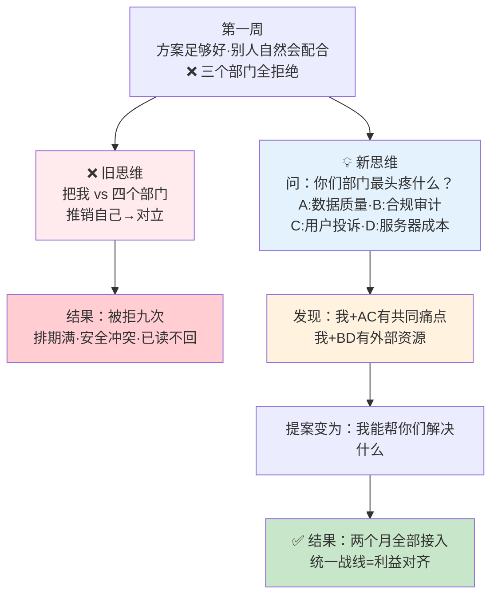
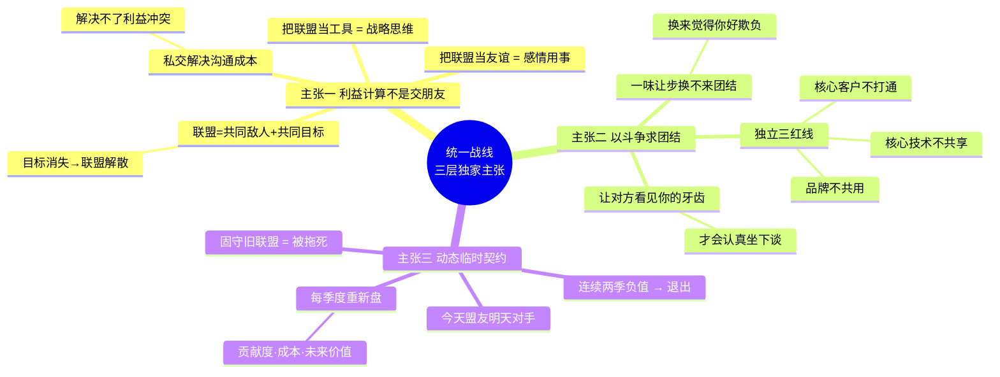
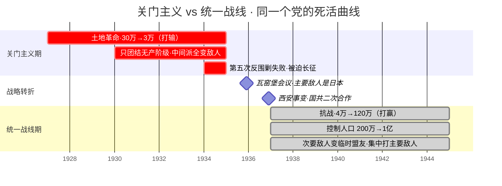
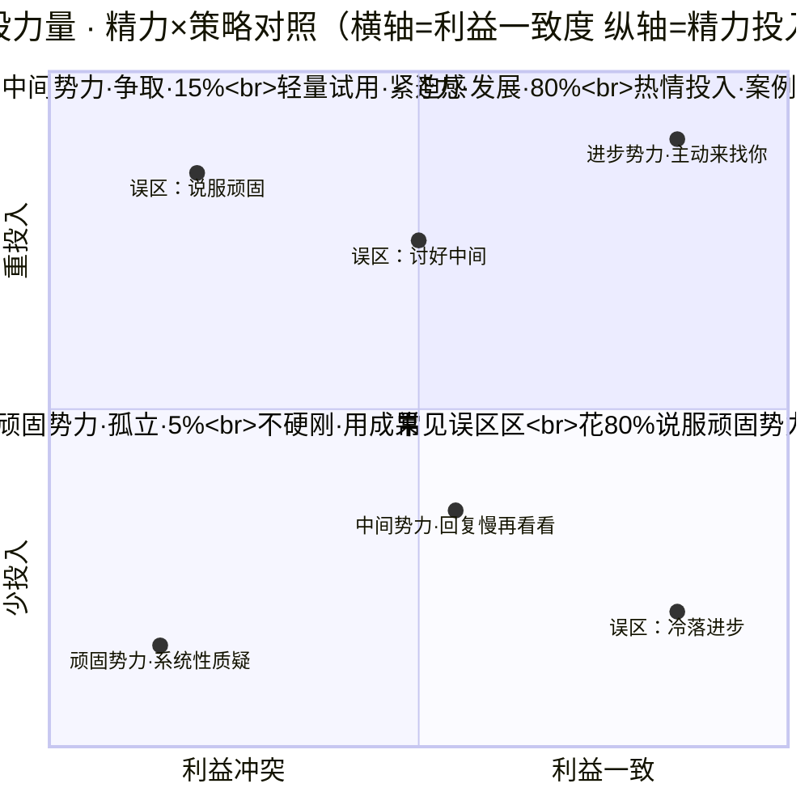
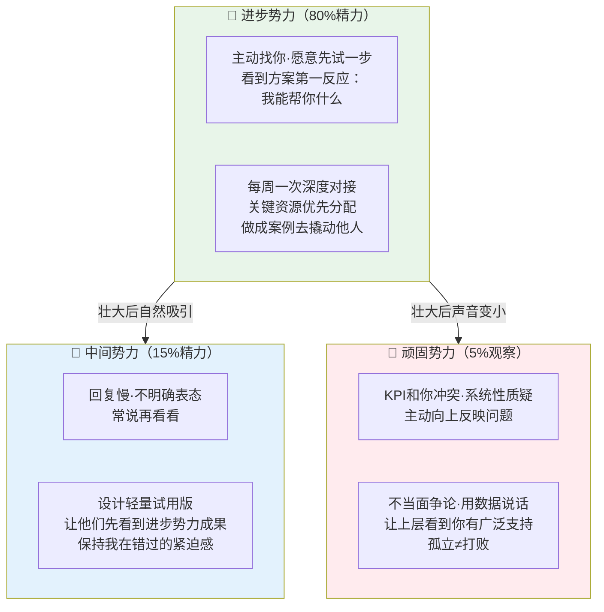
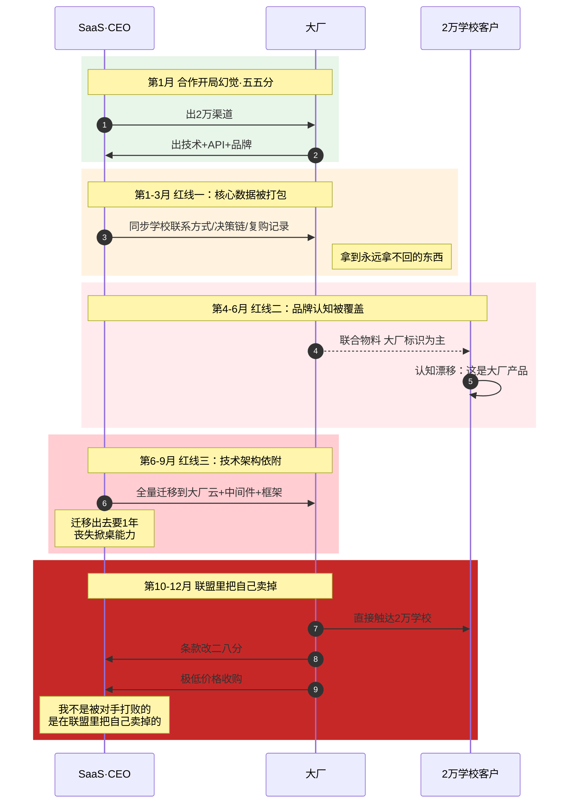
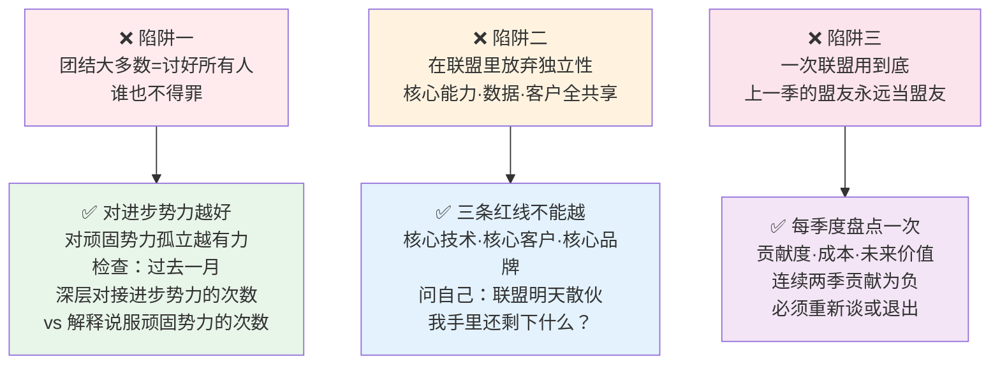

# 团结一切可团结

- 01.跨部门被拒九次
- 02.市面误读之辨
- 03.三层独家主张
- 04.一九三五转折
- 05.原文四维精读
- 06.联盟不是交朋友
- 07.分清敌友三层
- 08.独立自主是底线
- 09.动态调整联盟
- 10.一个反面教材
- 11.三个认知陷阱
- 12.三年认知复利
- 13.收束三句金言

## 01.跨部门被拒九次

三年前我做了一个跨部门的中台项目，需要在半年内打通四个部门的系统。我第一周的做法是——自己干。我画架构、写接口、定规范，心想只要我的方案够好，别人自然愿意配合。结果第一个部门回复："我们这季度排期满了。"第二个部门说："这个和数据安全规范冲突。"第三个部门直接已读不回。

第二周我换了一种打法：我不再推销我的方案，我开始**和每个部门的负责人单独吃饭**。吃饭时不谈项目，只问一个问题："你们部门现在最头疼的是什么？"四个部门给了四个完全不同的答案——A 部门头疼数据质量，B 部门头疼合规审计，C 部门头疼用户投诉，D 部门头疼服务器成本。

我发现我手里有一套能同时解决 A 和 C 问题的工具，而 B 和 D 的问题我能帮他们推荐外部供应商。第三周我重新做了提案，**提案内容从"请你们配合我"变成了"我能帮你们解决什么"**。两个月后四个部门全部接入。不是我口才好，是我终于理解了**统一战线的第一原则——对方为什么愿意跟你合作，是因为你能解决他的问题，不是因为你人多**。

那周我翻毛选"统一战线"的篇章，毛泽东对一群手握重兵的各路山头说："**要把敌人营垒中间的一切争斗、缺口、矛盾，统统收集起来，作为反对当前主要敌人之用。**"我恍然大悟——我之前的做法是把自己和四个部门摆在对立面，但正确的做法是找到我和他们之间的**共同敌人**（各自的业务痛点），然后联合起来打。统一战线不是拉帮结派，是**利益对齐**。

跨部门被拒九次 → 两个月全部接入——转变的关键在于换了一种问法：

## 02.市面误读之辨

市面上讲"统一战线"的书，最常见的讲法是："要团结大多数，不要树敌太多。"这句话听起来很有智慧，但它把统一战线讲成了**老好人哲学**。

真正的统一战线不是"谁都别得罪"，而是**精准地识别谁是你的主要对手、谁是可以团结的中间力量、谁是必须打击的死敌**。毛泽东从来没说过"团结所有人"——他说的从来是"团结一切**可以团结**的力量"。这七个字里最重要的两个字是"可以"——不是所有人都"可以"团结。有些人你越团结他越咬你。

第二种常见误读是把"统一战线"当成"拉群"。在企业里表现为把所有利益相关方拉到一个群里，发个公告，就算建立了统一战线。这不是统一战线，这是**信息群发**。真正的统一战线需要每个成员都有明确的利益驱动、角色分工和退出机制。它是一个**有结构、有成本的联盟**，不是一个聊天群。

为什么这两种误读最流行？因为它们**避免了所有困难的部分**——识别谁是朋友、谁是敌人是难的，为每个盟友设计利益方案是难的，在合作中保持自己的独立性是难的。市面书选择跳过所有难的部分，只留下"要与人为善"这种正确的废话。

## 03.三层独家主张

这篇文章想讲的统一战线，三层在市面几乎看不到：

**第一层，统一战线是利益计算，不是交朋友**。你和一个人是不是联盟关系，不取决于你们私交好不好、认识了多少年、是不是喝过酒，而取决于**在当前阶段，你们有没有共同的敌人或共同的目标**。一旦那个共同的目标消失，联盟就应该解散。把联盟当友谊，是感情用事；把联盟当工具，才是战略思维。

**第二层，统一战线的精髓在于"以斗争求团结"**。这五个字是毛泽东对统一战线最狠的概括。你以为团结是通过"让"来达成的——让利、让步、妥协。但毛泽东告诉你：**一味的让步换不来团结，换来的是对方觉得你好欺负**。真正的团结必须建立在"你有实力、你有底线、你能随时退出"的前提上。只有让对方看见你的牙齿，他才愿意认真地坐到你对面说话。

**第三层，统一战线不是一次性的，是动态的**。今天的盟友可能变成明天的对手，今天的对手可能变成明天的盟友。不要把任何联盟关系固化——它是基于当前利益格局的**临时契约**，利益格局一变动，契约就要重新谈。固守旧联盟的人，最后会被旧联盟拖死。

三层独家主张思维图（利益计算 · 以斗争求团结 · 动态契约）：

## 04.一九三五转折

统一战线在中国革命中的正式提出是在 1935 年 12 月的**瓦窑堡会议**。在此之前，党内占主导地位的是"关门主义"——认为中间力量都是不可靠的，只有无产阶级才值得团结。这种策略的结果就是**把所有可能的朋友都逼成了敌人**——红军经历了第五次反围剿失败、被迫长征、从 30 万锐减到 3 万，代价极其惨烈。

1935 年的中国面临一个极端局面：日本已经占领东北，正步步进逼华北。**1935 年 6 月何梅协定后，中国实际上已经失去了华北五省的主权**。蒋介石的国民党政权拥有全国军事力量（近 200 万正规军），但却坚持"攘外必先安内"，把 60 多个师用于围剿红军。此时的共产党只剩下陕北根据地几万人——面对日本和国民党两个敌人，硬打是必死的。

毛泽东在瓦窑堡会议上做了一个极其冷静的利益分析：**当前中华民族最大的敌人是日本帝国主义，阶级矛盾必须暂时让位于民族矛盾**。和打了十年内战的国民党合作抗日，在当时的党内是**政治上极其不正确的提法**——因为红军几十万人的血债还没算。会议上有过激烈争论，但毛泽东坚持——**"我们不能同时打两个敌人。次要敌人可以谈，主要敌人必须集中打"**——这个提法在党内是石破天惊的。

毛泽东用一句话说服了全党："**我们要把敌人营垒中间的一切争斗、缺口、矛盾，统统收集起来，作为反对当前主要敌人之用。**"这句话的底层逻辑是：你没有实力同时打两个敌人，你必须**把次要敌人变成临时盟友，集中力量打最主要的那个**。这不是道德选择，是**生存算法**。

统一战线的形成改变了整个抗战格局。1936 年 12 月西安事变后国共第二次合作正式建立，红军改编为八路军和新四军，开赴抗日前线。**八年抗战，共产党军队从 4 万人扩展到 120 万人，控制人口从 200 万扩展到 1 亿**——不是靠"独立发展"，是靠**在统一战线的框架下最大化地利用合作空间**。这个数字对比说明一切——同一个共产党，10 年内战期间从 30 万打到 3 万（打输了），8 年抗战期间从 4 万打到 120 万（打赢了）。差别不是能力，是**战略框架**。

内战→抗战 · 关门主义→统一战线的死活对照（1927-1945）：

**图眼**：同一个党、同一批干部、同一种理想——**关门主义 8 年从 30 万打到 3 万，统一战线 8 年从 4 万打到 120 万**。差别不是资源、不是能力、不是运气——是**战略框架**。你能不能同时打两个敌人？不能。那就必须把次要敌人变临时盟友——**这不是道德妥协，是生存算法**。

## 05.原文四维精读

> 原文："**发展进步势力，争取中间势力，孤立顽固势力。**"

请注意毛泽东用的三个动词——**发展、争取、孤立**。这三个词的力度完全不同，精准对应三股力量的不同策略。进步势力是**自己人**，要"发展"——投入资源，壮大它；中间势力是**摇摆者**，要"争取"——用利益和条件吸引它，但不必推心置腹；顽固势力是**敌人**，要"孤立"——不需要消灭，但要用一切手段切断它和盟友的联系，让它变成孤岛。

这三个动词的选择本身就是一堂极致的战略课。很多人反着用：对进步势力冷淡（觉得反正它跑不了），对中间势力讨好（害怕它摇摆），对顽固势力对抗（正面硬刚）。这恰恰是**把力气花在了最不该花的地方**。正确的做法是：对进步势力热情投入，对中间势力精确算计，对顽固势力集中火力断其后路。

这段话写在 1940 年 3 月毛泽东的《目前抗日统一战线中的策略问题》一文中。此时抗日战争进入相持阶段，国民党内部发生了严重的动摇和分裂。毛泽东不是在写哲学论文，他是在给前线干部写**操作手册**——告诉他们手里拿着党、政、军三张牌，分别该打向谁。

这段话内部有一个张力：三股力量之间的关系是**动态流动**的。今天的中间势力明天可能因为利益变化变成顽固势力，顽固势力也可能因为外部压力变成中间势力。所以"发展进步势力"是根本——只要自己的力量在增长，不管盟友怎么变动，你都有底牌。**统一战线不是求人，是在自己的底牌足够硬的前提下，用最小的代价换来最大的战略空间**。

市面上把这句话翻译成"多交朋友、少树敌人"。这是**彻底错的**。"多交朋友"是社交学，不是战略学。战略学的第一课永远是：**认清谁是敌人、谁是朋友、谁是摇摆者**。你连这三者都分不清，交再多的"朋友"都是在养虎为患。

**再看一个被完全忽视的细节**——毛泽东讲的三股力量不是**并列关系**，是**因果关系**。**先有"发展进步势力"才能有"争取中间势力"，先有"进步+中间"才能"孤立顽固势力"**——这三步顺序不能颠倒。很多人的错误是想反过来做——**先去孤立顽固势力**（结果被反弹）、或者**同时争取所有中间势力**（结果谁都争不到）。正确的顺序是先把进步势力做大做强，让他们成为看得见的"成功案例"，然后中间势力自然被吸引过来，最后顽固势力在"进步+中间"的合力下变成孤立的少数派。**这个先后逻辑，是统一战线最深层的操作机制**——不理解这个顺序，你就永远做不好统一战线。

三股力量精力分配 · 动词选择的战略四维：

**图眼**：健康分布应集中在**第一象限**（进步势力·重投入），少量在第二象限（中间势力·轻投入），第三象限用最小成本观察。**常见错误全在第四象限**——把重投入砸在利益冲突的顽固势力身上，越努力越失血。翻你的日程表：过去一个月你和进步势力的深度对接是几次？和顽固势力的解释性沟通是几次？后者多于前者，你就是在第四象限。

## 06.联盟不是交朋友

跨部门合作里最常见的错误，就是以为"关系好"就能搞定事情。你请对方喝了三次咖啡，他也许愿意顺手帮你一个小忙，但一旦涉及到他的核心利益（排期、KPI、资源），再好的私交也会被现实利益冲垮。**私交解决不了利益冲突，只能解决沟通成本**——这个区分非常重要。

真正的跨部门联盟需要三个条件：**第一，你们有一个共同不能被其他方式解决的痛点**——这个痛点如果对方能通过其他更便宜的方式解决，他就不会真心和你合作；**第二，每个人的投入和收益是对等的**——不对等的联盟只能维持在初期热情阶段，一旦利益分配出现偏差就必然破裂；**第三，联盟有明确的终止条件**——共同目标达成之后如何和平散伙、如何评估合作成果、如何处理未完成的资产。这三个条件缺任何一个，联盟迟早散架。

**很多人只做第一点**——找到共同目标——然后就以为自己建成了统一战线。他们没做第二点（利益分配）和第三点（退出机制），所以联盟在第一次利益冲突时就崩了。**利益方案要写在合作启动第一天，退出机制要写在合作最热闹的时候**——不是不信任，是保证联盟能走完全程的必要设计。

## 07.分清敌友三层

毛泽东把社会力量分成三份的做法，在企业里同样精准适用。任何跨部门项目的推动，面前永远有三股力量：

**进步势力**：那些跟你目标一致、手里有资源、愿意投入的人。**特征识别**：他们主动来找你、他们愿意在没有正式合同的情况下先试一步、他们看到你的方案第一反应是"我能帮你什么"。对这些人要**"发展"**——优先对接、重点投入、让他们成为案例，用他们的成功去撬动犹豫的人。具体动作：每周至少一次深度对接、把你的关键资源优先分配给他们、把他们的成功案例整理成 PR 素材去主动传播。

**中间势力**：那些不反对你、但也不着急配合的人。**特征识别**：他们回复邮件慢、他们对方案不明确表态、他们说"再看看"次数很多。对这些人要**"争取"**——给他们一个极低成本的参与方式，让他们先尝到甜头，不要强求他们一开始就全面接入。具体动作：设计一个"轻量试用"版本（不用他们出资源、不用他们改流程）、让他们先看到进步势力的成果、每两周更新一次进展让他们保持"我错过了什么"的紧迫感。

**顽固势力**：那些和你有利益冲突、明确反对你的人。**特征识别**：他们的 KPI 直接和你的项目冲突、他们主动向上反映你的问题、他们在会议上系统性质疑你的方案。对这些人要**"孤立"**——不要正面硬刚，而是把你的成果做出来、把你的案例摆出来，让他们的反对在事实面前失去支撑。**孤立不是打败，是让他们的反对变得无关紧要**。具体动作：不主动挑衅、不当众争论、用数据和案例说话、让上层看到你有"广泛的支持基础"而顽固势力是"少数派"。

大部分人的错误是：**把 80% 的时间花在说服顽固势力上，剩下 20% 的时间安抚进步势力**。正确的做法完全相反——**80% 的时间发展进步势力，15% 的时间争取中间势力，5% 的时间用来观察顽固势力**。当你的进步势力足够强的时候，顽固势力的声音会自己变小——不是他们改变了，是他们相对整个格局的权重变小了。

分清敌友三层——精力分配的黄金比例：

## 08.独立自主是底线

毛泽东在统一战线里反复强调一个原则：**以我为主，独立自主**。你可以和任何人合作，但你手里必须始终握着一张可以随时掀桌的牌。这个牌不是你威胁对方用的，是**你保护自己不被对方吞掉的防火墙**。

在企业合作里，独立自主的具体含义是：**你的核心能力、核心数据、核心客户关系，永远不能依赖合作伙伴**。联盟可以帮你加速，但不能成为你的拐杖。一旦你离开了联盟就活不下去，你就不是联盟的一方，你是被收购的对象。

**三条不能过的红线**：**第一，核心技术不共享**——你可以让合作伙伴用你的产品，但不能让他看你的源代码/算法/核心配方；**第二，核心客户不打通**——你可以在合作项目里对接客户，但客户的联系方式、复购记录、需求档案永远只属于你；**第三，品牌不共用**——联合品牌可以做，但你的主品牌必须独立存在。这三条守住了，任何合作伙伴都无法把你吞掉。

## 09.动态调整联盟

没有永久的盟友，只有永久的利益格局。每隔一个季度重新盘一次：**当前阶段我的主要敌人是谁？谁能帮我一起打？谁已经从盟友变成了白嫖党？谁从对手变成了可能的合作者？**

动态调整的核心不是"翻脸快"，是**保持清晰的利益判断**。翻脸快是情绪化，动态调整是理性判断。一个合格的战略者对他上一个季度的盟友和这一个季度的敌人，态度可以是完全一样的——因为他知道两种态度都服务于同一个目标。**联盟不是情感契约，是利益契约**——利益格局变了，契约就要重新谈；不谈的代价是你被旧联盟拖着走向新格局里的错误位置。

具体动作：每季度末做一份"联盟盘点表"——列出所有正在合作的伙伴，标注三个字段（**贡献度**：他们过去一季度带来了什么？**成本**：合作让你付出了什么？**未来价值**：下一季度他们还能帮你什么？）。任何一项为负的联盟都要重新谈判或退出。**保留价值联盟，剪掉寄生联盟**——这是最基本的战略卫生习惯。

## 10.一个反面教材

2020 年一家教育 SaaS 公司手握 2 万学校客户的渠道资源，被一家大厂看上。大厂提了合作条件：你出渠道，我出技术，品牌共用，收益五五分。CEO 觉得抱上了大腿，全司欢呼——**这是典型的"合作开局幻觉"，只看见五五分的收益，没看见五五分背后的资源交换是不对称的**。

**具体错在哪三点**：

**错误一：核心资源被打包共享**。合作第一个月，CEO 就把 2 万学校的联系方式、决策链、采购记录、复购数据全部同步给了大厂——理由是"合作了嘛，透明才好推进"。**但这个"透明"是单向的**——大厂给他的是产品接口、API 文档、通用技术方案，都是**可以随时切换的东西**；而 CEO 给大厂的是**十年积累的渠道数据**，是**永远拿不回来的东西**。半年后大厂已经能自己直接联系这 2 万所学校，CEO 变成了可有可无的中间商。

**错误二：品牌认知被覆盖**。合作开始后所有对外物料统一挂大厂品牌+这家 SaaS 公司的联合标识——但在客户认知里，慢慢就变成了"这是大厂的产品，那家 SaaS 是分销商"。**客户对大厂品牌的信任在增长，对 SaaS 公司品牌的记忆在消退**。一年后即使 SaaS 公司想独立销售，很多学校的第一反应是"我们不是已经在用大厂的产品了吗？"

**错误三：技术架构上依附**。SaaS 公司为了合作方便，把自己的产品完全适配到大厂的技术栈上——用大厂的云服务、大厂的中间件、大厂的开发框架。**这意味着一旦合作破裂，SaaS 公司要花几个月甚至一年才能迁移出来**——而这段迁移期就是大厂收购或挤压它的最佳窗口。

半年后大厂自己建了一个一模一样的产品，把合作条款改成了二八分。CEO 这时才发现——**合作之初自己没有保留任何独立能力**，渠道数据全给了对方，品牌认知被对方覆盖，技术依赖对方的架构。他没有掀桌的牌，只能忍。一年后大厂以极低的价格收购了这家公司。CEO 后来跟我说："我不是被对手打败的，我是**在联盟里把自己卖掉的**。"

CEO 12 个月被吃掉时序图——三条红线一起塌的过程：

**图眼**：**三条红线不是三个独立问题，是同一个失败机制的三阶段**——数据先给（永远拿不回）→ 品牌后覆盖（客户认知漂移）→ 技术再依附（丧失掀桌能力）。到第 10 个月大厂已经不需要谈判了——**你所有的"底牌"都在他手里，他只需要开条件**。合作启动第一天没写"不可共享清单"，一年后再想加就晚了。

这个切片揭示的核心教训：**统一战线永远是你手里的工具，不是别人的。一旦你让别人把工具拿走了，你就从盟友变成了附庸**。**独立自主不是不合作，而是在合作里保留三条红线不越——核心技术、核心客户、核心品牌**。守住这三条，你在任何联盟里都是主角；守不住任何一条，你迟早在联盟里被吃掉。

## 11.三个认知陷阱

三个认知陷阱的对照：

**陷阱一：把"团结大多数"理解成"讨好所有人"**。讨好所有人的结果是——没有人真正站在你这边。真正的团结是有取舍的：**你对进步势力越好，对顽固势力的孤立越有力**。**识别方法**：翻你的日程表，看看过去一个月你和"进步势力"的深度对接是几次，和"顽固势力"的解释性沟通是几次。如果后者多于前者，你就掉在陷阱里了。破解动作：主动砍掉对顽固势力的说服时间，把这部分时间转投给进步势力——让进步势力的成果自己去打脸顽固势力，比你去争论有效 100 倍。

**陷阱二：在联盟里放弃自己的独立性**。独立性的底线是你的核心能力、核心数据、核心客户关系。**这三样东西永远不能和别人共享**。**识别方法**：问自己一个问题——"如果这个联盟明天散伙，我手里还剩下什么？"如果答案是"什么都没有"，说明你已经在联盟里把自己全部押出去了。破解动作：合作启动第一天就要划出"不可共享清单"，写进合作备忘录里；每季度检查清单一次，任何被侵蚀的部分立即收回来。

**陷阱三：一次联盟用到底**。上季度的盟友这季度可能已经变成了吸血鬼——他不再贡献价值，反而在消耗你的资源。**定期清理联盟中的寄生关系，比建立新联盟更重要**。**识别方法**：如果一个合作伙伴过去两个季度都是"你在给他喂东西，他没有反过来喂你东西"，说明他已经从盟友变成了寄生虫。破解动作：设定"两个季度价值检测"规则——任何联盟连续两个季度贡献度为负，必须重新谈判合作条款或退出。

## 12.三年认知复利

那次跨部门项目之后，我把"找共同敌人"作为所有跨团队协作的第一步。任何项目启动之前，先花一周弄清楚：**对方的核心痛点是什么？我能帮他们解决什么？我们有没有一个共同需要干掉的障碍？**这三个问题回答清楚了，合作的地基就打好了；这三个问题没回答，任何合作都是空中楼阁。

**第一年的变化**：我团队里"找共同敌人"变成了每个项目 kick-off 的第一议题。同事们不再抱怨"XX 部门不配合"，而是自动开始分析"XX 部门当前的痛点是什么、我们能提供什么"。**这个思维习惯的迁移，比任何具体成果都值钱**——因为它是可复用的方法论。

**第二年的变化**：这个习惯帮我谈下了一个行业级的合作——五个竞品公司联合制定了一个数据标准。**不是因为我人缘好，是因为我帮他们每个人都算了一笔账**：如果继续各做各的标准，第三方的监管介入会让所有人付出更大的成本。**共同敌人不是树敌，是找到把你和对方绑在一起的利益纽带**——这个认知让我从"求人合作"升级到"设计合作"。

**第三年的变化**：我判断一个合作伙伴是否值得信任，有一条几乎条件反射的标准：**他在合作关系里有没有保留自己的独立性**。一个在联盟里主动保留自己"掀桌能力"的人，是值得长期合作的人——因为他懂得联盟的规则；一个一上来就无底线共享一切的人，要么是真傻要么是在等一口吞掉你。**在联盟里越是保持独立的人，越是靠谱的盟友**——这是三年下来我对合作最反直觉但最有效的判断标准。

## 13.收束三句金言

**一句话核心**：**统一战线的本质不是交朋友，是算准谁能在当前阶段帮你打主要敌人**。它是**冷静的利益计算**，不是温暖的情感联结——理解这一点，你才能在合作里既有效又不受伤。

**你应该带走的三件事**：

**一，分清敌友三层**：发展进步势力，争取中间势力，孤立顽固势力。把 80% 的精力放在第一层——**只有进步势力壮大了，你才有本钱去争取中间势力、孤立顽固势力**。这个次序不能颠倒。

**二，以斗争求团结**：没有底线的让步换不来真联盟，让别人看见你的牙齿，他才会认真坐下来谈。**独立自主是所有合作的底线**——三条红线（核心技术、核心客户、核心品牌）必须守住，守住了合作是加速器，守不住合作是墓地。

**三，联盟是动态工具，不是永久契约**：每季度重新盘一次利益格局，该散就散，该合就合。**保留价值联盟，剪掉寄生联盟**——这不是无情，是保证你的资源投在真正产生复利的关系上。

**一句留给你的反问**：你手头那个推不动的跨部门项目，**你的进步势力在哪？你现在把时间花在说服顽固势力上，还是在壮大进步势力上？** 如果是前者，你还没理解统一战线。**先找到跟你利益一致的人，把他们的成功做出来，剩下的人会自己找上门**——这是毛泽东留给所有战略协作者最简单也最深刻的一课。**在合作中，最有说服力的从来不是你的口才，是你已经做成的事**。**成果是最好的号召力，实力是最硬的联盟磁石**——先做出来给人看，再回头讲道理。
