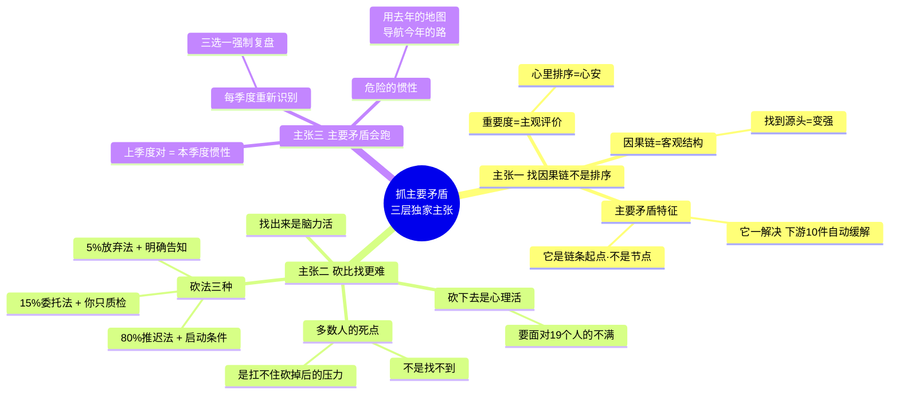
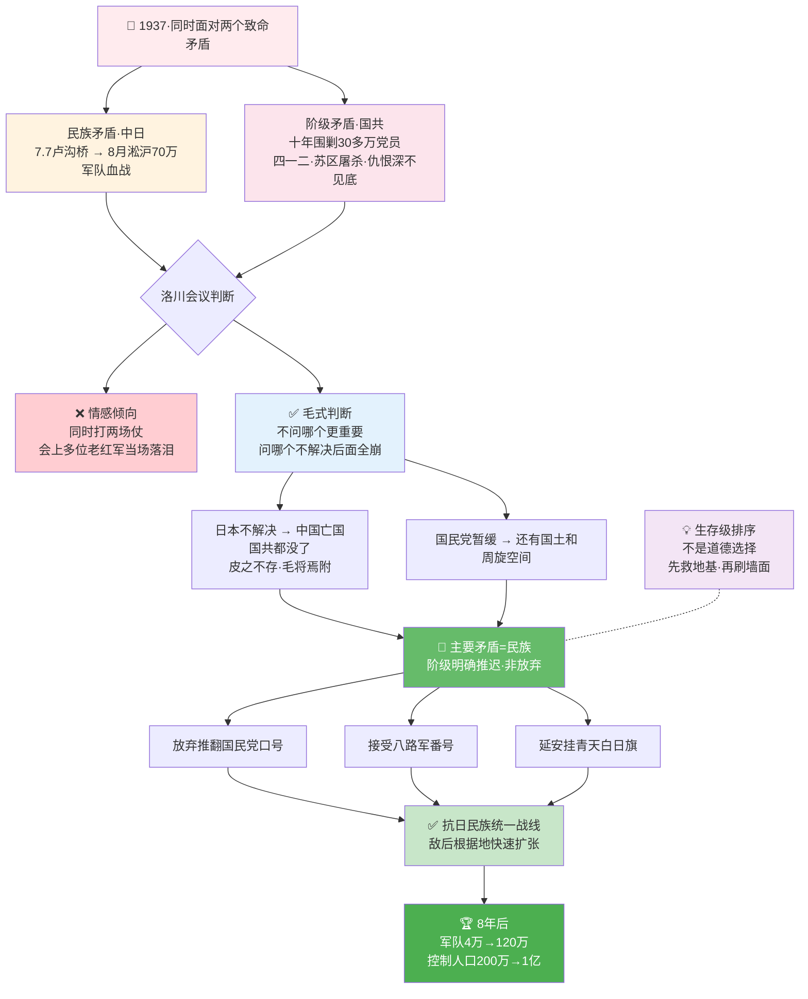
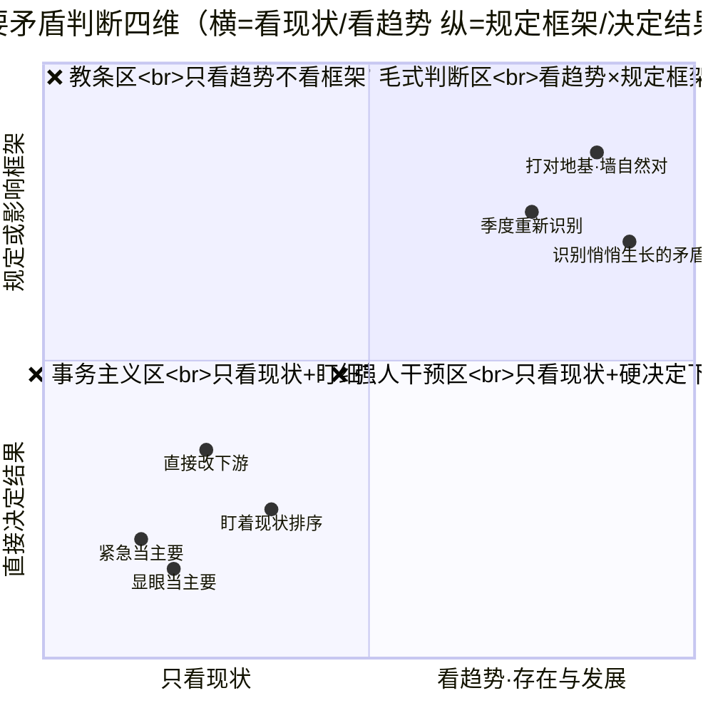
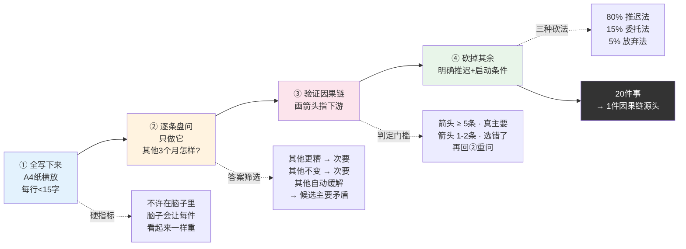
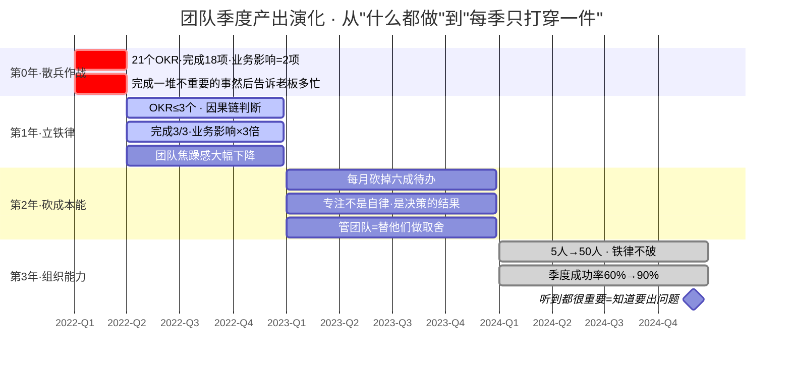
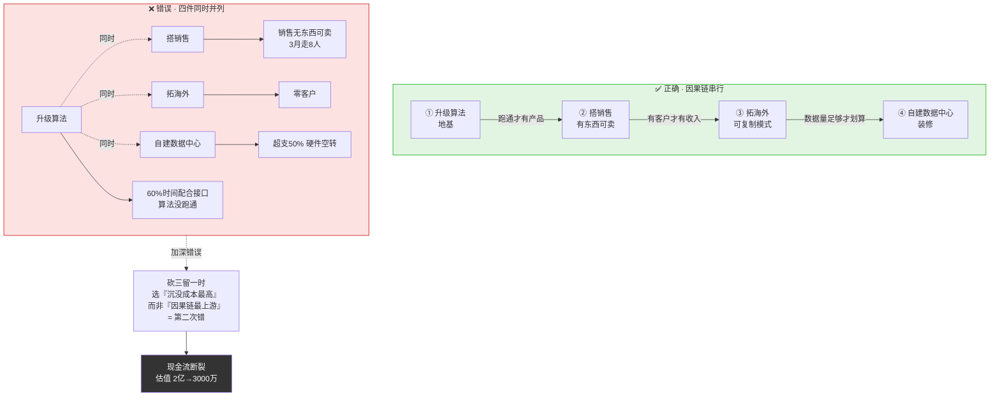
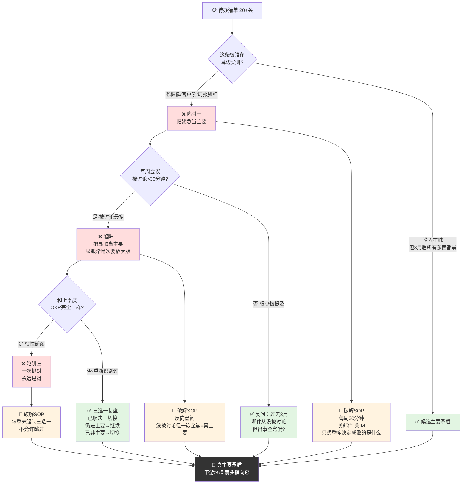

# 抓住主要矛盾法

- 01.一个季度三件事
- 02.市面误读之辨
- 03.三层独家主张
- 04.一九三七烽火
- 05.原文四维精读
- 06.噪音识别四步
- 07.每月砍掉六成
- 08.团队对齐聚焦
- 09.动态重新识别
- 10.一个反面教材
- 11.三个认知陷阱
- 12.三年认知复利
- 13.收束三句金言

## 01.一个季度三件事

去年第一季度，我在 OKR 里写了 7 个 Objective，每个下面挂 3 个 Key Result，总共 21 个待办。季度末复盘时发现——21 个里完成了 18 个，但真正对业务有影响的只有 2 个。另外 16 个就像空气一样，完成了也没人在意。

季度复盘会上老板说了句让我至今忘不了的话："**你完成了一堆不重要的事，然后告诉我你有多忙。**"我嘴硬："这些都是需求方提的啊。"他反问我："需求方提的需求里，哪一个不做到下季度公司会死？"

我答不上来。因为我从来没问过自己这个问题。我做的都是"别人让我做的"，不是"我自己判断出来必须做的"。

那个周末我重读《矛盾论》中关于主要矛盾的段落。毛泽东说得很清楚：**在复杂事物的发展过程中，有许多矛盾存在，其中必有一种是主要的，它的存在和发展规定或影响着其他矛盾的存在和发展**。我恍然大悟——我的 21 个待办不是 21 个独立任务，它们之间有因果关系。如果我能在季度初就识别出那个"**不做它其他都白干**"的一件事，我的整个季度都会不一样。

那个季度之后我给自己立了一条铁律：**任何季度 OKR 不能超过 3 个 Objective**。超过 3 个，说明你没想清楚什么是主要矛盾。**3 是一个人脑真正能同时专注的数量上限**——超过这个数，每一项的执行质量都会打折扣。这个铁律执行了三年，团队的季度成功率从 60% 拉到了 90%。不是因为团队变强了，是因为**每季度用的是 3 倍聚焦度打 3 件事，而不是 21 件事各打 1/7 的力气**。

## 02.市面误读之辨

市面上讲"抓主要矛盾"的人，最爱说两句话。第一句是"分清轻重缓急"。这句话听起来很有道理，但它把抓主要矛盾讲成了**排序题**。真正的抓主要矛盾不是把 20 件事按重要性排序然后从上往下做——而是在 20 件事里找出**有因果链条**的那一件。它不是因为"重要"才被选中，而是因为"它能引发连锁反应"。

第二句是"专注一件事"。这句话同样对，但同样没告诉你**怎么选出那一件事**。专注的前提是判断，判断的前提是分析。跳过判断直接讲专注，就是把方法论讲成了自律鸡汤。

这两种误读的共同病根是：它们把"抓主要矛盾"讲成了**个人习惯**，而不是**组织能力**。一个人专注是自律，一个组织专注是战略。市面书选择讲自律，因为自律只需要你一个人改变；讲战略需要你推动整个团队的优先级体系变革——后者难十倍。

真正能改变行为的解读，必须回答两个问题：**第一，用什么标准来判断哪一件是主要矛盾？第二，砍掉其余 19 件之后怎么让团队不恨你？** 这两个问题不回答，任何关于"专注"的建议都是空中楼阁。

## 03.三层独家主张

这篇文章想讲的"抓主要矛盾"，三层在市面几乎看不到：

**第一层，抓主要矛盾不是排序，是找因果链**。20 个待办里，绝大多数是独立事件——你做了 A 不影响 B，做了 B 不影响 C。但一定有一件是**因果链的起点**——它一解决，下游的十几件事自动消失或难度减半。它不是"最重要"的，它是"最要命"的。

**第二层，抓主要矛盾最难的不是"找到"，是"砍掉"**。你其实知道哪一件是主要的，但你不敢只做这一件。因为砍掉 19 件意味着你要面对 19 个人的不满，承 19 次"你为什么不做"的质疑。这不是脑力活，是**心理承受力**。大多数人不是找不出主要矛盾，是**扛不住砍掉次要矛盾之后的人际压力**。

**第三层，主要矛盾会跑**。上个季度的主要矛盾是这个季度的背景噪音。你今天用上一季度的判断来指导这一季度，等于在用去年的地图导航今年的路。**重新识别比一次找对更重要**。

三层独家主张思维图（因果链 · 砍的勇气 · 主要矛盾会跑）：

## 04.一九三七烽火

"抓主要矛盾"这个概念最经典的应用出现在 1937 年。**1937 年 7 月 7 日卢沟桥事变**，日本全面侵华。仅一个月后，**上海淞沪会战**打响，中国 70 万军队在长江口和日军进行了长达 3 个月的血战。此时中国同时面临两个致命矛盾：**民族矛盾（中日）和阶级矛盾（国共）**。党内很多人认为必须同时打两场仗——**既要抗日，也要推翻国民党**。理由充分：国民党过去十年围剿红军已经消灭了 30 多万共产党员，仇恨深不见底；而 1927 年"四一二"、1931 年的中央苏区大屠杀，每一次都是尸山血海——放下阶级矛盾去和国民党合作，从情感上是难以接受的。

毛泽东在**1937 年 8 月洛川会议**上做了一个所有数据都不支持的判断：**当前的主要矛盾是中日民族矛盾，国共阶级矛盾必须退为次要**。这个判断的代价是巨大的——红军要放弃"推翻国民党"的政治口号，要和打了十年血仗的敌人合作，要接受"八路军"这个国民党编制内的番号，要在延安挂青天白日旗。**会议上有多位老红军当场落泪**——他们无法接受和杀害自己战友的人合作。

为什么毛泽东敢做这个判断？**因为他分析的不是"哪个更重要"，而是"哪个不解决后面全崩"**。日本不解决，中国亡国，共产党和国民党都没了——**皮之不存毛将焉附**；国民党暂时不解决，至少还有一块国土和周旋空间。**这不是道德选择，是生存级排序**。他不是"原谅"了国民党，是把"打国民党"这件事**明确推迟**到民族矛盾解决之后。这个"推迟"不是放弃，是精确的时间排序——**先解决地基崩塌，再讨论墙面刷什么颜色**。

这个判断后来被证明是整个抗日战争战略的根基。没有它，就没有抗日民族统一战线，就没有八路军的合法地位，就没有敌后根据地的快速扩张。**八年抗战结束时，共产党军队从 4 万扩展到 120 万，控制人口从 200 万扩展到 1 亿**——这一切都建立在 1937 年那个艰难判断之上。毛泽东用一句话总结了这条方法论："**任何过程如果有多数矛盾存在的话，其中必定有一种是主要的，起着领导的、决定的作用，其他则处于次要和服从的地位。**"

1937洛川会议——地基崩塌先救地基·再讨论墙面刷什么颜色：

## 05.原文四维精读

> 原文："**在复杂的事物的发展过程中，有许多的矛盾存在，其中必有一种是主要的矛盾，由于它的存在和发展规定或影响着其他矛盾的存在和发展。**"

请注意毛泽东用的动词——**"规定或影响"**。不是"决定"，是"规定或影响"。这两个词的力度不同。主要矛盾不一定直接决定其他矛盾的走向，但它**设定了其他矛盾的运行框架**。就像季度的地基——地基定了墙的高度，墙的高度定了窗户的大小。你不需要直接管窗户，你只需要把地基打对。

再看一个被忽略的插入语——**"由于它的存在和发展"**。毛泽东强调的不是主要矛盾本身，而是它的**存在和发展**。这意味着两件事：第一，主要矛盾不一定是已经被所有人看见的那个，它可能正在**悄悄生长**；第二，你要关注的不是它现在的状态，是它的**趋势**。一个还在生长中的次要矛盾可能成为下个季度的主要矛盾，而你现在看到的"大问题"可能已经在萎缩。

这段话写于 1937 年 8 月的《矛盾论》。当时红军刚刚在陕北站稳脚跟，但面临三重危机：外部有日本侵略，内部有国民党围剿，党内有王明路线残余。毛泽东没有同时抓三件事——他做了一个极端的战略聚焦：**先解决"怎么活下来"，再解决"怎么打出去"**。他判断当前主要矛盾是生存，所以陕北根据地建设压倒一切。

这段话内部有一个张力：主次是动态的，但决策是一次性的。你做了一个判断之后可能要管一个季度甚至一年，而矛盾格局可能在你的判断做出之后三个月就变了。所以真正的高手不是做一次正确判断的人，是**能及时推翻自己判断的人**。每季度重新问一次"现在的主要矛盾还是上季度那个吗"，比一次找对重要十倍。

市面上把这句话翻译成"聚焦最重要的事"。这是**彻底错了**。"最重要"是主观评价，你可以在心里排个序就觉得自己完成了思考；但"主要矛盾"是**客观结构**，你必须分析事物内部的因果关系才能找到。两者的差距是，前者让你心安，后者让你变强。

四维精读象限——规定或影响 vs 决定 · 现状 vs 趋势：

**图眼**：毛的两个动词"**规定或影响**"（不是"决定"）+ 插入语"**存在和发展**"（不是"当前状态"）合起来是**同一个战略姿势**——**看趋势、打框架、放手让下游自己长**。你只需要把地基打对，墙的高度、窗户的位置自然被约束在正确区间。绝大多数人反着做——用"决定"的力度直接干预下游细节（第四象限），或者只盯现状忙于灭火（第三象限）——**动作越猛，离主要矛盾越远**。

## 06.噪音识别四步

怎么在 20 件事里找到那一件主要矛盾？我总结了四步操作法：

**第一步，把所有事写下来**。不许在脑子里想，必须落笔画纸上。**脑子会欺骗你**——它会让每件事都看起来差不多重要。只有当你把它们全写在一张纸上，你才能看见全貌。**具体动作**：拿一张 A4 纸横着放，把这个季度所有的"要做的事"用一行一行的方式列出来，每一行不超过 15 个字。不要分类、不要排序、不要评价——先只做穷举。

**第二步，逐条问"如果只做它不做别的，三个月后会发生什么"**。绝大多数条目的答案是"别的还是会发生"或"别的会更糟"。**只有一条的答案是"别的会自动缓解或消失"**——那一条就是主要矛盾。这个过程不需要任何天赋，只需要**耐心**——20 件事逐条问，每条 10 秒，一共 3 分钟。**关键点**：问的时候要具体——不是问"重要吗"（这是主观），是问"下游三个月会不会发生什么"（这是客观事实）。

**第三步，验证因果链**。你选出来的那一条，画一条箭头指向它影响的下游。**如果箭头能连到至少 5 条以上，它就是真主要矛盾**；如果箭头只连到一两条，你可能选错了。这一步是防止你把"看上去很硬"的事误当成主要矛盾——**真正的主要矛盾一定是因果链的源头，不是链条上的一个节点**。

**第四步，砍掉其余**。这是最难的一步。砍的标准不是"删除"，而是**"明确推迟"**——告诉所有人："这件事下个月做，不是我忘了，是我有意为之。"留下书面记录，让大家知道你做了取舍。**具体做法**：给每一个被推迟的事项加一个"启动条件"——比如"当主要矛盾 X 解决 60% 之后启动"、"当团队新增 2 个 HC 之后启动"、"当客户 A 数量达到 100 之后启动"。有条件的推迟不是甩锅，是**精确的时间管理**。

噪音识别四步 SOP + 判定门槛一图带走：

## 07.每月砍掉六成

抓主要矛盾不是一个季度做一次的决策，是**每个月都要重新审视的纪律**。我给自己定的规矩是：每月初把待办清单拉出来，**至少砍掉六成**。

这个动作看起来很极端，但其实它背后有一个物理学原理：**你的决策带宽是有限的**。一个人同时处理的事情超过 3 件，决策质量就会指数级下降。你每个月砍掉的六成不是"不重要的事"，而是**不值得你用最好的脑力去处理的事**——它们可以晚做、可以让别人做、可以在主要矛盾解决之后自动消失。

**很多人不敢砍是因为怕"万一漏掉重要的怎么办"**。但三个月之后回头看——那些你砍掉的，几乎没有一件是因为你砍了而真正出大事的。真正会出事的，在第一步分析时就会暴露——因为它一定在因果链上有多个下游指向它。**你砍掉的都是链条末端的叶子节点**，叶子节点掉了不会影响树干，甚至可能让整棵树长得更好。

具体的砍法有三种：**推迟法**（明确写在"下季度"清单里，附带启动条件）、**委托法**（找一个不那么擅长但可以做的人接手，你只做质检）、**放弃法**（明确告诉需求方"这件事我不做了"，让他们去找别的资源或者接受不做）。**80% 的事可以用推迟法，15% 可以用委托法，5% 必须用放弃法**——最后 5% 是最有勇气的部分，也是拉开一个人和另一个人差距的部分。

## 08.团队对齐聚焦

一个人的主要矛盾好抓，一个团队的主要矛盾难抓。因为每个人都有自己认为的"最重要的事"——**产品觉得是功能，研发觉得是性能，销售觉得是渠道**。三方都觉得自己在抓主要矛盾，结果是三组人往三个方向跑。

让团队对齐聚焦的方法只有一个：**不是说服他们，是让他们自己看见因果链**。把所有人都拉到一张白板前，让每个人写下自己认为的"主要矛盾"，然后一起画因果箭头。当箭头把三个答案串成一条线的时候——**销售渠道打不开是因为产品功能不完整，产品功能做不快是因为研发在修性能债**——所有人会同时看见：**真正的唯一答案是"修性能债"**。这种集体认知一旦形成，不需要任何人推，团队自己就会对齐。

**这个白板动作有三个关键**：**第一，人齐**——所有相关角色都到场，缺一个就没意义；**第二，写字不说话**——每个人先独立写自己的答案再拿出来看，避免被最先说话的人带偏；**第三，箭头必须画满**——不允许含糊的连接，每一条箭头都要有具体的因果证据（比如"性能债导致研发投入 60% 时间在修 bug"、"产品功能缺失导致客户流失率 20%"）。**证据不足的箭头是幻觉，不能作为决策依据**。

3 年团队演化甘特——21 件事 60% → 3 件事 90% 成功率：

**图眼**：**做的事少了 6 倍，业务影响反而大了 3 倍**——这就是因果链源头 vs 叶子节点的差距。第 1 年最难的是铁律本身（≤3 个 O），第 2 年最难的是砍掉六成的心理承受力，第 3 年最难的是**在众声喧哗中安静地说出那一件事的名字**。铁律执行 3 年，团队成功率从 60% 拉到 90%——不是团队变强，是**每季度用 3 倍聚焦度打 3 件事、而不是 21 件事各打 1/7 力气**。

## 09.动态重新识别

主要矛盾不是一层不变的。**一个季度前你的主要矛盾可能是"招人"，一个季度后可能已经变成"留人"**——因为你已经招到了，现在人在流失。如果不重新识别，你会把上一季度的惯性延续到这一季度，然后错过真正的战场。

每季度末做一次强制复盘：**现在的主要矛盾还是上季度那个吗？它是在变大还是在变小？有没有新的矛盾在生长？** 这三个问题的答案决定了你下个季度所有的资源分配。**具体做法**：拉一张两列表格——**左列**记录上季度的主要矛盾+采取的行动+当前状态；**右列**记录本季度候选的新主要矛盾+它的下游因果链+需要投入的资源。看完两列表格再决定——**要么继续追打上季度的矛盾，要么切换到新的**——但不允许两个都追（这就是分散兵力的自杀）。

**一个领导者的核心能力不是"做事多"，是每季度找对一次方向**。方向对了，你下面的所有人都不需要加班；方向错了，所有人加班都是白干。这就是为什么高层的"看方向"能力比中层的"做事情"能力更值钱——**方向错误的一年，是所有基层加班都无法弥补的**。

## 10.一个反面教材

2022 年一家 AI 创业公司拿到 B 轮融资 8000 万，CEO 同时启动了四件事：**升级算法、拓展海外市场、搭建销售团队、自建数据中心**。每一件事看起来都有充分的理由——**算法要升级**（不然产品跟不上）、**海外要拓展**（国内竞争太激烈）、**销售要搭建**（不然靠 CEO 一个人卖不动）、**数据中心要自建**（不然长期依赖云厂商成本太高）。

**但他犯了一个致命错误**——他把这四件事看成了"并列的四件重要事"，没有画因果链去看它们之间的依赖关系。**如果他画过因果链**，他会发现——**算法是所有下游的地基**：算法不跑通，海外拿什么去卖？销售拿什么去推？数据中心拿什么数据去存？**四件事的正确顺序是先算法，再销售，再海外，最后数据中心**——但他四件同时启动，等于把地基、墙、屋顶、装修同时开工。

**执行过程的具体细节**：半年后**算法没跑通**（团队 60% 时间在配合其他三个项目做接口和数据，没时间深挖模型）、**海外签了零客户**（因为拿不出可以卖的算法产品）、**销售团队烧了 300 万**（销售员每天在打电话但没东西可卖，士气崩溃 3 个月内 15 个人走了 8 个）、**数据中心超支 50%**（因为算法没跑通，实际数据量远低于预估，硬件白白空转）。

董事会逼他砍三留一，他选了最贵的那件——**自建数据中心**。理由是"沉没成本太高、砍掉损失太大"。**又过了三个月，数据中心建好了**，但算法没跑通之前数据中心完全空转。公司现金流断裂，估值从 2 亿腰斩到 3000 万。**他犯了双重错误**——**第一次**把四件事同时启动、**第二次**在被迫砍三留一时选了"沉没成本最高"而不是"因果链最上游"的那一件。

后来复盘时他自己承认：**"如果当初他把全部精力只放在'升级算法'这一件事上，后面三件根本不需要做"**——因为算法跑通了才有客户，有客户才有收入，有收入才需要数据中心。**他打反了因果链**。

因果链正确顺序 vs 错误并列，一图对撑：

这个切片揭示的规律：**抓主要矛盾的真正敌人不是"不知道哪件重要"，而是"舍不得砍掉那些看起来很硬的事"**。那些昂贵的错误，每一个都披着"战略级投入"的外衣——**投入越大，砍起来越难，砍不掉就变成一直失血的伤口**。

## 11.三个认知陷阱

**陷阱一：把"紧急"当"主要"**。老板催的、客户吼的、周报里飘红的——这些是紧急，不是主要。**紧急会尖叫，主要不会**。**识别方法**：主要矛盾往往是"没人在你耳边喊、但一旦不管三个月后所有东西都崩"的那件事。破解动作：每周花 30 分钟做"不催办的思考"——把邮件关掉、把 IM 静音，只想"这个季度真正会决定成败的是什么"。这 30 分钟是决策质量最高的 30 分钟。

**陷阱二：把"显眼"当"主要"**。最被讨论的那件事、最被诟病的那件事，常常是次要矛盾的放大版。**真正的主要矛盾经常藏在最不起眼的位置**——因为它太底层了，底层到没人觉得它是问题。**识别方法**：如果一个"问题"每周会议上都被讨论 30 分钟以上，它大概率不是主要矛盾——因为主要矛盾往往在被讨论之前就已经在决策系统里被识别、被处理、不需要每周被讨论。破解动作：反过来问"过去三个月哪件事从来没被讨论、但如果出了事所有人都完蛋"，那件事才是真的主要矛盾。

**陷阱三：抓到一次就以为永远是对的**。上季度的正确判断是本季度最危险的惯性。**每季度重新识别一次，比一次找对重要十倍**。**识别方法**：翻你上季度的 OKR 和这季度的 OKR，如果主要 Objective 完全一样，说明你没重新识别过——你只是在惯性延续。破解动作：每季度末强制做"三选一"复盘——上季度的主要矛盾是**已解决**（下季度切换）、**未解决但仍是主要**（下季度继续）、**未解决但已不是主要**（下季度切换到新的）。三选一不能跳过。

三陷阱决策树——一句话破解 SOP：

**图眼**：三条陷阱本质是三种"替代思考的省力方案"——用"谁在喊"替代因果分析（紧急→主要）、用"谁被讨论最多"替代结构判断（显眼→主要）、用"上次的答案"替代重新识别（惯性→主要）。三种省力方案都通向同一个失败——**你把决策权外包给了外界的噪音，自己只剩下执行**。破解只有一个字：**问**——每周问一次静音后的自己、每季问一次上季度的判断、每次开会问一次没被讨论的问题。

## 12.三年认知复利

那个季度之后，我把"主要矛盾"作为所有团队决策的第一道闸门。任何提案、任何需求、任何会议，我的第一反应永远是：**"如果这个季度只能做一件事，这件事是不是它？"** 这个习惯让我的团队从一个"什么都做、什么都半吊子"的团队变成了一个"每季度只打穿一件事、但打穿的质量极高"的团队。

**第一年的变化**：团队的季度产出从"完成 18/21 项"变成了"完成 3/3 项"，看上去做的事少了 6 倍，但对业务的影响反而大了 3 倍。因为**过去那 18 项里有 15 项是次要矛盾——完成也没人在意；现在这 3 项每一项都是因果链上游——完成一项就能让下游 10 项自动缓解**。

**第二年的变化**：我发现，当团队习惯了"只做一件事"之后，他们的焦躁感大幅降低。以前每个人脑子里装着 5 件事，每件都在催，每天都焦虑。现在他们知道**这周只做这一件**，其余的可以安心放下。**专注不是自律的结果，是决策的结果**——你替他们做了砍掉的决定，他们的专注自然回来。这个发现颠覆了我对"团队管理"的认知——**过去我以为管团队是激励他们更努力，其实管团队是替他们做取舍**。

**第三年的变化**：我带过 5 个人到 50 个人的团队，形成了一条铁律：**任何季度执行会上，我只要听到有人说"这些事都很重要"，我就知道这个季度要出问题**。"**都重要"等于"都不重要"**——真正负责任的判断必须是"我现在只做这一件，其余先放"。**能说出"我现在只做这一件"的人，是真正在做战略的人；说不出来的人，是被别人的优先级绑架的人**。

## 13.收束三句金言

**一句话核心**：**抓主要矛盾的本质不是选择做哪件，是选择砍掉哪 19 件**。**砍的勇气是稀缺的，而"做"的勤奋是廉价的**——所以真正的领导力体现在砍的能力上，不是做的能力上。

**你应该带走的三件事**：

**一，用因果链判断，不用重要度排序**：逐条问"只做它，其他会怎样？"只有一条的答案是"其他自动缓解"，那一条就是。**"重要度"是主观评价、"因果链"是客观结构**——只有后者能带你找到真正的杠杆点。

**二，砍掉比找对更需要勇气**：砍不下去不是判断力不行，是心理承受力不够。用**"明确推迟"**代替"删除"——推迟不是甩锅，是给每一个被推迟的事项加"启动条件"，让所有人知道这不是遗忘而是精确的时间管理。

**三，每季度重新识别一次**：上季度的正确答案是这个季度最危险的惯性。**做过三选一复盘**——已解决切换、未解决但仍是主要则继续、未解决但已不是主要则切换。三选一不能跳过。

**一句留给你的反问**：你手头这个季度正在做的所有事，**如果只能留下一件，留下哪件？** 如果你答不上来，你不是没时间，你是还没做那个**只有你能做的判断**。**领导力的第一道门槛，就是敢在众声喧哗中，安静地说出那一件事的名字**。**能说出名字的人是决策者，说不出来的人只是执行者**——这就是这套方法论最本质的分水岭。**从今天起就练起来——每周固定一个安静独立的时段问自己一次这件事的名字，直到答案能够不假思索地脱口而出为止**。
