# 30.动员群众指导法

> 动员不是你喊给多少人听，是**多少人听完之后能各自回答出"这件事成了，我会不一样"**。
> 会开完，PPT 讲完，只是动员的 1%；剩下的 99% 是一对一陪跑、示范先行、把"田"分到每个人手上。

- 01.翻车的全员大会
- 02.市面误读之辨
- 03.三层独家主张
- 04.两大文本现场
- 05.原文四维精读
- 06.一般号召之要
- 07.个别指导之难
- 08.双轨并行算法
- 09.南泥湾示范案
- 10.分田地才动员
- 11.三个认知陷阱
- 12.一个商业切片
- 13.三年认知复利
- 14.收束三句金言

## 01.翻车的全员大会

去年 Q3，我刚接手一个 60 人的中后台研发部门。上任第二周，我们要打一场硬仗——**三个月重构核心计费系统**。我踌躇满志地开了一场全员动员大会，PPT 做了 48 页，讲了战略意义、技术路径、成功标准。讲完我还激情加了一句："**这场仗打完，我们这个团队就会彻底翻身！**" 全场鼓掌。我带着一种上战场前的热血散会。

两周之后，第一个 milestone 过检——**80% 的模块进度延期，11 个关键任务无人认领**。我拉技术 leader 开复盘会，四个人低头不说话。憋了很久，一个资深工程师说了一句我至今记得的话："老板，你说的那个'翻身'——**是你的翻身，不是我的**。这个项目做完，我还是 P6，还是背这三个系统，加班量还多了 40%。**我凭什么拼？**"

那晚我回家，把《关于领导方法的若干问题》从书架上抽出来，翻到那一段："真正的铜墙铁壁是什么？是群众，是千百万真心实意地拥护革命的群众。""**任何工作任务，如果没有一般的普遍的号召，就不能动员广大群众行动起来。但如果只限于一般号召……就无法考验自己提出的一般号召是否正确。**"

我看了三遍，突然像被凉水浇头——我那场 48 页 PPT，干的是**"一般号召"**，完全没有做**"个别指导"**；更狠的一刀是——"真心实意地拥护"的前提是这场仗打完每个人都能"翻身"。**我只讲了"我"的翻身，一个字都没有讲"他"的翻身**。

那一刻我才意识到：我之前所有"动员经验"——开大会、讲愿景、画大饼——在毛主席的方法论里只占 1%。剩下的 99% 是我从来没干过的事：**把"我们要怎样"翻译成"你会怎样"，挑示范单元一对一陪跑，让胜利可见**。这三件事我一件都没干——把所有动员能量都耗在了那一场 48 页 PPT 上，以为讲完就万事大吉。

这一课最深的印象是——**动员从来不是"开一场会"这么简单的事，它是一个完整的系统工程**。

## 02.市面误读之辨

市面上关于"动员"的解读，九成都在做同一件事——**把它翻译成"激励技巧"**：动员要讲愿景、要打动人心、要让团队相信我们能赢。这些话都没错，但它们**是正确的废话**。它们让你点头，却不告诉你周一早上具体要做什么——开几次会？跟谁谈？谈什么内容？谈不下来怎么办？

**第一，它把动员讲成了"情绪唤起"**。放段视频、讲个故事、喊句口号，大家激动一下——这叫**情绪动员**。**它能持续 24 小时，第三天就消散**。毛主席的动员根本不是这个。他的动员是靠减租减息让农民看到分得见的好处、靠打土豪分田地让每个具体的人拿到具体的东西。**真动员永远是利益结构的重新分配，不是话术**。

**第二，它把动员讲成了"一场会"**。开完动员大会，PPT 一发、鼓一鼓掌、合影一拍，事就算办了。但毛主席的动员从来不是一次性事件——**它是一般号召 + 个别指导的持续双轨运行**。会只是开始，真正的动员发生在会后每一次一对一里。

为什么这种"激励技巧"翻译最流行？因为它**最安全**。说"要打动人心"不会得罪任何人，也不需要作者自己拆过 60 个人的动员清单。读者读完觉得"很有道理"，第二天合上书继续开 48 页 PPT 大会。**这种"读了等于没读"的体验，是市面书的核心商业模式**。

真正能改变行为的解读，必须做两件市面书不愿做的事：**第一，承认动员的本质是"利益对齐工程"**——回答不了"每个人打完能拿到什么"就别开动员会；**第二，讲清"一般号召"和"个别指导"为什么必须双轨**——单轨永远跑不赢。这两件事都会得罪人（老板不愿意分田、干部不愿意下地），所以市面书选择回避。

## 03.三层独家主张

这篇文字要讲的动员思想，和市面书完全不同。我想讲三层市面很少讲、但真正决定生死的东西：

**主张一：动员是利益对齐工程，不是情绪渲染**。它追问的不是"你怎么把人讲热血"，而是"**在这场仗结束之后，每一个具体的人会得到什么具体的好处**"。回答不出来，再煽情的话都是空气。农民相信毛主席不是因为他讲得好，是因为**斗倒地主当天就分地、地契当天就发到手上**。

**主张二：动员必须双轨——一般号召 + 个别指导，缺一不可**。一般号召是空中的方向，个别指导是地面的陪跑。**只有一般号召是官僚主义（号召贴满墙，地面一动不动）；只有个别指导是救火队员（孤军作战，没有方向）**。双轨并行才是毛主席真正的动员算法——号召 = 假说，示范 = 实验，两者互为验证。

**主张三：动员最锋利的地方是"分田地"三个字**。真正的陷阱不是讲不好愿景，而是**你根本没有"田"可以分**——升职、加薪、自主权、可见度、成长机会。没有这些"田"做底层支撑，你说什么都是空头支票，**越喊越招人厌**。CEO 没预算不是借口，毛主席当年的田也不是天上掉下来的——**是从地主那里斗来的**。

三层独家主张思维图（利益对齐 · 双轨并行 · 分田地）：

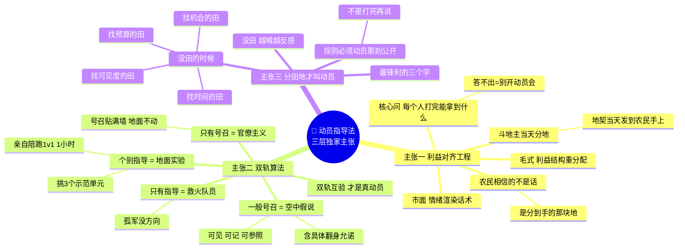

## 04.两大文本现场

毛泽东动员思想的第一座高峰，出现在《为动员一切力量争取抗战胜利而斗争》（**1937 年 8 月 25 日**）："中国共产党以满腔的热忱向中国国民党、全国人民、全国各党各派各界各军提出彻底战胜日寇的抗日救国十大纲领……**必须抛弃单纯政府抗战的方针，实现全面的民族抗战的方针**。"

背景是 1937 年卢沟桥事变后，日军全面侵华。国民党推行"**片面抗战路线**"——只依靠政府和军队，不发动群众。毛泽东提出针锋相对的"**全面抗战路线**"，这段话的潜台词是——**不动员普通人的国家不可能打赢一场全民族战争**。这是"为什么"的原点。

第二座高峰是《关于领导方法的若干问题》（**1943 年 6 月 1 日**）："我们共产党人无论进行何项工作，有两个方法是必须采用的，一是**一般和个别相结合**，二是**领导和群众相结合**……在我党的一切实际工作中，凡属正确的领导，必须是从群众中来，到群众中去。"

背景是 1943 年抗战进入相持阶段，党内主观主义、官僚主义盛行——干部一接到指示就开会、贴标语、写决议，但从来不下地。毛泽东在整风运动中系统总结群众路线和科学领导方法。这段话是"**具体怎么做**"的操作系统。

**这两段是动员思想的双子塔**——前者讲"为什么要动员所有人"（不动员就打不赢），后者讲"具体怎么动员"（一般 + 个别双轨）。读懂这两段，整个毛主席动员体系就立得住了。市面书往往只讲第二段（因为它像方法论），但脱离第一段的"为什么"，方法论只剩空壳——你根本不知道自己动员的是"全民族"还是"办公室里那 20 个人"。

动员思想双子塔一图看清 · 两大文本各回答动员的一半：

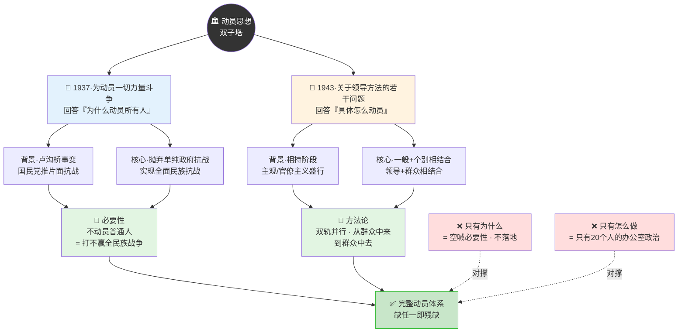

## 05.原文四维精读

下面是《关于领导方法的若干问题》最硬核的四段原文，我从**号召、双轨、试金、循环**四个维度拆透。

**号召。** "任何工作任务，如果没有一般的普遍的号召，就不能动员广大群众行动起来。"毛泽东先把"号召"的必要性钉死。反共识：**没有号召的组织不叫组织，叫散兵游勇**。今天很多创业公司迷信"结果导向、少开会"，结果每个人都在做自己以为对的事——**没有统一号召，等于每个师往不同方向冲锋**。号召是组织的第一根脊椎骨。

**双轨。** "但如果只限于一般号召，而领导人员没有具体地……取得对于工作的一般号召的具体指导……那就无法使一般号召见之于实行。"重点在"**只限于**"三个字——**只号召不行，只指导也不行，必须双轨并行**。反共识：大多数管理者的时间分配是错的——90% 花在号召上（开会、写邮件、发战报），10% 花在个别指导上（一对一）。**毛主席的分配是反过来的**。号召只是启动信号，个别指导才是主战场。

**试金。** "**就无法考验自己提出的一般号召是否正确**"——请注意四个字："**考验自己**"。这是被市面解读最忽略的字眼。它的潜台词是：**你提的一般号召正不正确，不是你自己说了算，要靠"个别指导"去验证**。个别指导不只是"补充"，它还是号召的**试金石**——如果你只喊号召不做示范单元，你永远不知道这个号召在地面是不是行得通。**号召 = 假说，示范 = 实验**，这才是这段话最深的一层。

**循环。** "在此过程中，同时又要就一般号召的某些环节加以补充和修正，以便更加充实和发展该项一般号召。"号召不是一次发完就完事，是**"号召→示范→修正→再号召"的循环**。反共识：CEO 最忌讳的两句话是"我上次不是讲过了吗"和"这个方向已经定了"。**真正的号召是活的、要修正的、要在地面反馈里长大的**。冻结号召的那一刻，动员就死了。

四维原文一图串起 · 号召/双轨/试金/循环的闭环结构：

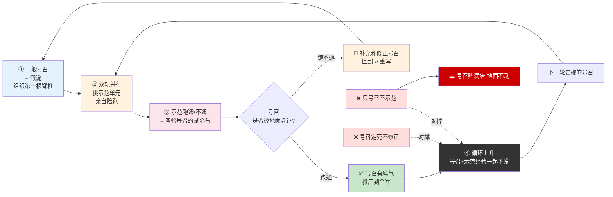

号召 vs 指导的时间分配象限——两种错误主义与真正动员者：

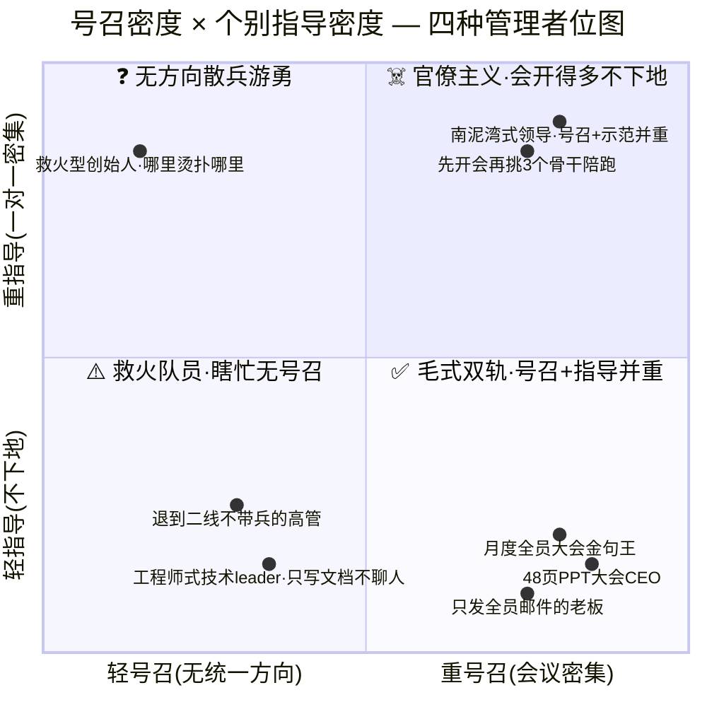

## 06.一般号召之要

一般号召不是"全员邮件"。**它必须做到三件事，缺一即哑**：

**① 可见**——团队里每一个人都能看见，不仅高管能看见，一线工程师也能看见。你在管理层会议上讲得再好，一线不知道，等于没号召。**信息不到一线的号召，是自己感动自己**。

**② 可记**——一句话讲完，听完三天后还能复述出来。你讲了 48 页 PPT，别人记不住一个字，等于没号召。**记不住的号召，等于没发过**。毛主席的"打土豪、分田地""抗日救国十大纲领""发展经济，保障供给"——都是一句话就能钉在墙上的。

**③ 可参照**——任何一个人遇到选择困难时，可以拿这个号召去对照"**我现在做的事，是不是在这条号召上**"。号召不是给管理层看的战略文件，是给一线在具体动作里做取舍的**罗盘**。参照不了的号召，只是墙上的装饰。

毛主席当年发号召，从来不是"为了党的事业"这么空。他会说"**打土豪、分田地**"——**每个字都对应一种具体可摸到的好处**。映射到现代组织里，号召里必须包含"**打赢之后每个人能拿到什么**"的具体允诺。不是"我们要做行业第一"，是"**做完这一仗，前 5 名拿团队 50% 的奖金池**"；不是"我们要技术领先"，是"**做完这一仗，3 个人晋升 P7 名额已经申请下来**"。

**没有具体翻身允诺的号召，是空头支票，越喊越招人厌**。

还有一条被完全低估的原则——**频次密度**。一次说完叫公告，反复说才叫号召。毛主席的号召会通过《解放日报》、广播、宣讲队、整风学习等几十种渠道反复打到每个根据地——**频次密度本身就是动员的一部分**。你一次讲完就以为动员完了，那是把号召当广告发了一次，不是当军旗插了一年。

一般号召三要素一图带走 · 空口号 vs 真号召的判定门槛：

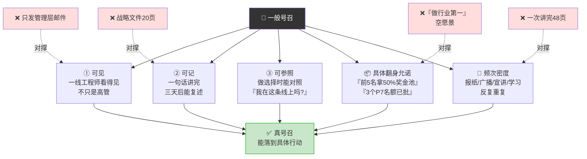

## 07.个别指导之难

**这是市面解读最缺的部分**。一般号召容易喊，**个别指导是真正难的那一半**。难在三点：难在"挑对示范单元"，难在"愿意亲自下地陪跑"，难在"跑通后愿意花力气推广"。

**难点一：挑对示范单元**。毛主席南泥湾选 359 旅，不是随手挑的。他的标准是三条：

- **骨干够强**——王震带的队伍执行力顶级，**示范单元必须是最有可能跑通的那一支**。挑最弱的去示范，跑不通全军动摇；
- **环境最难**——南泥湾是当时最荒凉的地方，**示范单元必须挑硬的打**。挑容易的别人不服——"你们条件那么好当然做得到"；
- **可观察可复制**——地理位置离延安近、可以现场参观、经验可以总结成文件。**示范的目的不是让示范单元自己爽，是让别人来学**。

三条都达标的，才是合格的示范单元。三条缺一的示范，跑通了也没用。

**难点二：愿意亲自下地陪跑**。挑出示范单元后，毛主席不是放手不管。**他派最高规格的资源进去**——给装备、给政策、给文件、给宣传支持，朱德、王震亲自督阵。映射到现代组织里，挑的示范单元必须**亲自每周一对一陪跑 1 小时，扫一切外部障碍**（跨部门推诿、资源不到位、老板临时插一脚）。不能挑完就丢给他，否则示范单元自己也跑不出来。**你派谁去陪跑，本身就是号召的一部分——CEO 亲自陪跑的项目和 HR 陪跑的项目，团队立刻就能读出信号差**。

**难点三：跑通后愿意花力气推广**。南泥湾跑通后，毛主席立刻让《解放日报》连续报道、组织各地参观团、把"南泥湾经验"写成文件下发。**示范单元的真正价值，不在它自己跑通，在它被复制**。如果示范单元跑通后你不去总结推广，等于跑了一场孤勇者的私人马拉松——**示范就变成了个人英雄，不是组织能力**。

一个残酷的判定标准：**你上一个"示范单元"跑通后，你亲自组织过几场分享会？写过几份复盘文件？发起过几次跨团队参观？** 数字都是 0 的话，你根本没做个别指导，你只是在挑人扛雷。

个别指导三大难点闭环 · 挑/陪/推缺一即断：

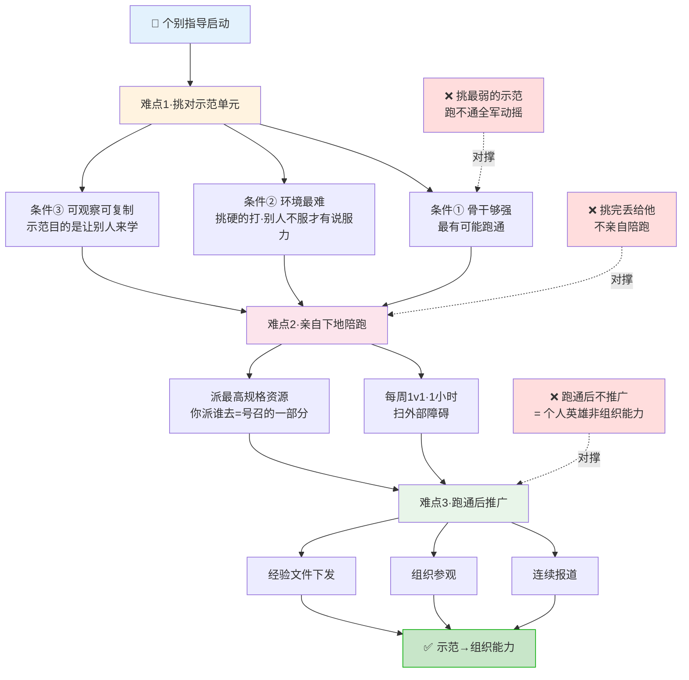

## 08.双轨并行算法

**这一节单独拿出来讲，因为它是整个动员思想最被忽视、也最有杀伤力的一段**。

**一般号召和个别指导，在管理动作里是两条互相依赖的腿——不是可选题，是必答题**。

一般号召是"空中动作"，个别指导是"地面动作"。**只飞第一次停在半空喊话，永远不知道号召在地面是不是行得通；只走第二次埋头蛮干，一年之后发现全公司还有几百人根本不知道你在打什么仗**。两边都缺是平庸，只缺一边是危险，**两边都有才是高手**。

很多人把两者当"两级台阶"——先讲清愿景，再一对一落实。这是错的。毛主席的原意是**两条腿同时迈**，号召会开完的当天下午就要挑示范单元，示范单元跑到第二周就要修正号召，**号召和示范之间是活的循环，不是先后的流程**。

**最终标准**：真高手能在两条腿之间反复横跳——号召建立方向感，示范验证方向感，示范暴露的问题反哺号召的修正，号召的修正又推动新一轮示范。**配合越紧密，动员密度越高**。这就是毛主席讲的"从群众中来，到群众中去；把群众的意见集中起来，又到群众中坚持下去"的活循环。

双轨并行算法 · 两条互相依赖的腿·缺一即残：

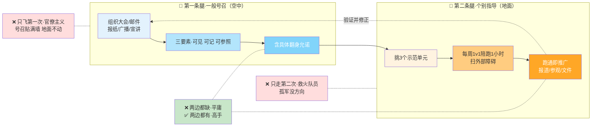

## 09.南泥湾示范案

**1941-1942 年**，日伪军对抗日根据地实行"三光政策"，国民党对陕甘宁边区经济封锁。当时的边区流传一句话——"**没有衣穿，没有油吃，没有纸，没有菜，战士没有鞋袜**"。核心问题极其残酷：**如何打破经济封锁，保障军民基本生活，坚持长期抗战？**

毛泽东提出总方针"**发展经济，保障供给**"——八个字，一句话，可见、可记、可参照，这就是一般号召的样本。号召通过《解放日报》社论、干部大会、群众大会等**几十种渠道**普遍宣传，频次密度打满。

方法上采取了教科书级的**双轨策略**：

- **典型示范**——首先在 **359 旅、中央机关**等单位试点。359 旅（王震部）开赴南泥湾垦荒，**三年开荒 26 万亩**。取得经验后召开现场会推广"南泥湾经验"，各地组团参观。
- **个别指导**——各级干部深入基层帮助群众解决具体问题。**毛泽东、朱德等领导人亲自种菜、纺线**——领导亲自下地本身就是最强的动员信号。

在保障维度上，动员被三重钉死：**实行减租减息政策**减轻农民负担（这是农民的"田"）；建立生产委员会、变工队等**组织**加强生产领导（结构性动员，不是个人英雄）；开展**劳动英雄表彰**活动调动积极性（可见度的田）。

结果——**1943 年，陕甘宁边区粮食产量达 184 万石，比 1940 年增长 40%；棉花产量达 300 万斤，实现自给自足**。更重要的是政治和思想上的收获——改善了军民关系，巩固了根据地，培养了"**自力更生、艰苦奋斗**"的延安精神。

**这一案例的结构极其完整**——目标清晰（发展经济保障供给）、主体到位（359 旅+机关+群众三层）、双轨方法（号召+示范）、政策保障（减租减息+表彰+组织）。**它是动员思想最经典的一次落地——四个维度缺任一，都不会有 1943 年的这份成绩单**。

南泥湾动员案 · 四维完整闭环拆解：

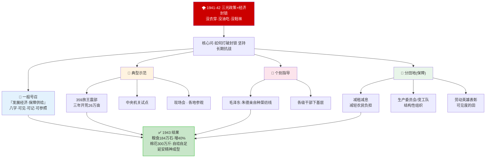

## 10.分田地才动员

这是从毛主席动员思想里能提炼出**最锋利的一条**——

**只有"分田地"才叫动员，不分田地都叫说教**。

农民为什么相信毛主席？不是因为他讲得好，是因为"**斗倒地主当天就分地，地契当天就发到农民手上**"。**动员的信号从来不是话，是当天到手的东西**。你在会上讲一万遍"打完这场仗大家都有回报"，都不如项目启动当天把奖金池分配规则、晋升名额、决策权下放清单**当众公布**——一次公布，胜过一百次口头承诺。

**CEO 最常见的借口是"我没有田可分"**——业务还没赚钱、奖金没有空间、晋升 quota 收紧。这是事实，但不是借口。**毛主席当年的"田"也不是天上掉下来的——是从地主那里斗来的**。映射到组织里，就是"田"有四种形态，没预算的公司也能找到：

- **① 预算的田**——把 A 项目的预算挪到 B 项目，为核心团队单独设立独立奖金池，用内部计价机制买时间；
- **② 机会的田**——把更高的决策权下放给关键骨干，让骨干做小项目 leader，放开新方向让他们探索；
- **③ 可见度的田**——让骨干在客户面前单独出场，让骨干做技术评审主讲，让骨干代表跨部门发言；
- **④ 时间的田**——每周半天自由探索时间，免加班日、免会议日，主动帮扫外部会议。

**没有田的时候，先问自己有没有把这四种田找一遍**。一种都没有，那这场战不是动员能解决的，你缺的是资源不是话术。

最忌讳的是——**"先动员，到时候再说"**。农民为什么相信毛主席？因为斗倒地主当天就分地，不是"你们先打仗，胜利之后再分"。映射到组织里，**晋升、奖金、自主权这些"田"的分配规则，必须在动员那一刻就公开**。等项目结束才说，骨干心里早就凉了——**延迟兑现的承诺 = 提前失效的动员**。

四种"田"清单一图带走 · 没预算/没quota时也能找到的动员抓手：

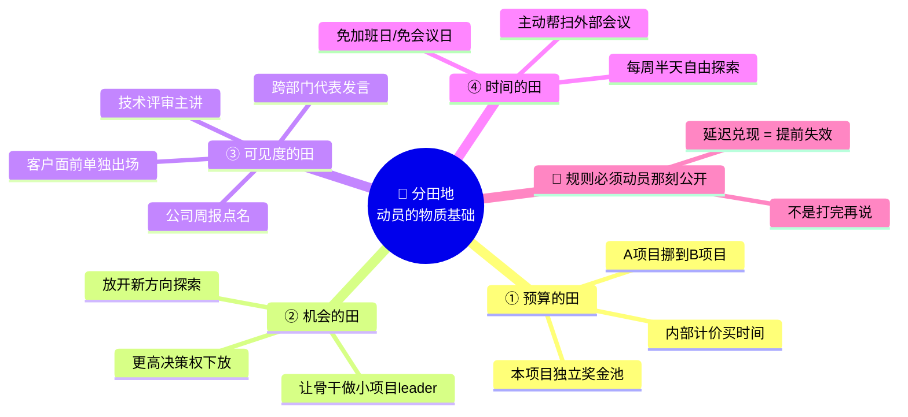

## 11.三个认知陷阱

读了动员方法的人很多，但大多数仍然掉在三个陷阱里：

**陷阱一：把"开了会"等同于"动员了"**。48 页 PPT 念完全场鼓掌散会，你以为动员结束了。其实动员才刚刚开始——**真正的动员发生在你和每一个骨干一对一的 45 分钟里**。会上你能讲到的东西，每个人最多记住 5%；只有面对面问"**你怎么看**"，那 95% 才能补回来。**识别方法**：开完动员会后问自己"接下来一周我会单独约几个人"，答案是 0 的话，你开的不是动员会，是**公告会**。

**陷阱二：只讲"我们要做什么伟大的事"，不讲"做完之后每个人能拿到什么"**。**愿景能管 24 小时，利益管 24 个月**。毛主席发动农民不是靠"建设新中国"，他靠的是"分田地"。**农民相信的不是话，是分到自己手上的那块地**。**识别方法**：动员讲完后让团队复述"做完这件事我能得到什么"，说不出具体的好处，你的动员是空的。

**陷阱三：号召发完后立刻全军压上，没有示范单元先跑通**。南泥湾不是 359 旅加全军加全机关同时上，是**先 359 旅一支示范，跑通三个月后再全面推广**。先示范的好处是——任何方案在地面都会暴露你没想到的细节，让示范单元踩完坑，全军才不会摔。**识别方法**：项目启动时问自己"我有没有挑出 3 个示范单元专门陪跑两周"，没有就是把全军一次性推上没演练过的战场。

三个认知陷阱决策树 · 检验你开的是动员会还是公告会：

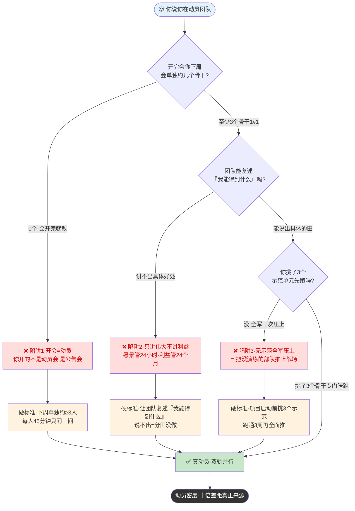

## 12.一个商业切片

我 2022 年接触的一家创业公司，500 人。CEO 是个金句王——**每个月一次全员大会、每季度一次全员战略宣讲**，金句频频、视频感人。但一年下来，公司业绩不升反降，核心团队走了 30%。

我去帮他们做组织诊断，做完最直白的一句话是——"**你们的动员只有'一般号召'，没有'个别指导'，更没有'分田地'**。"具体看三条：

- **一般号召侧**——CEO 一年讲了 11 次大会，PPT 一次比一次激动人心；
- **个别指导侧**——核心 20 个骨干过去一年 CEO 单独聊过的不到 5 个，其余都委派给了 HR 和直线 leader；
- **利益对齐侧**——这一年**没有调薪、没有晋升、奖金缩水 40%**——但这件事 CEO 只在大会上轻飘飘提过一句"今年大家都辛苦了"。

结果是金句越喊越多，团队越来越冷。一个高级工程师离职面谈时说的话，可以刻在墙上："**老板讲得好听，但我背的事一年比一年多，钱一年比一年少。我又不是为了听演讲来上班的**。"

从这个案例能提炼两条铁律：

**铁律一：没有"分田地"的号召都是噪音**——**利益不到位的时候，号召发得越频繁，团队越反感**。因为每一次开会都是在提醒团队"你们又要免费加班了"。CEO 以为在鼓劲，团队感受到的是消耗。

**铁律二：CEO 的时间分配决定了组织的真实战略**——一年开 11 次大会但单独陪跑不到 5 个骨干，这本身就是在告诉团队"**我重视形式不重视你**"。**动员的真正信号不是会议规模，是 CEO 的日历**。看一个老板真正在动员什么，别听他讲什么，看他日历上写着什么。

500 人金句王 CEO 的动员崩盘链路 · 一图看清"三缺"的结构性问题：

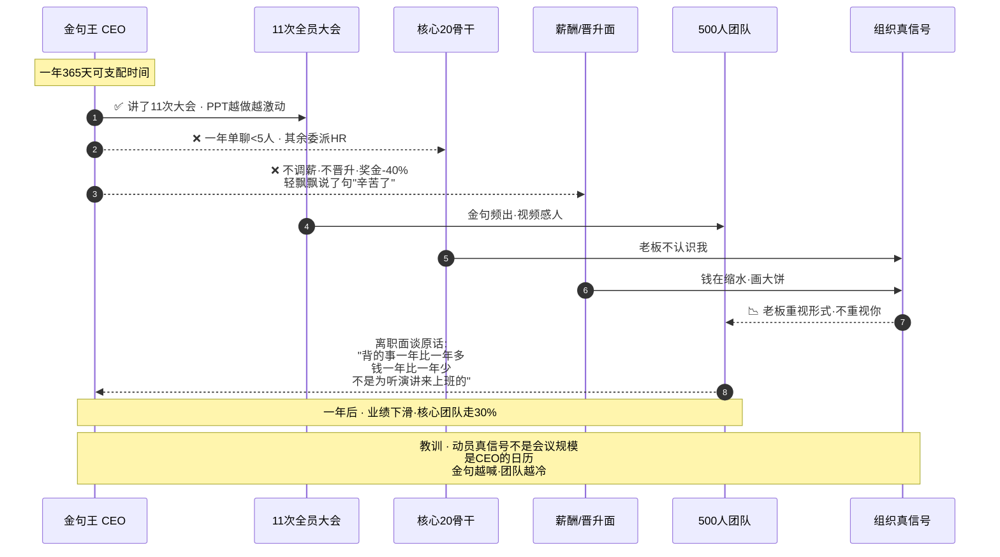

## 13.三年认知复利

那次翻车之后，我在白板正中间用红笔写了五个字：**"你凭什么拼？"** 这五个字成了我以后所有动员会召开之前必须回答清楚的**底线问题**。我一对一把所有 15 个骨干都约了一遍，每人 45 分钟，只问三个问题：**这场仗对"你"来说打赢意味着什么、你最担心的是什么、我能帮你争取到什么**。

第二个月，我把动员拆成三条线落地。**一般号召线**改为每周 3 分钟战报——不再一次性吹 48 页 PPT。**个别指导线**挑了 3 个最积极、最有上升欲望的资深工程师做示范单元，把最难的 3 个模块交给他们，我自己每周跟他们一对一深聊 1 小时，帮他们扫一切外部障碍。**利益对齐线**争取到两个晋升名额加一笔小奖金池，**把分配规则当众公开**——谁的模块准时上线、谁带了新人、谁接了最烫的手，谁就排在前面。

这个月末，那 3 个示范单元率先跑通，剩下的人开始主动问"那我能不能接 XX 模块"——**不是我在推他们，是他们在拉自己**。这就是"一般号召与个别指导相结合"的威力——**先用 3 个人的真成功去击穿另外 57 个人的不信**。半年过去，那个计费系统按时上线，故障率比老系统降 60%。但对我个人来说，比项目结果重要 10 倍的是一件事——**我拥有了一个会自己动起来的团队**。

**这个发现让我重新理解了"领导力"**——领导力的真相不是你有多会讲话，是你有多少人愿意为你多走一步。而愿不愿意多走一步，从来不看你的口才，看你的三张表：号召表、示范表、分田表。**三张表填满，团队就动；填不满，讲破嘴皮子也没用**。

三年之后，我形成了一套几乎条件反射的动员习惯——任何项目启动前先列**三张表**：

- **一般号召表**——一句话项目愿景 + 三档量化目标；
- **示范单元表**——挑 3 个谁、陪跑节奏、首战时间点；
- **利益对齐表**——晋升名额、奖金池、新机会，明确到人。

**三张表填不完不启动**。这个习惯让我避免了我职业生涯里至少 10 次重大失败。我以前以为"动员"是技巧，现在我明白——**动员是一门关于"看见每一个具体的人"的功夫**。看不见人，再响亮的口号都是自己感动自己。

动员前三张表启动清单一图带走（一张没填不开工）：

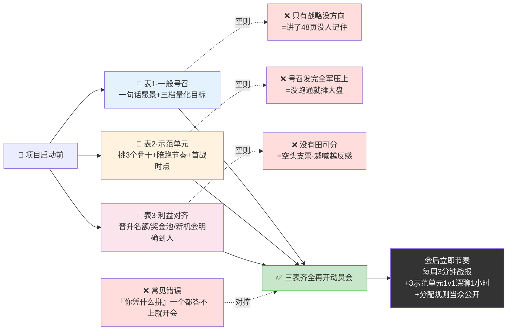

## 14.收束三句金言

**一句话核心**：**动员不是你喊给多少人听，是多少人听完之后能各自回答出"这件事成了，我会不一样"**——认识不到这一层，你开的所有动员会都只是公告会。

**你应该带走的三件事**：

**一、动员是利益对齐工程，不是情绪渲染**：任何动员开场之前先回答"他凭什么拼"——把每个关键角色列出来，挨个回答这五个字。回答不出来就先别开会，先想清楚再开。

**二、双轨并行——一般号召 + 个别指导，缺一不可**：全员会、周报、战报是空中的一条腿；挑 3 个示范单元亲自陪跑是地面的另一条腿。**只有空中是官僚主义，只有地面是救火队员**——两条腿同时迈，才是毛式动员。

**三、分田地才叫动员，不分田地叫说教**：晋升、奖金、决策权、可见度、时间——四种田找一遍。**分配规则不是等项目结束再想，是要在动员那一刻就写在黑板上**。延迟兑现的承诺，等于提前失效的动员。

**一句留给你的反问**：你下一场动员会的核心 5 个骨干里，你能为每一个人具体回答"他凭什么拼"这五个字吗？**一个都答不上来，先别开会——你的问题不是话术，是你还没看见这些人**。
