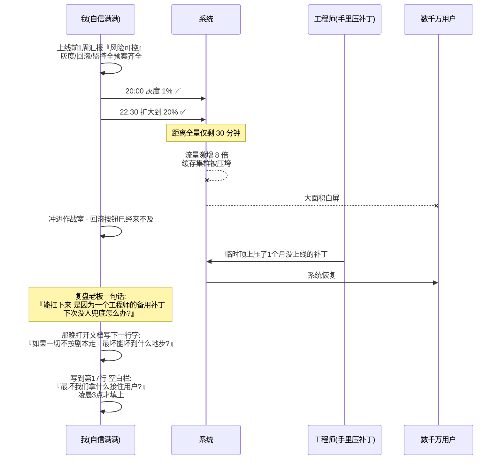
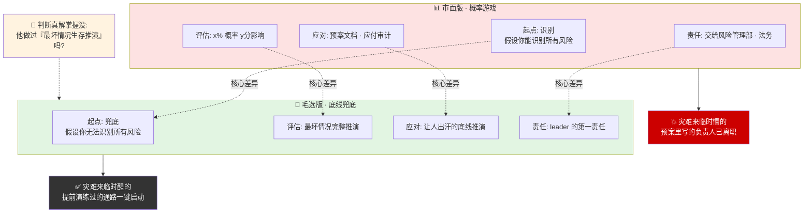
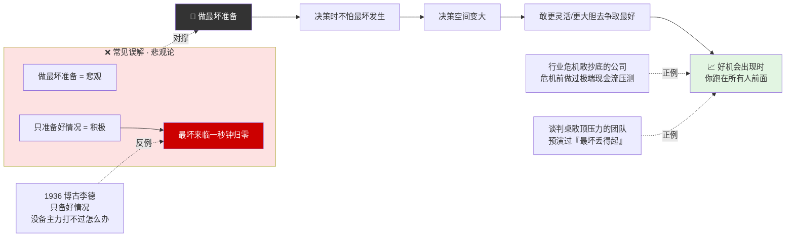
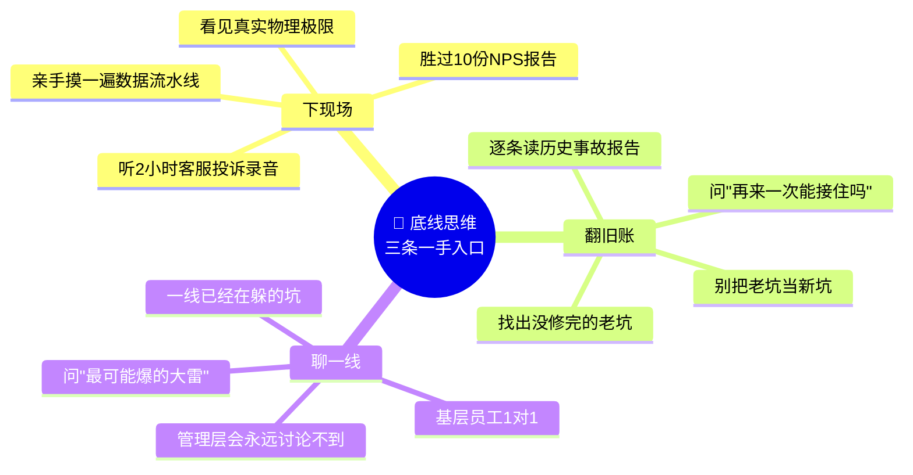
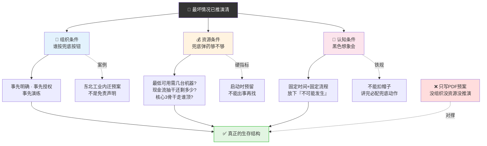
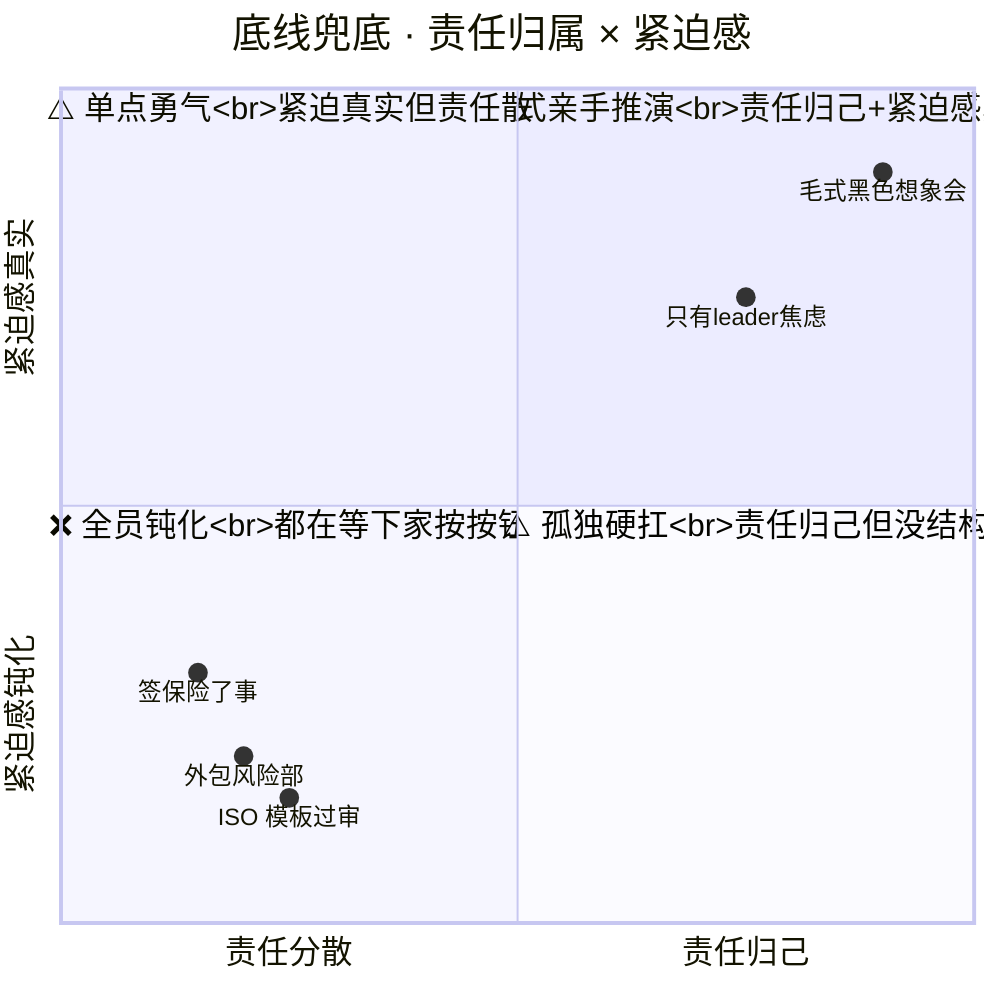
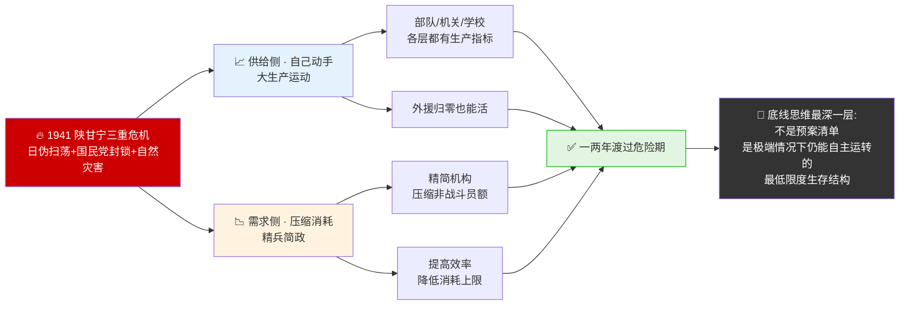
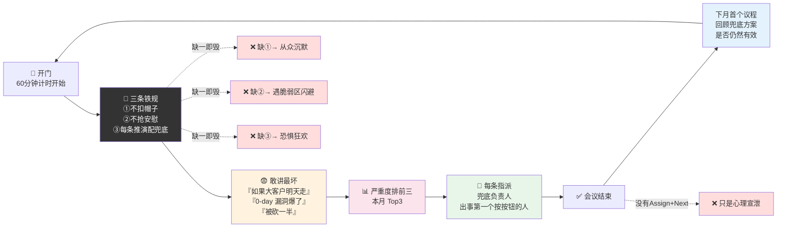
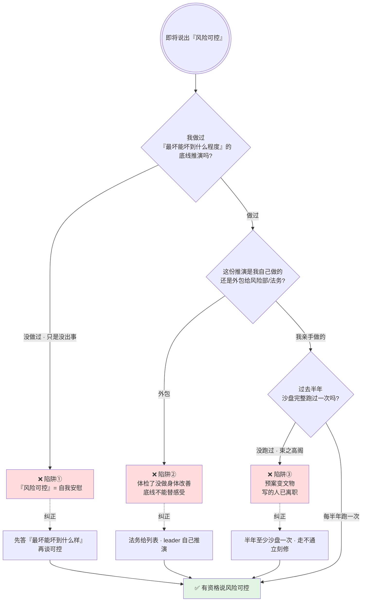

# 35.风险底线管理法

> 风险管理的核心不是预测，是**底线兜底**——宁可把最坏情况想在前面，也不要等发生了才问"怎么会这样"。**没做过最坏推演的人灾难来临是懵的，做过的人灾难来临是醒的**。

目录介绍
- 01.没想到差点要了命
- 02.市面误读之辨
- 03.三层独家主张
- 04.两次反共高潮现场
- 05.原文四维精读
- 06.调查研究是底盘
- 07.向最坏处作准备
- 08.底线不能被外包
- 09.精兵简政示范案
- 10.一个商业切片
- 11.黑色想象会制度
- 12.三个认知陷阱
- 13.三年认知复利
- 14.收束三句金言

## 01.没想到差点要了命

那年我主导一个核心系统的重大升级。整个项目周期 4 个月，上线当天预计影响数千万用户。上线前一周，我们做了完整的灰度计划、回滚预案、监控看板，我自信满满地跟老板汇报："风险可控。"

上线那天晚上 8 点开始灰度 1%，数据一切正常。10 点半扩大到 20%。距离全量只剩 30 分钟，监控屏上突然炸了——流量激增 8 倍、代码超过极限直接压垮缓存集群、用户端大面积白屏。整个团队冲进作战室，回滚按钮已经来不及了。最后不是靠回滚——**是靠一个工程师手里压了一个月没上线的补丁，临时顶上去了**。上线后的复盘会上，老板说了一句话："这场仗能扛下来，不是因为你们的预案，是因为一个工程师的备用补丁——但备用补丁不能每次都出现，下次没人兜底怎么办？"

我坐在会议室后面，脸色铁青。不是因为差点搞砸了——是因为我想起自己汇报时说的那四个字：**"风险可控"**。哪可控了？我连"最坏能坏到什么程度"都没想过，就说可控。毛主席原话："**向着最坏的一种可能性作准备是完全必要的，但这不是抛弃好的可能性，而正是为着争取好的可能性并使之变为现实性的一个条件。**"我读了三遍，才反应过来——他说的不是"制定预案"，是"必须把最坏的一种情况真实地、完整地推演到底"。我没做过——我连最坏的情况是什么都没想过，更不用说为它准备了。

那天晚上我打开电脑，在文档最顶端打了一行字：**"如果一切都不按剧本走，最坏能坏到什么地步？"** 然后一行一行往下写，写到第 17 行的时候手停了——那一条写的是"最坏情况下，我们拿什么接住用户？"而答案栏里我是空白的。我坐了很久，到凌晨 3 点钟才把那一栏填上——**就是这个空白，差点让我们系统性宕机**。而我的预案文档，过去 4 个月从来没有问过这一格。

上线夜"预案 vs 实际救火"的时间轴复盘 · 一图看清"备用补丁救场"的偶然性：

## 02.市面误读之辨

市面上讲"风险管理"的教材和培训课程，几乎 100% 在同一个层次上反复讲——"识别风险、评估风险、应对风险、监控风险"，四个步骤画成一个环。这套东西没大错，但它**在最核心的地方偏离了毛选思想**。

市面风险管理教的是一套"概率游戏"——什么风险 x% 可能性、影响程度 Y 分——这种"概率量化"给人一种虚幻的掌控感。毛主席讲的不是概率，是**底线**。**概率管理是在"平均情况"上建房子，底线管理是在"最坏情况"上建房子**。你住在平均情况的房子里，一阵大风雨就塌了；住在最坏情况的房子里，大风雨来了你顶多淋湿一点。

更深一层误读——以为"做好预案"就是风险管理。这是整个行业最隐蔽的盲区。很多人都写过预案文档、都做过应急预案演练、都列过风险矩阵——但后来复盘时，真正让人出问题的从来不是"预案没写"，是**"没想过这件事真的会发生"**。**预案是写给别人看的，底线是给自己留的**。市面风险管理的最大软肋是把"底线思维"偷偷替换成了"预案管理"——而毛选思想的核心恰恰是"**宁可把最坏情况想在前面**"。

## 03.三层独家主张

**第一，风险管理的核心不是预测，是兜底**。市面风险管理的 Gartner 模型从"识别"开始，默认"你应该能识别风险"。但"没想到"才是大多数灾难的真实起点——**真正让你栽跟头的风险，都是你"没想到"的**。毛选思想的核心转换是把"你要负责识别所有风险"换成"你要保证——即使出现任何你没想到的风险，组织也能撑过去"。前者要求你是预言家（不可能做到），后者要求你是底线兜底者（可以做到）。判断一个人是不是真正掌握了毛选式风险管理，就看他有没有做"最坏情况下的生存推演"。

**第二，预案文档不值钱，底线推演才值钱**。大多数公司都有一堆应急预案文档，填得很漂亮，应付审计和汇报。但这东西最大的问题不是文档没用，是**写了的人心里并没有"这件事真的可能发生"的真实感**。毛选式的风险管理要求的是"真实的底线推演"——**不是写给人看的预案文档，是让人出汗的底线推演**。

**第三，风险管理不是法务合规的事，是 leader 的第一责任**。市面企业把风险管理交给法务、合规、安全团队——成立一个"风险管理委员会"，定期开个会，出一份 PDF。这在毛选思想里是本末倒置——**leader 必须自己对最坏情况有真实的感知，而不能把它外包给"风险管理部门"**。法务只能按历史案例给你拉一张风险列表，但真正的灾难永远是新的、没想到的、列表中不存在的。面对这个"不存在于列表中的风险"，法务帮不了你，只有 leader 自己的底线思维才能接住。

三层独家主张一图看清 · 市面 Gartner 模型 vs 毛选底线思维的分水岭：

## 04.两次反共高潮现场

毛泽东风险底线思想成型于两次残酷的"底线测试"——1940 年前后的第一次反共高潮和 1941 年的皖南事变。

第一次反共高潮后，毛泽东深入总结斗争经验，在党内明确提出了应对复杂局势的策略总方针——"**有理、有利、有节**"。这三个字表面上是斗争策略，但翻开一看，每一个字背后都是一条风险底线：**有理**——确保任何情况下都不能在道义上失去主动权，这是风险管理的道义底线；**有利**——不做亏本的事，任何情况下必须保证本方利益不受根本损害；**有节**——打到一定程度必须停下来，不要因为乘胜追击而被反包围——这是防止风险失控的动态底线。

1941 年 1 月皖南事变，新四军军部及直属部队 9000 余人在奉命北移途中突遭国民党 8 万余人的包围袭击。血战七昼夜后，除约 2000 人分散突围外，大部分壮烈牺牲或被俘。军长叶挺被扣押。这是**用鲜血刻下的底线教材**——"没有实力保障的谈判承诺是不可信的"。皖南事变之前，国共已经有多轮谈判和协议。但国民党在协议之外的"背信一击"完全不在预案之内——**这恰恰是对"最坏可能性"推演不足造成的最典型失败**。

此后毛泽东在党内多次强调"**向着最坏的一种可能性作准备是完全必要的，但这不是抛弃好的可能性**"。这个思想逻辑很清楚——把最坏的情况想透、准备了，你才能在好的情况出现时爆发出最大效能；反过来，只准备了好情况、没准备最坏情况，一旦最坏情况出现就是系统性崩溃。关键节点——从 1941 年皖南事变后，"准备最坏"才真正从书面原则变成了党内共识。这一转变的背后是"血的代价"，也正因此，这种底线思维比任何概率管理工具都更深地嵌入了组织的骨骼。把"党"换成"公司"、把"皖南事变"换成"一次重大客户流失"或"一次关键系统宕机"，完全相同——**只有最坏情况真正发生过、被痛过，底线思维才会从 PPT 原则变成肌肉记忆**。

## 05.原文四维精读

"向着最坏的一种可能性作准备是完全必要的，但这不是抛弃好的可能性，而正是为着争取好的可能性并使之变为现实性的一个条件。"主语不是"风险管理部"、不是"流程"，是"你"——**是你必须自己推演最坏可能性**。风险可以委托分析，但底线不能委托别人替你感受。

"**完全必要**"——这是一个不容讨论的纪律。很多人把"最坏打算"当成一个"可选心态"——"心态上要做最坏打算"——但毛主席用"完全必要"这四个字把它升级成了必须动作。如果没做"最坏准备"，那么你做的所有"好的准备"都是建在沙地上的。1936 年蒋介石调集 30 万大军围剿陕北根据地，博古李德做了"好的准备"——修筑工事、囤积弹药、激励士气——但唯独没有做"最坏准备"——万一主力打不过怎么办、万一根据地守不住怎么办。结果是所有"好的准备"一夜间被撕碎，根据地丢失、被迫转移。

这段话内部有一个绝妙的辩证结构——**"最坏准备"和"争取最好"不是对立关系，而是因果关系**。"最坏准备"是因，"争取最好"是果。一般人以为"做最坏准备"是悲观，但毛主席论证的是另一个方向——**做最坏准备，恰恰是拿到最好结果的唯一途径**。因为你做了最坏准备，你在决策时就不怕最坏情况的发生，你的决策空间就变大了——你可以更灵活、更大胆地去争取最好结果。

回到现代管理，会发现同一逻辑——那些在行业危机中最敢出手抄底的公司，都是在危机前就做好了极端情况下的现金流压力测试的；那些在谈判桌前敢顶住压力的团队，都是预先推演过"最坏情况下我们丢得起"的。**做最坏准备的人，反而能在好机会出现时跑在所有人前面**。

市面上把这段话翻译成"要做好最坏打算"——这是正确的废话。原话的力量不在"要"，而在"完全必要"——**不做的代价是你准备的所有"好情况预期"都会在最坏情况来临时一秒钟归零**。而历史上，这句话从"正确"变成"共识"，中间隔的是根据地的血、新四军的血——是用极端代价换进骨头里的。

"最坏准备 → 争取最好"的因果链一图看透 · 与"最坏准备 = 悲观"的常见误解对撑：

## 06.调查研究是底盘

毛泽东的底线思维不是凭空想象"最坏能坏到什么程度"——是**基于调查研究、实事求是地预判**。他最著名的"调查"范例就是寻乌调查、兴国调查等——花很长时间一头扎到最前线、摸到底层最真实的物理极限。为什么"调查"才是底线思维的正确入口？因为没有一手数据的"底线推演"本质是脑补——**脑补出来的最坏情况要么过于夸张把自己吓死，要么过于理想把真正的坑漏掉**。

落到操作——任何重大项目启动前，leader 必须亲自做三件事。

**下现场**——去最前线亲手摸一遍业务最初级的数据流水线，坐到客服旁边听 2 小时投诉录音比你读 10 份 NPS 报告更清楚真实的底线。**翻旧账**——把所有历史事故报告找出来逐条看，问自己一个关键问题——"这些事故如果再发生一次，我们现在的条件能接住吗"。**聊一线**——找最基层的员工 1 对 1 问"你觉得我们现在最可能爆的大雷是什么"，管理层开会永远讨论不到的事一线员工已经在躲了。

这三个动作做完，底线就不再是脑补，是事实。**毛主席讲"没有调查就没有发言权"，在风险管理里就是"没有调查，没资格谈'风险可控'"**。

底线思维三条一手数据入口 · 一图看清"脑补底线"和"事实底线"的分水岭：

## 07.向最坏处作准备

知道了最坏可能是什么，接下来就是为它准备具体条件——**组织条件、资源条件、认知条件**。这三条件是底线思维从"想法"落地成"结构"的必经之路，缺一即崩。

**组织条件：谁负责在最坏情况发生时按下"兜底按钮"**——这个人必须事先明确、事先授权、事先演练，不能出事了再找。抗美援朝决策时，毛泽东预判美军可能攻击中国境内，事先做好东北工业内迁预案——这就是组织层面的底线兜底。**不是贴一个免责声明，是提前把兜底的人和资源署到位**。

**资源条件：最坏情况发生时，我们的兜底资源够不够**——系统降到最低可用状态需要几台机器、现金流抽干时还有多少救命钱、最核心 3 个骨干走了谁能顶上。底线资源必须在启动时就预留、**不能等出事了再找**。

**认知条件：我们有没有一个"黑色想象会"**——固定时间段、固定流程、所有人放下"这不可能发生"的防御心态，认真地、完整地推演"如果一切按最坏情况发展，会坏成什么样子"。抗美援朝决策前，毛泽东专门找反对出兵最激烈的人做"最坏推演"——让对方把最坏情况讲透、讲具体，然后逐一准备应对方案。这一机制背后有两条铁规：第一，**不能扣帽子**——不能说"你这个想法太悲观了"；第二，**讲完之后必须有人根据这个推演去补充兜底方案**。

三条件兜底结构一图看透（缺一即崩）：

## 08.底线不能被外包

这是从毛选底线思维里能提炼出最反本能的一条——**底线可以借助工具评估，但不能被外包出去**。因为底线不是一堆条目，是**你自己身体里对"最坏"的真实感受**。感受一旦外包，兜底就是纸面的。

**为什么"外包"是最隐蔽的失守**？现代企业最流行的三件外包动作：外包给风险管理部（"专业的人做专业的事"）、外包给保险和合规文件（"我们签了保险有兜底"）、外包给流程模板（"按 ISO 31000 走一遍就有底"）。这三种外包表面看专业，实际都是把"你自己想清楚最坏"这件事推给了别人——而**别人永远不会为你的"没想到"负责，出事那天扛着的仍然是你**。

**为什么底线只能自己感受**？因为底线思维要发挥作用，不是靠"知道"，是靠"心里真的相信这件事可能发生"。这种"真的相信"只能通过一手的推演、一手的现场、一手的对话获得——**风险管理部给你的是二手的数据，二手数据激不起一手的紧迫感**。抗美援朝决策时，毛泽东不是让参谋部写一份"最坏推演报告"给他看，而是自己亲自主持了 13 次政治局会议，逐个问反对意见——为什么？因为**他知道"最坏"必须是"自己在会上被质问后仍然选择的那一条路"**，而不是"参谋部报告里的第 47 条"。

**外包 vs 自己感受的三层落差**。第一层：**信息延迟**——外包链条上每传一层就丢失细节和紧迫感，等你看到时最坏情况已经变成 PPT 上的一个词。第二层：**责任分散**——外包让每个人都以为"下家会兜底"，结果最坏情况来时所有人都在等对方按按钮。第三层：**心理钝化**——外包让 leader 逐步失去对"最坏"的直觉，等失去直觉那一天，你连"应该问什么问题"都不知道了。

底线外包 vs 亲手感受的三层落差 · 一图看清"专业分工"如何在关键时刻反噬：

## 09.精兵简政示范案

1941 年前后，陕甘宁边区面临空前严峻的生存危机——日伪军的疯狂扫荡加三光政策、国民党顽固派的经济封锁、严重自然灾害三重叠加。在这种绝对困难的局面下，毛泽东推动了一系列巩固根据地的底线措施。

首要措施是**大生产运动**——自己动手、丰衣足食。为什么"自己动手"才是终极底线？因为外援在最坏情况下一定会断——日伪扫荡、国民党封锁、苏联自顾不暇，所有外部资源都会在最坏情况下同时归零。"自己动手"就是**为"所有外援全部归零"这个最坏情况准备的兜底方案**。更深一层含义——**"自己动手"不只是生产运动，它背后是一整套在最坏情况下仍然能自主运转的组织体制**。从边区到部队到机关到学校，所有层级都有自己的生产计划、产出指标——即使全封锁也能活。这是从根本制度上把所有"等靠要"彻底斩断。

1941 年 11 月，采纳开明绅士李鼎铭建议，实行**精兵简政**。这两项政策互为表里——"自己动手"是在**供给侧**提高自主产能，"精兵简政"是在**需求侧**压缩消耗上限。一增一减，双向兜底。成效极其显著——短短一两年之内，边区成功地克服了严重的经济困难，渡过了最危险的时期。更进一步，这场危机应对过程本身为党锻造了一整套应对极端困难的组织机制和精神传统。

这里藏着一个底线思维最底层的秘密——**真正的底线不是一张纸上的"预案清单"，而是组织在极端情况下仍能自主运转的最低限度生存结构**。很多公司有风险管理部、有应急预案文档、有董事会风险报告——但这些东西都不是"生存结构"。真正的生存结构是：在最坏情况下，哪几个核心岗位能自主决策、哪几条核心能力能自主输出、哪几块核心资源能自主调配。**敢把这些东西提前说清楚并且提前运转起来的组织，才真正把"底线思维"吃透了**。

延安双向兜底 · 一图看清"供给增+需求减"的组织级底线：

## 10.一个商业切片

那次系统险些崩溃的复盘会结束后，我做了一件从来没做过的事——在团队内部宣布了一项新的制度："**黑色想象会**"，每月一次、60 分钟、关起门来只谈"如果一切都不按剧本走，最坏能坏成什么样子"。三条铁规——**不能扣帽子、不能抢着安慰、每一条"最坏推演"必须配一条兜底动作**。

第一次开，大家很拘谨。第二次开始冒出真实的恐惧——"如果我们最大的那个大客户明天突然走掉呢？""如果核心中间件被爆了一个没被发现的 0-day 漏洞呢？""如果公司突然宣布裁员 30%、我们这条线被砍掉一半呢？"到第四个月，这 60 分钟已经变成了团队的**安全出口**——所有人开始敢在这个会上讲那些"平时不敢讲的真话"。

最关键的一次"黑色想象会"里，我们推演了"云服务商核心数据库区域宕机"的场景——当时觉得"不可能"。半年之后美国东区真的发生了一起同等规模的事故，而我们团队是公司里唯一一个在事故当天启动了预先演练过的兜底方案、15 分钟完成切流的——**不是说"黑色想象会"能预知未来，而是它在你还没遇到真正噩耗之前，让你的应激反应已经走过一遍了**。

最坏推演不是悲观主义——它是帮你把"不敢相信的事"摆到桌面上，让你提前为它做好心理和资源上的准备。很多人以为做最坏推演会让自己变得悲观。恰恰相反——**没做过最坏推演的人，真正遇到灾难时是"懵的"；做过最坏推演的人，灾难来时是"醒的"**。懵的状态下你会做大量错误决策，醒的状态下你第一时间启动的是提前演练过的那条通路。这才是黑色想象会最底层的心理学机制——它不是在吓你，它是在给你安装**"清醒的默认程序"**。

半年后"黑色想象会"救场时序 · 一图看清"提前演练"和"当天懵住"的分水岭：

```mermaid
gantt
    title 云区域宕机事件 · 我们 vs 同行的应急对比
    dateFormat  HH:mm
    axisFormat  %H:%M
    section 我们(演练过)
    检测到区域异常                  :done, a1, 00:00, 3m
    识别为已推演场景                 :milestone, m1, 00:03, 0d
    启动预案切流                    :done, a2, 00:03, 12m
    完成切流用户无感                :milestone, m2, 00:15, 0d
    section 同行A(未演练)
    检测到异常                     :active, b1, 00:00, 8m
    紧急拉群 · 讨论怎么办            :crit, b2, 00:08, 40m
    临时手工切流 · 部分丢单          :crit, b3, 00:48, 92m
    完全恢复                      :milestone, m3, 02:20, 0d
    section 同行B(只有PDF)
    检测到异常                     :active, c1, 00:00, 15m
    翻文档找负责人 · 已离职          :crit, c2, 00:15, 90m
    等云商侧恢复                   :crit, c3, 01:45, 195m
    完全恢复                      :milestone, m4, 05:00, 0d
```

## 11.黑色想象会制度

黑色想象会不是一句口号，是一套可以直接搬到你团队里的 60 分钟 SOP。

**三条铁规不可少**。**不能扣帽子**——任何人不能对发言者说"你太消极了"、"这不现实"、"老板不会同意的"。一旦扣帽子出现，敢讲真话的人立刻闭嘴，会议就变成集体假装。**不能抢着安慰**——有人讲出真正的恐惧时，别立刻说"没必要担心"。先让他讲完、讲透。人在讲恐惧时最脆弱，抢着安慰是压制而不是接纳。**每条最坏推演必须配兜底**——发言人自己要提出一条为这个"最坏情况"准备的兜底动作。没有兜底的推演等于恐惧狂欢，配了兜底才是行动力。

**三条铁规为什么缺一不可**？不扣帽子避免从众沉默，不抢着安慰避免一遇到脆弱区就集体闪避，配兜底是保证这不是一场"恐惧狂欢"——是在恐惧中仍然保持行动力。

**推演完了必须做三件事**。**排前三**——把本月推演出的最坏情况按严重程度排前三，本月只关注这三条。**指派兜底负责人**——每一条指派一个人，这个人不一定是写方案的那个，但必须是出事后**第一个按按钮的那个**。**下次先回顾**——下次开会第一件事，回顾上个月的兜底方案这个月是否仍然有效。**没有这三步兜底，"黑色想象会"就只是一场心理宣泄**。

黑色想象会 60 分钟制度化 SOP 一图带走：

## 12.三个认知陷阱

最常见的坑——**"风险可控"四个字是最大的安全假象**。这四个字我说了一年，每次都觉得自己很负责。但那 4 个月里我根本不知道"最坏能坏到什么程度"——我说"可控"，只是因为没出事。"风险可控"不是一种评估，是一种对现状的自我安慰。**在你说出"风险可控"这四个字之前，先问一句"我的底线推演做完了吗"**。如果没做完，"风险可控"就是四个自我欺骗的字。

第二个坑——**把风险评估外包给工具和团队**。很多大厂有完整的风险管理中台，建模、打分、出报告——然后 leader 看 report、签个字，就感觉自己已经做了风险管理。这就像你把体检报告读了一遍，但没有去做任何实际的身体改善。风险管理永远不能外包——**底线必须自己亲手推演**。法务能告诉你合同漏洞，但不能告诉你当最坏情况发生时你的团队能扛多久。这个答案只能你自己找。

第三个坑——**预案写完了、就放在那里"应对审计"**。大部分公司的应急文档是给审计看的——格式漂亮、条目清楚、但从来没有一个人真的按这份文档完整跑过一次沙盘推演。结果真正出事那天，文档里写的"负责人"已经离职了、写的"应急流程"从来没有用过、写的"备用资源"早就被别的项目挪用。预案文档最大的敌人不是"写得太少"，是"**写完就束之高阁**"。**每半年至少拉出那条兜底方案完整走一遍沙盘推演，哪怕只是脑子里跑一圈也行**。跑不通的地方立刻修——这就是毛主席说的"在战争中学习战争"，不是"在文档里学习战争"。

三个认知陷阱识别决策树 · 一图排查自己在哪个坑：

## 13.三年认知复利

那场事故之后，我在团队白板上方贴了三行字——**"想不到"才是常态 / 每次只问"最坏能坏成什么样子" / 为最坏情况准备组织条件+资源条件+认知条件**。三行字每天自己先看一遍，再和团队对齐。

最深刻的变化：以前我汇报说的最多的四个字是"风险可控"，现在我说的最多的是"**我们能扛得住最坏的情况是什么**"——前者是给对方信心但可能是虚假的，后者是给对方信心且是可验证的。

我也培养了三个新习惯——任何项目启动邮件末尾加一个固定模块"**本次最坏推演结论**"不写不发；团队任何成员发现风险苗头可以直接找我，不需要经过上级，**保证信息通路不堵**；每季度拉团队围绕当前最重要的事开一次 60 分钟的不设防推演会。

三年下来我做了统计——这三年我经手的项目里，有 11 次真正触发了最坏推演中预想的场景。其中 **8 次因为我们提前准备好了兜底方案，从最坏情况到启动兜底之间的响应时间平均缩短了 70%**；另外 3 次虽然推演不够准确，但因为团队已经习惯"将最坏情况可视化"的思维方式，现场应急反应速度仍然明显快于没有推演过的情况。这不是方法论，是**肌肉记忆**——是那一场场 60 分钟的"最坏推演"，在新一代骨干身上一层一层裹出的应激本能。

## 14.收束三句金言

**风险管理的核心不是预测，是底线兜底——宁可把最坏情况想在前面，也不要等发生了才问"怎么会这样"。** 做最坏准备，恰恰是拿到最好结果的唯一途径：**没做过最坏推演的人灾难来临时是"懵的"，做过的人灾难来临时是"醒的"**。

每个月做一次最坏推演。召集核心团队，关起门来只推演"如果一切不按剧本走，最坏会坏成什么样子"。三条铁规——不能扣帽子、不能抢着安慰、每条推演必须配一条兜底动作。每次推演后，给每一条最坏情况指派一个"兜底负责人"，下次开会第一件事——先回顾兜底方案是否仍然有效。

**下次你再说出"风险可控"这四个字前，先问自己一句："我的底线推演做完了吗？"** 如果没有——那四个字的完整翻译是"我没想过最坏能坏成什么样，但我希望没事"。风险不会因为你不去想就绕着你走。
