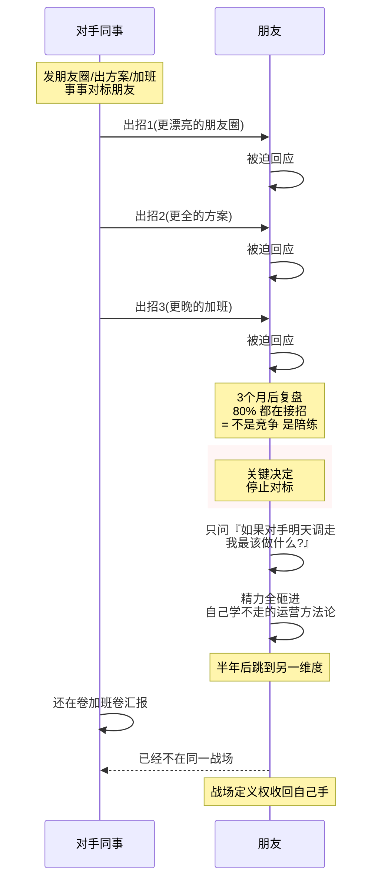
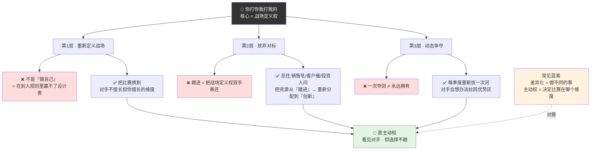
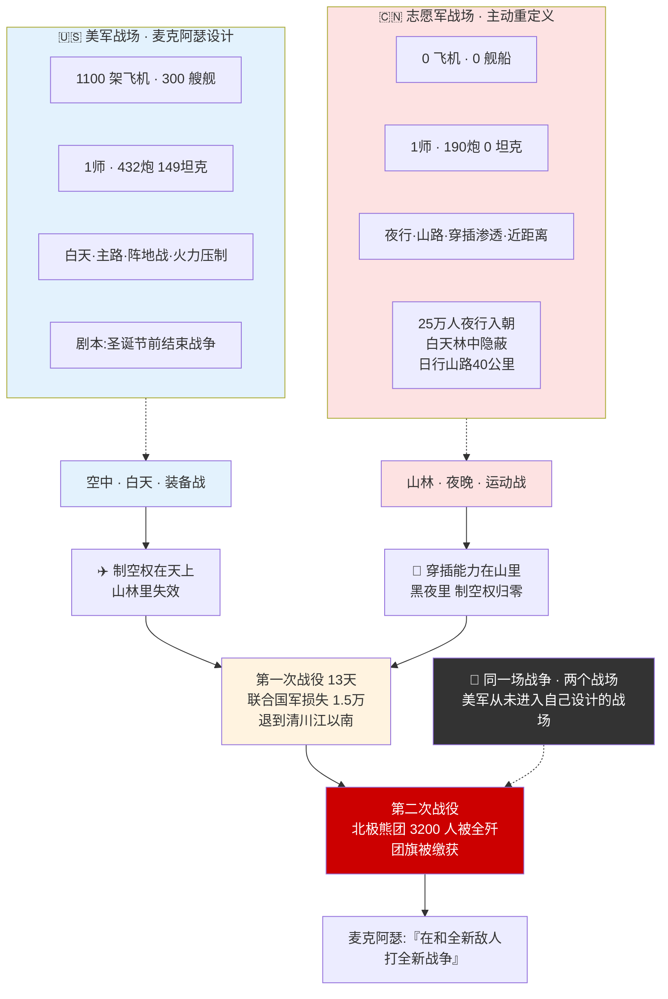
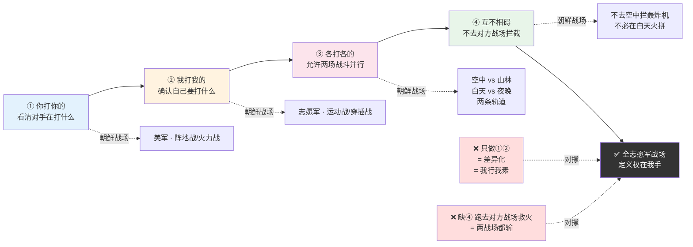
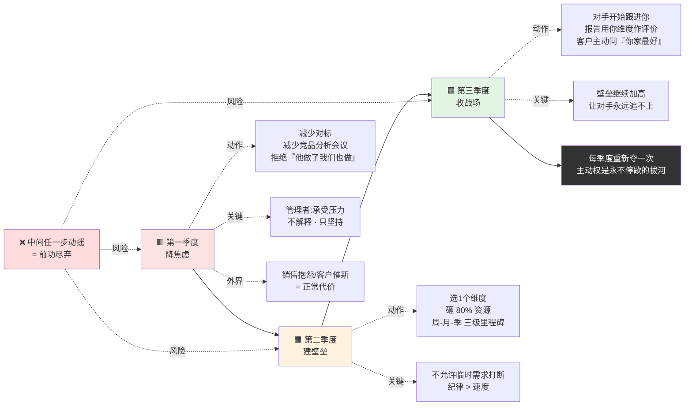
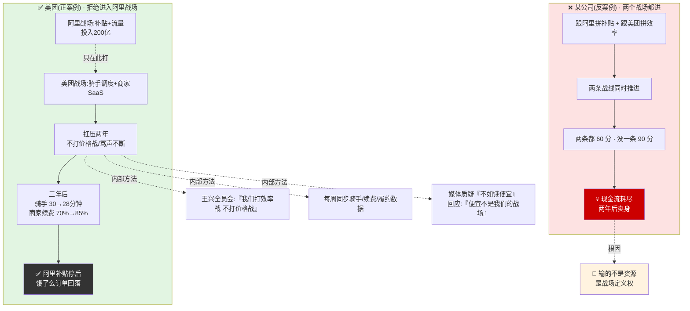
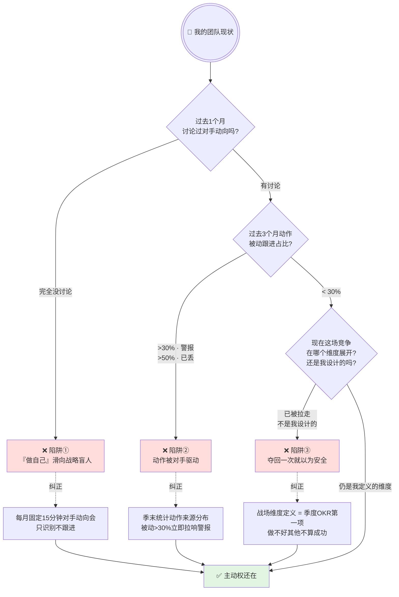

# 37.你打你我打我的

- 01.被同事牵着走
- 02.市面误读之辨
- 03.三层独家主张
- 04.一九五零朝鲜
- 05.原文四维精读
- 06.识别对手节奏
- 07.定义自己的战场
- 08.拒绝无意义对标
- 09.用时间换主动权
- 10.一个商业切片
- 11.三个认知陷阱
- 12.三年认知复利
- 13.收束三句金言

## 01.被同事牵着走

我有个做运营的朋友，去年部门新来了个同事，处处压他一头：他发条朋友圈，对方就发条更漂亮的；他出一个方案，对方就在会上补一个更全的；他加班到十点，对方就熬到十一点。朋友被逼着追了三个月——做的每一件事，几乎都是在回应对方，而不是在做自己该做的事。

有次吃饭我问他："你这几个月做的事，有多少是自己想做的，多少是为了压那同事一头？"他数了数，愣住了，**80% 都是在接招**。他天天在对方的战场上，打对方最擅长的仗，活成了人家的**陪练**。

后来他做了个身边人都反对的决定：**停止对标**。不再刷对方朋友圈，不再抢对方项目。他问自己一句："如果这同事明天调走，我最该做什么？"答案是深耕自己那套别人学不走的运营方法论。他把省下的精力全砸了进去。

半年后那同事还在卷加班、卷汇报，朋友却做出了别人复制不了的打法，被调去了更核心的岗位。**对方打消耗战，他打积累战**——两场仗根本不在一个战场。

那之后我才真正读懂毛泽东那句"你打你的，我打我的"——它不是让你无视对手，而是让你**把战场的定义权，拿回自己手里**。

## 02.市面误读之辨

市面上讲"你打你的我打我的"的人，最爱讲成一种"我行我素"的心态——"不要管别人怎么想，做自己就好"。这种讲法有两个硬伤：

**第一，它把战略原则讲成了"性格宣言"**。真正的"你打你的我打我的"不是心态，是**战略主动权**——不是"我不管你在做什么"，而是"我盯着你在做什么，但选择不在你的战场上和你打"。**心态选择无视，战略选择避其锋芒、另辟战场**：一个是逃避，一个是主动选择。

**第二，它把"主动权"讲成了"差异化竞争"**。差异化是"我做和你做不同的事"，主动权是"**我决定这场竞争在哪个维度上展开**"。前者是一种选择，后者是一种权力。终极目标是让对手不得不进入你的战场，用你擅长的规则和你竞争。

为什么这两种误读最流行？因为它们**回避了最关键的动作成本**。主动权不是喊出来的，是**用放弃换来的**——放弃对标、放弃跟随、放弃"别人有我也要有"的焦虑。这种放弃短期内看着像认输，大多数人扛不住。

真正能夺回主动权的解读，必须承认两件让人不舒服的事：**第一，主动权是放弃的产物，不是坚持的产物**；**第二，放弃是要付代价的**——短期内会被当成认输。这两件事市面书都不愿讲，所以它们只挑好听的"做自己"来安慰你。

## 03.三层独家主张

**第一层，主动权不是"做自己"，是"重新定义战场"**。你不可能在别人设计的比赛规则里赢过设计者。你能赢的唯一方法是——把比赛换到一个对手不擅长但你擅长的维度上。毛泽东打的每一场大胜仗都不是在国民党预设的战场上——你打你的城市战，我打我的游击战；你打你的阵地战，我打我的运动战。**战场定义权就是最高级的竞争权**。

**第二层，放弃对标是最难的勇敢**。竞品出了一个功能你没做，销售团队在吼、客户在催、投资人在问。如果你扛不住压力跟进了一个对标功能，你就等于把战场定义权双手奉还给了对手。你跟进得越多，你就在对方的战场上陷得越深。放弃对标不是放弃竞争，是**把资源从"跟进"重新分配到"创新"**。

**第三层，主动权是动态的，需要每季度重新夺取**。上一季度的主动权可能因为对手的战略调整而丧失。对手今天在你定义的战场上吃了亏，下一季度他一定会想办法把战场重新拉回他的优势区。主动权争夺是一场**永不停歇的拔河**——你夺回来一次不代表永远是你的。

## 04.一九五零朝鲜

**1950 年 10 月 19 日**，志愿军跨过鸭绿江，面对以美国为首的 16 国"联合国军"，42 万人，握有绝对制空权、制海权。装备差距触目惊心：美军一个师 432 门炮、149 辆坦克，志愿军一个师 190 门炮、**0 辆坦克**；美军 1100 架飞机，志愿军**零架飞机**。**这种差距，任何军事参谋都会建议"不要打"**，按常规打法，志愿军一个月内就会被全歼。

麦克阿瑟预判志愿军会沿主要交通线正面迎战，于是按美军最擅长的阵地战部署——轰炸机、重炮先摧毁阵地，装甲部队再推进，自信宣布"**圣诞节前结束战争**"。

志愿军却完全没按剧本走，**放弃所有主路，走山路、夜行军、穿插渗透**：25 万人夜间徒步入朝，白天全部隐蔽山林，美军侦察机飞了两周都没发现；专打黄昏黎明，避开美军火力最强的白天。**美军白天用飞机炸，志愿军夜晚用双脚走；美军打火力覆盖，志愿军打近距离穿插**。

两次战役，"联合国军"损失 1.5 万余人，被迫退到清川江以南；美军王牌"北极熊团"3200 人被全歼，团旗被缴获。麦克阿瑟后来说："**我们在和一个全新的敌人打一场全新的战争。**"

这场战役的核心不是"以弱胜强"，志愿军和美军从来不在同一维度竞争：**美军打装备战，志愿军打运动战**，两场战争在两条完全不同的轨道上运行。美军没输在"打得不好"，输在从没进入过自己设计的战场。你有制空权就让你在空中打，你的空中打法在山林里失效；我有夜行能力就让我在夜里打，你的白天优势在黑暗中归零。**同一场战争，两个战场**，这才是真正的战略。

## 05.原文四维精读

下面是"你打你的，我打我的"这十六个字最硬核的拆解，我从**知彼、知己、分轨、不拦**四个维度拆透。

**知彼。** "你打你的"——先看清对手在打什么。反共识：多数人第一步就错了，不是"看清对手"，而是"被对手吸引"，眼睛跟着对手的动作跑，越看越焦虑。"你打你的"不是"我不看你"的傲慢，是"我看见你了，但不跟你"的清醒——后者比前者难一百倍。

**知己。** "我打我的"——确认自己要打什么。反共识：多数人分不清"我想做的"和"我该做的"，把回应对手当成了自己的动作。这一步的关键不是"打得多好"，而是"打的是不是自己选的战场"。

**分轨。** "各打各的"——允许两场战斗并行存在。反共识：很多人以为竞争是一条赛道上的你追我赶，其实高手之间是两条平行的轨道，各自在各自的维度上赢。对手赢，不代表你输。

**不拦。** "互不相碍"——不去对方的战场上拦截他。反共识：这是最反人性的一步——看见对手在自己不擅长的维度上大杀四方，人会忍不住跑去救火，结果两个战场都输。**你不必在每一个维度上都赢**。

这句话还藏着一个张力：**"你打你的"不需要你赢，"我打我的"必须我赢**。对手在他的优势维度上占上风是正常的，不影响你的战略；你要盯的只有一件事——我的维度，我赢了没有？**不解释自己的失败，只追问自己的阵地。**

这句话最早出自 1947 年延安转战——胡宗南 25 万大军进攻延安，毛泽东主动放弃延安转入陕北山沟，途中说了这句极朴素的话："他打他的，我打我的。各打各的，互不相碍。"

## 06.识别对手节奏

被对手牵着走的第一步不是"跟进了某个功能"，而是**你的心里已经开始焦虑**。焦虑是丧失主动权的第一个信号，你发现自己在想"他做了这个我们没做，会不会出问题"。**这个想法一出现，你的注意力就被从自己的阵地上抽走了**。

识别对手节奏的目的不是"预判对手下一步会做什么"，而是**判断对手正在把你往哪个方向引**。每一个强敌都想把你拉进他的战场，**大厂想让你跟它拼资源**（因为它有钱）、**老牌企业想让你跟它拼品牌**（因为它有历史）、**低价竞争者想让你跟它拼价格**（因为它有毛利空间）。你要识别的不只是对手的动作，更是**动作背后他想让你做的事**。一旦你识别出了他希望你做的事，你就知道哪条路是死路。

**具体的识别方法**：每次对手出一个大动作，先问自己三个问题——**第一，这个动作最直接的效果是什么？第二，如果我跟进这个动作，我会被拖入他的哪个战场？第三，这个战场里我有没有独家优势？**三个问题回答完，如果发现"跟进 = 进入他的战场 + 我没有独家优势"，答案就是**坚决不跟**。**能忍住"不跟"的团队，才有资格谈主动权**。

## 07.定义自己的战场

凭什么你定义战场对手就得来打？答案只有一条：**你定义的战场里，有你独有的、对手短期内追不上的优势**。这个优势可以是**技术壁垒、用户关系、数据积累、对某个细分场景的极端理解**——任何对手无法在三个月内复制的优势，就是你的战场。

**定义战场的动作有三步**：**第一步，找出你的独有优势**——"什么是我能做而对手无论如何做不了的"。这个问题不好回答——大多数团队会陷入"我们哪都比对手强一点"的自我感觉良好，其实每一个"强一点"都不是壁垒。**壁垒的标准是"对手投入 3 倍资源也追不上"**——达到这个标准的能力，才是可以定义战场的独家优势。

**第二步，把你的全部资源集中到这个维度的建设上**，让它成为一个真正的壁垒。**这个动作最难的是"忍住扩张的诱惑"**——当你在某个维度做出成绩时，团队会立刻想"我们要不要也做 A/B/C 相关的东西？"每一个"要不要也做"都是资源的分流。**真正建壁垒的团队会拒绝所有扩张动作，把 100% 的资源都投在深挖那一个维度上**——直到对手放弃在这个维度上和你竞争。

**第三步，对外释放所有的信号都围绕这个维度**——让你的客户、投资人、媒体都知道"这家公司最强的是这个"，让对手在你的维度上和你竞争时天然处于舆论劣势。**这不是营销，是战场认知的塑造**——当所有人都认为"某维度这家公司最强"，对手在这个维度上的任何投入都会被市场解读为"追赶"，你在这个维度上的任何微小进步都会被市场解读为"领先"。**认知一旦确立，对手的每一步都是替你打广告**。

## 08.拒绝无意义对标

大多数公司把大量时间花在"竞品分析"上，其实是花在了**焦虑转移**上。他们不是真的需要了解竞品——**他们需要的是让自己看起来"很忙"**。"竞品分析"成了最体面的拖延方式——因为它看上去是"研究市场"，其实是在逃避"决定自己要做什么"这个更难的问题。

真正有意义的竞品分析只需要回答三个问题：**第一，竞品有没有进入我的战场？** 如果没有，看它一眼就够了。**第二，竞品在我的战场上有新的动作吗？** 如果没有，不需要深入分析。**第三，竞品最近三个月的变化透露出它想往哪个方向转型？** 如果这个方向和我的战场可能接壤，需要深度分析。如果三个问题的答案都是否定，你的竞品分析就是在浪费时间。

**80% 的竞品分析都是无用功**——它只是让团队感到\"我们在应对竞争\"的心理安慰，实际上并没有产生任何决策价值。砍掉它们，把时间还给自己的产品。**具体的动作**：把每周的"竞品分析会议"从 2 小时压缩到 15 分钟——只讨论上述三个问题，回答完就散会，不允许延伸讨论"如果我们也做 X 会怎样"这种拖沓议题。

## 09.用时间换主动权

主动权不是一天夺回的。你被对手牵了一年的鼻子，不可能下周就翻盘。**夺回主动权需要时间**：

**第一季度降焦虑**——**减少对标、减少竞品分析、减少"他做了什么我们也要做"的会议**。这是最痛苦的一季——团队会不适应，销售会抱怨，客户会问"你们怎么不出新功能"。**这时候管理者的核心工作不是解释，是承受压力**——你如果扛不住这三个月的质疑，主动权永远回不来。

**第二季度建壁垒**——**集中全部资源做一个对手追不上的维度的建设**。这一季度你需要选定"一个维度"，然后把 80% 的资源砸进去。壁垒的建成不是一次冲刺，是**每周一小步 + 每月一里程碑 + 每季度一个可展示的重大突破**。**关键不是速度，是纪律**——不允许任何"临时需求"打断这个建设。

**第三季度收战场**——**当你的壁垒建成，对手在你的维度上已经打不过你，这时候他不得不进入你的战场**。这是主动权真正回归的时刻——你会发现对手开始跟进你的方向、行业报告开始用你的维度作为评价标准、客户开始问"你们家在 X 这个方向上做得最好，其他家怎么比"。**这时候你已经赢了**，剩下的工作就是把壁垒继续加高，让对手永远追不上。

**主动权从放弃开始，到壁垒建成时回归**。这个过程需要 3-9 个月，中间任何一步动摇都会前功尽弃。

主动权三季度回归节奏一图带走（放弃→壁垒→收场）：

## 10.一个商业切片

讲一个正面案例：美团如何在阿里本地生活的正面攻击下保持主动权。

> 2018 年阿里收购饿了么，投入 200 亿亲自下场打本地生活战争。外界普遍认为美团会被拖入一场和阿里拼资源的价格战。但美团选择了一条完全不同的路——**不打价格战，打效率战**。
>
> 阿里的战场是"补贴 + 流量"，它最擅长的是把淘宝天猫的流量灌进饿了么，用补贴拉新。美团的战场是"骑手调度 + 商家 SaaS"。美团没有跟阿里拼补贴——它把全部资源投入到了骑手调度算法的优化、商家后台的数字化改造上。
>
> 三年后结果出来了——阿里的补贴停了之后饿了么的订单量回落到补贴前水平，而美团的骑手平均配送时长从 30 分钟降到了 28 分钟，商家续费率从 70% 涨到了 85%。美团没有在阿里的战场上赢，但它在自己的战场上赢得很彻底。
>
> 这个案例的核心洞察不是"美团比阿里聪明"，而是**美团从第一天起就拒绝进入阿里的战场**。它顶住了两年被骂"不如饿了么便宜"的压力，直到自己的壁垒建成。

**美团这两年扛住压力的方法**：**第一，内部对齐战场定义**——王兴多次在全员会上明确说"我们不打价格战、我们打效率战"，让整个公司在被外界质疑时不动摇；**第二，量化自己的战场进展**——每周同步骑手配送时长、商家续费率、订单履约率等数据，让团队看到\"我们的战场我们在赢\"，抵御\"隔壁战场我们在输\"的心理消耗；**第三，转化外界质疑为战场证据**——当媒体质疑\"美团不如饿了么便宜\"时，王兴的回应是\"便宜不是我们的战场，效率才是\"——**主动把话题拉回自己的战场，不允许被牵到对方的战场上讨论**。

**再对比一个反面**：同一时期某本地生活公司选择的策略是"跟阿里拼补贴+跟美团拼效率"——两条战线同时推进。**结果是两条战线都做到 60 分但没有一条做到 90 分**，两年后现金流耗尽被迫卖身。**它输的不是资源，是战场定义权**——它试图同时进入阿里和美团的两个战场，结果在两个战场上都被对方的主场优势压制，两边都赢不了。这就是"你打你的我打我的"最反面的教材。

美团 vs 阿里正反两案例并置 · 一图看清"战场定义权"决定生死：

## 11.三个认知陷阱

**陷阱一：把"做自己"当成了"不看对手"**。**你打你的我打我的，前提是你知道对手在打什么**。不看对手的人不叫"做自己"，叫**战略盲人**。**识别方法**：如果你的团队一个月都没有讨论过对手的动向，说明已经从"不被对手牵走"滑向了"完全不看对手"——这两个是完全不同的状态。破解动作：每月固定一次 15 分钟的对手动向同步会——只做识别不做跟进，把对手动向变成"背景信息"而不是"待办事项"。

**陷阱二：因为一次没跟上就自我怀疑**。竞品发了一个功能你的用户没反应，竞品拿了一轮融资你的投资人没问——这些都不是你丧失主动权的信号。**识别方法**：丧失主动权的唯一定义是——**你最近三个月的动作里，有多少是被对手逼迫的、有多少是自己主动设计的**。破解动作：每季度末统计一次"动作来源分布"——被动跟进的占比超过 30% 就要拉响警报，超过 50% 就是主动权已经丢了。

**陷阱三：夺回一次主动权就觉得安全了**。**对手会不断尝试把战场拉回他的优势区**。**识别方法**：每季度检查一次——**现在这场竞争在哪个维度上展开？这个维度还是我设计的吗？** 如果不是，你的主动权已经悄悄流走。破解动作：把\"战场维度定义\"作为季度 OKR 的第一项——如果这一项没做好，其他 OKR 完成再多也不算成功，因为你是在别人的战场上打胜仗，赢的成本会越来越高。

三个认知陷阱识别决策树 · 一图排查自己在哪个坑：

## 12.三年认知复利

停止对标之后的第一季度是最难的——销售天天焦虑、团队天天问我"他们又发了一个，我们跟不跟"。我只回答一句话："**告诉我那个功能在我们定义的核心维度上有没有威胁**。"绝大部分功能都没有。到第二季度，销售开始反过来告诉我："那个竞品的功能我问了几个客户，他们其实不在乎。"

**第一年的变化**：团队从"每周花 10 小时看竞品"变成"每月花 1 小时同步动向"——**省下的时间全部投入到自己的核心壁垒建设**。半年后我发现一个现象：**当我们不再追着竞品跑之后，竞品开始追着我们跑了**。因为我们在自己的维度上建立的壁垒越来越深，深到竞品不得不跟进。但他们跟进的速度永远追不上我们深耕的速度——**因为他们每追一个功能要两周，我们在这个维度上已经跑了两年**。**用对方最不擅长的方式建立壁垒，你越跑对方越追不上**。

**第二年的变化**：我们的行业地位从"某某公司的替代品"变成了"某某维度的定义者"——媒体开始用我们的产品作为行业标杆，客户开始把我们和头部大厂放在同一列比较。**这个认知重塑是复利效应最直接的体现**——一旦你在某个维度上被认为是标杆，投资人、客户、人才都会自动向你聚集，你不需要花任何额外营销费用。

**第三年的变化**：我判断一个产品团队是否成熟，有一条几乎条件反射的标准：**他们花在竞品分析上的时间占比是多少？** **超过 20% 的团队，已经被竞品牵走了主动权**；低于 5% 的团队，要么有自己的壁垒，要么完全不看对手——前者是真高手，后者是运气好还没遇到强敌。**这条标准现在成了我评估合作伙伴的默认第一问**——一个把 30% 时间花在追赶竞品的团队，无论产品做得多好都不值得深度合作，因为它没有战略主动权，未来任何一次竞争激化都可能让它崩盘。

## 13.收束三句金言

**一句话核心**：**你打你的我打我的本质不是"做自己"，是"把战场定义权从对手手里夺回来"**。**这不是心态，是战略主动权**——两者的区别在于，前者是"我不看你"，后者是"我看见你了，但我选择不跟你"。**看见但不跟**——这是所有战略执行者一生的功课。

**你应该带走的三件事**：

**一，主动权从放弃对标开始**：不跟进竞品的功能不是认输，是把资源重新分配到自己的核心壁垒上。**忍住扩张诱惑、忍住跟进焦虑、忍住被质疑的压力**——三个"忍住"做到了，主动权就在你手里。

**二，定义自己的战场需要独有优势**：**任何对手三个月内追不上的能力，就是你的战场**。定义战场三步——找独家优势、集中资源建壁垒、对外释放认知信号。三步走完，你就在自己的战场上了。

**三，主动权需要每季度重新夺取**：对手会不断尝试把你拉回他的优势区，你必须在自己的壁垒上跑得比他快。**认知一旦确立，对手的每一步都是替你打广告**——这就是战场定义权的复利效应。

**一句留给你的反问**：你最近三个月的产品动作里，**有多少是你自己想去做的、有多少是竞品逼你做的？** 如果后者超过 50%，你的主动权已经丢了。从下周开始砍掉所有"竞品逼你做的"事，把省下的时间全部还给"你自己想做的"。**先夺回主动权，再想怎么赢**——在别人的战场上永远赢不了大胜仗，只有在自己定义的战场上，你才配得上"胜利"两个字。**从今天起就练起来——找出这季度你被对手牵着鼻子做的那一件最消耗资源的事，先砍掉它，然后把省下的资源全部还给你自己真正想做的事情**。
