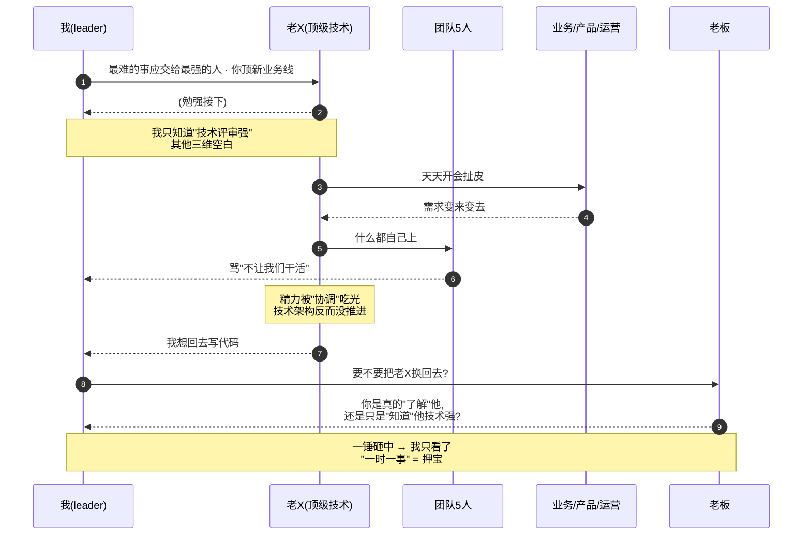
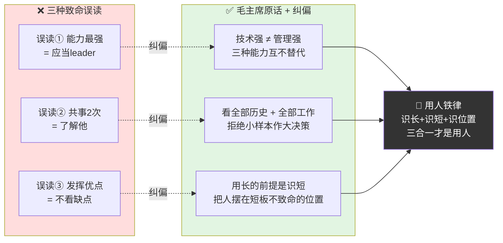
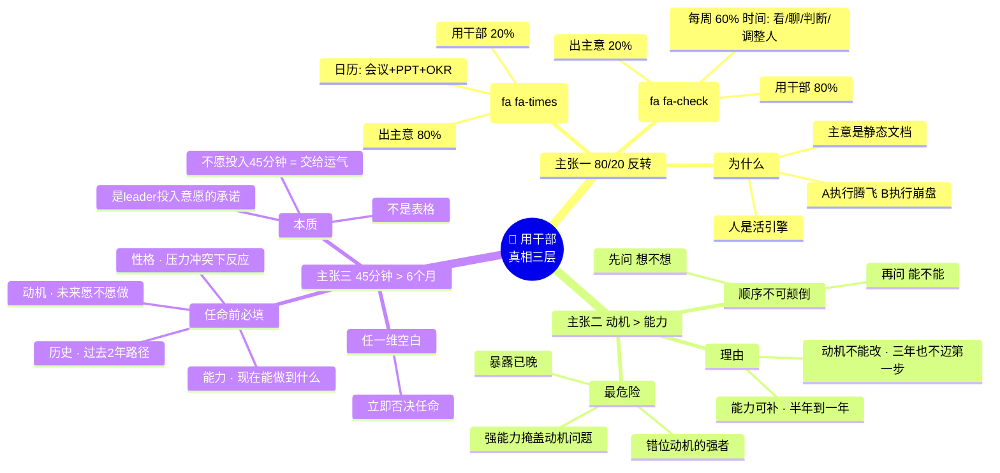
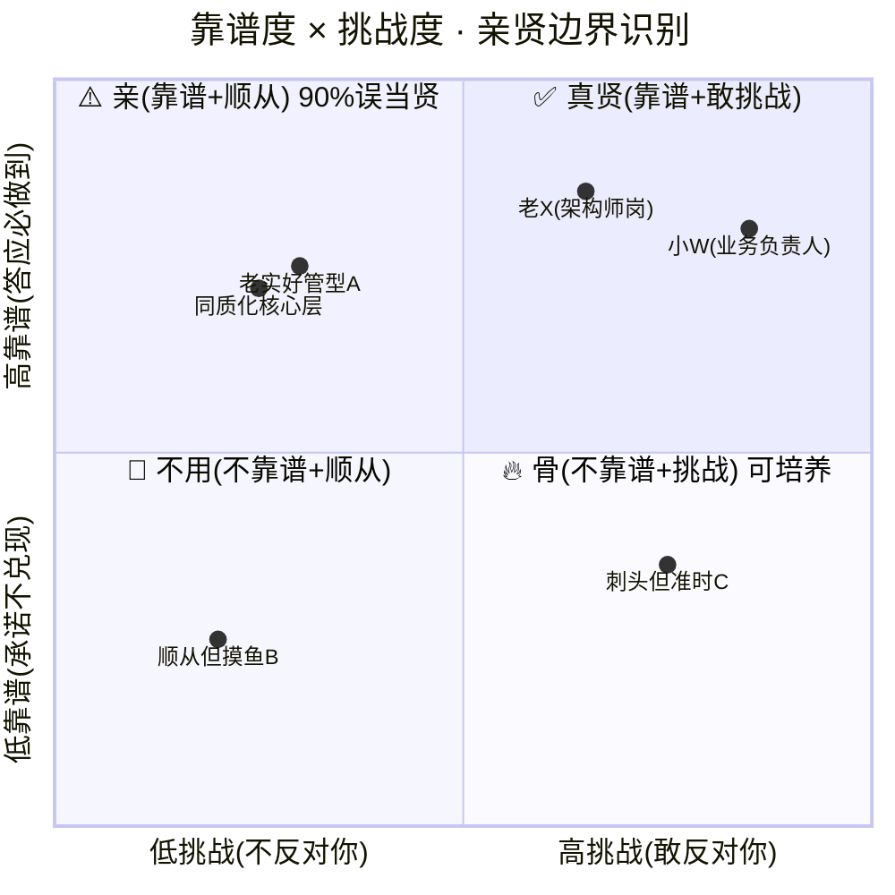
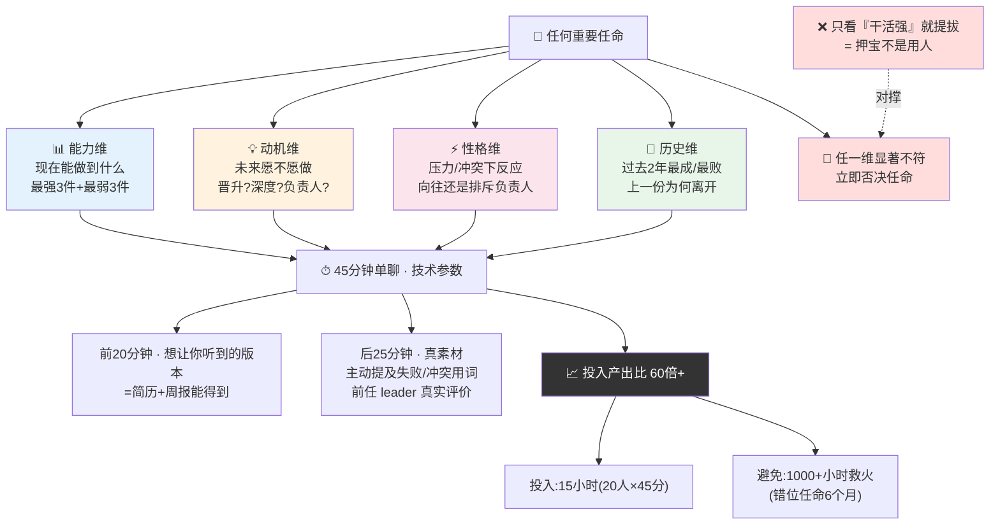
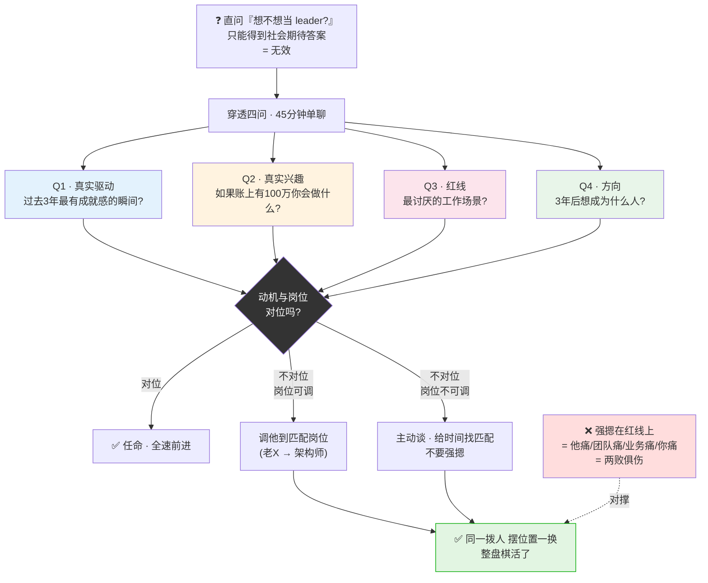
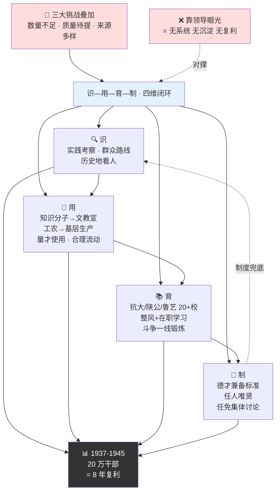

# 39.知人善任的功夫

> 识人比用人更重要、用人所长比克服短板更重要、动机比能力更重要——任命之前多问 45 分钟，胜过任命之后救火 6 个月。

目录介绍
- 01.把强人放错位置
- 02.市面误读之辨
- 03.三层独家主张
- 04.延安整风现场
- 05.原文四维精读
- 06.四维档案识人法
- 07.动机比能力更重
- 08.延安干部教育案
- 09.一个商业切片
- 10.三个认知陷阱
- 11.惩前毖后治病救人
- 12.三年认知复利
- 13.收束三句金言

## 01.把强人放错位置

那一年我带一个 20 多人的工程团队，我手下有一位"明星工程师"老 X——技术上全公司都认，架构评审他一开口别人都闭嘴。我当时正缺一个新业务线的负责人，我几乎没犹豫就把老 X 顶上去了。我当时的逻辑特别"合理"——**最难的事就应该交给最强的人**。

结果三个月过去，事情完全反了：老 X 天天开会到崩溃，跟业务方、产品、运营扯皮；下面 5 个工程师骂他"什么都自己上，不让人干活"；技术架构反而没推进——因为他全部精力被"协调"吃光了；最糟糕的是他私下跟我说："我想回去写代码。"我才意识到——我把一位顶级战斗工程师，硬塞进了一个需要"协调 + 销售 + 教练"的岗位。**技术强不等于能带业务线**。这两件事是完全不同的能力。

我去找老板商量"要不要把老 X 换回去"。老板没说行或不行，只问我："你把他放到这个位置之前，你是真的'了解'他，还是你只是'知道'他技术强？"这个问题把我问住了。我老实想了一下——我对老 X 的了解只停留在一个维度：技术评审的时候他表现怎么样。他擅长什么场景？他在冲突中怎么反应？他上一份工作为什么离开？他对"当负责人"本身感不感兴趣？——我一个都答不上来。

那晚我翻《中国共产党在民族战争中的地位》，看到这段话像被一锤砸中："必须善于识别干部。不但要看干部的一时一事，而且要看干部的**全部历史和全部工作**，这是识别干部的主要方法。""必须善于使用干部。领导者的责任，归结起来，主要地是出主意、用干部两件事。"毛主席说的**"一时一事"**，就是我对老 X 的全部认知——我只看了他写代码写得好这一时一事，然后就把一条业务线的生死交给他。这不叫用人，这叫押宝。

明星工程师错放业务负责人 · 病理时序图（3 个月连锁反应）：

## 02.市面误读之辨

关于"知人善任"，市面上至少有三种致命误读。

"他能力最强，所以他应该当 leader"——这是 80% 中层管理者犯的第一个错。能力强不等于适合管理。技术深度强、协调能力强、战略视野强——这是三种完全不同的能力，互不替代。**把一个能力强但岗位不匹配的人提上来，等于同时毁了两件事：他的职业曲线和那个岗位的产出**。

"我跟他共事过两次，了解他"——幻觉。毛主席原话："不但要看干部的一时一事，而且要看干部的**全部历史和全部工作**"。一两次表现是一时一事，是统计学上的"小样本"——以小样本作大决策，必然踩坑。

"我们要发挥他的优点"——潜台词是不看缺点。错。**用人所长的前提是清楚识别短板**——清楚知道他哪里短，然后把他摆在短板不致命的位置。老 X 的短板是协调——协调不致命的岗位（架构师）他是神，协调致命的岗位（业务负责人）他是废。

三大误读 vs 毛主席原话 · 对照纠偏图：

## 03.三层独家主张

独家主张一：**用人 80%、出主意 20%**。毛主席说"领导者的责任主要是出主意、用干部两件事"——很多人理解成 50/50。实际比例是 80/20：用对人 80%，出主意 20%。因为一个错的人在岗位上，你出再多对的主意都推不动。为什么是 80/20？因为主意只是一个静态文档，人才是把主意翻译成结果的活引擎。同样一份战略，A 来执行变成业绩腾飞，B 来执行变成项目延期、团队离职、客户投诉——差距不在文档，在这台引擎本身。更危险的是这个比例的错觉——多数 leader 80% 时间花在"出主意"（开会、写战略、做 PPT、定 OKR），只有 20% 留给"用干部"，而且这 20% 还多半是事后救火。真正成熟的 leader 会把日历倒过来排：每周 60% 以上的时间用于看人、聊人、判断人、调整人。

独家主张二：**动机比能力更重要**。任命前必须先问"他想不想"、再问"他能不能"。动机不对位、能力再强都是灾难。为什么动机比能力更重要？因为能力可以补，动机不能改——这是用人这件事最反直觉、却最锋利的真相。能力欠缺可以在岗位上半年到一年补足；但一个不想做这件事的人，你给他三年也不会主动迈出第一步。错位动机的强者尤其危险——强能力让他长时间"看起来还行"，掩盖动机问题，等问题暴露已经晚了。正确顺序永远是：先问动机、动机过线再看能力；动机不对位，再强都不要。

独家主张三：**任命前 45 分钟胜过救火 6 个月**。任何重要任命之前，必须先填完"能力 + 动机 + 性格 + 历史"四维档案。任何一维空白都不能任命。为什么是这四维、少一维都不行？因为它们分别对应四个不同时间维度的真相——能力回答"现在能做到什么"，动机回答"未来愿不愿做"，性格回答"压力 / 冲突下的反应"，历史回答"过去 2 年的路告诉我们什么"。缺一维，你看到的就不是这个人、是他在某一时刻的某个切面。四维档案不是一张表格，是 leader"识人投入意愿"的强制承诺——不愿意为重要任命投入 45 分钟，本质是把最关键的杠杆交给运气。

三层独家主张 · 一图看清"用干部这件事的真相"：

## 04.延安整风现场

延安整风前的干部现实是三重叠加：干部队伍严重不足（抗战爆发后各方面工作都缺人）、干部队伍成分复杂（老红军、国统区知识分子、工农提拔干部共存）、错误倾向影响严重（左的"残酷斗争、无情打击"和右的"任人唯亲、宗派主义"并存）。1942 年开始的延安整风运动，一个重要内容就是整顿党的作风——毛主席关于"知人善任"的思想，正是在整风运动中系统阐述和推广的。

为什么"知人善任"必须依托整风运动才能真正落地？用人观的根本问题从来不是"方法不会"，而是"作风不正"——再好的识人方法，到了主观主义、宗派主义的人手里都会被扭曲成任人唯亲。整风的核心动作"惩前毖后、治病救人"就是先把识人者自己的偏见和小山头治掉，识人这件事才有可能客观公正。

知人善任另一半是 leader 自己的作风修正——你不先治自己的主观和偏私，再多的四维档案都会被你写成想看到的样子。用人之难，七分难在自己。

解放战争时期，需要大量干部接管城市、管理政权、建设新中国。任务量级骤变——从"打游击"切换到"管国家"，干部能力模型必须随之大换血。原来在山沟里能打仗、能动员的干部，未必能管得住一个工业城市；战时干部以政治觉悟为主、流动作战、单线指挥，接管型干部则需要政治加财经工业、长期治理加抗诱惑、跨部门跨地域协调。正是这种"任务跃迁"逼出了毛主席"识—用—育—制"的完整闭环——仅靠"识"和"用"已经不够，必须再加上"育"（系统培养）和"制"（制度兜底）。对今天组织的启示是：每当业务进入新阶段（从 0-1 到规模化、从国内到出海、从功能到平台），原来的用人模型都会失效一次——leader 必须主动重做"识—用—育—制"四件事，不能用老地图找新大陆。

## 05.原文四维精读

《中国共产党在民族战争中的地位》（1938 年 10 月 14 日）核心段落："必须善于识别干部。不但要看干部的一时一事，而且要看干部的**全部历史和全部工作**，这是识别干部的主要方法。""必须善于使用干部。领导者的责任，归结起来，**主要地是出主意、用干部两件事**。""必须善于爱护干部。爱护的办法是：第一，指导他们……第二，提高他们……第三，检查他们的工作……第四，对于犯错误的干部，一般地应采取说服的方法……第五，照顾他们的困难。"

为什么要看"全部历史"和"全部工作"？因为人不是一时一事的产物——人是过去 5 年、10 年所有选择和经历的累积。只看一时一事，就像看一支股票一天的 K 线就买入——赌运气而已；看全部历史，就是看长周期均线和成交量——才能看出趋势。

任人唯贤原则："我们民族历史中从来就有两个对立的路线：一个是'任人唯贤'的路线，一个是'任人唯亲'的路线。前者是正派的路线，后者是不正派的路线。"**关键在于识别"亲"和"贤"的边界**——你以为"靠谱、好管"是"贤"，其实可能是"亲（顺从、不挑战、好用）"。真正的"贤"往往不那么"亲"——他会反对你、会挑战你、会让你不舒服。宗派主义就是任人唯亲的极致，结果有三：核心层逐渐同质化（大家都像）、不同意见被排斥（决策风险无人提示）、能人远离平庸聚集（团队战斗力下降）。三件事一起发生，组织必败。

"亲 vs 贤"识别象限图（很多 leader 以为在选贤 · 实际在选亲）：

## 06.四维档案识人法

借用毛主席"看历史、看本质、看主流、看发展、看实绩"五看法，落地到团队层面成"四维档案"：能力维度——他最强的 3 件事是什么？最弱的 3 件事是什么？具体到场景；动机维度——他现在最想要的是什么？晋升？技术深度？做负责人？这一栏是大多数管理者的盲区；性格维度——他在冲突中怎么反应？在高压下怎么反应？对"当负责人"这件事是向往还是排斥？历史维度——他上一份工作为什么离开？过去 2 年最成功 / 最失败的一件事是什么？

四维档案不能"猜"，必须一对一深度聊。每人 45 分钟起步，一个团队 20 人就是 15 小时——这是**一次性投入，长期收益**。为什么一定是 45 分钟？前 20 分钟他说的全是"想让你听到的版本"——这些看简历、看周报都能拿到，无需单聊。真正有价值的藏在后半段：他主动提起的失败、描述冲突时的措辞、压力下如何选择、对前任 leader 的真实评价——这些才是四维档案的关键素材。"45 分钟"不是仪式感，是技术参数——少于这个时间只拿到表层人设，多于这个时间边际收益递减。最大的反对声音永远是"我没时间"——但请算一笔账：15 小时识人投入 vs 错位任命后 6 个月救火（约 1000 小时），投入产出比超过 60 倍。任何重要任命之前，强制走一次四维校验——**四维任何一维显著不符合，立即否决任命**。

四维档案与 45 分钟 ROI 一图看透（缺一维即押宝）：

## 07.动机比能力更重

老 X 是顶级技术能力，但他的动机是"在技术上成为行业前 1%"，他这辈子的红线是"不当管理者"。我把他踩在红线上那一刻，结果就已经注定了——他痛苦（每天做不喜欢的事）、团队痛苦（因为他不擅长且不想做）、业务痛苦（因为推不动）、我痛苦（因为我看着这一切发生但不知道为什么）。

"你想不想当 leader？"——这种问法只能得到社会期待答案。正确问法是四道穿透题："你过去 3 年最有成就感的瞬间是什么时候？"——看真实驱动；"如果今天有 100 万躺在账上，你最想做什么？"——看真实兴趣；"你最讨厌的工作场景是什么？"——看红线；"你三年后想成为什么样的人？"——看方向。如果发现某人动机和岗位不对位——如果岗位可调整，立刻把他调到匹配岗位（老 X 调回架构师就是这种）；如果岗位不可调整，主动跟他谈、给他时间找匹配岗位，不要强摁。**强摁是两败俱伤**。

动机穿透四问 → 岗位决策树一图带走：

## 08.延安干部教育案

延安时期，中国共产党面临三大挑战——干部数量严重不足、干部质量亟待提高、干部来源多样化。这三大挑战合起来构成了一个"既要、又要、还要"的极限难题——常规组织在任意一项里都已经会被压垮，党却必须同时把三项都解决。第一难：数量严重不足——根据地由几十万平方公里扩展到数百万，新解放城市需要城建、工业、教育、外交各类干部，缺口动辄以万计，靠"老人提拔老人"完全填不上。第二难：质量亟待提高——原有干部多来自农村、有政治觉悟却缺专业训练，一切换到建国就管不好工厂、看不懂账目、不会和外宾打交道。第三难：来源多样化——红军干部、地下党员、白区青年、知识分子、归国华侨、起义将领同堂共事，政治背景、价值观、工作习惯天差地别。正是这三大挑战叠加，逼出了党"系统化干部教育 + 大规模识人识能 + 严格制度兜底"的整套方法论。

具体动作四步走——识别维度上强调实践考察、群众路线、历史地看人；使用维度上做到用人所长（知识分子安排到文化教育宣传岗位，工农干部安排到基层生产一线）、量才使用、合理流动；培养维度上创办抗日军政大学、陕北公学、鲁迅艺术学院等 20 多所干部学校，同时开展整风运动、组织在职学习，并把干部放到斗争一线锻炼；制度维度上确立"德才兼备"的干部标准，坚持任人唯贤、干部任免集体讨论决定。从 1937 年到 1945 年，延安各干部学校培养干部 20 多万人。**关键启示：知人善任不是"靠领导眼光"，而是靠"识—用—育—制"四维系统**——这是延安能在 8 年间培养 20 万干部的根本。

延安"识—用—育—制"四维系统一图闭环（8年培养20万干部的秘密）：

## 09.一个商业切片

老 X 那件事之后，我回去做了团队里一辈子都该做但我从没做过的一件事——**给每一个下属建一张"四维档案"**。我花了一周时间，一对一深度聊完 20 个人，每人 45 分钟。聊完我震惊地发现——我过去两年管理这个团队，有一半的人我都"只知道他的技术能力"，其他三维我一片空白。其中最让我心里发寒的是——有两个同事其实已经完全不想干这条业务线了，一个正在等晋升一个正在找工作，我一点都不知道。

拿着这张四维档案重新看老 X 这件事，我心里一下子通了——能力维度上老 X 的强项是深度技术攻坚、弱项是协调多方利益；动机维度上他最想要的是"在技术上成为行业前 1%"，根本不想当管理者；性格维度上他在冲突中的反应是逃避、不是主动介入；历史维度上他上一份工作就是因为升到管理之后没法写代码而离开的——**他这辈子的红线是"不当管理者"，而我一脚把他踩在红线上**。

当月我做了三个调整——老 X 调回技术专家路线，成立架构委员会让他当首席架构师（不管人、但技术决策最高权威），他当晚给我发消息："谢谢，我觉得我又活过来了。"新业务线负责人换成小 W——技术中等但协调维度团队第一，跨角色沟通、冲突主动介入、对负责人角色向往三项都是最高分。给自己立了一条铁规：任何岗位任命之前必须先填完四维档案，没填完不决定。第一个月那条业务线开始明显转起来——小 W 虽然技术不如老 X，但她把节奏、协调、激励都搞得很顺；老 X 在技术专家岗位上两周推动了一个过去三个月都没动过的架构重构。**同一拨人，摆位置一换，整盘棋活了**。

## 10.三个认知陷阱

陷阱一：**把"亲"当"贤"**。很多管理者潜意识里偏爱"靠谱、好管、不挑战自己"的下属——把这种叫"贤"。错。这往往是"亲"，不是"贤"。真正的"贤"是有自己判断、敢挑战你、能补你短板的人。喜欢"靠谱听话"的本质是管理者懒——不愿意花精力管理有想法的人。

陷阱二：**把晋升当奖励**。"他干得好，所以提拔他当 leader"——这是 90% 公司的默认操作，也是著名的彼得原理：人们倾向于被提拔到自己不胜任的层级。晋升不是奖励，是换岗——换岗成功的前提是动机、能力、性格三件事都匹配新岗位。用晋升奖励干得好的人，结果常常是同时毁掉一个能干的人和一个新岗位。

陷阱三：**把同质化当团结**。团队成员的能力结构、思维方式、性格特征都很相似——管理者觉得"团结"。错。这叫同质化，不叫团结。同质化的团队遇到危机时所有人会犯同样的错。真正强的团队是**异质化但同向**——能力互补、视角不同、目标一致。

## 11.惩前毖后治病救人

半年后我回看，那次"老 X 错放"是我管理生涯最重要的一次失败——因为它逼我彻底重构了"怎么用人"这件事的底层逻辑。这半年沉淀下来 4 条我不再会违背的规矩：任命之前先填完四维档案——能力、动机、性格、历史，四维有任何一维空白不任命。任命前多问 45 分钟，胜过任命后救火 6 个月。永远先问"他想不想"，再问"他能不能"——过去我默认"能力强的人就应该被提拔"，这半年我反复体会——**动机不对位，能力再强都是灾难**。"用人所长"的前提是"识别短板"——用人所长不是只夸长处，是清楚知道他哪里短，然后把他摆在短板不致命的位置。"惩前毖后、治病救人"成为我处理失误的标准动作——过去同事犯错我下意识追责，现在我先做三件事：弄清事实、找出系统原因、想清楚对他未来的影响。追责是最后一步，也经常是不必要的一步。

我现在特别信毛主席那句话——"领导者的责任，归结起来，主要地是出主意、用干部两件事。"过去我一直以为"出主意"是 80%、"用干部"是 20%；这半年我明白了——**倒过来才对，用干部 80%，出主意 20%**。因为一个错的人在岗位上，你出再多对的主意都推不动。

## 12.三年认知复利

第一年最大的变化是每个新人入职 30 天必须完成四维档案。一年下来积累了团队 25 人的完整档案——任命错误率从原来的每年 3-4 次降到零。

第二年我把"四维档案 + 任命前校验 + 动机优先"打包成跨团队 SOP，推到整个研发体系。效果是——整个研发体系的关键岗位错任率下降 70%、关键人员主动离职率下降 40%——**动机对位是留人最强的杠杆**。

第三年最大的变化是从"识人 + 用人"扩展到"育人"——为每个核心成员制定 3 年成长地图，每季度一次"成长复盘"，把使用与培养真正打通。三年下来，团队里 5 个核心成员全部独立带过项目、3 个升任管理岗、2 个成为技术专家——**这就是"识—用—育—制"四维体系的复利**。

## 13.收束三句金言

**识人比用人更重要、用人所长比克服短板更重要、动机比能力更重要——任命之前多问 45 分钟，胜过任命之后救火 6 个月。** 这三组比较每一组都是反直觉的——识人 vs 用人：直觉是把精力放在"怎么用"，纠正是 80% 精力应该放在先看准是谁；用所长 vs 克服短板：直觉是把 80% 的精力花在补短板，纠正是应当把 80% 精力花在放他到长板能发挥的位置；动机 vs 能力：直觉是先看简历看战绩，纠正是先问他想不想、动机不对位再强都不要。

**用人 80%，出主意 20%**——一个错的人在岗位上，你出再多对的主意都推不动。**动机不对位，能力再强都是灾难**——先问"他想不想"，再问"他能不能"。**把人摆在短板不致命的位置**——用人所长不是只夸长处，是清楚知道他哪里短，然后让他短处不致命。

下一次你又准备"提拔最能干的那个人"时，问自己一句——**你对他的了解，是停留在"干活强"，还是真的知道他想要什么？** 如果答案是前者，这次任命就是押宝，不是用人。先做四维档案，再做决定。
