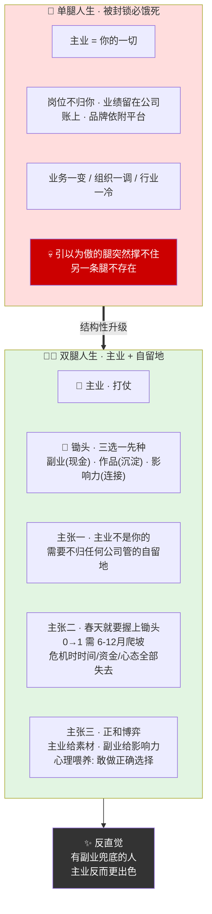
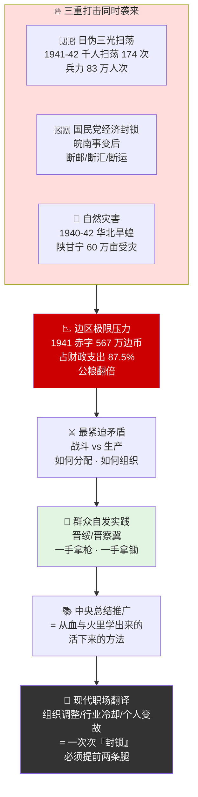
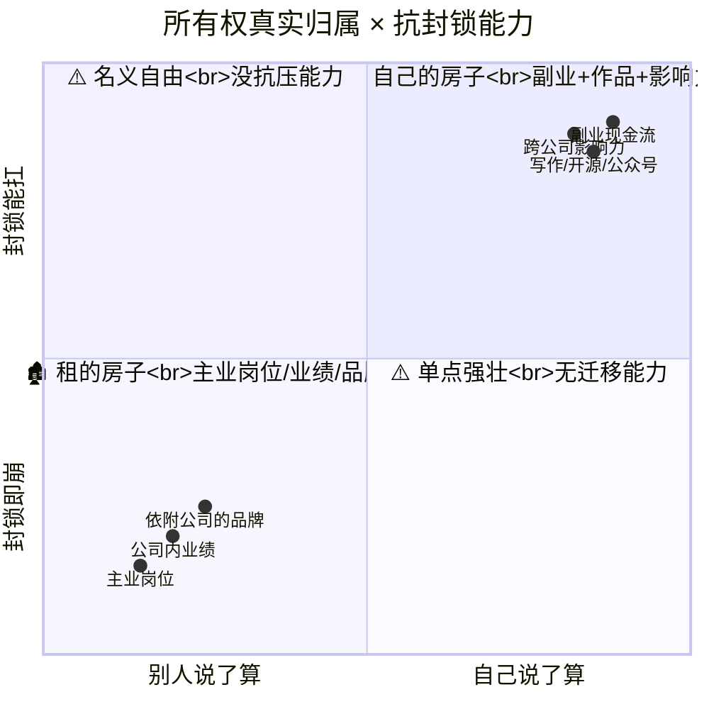
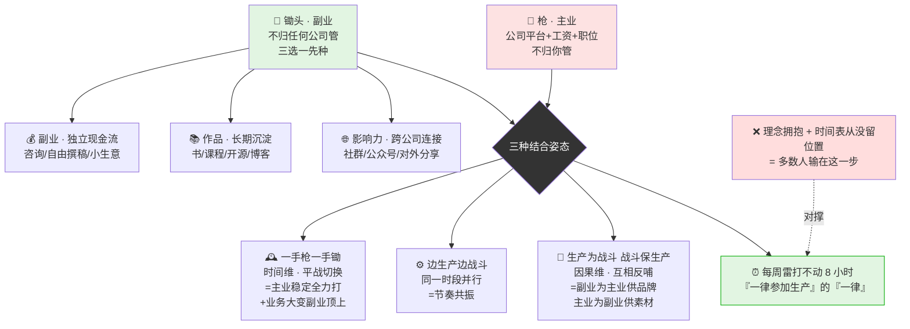
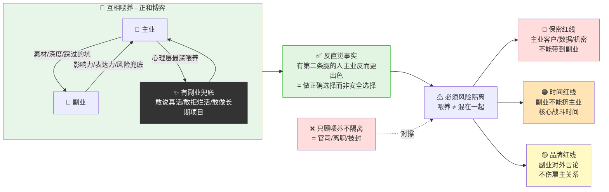
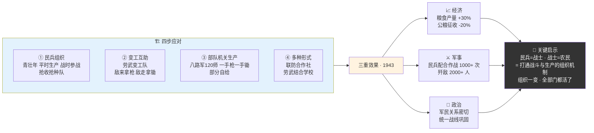
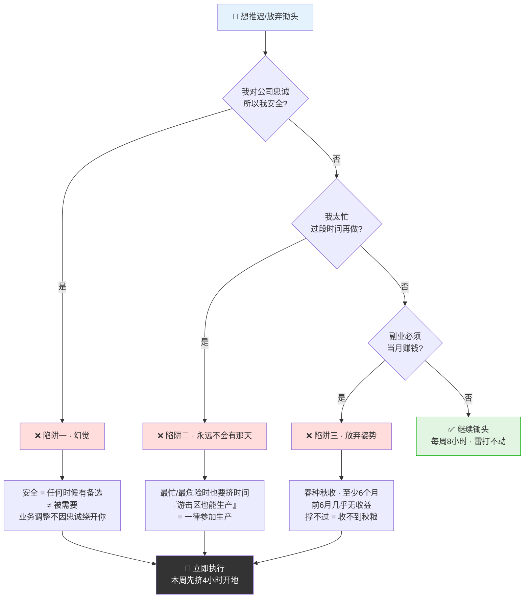

# 40.劳武结合两手抓

> 只会打仗的部队撑不过封锁，只有主业的人扛不过裁员。真正让你活下去的，不是打得多猛，而是**一手拿枪，一手拿锄**。

目录介绍
- 01.只押一条腿那年
- 02.市面误读之辨
- 03.三层独家主张
- 04.一九四二根据地现场
- 05.原文四维精读
- 06.你的主业不是你的
- 07.一手拿枪一手拿锄
- 08.两条腿互相喂养
- 09.晋绥边区示范案
- 10.一个商业切片
- 11.三个认知陷阱
- 12.结构性重组之道
- 13.三年认知复利
- 14.收束三句金言


## 01.只押一条腿那年

那一年我 31 岁，在一家互联网大厂做一个还不错的技术岗，月薪是父母看见会直接愣一下的数字。我把所有的时间、精力、注意力，**全押在"这一份主业"上**——周末加班、节假日带电脑、连体检报告异常我都懒得再去复查。"只要我在公司里越来越重要，我就越来越安全。"

直到那年 11 月，公司一轮业务调整，我所在的方向被整体砍掉。HR 把 N+1 的方案念给我听的时候，我脑子里浮现的不是震惊，而是一种诡异的空白——我没有副业、没有任何对外作品、除了公司内部系统几乎没有任何公开的技术影响力、存款只够撑 7 个月，而我有房贷、有孩子、有父母。**我把命全押在一条腿上，而这条腿，不归我管**。

拿到通知的那个周末，我一个人在阳台上坐到凌晨三点，重新翻开了《毛泽东选集》第三卷，看到这一段："一切部队、机关，在战斗、训练和工作之余，**一律参加生产**。""游击区能够和必须进行军民的大规模的生产运动，一切问题都解决了。我们学会了这一条，我们就对一切物质困难都不怕了。"我盯着"**一律参加生产**"这六个字看了很久。抗战最困难的那几年，部队不是只打仗——白天打仗，晚上开荒；不是只发枪，每人发一把锄头。为什么？**因为只靠打仗这一条腿，根据地会被活活饿死**。真正撑住根据地的，不是"只会打仗的部队"，而是"一手拿枪、一手拿锄"的部队。

我突然明白：我这些年过的是"只拿枪的日子"。公司就是我的前线，工资就是我的子弹。**一旦前线撤退，我连一口能养活自己的饭都没有**。那一刻我第一次真正读懂了"劳武结合"——它不是一句历史口号，它是**一个普通人在这个时代能不能扛住风浪的最底层的生存结构**。

## 02.市面误读之辨

关于"劳武结合"，市面上至少有三种致命误读。

**误读一：把劳武结合等于"开小差"**。很多人一听副业就觉得"是不是不务正业"——错。毛主席原话是"在战斗、训练和工作之余，一律参加生产"，核心是"**之余**"两个字。劳武结合不是用副业替代主业，而是**让主业以外的时间也能产出长期价值**。

**误读二："主业 50%、副业 50%"**——这是另一种死法。毛主席的劳武结合是主业为主、副业为辅、互相喂养。部队的本职依然是打仗，生产是为了活下去支撑打仗。比例错配同样会两败俱伤——主业崩了，副业也活不长。

**误读三："等被裁员了再去做副业"**——晚了。毛主席的话是"游击区也能够进行生产"——意思是**根据地最危险的时候就要开始种地**，不是等危险过去。等被裁那天再开始建副业，等于敌人扫荡到家门口才开始磨锄头。

## 03.三层独家主张

**独家主张一：你的主业不是你的**。你的主业再亮眼，它都不是你的——它属于公司、属于平台、属于行业周期。你需要一块**不归任何公司管的自留地**——副业、作品、影响力，三选其一先种起来。为什么主业本质上"不属于你"？三个层面都不属于——**岗位本身**并非你的位置，公司随时可以调整；**业绩成果**并非你能带走的，都留在公司资产负债表上；**品牌光环**看似是你的名声，其实大部分依附于公司平台。在职业生涯这件事上，**单条腿的人走得越快，摔得也越狠**——业务一变、组织一调、行业一冷，你引以为傲的那条腿突然撑不住时，另一条不存在的腿无法替你站立。三种自留地各有不同的种植节奏：副业是变现型自留地，作品是沉淀型自留地，影响力是连接型自留地——共同特点是"**不依附任何雇主**"。真正成熟的职业人不是"All in 主业"的猛士，而是"主业 + 自留地"的两条腿走路者。看似分了精力，实则用最低代价买了一份不依附任何雇主的安全感——**这份安全感反过来让你在主业里更敢说真话、更敢做大事**。

**独家主张二：锄头要在春天就握上**。不要等到被通知裁员那天才开始学第二项技能、才开始写第一篇公开文章。**等封锁开始再开荒，已经饿了半个月了**。为什么"事到临头再开荒"几乎必然失败？因为任何一项能救命的能力，从 0 到 1 都需要相当长的无产出爬坡期——而危机发生时你恰恰失去了所有能慢慢爬坡的资源：**时间**平时能挤出晚上和周末，危机时焦虑驱动下注意力极度分散；**资金**平时能投入学习和工具，危机时收入断流、怕花钱；**心态**平时可以慢工出细活，危机时急着变现、做出来都变形。更关键的是，任何一项有复利的能力——写作、做视频、运营社群、专业认证、副业产品——**从 0 到第一份回报，至少要 6-12 个月**。春天播种，冬天来时已经长成救命的庄稼；冬天才匆忙翻土，连种子都还没发芽。一个朴素的执行规则：**只要主业暂时稳定，就立刻每周挤出 4-8 小时拿起锄头**——金额不重要、产出不重要、是否变现都不重要，重要的是**这把锄头从今天就开始磨**。

**独家主张三：两条腿是正和博弈**。主业和副业不是抢时间，是互相喂资源——**主业产生素材，副业沉淀影响力**。很多人对"两条腿"有一个根深蒂固的误解：以为副业会"瓜分"主业的精力，是零和游戏。实际上，**配置得当的两条腿是正和博弈**——它们彼此输送对方稀缺的资源。主业为副业输送素材、深度、真实案例；副业反过来给主业输送影响力、表达力、风险兜底。最深的喂养是心理层面的：当你有副业兜底、当你不再恐惧失业，你在主业里反而敢承担风险、敢提出反对意见、敢做需要 6 个月才能见效的长期项目。结果是一个反直觉的现实：**有副业兜底的人主业反而做得更出色**——因为他们做正确的选择，而不是安全的选择。

三层独家主张 · 单腿 vs 双腿人生结构对比图：



## 04.一九四二根据地现场

要理解"劳武结合"为什么在 1942 年前后成为救命的方针，必须回到那个几乎让根据地窒息的现场。**日伪军的疯狂扫荡**——1941 年太平洋战争爆发后，日本侵略者对根据地实行"三光政策"，1941-1942 年日军对华北抗日根据地出动千人以上的扫荡达 174 次。**国民党顽固派的经济封锁**——1941 年 1 月制造皖南事变后，对边区实行断邮、断汇、断运。**自然灾害雪上加霜**——1940-1942 年华北连续旱蝗灾害，陕甘宁边区 1941 年受灾面积达 60 万亩。**经济极度困难**——陕甘宁边区 1941 年财政赤字达 567 万元（边币），占财政总支出的 87.5%；军民负担骤增，公粮征收比上年增加一倍多。

三重打击叠加，让"战斗与生产的矛盾"成为最紧迫的问题——**既要打仗、又要生产，如何分配、如何组织**？"劳武结合"这一提法在《毛泽东选集》中并未直接出现，但这一思想贯穿于毛主席关于根据地建设、人民战争、生产运动的论述。它最早在晋绥、晋察冀等抗日根据地由群众自发实践"一手拿枪、一手拿锄"，后被中央总结推广——**它不是凭空提出的理论，而是从血与火里学出来的活下来的方法**。

1941-1942 三重打击叠加图（为什么必须劳武结合）：



## 05.原文四维精读

《抗日时期的经济问题和财政问题》（1942 年 12 月）："发展经济，保障供给，是我们的经济工作和财政工作的总方针。但是有许多同志，片面地看重了财政，不懂得整个经济的重要性……**未有经济无基础而可以解决财政困难的**。""我们一方面取之于民，一方面就要使人民经济有所增长，有所补充。……使人民有所失同时又有所得，并且使所得大于所失，才能支持长期的抗日战争。"

《游击区也能够进行生产》（1945 年 1 月 31 日）："游击区能够和必须进行军民的大规模的生产运动，一切问题都解决了。我们学会了这一条，我们就对一切物质困难都不怕了。""战争不但是军事的和政治的竞赛，还是**经济的竞赛**。……一切部队、机关，在战斗、训练和工作之余，一律参加生产。"

毛主席"经济竞赛"四个字尤其值得深读——**战争 70% 不是军事胜负，而是经济耐力**。能撑住经济的，最后才能撑住战场。历史上有不少"只会打仗不会种地"的部队——短期看战斗力强，长期看必然崩。原因有三：**后勤跟不上**（一线吃光了就要撤）、**群众养不起**（老百姓负担重了就反）、**干部累垮**（一直打没缓冲就崩）。三件事一起作用必败——这就是"只拿枪不拿锄"最大号的反面教材。

"只拿枪"部队 短跑 vs 长跑 · 崩溃时序图（三件事共振必败）：

```mermaid
sequenceDiagram
    autonumber
    participant Front as 前线部队
    participant Log as 后勤
    participant People as 老百姓
    participant Cadre as 干部
    participant End as 结局

    Note over Front: 短期 · 战斗力看似强
    Front->>Log: 只拿枪 · 不种地 · 全指望后方
    Log-->>Front: 存粮告急 → 一线吃光就撤

    Front->>People: 军粮征收翻倍
    People-->>Front: 老百姓负担重 → 逃/反

    Note over Cadre: 一直打 · 无缓冲
    Cadre-->>Front: 干部累垮 · 决策变形

    Log & People & Cadre ->> End: 三线同时崩塌
    End-->>Front: 💀 长期必崩

    Note over Front,End: 战争 70% 不是军事胜负<br/>是经济耐力 = 长跑
```

## 06.你的主业不是你的

这是从劳武结合思想里能提炼出最反本能的一条——**你的主业，不是你的**。这一层单独立一章，因为它决定了你愿不愿意真的握起那把锄头。

**为什么"主业属于你"是最深的错觉**？绝大多数职场人都在这个错觉里过了 10 年、20 年——**他们以为"我在这个岗位工作了 8 年，这个岗位就是我的"**。真相是三层的分离——**岗位所有权**属于公司，公司可以随时撤销；**业绩所有权**属于公司，你交出去的代码、方案、客户全部沉淀在公司账上；**品牌所有权**在你以为归自己的地方，其实一大半依附于名片上的公司 Logo——离开公司那一天，你原来 10 万粉丝的高级总监"XX 公司的 X 老师"里，"XX 公司"这几个字就消失了。

**"主业不是你的"三重证据链**。第一层证据：**你不能带走它**——你在这个岗位积累的一切系统、客户、数据、账户，都不能带出公司门。可以带走的只有"你脑子里的经验"，而经验是需要新平台来激活的。第二层证据：**你不能续保它**——你的岗位保险期是公司说了算，业务调整、组织重组、行业下行任意一条都能让你的"续保"失败。第三层证据：**你的价值定价权不在你手里**——涨薪由老板决定、职级由 HR 决定、去留由决策层决定，你能做的最多是"努力"，但定价权永远在别人手里。三层证据合起来——**你的主业是"租来的房子"，不是"自己的房子"**。租再久、装修再豪华，房东说收回还是要退。

**从"租来的房子"到"自己的房子"的过渡就是劳武结合**。锄头是什么？是**你自己的房子**——你写的文章不会被公司收回，你运营的公众号账号密码在你手里，你外部的技术影响力换公司也能带走，你副业的现金流不看老板脸色。**能带走的、能续保的、能自己定价的——才是"你的"**。

主业租来的房子 · 副业自己的房子 · 三重所有权对撑：



## 07.一手拿枪一手拿锄

每个职场人都需要先答清楚两个问题：**你的"枪"是什么？**——你靠它打仗、拿工资、积累职位的那件事（主业）；**你的"锄头"是什么？**——离开公司依然属于你的、能稳定产出价值的那件事（副业 / 作品 / 影响力）。**80% 的职场人答得出"枪"，但答不出"锄头"——这就是危险所在**。

锄头不必是赚钱副业，三选一即可：**副业**（能产生独立现金流的事：小生意、咨询、自由撰稿）、**作品**（能长期沉淀的产出：书、课程、开源项目、博客）、**影响力**（能跨公司延续的人脉与品牌：社群、公众号、对外分享）。三件事任意一件做深，都是一把好锄头。锄头的关键不在每周做多少，而在于**雷打不动**——每周至少 8 小时给锄头，比每次心血来潮干 16 小时强 10 倍。毛主席的话是"**一切部队、机关，一律参加生产**"——"一律"两个字最重要：不是有时间就参加，**是没时间也得挤出来参加**。

怎么把理念落到日常？把模糊的"两条腿"翻译成**三种具体的结合姿态**——"**一手拿枪、一手拿锄**"（时间维度上平战切换：平时种地，战事来临立即变兵）；"**边生产、边战斗**"（同一时间双线作战：边打边屯田，前线后方一体化）；"**生产为战斗、战斗保生产**"（因果维度：生产支援战斗，战斗保障生产）。三种姿态分别对应今天的三种现实：主业稳定时全力打仗、业务大变时副业顶上；主副业同一时段并行、节奏共振；副业反哺主业品牌、主业为副业供给素材。**这三种姿态都不是技巧问题，是 leader 自己的时间分配问题**——你愿不愿每周明确划出一块"非主业时间"、并让它真的发生。多数人输在这一步：理念上拥抱了劳武结合，**时间表上从来没给它留过位置**。

"一手枪一手锄" → 三种结合姿态一图看透（对应三种现实）：



## 08.两条腿互相喂养

主业和副业不是抢时间，是**互相喂资源**——**主业到副业**：主业里啃下来的硬骨头、积累的经验、踩过的坑，是副业最好的素材；**副业到主业**：副业里建立的对外影响力、品牌、人脉，是主业里最硬的底气和谈判筹码。

反直觉的事实：**当你有"第二条腿"的时候，你在主业上反而更敢说真话、更敢拒绝做烂活、更敢提关键意见**。为什么？因为你不再害怕"被裁就完蛋"。**底气来自后路，而不是表忠心**——这就是劳武结合在职业生涯里最深的红利：**它不是消极保命，而是积极赋权**。

但两条腿不能完全混在一起，必须做**风险隔离**——**保密红线**：不能把主业的客户、数据、商业机密带到副业；**时间红线**：副业不能挤占主业的核心战斗时间；**品牌红线**：副业的对外言论不能伤害主业的雇主关系。**两条腿走路 = 既互相喂养、又互相隔离**，这是平衡的艺术。

两条腿正和博弈：喂养 vs 隔离一图带走：



## 09.晋绥边区示范案

晋绥边区 1942 年前后面临严峻形势——日伪军三光政策扫荡频繁、根据地面积缩小人口减少，农业生产遭受严重破坏、粮食短缺，战斗与生产矛盾突出、时间精力难以兼顾。

边区**四步应对**——**建立民兵组织**，各村建立民兵小队、自卫队，青壮年平时生产、战时参战，组织抢收抢种队在敌人扫荡时抢收抢种。**开展变工互助**，组织变工队、扎工队实行劳力互助合作，建立劳武结合的变工队——**敌人来时拿起武器战斗、敌人走了拿起锄头生产**。**部队和机关生产**，八路军 120 师开展大生产运动，一手拿枪、一手拿锄，实现部分自给；机关学校参加生产，减轻人民负担。**创造多种形式**，联防作战与生产互助、劳武结合的合作社、劳武结合的学校。

**三重效果**——经济上 1943 年晋绥边区粮食产量比 1942 年增长 30% 以上、公粮征收减少 20%；军事上 1943 年民兵配合主力部队作战 1000 多次、歼敌 2000 多人；政治上密切军民关系、发动群众、巩固统一战线。**关键启示：劳武结合不是"两件事各干各的"，而是一套打通战斗与生产的组织机制**——民兵就是战士，战士就是农民，组织一变全部门都活了。

晋绥边区四步应对 → 三重效果闭环图（组织一变 · 全盘活）：



## 10.一个商业切片

从那周开始，我做了三件事，算是给自己开出"两把枪、一把锄头"的劳武结合雏形。

第一，列"**枪杆子**"清单——我写下未来 3 年打算死死守住的"主战场"，不是公司，而是**我的核心技术栈**（不是哪家公司的业务系统）。主业可以换公司，但**能力不能只长在一家公司**。第二，列"**锄头**"清单——我规定自己每周固定 8 小时做三件"长期能自己收获"的事：公开写作、对外技术分享、一个能稳定产出内容的小账号。**这是我的地，是我自己的**。第三，立一条铁规——任何超过每周 60 小时的加班，必须扣回 8 小时给"锄头"。**不是要摸鱼，而是我清楚地知道——一个只会打仗不会种地的战士，遇到封锁就会饿死**。

之前我一加班就产生"我在努力"的虚假安全感。那一个月我第一次主动把一些非核心项目推掉，把时间省下来做自己的长期内容。一开始非常焦虑（存在感下降），但一个月后我发现了一个反直觉事实——**当我有"第二条腿"的时候，我在主业上反而更敢说真话、更敢拒绝做烂活**；我开始把很多原来"在公司内部沉默"的经验整理成对外文章；主业和副业不是互相抢时间，而是互相喂资源。我才明白毛选那句"一切部队、机关，在战斗、训练和工作之余，一律参加生产"真正的含义——**参加生产的部队，战斗力不是更弱，而是更强，因为它多了一条"自己能活下去"的路**。

## 11.三个认知陷阱

**陷阱一："我对公司忠诚，所以我安全"**——这是最危险的一句话。**公司的业务调整不会因为你忠诚而绕开你**。安全从来不是"被需要"，而是"任何时候都有备选"。忠诚是品格，不是安全垫。

**陷阱二："我太忙了，等过段时间再开始做副业"**——永远不会有"过段时间"。毛主席原话："游击区也能够进行生产"——**最忙、最危险、最艰难的时候，也必须挤出时间种地**。等闲了再做的事，永远做不成。

**陷阱三："做副业必须当月就能赚钱"**——这是最快放弃的姿势。锄头是种地——**春种秋收，至少 6 个月才有第一茬收成**。副业、作品、影响力都是慢复利的事，前 6 个月几乎没有任何收益。撑不过这 6 个月的人，永远收不到秋粮。

三大认知陷阱 · 决策决断树（每次想放弃锄头前先跑一遍）：



## 12.结构性重组之道

半年后回头看，那次被裁员是我职业生涯**最好的一次结构性重组**。我不再把"安全"定义为"公司不辞退我"，而是"公司辞退我之后，我 3 个月内还能活得很好"。我开始用一张二栏表来审视自己的时间——左边是"**枪**"（靠公司平台才有意义的工作），右边是"**锄头**"（离开公司依然属于我的积累）。半年后右栏从几乎空白长到了能养我半年。我把一条底线刻进日历——**每周至少 8 小时给锄头，雷打不动**。我也把这条经验分享给团队每一个新同学："**可以全力打仗，但不能忘了在自己的地里种一茬粮食**。"

过去我把"安全"定义为"公司不辞退我"——**这个定义把安全的开关交给了别人**。现在我把"安全"定义为"公司辞退我之后，我 3 个月内还能活得很好"——**这个定义把开关握回到了自己手里**。**这就是劳武结合给我的最大礼物：把命运的开关从别人手里拿回来**。

## 13.三年认知复利

**第一年**最大的变化是雷打不动每周 8 小时——无论加班多狠、心情多差、突发多急。一年下来积累 100 多篇对外文章、5 次对外分享、一个稳定 5000 关注的小账号。**那一年没有变现，但锄头已经生根**。

**第二年**我的对外影响力开始反哺主业——面试新机会时我有了真实作品集，谈薪谈职级时我有了真实底气。同时副业开始有第一笔现金流（咨询加课程）。那一年我用副业的现金流给自己安装了一个"**6 个月生存垫**"——这是我职业自由的第一道结构。

**第三年**最大的变化是从两条腿走到**三条腿**——主业、内容副业、咨询副业三线并行。三条腿之间互相喂养、互相隔离、互相对冲。那一年我第一次真正体会到"**游击区一切问题都解决了**"——**任何一条线断掉，我都还有两条腿能站住**。

## 14.收束三句金言

**只会打仗的部队撑不过封锁，只有主业的人扛不过裁员。真正让你活下去的，不是打得多猛，而是一手拿枪、一手拿锄。** 打得猛和站得久是两条不同的曲线——打得猛看的是单点战绩、依赖单条腿、一击必失；站得久看的是多点抗压、依赖多条腿、断腿还有腿。**封锁的本质不是"打不打得过"，是"扛不扛得起没有外援的日子"**——任何一次组织调整、行业冷却、个人变故，本质都是一次"封锁"。封锁来时谁都不会问你以前打得有多猛——它只会问你：**你现在还有什么能让你活下去的另一条腿**？

**永远不要只靠一条腿站着。主业再亮眼都不是你的，需要一块不归任何公司管的自留地，副业、作品、影响力三选其一先种起来。** 锄头要在平时就拿起来——等封锁开始再开荒，已经饿了半个月了。战斗和生产互相喂——不要把副业当成摸鱼，主业里啃下来的硬骨头是副业最好的素材，副业里建立的声誉是主业里最硬的底气。

**下一次你又对自己说"现在太忙、副业以后再说"的时候，问自己一句——"如果下个月我被裁，我手上有什么是不归公司管的？"** 如果答案是"几乎什么都没有"——那就是该立刻去种锄头的信号。等敌人来了再开荒，黄花菜都凉了。
