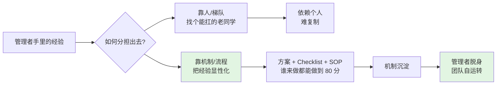
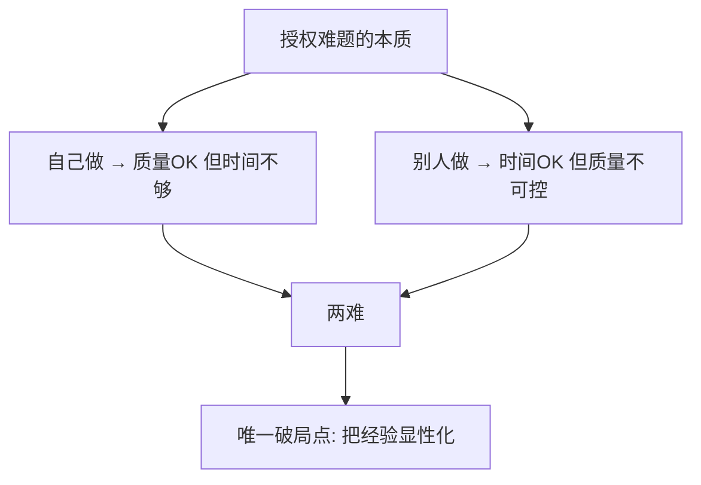
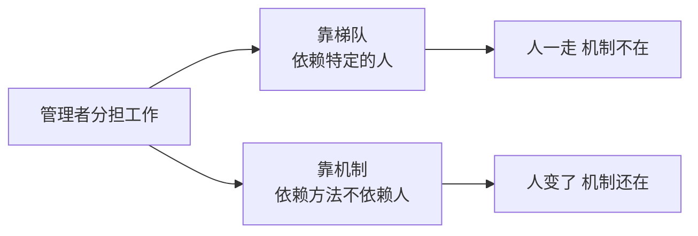
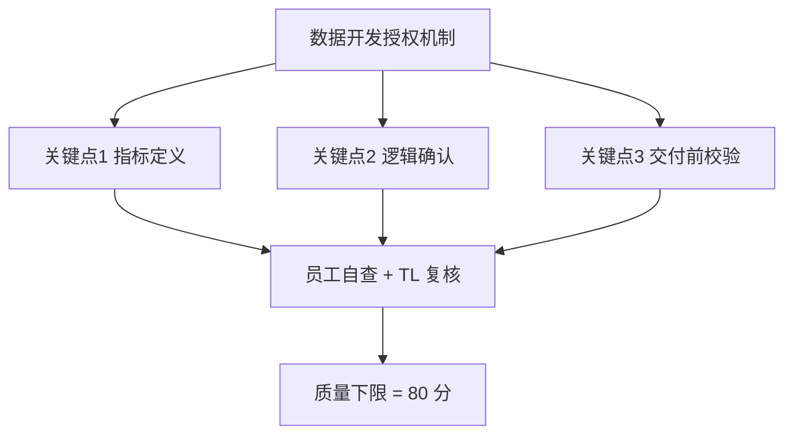
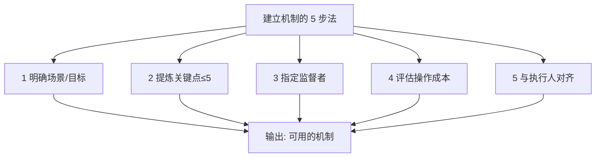
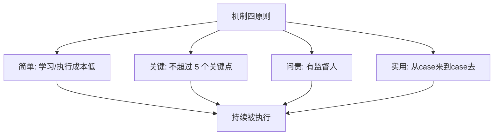
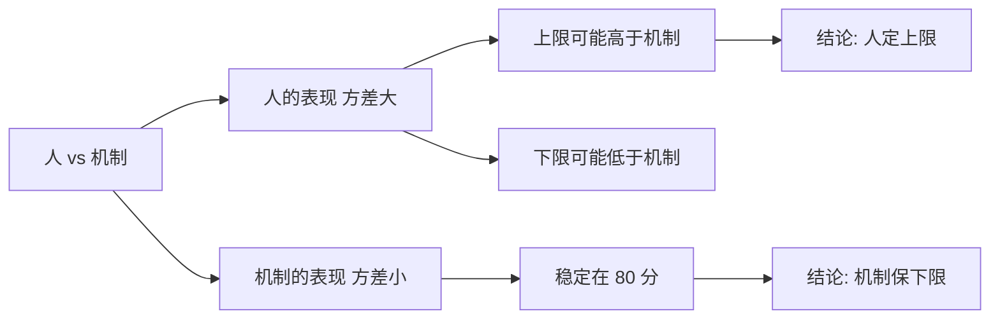

# 流程机制的运行

#### 目录介绍

- [01.开头故事引入](#01开头故事引入)
- [02.先看问题的场景](#02先看问题的场景)
- [03.给出建设性建议](#03给出建设性建议)
- [04.机制建立的对话](#04机制建立的对话)
- [05.授权机制的建立](#05授权机制的建立)
- [06.机制的几大原则](#06机制的几大原则)
- [07.关于机制的辩论](#07关于机制的辩论)
- [08.故事的回响](#08故事的回响)
- [09.思考题和作业](#09思考题和作业)

## 01.开头故事引入

**放权后踩的坑。** 我身边一位做 TL 的朋友来找我诉苦："以前我自己写代码 bug 很少，当了 TL 之后代码活分下去了，结果上线一个版本出了 5 个 P3 bug，团队被打了低绩效。我是不是不该放权？以后还是我自己来吧。" 他这句话代表了太多新经理的心态——放权没成效、缩回来自己干、自己累死、团队没成长、放权更不敢，恶性循环。

**资深 TL 给他的灵魂三问。** 后来他找了部门一位资深 TL 聊。对方没直接给答案，只问他三个问题：你当时自己做的时候为什么 bug 那么少？他答：我每次上线前都会过 Checklist、灰度 30 分钟、对比监控指标。你把活分下去时，把这套 Checklist、灰度、监控对比一起分下去了吗？他答：没，我只是把任务本身派给他了。那出问题不是因为人，是因为你把"人"分下去了，但把"做事的方法"留在了自己脑子里。一语点醒。

放权放的不是事，是一套可复用的做事方法——也就是"机制"。

今天这一节，带你看这位朋友后来是怎么从"自己的成功经验"里提炼机制、并一步步把它落地下去的。

## 02.先看问题的场景

**一个典型的授权难题。** 一位管理者抛出来一个问题请求支援，他说："目前碰到一个问题困扰我一段时间了。之前自己负责开发的时候数据基本没问题。做管理之后，数据开发就分给别人做了。由于做管理沟通协调的工作占了大量时间，团队成员的项目质量也没很好地把控，导致这次上线后出现问题较多。本来想着用人不疑，于是就大胆放权，结果出现了这么多问题。如果自己亲自做是可以保证质量的，但时间又不够用，大家帮忙想想办法！"

**问题的核心定位。** 要想有效地支持到他，首先得弄清楚问题的核心是什么。那么这到底是个什么问题呢？他已经交代得比较清楚了——数据开发这个工作他没时间做、别人又靠不住怎么办？显然，这是一个来自工作授权的挑战。

## 03.给出建设性建议

**梯队与机制两条路。** 要想让员工分担我们手头上的工作，要么靠梯队，要么靠机制。所谓靠梯队，就是团队里有胜任度非常好的人可以帮我们搞定这件事，并且这个人已经是这方面可靠的梯队人才。显然案例中的管理者在数据开发上的梯队是靠不住的，那么就只能是靠机制了。

**机制的本质是可复用的方法。** 所谓靠机制，就是设计一套方案来专门应对某个场景出现的问题，这套方案可以指导和"搀扶着"员工做好这类工作。你可能会说，带着员工一起做不是会产生更好的效果吗？你说的有道理，但是这样做的最核心的目的达不到——即要减轻管理者的负担和精力开销。

## 04.机制建立的对话

**成功经验是机制的原料。** A 这样回复他："你这个问题并不难解决，因为你具备一个关键条件就是你有成功经验。因为你亲自做这件事是没有问题的，所以你要做的要么就是把你的经验和能力迁移给员工，要么就是把你的经验和能力提炼出一套机制，让他们遵循这套机制来做就可以。作为管理者，如果你想抽出时间干别的，梯队和机制的建设会把你解放出来。" B 说接下来梳理一下我的经验、形成文档。关键问题是你觉得你做到了哪几点让你可以保证项目质量？即如果让你检查员工的工作，你检查哪几个点？

**三个关键点的提炼。** B 说："至于我为什么能保证质量，我觉得可能有三个点我做得比较好：第一我特别关注数据指标的定义；第二我会把数据计算逻辑和需求方进行确认；第三我在交付项目前会先做数据校验。" A 说："非常好，那么在你看起来，如果你的员工在这三个环节也都不出问题，你觉得他交付的项目质量能否得到保障？" B 说："八九不离十，不会出大的偏差。" A 说："那么如果你只是检查这三个关键点，你的时间和精力开销是否可以接受？" B 说："可以接受。" A 总结道："那么这就是一套关于数据开发这件事的授权机制，你可以和员工商量一下怎么配合执行。"

## 05.授权机制的建立

建立一个机制，有五个必须走完的动作。

**明确目标与场景。** 首先要明确该机制要解决什么场景下的什么问题，即明确目标。机制的一大特点就是场景化特性非常明显，因为它们都是为了应对好特定场景下的问题而产生的，比如服务报警响应机制、公关事件应对机制、新人入职培养机制、项目沟通机制等等，你会发现前面的定语都是场景化的。对于前面的案例来说，就是为了应对"梯队靠不住、自己又没时间时，数据开发项目如何推进"这个场景。所以你建立一个机制时首先要描述清楚场景是什么。

**提炼关键点不是整文档。** 从你和其他经验丰富的人身上提炼出应对该场景的关键环节，因此当有成功经验时这些关键点的提炼会容易得多。这里并没有说要去整理一个流程文档，因为和一个步骤完整的文档相比，关键点的提炼更为重要，这会让执行成本降低，也更有可操作性。这就是为什么在前面的案例中，要问"你觉得你做了哪几点让你可以保证项目质量？"而没有说"你可以把你的经验整理成操作文档让员工照做"。

**明确监督者与检查点。** 明确由谁来确保机制的执行，即谁在什么时候检查什么关键点。每个流程和机制的执行情况如何，谁来检查和确认呢？如果少了这个监督者，流程和机制的有效性就得不到保证。所以每个机制都要设立监督者或检查者。显然在前面的案例中，这位管理者本人就是那个检查者，也只有他自己才可以胜任。

**确认可操作的成本。** 确认该机制对于执行者来说是可操作的。你建立机制是为了简化工作，最好能够做到"自动驾驶"，如果建立的机制反而给执行者带来更大的操作成本，那你就得反思这个机制建立的必要性。所以在前面的案例中才会问："你的时间和精力开销是否可以接受？"

**与执行人取得共识。** 由于机制的制定者和执行者常常不是同一个人，所以该机制是否有效以及能否实施，需要和其他执行人沟通并达成一致。这就是在前面的案例中最后所交代的"和员工商量一下怎么配合执行"。

## 06.机制的几大原则

**可操作即简单原则。** 随着日积月累，你会发现机制和流程越来越多，它们慢慢变得不再那么好用，最后甚至长篇累牍地躺在一些页面上"睡大觉"。那如何才能让这些流程机制得到有效的执行呢？可操作即简单原则。机制要以最小的学习成本和操作成本为原则，这是最首要的原则。如果建立的机制不具备可操作性，那么你自我感觉再完美、能应对的问题再多，最后也要被抛弃掉的。因为不具备操作性的机制是没有意义的。

**只打关节点即关键原则。** 建立一套机制，不必要对所有的细节进行完整的描述，没有人喜欢看长篇大论的文字，你只要告诉大家在哪几个最关键的节点做什么样的动作即可，而且这样的关键点也不能太多、以不超过 5 个为宜。这样做可以大大降低执行成本、提升机制的可操作性。

**明确到人即问责原则。** 在各个关键点由谁来跟进呢？这个问题要有明确的约定，不能完全靠人的自觉性。比如你建立一个发红包的机制，若你只是说一句"迟到的发红包"，那你会发现经常有人迟到了也不发红包；但如果你指定了一个监督人由他去监督执行，那这个红包机制的运作就没有问题了。这就是所谓的问责原则。

**从 case 中来到 case 中去。** 千万不要为了建机制而建机制，每一个机制都要有实用价值。由于机制都是有场景化特性的，当场景发生了变化机制也要随着升级，而对于机制的重新审视和学习都意味着额外的开销，所以每个机制的维护都是有成本的。如果没有随着场景更新升级，那这些机制也就成了没有意义的机制，时间长了就变成大家常遇到的情况：什么机制都有但是大家不执行，或执行效果不好，反而成了管理的累赘和负担。

## 07.关于机制的辩论

**机制不是越多越好。** 机制不是越多越好，而是越少越好。这个观点和前面提到的关于机制的简单原则、实用原则一脉相承。你要明白一个道理：机制的建立并不会解决问题，对机制的执行才能解决问题，而机制的建立、执行和后期维护都是需要成本的，所以千万不要贪多，在风险可控的前提下，机制能不建就不建、能少则少。

**靠人还是靠机制。** 关于到底是人靠谱还是机制靠谱。很多管理者都认为，事情都是人做的，人如果足够靠谱机制就没什么用了。对此，一种更准确的看法是——人的靠谱度的方差比机制大，即人靠谱的时候比机制靠谱、人不靠谱的时候会比机制更加不靠谱。即便是最靠谱的员工，也会由于身体状态、精神状态、情绪状态以及外部干扰变得偶尔不靠谱，而机制的意义就在于当人不靠谱时事情也不至于变得很差。所以机制是为了保证做事的"下限"的。同时机制有很好的迁移性和传承性，不会随着某个人的缺位而产生大的影响。因此必要的机制是不可或缺的。

## 08.故事的回响

**朋友团队半年的质变。** 那位朋友按"三关键点机制"执行了半年后，团队的指标发生了几组显著变化：数据项目每个版本上线出 P3 以上 bug 的数量，从 5 个降到 0~1 个，下降近九成；下属能独立负责的项目从 0 个增加到 3 个；TL 自己每周花在"回头救火"上的时间，从 15 小时压缩到 2 小时，节省了近九成；团队绩效评级从"待改进"上升到"良好+";过去不敢再放权的事，现在能安心再放两件出去——这才是真正意义上的质变。

**我的三个深层领悟。** 第一个领悟：授权不是把"事"交出去，是把"做事的关键点+检查方式"一起交出去。第二个领悟：机制不是规章，是"把你脑子里最宝贵的 3 个判断"抄成一张能照做的卡片。第三个领悟：机制的价值不在"防止失败"，而在"解放管理者精力去做更高杠杆的事"。

## 09.思考题和作业

**三道思考题。** 第一题，自查题：你团队里是不是也有"只有你能做好"的那件事？你有没有提炼过它的 3~5 个关键点？

第二题，选择题：如果机制执行不到位，你会先换人还是先优化机制？

第三题，情境题：团队有个新 bug 出现了两次，你会怎么做——教训当事人/加一条新机制/优化现有机制？为什么？

**三道实践作业。** 作业 A（必做）：挑选团队中最痛的一个场景（发布/上线/评审等），按 5 步法写出一个机制（关键点≤5）。

作业 B（必做）：让执行人按机制跑 2 周，每周小结一次，然后按反馈修订 V2。

作业 C（选做）：复盘你团队里现有的 10 条机制，砍掉一半"睡大觉"的僵尸机制。

**延伸阅读书单。** 推荐《清单革命》理解"清单即机制"；推荐《丰田生产方式》理解"改善+SOP"的关系；推荐《卓有成效的管理者》中"以产出为导向的自动化"。

**承前启后。** 目标、责任、机制这三根支柱撑起了"事情能被推动"。但事情的推动最终要靠人来完成，人与人之间的介质是**沟通**。前面的机制之所以能落地，本质上是因为沟通闭环生效了；机制之所以会睡大觉，往往也是因为沟通断链。下一章开始进入"管理沟通"模块，第一篇先把"沟通到底在解决什么问题、有哪些常见误区"这个总框架讲透，再依次拆解向上、向下、横向三个方向的具体打法。

> 本节金句：放权放的不是事，是你脑子里那三条"怎么才不会出事"的判断。
