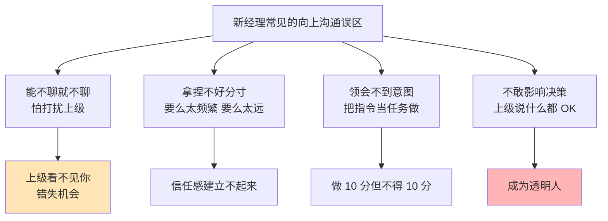
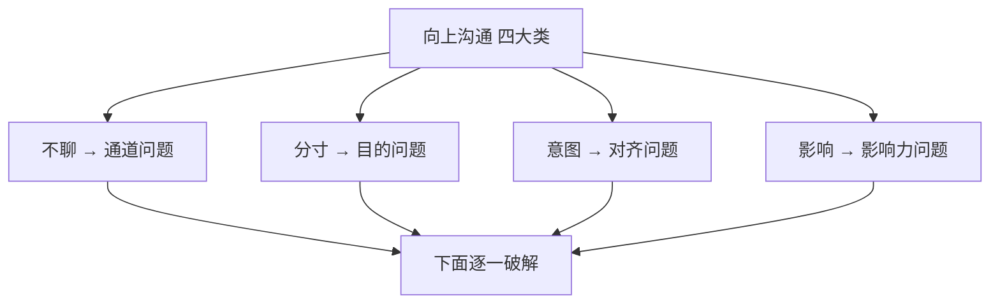
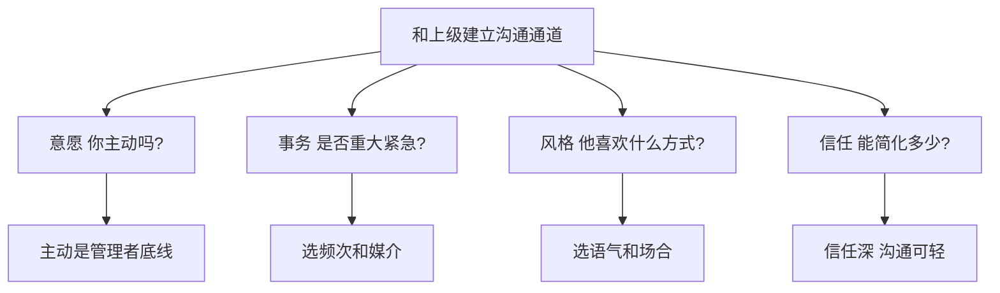
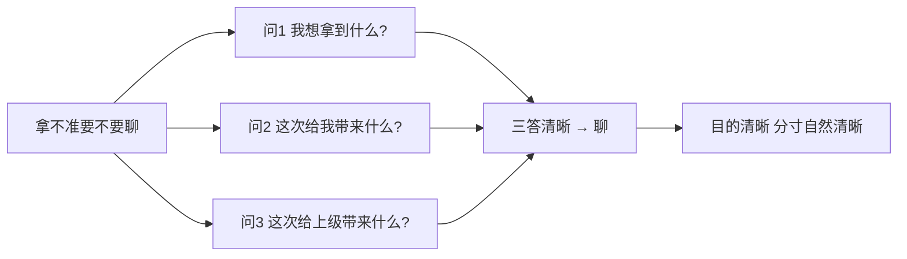
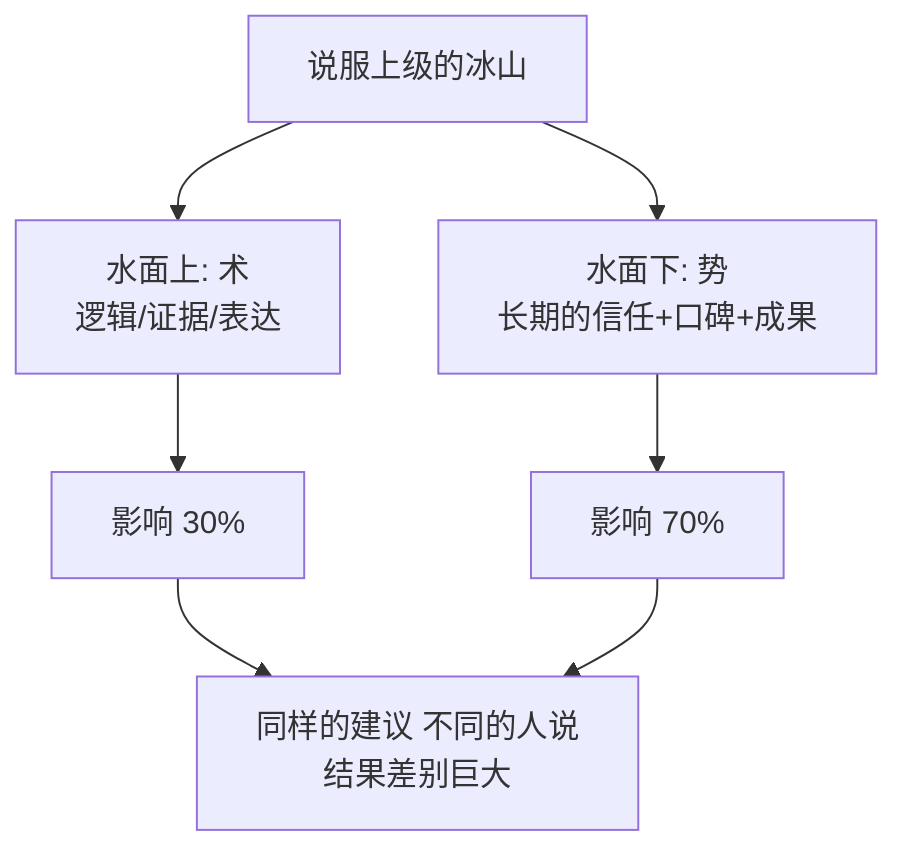
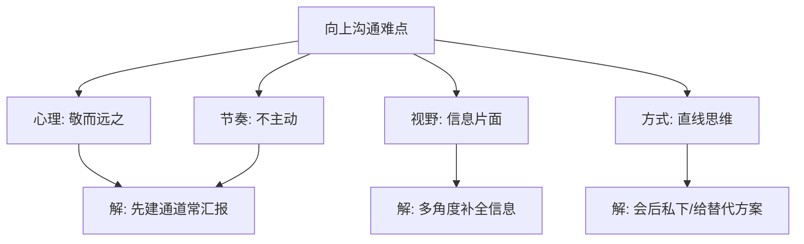
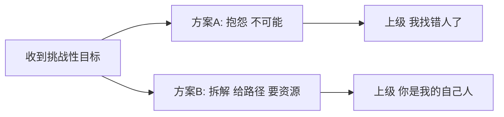
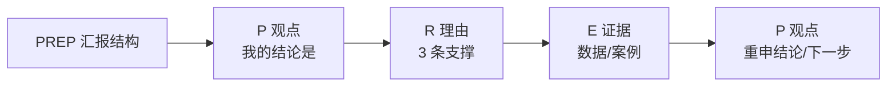
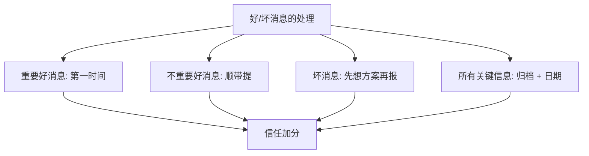
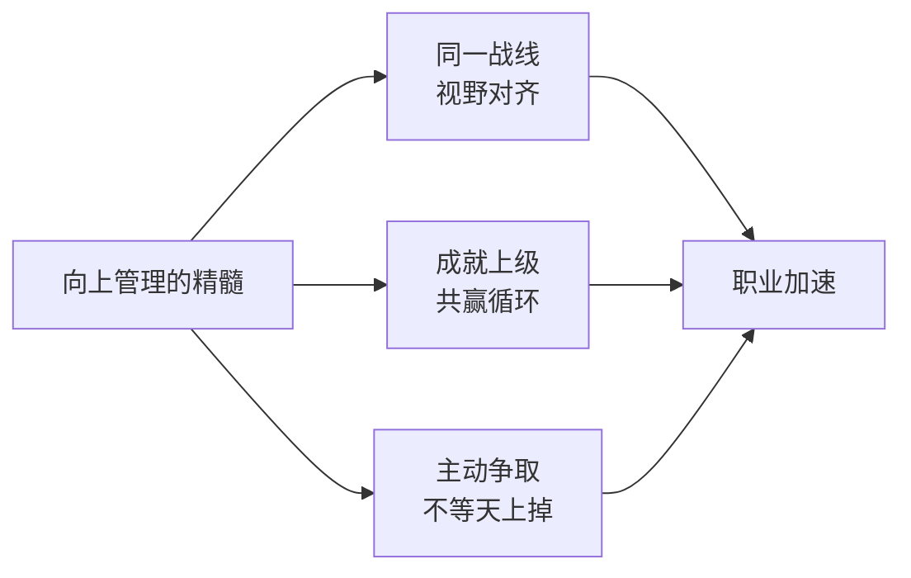

# 管理之向上沟通

#### 目录介绍

- [01.开头故事引入](#01开头故事引入)
- [02.向上沟通四大类](#02向上沟通四大类)
- [03.能不聊就不去聊](#03能不聊就不去聊)
- [04.拿捏不好的分寸](#04拿捏不好的分寸)
- [05.难领会上级意图](#05难领会上级意图)
- [06.影响上级的决策](#06影响上级的决策)
- [07.向上沟通的难点](#07向上沟通的难点)
- [08.向上沟通的案例](#08向上沟通的案例)
- [09.高效向上去沟通](#09高效向上去沟通)
- [10.向上沟通的注意](#10向上沟通的注意)
- [11.向上管理的精髓](#11向上管理的精髓)
- [12.故事的回响](#12故事的回响)
- [13.思考题和作业](#13思考题和作业)

## 01.开头故事引入

**被压了三个月的重要建议。** 我刚当 TL 那年，发现我们团队有一个很糟糕的上线流程：每次发版都要手工改 5 个地方的配置，出错率极高。我花了一周时间琢磨出一套自动化方案，成本不高、收益很大。

但我把文档写完后，整整压在抽屉里三个月——因为我怕上级觉得"你一个刚当 TL 的新人，瞎改什么流程"。我每周都告诉自己"下周找个机会跟他聊一下"，但每次碰到他都是寒暄两句就错过了。三个月后，部门另一个小组因为同样的问题出了线上事故，上级在全员会议上说："这种问题早该有人推动优化。" 我坐在后排，脸涨得通红。

**同事一句话让我惭愧。** 散会后同事问我："你不是早就写了方案吗？为什么不跟老板说？" 我说："我怕他嫌我多事。" 同事冷冷回了一句："你不主动说，他凭什么知道？他不是你肚子里的蛔虫。向上沟通不是'打扰他'，是'让他看见你'。" 这句话我记了很多年。

今天这一节，把"向上沟通"这件被无数新经理回避的事情彻底拆开讲清楚：四大误区、四个核心技巧、一个终极心法。

## 02.向上沟通四大类

**能不聊就不聊的表现。** 和上级能不聊就不聊，主要说法有："上级太忙了，我的事情好像没有那么重要，等他闲了再说吧。""找不到上级，他很少在工位，每次碰到他都急匆匆地走开，没机会聊。""把领导交代的工作做好就行了呗，有事没事找领导聊啥，最讨厌有事没事讨好领导！""总是觉得和上级有距离感，很难聊到一块儿。""每次见了上级说话都不利索，能用邮件沟通就写邮件吧。"

**拿捏不好分寸的表现。** 拿捏不好该不该和上级聊的分寸和尺度，主要说法有："最近取得了一个不错的成绩，要不要和上级说一说呢？""感觉自己离技术越来越远有些焦虑，是不是可以把上级当作朋友来聊聊呢？""某项目很可能会 delay，上次和领导打过招呼了他不置可否，随着形势越来越严峻，我要不要再跟他说一次呢？""我和合作者有些隔阂，不知道适不适合告诉上级。""上级招我们来是解决问题的，而不是来给上级制造问题的！"

**很难领会上级意图。** 很难领会到上级的意图，主要说法有："上级告诉我这个项目要加紧了，可是要加紧到什么程度呢？""上级把这个工作交给我负责，却又安排别人参与进来，这是不信任我吗？""上级让我去做一个调研，也没有说什么时候要结论，到底急不急呢？""老板到底在想什么呢？他最近突然不找我了……"

**影响上级观点和决策。** 如何影响上级的一些观点和决策，主要说法有："老板常常有不靠谱的需求和新想法，我就不知道该如何柔和又不失礼貌地拒绝。""上级对项目进度的需求总是很高，如何管理上级的预期呢？""有个项目需要向领导申请增加人力，如何跟他说呢？""上级总是不采纳我的建议，有何良策吗？""上级不懂业务，还喜欢拍板做决策，怎么应对？"

## 03.能不聊就不去聊

**建立良好沟通通道的四要素。** 关于"和上级能不聊就不聊"。你不难发现，无论是所谓的"上级太忙了"还是"找不到上级"，甚至干脆认为就不该和上级沟通，归结起来都是没有意识、意愿或能力和上级建立良好的"沟通通道"。那么如何建立良好的沟通通道呢？你可以从四个方面来着手和审视。第一是沟通意愿，这是基本前提——作为一名工程师，你不主动和上级沟通问题也不大，因为上级一般会有意识地主动和你沟通，但是如果作为一名管理者你还不主动和上级沟通的话，那就相当于已经上大学了还要家长和老师逼着做作业一样，又如何指望你能带领别人往前走呢？第二是事务特点，即根据事务的特点比如是否重大、是否紧急、是否敏感、是否正式等，来确定沟通的方式和频次。第三是沟通风格，如果说审视事务的特点是根据"事"来选沟通方式，那么审视沟通对象的风格就是根据"人"来选择沟通方式。第四是信任关系，如果说前面提到的沟通意愿、事务特点和沟通风格都是为了鼓励你主动加强沟通的话，那么对于你和上级信任关系的审视就是让你看看是否可以简化沟通。

**有意识的不沟通。** 你如果从沟通意愿、事务特点、沟通风格、信任关系盘点下来，还是不需要和上级去沟通，那么这种不沟通就是你有意识的不沟通，它可能带来的破坏性和损失也就可控了，这和消极的不沟通是两码事。

## 04.拿捏不好的分寸

**分寸的根因是目的不清。** 关于"拿捏不好该不该和上级聊的分寸和尺度"。每个人在评判该不该聊的时候都是基于自己的管理常识，而每个人在和不同的上级打交道的过程中形成的常识是不同的。大多拿捏不好"该不该聊"这个问题的情况，都是由于还没有厘清自己想通过这次沟通拿到什么，即沟通的目的和初衷不清晰。

**三个反问帮你明确目的。** "最近取得了一个不错的成绩要不要和上级说一说呢？" 这时你可以问下自己："我是想就此向上级表达我很有成就感？" "感觉自己离技术越来越远有些焦虑，是不是可以把上级当作朋友来聊聊呢？" 这时你可以问下自己："我是想就此寻求上级的支持和帮助，成功地让他给我一些建议？" "某项目很可能会 delay，上次和领导打过招呼了他不置可否，随着形势越来越严峻，我要不要再跟他说一次呢？" 这时你就可以问下自己："我是想就这个问题再和他做一次信息同步，如果有可能，我会进一步说服他给我提供一些资源和支持吗？"

在这类问题上无法去评判哪个目的更重要，只有当事人自己才最清楚这个目的对他来说意味着什么。至于每个目的有多重要，你还可以问自己两个问题——这次沟通能给你带来什么价值？这次沟通能给上级带来什么价值？

## 05.难领会上级意图

**四个人之间的对话。** 关于"很难领会到上级的意图"。对于沟通意图的领会，其实就是对于信息的无失真传递和接收。看似是两个人之间的沟通，其实至少是"四个人"之间的对话——你想表达的、你实际表达的、对方听到的、对方对于听到内容的理解。这其中每一步传递都会造成失真，所以很难领会到对方的真实意图也就情理之中了。

破解的办法是每次接到指令多问一句"您希望我产出的标准是什么、希望什么时候拿到"，用反向复述让信息回到源头再过一遍。

## 06.影响上级的决策

**说服上级靠的是势不是术。** 关于"如何影响上级的一些观点和决策"，这是向上沟通中的一大类需求。无论是"希望上级接受自己的建议"或者"拒绝上级的不合理需求"，还是"调整上级的预期"或者"说服上级给予资源和支持"，归结起来都是让上级听从自己的看法和方案，即把自己的认知和期待输出给上级。所以这类需求其沟通的目的就在于"输出影响"。

为了达到"输出影响"这一目的，你可能会根据上级的风格去选取合适的沟通方式，根据上级的关切去选取合适的内容和呈现逻辑，并根据上级的状态去选取合适的沟通时机。但这些都是"术"。说服一个人时，沟通技巧是在"术"的层面起作用，而对说服效果影响更大的因素却是水面下的冰山，即"势"的部分——也就是你对他的影响力如何。当你对他的影响力很小的时候，你的技术和方案再优秀、影响力也是非常有限的。举个例子，对于一个完全相同的建议，一线工程师提给 CEO，和 CTO 提给 CEO，极有可能是完全不同的结果。

## 07.向上沟通的难点

**四个高频难点。** 第一个难点来自于传统观念，俗话说"官大一级压死人"，很多职场人一想到向上级沟通就开始犯怵、甚至是焦虑。第二个难点是缺乏主动性，平时不主动汇报，等到出大事自己兜不住再去找上级汇报，这样只会延误了最佳的战机。第三个难点是信息片面，向上级沟通时由于自己获取的信息有限，很容易做出片面甚至是错误的判断。第四个难点是直线思维，如果你在向上沟通的过程中不认同对方的观点或是不认同对方的处理方式，最好不要在公开场合正面怼，可以在会后私下沟通、在执行过程中进行修正。

## 08.向上沟通的案例

**同事老牛的漂亮汇报。** 直属领导和几个组长开会，第一句话就把他们噎到了："这个月每个组的营销额目标，在原基础上涨 20%，会有一些困难，大家想想办法。" 听到这话，在场的组长们一片哀嚎，很多人脱口而出："这根本不可能完成啊……" 没想到，一直沉默的同事老牛说："老大，我觉得要完成目标需要做几件事——第一，大家可以先盘点一下手头上的资源，包括人力、预算、可以协助的团队等等；第二，我们开会做个目标拆解，把整个月的目标拆解到每周和每天把控好进度；第三，看看要完成每天每周的进度需要哪些资源，再请老大帮忙申请一下资源。" 领导向他投去赞许的目光，欣然同意了这个方案。当领导遇到难题时，听到大家都在抱怨、推诿，这时候有一个人站在领导身边想方设法借助领导的资源去摆平困难、把不可能变成可能，不得不说这种懂得向上管理的人谁都愿意倾力相助。

## 09.高效向上去沟通

**内容精简扼要。** 沟通交流方式一定要尽量保持简洁。管理者的级别越高，其它级别的员工在沟通工作中就越需要跟他们传达更简洁有用的信息。中高层管理者在面对海量信息时，必须要筛选大量信息，把注意力集中在最有用和最重要的内容上，他们不希望在已知信息的基础上被海量杂乱信息所干扰。作为下属，在当面沟通、发送电子邮件、打电话或者写备忘录的时候，务必做到言简意赅。此外还必须根据老板的喜好调整有关工作汇报的频次。

**直奔主题。** 汇报一开始就要开门见山地陈述自己的观点或要求，然后再罗列理由和证据，最后再重新陈述一下自己的观点即可。这也是经典的 PREP 结构——Position 观点、Reason 理由、Evidence 证据、Position 观点。这个方法出自麦肯锡的 30 秒电梯理论，能帮你快速把想表达的事情说清楚、讲明白。

**做好充分准备。** 你需要在汇报之前把相关信息都了解清楚，如果信息掌握得不够全面，很容易在汇报的时候被问得哑口无言，不仅会影响汇报进度，还会给对方留下不尽职的印象。

**掌握 10/30 原则。** 如果你有 30 分钟的时间可以支配，那么汇报时间最多占用 10 分钟，剩下的 20 分钟留给大家一起讨论。很多时候，能够产生价值的信息往往会在讨论时间内产生。

## 10.向上沟通的注意

**分享重要好消息。** 缺乏安全感的员工总是倾向于跟上司分享所有的好消息。一个在时间管理方面有很大挑战的上层管理者，肯定不希望了解所有的好消息。对于一些不重要的好消息，你可以在沟通对话结束之际稍微提及；至于非常重要的好消息，那你就不应该有所犹豫、要在第一时间跟上司分享。

**诚实谨慎分享坏消息。** 在向老板分享坏消息之前，一定要仔细思考该说些什么内容、如何去表述这个坏消息并提出可以采取的改善措施，从而将负面影响控制到最低。如果你隐藏或者扭曲重要的事实，只会导致上司对你的不信任。

**归类整理重要信息。** 一定要把最重要的信息归类整理起来，务必要注明日期。信息整理可以通过传统的纸质形式归类整理，也可以通过电子文档的方式来整理。如果某个问题非常重要的话，最好打印一份摆放在老板的办公室桌面。对于上层管理者而言，由于每天可能会接触过量的信息，因此他们有可能会忘记这份文件、甚至可能会忘记关于这个问题相关的讨论。因此在这种情况下，注明日期的已归档文件就相当于是一份保险，有助于员工做好后续工作的跟进与落实。

## 11.向上管理的精髓

**跟领导同一战线。** 真正的向上管理不是讨好领导、唯命是从，而是你能与领导站在同一条战线，拥有同样的视野，一起为共同的目标而努力。在这个过程中，你通过调配领导的资源有能力去做更有价值的事情，也因此增加了你的不可替代性，最终你和领导相互成就，职业生涯也能走得更远。

**成就领导就是成就自己。** 成就上级从而成就自己。工作使大家走到了一起，同事首先就是一种合作关系。上级所掌握的资源和影响力对人在职场中的发展起到了决定性作用。职场上快速发展的人无疑都是善于和上级合作的，他们在做好份内事的同时会积极帮助上级排忧解难。上级也会把更多的锻炼机会提供给他们，把自己的真经传授给他们。他们会逐步熟悉上级的工作内容和技巧，而这些都是一个人得到快速发展的重要条件。

**主动争取机会。** 主动争取机会。成就上级从而成就自己绝对是一条重要的原则。当你在为上级偏心而抱怨时，是否该认真反思一下自己遵循了这个原则。机会真的不会从天而降的，更多时候要靠自己去争取。

## 12.故事的回响

**三个月打破静默后的变化。** 从"怕打扰"到每周主动汇报，三个月后的变化远比想象中来得快。原来每周和直属上级沟通不到一次，主动之后稳定到三四次；季度里被上级点名表扬的次数，从零次变成三次；方案被采纳的比例从两成拉升到七成；上级开始主动来问我对某些事的意见——这是过去从未发生的信号；半年后的绩效评级也从"良好"跃升到"超预期"。

**我的三个深层领悟。** 第一个领悟：不主动汇报不是谦虚，是让上级做选择题时忘了你这个选项。第二个领悟：PREP 不是话术，是"帮上级节省他最贵的时间"。第三个领悟：真正的向上管理是"让上级因为有你而放心"，不是"让上级因为有你而高兴"。

## 13.思考题和作业

**三道思考题。** 第一题，自查题：你现在和上级的沟通是"意愿/事务/风格/信任"哪一块最弱？

第二题，选择题：坏消息你会选择"马上报带方案"还是"等等看也许能解决"？为什么？

第三题，情境题：上级的决策你不认同，你会选择"会上直接反对"、"会后私下说"、还是"先照做再想办法"？

**三道实践作业。** 作业 A（必做）：下周主动约一次和上级的 30 分钟沟通，用 PREP 结构讲一件你想推动的事。

作业 B（必做）：给自己建一张"向上汇报清单"：每周汇报什么、每月汇报什么、每季度汇报什么。

作业 C（选做）：把你上级最关心的 3 个指标列出来，每次汇报围绕这三个指标展开。

**延伸阅读书单。** 推荐《向上管理》理解和上级"共赢"的底层逻辑；推荐《金字塔原理》把 PREP 升级为结构化表达；推荐《影响力》理解"势"大于"术"的杠杆。

**承前启后。** 向上沟通解决的是"让上级看见你的价值"，接下来要解决的是**"让下属愿意听你说话"**——这是另一种完全不同的博弈。向上是"少而准"，向下是"多而稳"；向上要给结论，向下要给出路。下一章我们进入向下沟通，聚焦四个高频场景——批评、对频、管牛人、管刺头，把每一种都拆到"具体第一句话怎么说"的颗粒度。

> 本节金句：向上沟通不是抢上级时间，是帮上级省决策成本。
