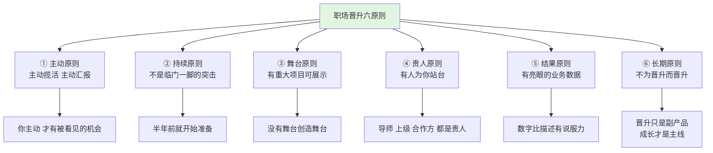
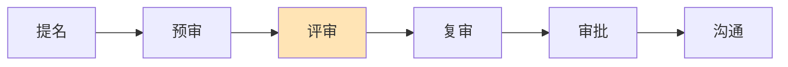
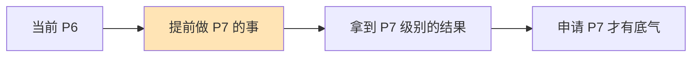
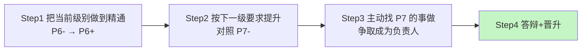

# 职场晋升的规则

#### 目录介绍

- [01.开头故事引入](#01开头故事引入)
- [02.职场晋升的原则](#02职场晋升的原则)
- [03.职场晋升的流程](#03职场晋升的流程)
- [04.提前做下级的事](#04提前做下级的事)
- [05.做好当前级别事](#05做好当前级别事)
- [06.主动揽活的思维](#06主动揽活的思维)
- [07.通用的晋升步骤](#07通用的晋升步骤)
- [08.故事的回响](#08故事的回响)
- [09.思考题和作业](#09思考题和作业)

## 01.开头故事引入

**连续两次晋升失败的那个人。** 我身边有个同事小 H，P6 做了 4 年，期间申请过 2 次晋升都挂了。第一次挂的理由是"项目贡献不够突出"，第二次挂的理由是"方向 Owner 意识不足"。

两次之后他情绪很崩："我不是不干活啊？你让我做什么我都做，周末加班都愿意。我到底做错了什么？"

我当时也还不是管理岗，听他倒苦水也只能安慰几句。真正当我自己后来做了 TL、参加过几次晋升答辩当过评委后，才明白小 H 的问题——他以为"主管会帮他搞定晋升"，以为"被动干活就是积极"。

**评委席上看到的"晋升真相"。** 我第一次坐在评委席上，连续听了 8 场答辩，发现一个规律：能通过的人，PPT 里都有一个关键词叫"我主动"；没通过的人，PPT 里反复出现的是"我被安排"。

晋升不是你的主管替你争取来的，晋升是你自己"打磨一把够硬的刀、然后在关键的战役里主动亮出来"这个过程的自然结果。

今天这一节，就把从"评委视角"看到的晋升底层规则讲清楚——尤其是第一条主动原则，直接决定你是 P6 还是 P7。

## 02.职场晋升的原则

**主动做事原则。** 工作要积极主动，你对它的理解真的准确吗？很多人尤其是刚进入职场的同学，可能会以为"服从命令听指挥""多做事"就是积极主动，结果反而容易养成两个不好的习惯。第一个不好的习惯是认为主管肯定会帮你搞定晋升。第二个不好的习惯是被动接收信息。主动规划工作任务、主动跟别人了解更多信息，合起来就是主动做事。主动做事的人比等着别人安排的人更容易晋升，这就是总结的第一条原则，主动原则。

认为主管会帮你晋升的误区。你可能非常信任主管，认为自己只要把主管安排的任务做好，晋升就是水到渠成的事情。所以你就算觉得现在分配的任务对自己的成长帮助不大，也不会主动跟主管沟通，而是认为"他这么安排肯定是有道理的""也许过一段时间他就会给我安排新的任务"。这其实是不对的。首先并不是每个主管都会关注组员的成长——有的主管特别关注业务目标是否达成；有的主管特别关注团队形象、所有对外承诺的事情都一定不能延期；有的主管特别关注自己的职位爬升，团队成员对他来说只是一种可利用的资源。

被动接收信息的误区。你可能认为把自己的本职工作做好就够了，其他事情自然有对应岗位的人去负责，因此你很少去主动了解很多工作相关的信息。比如业务功能上线后业务效果如何？业务效果不好的可能原因是什么？整体的业务机房的部署结构是什么样的？这些信息对技术人员不属于自己岗位职责的范畴，但是在晋升的时候却是评判技术人员综合能力的重要考察内容。

主动找主管沟通工作。不管主管是什么风格，你都应该定期或者不定期地找他沟通关于工作任务的想法和意愿。一方面是听听他对自己的看法，获取指导建议；另一方面你也可以借此机会了解更多关于团队、业务和部门的信息，有机会的情况下尽量主动承担有挑战性的工作。

主动找别人沟通。很多人害怕主动找别人要东西，可能有性格方面的原因，但更主要的原因还是动力不足。怎么获得动力呢？有个方法特别有效，就是从晋升答辩的角度来看。每当你想退缩的时候，就可以问问自己："如果评委问到这个问题，自己能回答上来吗？" 比如这个业务上线后效果怎么样，有没有数据去衡量？如果没有达到预期，主要原因是什么？

**挖掘成长点原则。** 掌握了主动原则之后，你是不是已经壮志满怀，准备好大包大揽地干活儿了呢？先等一下，这里可能还有两个思维陷阱等着你。第一个陷阱是以为事情做得多，自然就能晋升。第二个思维陷阱更有迷惑性，那就是以为事情做得好，自然就能晋升。一边做事一边挖掘成长点、提升自己能力的人，比光顾着做事的人更容易晋升，这就是总结的第二条原则，成长原则。

做事多就能晋升吗。这个陷阱很有迷惑性。一匹马拉磨拉了 10 年，另一匹马则是征战 10 年，这两匹马的经验能一样吗？虽然拉磨的马走的距离可能更长，但如果征战的马见过的场面一定更复杂、更多样。其实人也是这样。只做自己会做的事情，不断地重复，你只会变成熟练工，而不会成为技术专家。所以不要把 1 年的工作经验重复 10 年，而要真正积累 10 年的工作经验。

事做好就能晋升吗。很多人都有一种朴素的想法："我把老板安排的任务做完，保证效率和质量，拿到好的绩效，晋升肯定没问题。" 结果他们虽然拿到了好的绩效，但晋升却屡屡碰壁。为什么会出现这种情况呢？因为不同级别的能力要求是有本质的区别的，而不仅仅是熟练度的区别。能够把事情做好，只能说明你已经熟练掌握当前级别所要求的能力，但并不一定意味着你的能力就自动达到下一职级的要求了。

正确理解成长原则。如果现在的工作你已经可以得心应手地轻松完成了，就应该尝试更高难度、更高复杂度的事情了，而不是一味地刷熟练度、沉迷在自我感觉良好的状态里。比如你一直做业务开发，已经成为了组里的骨干，不但效率高而且质量又好，那么你就可以试着完成方案设计、架构设计、架构重构和系统优化等工作。另外，不管事情做好了还是没做好，你都应该多做复盘总结，找到可以提升优化的点。

**为公司创造价值。** 掌握了成长原则之后，你是不是又像"打了鸡血"一样，准备好好学习、提升几项技能了呢？别着急，先给你讲一个真实的故事。

有一次一个老同学问我："怎么学习编译原理的？" 我觉得有点奇怪，因为他是做 Android 业务开发的，怎么会想到要学编译原理呢？而且用到的时候很少，学的时间会很长，但是却跟工作没什么关系——学习编译原理并不能让你把开发做得更好，或者给你的业务带来新的有用的功能。换句话说，如果从晋升角度考虑，他学习的技能无法为当前的公司创造价值，这六个月的时间其实白白浪费掉了。

公司设计职级体系的初衷是为了衡量不同员工的能力级别，然后根据级别来制定相应的薪酬、福利、管理等制度，同时鼓励员工尽量提升自己的能力，为公司产出更大的价值。这里面有两个关键点，能力级别和公司价值，但是大部分人都只关注了能力级别，而忽略了公司价值这个点。

工作不是学术，企业也不是学校，需要的是投入与产出，所以从学习的优先级上，项目需求 > 公司愿景 > 个人爱好。项目需求是最根本的需求，也是保证你工资、绩效的基础；在项目的基础上，我们的技术要结合公司的发展与技术愿景，也只有与公司的发展上一致了，你才有机会能够爬上管理层；最后才是个人的兴趣爱好。

晋升和面试区别。面试的时候，面试官主要考察你的能力级别，因为这时候没有办法准确评估你能为公司带来的价值；但是在晋升的时候，不论你把能力吹得多么天花乱坠，如果不能体现在对公司价值的实际产出上，那一切都是废话。

如何判断产出价值。让能力为公司产出价值的人，比空有一身能力的人更容易晋升。这就是总结的第三条原则，价值原则。所以能为公司产出价值的能力才是值得优先学的能力。比如以"人工智能"为例：如果你是中级研发做 App 业务功能开发，那么用不着学人工智能；如果你是高级级别、带一个团队做 Android 开发的 Team Leader，或者是负责 App 架构设计的技术专家，可能就有必要学人工智能了；如果你是专家级别，那么不管是什么技术方向，肯定都要了解人工智能。

## 03.职场晋升的流程

**职场晋升六阶段。** 一次完整的晋升流程，一般可以分为 6 个阶段。

第一阶段是提名阶段。主管决定要不要提名你去参加晋升，必须要符合提名晋升的条件。第二阶段是预审阶段。部门对提名的名单进行预审，如果你跟其他竞争者 PK 失败，就失去了晋升机会。第三阶段是评审阶段。评委团对你进行评审，考察你的能力有没有满足要求，这块需要你做预晋升工作汇报。第四阶段是复审阶段。部门对评审结果进行复审，确认你的晋升结果，主要通过总体的数据来判断晋升情况。第五阶段是审批阶段。复审的结果上报高层审批，审批通过之后，你的晋升结果就最终确定了，然后确定薪资涨幅和股权激励之类的方案。第六阶段是沟通阶段。主管或 HR 跟你沟通晋升结果。

**晋升需先提名。** 硬性条件方面，如果你想申请晋升，至少要满足 4 个门槛。**绩效条件**要求你的评级不能差，各家公司通常至少要"正常"档以上；**年限条件**要求你在当前级别累积到规定的工作年限，具体年限各公司不同；**红线条件**要求你在合规和职业操守上没有踩线，违规一次可能直接取消多年晋升资格；**附加条件**通常和公司的技术导向有关，比如专利、开源贡献、内外部获奖等。这四项都是"资格线"，达到只代表你有资格上牌桌，能力有没有到下一级，最终还是要由人来判断。

并不是只要满足这四个条件，你就一定能够申请晋升。至于你的能力有没有达到下一级别的要求，没法硬性规定，只能由人来判断。

**评审阶段最重要。** 整个晋升流程中最核心的阶段是评审阶段。你需要向评委团展现自己的能力，并且经受他们的考察。这个阶段的标准流程可以分为 5 个环节。

第一步是选手答辩。整个评审阶段和多人面试基本类似，你需要先准备答辩 PPT（材料准备），然后面对评委团（3 个以上评委）先进行自述，展现自己的亮点（晋升自述）。

第二步是评委考察。会有多个评委来通过问答的方式来对你进行考察，验证和判断你是否达到了晋升要求（晋升答辩）。答辩完成后，评委会指出你的优缺点，并提出后续改进建议。

第三步是给予结果。评委团基于答辩情况以及评委们的判断，做出你是否晋升通过的判断，但这个环节的结果还不是最终晋升结果。

评委团的不确定性是你遇到的第一个和运气相关的因素。你无法选择晋升评委，只能尽力提升自己的能力，争取将评委团的不确定性的影响降到最低。

## 04.提前做下级的事

**转变晋升思维。** 评委们怎么判断你有没有达到晋升的要求呢？其实很简单，他们会审查你做过的事情，看看是不是体现了下一级别需要的能力。在当前级别做下一级别事情的人，才有机会晋升。这条逻辑可能会颠覆你对晋升和工作任务安排的认知。

因为按照大部分人的想法，什么级别就做什么事情，只要做好了当前级别的事情，就可以申请晋升，然后到下一级别再去做下一级别的事情。然而实际情况是，你得提前做下一级别的事情，做好了才能申请晋升。这也就解释了为什么很多 P6 和 P7 做的事情差不多的现象。

所以如果要判断自己是不是能够申请晋升了，一种简单有效的方式是——看你做的事情是不是和下一级别的人类似。想晋升的 P6 就对比 P7，想晋升的 P7 就对比 P8，以此类推。

**举个例子。** 在一些大厂，如果你是 P6 级别的技术人员，想要申请 P7，必须要"带过小项目或者小团队"（3～5 人左右）才有机会。如果你一直只是完成别人安排的项目任务，就算做得很熟练，也很难获得晋升机会的。评委看的不是你会不会写代码，而是——你有没有表现出下一级别才有的"判断力、Owner 意识、跨组协调能力"。

## 05.做好当前级别事

**把当前事做好。** 可能会想到一条晋升的捷径——晋升通过之后，立刻跟主管要求安排下一个级别的工作。这样你就可以按照下一级别的要求来提升自己的能力，很快就能迎来下一次晋升。但实际上，就算是同一个级别，不同的人能力也还是有差异的。主管不敢把下一个级别的事情直接交给刚晋升的人来做。只有把当前级别的事情做好了，才有机会晋升。

**从熟练到精通。** 可能会有疑问：我都晋升这个级别了，肯定已经具备这个级别的能力了，把这个级别的事情做好，不是理所当然的吗？其实，真实的晋升逻辑并不是这样理解的。

晋升成功只是意味着你的能力达到了当前级别的基础水平，但还不一定有熟练和精通的程度。如果你还想要晋升到下一个级别，就必须先在当前级别达到精通。应该先考虑怎么把当前级别的事情做好，把当前级别的能力提升到"精通"的程度。

**从做好到更优。** 一个关键的问题：怎么区分基础、熟练和精通呢？这其实是一个世界难题，到目前为止，还没有明确客观的标准可以直接套用。作为参考，可以这样划分。**基础**意味着"会做"，标志是能够独立自主地完成一件事，而不是别人想好之后告诉你、你再按话去做。**熟练**意味着"做好"，标志是掌握了这件事的最佳实践，能够稳定保证效率和质量，能够拿到好的结果。**精通**意味着"更优"，标志是能够创造新的经验，采取不同的方式、思维和工具来做同样的事情并取得突破。如果要再区分一下"做好"和"更优"，可以这么理解：做好只是意味着掌握了别人总结的成熟经验，而更优意味着你自己创造了新的经验。

## 06.主动揽活的思维

**主动揽活的核心。** 主动的核心是如何提升自己的认知和工作目的性，而不是如何要求别人必须配合你和支持你。如果你主动的目标是完全基于自我实现和自我提升，没理由会碰壁，往往是因为涉及过多对他人的要求，才会遇到这个问题。当然适当提升获得他人支持和配合的能力是有必要的，但前提是信任。

第一个场景：某个项目或系统存在一些问题，老板或上司希望我解决掉它。第一种解决问题态度是，工作的目标并不是解决问题，而是解决老板的认知——比如遮掩问题，或者用临时方案去处理，而不考虑未来可能的潜在风险。第二种解决问题态度是，如果你是个草根创业者，你上线了自己的产品并获得了一定的种子用户，发现服务器频繁崩溃，可能先写一个自动重启脚本拯救自己近期的睡眠，但绝不会止步于此，一定会深究原因，直到彻底查明并解决掉才会踏实。

第二个场景：某个项目和系统可能存在问题，老板要我搞清楚。第一种态度只是为了解答老板的疑惑——你找来几个同行数据发给老板，季节因素、行情价、其他大客户在投放竞价，目标是自圆其说，老板挑不出毛病，工作就完成了。第二种态度是如果项目是自己的、投放的钱是自己出的，就会深究哪个渠道数据有水分、哪个素材可能拉低了均值，不达目的不罢休。

当你基于自己的目标，真的深究一个事情，试图去搞明白一个问题、彻底解决一个问题，你所进行的思考深度、所分析的信息广度，会远远高于你为了应付别人安排所做的同样事情。而在这个过程中你的成长速度，也会远远高于其他人。

**主动思考和提升。** 比如这段代码再实现一遍还有哪些地方是可以优化的？这个系统现在的运行情况还能不能再改善？除了写代码，我还应该再学习些别的东西吗？我跟行业里的顶尖水平差距在哪里，该怎么弥补？常常去思考这些问题，时时拷问自己，发现自己的不足之处，然后有目的地去补足，不断提高自己的竞争优势。

**主动和上级沟通。** 需要和上级领导保持良好的沟通，明确你们这个小团队要做些什么，甚至整个公司要做什么。这样你才能确定优先级，去做那些对公司而言价值更高、影响力更大的工作，跟上整个团队前进的步调。

在事情干不完的大背景下，如果想对团队的贡献更多，就应该善于找到最重要的工作并且优先完成它们，而这恰恰是一些新员工都欠缺的技能，也是你能否成长为合格的技术骨干的关键所在。

**做事精益求精。** 一位实习生开始接手客服工作，她几乎回复了用户发来的每一个问题，不明白的就和产品研发沟通，尽可能给用户满意的答复，在没有要求的节假日也会处理客服问题。在这个期间她对公司的产品有了详尽的了解，不仅如此，她还和运营的同学一起组织了客服标准话术，分门别类整理反馈问题给研发和产品做参考，和运营团队一起构建客服规范等等，对业务的发展起到了非常重要的作用。

什么是牛人，就是交给他或她一件事，做成了，还做得挺好。然后再去做另一件更重要的事，又做成了。让正确的事持续发生。

**愿意为工作拼。** 不是说要鼓励你加班，但如果你在职场里不得不面临加班，为什么不选择一个你喜欢的事情来做。一个信息安全专家在休假的时候灵光一闪，想到某系统存在一种缓冲区溢出可能性，他肯定会尽快找个地方拿出电脑来核对一下，看看自己的想法是不是可以实现，生怕被同行抢先公布出来——这种成就感不是老板给多少钱工资带来的，这是人家骨子里的热爱和荣耀。

一个痴迷技术问题的人，他逛淘宝、刷微博的时候都会测试一下典型的搜索或翻页问题，思索巨头背后的技术手段是什么。如果是前端架构师还会看一下页面源代码，甚至追踪一下请求的 header 信息，看看对方代码里对加载调优做了什么，有没有自己不知道的黑科技。

如果你痴迷一个东西，你成长会特别快，因为你不会介意这是不是为了工作、谁给你付工资。你不喜欢的工作前景再好，你研究不下去，也只能是挣扎在底层，等着被新一轮年轻人碾压下去。很多人也会说"我不喜欢当前的工作，我想去做什么什么"，说实话，很多人并不是真的想去做什么，只是想找借口逃避当前的职场困境。

## 07.通用的晋升步骤

**四步方式去晋升。** 推导出适用于各个级别的通用晋升步骤，具体来说分为以下 4 步。

第 1 步，按照晋升原则的指导，在当前级别拿到好的结果，为公司创造价值，同时把当前级别要求的能力提升到精通程度（比如从 P6- 到 P6+），这样你才有机会成为晋升备选人员。

第 2 步，到了精通程度之后，对照下一级别的要求来提升自己的各种能力（比如到了 P6+ 之后，按照 P7- 的要求来提升自己），为可能的晋升机会做好准备。

第 3 步，主动寻找工作机会，尝试做下一个级别事情（比如提升了 P7 的能力之后，找 P7 级别做的事情来做，争取成为负责人，主导事情的推进和落地），继续拿到好的结果，向主管证明你具备下一级的能力。

第 4 步，拿到工作结果之后申请晋升，向评委介绍你做过的事情，展示相关的能力和结果，证明自己具备了下一级别要求的能力。

**晋升的底层逻辑。** 晋升的第一条逻辑是——在当前级别做下一级别事情的人，才有机会晋升。晋升的第二条逻辑是——只有把当前级别的事情做好了，才有机会晋升。

基础、熟练和精通三种水平的区别是：基础意味着会做，标志是能够独立完成；熟练意味着做好，标志是掌握最佳实践；精通意味着优化，标志是创造新的经验。

通用的晋升步骤是，先把当前级别要求的能力提升到精通水平，接着按照下一级别的能力要求继续提升，然后主动寻找工作机会，尝试下一个级别的工作，最后拿着工作成果申请晋升。

## 08.故事的回响

**小 H 第三次终于过的数据对比。** 小 H 听完这一套规则后，回去做了一件事——放下"我做了什么"的 PPT，开始写"我在 P7 的事上做成了什么"。半年后他第三次答辩通过，破格没过但正常晋升稳稳当当。他自己给出的对比也很清晰：主导过的项目数从 0 增加到 2 个，且都是跨组项目；PPT 里"主动"这个字眼的出现次数从 0 处飙升到 14 处，密度上就已经在传递"我是 owner"这个信号；业务结果一栏，从几乎没有量化数据，变成 GMV 增长 28%、P95 延迟下降 40% 这样的硬数字；跨组愿意帮他站台的贵人从 0 位到 3 位，"有人证"这件事在评审现场极具说服力；最终评委平均打分从 3.1 分（5 分制）拉升到 4.4 分。

**作者亲历后的三点领悟。** 第一点领悟是，晋升失败 90% 是"证据"问题，不是"能力"问题。你能力到了，但拿不出证据，评委就没法打勾。所以晋升准备的核心是——把你的能力翻译成评委能打勾的证据链。

第二点领悟是，千万别把晋升当成年底那两周的事。晋升是提前 6-12 个月开始铺路、铺的是项目而不是 PPT。没有项目，PPT 再漂亮都是空架子。

第三点领悟是，主动 = 给自己找舞台。老板不会主动把舞台让给你，你得自己站上去、自己把灯打亮、自己把聚光灯拉过来。愿意做"舞台搭建者"的人，才是真正的晋升候选人。

## 09.思考题和作业

**三道思考题。** 第一题：把你最近一次晋升 PPT 里的关键词统计一下，"我被安排""我配合""我协助"出现了多少次？"我主动""我牵头""我决定"又出现了多少次？比例直接预测你的通过率。

第二题：你当前级别你已经"精通"了吗？如果 5 分制打分你给自己打几分？小于 4 分的话，别急着申请晋升，先继续打磨。

第三题：把下一级别做的事列出来 5 件，挑一件你现在就能够开始的，本季度把它拿下。

**三个可执行作业。** 作业 A：做一张《晋升证据链清单》。纵列当前级别应掌握的 5~8 项能力，横列你目前拿得出的证据（项目/数据/文档），缺失的就是你下阶段要补的。

作业 B：和主管做一次《晋升路线图对齐会》。明确"我现在在当前级别的哪个段位""我申请晋升还缺什么证据""我下阶段能做哪一件下一级别的事"，形成一份双方签名的行动表。

作业 C：主动揽一件"下一级别的事"。本月就去揽（例如：带一个跨组专项、Own 一个技术方向、牵头一次质量攻坚），3 个月后看产出结果能否作为下次答辩的"证据"。

**延伸阅读书单。** 《技术人修炼之道》——讲技术晋升的底层逻辑，尤其是从 P6 到 P7 的认知跃迁。《浪潮之巅》——看大公司如何设计职级，帮你理解"公司视角下的晋升"。《好战略，坏战略》——把"主动揽活"背后的战略思考讲透。《金字塔原理》——晋升 PPT 写作的必备结构武器。

**承前启后。** 讲清规则、把证据链准备好，你在评审桌上就已经赢了一半。但规则只解决"什么时候能晋"，还解决不了"每天你的一小时能顶别人几小时"这件事——那是效率的问题。整本书的最后一章，我们回到最日常、最琐碎、却也最容易被忽视的一件事：**职场效率**。从时间管理、精力管理到工作方法，看看那些能长期跑赢的人，到底把哪些工作习惯当成了肌肉记忆。

---

**本节金句**：晋升不是老板发给你的奖金，是你在当前级别做成下一级别的事之后，评委不得不承认的结果；你越早放弃等待，越早开始主动。
