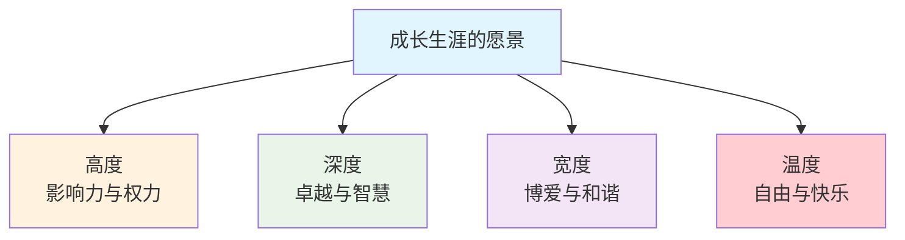

# 1.2 需求层次的模型

#### 目录介绍
- [01.看一个真实案例](#01看一个真实案例)
- [02.断点自测三问](#02断点自测三问)
- [03.有过自己的梦想](#03有过自己的梦想)
- [04.人生的需求模型](#04人生的需求模型)
- [05.梦想的需求层次](#05梦想的需求层次)
- [06.不同阶段的追求](#06不同阶段的追求)
- [07.成长生涯的愿景](#07成长生涯的愿景)
- [08.层次的激励措施](#08层次的激励措施)
- [09.最后做一些题目](#09最后做一些题目)
- [10.总结回顾本章节](#10总结回顾本章节)
- [11.后来发生的改变](#11后来发生的改变)
- [12.今天起改变三点](#12今天起改变三点)
- [13.课后作业思考下](#13课后作业思考下)

## 01.看一个真实案例

去年年中跳槽，月薪从 22k 涨到 30k，涨幅 30%。签合同那天我请同事吃饭，发了条朋友圈说「努力终于被看见」，本以为能高兴很久。

可第二个月发完工资，我躺在沙发上只觉得「也就那样」。第三个月开始盘算什么时候能涨到 35k；第四个月便重回熟悉的焦虑：嫌收入不够，嫌房子偏，嫌技术栈在贬值。

朋友一句话点醒了我：「你不是缺钱，你是不知道自己到底要什么。」

后来我才想明白：**涨薪带来的满足感消散得这么快，是因为它只填满了早已满足的安全需求，我却误以为它能兑现尊重与自我实现**。那个被我当成目标的「年薪五十万」，从来不是我真正想要的，它是饭局里的谈资，是热搜上的标尺，是外界塞给我的「成功标签」。**把别人的目标当成自己的，就永远在追一个永远到不了的终点**。

所以这一篇我想认真讲清楚一件事：**搞懂每一个目标背后的「需求层次」是什么，比拼命追目标本身更重要**。

## 02.断点自测三问

在往下读之前，先做三道判断题。任意一题命中，这一节就值得你认真读完。

| 断点 | 自测题 | 症状描述 |
|:----:|:------|:--------|
| 目标同质化 | 你同时在追的目标里，是不是绝大多数都指向「不想输给同龄人」？ | 缺失性需求扎堆：越追越累 |
| 满足感短命 | 你上一次大幅进步（涨薪、升职、换车）带来的兴奋，撑过一个月了吗？ | 消除焦虑 ≠ 持续动力 |
| 别人塞的目标 | 你敢不敢现在划掉一个正在追的目标，然后不告诉任何人？ | 焦虑当梦想：目标不是你的 |

三道题依次对应本节的三条主线：**分清目标背后的需求层次、区分缺失性与成长性、砍掉别人塞给你的目标**。你在哪一条上薄，就重点看那一段。

## 03.有过自己的梦想

你肯定有过梦想。小时候梦想着做老师、做飞行员、做工程师、当老板……不管是否实现，那些梦想真实地存在过。

反问一下，为什么会有这些梦想？如果不能清晰看见梦想之路前方的愿景，计划半途而废的概率就会很大。古希腊哲学家苏格拉底有一句名言：「未经检视的人生不值得活。」

**为什么要检视自己的人生**？因为我们有成长的梦想；而梦想的根源，是内心深处的渴望，它可以是对成长、成就、幸福和满足的渴望，也可以是对某种特定状态、经验或目标的向往。

回到我自己，我所谓的「想多赚钱」，其实是在表达「我害怕被同龄人甩下」。这不是梦想，是焦虑。**把焦虑当梦想去追，越追越累**。

## 04.人生的需求模型

上世纪四十年代（1943 年），美国心理学家亚伯拉罕·马斯洛在《人类激励理论》中提出了需求层次理论。他之所以在这一年提出，正值二战期间：当时人们面临极端的生存和安全威胁，马斯洛观察到：**只有当最基本的生存需求被满足后，人们才会关注更高层次的精神追求**。这一观察至今依然成立，你很难让一个还在为温饱发愁的人去思考「自我实现」。

马斯洛把人的需求划分为五个层次，前四层属于**缺失性需求**（需要从外部环境获得），顶层的**自我实现**属于**成长性需求**（通过内在驱动实现潜力、创造独特价值）。

| 层级 | 类别 | 关键词 | 典型来源 |
|:----:|:----|:----|:----|
| L5 自我实现 | 成长性 | 创造独特价值 | 内在驱动 |
| L4 尊重 | 缺失性 | 认可、地位、成就 | 外部反馈 |
| L3 社交 | 缺失性 | 友谊、归属感 | 人际关系 |
| L2 安全 | 缺失性 | 职业保障、稳定 | 制度与积累 |
| L1 生理 | 缺失性 | 食物、水、住所 | 基本资源 |

理解需求层次时最重要的两点认知：

- **不是严格的「完成一层才能进入下一层」**。多层次需求往往同时存在，只是在不同人生阶段某个层次会成为主导。比如创业者常同时面临安全需求（收入不稳定）和自我实现需求（想创造价值），这种矛盾恰恰是成长的动力源泉。
- **低层次需求被满足后，激励作用会迅速减弱**。涨薪的喜悦通常只能持续一两个月，之后你会把这个收入当作「理所应当」，开始追求更高层次。理解这一点，可以避免陷入「永远觉得钱不够」的焦虑，**这正是我跳槽涨薪后两周就重新焦虑的根本原因**。

## 05.梦想的需求层次

梦想与需求层次是一对镜像关系：**梦想是需求的外在表达，需求是梦想的内在驱动**。每一个梦想的背后，都隐藏着一种或多种需求。当你说「我想赚很多钱」的时候，可能是生理需求（改善生活条件）、安全需求（抵御风险），也可能是尊重需求（获得社会认可）在驱动你。**认识到梦想背后的真实需求，能帮你更精准地设定目标**。

假设你的梦想是成为一名成功的音乐家，与马斯洛五层需求一一对应就是：

- **生理**：有稳定收入维持基本生活；
- **安全**：演出收入稳定、职业发展有保障；
- **社交**：与音乐家、粉丝、听众建立起真实的联系；
- **尊重**：被行业认可、获得奖项或口碑；
- **自我实现**：通过音乐创造独特价值，创作出让自己满意的作品。

**审视一下你自己的梦想属于哪个层次**。如果还停留在解决温饱和安全，说明你还在「缺失性需求」阶段；如果已经在创造价值、追问意义，那你已经在追求「成长性需求」了。

## 06.不同阶段的追求

人生早期，你努力学习，目标是考好大学、拥有一技之长、找一份好工作、拿到更高薪水，这很大程度上是为了满足最底层的生存需求。这个阶段的核心关键词是**学习和积累**。你拥有最充沛的精力和最低的试错成本，应该尽可能多地投资自己。**在这个阶段偷的懒，都会在后面的阶段加倍偿还**。

拼搏数年、事业小成之后，工作稳定，目标转向房、车、成家。第二层次的**安全需求**开始凸显：有时候你会有一种强烈的不安全感和危机感，生活压力也逐渐加大。

这个阶段值得建立「**主备方案**」思维：**主**指当前支撑生活的工作；**备**指通过持续学习、持续成长积累起来的另一份核心能力，以避免「主」出现意外时「备」的能力已被时代淘汰。它不是让你脚踏两条船，而是让你在专注主业的同时，始终保持一项可以在关键时刻兜底的能力。**这份安全感来自于你的不可替代性**。

再往后，就会从「缺失性需求」整体切换到「成长性需求」。**缺失性需求的满足来自外部环境，一旦满足动力就会消退；成长性需求的动力来自「自我实现」的内在吸引，越走越有劲**。

## 07.成长生涯的愿景

「生涯」一词最早出自庄子：「吾生也有涯，而知也无涯。以有涯随无涯，殆已。」「涯」字原意是水边，隐喻人生道路的尽头。**借他山之玉，我把生涯分为四个维度：高度、深度、宽度、温度**。

**高度**是向上攀登、拓展影响力，关键不在于你现在站多高，而在于你是否在持续向上走。从一线开发者 → Leader → 架构师 → CTO，每一步都需要新的能力和视野。

**深度**是向下深耕、追求极致，秘诀在于「10000 小时定律」的精髓：不是简单重复，而是**有目的的刻意练习**。每次比上一次难一点，每次复盘比上一次深一层。

**宽度**是向外延伸、多元发展，不是让你什么都学，而是围绕核心能力拓展相关的辅助能力。一个优秀的程序员若同时具备产品思维、项目管理和沟通能力，价值会远超一个只会写代码的人。

**温度**是向内探索、热爱生活，追求自由与快乐。热爱是持续投入的动力源泉：**找到真正热爱的事情，才不会被 KPI 或焦虑推着走**。

**四个维度不必同时追求，在特定人生阶段选择一个维度深耕探索即可**。你有多努力、多投入去设计并实现自己的生涯规划？不计划、不努力一下，你永远无法知道自己的边界。

## 08.层次的激励措施

不同层次的需求，激励方式完全不同。一张表说清：

| 需求层次 | 激励本质 | 典型手段 |
|:----|:----|:----|
| **生理需求** | 消除不满 | 涨工资、改善劳动条件、增加休息、更好福利 |
| **安全需求** | 消除不满 | 职业保障、医疗保险、退休福利、避免混乱 |
| **社交需求** | 驱动前进 | 团队活动、和谐关系、支持与赞许 |
| **尊重需求** | 驱动前进 | 公开表扬、颁发荣誉、强调任务重要性 |
| **自我实现** | 驱动前进 | 复杂挑战、特别任务、创新空间 |

**关键洞察**：**「生理 + 安全」两层激励的本质是「消除不满」**（满足后焦虑消除但不产生持续动力）；**「社交 + 尊重 + 自我实现」才能真正驱动人持续前进**。我跳槽涨薪后只兴奋两周，正是因为涨薪只消除了「安全焦虑」却带不来持续动力。

理解这一点后，你完全可以**设计自己的激励体系**，不必等别人来激励你：

- **对生理层**：靠合理理财、提升收入来改善生活质量；
- **对安全层**：靠持续学习打造「备份方案」，建立自己的安全网；
- **对社交层**：主动加入社区、定期社交，把连接变成日常；
- **对尊重层**：给自己设定里程碑、庆祝每一次小进步，创造持续的成就感；
- **对自我实现层**：找到真正热爱的事，长期投入，创造别人替代不了的独特价值。

## 09.最后做一些题目

**小明的困境**。小明很努力，但工作没办法做上高管，小康达到但没能实现个人社会价值。用需求层次一分析就清楚了：他已经满足了生理和安全需求（小康生活），但卡在了尊重和自我实现上。这种情况非常常见：**努力 ≠ 方向正确**。很多人很努力地做事，但缺少战略性思考，不知道应该在哪些关键能力上发力。可能的改进方向是：提升领导力和管理技能、扩大专业影响范围、寻找价值创造机会、建立个人品牌。

**生涯四维打分**。工作多年，你在四个维度上都提升了吗？可以这样打分（1 至 10 分）：

- **高度**：看当前职位层级、影响力范围、向上发展路径，1 分是基层、10 分是高管；
- **深度**：看专业技能水平和行业地位，1 分是入门、10 分是顶尖专家；
- **宽度**：看可迁移能力和角色转换能力，1 分是单一技能、10 分是全面发展；
- **温度**：看工作热爱程度、生活满意度、人生意义感，1 分是厌倦、10 分是热爱。

打完分后，**找出得分最低的维度，它就是你当前最需要投入精力的方向**。不要贪多，在一个阶段集中精力提升一个维度，效果远好于四个维度同时用力。

## 10.总结回顾本章节

**先搞清楚每一个目标背后属于哪个需求层次，再决定要不要为它拼命，这比追逐任何具体目标本身都重要**。

你应该带走三件事：

1. **缺失性 vs 成长性**：涨薪只能消除焦虑，自我实现才能持续供能。焦虑反复涌现时，就回头看这一条。
2. **生涯四维度**：高度、深度、宽度、温度，一个阶段只聚焦一个。做职业规划和取舍时用它做筛子。
3. **目标背后是需求**：每个目标背后都站着一个层次，搞错了再努力也累。写新一年目标之前，先给每一个目标贴标签。

## 11.后来发生的改变

**1. 把目标重新分类**。我用一张 A4 纸写下当时同时在追的 7 个「目标」：年薪 50 万、买学区房、技术上做架构师、写技术博客到 1 万粉、技术分享超过 2 次、健身到马甲线、半年存够 10 万。写完我做了一件事：给每个目标贴上对应的需求层次。结果触目惊心：**6 个都属于「安全 + 尊重」，只有「技术博客」勉强能挂到自我实现**。难怪我每天都很累，因为我在同时追 6 个本质上同质的目标，且都是「为了不输给别人」。

**2. 主动砍掉 3 个目标**。那一个月我做了一件以前绝对不敢做的事：把「年薪 50 万」「半年存 10 万」「买学区房」这 3 个目标主动删掉。理由很简单：**我没那么需要，我只是怕别人有我没有**。砍掉之后我并没有变穷，反而下班后不会再焦虑地翻知乎和脉脉，而是把那 1.5 小时拿去写专栏。第一个月我多写了 4 篇文章，比上半年加起来还多。

**3. 半年后焦虑值显著下降**。半年后再看：年薪没到 50 万，但因为持续输出，我接到了一份兼职咨询，月外收入接近 8k；技术博客涨到 10000+ 粉，已经有人主动联系我做付费分享；我现在很清楚下一年的「自我实现」是什么：做一个能让人愿意复购的小型技术专栏。更重要的变化是：**我不再每两周就被焦虑刷一次屏**。因为我知道，我这一阶段追的是「成长性」目标，它不会因为达成某个数字就突然失去意义。

## 12.今天起改变三点

**1. 定位需求层次**。今天就花 10 分钟，把你当前在追的所有目标列出来，每个目标后面只写一个标签：生理 / 安全 / 社交 / 尊重 / 自我实现。如果你像我当初一样，6 个目标里 5 个都是「安全 + 尊重」，请大胆地砍掉至少 2 个，它们大概率不是你真的要的。

**2. 规划四个维度**。从高度、深度、宽度、温度四个维度审视你的生涯规划。哪个维度是你当前最需要发力的？**不需要四个维度同时追求**，在当前人生阶段选择一个最重要的维度，集中精力取得突破。

**3. 把愿景转化为具体目标**。如果你的愿景是「成为技术专家」，那么今年的目标可以是「深入掌握某个技术领域，输出 3 篇深度技术文章」。**愿景不落地就是空想，目标不具体就是口号**。

## 13.课后作业思考下

1. **需求层次自检 + 目标筛除**：把你当前同时在追的全部目标列在一张纸上，给每一个贴一个需求层次的标签（生理 / 安全 / 社交 / 尊重 / 自我实现）。如果绝大部分是「缺失性需求」，请大胆地划掉至少 1 个「别人塞给你」的目标。一周后回顾，你是否变得更轻松、更专注？

2. **生涯四维打分**：给自己在高度、深度、宽度、温度四个维度各打一个 1 至 10 分。哪个维度得分最低？下一季度你打算通过什么具体行动来提升它？

3. **自我实现画面写作**：假设 10 年后你已经达到了自我实现的状态，那时的你在做什么？过着怎样的生活？把这个画面写下来（不少于 300 字），**它就是你的长期愿景**，也是你判断当前目标是否值得追的标尺。

---

> **下一站** ｜ 认清了当前层次和长期愿景，接下来该做一次「自我诊断」。下一节准备了五道热身题，帮你在纸上和自己认真对一次账。
