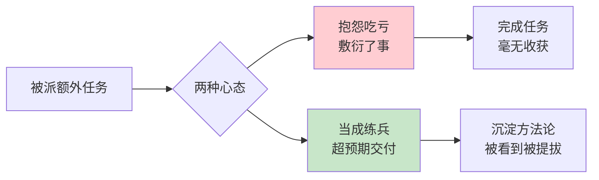
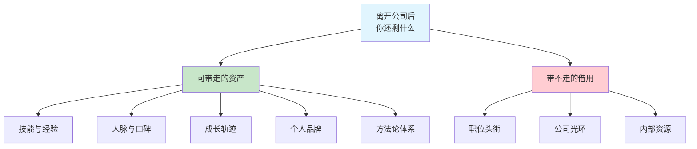

# 1.5 经营好自我公司

#### 目录介绍
- [01.看一个真实案例](#01看一个真实案例)
- [02.断点自测三问](#02断点自测三问)
- [03.对待工作的态度](#03对待工作的态度)
- [04.不给自己设边界](#04不给自己设边界)
- [05.把自己当经营者](#05把自己当经营者)
- [06.要有自己的价值](#06要有自己的价值)
- [07.经营自己护城河](#07经营自己护城河)
- [08.做事一定要靠谱](#08做事一定要靠谱)
- [09.认准经营价值观](#09认准经营价值观)
- [10.评估经营的成果](#10评估经营的成果)
- [11.离开后剩下什么](#11离开后剩下什么)
- [12.为自己未来打工](#12为自己未来打工)
- [13.总结回顾本章节](#13总结回顾本章节)
- [14.后来发生的改变](#14后来发生的改变)
- [15.今天起改变三点](#15今天起改变三点)
- [16.课后作业思考下](#16课后作业思考下)

## 01.看一个真实案例

刚工作第 3 年的时候，我是一个典型的"咸鱼打工人"。有一次老板让我把一个和我岗位本职没啥关系的客服工单梳理一遍，他说："一周之内给我一份报告就行。" 

我表面上答应，心里已经在炸了。回到工位我就开始给身边的同事抱怨："这不是我的活儿啊，他凭啥让我干？我又不是客服！凭啥多做这么多事情还拿一样的工资？"

那一周我做得心不甘情不愿，最后交了一份 6 页的 Word，里面基本是把工单复制粘贴了一下，没做任何归类、没看任何共性。交完我还觉得自己"顾全大局"，没有直接拒绝已经很给面子。

后来那个报告没有任何下文。但我一直记得一件事：**那周和我一起被分派同类任务的另一位同事小林，交了一份 30 页的分析报告，里面把客服工单分成了 7 类高频问题，提出了 3 个产品优化建议**。半年后小林被提为产品负责人，工资差不多是我的 1.6 倍。

过了很多年，我无意间翻到当年那份 6 页报告，突然就明白了一件事：**我当年抱怨的那句"凭啥我多做这么多"，本质上是在说，"我默认我是在给老板打工，不是给我自己打工"**。所以任何多出来的付出，我都本能地觉得"我亏了"。

而小林从一开始就没把自己当"打工的"，他把每一项任务都当成自己公司的一次产品交付。他不是"多做了"，他是在**不断给自己的简历、自己的能力、自己的口碑做投资**。那份 30 页的报告从来就不是"免费的付出"，那是他自己的经营成果。

从那之后我才真正开始以"经营者"的视角看自己的工作。这一篇，我想把这个视角一次讲清楚。

## 02.断点自测三问

在往下读之前，请你花 30 秒对自己做三个"是 / 否"判断。

**第一问**：如果现在有人让你 60 秒讲清楚你"个人公司"的核心产品（你能给雇主提供的、别人替代不了的独特价值），你能说清吗？如果不能，你就断在**"没有经营者视角"**：你还在把自己当作被雇佣的角色，而不是一个独立经营者。

**第二问**：过去 3 个月里，你有没有因为"这不是我的活儿"而拒绝、抱怨或敷衍过任何一次任务？如果有，你就断在**"打工人心态"**：你把任务视为老板占你便宜，而不是给你自己充值的机会。

**第三问**：你能否说出自己护城河的具体形态（技术深度 / 独特资源 / 个人品牌 / 方法论之一），并给出可验证的证据（比如一个专业项目、一批粉丝、一次影响力事件）？如果说不清，你就断在**"没有护城河"**：一旦离开当前公司光环，你会瞬间贬值。

三问全过关的读者，可以直接跳到第 14 节看半年后的反差；其余读者请从第 3 节继续。

## 03.对待工作的态度

关于如何对待工作，市面上大约有两种对立的思想，叫"奋斗党"和"咸鱼党"。前者认为拼搏让人生有意义，后者秉持"给多少钱干多少事儿"。

这两种想法各是各的人生选择，但它们背后有一个共同的思维盲点，那就是**"我是在给别人工作"**。而经营者视角提供了第三条路：**你既不是在为老板卖命，也不是给多少钱干多少事，你是在通过这份工作给自己投资**。

主动性的学习和工作是为了提升自己，获得更强大的竞争力，而不只是为了一份工作或者一个老板。

## 04.不给自己设边界

一位实习生开始接手客服工作，她几乎回复了用户发来的每一个问题，不明白的就和产品研发沟通，尽可能给用户满意的答复，在没有要求的节假日也会处理客服问题。

在这个期间她对公司的产品有了详尽的了解，不仅如此，她还和运营的同学一起组织了客服标准话术，分门别类整理反馈问题给研发和产品做参考，和运营团队一起构建客服规范等等，对业务的发展起到了非常重要的作用。

什么是牛人？就是交给他 / 她一件事，做成了，还做得挺好，而且还触类旁通。这个客服相比一般的人，多了一份对待工作的热情，还主动性地掌握更多，这就是经营好自我公司的一种体现。

工作时，不分哪些是我该做的、哪些不是我该做的。做事也从不设边界，即使负责客服，但遇到产品与销售上有问题，也会积极地参与讨论。

对于大多数人来说，进入社会，我们唯一拥有的资本就是自己。在人生资本的原始累积阶段，如果连这点额外的努力都不愿意付出，怎么可能积累到足够的资源呢？

有些人觉得每多付出一点公司就占便宜，这个心态很有问题。**无论公司怎么发展，个人能力最终是沉淀到自己身上**，这远比摸鱼更值。

这个案例我每次看都会想起自己当年那份 6 页水报告，差距不在智商，在视角。

## 05.把自己当经营者

换一个视角，把自己当成一家公司一样来经营，经营自己的工作和人生，可能就会有完全不同的体会。

在这个视角下，老板就是你的客户，你的工作就是你为客户提供的产品或服务，而跳槽就是换客户。**当你用经营者的视角看问题时，很多困惑就迎刃而解了**。加班不是为老板卖命，而是为了把你的"产品"做到极致；学习新技能不是公司逼你的，而是你在做"产品升级"。

想要把自己的人生公司经营成什么样？怎样才能经营好？把自己类比成一家真实的公司，就能看清要经营的五要素。**核心产品**是"你能为别人创造什么价值"，商业公司做产品或服务，你做的是这条主线。**目标市场**是"你的客户群"，公司选客户群，你选行业与岗位方向。**工作流程**是"你的做事方法与原则"，公司有标准化流程，你要沉淀自己的方法论。**合作伙伴**是"你的人脉网"，公司有供应商和渠道，你有同事、朋友与行业连接。**财务管理**是"你的收入与投资规划"，公司管收入支出，你管薪资分配与自我投资。

明确自己的核心价值、设定方向与目标、沉淀工作流程与原则、经营人脉关系、掌控资金流，**全权为自己负责**，这才是经营者的样子。

## 06.要有自己的价值

明确自己的核心价值，也就是你能为别人提供什么样的产品和服务。要做好这件事，关键是**时不时分析市场上需要什么样的能力**：你当前的技能是供过于求还是供不应求？哪些新兴方向正在崛起？你应该在哪个方向上加大投入？

学习是有成本的（时间 / 精力 / 机会 / 金钱四重成本），压缩其他时间去学，所以先确定"什么能力更受欢迎"非常必要。市场分析不是让你随波逐流，而是帮你把有限的学习资源投入到更值钱的方向上。

**在职场中，你的价值 = 你能解决的问题的大小 × 你解决问题的效率**。想要提升自己的价值，要么去解决更大的问题，要么用更高的效率解决同样的问题。持续输出价值，是经营好"个人公司"的核心法则。

我给自己每年做一次"技能供需盘点"：把当前掌握的 5 项主技能列出来，各自搜一下招聘网站的岗位数和薪资分位，再对照我的深度评分。有一年我发现"跨端开发"薪资中位数比"移动端原生"低 30%，而我在两者上都投入不少精力，当年就砍掉跨端上的一半时间投入，把重心切到高并发方向，第二年跳槽议价能力直接上了一个台阶。

## 07.经营自己护城河

企业做买卖讲究供求关系一样，很多时候在职场上，决定你价值的，除了本身能提供的"产品和服务"外，还取决于行业内的供求关系。

如果你的技能在人才市场上供过于求，那么你的身价自然会变低；如果你的技能在人才市场上供不应求，那么你的身价自然会相对较高。

我们经营自己一般都要持续经营几十年之久，为了保证"基业长青"，还得围绕自己的主攻方向，努力打造自己的护城河。护城河可以是卓越的技术、专业的知识、深厚的经验、独特的资源、有影响力的个人品牌、优质的人脉网络、优秀的沟通协调能力、对未来的敏锐洞察等等。

哪怕在一个烂公司里，也要尽量做一些有价值的项目、经受一些技术挑战，**不断加强自己的竞争性优势，选择才会越来越多**。比如当你对当前的客户不满意时，你能随时终止这段合作关系换一家。世间无伯乐，你没有努力过再好的伯乐也看不见你。

**护城河不是一劳永逸的，需要持续加固**。技术在更新、行业在变化，今天的护城河可能几年后就不再是优势。加固护城河的方法有三条。第一是**纵向加深**：在最擅长的领域继续深耕，从"会用"到"精通"到"能教别人"。第二是**横向扩展**：在核心能力周围建立辅助能力，比如技术专家加上项目管理能力。第三是**持续输出**：通过写文章、做分享、开源项目建立个人品牌，让更多人知道你的专业价值。

我自己这三条的具体样子：纵向上，Java 从熟练到精通用了三年；横向上，我硬啃了一年 K8s 与 SRE 排障的书；持续输出上，我在 GitHub 攒到一颗 5k+ star 的开源库和 40 多篇内网博客。这三条加在一起，就是别人挖我时给出高薪的三条理由。

## 08.做事一定要靠谱

无论是在职场还是在生活中，让人觉得靠谱都是一件非常重要的事。比如，很多人出来创业，选择创业伙伴时，都会选他之前的同事，那怎么选呢？肯定是选择让他觉得靠谱的那一个。

所谓靠谱，就是尽量做到凡事有交代，件件有着落，事事有回音。办成了，有个交代；没办成，也要有个交代；中间有变动了，也会同步一下。

但不少技术人员只对技术有热情，对反馈就没什么概念。接到任务默默钻研，完成后默默等下一个，没人问就牙关紧咬。如果分配任务的人疏忽了，这个任务往往无疾而终。

项目管理工具虽然强制反馈，但只管进度不管细节。**具备主动反馈意识，迈出主动让事情闭环的第一步，你会发现世界完全不同**。你会因为持续的反馈获得更重要的任务和职责，因为你是一个能让事情形成闭环的靠谱人。

我给自己定过一条最简单的规矩：任何一件与他人协作的事，只要状态发生变化就同步一次，不管好坏。项目卡住了发一次，取得进展发一次，被人打断也发一次，就三个字"卡住了 / 有进展 / 被打断"，附一句下一步计划。看似啰嗦，但半年下来我的直接上级和跨团队 PM 从来不需要来"催"我，他们对我的评价从"技术不错"变成了"技术不错又特别放心"。**"放心"这两个字，是靠谱最大的溢价**。

## 09.认准经营价值观

人的精力有限、能力也有限，那该如何平衡各个领域，让生活过得更有目标感呢？生活中的哪些领域对你来说是必不可少的？

把理想人生用 2 个轴划分开，纵轴是「基础」与「发展」，横轴是「社会」与「自我」，两个轴一交叉，就可以得出构成人生的 4 个大类：**发展 × 社会**是事业发展与社会贡献；**发展 × 自我**是个人成长与技能提升；**基础 × 社会**是人际关系与社会责任；**基础 × 自我**是健康、财务与生活品质。

梳理好你最重视的人生领域以后，接下来就要展开想象，想象自己在各个领域如果做到了什么事、达成了什么样的目标，就可以称得上是处在理想的生活状态。

知道自己各个领域的理想状态是什么样以后，就可以反思自己差在哪里了。接下来就要对自己现在的生活状态做个评估。看见理想、看见现实，我们就能看到自己的「差距」，目标也就形成了。这一步需要做的就是思考差距，从中设定各领域的大目标、核心指标与具体计划。

**关于副业**：最好的副业是能有效利用主业的知识和技能，而且副业中积累的经验能反哺主业进步。主业是"本手"，副业不宜脱离主业。只有守牢主业发展副业，"妙手"才会不期而至。

## 10.评估经营的成果

当你的职业不断发展，你需要用结果来衡量你的经营成果。必须坦率地接受经营结果反映了自己每个月每年的经营状况这一事实。所有结果都反映在数据上。

合理有效地活用各项结果数据也很重要。有一种说法叫做"不是检查结果，而是通过结果来进行检验"。也就是说有根据地制订计划，通过详细的模拟计算，得出一个假设，最后用结果来进行验证。

**我自己设的个人 OKR**：每季度给自己设 3 个可量化指标，例如"写 12 篇千字以上技术博客"、"推动一次线上事故复盘至团队"、"新习得一项周围没人会的小众技能"。季度末看数据而不是看感觉。这种"用结果检验"的习惯，是我后来从咸鱼心态彻底扭转的关键。

## 11.离开后剩下什么

到这里其实要问一个更狠的问题：如果明天你离开当前这家公司，你还剩下什么？

好公司的确能给你一个光环，但不代表你就牛逼。一定要在一家公司好好沉淀三四年，切莫荒废了自己。**用人单位最看重的不是你平时做什么，而是你做出了什么成绩、有什么资源、成长轨迹是什么、因为有你给上家公司带来了什么**。

**真正有价值的东西，是离开任何一家公司后你还能保留的**：你的技能、经验、人脉、口碑、方法论。而职位头衔、公司光环、内部资源，都是暂时借给你用的，走的时候一样带不走。

抱怨是徒劳的，抱怨改变不了本质。关于烂公司烂领导，给 6 个字：**要么忍，要么滚**。如果值得挖，请深挖；如果爱，请深爱。领导能成为你的领导就有比你强的地方，好的地方跟着学就是。觉得不 OK，那就另谋出路。

**聪明人在每一家公司都在做两件事：一是为公司创造价值（工作职责），二是为自己积累资本（可迁移的能力和经验）**。两者并不矛盾，做好工作本身就是最好的学习和积累。

## 12.为自己未来打工

**什么时候你的工作热情、努力程度不为工资待遇不高、不为上级评价不公而减少，从那时起你就开始为自己打工了**。这是一种思维的质变，从"为别人工作"到"为自己投资"。

必须树立一个基本理念：**个人成长第一，工资待遇第二**。人生在世，除了父母和少数慈善家花钱供你学习，还有谁？答案是**你的企业和老板**。老板给你开工资的同时，也把实战机会、真实项目、专业同事、成熟流程一起打包给了你，**这些如果自己花钱去培训班学，要花多少钱？**带着这个心态工作，你会发现每一天都是赚的。

## 13.总结回顾本章节

一句话核心：**把自己当成一家要经营一辈子的公司，你所有的工作，本质上都是在为这家"自己的公司"投资与积累，而不是在给别人打工**。

你应该带走三件事。第一，**经营者视角**，老板是客户、工作是产品、跳槽是换客户。被派额外任务觉得"我亏了"的时候，立刻把这条拿出来对照。第二，**护城河 = 纵向加深 + 横向扩展 + 持续输出**，每半年盘点一次自己的竞争力，看这三条各自加宽了多少。第三，**凡事闭环**，交代、着落、回音三件全都要做到，每一条对外协作里都是靠谱二字的具体化。

## 14.后来发生的改变

回忆起当年那份 6 页的客服报告让我脸热了好几天。那一周我做了一件事：翻出公司最近一个月的全部客服工单，自己动手重做了一份 22 页的深度报告，分类 8 项高频问题、给 5 条产品优化建议，周五晚上主动发给了产品总监。

总监第二天早上回了我一个"很棒，你来一下我办公室"。那一刻我突然理解了：**不是做多少，是做的时候心在不在那里**。

第一个月我做了两件事。一是把自己的"个人公司"写在一页纸上：核心产品是"能独立交付复杂终端应用与跨端开发"，目标客户是"中大型互联网公司"，护城河是"架构设计与高并发设计"，3 年规划是"成为所在城市该方向可查询的 Top 50"。二是给自己立了季度 OKR：3 个可量化目标、每月自评一次、每季度做一次复盘。

**变化最明显的是心态**：我再也不会因为"这不是我的活儿"而抱怨，因为每一项任务都是我"个人公司"的产品机会，我为什么要拒绝白送上门的练兵？

半年后我被总监在全部门会上点名表扬了两次：一次是客服复盘推动了产品优化，另一次是主动承担了一次跨组的灰度故障处理。年底我接到了 3 个猎头的主动接触，其中一家开出的价格是我当时的 1.8 倍。

更重要的是，**我再也没有因为"觉得吃亏"而产生情绪**。因为我知道，我每一次多做的付出，都是在给我自己这家"个人公司"充值。就算这家客户（老板）不续单，我的产品（能力）还在，我随时可以换一个出价更高的客户。

## 15.今天起改变三点

**第一点，切换经营者视角**。从今天起，不再用"打工人"的视角看待工作，而是把自己当成一家公司的 CEO 来经营。老板是你的客户，你的工作成果是你的产品。每次接到任务时问自己："如果这是我自己的公司，我会怎么做这件事？"这个思维转变会让你从被动执行变为主动经营，格局完全不同。

**第二点，选一个方向加固护城河**。梳理你当前的核心竞争力，选择一个最有潜力的方向深耕下去。每周至少投入 5 小时用于护城河的建设，可以是技术深度的提升、行业知识的积累、人脉关系的维护，或者个人品牌的打造。记住，护城河不是一天建成的，但每天的积累都在加宽它。

**第三点，凡事闭环三个字**。从今天起，对每一件经手的事情做到"凡事有交代、件件有着落、事事有回音"。接到任务后主动同步进度，遇到问题及时反馈，完成后主动汇报结果。一个月后你会发现，因为靠谱，你会获得更多重要的机会和信任。

## 16.课后作业思考下

**第一题 · 经营者视角练习**：把自己当成一家公司，写一份你的"公司简介"，包括核心产品是什么（你能提供的价值）、目标客户是谁（你想服务的雇主 / 行业）、竞争优势在哪（你比别人强的地方）、发展规划是什么（未来 3 年的方向）。

**第二题 · 靠谱度自测**：回顾过去一个月你经手的所有任务，有多少是你主动汇报进度和结果的？有多少是被催促后才反馈的？有多少不了了之？计算你的"主动闭环率"。如果低于 80%，思考如何建立一套自己的任务追踪反馈机制。

**第三题 · 离职价值盘点 + 护城河加固**：假设你明天就要离开当前公司，认真想想你能带走什么，是技能、人脉、成长轨迹还是个人品牌？如果"带走的东西"很少，说明沉淀不够。列出目前 3 个核心竞争力评估市场稀缺性，然后给自己制定一个 6 个月护城河加固计划。

---

> **📎 下一站** ｜ 自我经营的最大敌人不是能力不足，而是信息噪音。下一章我们讨论信息过载时代的"减法生存"，学会砍，比学会加更重要。
