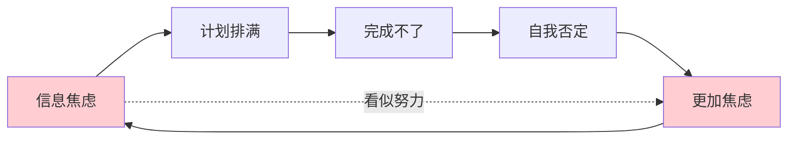
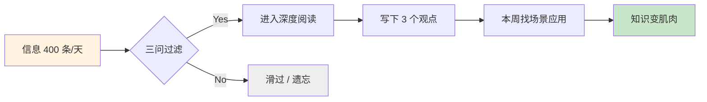

# 2.1 信息过载怎么办
#### 目录介绍
- [01.看一个真实案例](#01看一个真实案例)
- [02.断点自测三问](#02断点自测三问)
- [03.信息的爆炸场景](#03信息的爆炸场景)
- [04.判断信息价值观](#04判断信息价值观)
- [05.过载信息学标记](#05过载信息学标记)
- [06.疲于奔命的模式](#06疲于奔命的模式)
- [07.如何治疲于奔命](#07如何治疲于奔命)
- [08.心智模型去筛选](#08心智模型去筛选)
- [09.化繁为简的原则](#09化繁为简的原则)
- [10.为应用去做和学](#10为应用去做和学)
- [11.总结回顾本章节](#11总结回顾本章节)
- [12.后来发生的改变](#12后来发生的改变)
- [13.今天起改变三点](#13今天起改变三点)
- [14.课后作业思考下](#14课后作业思考下)

## 01.看一个真实案例

那是一个普通的周五晚上，我在床上躺着刷到凌晨 1 点。手机电量从 100% 刷到 7%，我才心里咯噔一下关掉屏幕。我做了一件「数据分析」：那天我打开过公众号 62 次、刷短视频 210 个、收藏文章 14 篇、点击知乎热榜 23 次、看技术社群 90 多条消息。粗略估算，我那天「摄入」的信息至少 400 条。

然后我试着用一张白纸写下「今天我学到了什么」。我坐了 20 分钟，写下了 2 行字，还是大概的：知道某个大厂裁员了，知道 Kafka 某个参数优化可能有用。就这些。我整整一天泡在信息里，**大脑像一条被水漫过的海绵，看似吸了很多，但一挤都是水，留不下任何有价值的东西**。

后来我打开收藏夹的后台数据，那一年一共收藏了 147 篇文章。我抽了其中 50 篇点进去，发现 31 篇一个字都没看完、12 篇连标题都不记得收藏过、只有 7 篇是真正读过并有印象的。

我当时心里很沉：**我以为自己在努力学习，实际上只是在努力「收集」**。收藏夹的「加一」、点赞的「+1」、留言的「感谢分享」，这些微小的动作给我一种「我在进步」的错觉，但它们和真正的学习之间，隔着整整一条消化道。

所以从那个凌晨开始，我决定不再做「信息收藏癖」。这一篇我想讲清楚：**在信息过载的时代，你不学会筛选和消化，就一定被信息反向吞噬**。

## 02.断点自测三问

在往下读之前，先做三道判断题。任意一题命中，这一章就值得你认真读完。

| 断点 | 自测题 | 症状描述 |
|:----:|:------|:--------|
| 收藏不看 | 打开你的收藏夹，最近三个月新增的文章，能被你完整读完的占比多少？低于 30%？ | 收集癖：以为收藏=学习 |
| 疲于奔命 | 上周计划表上的事项，实际完成率是多少？低于 60%，且反复出现「今天太忙没干成」的想法？ | 忙碌陷阱：把切换当产出 |
| 学完就忘 | 上个月读的最印象深刻的一篇技术文章，你现在能用三句话复述它的核心观点吗？ | 消化不良：信息未沉淀 |

三道题依次对应本章的三条主线：**筛不进来的、消化不了的、用不出去的**。你在哪一条上薄，就重点看那一段。

## 03.信息的爆炸场景

每天都有大量的信息、知识、新闻涌来，让碎片化时间感觉自己都是在学习。那么你究竟学习了什么？可能一时间难以回答这个问题，不要紧，可以坐下来静静思考一下。

看到一篇好文章就顺手收藏，收藏完之后再也没打开过；刷到头条一些新闻，发现即使坐在办公室，也能尽知天下大事、娱乐八卦、人间百态，让自己「知识广度」大有增长。可是三天之后再问，那些广度剩下了什么？基本什么都没剩下。

在信息爆炸的时代，互联网如同一道敞开的闸门，让海量信息汹涌而来。然而信息的丰富性并非总是带来便利，相反，它常常使人陷入纠结和困惑之中。面对如此多的选择，大脑往往难以承受，导致我们在决策时变得犹豫不决，无法做出决定。

## 04.判断信息价值观

发现自己有好多东西要学，但是哪些对我们有价值呢？哪些投资回报率不高呢？我们选择的标准是什么？

好像懂得了很多东西，但是别人一问，我们却讲不出来；或者说出来没有自己的主见或深度。有些人阅读后能够形成自己的主见，并且结合自己的经历有深刻的分析；而有些人则只是看看而已，看完后就难以想起刚才阅读究竟讲了什么；甚至还有些人陷入了口水战。

**判断信息是否有价值，可以用三个简单的问题来过滤**。第一，**相关性**：这个信息和我的目标有关吗？直接助力目标的是高价值，纯粹消遣娱乐的是低价值。第二，**稀缺性**：这个信息随处可得吗？需要付出努力才能获取的是高价值，到处都能看到的通常是低价值。第三，**可用性**：我能在一周内用上它吗？能立即指导行动的是高价值，看完就忘的是低价值。

**检验标准很简单**：如果你看完一篇文章，不能用自己的话复述其核心观点，不能说出它对你的具体启发，那这篇文章对你来说就是低价值信息，不值得再投入时间。我那 3147 篇收藏里，能过这个标准的不到 5%。

## 05.过载信息学标记

平时在各种渠道接收一些碎片文章或信息，这些碎片内容大部分比较片面，一般先粗看一遍，如果发现有什么亮点，去备注或记录一下。

然后，某个碎片时间，把这些平时粗筛的文章拿出来看，这次再看有哪些可以被我吸收的知识，然后给它打上 tag，最后遇到一些问题的时候，就可以从这些 tag 中寻找答案。

过载的碎片文章其实是有很大隐患，因为长期只从片面的角度看这些文章的东西，会让思维变得混乱、焦虑。所以你需要一段时间就进行一次「磁盘碎片整理」，将大量信息添加到自己的知识体系树上。

**碎片信息处理的四个阶段**。**粗筛**：快速浏览、标记亮点，做初步过滤，每篇 1 至 2 分钟。**精筛**：碎片时间再次阅读，提取真正有价值的部分，每篇 5 至 10 分钟。**标记**：打 tag 分类归档，方便日后检索，每篇 1 分钟。**整合**：纳入自己的知识体系树，让信息真正产生复利，每周留出 1 小时集中处理。

只有让这些碎片零散信息成为你知识体系的一个根节点，这些碎片文章才是有意义的，否则，这些碎片时间就完全被浪费掉了。这就是为什么，看了各个大佬的干货，却依然成不了大佬？**答案就在于：大多数人只做了前两步（粗筛和精筛），却从未做第四步（整合到体系中）**。信息不整合，就像散落一地的拼图碎片，每一块看起来都有意义，但拼不出完整的画面。我当年 3000 多篇收藏就是一个典型的「散拼图」博物馆。

## 06.疲于奔命的模式

在面对信息与知识的洪流时，有时我们会不自觉地进入到了「疲于奔命」模式中。因为每天感觉有太多的信息要处理，太多的知识想学习。计划表排得满满的，似乎每天没能完成当天的计划就会产生焦虑感，造成了日复一日的「疲于奔命」状态。

**疲于奔命模式的触发有一个经典路径**：信息焦虑 → 制定超载计划 → 完成不了 → 自我否定 → 更加焦虑 → 制定更多计划。一旦进入这个循环，你越努力反而越焦虑，因为你把「忙碌」当成了「进步」的衡量标准，而忽略了真正的产出。

总是焦虑着完成更多，划掉 TODO List 上更多的事项，希望每日带着超额完成计划的充实与满足感入睡，最后这一切不过是一种疲于奔命带来的虚幻满足感。

**区分「真实满足感」和「虚幻满足感」的标准很简单**：问自己「今天做的事情中，有多少是对我的核心目标有直接帮助的？」如果答案是「大部分都有」，那是真实的充实；如果答案是「我也说不清楚」，那多半是在用忙碌来麻痹焦虑。

## 07.如何治疲于奔命

在感觉大脑处于「过载」的疲倦中时，别硬撑，最好的办法就是去小憩片刻。

进入疲于奔命状态，其实我们就在不断给大脑喂任务，且不停地切换大脑任务，让它永远处于繁忙甚至超频状态。这样每个任务的执行效率都会下降且效果也不佳，所以导致执行任务的时间反而延长了，这就给我们营造了一种「忙碌、充实而疲倦」的虚幻假象。

**心理学研究表明，每次任务切换会导致 15 至 25 分钟的注意力恢复时间**。如果你一天切换 20 次任务，光是恢复注意力就浪费了 5 个多小时，这就是为什么很多人「忙了一天」却什么都没做成。

打破虚幻假象的关键，是**从追求「忙碌感」转向追求「产出感」**。具体做法有两条最关键：**每天只设定 3 个核心任务**（完成后再考虑其他），**关闭无关通知**（给大脑创造不被打断的环境）。

我自己试过一个残忍的实验：连续一周，每完成一次任务切换就记一笔。第一天记了 47 次，第三天 22 次，一周之后稳定在 8 至 10 次。同样八小时的工作时长，产出的代码行数从每天 120 行提到了 380 行，Code Review 一次通过率从 40% 提到了 75%。**注意力不是被工作耗掉的，是被切换耗掉的**。

## 08.心智模型去筛选

面对大量的信息和知识，可以从两个角度筛选：**信息本身的价值** 和 **我需要怎样的信息**。

**关于信息价值的反直觉规律**：**越容易获取的信息，价值往往越低**。真正有价值的信息通常藏在专业书籍的深处、行业前辈的经验中、或你自己的实践总结里，这些都需要付出努力才能获得。所以当你发现一个知识点「人人都在讲」时，反而要警惕它的实际价值。

**关于个人需求判断，心理学上有一个「心智模型」**：每个人都用它来处理信息、解释行为、做出决策。少部分人会理性地认知到这个模型的存在并不断完善它；更多人依赖的是「感觉」和「直觉」，但**「感觉」和「直觉」其实也是心智模型的快捷方式**，只是他们没意识到而已。

「心智」两字合在一起是一个意思，拆分开来。「**心**」是对需要的选择，从心出发；「**智**」是对价值的判断，智力的匹配。合起来看，就是先问自己「我到底想要什么」，再问「这条信息够不够格进入我的清单」。

## 09.化繁为简的原则

互联网思维中有一个重要原则：**「化繁为简，以少胜多」**。面对复杂的信息和选择时，尽可能地简化问题，找到最核心的关键点。它可以分三层落地：**信息接收**（选择性筛选，只关注有用的），**决策制定**（减少干扰因素，只考虑最关键的），**能力提升**（通过学习和实践提升处理能力）。

**化繁为简不是让你忽视复杂性，而是在复杂中找到那个最关键的支点**。四种典型场景可以套用：**信息太多**时设定 3 个筛选条件，不满足的一律忽略；**选择太多**时只保留前 3 个选项，超过 3 个就强制淘汰；**任务太多**时每天只做最重要的 3 件事，完成前不考虑其他；**知识太杂**时围绕 1 个核心目标学习，不相关的暂时不碰。

**核心理念：少即是多**。当你把 80% 的精力用在 20% 最重要的事情上时，你的产出会远超过把精力平均分配在所有事情上。

我做支付网关那年是最深刻的一次验证。项目排期两个月要接七个渠道，团队三个人天天加班到凌晨。第三周我停下来梳理，发现七个渠道里其实真正跑高流量的只有两个（微信支付宝合计 92%），其余五个加起来的流量甚至不到零头。我把项目改成两阶段：**先把两个大渠道做到极致（重试策略、对账机制、异常告警一次做全），另外五个复用同一套骨架**。结果第 5 周就上线，比原计划提前了半个月。少即是多，不是口号，是能算出来的。

## 10.为应用去做和学

储备了信息，建立了知识，最终都是为了应用。囤积信息，学习知识，如果不能被应用在改变自己上，那还有什么意义？

没有目的的学习是徒劳的，它仅仅是在头脑中流过一遍，流过的痕迹很快又会被新的信息冲刷干净。不管我们拥有怎样的「最强大脑」，在面对这股信息与知识洪流时，都几乎可忽略不计。所以，**学习带着目标是比较好的**。

在信息爆炸的时代，我们需要学会如何面对选择困境并找到解决问题的方法。通过实践化繁为简的原则，我们可以提升自己的决策水平和生活质量，让自己在这个充满变化和挑战的时代中更加从容和自信地前行。

做和学就要有选择和取舍，你得挑选那些真正值得做和学的东西去让大脑满负荷运转，但凡投入决心去做的事情，就需要百分百投入。这就是专注于少而精的东西，深入了解这些东西，进入到更深的层次上。深可以无止境，那到底多深才合适？

我的答案是：**让你的内心对取得的效果感受到满意的深度层次上**。它的反面是：**但凡心存疑虑，不是那么确定要全力投入的事情，干脆就不做了**。

这个标准看似模糊，实则非常精准，**因为你的内心最清楚，哪些东西你真的掌握了，哪些只是一知半解在自欺欺人**。当你对一个知识点的理解达到了「内心踏实」的程度，那就是属于你的合适深度。

## 11.总结回顾本章节

**信息过载的时代，真正的能力不是「多吸收」，而是「敢拒绝」**。敢于对 80% 的噪声说不，只把精力留给那 20% 能让你真正长出肌肉的信息。

你应该带走三件事。

1. **三问过滤器**：相关？稀缺？能用？三问都通过才看。每一次点击「收藏」之前对自己念一遍。
2. **碎片整理周**：每周一次把粗筛的碎片整合到自己的知识体系里，周末花半小时就够。
3. **每天三件大事**：只做 3 件对核心目标有直接帮助的事。每天早晨立清单时用它做筛子。

## 12.后来发生的改变

那个凌晨之后的第一周我做了一件挺狠的事：把 3147 篇收藏按「三问过滤器」重筛。**只保留相关、稀缺、一周能用**。最后剩下 42 篇。删到一半我心里还在颤抖，删到最后反而解脱了。那 3100 多篇其实从来没打算认真看过，它们只是我「我在学习」的心理安慰剂。

第一个月我开始强制用「每天 3 件大事」清单。其他信息无论多「好」，只要不满足三问，一律滑过。我一开始非常焦虑：「万一这条重要信息错过了怎么办？」但一周后我发现：**过去那些我「错过会可惜」的信息，90% 从来没在我生活里再次出现过**。原来它们不是重要，它们只是在骚扰我。

最大的意外收获是：我下班后多出了 1.5 小时的空闲，以前这段时间是被刷手机吃掉的，现在我把它用来系统读一本书籍。半年后我再看自己的数据：一年收藏从 3000+ 降到 180 篇，但每一篇都在两周内被我真正读完并做了笔记；公众号关注从 320 个砍到 18 个，但这 18 个我基本每篇都看；技术社群从 42 个退到 3 个，但这 3 个我深度参与。

**最重要的变化不是「少」，而是「每一条信息都有结局」**。以前我是信息的被动接收者，现在我是信息的主动裁判员。我看完就知道自己下一步要做什么。

我开始把消化过的东西输出成文章，半年后公众号接到了 3 个付费投稿邀请。我第一次真切体会到一件事：**信息本身没有价值，你对信息做了什么，才有价值**。

## 13.今天起改变三点

**第一，建立信息筛选标准**。不再无差别地接收所有信息。给自己设定 3 个筛选条件：这个信息与我的目标相关吗？获取门槛高不高（是否人人可得）？我能在一周内应用它吗？只有至少满足 2 个条件的信息，才值得深入了解。把这 3 个条件写在便签上，贴在电脑旁。

**第二，戒掉碎片化收藏**。每收藏一篇文章，必须在 24 小时内阅读并做笔记，提炼出 3 个关键知识点，打上标签归入你的知识体系。如果做不到，就不要收藏。收藏 ≠ 学习，消化才是真正的获取。每周日花 1 小时整理本周收藏，做一次「碎片整理」。

**第三，带目标学习一件事**。选择你当前最需要提升的一个技能或知识领域，用 2 周时间专注深入学习它。不求广度，只求深度。学到让你「内心对效果感到满意」的层次。完成后再开启下一个目标。记住：专注少而精，远胜于贪多求全。

## 14.课后作业思考下

**1.信息过载自测 + 疲于奔命诊断**：统计一下你今天接收了多少条信息（新闻、公众号、短视频、聊天等），有多少是对你真正有价值的？计算你的「信息有效率」，如果低于 20% 说明过载已经很严重。再回顾上周的学习计划完成情况，是否经常「计划排得满满但完成不了」？如果是，试着把下周计划砍掉一半，只保留最重要的部分。

**2.心智模型断舍离**：用「心智模型」方法，对你最近收藏但未阅读的 10 篇文章进行筛选。用「心」（我真的需要吗？）和「智」（它真的有价值吗？）两个维度打分，1 至 5 分。**删掉所有总分低于 6 分的文章**，感受一下「断舍离」的清爽。

**3.应用导向实验**：选择你最近学到的一个知识点，在本周内找到一个实际场景来应用它，可以是工作项目、与朋友讨论、写一篇分析文章等。应用后反思：这个知识点**是真的被你消化了，还是只是「看过」而已？**

---

> **📎 下一站** ｜ 会做减法只是第一步，会搭结构才能长久。下一节我们讨论「体系思维」：如何把一地零件组装成属于你的知识骨架。
