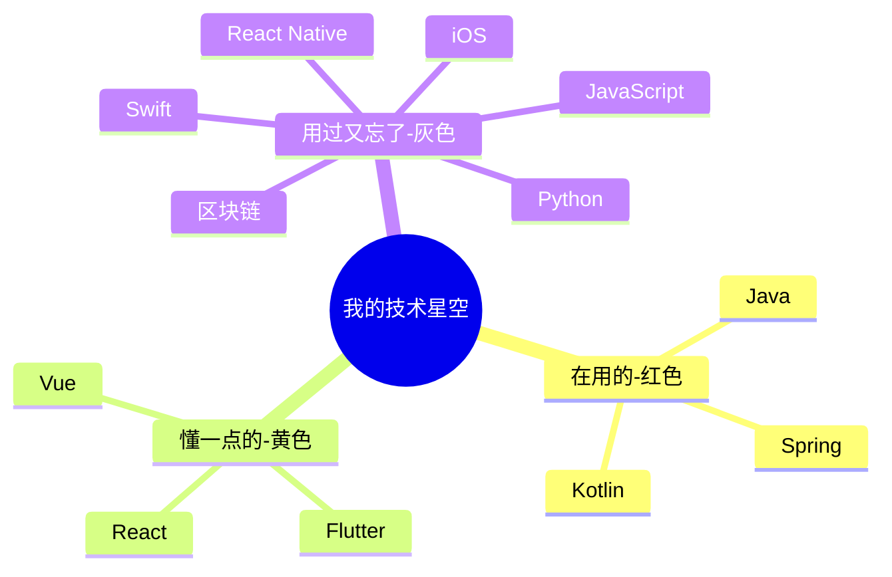
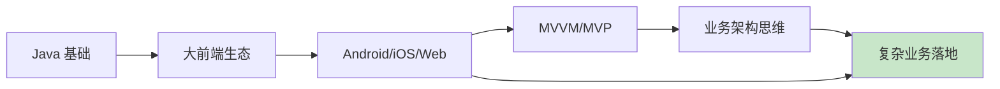

# 2.2 体系思维很重要
#### 目录介绍
- [01.看一个真实案例](#01看一个真实案例)
- [02.断点自测三问](#02断点自测三问)
- [03.体系思维的背景](#03体系思维的背景)
- [04.点性思维较凌乱](#04点性思维较凌乱)
- [05.线性思维视野宽](#05线性思维视野宽)
- [06.面性思维成框架](#06面性思维成框架)
- [07.立体思维附加值](#07立体思维附加值)
- [08.点线面体的思维](#08点线面体的思维)
- [09.体系思维流程化](#09体系思维流程化)
- [10.总结回顾本章节](#10总结回顾本章节)
- [11.后来发生的改变](#11后来发生的改变)
- [12.今天起改变三点](#12今天起改变三点)
- [13.课后作业思考下](#13课后作业思考下)

## 01.看一个真实案例

去年面试一个 P7 岗位，面试官让我介绍一下自己。我打开简历像背菜单一样念：Java、Kotlin、MVP/MVVM、JVM、Python、Docker、Vue、Flutter、React……念完自己都觉得挺唬人。

面试官笑了笑，问了一个特别简单的问题：**「你说说为什么你这个项目要用 Flutter 而不用 React？如何做跨端通信？跟原生比绘制核心原理有何优势？」**

我愣了。我用过 Flutter、React，但那是因为部门技术栈就是 Flutter，从来没认真比较过。我支支吾吾说了几个名词，然后被反问「具体影响、性能怎么样？怎么测出来的？」我就再也说不出第二句。

那场面试我没过。出来路上我才意识到一件事：**我做了 6 年开发，简历上塞满了名词，但每个名词都是孤立的「点」，连不成一条像样的「线」，更别说「面」和「体」**。

那天晚上我画了一张图，把我接触过的所有技术列出来：

我数了一下，**红色的只有 3 个，黄色的 5 个，灰色的有 17 个**。也就是说，我有 17 项技能完全凭「碰巧用过」挤上了简历，但它们既没有为我增值，也支撑不起面试时的任何一个深度问题。

那一刻我才明白，我以为自己「什么都懂一点」，其实是「什么都没懂」。**点很多，但线、面、体全部空白**。这就是接下来要讲的「体系思维」问题。

## 02.断点自测三问

在往下读之前，先做三道判断题。任意一题命中，这一节就值得你认真读完。

| 断点 | 自测题 | 症状描述 |
|:----:|:------|:--------|
| 名词收集 | 你的简历上有多少个技术名词？其中能被追问 20 分钟不露怯的占几成？低于 3 成？ | 点性依赖：拿名词唬人 |
| 线性缺失 | 让你说三条你「独立能搞定」的完整价值链（从需求到上线），你说得出几条？ | 连不成线：只会孤立技能 |
| 迁移无力 | 换个陌生领域（比如从 App 换到大数据），你有没有一套自己的「快速搭骨架」的套路？ | 无体可依：一切从零来 |

三道题依次对应本节的三条主线：**点性 → 线性 → 面性 / 体系**。你在哪一层，读下去时就重点看那一层的判断标准和升级方法。

## 03.体系思维的背景

**零散的「点」难以形成价值**。在工作经历中就曾碰到过这么一些人，做了几年开发，技术上做了很多业务，接触的「点」倒是不少，但没能连接起来形成自己的体系，那最大的价值就局限在最后所在的「点」上。

这种现象在技术圈非常普遍：做过前端也做过后端，碰过大数据也碰过 AI，但每个方向都浅尝辄止。面试的时候聊什么都能说两句，但一深入就露馅。根本原因就是：只有零散的「点」，没有形成体系。

其实个人的成长有很多方面，但对于个人的成长最重要的就是知识体系的构建，这其实就是一个「点线面体」的演进过程。最终的目标是建立自己的面 / 体系思维。

四个阶段的特征与价值体现清晰递进。**点**是零散、孤立的单点技能，典型表现是「会写代码但不懂架构」；**线**是有逻辑串联的能力链条，典型表现是「能独立完成一个完整功能」；**面**是形成框架的方案能力，典型表现是「能做技术选型和方案设计」；**体**是立体系统的综合能力，典型表现是「能带团队做复杂项目」。

## 04.点性思维较凌乱

点性思维：看到什么就是什么，一点就是一点，不随意展开。很多技能型人才、实干型人才，往往属于这种思维。他们总是把精力聚焦在某一个具体领域，擅长把这个领域做精做透。

进入任何一个知识领域，都是从一个点开始的。进入软件开发领域所接触的一系列的点，红色部分是目前还属于我「掌握」与「了解」的领域，其他灰色的部分渐渐放弃了维持与更新。

每一个工作点，似乎都是自己选择的，但又感觉只是一种被趋势推动的一次次无意「捡起」。有些点之间有先后的承接关系，而更多点都慢慢变成了孤点，从这片技术的星空中暗淡下去。

在你入行后，可能也会因为时代、公司或项目的原因，有很大的随机性去接触很多不同的技术点。但如果总是这样被客观原因驱动去随机点亮不同的「点」，终究会感到有点疲于奔命，永远追不上技术的浪潮。

**点性思维最大的问题是：你的价值完全取决于最后一个「点」的市场行情**。当这个「点」不再热门，你就面临被淘汰的风险。而那些已经暗淡的「孤点」，既无法为你增值，也不能相互支撑。

## 05.线性思维视野宽

线性思维：可以从具体的点延展成一条线，或者是把各种点能连串成线，这要求人具有一定的逻辑推理能力，要善于归纳、总结和分析。

为什么很多技能型人才的专业技能熟悉到一定程度就可以靠经验下决策？就是因为他们把点连成了线。当形成的点足够多了后，一部分点开始形成线，而另一些点则在技术趋势的演进中被自然淘汰或自己主动战略放弃。

那到底该如何把这些零散的点串成线，形成自己的体系与方向呢？一个个点，构成了基本的价值点，这些点串起来，就形成了更大的价值输出链条。

**串点成线的三种方式**。第一种是**因果链**：前一个点是后一个点的基础，例如「Java 基础 → Spring → 微服务」。第二种是**流程链**：多个点组成完整的工作流，例如「需求分析 → 设计 → 编码 → 测试 → 上线」。第三种是**关联链**：不同领域的点相互增强，例如「技术能力 + 沟通能力 + 产品思维」三者叠加。

在这条路上，你也会有一条属于自己的线，当这条线成型后，你的价值将变得更大。**当你有了线，你的能力就不再是「会做某一件事」，而是「能搞定一类事」**，这是质的飞跃。

我自己第一次感受到这种飞跃是在负责一个跨部门支付项目时。以前是「后端有需求就写接口」，那次项目要打通交易、风控、财务三条系统，我硬着头皮把从「用户下单」到「财务对账」的完整流程画在一张纸上。**画完那一刻，我第一次看到了自己在这条价值链上到底站在哪一段，也第一次能主动去补自己缺的那些段**。从那以后我在会上讲话就有底气了，因为我讲的不是「我这块怎么做」，而是「这件事从头到尾应该怎么做」。

## 06.面性思维成框架

面性思维：从点延展到线，再展开成面的思维。在数学上，线的交织将形成面，三个点就可以确定一个面，也就是说：任何事情只要得到三个点的信息，就可以把握其全局。

这要求人有一定的联想能力和预测能力，要能从一滴水看到整个大海。很多专业性人才，做到一定程度就可以举一反三，甚至可以跳出行业限制，成为业务方案制定者，因为他们思维是面性的。

**面性思维和线性思维最大的区别在于**：线性思维关注的是「怎么做」，而面性思维关注的是「全局是什么样的」。当你有了面性思维，你不仅能写好代码，还能理解这段代码在整个系统中的位置和作用：它和哪些模块有交互、影响了哪些业务指标、对用户体验有什么影响。

培养面性思维的关键在于**刻意训练「全局思考」的习惯**。**三点定面**：每次分析问题时至少从三个不同角度思考，用来培养多视角分析能力。**举一反三**：学到一个知识点后思考它在 3 个不同场景的应用，用来培养知识迁移能力。**画全局图**：定期为自己负责的项目画一张全局架构图，用来培养系统性思维。

## 07.立体思维附加值

立体思维，就是要在面性思维的基础上再多一个维度，这个维度往往是一种综合能力，需要人有一种系统的能力，能全方位、立体地把握一个事物，从各个角度对它的构造进行解析。

比如很多人在公司做到一定程度，就自己去创业，创业需要的就是一种综合素养，是一种很立体的能力，既需要专业知识和资源，还需要开拓市场的能力，还得具备管理能力、谈判能力等等。

**立体思维是将「点线面」升级为「体」的过程**。如果说面性思维让你看到了一个系统的全貌，那么立体思维让你能同时从多个维度审视这个系统：技术维度、商业维度、管理维度、用户维度。每一个维度都是一个「面」，这些面组合在一起，就构成了一个立体的认知。

培养立体思维的关键是**跨界学习和跨角色思考**。**技术人员**学点产品思维和商业逻辑，理解「为什么做」比「怎么做」更重要；**产品经理**学点技术基础，知道哪些需求容易实现、哪些代价巨大；**管理者**保持对一线业务的了解，不脱离实际做决策。当你能从多个角色的视角看同一件事时，你的思维就是立体的了。

## 08.点线面体的思维

**点性思维**：我们对事务的认识，最开始都是由一个个点组成的。当这些点多了之后，我们遇到新生的事物偶尔会疲于奔命，学不过来，缺乏大局或整体意识。

**线性思维**：我们把一个个点串起来，形成了一个线性思维，而在演进中，会形成我们提供价值的输出链条。因此需要不断培养线性思维。

**面性思维**：不再仅仅局限于某个技术点或者局部，而是通过整体，成为一些方案的制定者和设计者，提供整套解决问题的方案，这正是自己所缺乏的思维模式。

**体系思维**：如同张无忌学会了九阳神功，基础牢固后，掌握了基础的能力，在面对新鲜的事物后，能够快速学会并形成自己的战斗力，而只会点状学习的人对此表示难如登天。

**从点到体的升级不是跳跃式的，而是需要在每个阶段积累足够的量变才能引发质变**。具体升级路径分三段：**点 → 线**大约需要 1 至 2 年，标志是「能把多个知识点串成一条完整链路」，靠的是在一个方向上持续深耕；**线 → 面**大约需要 2 至 3 年，标志是「能从全局视角设计完整的解决方案」，靠的是跨领域学习加项目实战；**面 → 体**大约需要 3 至 5 年，标志是「面对新领域能快速构建认知体系」，靠的是大量的体系化经验和方法论沉淀。

**关键提醒**：不要试图跳级。很多人还在「点」的阶段就急着追求「体」的思维，结果什么都知道一点但什么都不精。先在当前阶段做到位，升级自然会发生。

## 09.体系思维流程化

每次做成一件事情，学习一种技能，我都会想，能不能把这件事情设计成一个流程？针对不同的学习思考方法，能否输出成流程？

大到公司里新的项目、运营方针、汇报技巧；小到个人生活里的各种细节，都会想办法从中找出「能够复制和迁移」的关键，用流程的形式把它固化下来。

可以是一系列步骤，可以是一个模型，也可以是一张核对表。不一定要书面化储存，对于一些比较简单的流程，会先梳理一下，然后记在脑子里，需要的时候按部就班去用就好。

一旦变成流程，也就意味着：当我再次面对类似的问题时，无需重复操心，可以直接调用我已有的流程来解决它。比起我花费脑力去分门别类地处理每一件事情，把一切都丢给流程，未必是最好的，但一定是最省力、最小化「不必要的麻烦」的。

流程的本质是什么？是你自身「内在系统」的一部分，也就是你理解外部世界、处理新情境的一种加工模式。一个人成长的过程，很重要的一点，就是不断把新问题、新情境，内化进自己的系统里，成为自己系统的一部分。

**流程化不是让你变成机器，而是让你把重复性的思考「外包」给流程，从而腾出大脑的带宽去处理那些真正需要创造力的事情**。当你的日常工作中 80% 的决策都可以由流程自动完成时，你就有了 80% 的脑力去做深度思考。

我自己做过最有价值的一个流程化实验是「技术选型六步表」：需求维度、性能维度、团队维度、生态维度、演进维度、成本维度，每次做选型都填一遍。第一次填花了 4 小时，第五次只需要 40 分钟，且每次的结论都能在评审会经得起追问。**你不是变懒了，是把脑力用在了更值得的地方**。

## 10.总结回顾本章节

**只有「点」是廉价劳动力，把「点」串成「线」、织成「面」、撑成「体」，你才真正有了不可替代的价值**。

你应该带走的三件事。

**1.承认自己处在哪一层**：点、线、面、体，别幻想跳级，先把当前层做扎实。

**2.每学一个新点都问「接哪条线」**：能接上的留下来，接不上的果断放弃，避免再造孤点。

**3.把成功经验流程化**：让重复性思考「外包」给流程，腾出脑力去做面和体的事情。

## 11.后来发生的改变

那次面试结束的周末，我做了一件以前不敢做的事：**把简历上 17 个灰色孤点全部删掉**。删完简历从两页变成一页，看着寒酸，但每一行我都能讲出一条线。

我把精力收回到一条线上：**Java → 大前端 → 架构设计**。一个月里我把 Android、iOS、Vue、Flutter 三者真正横向比较了一遍，写了一篇 8000 字的对比文章。再被问到「为什么用 Flutter」，我能从跨端、绘制、通信、提效成本四个维度讲 20 分钟。

半年后我参加内部 P7 晋升答辩。开场我没念简历，**我画了一张图**：

评委追问每一个节点，我都能展开讲半小时。答辩通过，涨薪 35%。事后评委的反馈是一句话：**「你是这一批里少数几个能讲清楚自己『体系』的」**。这就是体系思维带给我的：**不再靠运气吃饭**。

## 12.今天起改变三点

**第一，梳理知识的点**。今天就用思维导图工具，把你在工作和学习中接触过的所有技术和知识点列出来。不分大小，不分深浅，先全部罗列。然后用不同颜色标记：红色表示当前在用的，灰色表示已经不再维护的。这个全景图会让你清楚地看到自己的知识分布。

**第二，串联形成线**。从你标红的知识点中，找出 3 组有内在逻辑关系的点，把它们连成线。比如「需求分析 → 方案设计 → 编码实现 → 测试上线」就是一条完整的价值输出链条。当你能看到线的时候，你的价值就不再是单一的技能点，而是一套完整的能力。

**第三，固化成流程**。回想你最近做得最成功的一件事，把它的关键步骤提炼出来，设计成一个可复用的流程。可以是一张核对表、一个步骤清单或一个决策模型。下次遇到类似的事情时，直接调用这个流程，你会发现效率成倍提升。

## 13.课后作业思考下

**1.点线面体自评**：你目前的思维更接近哪个阶段：点性、线性、面性还是体系思维？请列出具体的证据来支持你的判断。比如，如果你觉得自己是线性思维，那你能说出你的 3 条核心价值链吗？

**2.知识孤点分析**：回顾你过去 3 年学过但现在已经用不上的技术或知识，列出至少 5 个「孤点」。思考一下，这些孤点当初是你主动选择的还是被动接触的？从中你能总结出什么关于学习选择的教训？

**3.流程化实践**：选择你日常工作中最频繁的一件事（比如写周报、做代码审查、处理需求等），把它设计成一个标准流程。包含每个步骤、注意事项和质量检查点。执行一周后，看看这个流程是否提升了你的效率。

**4.面性思维挑战**：选择一个你正在做的项目，尝试从全局视角思考：除了你负责的技术实现，产品、运营、市场、用户体验这些维度你了解多少？试着画一张完整的项目全景图，看看你的知识覆盖面有多大。

---

> **📎 下一站** ｜ 体系思维是骨架，但骨架要长出血肉，还得靠优质信息源持续供给。下一节我们讨论「如何建立自己的优质信息源」，让你少花时间找信息，多花时间用信息。
