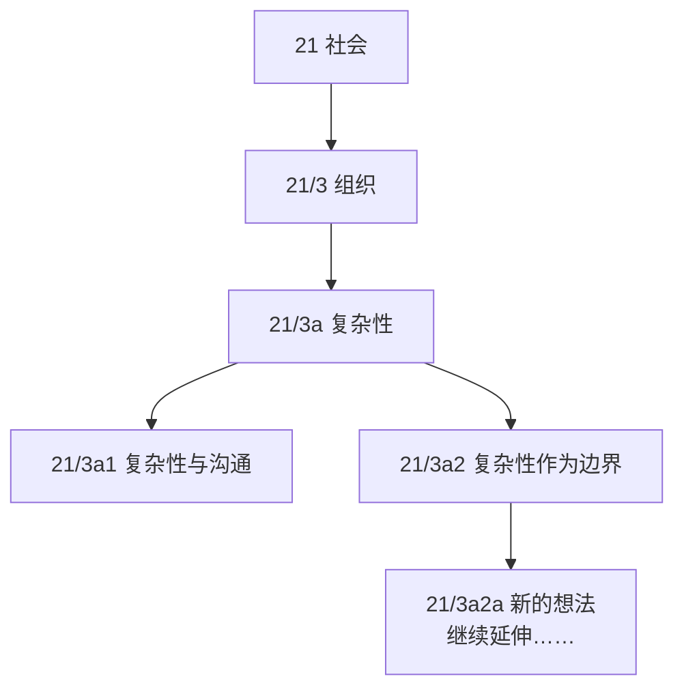
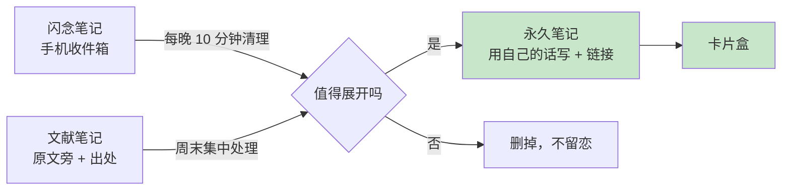

# 2.4 卡片笔记写作法

#### 目录介绍
- [01.看一个真实案例](#01看一个真实案例)
- [02.断点自测三问](#02断点自测三问)
- [03.先来说一个场景](#03先来说一个场景)
- [04.卢曼卡片盒原理](#04卢曼卡片盒原理)
- [05.三种笔记的区别](#05三种笔记的区别)
- [06.永久笔记怎么写](#06永久笔记怎么写)
- [07.卡片之间怎么连](#07卡片之间怎么连)
- [08.卡片盒用什么搭](#08卡片盒用什么搭)
- [09.这几个坑我踩过](#09这几个坑我踩过)
- [10.后来发生的改变](#10后来发生的改变)
- [11.今天起改变三点](#11今天起改变三点)
- [12.课后作业思考下](#12课后作业思考下)

## 01.看一个真实案例

先讲一个真实存在的人。

尼克拉斯·卢曼（Niklas Luhmann），德国社会学家。他在不到 30 年的学术生涯里，写了 **70 多本书、400 多篇学术论文**，大概相当于一个普通教授十辈子的产出。

更让人难以置信的是他的工作状态。有人问他怎么做到的，他答得出乎意料地平淡：

> 「我从不强迫自己做任何不情愿做的事，我只做对我来说容易的事。当我卡住时，我就去做别的。」

高产和轻松，竟然同时成立。秘密在他身后才被发现：一个**装有 9 万张卡片的木盒**。按卡片总量和写作年限倒推，**平均每天不过 6 张**。一天 6 张手掌大的纸片，堆出十辈子都够不着的产出，中间一定有个放大器。

放大器就是卡片盒的工作方式。卢曼写过一篇短文专门介绍它，标题直译过来是《与卡片盒交流》。在他嘴里，木盒不是仓库，而是他的**「第二记忆」**和**「对话伙伴」**。写书之前不是对着空白页「憋」，而是去卡片盒里「聊天」：把几张相关卡片摊开，看它们能碰撞出什么，**文章的问题意识自己就浮现了**。

这些卡片不是读书笔记，不是摘抄，而是一个**会自己生长的思想网络**。

我第一次看到这个故事，第一反应是：跟我有什么关系？我又不当教授。第二反应是：等等，**我缺的从来不是「写不出来」，而是「没东西可写」**。以前写技术总结，每次对着空白文档发呆两小时；而卢曼的做法相当于：**平时一直在写，只是写成一张张小卡片，输出时只需要拼接**。

写不出文章的人和不写文章的人，差的往往不是文笔，而是**中间那几百张卡片**。卢曼去世后，这个卡片盒被完整保存下来，研究者花了二十多年才把它整理数字化完毕：**一个思想网络的生命力，比它的主人更长**。

这个思路彻底改变了我记笔记的方式。

## 02.断点自测三问

在往下读之前，先做三道判断题。任意一题命中，这一节就值得你认真读完。

| 断点 | 自测题 | 症状描述 |
|:----:|:------|:--------|
| 摘抄成癖 | 打开你的笔记软件，随便挑 10 条，其中有多少条是「用自己的话写的」？低于 3 条？ | 只搬运不消化：假笔记 |
| 只存不连 | 你笔记里任意两条之间，有明确写过「它俩什么关系」的链接吗？一条都没有？ | 孤岛化：知识无法涌现 |
| 分类烦死 | 每次记新笔记前，是否会为「该放哪个文件夹」纠结超过 30 秒？ | 树状枷锁：想装网用了树 |

三道题依次对应本节的三条主线：**用自己的话（原子化）、建立链接（网络化）、放弃分类（改用链接）**。你在哪一条上薄，就重点看那一段。

## 03.先来说一个场景

上一节把好了信息的「大门」，让进来的都是有质量的内容。但信息进门之后去哪？大多数人（包括曾经的我）的「接待流程」几乎是一模一样的：**读到好内容 → 划线复制 → 存进笔记软件 → 分类到某个文件夹 → 再也没打开过 → 要用时搜不到 → 重新去网上搜**。

问题出在哪？**出在「保存」这一步被当成了终点**。

你以为存下来的是知识，实际上存下来的只是**别人的一段话**。没被消化，没和你的其他知识产生关系，也没变成「你的东西」。

认知心理学里两条规律，把这事讲得很透。

**加工越浅，忘得越快**。自己生成的内容，远比被动看过的记得牢；复制粘贴是「零加工」的保存，跳过了理解和重组，也就跳过了记忆发生的过程。

**保存越容易，提取越困难**。认知科学里有个「必要难度」：提取时越费劲，记忆加固越深；一键收藏把「费劲」连同理解一起省掉，那条内容就在你大脑里**从未真正存在过**。

对照一下，你的笔记软件里躺着的大概率是三种「假笔记」：

| 类型 | 长什么样 | 为什么是假的 |
|------|---------|-------------|
| **摘抄型** | 大段复制原文，配一句「说得好」 | 里面没有一个字经过你的大脑 |
| **清单型** | 「XX 必读的 50 篇文章」原样存着 | 存的是别人的目录，不是你的理解 |
| **截图型** | 划线截图、金句海报存满相册 | 三个月后连出处都找不到 |

共同点：**制造了「我在积累」的幻觉，却跳过了全部的理解过程**。这就是为什么笔记软件里几千条内容，写东西时还是一片空白：**里面没有一条真正属于你**。硬盘满了，大脑是空的。

很多人管笔记软件叫「第二大脑」，但只进不出的收藏夹配不上这个名字。**真正的第二大脑，不是把别人的话搬进硬盘，而是把自己的想法存成网络**。

## 04.卢曼卡片盒原理

卢曼的卡片盒（Zettelkasten，德语「卡片盒」）有三个反直觉的设计。

**① 每张卡片只写一件事**。不是「第三章笔记」，而是「**一个想法**」，一个完整的、可独立存在的最小想法单元。

**② 卡片必须用自己的话写**。抄录原文不叫笔记，叫搬运，**翻译成自己语言的过程，才是真正的学习**。

**③ 卡片的重点不是「存」，而是「连」**。卡片上的编号（如 21/3a）不是分类，而是**表示「这张卡片跟哪张有关」**。新卡片进来时，他会主动去找：**它和已有的哪些卡片能搭上关系？**

补一个冷知识：卢曼其实有**两个**卡片盒。文献盒只存书目和简要笔记，主盒存自己的想法。两盒分开，正是下一节「文献笔记」与「永久笔记」的雏形；9 万张卡片里真正支撑写作的，是主盒里那几万张**用自己的话写下的想法**。

三个设计里，最容易被低估的是编号：



这种「分支式编号」的妙处：**任何两张卡片之间，永远可以插入一张新卡片，而不需要重排整个系统**。21/3a1 和 21/3a2 之间冒出新想法？就叫它 21/3a1a。可以理解成纸片时代的「链表」。

三个设计单独看都不稀奇，**加起来才是真正的「知识网络」**：原子化让想法有了清晰的「接口」；用自己的话写让想法真正属于你；链接让想法互相供电。**缺了任何一条，卡片盒都会退化成一堆废纸**。这也是卢曼叫它「对话伙伴」的原因：卡片多了、链接密了，盒子里会形成你自己都没预料到的「观点集群」。你去提问（翻卡片），它给你回应（相关卡片涌现）。

对照本册 2.1 说的「把碎片整合进知识体系树」，卡片盒往前多走了一步：**树还不够，要织成网**。树要求每个知识点只有一个家，放错了就再也找不到；网允许一个想法同时属于多个问题，它有几个链接，就有几个家。**知识本来就是网状的，卡片盒只是承认了这一点**。

## 05.三种笔记的区别

卡片笔记法把笔记分成三类，这个分类是整套方法的核心：

| 类型 | 是什么 | 处理方式 | 寿命 |
|------|--------|---------|------|
| **闪念笔记** | 脑子里一闪而过的想法 | 随手记下，**1 至 2 天内必须处理完** | 临时 |
| **文献笔记** | 读书/读文章时的笔记 | 记在文献旁，带上出处，**作为原料** | 中期 |
| **永久笔记** | 经过自己消化、能独立存在的想法 | 用自己的话写完整，存入卡片盒，建立链接 | **永久** |

绝大多数人的问题在于：**只做闪念笔记和文献笔记，从来不做永久笔记**。于是笔记永远停在「原料」状态，没有一道工序把它加工成「成品」。

三种笔记怎么流动？用完整过程演示一遍，**一张卡片的诞生**。场景：通勤地铁上读《思考，快与慢》，读到「锚定效应」。

**第一步：闪念笔记（10 秒，地铁上）**，手机备忘录敲一行：

> 锚定效应：先出现的数字会拽偏人的判断？跟砍价、跟定目标都有关系，回头整理

就一行字，**抓住一闪而过的念头**，防止到站就忘。

**第二步：文献笔记（2 分钟，当晚）**，把书翻回那页，在书页边写：

> 锚定效应（P120 附近）：人估测数值时会被最先接触到的数字影响，即使明显无关。书里的实验：轮盘转出随机数字后，实验对象估测非洲国家数量都被带偏。我的联想：绩效目标是不是也是一种锚？

变化在于：**带上了出处，加了自己的一句联想**。标了产地、写了初判的原料。

**第三步：永久笔记（5 分钟，周末）**，清理闪念笔记时把它写成完整的卡片：

> **锚定效应：先出现的数字会拽偏你的判断**
>
> 人估测数值时会被最先接触到的数字影响，哪怕明显无关。生效条件：信息不充分、需要快速判断时最明显。
> 我的验证：团队绩效目标定多少，最终就完成多少，目标本身成了锚。
> 来源：《思考，快与慢》第 11 章
> 链接：[[谈判中先出价的道理]] [[目标定多少就完成多少]]

**从一行模糊的直觉，到一张有出处、有边界、有验证、有链接的卡片，总共 7 分钟**。一天 15 分钟就是全套笔记流程的预算。三种笔记各司其职：



为什么大多数人卡在转化？因为**文献笔记最像「成果」**：划线、摘抄、排版工整，完成感极强，可三个月后一条都用不上。**越像成品的笔记，越要警惕它停在原料区**。也别用同一个标准要求三种笔记：**闪念可以丢**（只是缓存），**文献可以糙**（只是原料），**唯独永久笔记不能省**，省了它，前两种就白做了。

**判断标准**：三个月后翻出来完全看不懂当时为什么记，**那它就只是闪念笔记，不是永久笔记**。

## 06.永久笔记怎么写

一条合格的永久笔记，四个条件。

**① 原子化：一张卡片只讲一件事**

反例：

> 「今天读了《思考，快与慢》，讲了系统 1 和系统 2，还提到锚定效应和可得性偏差，对我很有启发。」

什么都讲了，等于什么都没讲，找「锚定效应」搜不到它，链接别的卡片时**哪个都接不上**。正例是拆成三张：

> 卡片 A：系统 1 是快速、自动、无意识的思考；系统 2 是缓慢、需要刻意启动的思考。人们 95% 的时间在用系统 1。
> 卡片 B：锚定效应，人做判断时会被最先接触到的数字影响，即使那个数字明显无关。
> 卡片 C：可得性偏差，人根据「容易想起来」判断概率，所以空难比糖尿病更让人害怕。

**② 用自己的话写，写完整**

写**完整的句子**，让三个月后的你（或没读过那本书的人）也能看懂。这一步很难，因为它要求你**真的理解了**：**写不清楚，就是没想清楚**。检验办法：**合上原文写**，写完再对照。对照出来的差距，就是「以为懂了」和「真懂了」之间的距离，**这个差距只有合上原文才看得见**。

**③ 标清楚来源**

> 来源：《思考，快与慢》第 8 章 / P128

不是为了引用，而是**将来能回溯**：理解被推翻时，要能回去看是当初记错了，还是原文本就有局限。

**④ 写完就问一句：它跟什么有关？**

这是卡片盒的灵魂。每写一张新卡，花 30 秒想：**卡片盒里有没有跟它相关的？**有就建立链接。**这 30 秒，是整件事的价值所在**。

四条合起来，就是卡片模板：

```text
标题：一句陈述句，直接说清这个想法是什么
正文：3-5 句自己的话，它是什么、什么条件下成立、我的例子
来源：书名 + 章节页码 / 文章链接 / 「来自某次踩坑复盘」
链接：[[相关的卡片]]，每个链接旁写一句「为什么连」
日期：写卡当天
```

模板第一行单独强调：**标题用陈述句，把结论写出来**。「锚定效应：先出现的数字会拽偏你的判断」是好标题，「关于锚定效应的一点想法」是坏标题。三个月后在搜索结果里扫过几十个标题，决定点开哪个的就是那半秒钟。

同一个知识点的坏卡片长这样：

> 「书上说：『人们会被锚定值影响，即使它明显不合理。』说得太对了，值得反复品读。」

三个月后它什么都不能告诉你，只是一句别人的话，加一句无法执行的赞同。好卡片就是上一节诞生那张：陈述句标题、生效条件、自己的验证、出处、链接，**不再是一段摘抄，而是可被引用、被链接、被反复调用的想法单元**。

最后三个新手问题一并回答。**写一张要多久？**熟练后 5 分钟，这 5 分钟就是本册 2.1 说的「消化」，跳过它，笔记就只是搬运。**每天写几张？**1 至 3 张足矣，卢曼一天也就 6 张，**数量少不可怕，中断才可怕**，卡片盒是复利资产，断一个月，链接就开始荒。**找不到链接怎么办？**头二三十张几乎全是孤岛，**链接是涌现的**：攒过一两百张，「撞见老朋友」的频率会明显上升。在那之前，先攒卡。

## 07.卡片之间怎么连

链接不是随便加的，有三种高质量的连法。

**① 承接关系（A 是 B 的前提/延伸）**

> 卡片 A：人的工作记忆容量有限（约 7±2 个组块）
> 卡片 B：所以教学时应「分块」呈现信息，一次不超过 5 个

**② 对比关系（同一件事的两个面）**

> 卡片 A：间隔重复利于长期记忆
> 卡片 B：集中练习短期效果好但遗忘快
> 互相对比，共同支撑「为什么要分散学习」

**③ 冲突关系（A 和 B 互相矛盾）**

> 卡片 A：专注单一领域才能精通
> 卡片 B：跨界迁移能带来创新
> **冲突是最有价值的链接**，它逼你找边界条件：「什么情况下 A 对？什么情况下 B 对？」

三种连法之外，还有一条手艺：**链接要写「理由」，且双向都写**。光有 `[[链接]]`，三个月后你想不起当初为什么连，这条链接就死了，所以每个链接旁补一句话；A 连 B，就在 B 里也补一条指回 A（双链工具自动做，纯文本手动做）。**从任何一张卡出发都能找到全部邻居，网络才不会断头**。

> [[间隔重复]] ←（都是「必要的费劲」在起作用：健身练肌肉，复习练记忆）

链接攒到一定密度，还会解锁终极用法：**围绕「链接簇」取材写文章**。当五六张卡片通过链接抱成一团，互相承接、互相对比、还有两张在打架，这团卡片本身就在提示主题：摊开它们，找到共同的张力，文章的问题意识就有了。卢曼写书的顺序从来不是「想好题目再找材料」，而是「材料自己抱团成了题目」。**先有网络，再有文章**。

**卢曼说过一句话我很认同**：

> 「只有当一张卡片和别的卡片产生联系时，它才开始变得有用。」

## 08.卡片盒用什么搭

很多人卡在选软件上。我的建议非常明确：**工具不重要，简单最重要**。

| 方案 | 适合谁 | 优点 | 缺点 |
|------|-------|------|------|
| **纯文本 + 文件名编号** | 极简主义者 | 永不过时，检索快 | 链接要手动维护 |
| **Obsidian / Logseq** | 想要双向链接的人 | 双链、图谱、本地存储 | 有一点学习成本 |
| **Notion / 语雀** | 团队协作 | 数据库能力强 | 依赖网络，迁移麻烦 |
| **纸质卡片盒** | 卢曼原教旨 | 最符合原始设计 | 检索不便 |

我用**纯文本加 Obsidian**，理由很简单：**纯文本意味着 20 年后我还能打开它**。软件会倒闭，格式会过时，但文件夹里的 `.md` 文件永远可读。

今天就想开始？30 分钟搭起来。

**第 0 至 10 分钟：建结构**。建文件夹 `cards`，里面建子文件夹 `inbox`（收件箱）。就这两层。

**第 10 至 20 分钟：写第一张永久笔记**。用第五节的模板，挑今天最有感触的点，用自己的话写 3 至 5 句，标上来源。文件名用简短标题（如 `锚定效应.md`），日后 `[[]]` 引用时链接本身就可读。

**第 20 至 30 分钟：写第二张，建立第一条链接**。问自己「它跟什么有关」，写成卡片，两张互相 `[[文件名]]` 链接。

**第一周只有三条规矩：每天一张、只写不整理、不装任何插件**。「不装插件」值得强调：装插件、调主题是新手期最大的时间黑洞，它给你「我在搭系统」的满足感，而系统里一张卡片都没有。**先记 100 张，再谈优化**。

几个高频问题一并回答。**旧笔记要迁移吗？**不要，旧笔记原地躺着，新卡片从头开始，迁移是大工程，会耗尽启动热情。**卡片写重了？**合并成一张更好的，链接跟着合并，网络反而更密。**写错了？**改，并留一句「我曾以为……后来发现……」。**纠错过程本身，就是最值钱的卡片**。**卡片盒能当待办清单吗？**不能，混进任务后，打开卡片盒看到的不是思想网络，而是一堆催债的便签。**多久见效？**头一个月几乎无感，坚持到一百张上下，会迎来第一次「原来这两件事是一回事」的惊喜。

**就这样**。不需要插件，不需要花里胡哨的看板。真正重要的是**你有没有坚持写**，而不是你用什么写。

## 09.这几个坑我踩过

**坑一：把卡片盒当成收藏夹**。我一开始疯狂往里塞摘录，一个月存了 300 多条，感觉很充实；三个月后回头看，**一条都想不起来**，存的还是「别人的话」。判断标准：**这条笔记里有「我的判断」吗？**没有，就别存。

**坑二：过度追求分类体系**。我花过一个周末设计分类树：技术/管理/成长，再分三层。结果每次存笔记都要纠结「这该放哪」，**最后干脆不存了**。卢曼的洞见：**放弃分类，改用链接**。分类是树状的，现实知识是网状的，**用树去装网，注定装不下**。一张「技术债心理」卡，算技术还是算心理？分类答不了，链接可以：它同时连着两边。

**坑三：想一次性搭好完美系统**。这是拖延症最爱的伪装。开始时卡片盒会很丑、很乱、链接很少，**这是正常的**，卢曼的第一张卡片也是从零开始的。**先记 100 张再说优化的事**。

**坑四：为链接而链接**。有阵子我把「链接数」当 KPI：写卡必连，图谱越来越密，特别有成就感。直到顺着图谱翻卡片，发现**一半的链接答不出「为什么连」**，不表达任何关系，只是装饰品。对策：**每次链接前必须答出「它俩什么关系」，答不出就不连**。宁要 50 条说得清的链接，不要 500 条装饰。**卡片盒是给自己用的，不是给截图用的**。

## 10.后来发生的改变

我用这套方法两年半，攒下一千两百多张卡片，平均每天不到两张。最大的三个变化如下。

**变化一：写东西不再需要「憋」**。以前写一篇技术文章 8 小时，5 小时耗在找素材和理思路；现在先去卡片盒搜关键词，把相关卡片摊开，**骨架立刻就有了**。最长的一篇技术总结，摊了四十多张卡片，两小时成稿。放在以前，光「回忆在哪见过这个说法」就够耗一晚上。

**变化二：想法会自己冒出来**。当卡片间有了足够多的链接，**两个从没想过放在一起的领域，突然能互相解释**。我写过一篇反响很好的《技术债是复利》：那张复利卡片是读理财内容时随手写的，在卡片盒里躺了三个月；写技术债卡壳那晚，我搜「累积」把它翻了出来，**「技术债的利息」这个比喻，几乎是从那条链接里自己长出来的**。它们本来毫无关系，是链接让它们相遇了。

**变化三：不再害怕遗忘**。只要进了卡片盒、和别的东西连上了，我就不会真的失去它，忘了细节，顺着链接总能找回思路。至于怎么系统安排复习、跟遗忘曲线正面作战，本册第 3 章《对抗遗忘记忆法》专门展开。这种安全感，让我敢于去学更多「暂时用不上」的东西。

还有这些卡片的最终去向：**卡片攒到几百张，输出是自然发生的事**，它们变成了博客文章、团队分享，也变成了这一册书的很多小节，包括你正在读的这一节：它的初稿，就是摊开三十多张卡片串起来的。这也印证了本册 4.2《输出倒逼着输入》的道理：**卡片是最小的输出，输出是放大的卡片**。

## 11.今天起改变三点

**第一，今天写你的第一张永久笔记**。就一张。挑今天最有感触的点，用自己的话写 3 至 5 句话，标上来源。**不要想着搭系统，先写一张出来**。

**第二，给这张卡片找至少一个「邻居」**。问自己：它和我已知的什么有关？把那个东西也写成卡片，然后建立链接。**有链接的卡片，才算真正进入了你的知识网络**。

**第三，定一个「清闪念」的固定时间**。每天下班前 10 分钟，把今天的闪念笔记处理掉，能变成永久笔记的就写完整，不能的就删掉。**闪念笔记不过夜，这是整套方法能持续运转的关键**。

## 12.课后作业思考下

1. **做一次笔记体检**：随便翻 10 条笔记，多少条是「自己的话」，多少条是「复制粘贴」？在每条复制粘贴旁补一句「我的判断」，补不出来的，直接删。

2. **拆一次原子**：挑一篇最近读过的文章，拆成 3 张独立的原子卡片，每张只讲一个点。拆完你会发现，「读懂了」和「能拆开」之间，差着一整层理解。

3. **连一次线**：找出笔记里两条完全无关的内容，**试着找出它们之间的一种联系**（承接/对比/冲突都行），并用一句话写出「为什么连」。

4. **盘一次家底**：现在要写一篇「你最熟悉的领域」的文章，你的笔记里能直接拿来用的素材有几条？如果是零，说明你的笔记还只是收藏夹。从今天的第一张卡片开始。

---

> 上一篇：[2.3 建立优质信息源](./08.建立优质信息源.md) ｜ 下一篇：[3.1 宏观学习的方法](./10.宏观学习的方法.md)
