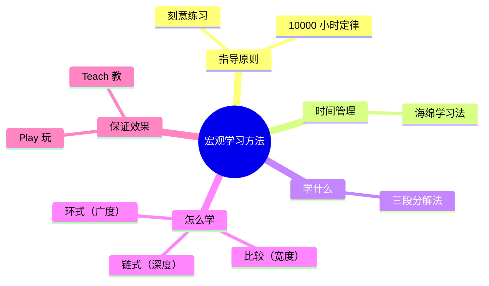
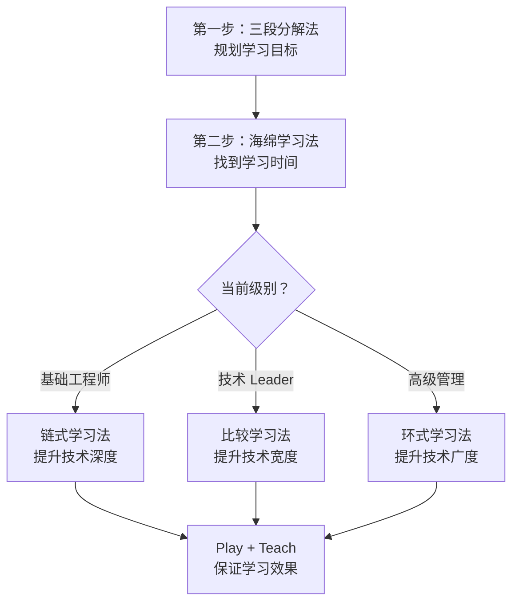

# 3.1 宏观学习的方法

#### 目录介绍
- [01.看一个真实案例](#01看一个真实案例)
- [02.断点自测三问](#02断点自测三问)
- [03.四大学习困境](#03四大学习困境)
- [04.宏观指导原则](#04宏观指导原则)
- [05.海绵法找时间](#05海绵法找时间)
- [06.三段分解学什么](#06三段分解学什么)
- [07.链式环式怎么学](#07链式环式怎么学)
- [08.玩和教保效果](#08玩和教保效果)
- [09.方法论的沉淀](#09方法论的沉淀)
- [10.组合灵活使用](#10组合灵活使用)
- [11.后来发生的改变](#11后来发生的改变)
- [12.今天起改变三点](#12今天起改变三点)
- [13.课后作业思考下](#13课后作业思考下)

## 01.看一个真实案例

毕业后第三年，我给自己定了一个口号：「今年要好好学技术」。然后我做了这些事：

1. 买了 6 本书，读完 1 本半；
2. 买了 3 门付费课程，看完了第一章；
3. 收藏了 200+ 篇技术文章，**一篇没回看**；
4. 每天通勤听播客，听完什么也不记得；
5. 周末偶尔写 demo，写完就丢。

那一年的年度总结，我对着一片空白的「成长收获」栏发呆了 40 分钟。更扎心的是部门答辩，主管在我下面写了一行字：

> 「全年学习投入不少，但**没看到能力维度上的明显跃迁**。」

我当时脑袋「嗡」的一下：**我自认是同事里最爱学习的人，结果在领导眼里我只是「看起来很忙」**。

那次答辩之后，我去找一个 P7 的前辈喝茶倒苦水。他听完只问了我四个问题：

> 1. 你**没时间学**，怎么解决的？
> 2. 你有了时间，**到底要学什么**，想清楚了吗？
> 3. 你怎么学的，是堆时间，还是有方法？
> 4. 学完之后，**有人能验证你学会了吗**？

我当场就答不上来。前辈说：「你不是不努力，你是**没框架**。学习是个系统工程，缺一个齿轮整盘机器都转不动。」

那次之后我才意识到：原来「会学习」本身也是一项能力，需要被设计、被训练、被复盘。下面这套**宏观学习方法**，就是我一年一年磨出来、最后真正帮我从「忙学」过渡到「会学」的体系。

## 02.断点自测三问

在往下读之前，先做三道判断题。任意一题命中，这一章就值得你认真读完。

| 断点 | 自测题 | 症状描述 |
|:----:|:------|:--------|
| 没时间学 | 最近一个月，你每周真正「坐下来学」的时间加起来超过 5 小时了吗？低于 5 小时？ | 时间失控：全被工作和刷手机吃掉 |
| 不知学啥 | 让你写下未来 6 个月要重点提升的**一个**技能，你 30 秒能写出来吗？写不出？ | 目标漂移：什么都想学 |
| 学完就忘 | 上个月学到的最深印象一个知识点，你现在能用三句话讲清楚它吗？讲不清？ | 无验证闭环：学到即遗忘 |

三道题依次对应本章的三条主线：**时间从哪来（海绵法）、学什么（三段分解 + 链式/比较/环式）、怎么保证学会（玩 + 教）**。你在哪一条上薄，就重点看那一段。

## 03.四大学习困境

不知道你有没有这样的感受：上班累得要死，还要陪家人，还有群里各种吃瓜、看剧，根本就没什么时间学习；等到哪天有点空余时间，又因为没有计划，只能随便找本书或者上网学习看看。就算知道要针对某个技能专门提升一下，也不知道怎么学才能达到精通水平；过段时间回头一看，前几周学的东西又忘得差不多了；跟别人交流一下子就暴露了水平。

**根据上面的例子，可以把学习困境拆成四类**：

| 困境 | 症状 | 对应方法 |
|:----:|:----|:----|
| **困境一** | 没有时间去学习 | 海绵学习法 |
| **困境二** | 有时间不知学什么 | 三段分解法 |
| **困境三** | 学了不知是否学会 | 链式 / 环式 / 比较学习法 |
| **困境四** | 学到了但用不出、一交流就露 | Play 玩学习法 + Teach 教学习法 |

很多人的学习都是零散的、随机的：想到什么学什么，看到什么追什么。这种方式在短期内可能有些效果，但长期来看效率很低。

**建立一套系统的学习机制很关键**，或者写、或者做、或者计划、或者跟小伙伴交流。只有把学习变成一个有目标、有方法、有反馈的系统，才能真正实现持续成长。下面会逐一说到这些方法的具体内容。

## 04.宏观指导原则

一套系统的学习方法，既需要一个统领全局的宏观指导原则，也要能回答四个关键问题：

- **刻意练习**：信息太多，如何保证有效学习并学以致用，靠 **10000 小时定律** 托底；
- **时间从哪里来**：没有时间投入再好的理论也是纸上谈兵，靠 **海绵学习法** 挤时间；
- **学什么**：找到正确方向、明确目标、有的放矢，靠 **三段分解法** 拆分；
- **怎么学**：不同目的应有不同方法，靠 **链式 / 比较 / 环式学习法** 匹配深度、宽度、广度；
- **怎么保证效果**：解决「学了用不上、学了就忘」的问题，靠 **Play + Teach 学习法** 闭环。

这五个问题并不是孤立的，而是层层递进、相互支撑的关系。10000 小时定律告诉我们「要投入」，海绵法解决「时间哪来」，三段分解法回答「学什么」，三种学习法指导「怎么学」，Play 和 Teach 法保证「学到位」。**它们构成了一个完整的学习闭环，缺一不可**。

## 05.海绵法找时间

10000 小时相当于平均每天 3 小时，持续 10 年。平时工作就已经「累成狗」了，可能还有家人需要照顾，怎么才能找到自己的 10000 小时？

**这就要靠海绵学习法**。海绵学习法是一个时间管理方法，它可以让你轻松地挤出时间，既不会对工作、家庭和娱乐有明显的影响，又能够兼顾学习。关键在于「积少成多，聚沙成塔」：每天挤出 2 至 3 小时，长期坚持下来效果惊人。

海绵法解决的是「时间从哪来」的问题，但光有时间还不够，你还需要知道这些时间用来学什么、怎么学、学的效果如何保证。**海绵法是整个学习体系的第一块砖，有了它，后面的方法才有施展的空间**。（具体做法见 3.2 节）

## 06.三段分解学什么

有了时间之后，我们要学什么呢？怎么才能制定合理的学习目标？如何制定可行的学习计划并能够真正落地？这就要靠三段分解法。

**三段分解的核心逻辑是：大目标 → 中目标 → 小行动**。先把 10 年的宏大目标分解为 2 至 3 年的等级目标，再把等级目标分解为 6 个月的技能目标，最后把技能目标分解为 1 至 2 个月的具体行动。每完成一个阶段都能获得正反馈，形成持续学习的动力。

分解的两个关键原则：

**第一个原则：每一级分解都要「看得见、够得着」**。10 年目标太远看不见，2 至 3 年目标可以想象，6 个月目标可以规划，1 至 2 个月目标可以立即行动。这种层层递进的设计，让宏大的目标不再让人畏惧。

**第二个原则：每一级完成后都要有正反馈**。人的大脑需要持续的正向刺激才能保持动力。每完成一个小目标就给自己一个奖励，每上升一个等级就庆祝一次，这些正反馈是你坚持 10 年的燃料。（具体拆解见 3.3 节）

## 07.链式环式怎么学

确定目标和计划后，具体怎么提升能力？能力可以拆解成三个维度：深度、宽度和广度。针对能力的不同维度，有三个不同的学习方法：

| 学习法 | 提升维度 | 核心做法 | 一句话 |
|:----:|:----:|:----|:----|
| **链式学习法** | 深度 | 自顶向下逐步深入 | 把一项技术从表面钻到底 |
| **比较学习法** | 宽度 | 比较相似的知识 / 技能 | 把同类方案横向摊开对比 |
| **环式学习法** | 广度 | 学习业务闭环流程中的相关技术 | 顺一条价值链，把上下游都跑通 |

不同阶段，三种方法的优先级是不一样的：**初级工程师优先链式**（往深里钻），**技术 Leader 优先比较**（横向看清行业方案），**高级管理者优先环式**（业务到技术形成闭环）。**先选一个，深用 6 个月**，比「三个方法都浅尝」有效得多。（具体差异见 3.4 节）

## 08.玩和教保效果

就算用对了方法，在学习过程中还是会遇到一些难以解决的困难，这些困难会导致我们学习效果不好。两个最常见的：

- **困难一**：平时不学、真正要用时来不及临时学；但平时学了，可能要等很久才能在工作找到实践机会，到时候技术可能都生疏了。
- **困难二**：学完之后感觉学得不深，跟别人讨论的时候、或者在晋升答辩环节被问到的时候，就发现很多东西明明学过，却说不出个所以然来。

针对这两个问题，两种方法配对下药：

- **Play 玩学习法**：解决「工作中暂时没有实践机会」的困境，思路是「学以致玩」，通过模拟场景来应用所学；
- **Teach 教学习法**：解决「学得不深、理解不透」的困境，思路是「教学相长」，通过写作和培训来加深理解。

（具体做法见 3.5 节）

## 09.方法论的沉淀

通过**三步学习法**规划：第一步制定目标；第二步实践学习；第三步运用输出。**它是一个从目标设定到学习执行再到成果输出的完整闭环**。

通过**极简学习法**实践：作为一种高效的学习方法，通过精简资源、时间和学习材料，帮助我们更专注于最重要的概念和技能，从而实现用最小的投入获取最大的学习收益。**核心理念是「少即是多」，去掉噪音，聚焦本质**。

通过**费曼学习法**输出：一个操作简单、并且具有普适性的方法，它只有四个步骤：假装讲给孩子听、复习卡住的地方、整理并简化笔记、讲给别人听至懂。**如果你能用大白话给一个 12 岁孩子讲清楚，就说明你真正理解了**。（具体流程见 3.6 节）

## 10.组合灵活使用

这些学习方法是相辅相成的，你可以根据你当前的级别和实际工作内容，把它们组合起来使用。

**第一步**：无论你当前是什么级别，先用「三段分解法」来规划学习目标和计划。

**第二步**：使用「海绵学习法」找到你可以用于学习的时间。

**第三步**：根据学习目标采取相应的学习方法。**基础工程师**推荐链式学习法，聚焦技术深度；**技术 Leader**推荐比较学习法，聚焦技术宽度；**高级管理**推荐环式学习法，聚焦技术广度；**吃瓜群众**建议灵活组合，任何场景都可以用方法论提升能力。

**第四步**：不管选哪个，最后都用 Play + Teach 收尾，确保学到位。

> 学习不是堆时间，而是搭框架：先解决「时间哪来 + 学什么 + 怎么学 + 怎么验证学会」这四个问题，剩下的就交给坚持。

## 11.后来发生的改变

被前辈点醒后，我做的第一件事不是开始学，而是**关电脑**。我把所有收藏夹、待读清单全部导出，3 张 A4 纸打印出来，对着划掉。

最后只留下 1 个核心方向（高并发系统设计），其他全部封存。那一刻我才感受到什么叫「少即是多」。

按海绵法重排时间表后，我每天早起 30 分钟、通勤 1 小时、上班前 30 分钟、睡前 30 分钟，工作日就有 2.5 小时；周末再挤 3 小时。一周下来稳稳的 14 小时纯学习时间，而且**没影响陪老婆、没耽误项目**。

半年后，我用 Teach 法把「高并发限流的 5 种方案」写成内部分享文档，做了一次 40 分钟的技术 brown bag。分享后主管在群里说了一句：「这才是我想看到的『学到位了』。」那场分享的 PPT 后来被推到了部门 wiki 首页。

那一刻我才真正理解：**「学了」和「会了」之间，差的不是时间，而是一整套方法体系**。

## 12.今天起改变三点

**第一，今天就花 15 分钟做一次「瓶颈诊断」**。对照 02 节的三道断点自测题，你最卡在哪一条？把这个核心痛点写在纸上，这是解决问题的第一步。**精准诊断问题，才能对症下药**。

**第二，按级别选一把「主武器」，别贪多**。基础工程师用链式学习法提升技术深度；技术 Leader 用比较学习法拓展技术宽度；想全面发展的用环式学习法培养全局视野。**先选一种最适合你当前阶段的方法，专注使用 2 至 3 个月**。

**第三，制定一个可执行的 2 周计划，配上「出厂检验」**。把方法和目标结合起来，具体到每天学什么、怎么学、花多少时间。**2 周结束时必须交一次 Teach 作业**：写篇总结或做一次 15 分钟分享，讲不清就不算学完，回炉重学。

## 13.课后作业思考下

1. **学习困境诊断**：对照文中提到的四个关键问题（时间从哪里来？学什么？怎么学？怎么保证效果？），评估你在哪个环节最薄弱。针对这个最薄弱的环节，选择对应的学习方法，制定一个改善计划。

2. **学习效率审计**：统计你上周用于学习的总时间，然后评估这些时间的有效利用率。有多少时间是真正在「刻意练习」？有多少时间只是「假装学习」？思考如何提高学习时间的**质量**而非仅仅增加**数量**。

3. **方法匹配测试**：根据你当前的职业级别（初级 / 中级 / 高级 / 专家），选择文中推荐的对应学习方法。用这个方法学习一个你正在提升的技能，2 周后评估效果。如果效果不理想，分析是方法选错了还是执行不到位。

4. **组合方法实验**：选择两种学习方法进行组合（比如海绵法 + 链式学习法），针对一个具体技能点进行为期一个月的学习实验。记录过程和效果，月底评估组合使用的效果是否好于单一方法。

---

> 上一篇：[2.4 卡片笔记写作法](./09.卡片笔记写作法.md) ｜ 下一篇：[3.2 用海绵法找时间](./11.用海绵法找时间.md)
