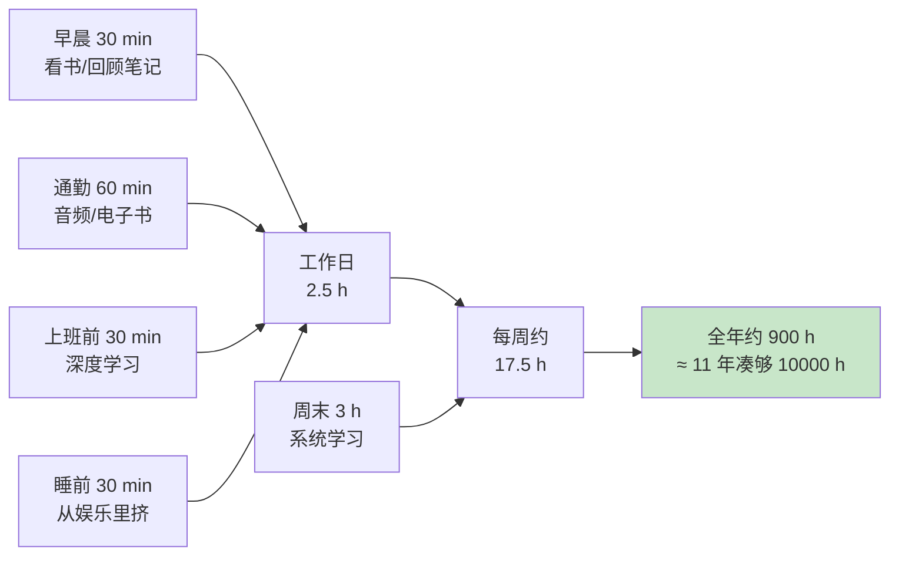

# 3.2 用海绵法找时间

#### 目录介绍
- [01.看一个真实案例](#01看一个真实案例)
- [02.断点自测三问](#02断点自测三问)
- [03.一万小时的定律](#03一万小时的定律)
- [04.跨领域的注意点](#04跨领域的注意点)
- [05.工作外主动提升](#05工作外主动提升)
- [06.什么叫海绵方法](#06什么叫海绵方法)
- [07.从哪里去挤时间](#07从哪里去挤时间)
- [08.坚持长期主义者](#08坚持长期主义者)
- [09.后来发生的改变](#09后来发生的改变)
- [10.今天起改变三点](#10今天起改变三点)
- [11.课后作业思考下](#11课后作业思考下)

## 01.看一个真实案例

工作第三年，我每天的口头禅是：「最近太忙了」「有空我就学」「等这个项目结束我就……」。结果一年过去，我还是那个我：

1. 想看的书，**没翻过 10 页**；
2. 想学的源码，**目录都没记住**；
3. 朋友拉我做技术分享，我说「等我准备好」，**等了一年没准备好**。

那一年公司年终晋升答辩，我被刷了。评语里有一句话扎得我现在还疼：「技术深度未见明显增长，**疑似停留在原地**。」

我那一刻特别委屈：我**真的觉得自己很忙**，怎么就成「停留在原地」了？

发生这件事后我抱怨。后来同事让我说时间分配在哪里，翻出微信运动、抖音观看时长、王者荣耀对局数据，让我触目惊心：

| 类别 | 日均时长 |
|:----|:----:|
| 抖音 | **67 分钟** |
| 王者荣耀 | **32 分钟** |
| 微信刷朋友圈（保守估计） | **40 分钟** |
| **合计** | **约 2 小时 20 分钟** |

同事算了一下：「每天大约有 2 小时 20 分钟在『娱乐性消耗』。如果只挪出其中 1 小时，一年就是 365 小时。再算上你周末的『我累了我要躺』……」

我当时就闭嘴了。**不是没时间，是时间从来没有被认真分配过**。后来我看到鲁迅那句话：「时间就像海绵里的水，只要愿意挤，总还是有的。」我才明白海绵法不是教你压榨自己，而是教你**承认时间是被你自己「漏」掉的**。下面这套海绵法，就是我从那个晚上开始一点一点试出来的。

## 02.断点自测三问

在往下读之前，先做三道判断题。任意一题命中，这一节就值得你认真读完。

| 断点 | 自测题 | 症状描述 |
|:----:|:------|:--------|
| 时间黑账 | 你能说出昨天从起床到入睡，每 1 小时的去向吗？说得出 60% 就算过关 | 时间失明：不知漏在哪 |
| 借口成瘾 | 最近一个月，你说过多少次「太忙没时间学」？超过 3 次？ | 归因错误：把懒当成忙 |
| 高估自律 | 你上一次「立志每天学 2 小时」的计划，坚持了几天？7 天以内破功？ | 门槛过高：意志力靠不住 |

三道题依次对应本节的三条主线：**时间审计（先看漏点）、正视借口（承认娱乐消耗）、低门槛坚持（长期主义）**。你在哪一条上薄，就重点看那一段。

## 03.一万小时的定律

10000 小时定律，是由心理学家安德斯·埃里克森（Anders Ericsson）提出的一个理论。它认为在任何领域成为专家所需的时间大约是 10000 小时。

如果一个人在某个特定领域投入足够的时间和精力进行刻意练习，那么他们有望成为该领域的专家。这个理论的核心观点是：成功不仅仅取决于天赋，更重要的是通过大量的刻意练习来提高技能和表现。

此外，埃里克森的研究也指出，**刻意练习的质量比纯粹的时间投入更为重要**。只有通过有目的、有挑战性的练习，不断地寻求反馈和改进，才能真正提高技能水平。

如果把 10000 小时换算一下：**平均一天投入 3 小时，一年投入 365 天，那么 10 年算下来就是 10950 小时**。所以 10000 小时定律意味着，成为某个领域的专家，需要花费 10 年时间。

## 04.跨领域的注意点

10000 小时定律所说的「成功」或者「成为专家」，是指在某一个领域，而不是所有领域一通百通。所以**专业聚焦对于 10000 小时定律的落地非常关键**。

如果你从 A 领域转行到 B 领域，而它们的差异又比较大的话，那么你分别在这两个领域投入的时间是不能累加的，相当于以前在 A 领域的积累被浪费掉了。

分清楚同一个领域和不同的领域很重要，四种典型情况：

| 情况 | 累计效果 |
|:----|:----|
| 单一聚焦：A 领域投入 10000 小时 | 成为 A 领域专家 |
| 分散投入：A 和 B 各 5000 小时 | 两个领域都非专家 |
| A → B 差异大的转行 | 前期积累浪费，需重新计时 |
| A → A' 差异小的转型 | 前期积累部分可用，能加速成长 |

**虽然跨领域的专业时间不能叠加，但有一类能力是可以跨领域迁移的**：沟通能力、项目管理能力、学习能力、问题分析能力等。这些「元能力」不会因为你换了领域就归零，反而会让你在新领域上手更快。所以在深耕专业技能的同时，别忘了积累这些可迁移的通用能力。

## 05.工作外主动提升

10000 个小时相当于连续 10 年平均每天投入 3 个小时。你可能会有问：「我每天工作 10 个小时，这样算下来，岂不是不到 4 年就可以成为大牛了？」

很明显，这是不太可能的。原因在于，**工作中的很多时间都是在做一些重复的事情，只是让已经掌握的技能变得更熟练而已，边际效益是越来越低的**。

这就像练小提琴，每天都只练习《生日快乐》这个曲子，就算练 10 年也不可能成为专业小提琴手。你必须先练习某个难度的曲谱，熟练后再来练习下一难度的曲谱，这样逐步提升难度，最终才能成为专业的小提琴手。

**如果你想要高效地提升自己，就必须不断地主动学习新的、复杂度更高的技能，等到工作中用得上的时候，抓住机会在实践的过程中练习，获得经验教训，进一步加深对技能的理解和掌握。如此循环往复，一步一步地提升自己的能力**。

工作 1 个小时不等于学习 1 个小时。除了上班时间外，尽量保证每天能够有 2 个小时的主动提升时间。那么这个时间从哪里来呢？可以用海绵法找时间。

## 06.什么叫海绵方法

「海绵学习法」，其实是借用了鲁迅的名言：「时间就像海绵里的水，只要愿意挤，总还是有的。」

**海绵学习法的关键就是「挤时间」**。既不需要放弃所有的休闲娱乐，也不需要在累成狗的时候强行「打鸡血」逼着自己去学，而是通过长期坚持的方式，达到「积少成多、聚沙成塔」的效果。

海绵法有三大原则：

- **不影响生活**：不需要完全放弃休闲娱乐，从娱乐里挤出少量时间即可；
- **不强行打鸡血**：不需要在极度疲惫时硬撑，选择精力好的时段学习；
- **长期坚持**：积少成多、聚沙成塔，每天 2 至 3 小时，坚持数年。

## 07.从哪里去挤时间

**1. 早晨 30 分钟**。可以把起床的闹钟提前 30 分钟，比如原来 07:30 的闹钟改为 07:00。不用担心提前 30 分钟起床会影响休息质量，习惯以后不但不会影响一天的精力，甚至可能反而让人更有精神。早起的时间可以用来看书（30 分钟基本足够看完一本书的一个章节），或写一下今日工作优先级事项、回顾知识笔记。

**2. 通勤 1 小时**。大城市的上班通勤时间在 1 到 2 个小时。可以根据通勤方式选择对应的学习方式：坐公共汽车或者自己开车，可以听书籍和线上课程的音频；坐地铁，除了听音频，也可以看电子书和线上课程，有座位还可以看纸质书。

**3. 上班 30 分钟**。刚到工位的第一个 30 分钟（或者开完晨会后的 30 分钟），一般也没什么会议，也很少有人来打扰，大脑又是最活跃的时间，所以学习的效果非常好。不用担心这 30 分钟会影响项目进度，一天当中总会有其他事情浪费 30 分钟以上（不必要的会议、低效的沟通、玩手机摸鱼）。如果担心影响项目进度，可以在别的事情上提高效率。

**4. 睡前 30 分钟**。大部分人在睡前都会进行一些休闲娱乐活动来放松自己，比如玩游戏、追剧、看电影、刷短视频等。对于忙碌了一天的劳动者来说，适当的放松是必不可少的。我们不必完全放弃这些活动，只需要从中挤出 30 分钟就行了。

**5. 周末 3 小时**。大部分人周末都会安排一些耗时很长的活动，比如购物、逛街、聚会、看电影、旅游和睡懒觉等。只要有意识地挤时间，很容易就能挤出 3 个小时：购物、逛街和聚会的时候控制时间、早点回去；减少一些「无效社交」；旅游的时候做好时间规划；本来准备睡 10 小时懒觉，改为睡 9 小时……

**时间预算汇总**：

| 时段 | 每日/次时长 | 每周合计 | 建议内容 |
|:----|:----:|:----:|:----|
| 早晨 | 30 min | 3.5 h | 看书、回顾笔记 |
| 通勤 | 60 min | 5 h | 听音频、看电子书 |
| 上班前 | 30 min（工作日） | 2.5 h | 深度学习、写代码 |
| 睡前 | 30 min | 3.5 h | 轻度阅读、整理 |
| 周末 | 3 h | 3 h | 系统学习、做项目 |
| **合计** | | **约 17.5 h/周** | 全年约 900 h |

不到 12 年就能凑够 10000 小时定律所需的时长。**没打鸡血，没抛家人，只是把每天的「漏点」回收了**。

## 08.坚持长期主义者

这些方法对你原来的工作和生活影响很小，但只要长期坚持，积累的时间规模和个人的成长速度都是非常可观的。

当然，这些方法仍然需要我们稍微克服一下人性的弱点，只是用不着「头悬梁锥刺股」这样夸张而已。但是如果你连少打一局游戏、少刷一集剧这样的意志力都没有，那么无论多么有效的方法对你来说都是没有意义的。

**坚持的秘诀不在于意志力有多强，而在于门槛设得够低**。每天只需要挤出 30 分钟，这个门槛几乎人人都能做到。一旦养成了习惯，你会发现 30 分钟自然而然地变成了 1 小时、2 小时。

三条我一直在用的收尾原则：

**① 先做一次「时间审计」，再谈学习计划**。不知道时间漏在哪，就不可能挤出来。

**② 门槛低胜过意志力强**。每天 30 分钟比每周 5 小时更容易坚持。

**③ 碎片时间学碎片知识，版块时间学系统知识**。把对的内容放在对的时段，效率天差地别。

> 时间从来不是没有，只是没有被分配。海绵法不是教你「加班式学习」，而是教你**承认每天 2 小时的「漏点」，并把它们一点点回收**。

## 09.后来发生的改变

我装了一个时间记录 App，连续 7 天精确到 30 分钟记录所有动作。第 8 天导出报表，我盯着那张图看了 10 分钟：

- 「我以为我在工作」的时间里，有 **48 分钟在群里聊八卦**；
- 「我以为我累瘫了」的晚上，**1 小时 12 分钟在刷短视频**；
- 「我以为周末很充实」，其实**周日下午 3 小时全在瘫**。

那张报表被我截图打印贴在工位上，标题写了 4 个字：「**别再骗自己**」。

我按照海绵法重新排了时间表：

- 06:30 - 07:00 早起翻一本技术书的一节；
- 08:00 - 09:00 通勤听一个英文技术播客；
- 09:30 - 10:00 上班前过一遍 GitHub Trending 并写 5 行 demo；
- 22:00 - 22:30 睡前整理白天笔记、写第二天 TODO；
- 周六 09:00 - 12:00 做一个完整的 side project。

整整一个月，工作日每天 2 小时、周末 3 小时，**一周 13 小时纯学习时间，比上一年的全年还多**。

半年下来发生了三件事：

1. 我在 GitHub 上的一个开源项目拿到了 800+ star；
2. 内部技术分享被点名表扬，主管在 OKR 沟通时说「看到了你的成长曲线」；
3. **再没人能用「你太忙」打发我的学习计划**，因为我的时间表上每一格都有名字。

更重要的是心态变了：以前我觉得「我没时间」是事实，现在我知道，**「我没时间」这三个字 99% 是借口，1% 才是事实**。

## 10.今天起改变三点

**第一，今晚就做一次「30 分钟时间审计」**。回忆昨天从起床到入睡，每 1 小时干了什么，写在纸上。**你会震惊地发现，至少有 90 分钟根本想不起来去哪了**，那就是你的第一批海绵水。

**第二，找出 3 个可以挤的时间段，明天开始执行**。不需要大刀阔斧地改变生活方式，只需要少刷一集剧、少打一局游戏。把这 3 个时间段写在手机备忘录上，标注清楚每一段学什么。**碎片时间（10 至 30 分钟）用来学碎片化知识**，比如阅读文章、听播客、背知识点；**版块时间（1 小时以上）用来学系统化知识**，比如看书、做项目、写代码。别用碎片时间做需要深度思考的事，也别用版块时间刷信息流。

**第三，给自己设一个「最低门槛」**。每天至少 30 分钟，无论多忙都不能打破。**门槛比意志力重要**：不要期望一周就看到效果，每天 1 小时，一年就是 365 小时，3 年就超过 1000 小时。坚持 3 个月，你会发现这已经变成了一种自然的习惯。

## 11.课后作业思考下

1. **时间审计练习**：从明天起，连续记录 3 天你的完整时间使用情况（精确到 30 分钟）。3 天后分析：你每天有多少时间花在了无意义的消耗上？其中有多少可以转化为学习时间？计算你的「时间回收潜力」。

2. **10000 小时计算**：按照你当前每天能挤出的学习时间，计算你成为所在领域专家需要多少年。如果这个数字太大，思考是否有办法每天多挤出 30 分钟？这 30 分钟可以从哪里来？

3. **海绵时间规划**：根据你的时间审计结果，设计一份具体的「海绵学习时间表」。明确每个时间段学什么、怎么学。执行一周后评估是否可行并进行调整。

4. **长期主义测试**：给自己设定一个 30 天挑战，每天至少学习 1 小时，不间断。记录每天的完成情况和学习内容。30 天后回顾：你中间断过几次？断的原因是什么？如何在下一个 30 天中做到不间断？

---

> 上一篇：[3.1 宏观学习的方法](./10.宏观学习的方法.md) ｜ 下一篇：[3.3 三段分解学什么](./12.三段分解学什么.md)
