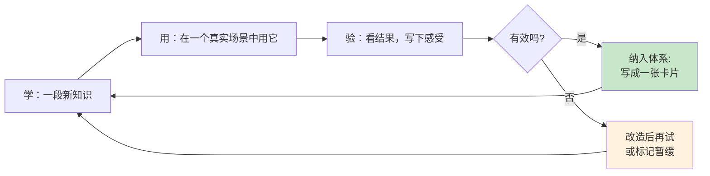

# 3.6 学习方法论沉淀

#### 目录介绍
- [01.看一个真实案例](#01看一个真实案例)
- [02.断点自测三问](#02断点自测三问)
- [03.三步学习法规划](#03三步学习法规划)
- [04.极简学习法实践](#04极简学习法实践)
- [05.费曼学习法输出](#05费曼学习法输出)
- [06.能力划分四层次](#06能力划分四层次)
- [07.方法沉淀成体系](#07方法沉淀成体系)
- [08.后来发生的改变](#08后来发生的改变)
- [09.今天起改变三点](#09今天起改变三点)
- [10.课后作业思考下](#10课后作业思考下)

## 01.看一个真实案例

那年我第一次拿到年终奖，做的第一件事是：**报了 5 门付费课程**：算法、操作系统、Kotlin、Flutter、英语口语。

第一周我兴致勃勃，每个 App 都打开看 10 分钟。第二周开始挑顺眼的看。第三周开始觉得「今天不想看了」。第三个月后我打开某个学习 App，发现它给我推送了：

> 「**您已 87 天未学习**，您的算法课进度还停留在 3%。」

我盯着那个 3%，恍惚了一下：付出去 1300 块，**剩下的 97% 是给空气听的**。

更扎心的是，那一年我做晋升答辩，被评委问：「你今年的核心成长是什么？」我张口就是：「我学了算法、操作系统、Kotlin、Flutter……」评委打断我：「**你能不能挑一个，深聊一下？**」

我哪个都聊不深。**那一刻，「什么都学」变成了「什么都没学会」**。

答辩结束我去找了我的导师，把「学了 5 门一无所成」的事讲给他听。他听完想了一下，说了一句话我记到现在：

> 「**学习是个手艺活儿**。手艺人不会同时学 5 门手艺，他会**先把「怎么学手艺」这件事本身搞明白**，然后挑一门，按方法学透。」

他随手在本子上写了三个名字：**三步学习法、极简学习法、费曼学习法**。然后说：「这三套，你先理解透。它们不是学具体知识的，**是教你怎么学「学」这件事**：叫「方法论」。」

那是我第一次听到「方法论沉淀」这四个字。后来这三套方法被我反复打磨，最终成了我每学一个新东西的「标准工具箱」。下面这套 **三步法 + 极简法 + 费曼法**，就是从那个晚上开始一点一点用出来、最终救我于「低水平重复学习」的方法。

## 02.断点自测三问

在往下读之前，先做三道判断题。任意一题命中，这一节就值得你认真读完。

| 断点 | 自测题 | 症状描述 |
|:----:|:------|:--------|
| 铺得太广 | 你手头「同时在学」的东西超过 3 项吗？三个月过去，几项真正推进了？ | 贪多嚼不烂：一样没学透 |
| 没有闭环 | 学一样东西，你从「定目标」到「输出成果」全流程走完过吗？超过一半的东西都是半截活儿？ | 三缺一：目标 / 实践 / 输出总断链 |
| 术语拐棍 | 你最熟的知识点，脱稿用大白话讲给外行，能撑 5 分钟吗？做不到？ | 假懂：说得出术语，讲不出道理 |

三道题依次对应本节的三条主线：**极简法砍冗余、三步法建闭环、费曼法验真懂**。你在哪一条上薄，就重点看那一段。

## 03.三步学习法规划

翻阅了一本经典老书《软技能：代码之外的生存指南》，相信不少技术人都看过。很多技术类书籍可能会因为技术的更新换代而过时，这本书更多聚焦在了职业发展、个人影响力、学习成长、生产力提升、理财、健身、精神健康等领域，基本概括了程序员学习成长所需的所有「软技能」。

书的作者是约翰·森梅兹，他关于如何快速学习的方法非常值得推荐。每个技术人都面临着技术更新迭代的巨大压力，需要快速学习新技术、新的编程语言、新的框架和其他能力。经过一系列实践、反思和归纳之后，他总结了一套可重复使用的自学体系，也就是他在书中推荐的「三步学习法」。

**三步学习法的核心价值在于「可重复使用」**。无论你学什么：一门编程语言、一个框架、一项管理技能，都可以套用这同一套流程。它就像一个万能模板，帮你把「不知道怎么学」变成「按步骤来就行」。

| 步骤 | 关键动作 | 说明 |
|:----|:----|:----|
| **① 制定目标** | 了解全局 | 浏览目录和介绍章节，建立整体认知框架 |
| | 确定范围 | 明确要学什么，避免贪多嚼不烂 |
| | 定义目标 | 设定可量化的目标，没有歧义、容易评估 |
| | 寻找资源 | 多渠道收集学习材料，书籍、课程、源码、人脉都算 |
| | 创建学习计划 | 规划学习路径，参考他人经验少走弯路 |
| **② 实践学习** | 筛选资源 | 挑出最有价值的几个，别急着消化所有资料 |
| | 开始学习 | 先获取能够动手实践的信息，循序渐进 |
| | 动手操作 | 边看边实践，在动手中产生问题、解决问题 |
| **③ 运用输出** | 学以致用 | 用之前收集的资料解决实践中的问题 |
| | 带着问题思考 | 把学习内容和最终目标关联起来 |
| | 教学相长 | 学完了并教会别人是最好的巩固方式 |

## 04.极简学习法实践

在当今知识爆炸的时代，我们每天都在接触大量的信息，而学习方法的优化则成为提高学习效率的关键。

**极简学习法作为一种高效的学习方法，通过精简资源、时间和学习材料，帮助我们更专注于最重要的概念和技能，从而实现用最小的投入获取最大的学习收益**。

极简学习法主张在学习过程中剔除不必要的信息和活动，只关注核心知识和技能。它有三大优势：

- **减少干扰**：有效减少学习过程中的干扰和冗余信息，让人更加专注于核心内容；
- **提高效率**：通过精简学习材料，能更快地掌握核心知识；
- **培养专注力**：有助于培养专注力和思维能力，更深入地理解和应用所学。

极简学习法的三段执行流程：

| 阶段 | 关键要点 |
|:----|:----|
| **精准输入** | 选权威渠道 + 保持专注姿态，确保信息准确可靠 |
| **深度消化** | 反复思考 + 举例说明 + 实际应用，把知识内化 |
| **多元输出** | 口头表达、书面表达、实践应用、创新应用四种方式并用 |

多元输出的四种方式各有价值：**口头表达**锻炼沟通能力和表达能力；**书面表达**整理思路、加深理解；**实践应用**将所学应用到实际生活中；**创新应用**发挥创造力，将所学进行拓展。

## 05.费曼学习法输出

很多人在学习时常常会走弯路，找不到适合自己的学习方法，难以得到快速提高。如果你也苦于不知用哪种学习方法的话，可以尝试采用著名的「费曼学习法」。

该方法由 1965 年诺贝尔物理奖得主理查德·费曼（Richard Feynman）提出，可以帮助你快速学习。理查德·费曼号称是继爱因斯坦之后最聪明的人，他的这套方法曾被无数学习牛人奉为「最佳学习方法」。

**费曼学习法就是一个操作简单，并且具有普适性的方法，它只有四个步骤**：

| 步骤 | 做什么 | 关键点 |
|:----:|:----|:----|
| **① 假装讲给孩子听** | 在白纸上写下想学的知识点，假装讲给一个 12 岁孩子听 | 强迫自己用简单词汇，不许用专业术语 |
| **② 复习卡住的地方** | 讲的过程中忘掉的、说不清的，就是你的知识空白 | 针对空白点回去补课，直到能用大白话讲清楚 |
| **③ 整理并简化笔记** | 用自己的理解写笔记，不摘抄专业术语 | 反复练习，直到读起来简洁流畅 |
| **④ 讲给别人听至懂** | 找一个不懂这个知识点的人（或想象一个 12 岁小孩），把它讲清楚 | 对方能理解 = 你真正掌握了 |

**通常，我们会使用复杂的词汇和专业术语来掩饰自身的理解不足，这也是在自欺欺人**。当你给 12 岁的孩子讲一个知识点时，就不能再用这些复杂词汇和专业术语。你需要强迫自己进一步理解这个知识点，并且简化它，确保孩子可以听得懂。

**当你能不用术语，只用大白话解释清楚时，你就真正理解了这个知识点**。如果跳过第二步（复习卡住的地方），你会很容易出现「知识幻觉」，高估自己对知识的掌握程度。

「费曼学习法」的四个步骤很简单，也很容易实践，但要想发挥这套方法的最大效用，你需要精进自己的类比、联想能力，面对庞大复杂的概念，能用简单的语言解释出来。费曼本人就很擅长这一点，他能用直白浅显的语言解释量子力学等复杂深奥的话题，因此他也被誉为「伟大的讲解员」。

> **真正的学习不是装满脑子，而是清空脑子里的术语，然后用大白话把一件事讲明白**：这就是费曼说的「如果你不能简单地解释，说明你没真懂」。

三条你应该带走的原则：

**① 三步法是骨架**：制定目标 → 实践学习 → 运用输出，缺一段就会「虎头蛇尾」。

**② 极简法是过滤器**：不是所有东西都值得学，**敢于砍掉 80% 的资料**，把精力留给那 20% 的核心。

**③ 费曼法是验机仪**：每学完一个知识点，强迫自己用大白话讲一遍，**讲不通就是没学懂**。

## 06.能力划分四层次

学会了方法，是不是就能自动变成高手？并不是。**方法只解决「怎么学」，还不解决「学到什么程度」**。要判断自己的成长阶段，可以对照一份四层能力梯度：

| 层次 | 特征 | 典型表现 |
|:----:|:----|:----|
| **第一层：资源** | 知识、技能、经验、人脉 | 「学过 Java、写过 SQL」 |
| **第二层：应用流程** | 能解决问题、有做事方法 | 「能独立排查线上故障」 |
| **第三层：价值观念** | 能取舍、会判断优先级 | 「知道哪个需求该拒绝」 |
| **第四层：规划蓝图** | 有清晰的方向与节奏 | 「有 3 年职业主线」 |

大多数人一辈子卡在第一层：**知道很多但用不出来**，像神仙姐姐王语嫣一样，武林秘籍倒背如流却一招也打不出。真正的成长节奏是：

- **先用三步法**夯实第一层的「资源」；
- **再用极简法**逼自己爬到第二层的「应用」；
- **最后靠费曼法**向别人讲清自己所学，才能触及第三层的「判断」和第四层的「蓝图」。

**方法是阶梯，层次是位置**：一定要看清自己站在哪一层，下一步该往哪里迈。

## 07.方法沉淀成体系

三步法、极简法、费曼法都是好方法。但方法只是「零件」，不是「体系」。**零件想变成体系，中间只差一个动作：把每次用过的方法记下来、连起来、复用起来**。

我的做法很简单，叫做「**学 - 用 - 验**」闭环：

具体只做三件事：

1. **每学一个方法，一周内必须用一次**：不用就等于没学。
2. **用完写一张卡片**：`问题 → 我的理解 → 一个真实场景 → 下次怎么用`。四段式，不要长。
3. **每月看一次卡片墙**：把关联的卡连一根线，一个月连一次，一年下来你会看到自己的「方法论地图」从散点长成网。

工具用什么都可以：Notion、飞书、Obsidian、语雀、印象笔记，甚至纸质笔记本。**工具只是容器，四段式卡片才是内容**。

那些不写卡片、不连线的人，学得再多也只是「信息坟场」；肯做这三件事的人，方法就会开始为他产生复利：**这就是「方法」跨越到「体系」的分水岭**。

## 08.后来发生的改变

被导师点醒后那个周末，我打开 5 门课的进度页，深吸一口气**取消了 4 门退款**，只留下「算法」。然后用三步法重新规划：

- **第一步（目标）**：3 个月内能在 LeetCode 中等难度题目里独立通过 80%；
- **第二步（实践）**：每天 1 道题 + 周末 5 道题，每道题写「题解 + 复盘」；
- **第三步（输出）**：每月写一篇「本月算法 5 大坑」内部博客。

那一刻我感到一种奇怪的「踏实」：**少了 4 个目标，反而第一次知道自己「今天要干什么」**。

按极简法清理学习材料后，我把书架上 12 本「算法相关」的书砍到 2 本（《算法导论》当字典 + 《剑指 offer》当训练手册），订阅的 9 个公众号砍到 2 个。结果是每周节省**约 8 小时**「看资料」的时间；每周多出**约 5 道题**的实做量；学习焦虑感**直线下降**：以前总觉得「还有好多没看」，现在总觉得「今天我又解了一道」。

半年后我做转岗答辩，开口就是：「今年我没学很多，**只学了一件事：算法**。」然后我用费曼法的方式现场讲了一道题：「**请用一根橡皮筋解释 KMP 算法的 next 数组**。」讲完评委笑了：「这个比喻第一次听到，但完全说服我了。」

那场答辩拿到了 A：这是我从业以来最高一次评级。**而中间 6 个月里我做的所有事，归根结底就是三件：一套三步法、一把极简法的剪刀、一个费曼法的「假想 12 岁小孩」**。那一刻我才真正理解导师说的那句话：**「学习是个手艺活儿。」**

## 09.今天起改变三点

**第一，用三步法学一个技能**。今天就选一个你想要掌握的新技能，按照三步学习法来执行：**第一步制定清晰的学习目标**（学到什么程度、用多长时间）；**第二步搜集和筛选学习资源**（书籍、课程、文档）；**第三步通过实践来检验和巩固**（做项目、写文章、解决问题）。**不要跳过任何一步**。

**第二，用极简法优化学习**。审视你当前的学习计划，去掉一切不必要的环节：不需要的资料、重复的内容、低效的学习方式。**只保留最核心、最高效的部分**。记住，学习的目的不是消耗时间，而是获得能力。**少即是多，精简才能深入**。

**第三，用费曼法检验理解**。选择你认为自己已经掌握的一个知识点，**不用任何参考资料**，用最简单的语言把它写在一张白纸上。如果写不出来或写不清楚，说明你还没有真正理解。回去重新学习那些写不清楚的部分，再次检验，直到能用大白话流畅地解释为止。

## 10.课后作业思考下

**自检类**：

1. **极简学习审计**：列出你当前正在学习的所有内容（包括订阅的课程、在看的书、关注的公众号等），逐一评估它们的价值：真正有用的保留，可有可无的果断删除。目标是把学习清单精简到不超过 5 项，集中精力攻克最重要的。

2. **费曼学习法深度测试**：选 3 个你工作中常用的核心概念，分别用费曼学习法测试自己的理解深度。标准是：能否在 5 分钟内，不用任何术语，让一个 12 岁的孩子理解这个概念。做不到的就回去补课，做到的说明你真正掌握了。

**实践类**：

3. **三步学习法完整实践**：选一个你一直想学但没开始的技能（比如一门新语言、一个新框架），用三步学习法从零开始学习。第一周完成目标制定和资源搜集，第二周开始学习，第三周通过实践检验。三周后评估效果，这套方法是否帮你提高了学习效率？

4. **方法论组合设计**：结合三步学习法、极简学习法和费曼学习法，为你未来 3 个月的学习设计一套完整的方法论体系。包括：目标设定（三步法）→ 资源精简（极简法）→ 学习实践 → 理解检验（费曼法）→ 输出分享。画出流程图并开始执行。

**体系类**：

5. **卡片启动**：挑一个你在第一层「知道但没用过」的方法，把它推进到第二层「用过一次」，并写出一张四段式卡片（问题 → 我的理解 → 一个真实场景 → 下次怎么用）。发到自己的 Notion 或朋友圈，看看有没有人回应你：**这就是你把「零件」变成「体系」的第一块砖**。

---

> 📎 下一站 ｜ 学习方法沉淀好了，接下来要把它对准「目标」。不过先别急着去用：所有的学习方法，都会遇到同一个敌人：遗忘。下一节我们就来讲，怎么用间隔重复和检索练习，把学到的方法焊死在脑子里。
