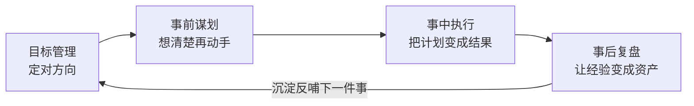

# 开篇 为什么道理都懂，却依然做不成事

#### 目录介绍
- [01.一个扎心的场景](#01一个扎心的场景)
- [02.问题到底出在哪](#02问题到底出在哪)
- [03.这本书解决什么问题](#03这本书解决什么问题)
- [04.这本书写给谁看](#04这本书写给谁看)
- [05.这本书该怎么用](#05这本书该怎么用)
- [06.做得到之后呢](#06做得到之后呢)

## 01.一个扎心的场景

先讲我的一段真实经历。

那一年我给自己定的年度目标是「带团队完成平台重构」。年初立项的时候，我信心十足：目标清晰、方案完整、团队齐心。我是这么规划的：

- Q1 完成架构设计，Q2 完成核心模块，Q3 联调切换，Q4 收尾
- 每个里程碑都排了负责人和时间点
- 周会同步进度，风险及时上报

听起来无懈可击，对吧？

年底的真实结局是：Q1 的架构设计评审了三轮才通过，进度直接拖掉一个月；Q2 核心模块做到一半，发现依赖的另一个团队排期根本对不上；Q3 勉强联调，切流当晚出了事故，通宵回滚；Q4 干的事是给 Q3 擦屁股。**重构最终完成了，但比计划晚了整整一个季度，团队透支，我自己在年终复盘会上被问得哑口无言。**

复盘会上，领导问了我一个问题，我至今记得：

> 「你年初的规划里，哪一条是『计划本身』的问题？你有没有想过，不是执行拖了计划，是计划从头就不成立？」

我愣住了。我所有的复盘都在追究「哪个环节慢了」「谁的锅」，从来没有质疑过计划本身。更扎心的是领导补的那句：

> 「你在架构设计上花了三周，在『谋划这件事怎么做』上，花了几个小时？」

答案是三个小时。**一件要做一年的事，我只谋划了三个小时，然后用了十二个月去承担这个三小时的后果。**

## 02.问题到底出在哪

那次复盘之后，我花了很长时间想一个问题：我读书不少，方法论也不陌生（OKR、PDCA、复盘，个个都能讲），**为什么事情还是做不成？**

后来我逐渐看清了真相：**「懂道理」和「做成事」之间，隔着一条完整的做事链路，而这条链路上，每一段都有专门的方法**。任何一段缺方法，事就会在那里断掉：

| 断在哪 | 具体表现 | 后果 |
|--------|---------|------|
| **目标不成立** | 目标拍脑袋、拆解想当然、计划没有落地策略 | 方向错了，执行越努力偏得越远 |
| **事前没谋划** | 不做分析就动手、方案只有一套、责任没人认领 | 开工即返工，出事没人管 |
| **事中会失控** | 执行无节奏、问题来了瞎应对、汇报讲不清 | 计划和现实两张皮，年底靠奇迹 |
| **事后不复盘** | 做完就翻篇、经验留在个人脑子里、教训无人沉淀 | 同一个坑，团队换着姿势再踩一遍 |

这四段，就是我那次重构翻车的完整解剖：目标定得太乐观（第一段）、三个小时的谋划（第二段）、切流事故没有预案（第三段）、以及年年翻车年年不复盘（第四段）。

**道理都懂却做不成事，不是执行力问题，是链路问题。** 你缺的不是「知道 OKR 是什么」，而是「拿到一个目标，怎么一步步把它拆成可执行的计划」「方案评审前，怎么把问题想在前面」「出了事故，怎么五步处置而不是当场懵住」。

这些「怎么」，市面上很少有人系统的讲。这就是本书要做的事。

## 03.这本书解决什么问题

这套书一共三册，贯穿语是「**学得会，做得到，说得清**」。本册负责第二环：**做得到**。

它不是一本讲「执行力很重要」的励志书，而是一个**可以直接照着用的做事工具箱**：围绕「事前 → 事中 → 事后」的完整链路，提供 25 个方法，每个方法都配真实场景、操作步骤和常见坑。

四章和四种「断点」的对应关系：

| 章节 | 解决的问题 | 方法数 |
|------|-----------|--------|
| 第 1 章 目标管理 | 目标怎么定才成立、计划怎么落地 | 5 个 |
| 第 2 章 事前谋划 | 动手前怎么分析、方案怎么设计、责任怎么分 | 9 个 |
| 第 3 章 事中执行 | 执行怎么有节奏、问题怎么处理、进展怎么汇报 | 8 个 |
| 第 4 章 事后复盘 | 做完怎么沉淀、经验怎么留给团队 | 3 个 |

从「定目标」开始，到「想清楚」「做出来」，最后「沉淀下来」，**这是一条完整的做事闭环，任何一环缺方法，事情就会在那里断掉。**

## 04.这本书写给谁看

如果你符合下面任何一条，这本书就是写给你的：

- 目标年年定、年年完不成，开始怀疑自己「执行力差」，**其实差的是目标管理的方法**
- 接到任务就开干，干到一半才发现方向不对，**缺的是事前谋划的习惯**
- 执行全靠蛮力，问题一来手忙脚乱，汇报的时候讲不出重点，**缺的是执行和表达的工具**
- 事情做完就翻篇，团队在同一个坑里摔第三次，**缺的是复盘的机制**
- 刚开始带团队，发现「自己干」和「带人干」完全是两回事，**这 25 个方法，就是你要教给团队的东西**

**不需要你有管理头衔，也不需要你带多大的项目**。书里所有方法，最早都是我用在一个个具体的小事上磨出来的，一次汇报、一次方案评审、一次线上故障。方法的适用范围，从「给自己定一个学习计划」到「带团队做一个年度项目」。

## 05.这本书该怎么用

这本书的用法和上一册不同。上一册讲学习，建议从头读到尾；这一册是工具箱，**推荐两种用法叠加**：

**第一种：先通读一遍，知道每个工具是干嘛的（1-2 周）**。就像新工具到了先翻一遍说明书，不求记住细节，但求知道「书架上有这把扳手」。以后遇到对应的场景，你知道回来翻哪一章。25 个方法的目录，就是你的「故障排查索引」。

**第二种：遇到真实场景时，回来查对应的那一节，边用边读**。这周要定季度目标？翻第 1 章，用「SMART + 目标分解」跑一遍。明天要过方案评审？翻第 2 章，用「SWOT + MECE + 三种方案设计法」把评审委员可能问的问题提前想一遍。出了线上事故？翻第 3 章，「五步问题处理法 + 五问根因」直接照着走。

**每个方法都用过一次之后，这本书才算真正属于你**。那时你大概会发现，有五六个方法已经内化成了本能，剩下的留在书架上备查。这就是工具箱最好的归宿。

## 06.做得到之后呢

这本册子解决的是「做得到」。但做成事之后，还有一个问题在等着你：**你的能力，别人看得见吗？**

我见过太多靠谱的人，活干得漂亮，却在述职汇报上讲得稀碎；项目做得最好，功劳却记在了会表达的人头上。领导不是不想看见你，是你没给他看见你的机会。

**做得好，是里子；说得清，是让人看见里子的方式**。汇报、沟通、演讲、还有表达背后的思维地基，那是下一册《自我精进·立言》要讲的内容。

道理都懂之后，先把事做成；事做成之后，再让价值被看见。

---

> 下一篇：[第 1 章 目标管理](./01.以结果导向计划.md)
