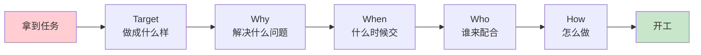

# 1.1 以结果导向计划

#### 目录介绍
- [01.看一个真实案例](#01看一个真实案例)
- [02.断点自测三问](#02断点自测三问)
- [03.我那时该如何做](#03我那时该如何做)
- [04.要以结果为导向](#04要以结果为导向)
- [05.定目标明确目标](#05定目标明确目标)
- [06.定计划分解目标](#06定计划分解目标)
- [07.定执行落地策略](#07定执行落地策略)
- [08.定结果检查改进](#08定结果检查改进)
- [09.定责任推动奖惩](#09定责任推动奖惩)
- [10.这几个坑我踩过](#10这几个坑我踩过)
- [11.总结回顾本章节](#11总结回顾本章节)
- [12.后来发生的改变](#12后来发生的改变)
- [13.今天起改变三点](#13今天起改变三点)
- [14.课后作业思考下](#14课后作业思考下)

## 01.看一个真实案例

我刚从校园进公司做运营数据分析师那年，直属领导扔给我一个项目：一个月后要把这件事的结果做出来，部门大领导那时候要听我汇报。

我兴冲冲地拿到了数据源，一通操作：清洗、汇总、归因、画图，把当月所有的数算了个平均值，「嗯，差不多就这样了」，周五下班前，我加了一会儿班，就把整理好的结果直接 @ 总监发到了工作大群里。

那时候心里还挺得意的：第一次拿到这么重要的项目就被我搞定了，下周一总监肯定会夸我。

结果周一总监把我叫到办公室，第一句话就是：「你这数据该怎么看？有对照吗？算这个数据的逻辑是什么？拿什么做参照？这些策略规则的价值点和意义是什么？」

我一句也答不上来。我只是把数据「算出来」了，却根本没想过它要「说明什么」。

总监前前后后训了我一个小时，重点不是骂我马虎，而是骂我**没有结果思维**：只想着「做出来」，没想清楚「做出来要解决什么问题、对谁有价值、按什么标准算成功」。

那一个小时，我才意识到：原来过去我做的所有努力，都缺了最关键的第一步，**先把「什么算成功」想清楚再开始干**。如果我当时按计划管理的方式去做这个项目，结果会完全不一样。

## 02.断点自测三问

在往下读之前，先做三道判断题。任意一题命中，这一节就值得你认真读完。

| 断点 | 自测题 | 症状描述 |
|:----:|:------|:--------|
| 无验收标准 | 你上一次交付一个报告 / 一个功能 / 一个方案，事前有没有和需求方对齐「什么算做完」？ | 埋头苦干、交付即返工 |
| 无参照系 | 你算出的每一个数字，有没有一个可比的基线（同比、环比、对照组）？ | 结果没有意义、说不清价值 |
| 无里程碑 | 你手上要做一个月的事，中间有没有拆出 2 至 3 个「早晚点」交给自己检查？ | 到 Deadline 才发现方向偏了 |

三道题依次对应本节的三条主线：**先定义「完成」再动手、给结果找一个参照系、用里程碑代替 Deadline**。你在哪一条上薄，就重点看那一段。

## 03.我那时该如何做

回过头看，我最该做的第一件事，是在拿到需求的当天就去找需求方坐下来聊：你这次到底要解决什么问题？目标合不合理？业务场景是什么？衡量好坏的标准是什么？

不要怕显得「问得多很菜」，恰恰相反，**问得清楚的人才是真正负责任的人**。

第二步，是按这个项目类型应有的分析套路来：先观察现有数据特征，要不要加对照组？历史同比 / 环比的基准在哪？拿历史水平做参照，再做筛选和判断。

第三步，是预估自己干这事大概要多久，遇到哪些拿不到的资源要协调谁，及时跟领导对齐节奏：什么时候出第一版、什么时候出最终版、中间要不要约个 30 分钟对一下方向。

第四步，是想清楚结果用什么方式呈现：表格、PPT 还是思维导图？给谁看？看完之后他要做什么决策？

最后一步，也是当年的我完全没想过的：**这些数字最终要回答什么问题、能反馈出这次项目的什么效果、能推动什么策略调整？这些都得提前在脑子里想一遍**。

如果当年我在动手之前先把这五步想清楚，总监那天就不会训我一小时，而是会拍我肩膀说「做得不错」。

## 04.要以结果为导向

我后来反复琢磨那次被训的经历，得出一句话：**没有计划的努力，本质上是在赌运气**。

做计划的目的，是先明确目标，再评估手里的资源和当前情况，然后定方案，最后才能换来工作效率和质量的提升。它不是给领导看的形式，而是给自己确认方向的镜子。

从目标设定、计划制定、执行、检查、结果确认、责任明确、奖惩机制这一整套体系下来，才能构建起以结果为导向的执行力。

动手前先回答五个核心问题：

**Target 目标**：做这件事的目标 / 目的是什么？**Why 为什么**：为什么要做这件事？痛点是什么？**When 什么时候**：花多久时间去做？排期多久？**Who 谁来做**：需要谁来配合？跨不跨部门？**How 怎么做**：技术方案 / 解决方案是什么？

**小到一个简单需求多问几个为什么，大到复杂项目可以科学规划：把控进度和节奏，能给领导做及时的正向反馈，也能让需要配合的同事心里有数自己要做什么**。这五个问题，就是当年总监希望我在动手前问自己的全部问题。

## 05.定目标明确目标

以目标为导向，是一种把「行动」和「决策」绑定到「明确目标」上的方法。它的核心是：**确保所有努力都朝着一个预定方向前进**，而不是各做各的、各使各的劲。

我现在做项目的第一件事，就是先在白纸上写一句话：「这个项目结束之后，世界上多了什么？少了什么？」答不出来这句话，我就不会动手。

一个好目标要过五道关：**具体化**（避免模糊表述，明确要实现的结果，比如把「提高销售」写成「增加销售额 10%」）；**可衡量**（使用具体指标或度量标准，比如用销售额、满意度数据来衡量）；**可实现**（与能力和资源相匹配，考虑实际情况让目标合理可行）；**有时限**（设定明确的截止日期，帮助保持紧迫感和动力）；**写下来**（放在可见的地方，让目标更加具体和真实）。

我以前一直觉得「写不写下来不重要，反正我心里有数」。后来我发现：**没写下来的目标，3 天之内一定会变形**。要么自己悄悄降低标准，要么忘了里面某个关键约束，要么干着干着跑偏了还浑然不觉。所以现在我习惯把目标写在便利贴上贴在显示器边框，或者钉在飞书文档置顶：天天看见，就天天提醒自己别走偏。

## 06.定计划分解目标

明确了目标之后，需要把目标分解成具体的任务，并制定相应的计划。计划要具有可行性、可操作性和可评估性。确保每个任务都有明确的责任人、完成时间和质量要求，同时保留灵活性以应对可能出现的变化。

有了具体的计划，但经常还是一年过去，发现实际和计划相比总是有差距。这是普遍现象：统计数字表明，在年初制定了计划的人中，只有 8% 实现了这些计划。对于计划的估计总是过于乐观，乐观地期待「惊喜」，然后又「惊吓」地接受现实。

怎么让计划更具可行性？分五步走：

| 步骤 | 关键动作 | 常见坑 |
|:----:|:----|:----|
| 1 确定主要目标 | 明确主次，主目标必须 SMART | 主次不分、想同时做 5 件事 |
| 2 识别关键要素 | 找出实现主目标必需的关键任务 | 抓了非关键路径的枝节 |
| 3 划分为子目标 | 拆成可衡量、可实现的小目标 | 拆得太粗（月粒度）或太细（小时粒度）|
| 4 确定里程碑 | 每个子目标定明确的检查节点 | 只盯 Deadline，中间不检查 |
| 5 制定行动计划 | 明确行动步骤、资源与时间 | 计划有目标没动作，无法照着做 |

**关键在于第 4 步**。里程碑不是形式，是给自己「早晚点」的检查机制：**没有中间检查点的计划，本质上就是把风险全押给 Deadline**。

## 07.定执行落地策略

执行是计划得以实现的关键环节。需要将计划细化到每个岗位、每个员工，确保人人有事干、事事有人干。在执行过程中，要注重沟通协调，同时不断推动 PDCA 循环（计划-执行-检查-处理），通过持续改进来提高执行力（PDCA 详见 3.1）。

**很多计划之所以执行不下去，根本原因不是计划不好，而是缺少「检查-改进」的循环机制**。执行不是「一锤子买卖」，而是一个螺旋式上升的过程：每一轮 PDCA 循环结束后，把经验和教训带入下一轮，执行质量就会越来越高。

再好的计划如果没有沟通，也会在执行过程中变形走样。执行中最常见的三个沟通问题：**信息不对称**（A 部门不知道 B 部门在做什么，导致重复劳动或遗漏，解决办法是每日站会 + 每周进度邮件）；**理解有偏差**（同一句话不同人理解不同，解决办法是每次布置任务后让执行人复述一遍）；**反馈不及时**（遇到问题不上报，等到截止日才暴露，解决办法是设定「风险预警线」，进度落后超过 20% 时必须立刻上报）。

## 08.定结果检查改进

检查是确保执行效果的重要手段。需要在执行过程中设置检查点，对任务完成情况进行定期或不定期的检查，及时发现并纠正问题，确保任务按照既定计划进行。

结果的确认是执行过程的最后环节。对执行结果进行认真评估和总结，明确哪些做得好、哪些需要改进。**对于好的结果要给予表彰和奖励，以激发积极性和创造力；对于不好的结果则要深入分析原因，找出问题所在，并制定相应的改进措施**。

## 09.定责任推动奖惩

在执行过程中，责任要明确到人。每个人都要清楚自己的职责和任务，确保在执行过程中能够承担起相应的责任。**「人人有责」往往等于「无人负责」，所以每一项任务都必须落实到具体的一个人身上，而不是「大家一起负责」**（责任分配详见 2.9 RACI 矩阵）。

奖惩机制要遵循三个关键原则：**及时性**（奖惩要在行为发生后尽快执行，常见误区是拖到季度末才统一奖惩、失去激励效果）；**对等性**（奖惩力度与贡献或过失相匹配，常见误区是干多干少一个样、挫伤积极性）；**公开性**（让所有人知道奖惩的标准和结果，常见误区是暗箱操作、导致团队不信任）。

责任和奖惩的最终目的不是「管住人」，而是「激发人」。好的责任机制应该形成一个正向循环：**明确的责任让人知道该做什么，合理的奖惩让人愿意做好，做好之后获得的认可又进一步激发更大的积极性**。

**如果你发现团队中有人不愿意承担责任，先别急着批评，而是反思：是不是责任不清晰？是不是奖惩不公平？是不是承担责任的人反而吃亏了？** 很多时候，不是人不行，而是机制有问题。修正机制，远比批评个人更有效。

## 10.这几个坑我踩过

**坑一：只报进度不报风险**。当年那个数据项目，我每周都跟总监同步「已经处理了多少数据」，但只字不提「我完全不知道这些数字要说明什么」。因为**报进度显得在干活，报风险显得没能力**。后来我强制自己每次同步进度必带一条「当前最不确定的一件事」，风险就再也不会累积到爆的那天。

**坑二：把「细化」当「计划」**。我曾经花两天时间把项目拆到 200 个任务点，看起来井井有条，结果第一周就跑不下去了：因为**拆得再细，不改变「资源不足」这个事实**。后来我学会先做一版**粗颗粒版**（大 10 个里程碑），跑通两周再决定要不要细化。

**坑三：责任分给「大家」**。有一次跨部门项目，我在 kick-off 会上说「这块儿大家一起兜」，结果三周后发现没人动。**「大家」等于「没有人」**。从那以后每个任务后面必须写一个具体名字，不允许「协助方 X 团队」这种糊涂账。

## 11.总结回顾本章节

**先把「做成什么样算成功」想清楚再动手，比埋头苦干更接近真正的努力**。

你应该带走三件事：

1. **结果导向 = 先定义「完成」再开始「做」**：动手前必须能回答 Target / Why / When / Who / How 五个问题，否则就是在赌运气。
2. **目标必须 SMART 而且要写下来**：没写下来的目标 3 天之内一定会变形，不可量化的目标不可能被检查。
3. **执行 ≠ 一次干完，而是 PDCA 循环**：每周对照计划做一次检查、调整、再出发，质量才会螺旋上升。

## 12.后来发生的改变

**1. 一张自检清单，救了后面所有项目**。被训之后那个周一晚上，我把总监问的所有问题做成了一张「开工前自检清单」贴在显示器边上：目标是什么、对照在哪、衡量标准是什么、汇报对象想看到什么、最终决策是什么。那一周我手里另一个小项目，按这张清单走了一遍，光「问需求方」就多花了 40 分钟，但产出报告时心里第一次有了底：**我知道每一个数字是用来回答哪个问题的**。

**2. 一个月后，第一次被公开表扬**。一个月后，部门有个关于活动效果归因的项目又落到我头上。我按「5W + 对照 + 里程碑」的思路，第一周就把目标、衡量口径、对照组、汇报形式跟总监对齐了一遍，第二、第三周按里程碑往前推，第四周复盘交付。汇报当天，大领导问的所有问题我都答得上来。**会后总监在大群里 @ 了我一句「这次思路非常清晰」，这是我入职以来第一次被公开表扬，比涨薪还开心**。

**3. 半年后成了组里的「项目第一作者」**。半年之后我成了组里默认的「项目第一作者」，新人入职被分配跟着我做项目。我教他们的第一件事不是 SQL，也不是 Excel，而是那张「开工前自检清单」。我也终于理解了当年总监训我那一小时的真正用意：**他不是不满意我那份报告，他是在帮我把「做事的姿势」扳正**。那一小时，可能是我职业生涯里性价比最高的一小时。

## 13.今天起改变三点

**1. 以终为始做规划**。从今天起，做任何事情之前先问自己三个问题：最终要达到什么结果？这个结果该怎么衡量？对照组或参照标准是什么？像文中的我一样，如果只是埋头做事而不思考结果标准，最终必定是返工重做。**先定义「做好」的标准，再开始行动**。

**2. 量化你的目标**。模糊的目标等于没有目标。把「我要变得更好」改成「我要在 3 个月内掌握某项技能并通过认证」；把「提升工作效率」改成「每周完成的有效产出提升 20%」。**量化的目标才能被追踪、被检查、被改进**。

**3. 建立结果检查机制**。每周五花 15 分钟，对照你的目标和计划做一次快速检查：本周计划完成了多少？哪些偏离了轨道？原因是什么？下周该如何调整？不要等到月底才发现目标偏差太大，**及时发现问题才能及时修正**。

## 14.课后作业思考下

1. **结果导向自测**：回顾你最近做的一个项目或任务，当时你有没有明确定义过「成功的标准」？有没有参照和对照？如果没有，用结果导向的思维重新审视这个任务，你应该在开始前定义哪些衡量指标？

2. **目标量化练习**：把你当前最重要的 3 个目标写下来，检查它们是否都是可量化、可检验的。如果有模糊的目标，用 SMART 原则把它们改写成具体、可衡量、有时间限制的版本。

3. **责任矩阵梳理**：如果你正在负责一个团队任务，画一张责任矩阵表：列出每个子任务的负责人、截止时间和验收标准。确保没有任何任务是「没人管」的状态。如果是个人目标，也给自己设定一个「问责机制」（比如每周向朋友汇报进度）。

4. **复盘一个失败案例**：回想一个你没有达到预期结果的经历，用「目标 → 计划 → 执行 → 检查 → 改进」的框架分析，到底在哪个环节出了问题。是目标不清晰？计划不具体？执行不到位？还是缺少检查和改进？从中提炼出一条你以后必须遵守的原则。

---

> **下一站** ｜ 结果导向解决的是「先想清楚再动手」的姿势问题。但姿势对了还不够，你还需要一套让目标真的能落地的**目标管理系统**。下一节我们从「目标怎么定得对」讲起。
