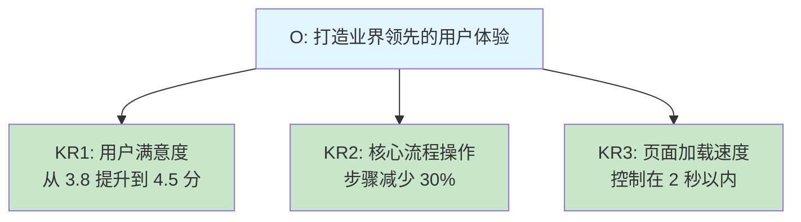

# 2.3 OKR 目标规划法

#### 目录介绍
- [01.看一个真实案例](#01看一个真实案例)
- [02.断点自测三问](#02断点自测三问)
- [03.OKR 方法背景介绍](#03okr-方法背景介绍)
- [04.OKR 核心概念解析](#04okr-核心概念解析)
- [05.OKR 与 KPI 差别对比](#05okr-与-kpi-差别对比)
- [06.如何制定好的 OKR](#06如何制定好的-okr)
- [07.OKR 落地实践方法](#07okr-落地实践方法)
- [08.OKR 常见六大误区](#08okr-常见六大误区)
- [09.这几个坑我踩过](#09这几个坑我踩过)
- [10.总结回顾本章节](#10总结回顾本章节)
- [11.后来发生的改变](#11后来发生的改变)
- [12.今天起改变三点](#12今天起改变三点)
- [13.课后作业思考下](#13课后作业思考下)

## 01.看一个真实案例

我那年刚晋升一档，年初团队拍下来 8 个 KPI 指标，每一个我都死命去抠：日报数提升、文档覆盖率、代码评审通过率、bug 率、迭代延期率…年底盘点的时候，8 个指标全部 100% 达成，按规则我应该拿到 A。

结果绩效面谈那天，Leader 翻了翻表格，问我：**「这 8 个指标都完成了，挺漂亮。但是这一年，我们部门变好了吗？我们做出哪一件让团队真的『不一样』的事？」**

我愣在那里。那 8 个指标我全完成了，可是回头一看，**我做的全部都是「必须做、做了也没人记得」的事**。真正能写进汇报材料、真正能让团队向前走一步的，一件都没有。最后我拿到的不是 A，是 B+。**我低头走出会议室那一刻，眼眶是热的**。

第二周，Leader 约我喝咖啡，给我画了一张图：把 KPI 和 OKR 的差别放在一张白纸上对照。**KPI 关心「考核什么」，OKR 关心「我要把团队带去哪里」**。然后他说了让我记到现在的一句话：

> 「如果你的目标每个季度都能 100% 完成，说明你的目标定得太低了。**真正有价值的目标，应该是让你踮起脚才能够到 70%**」。

那是我第一次知道，原来「完不成」不是一种失败，而是一种健康。后来我开始用 OKR 的方法重新规划自己每个季度的方向。这一节要讲的，就是把那次哭过的教训，变成你可以直接复用的工具。

## 02.断点自测三问

在往下读之前，先做三道判断题。任意一题命中，这一节就值得你认真读完。

| 断点 | 自测题 | 症状描述 |
|:----:|:------|:--------|
| 100% 完成 = 好 | 你的季度目标是不是每次都能 100% 达成？ | 目标定得太低，天花板被自己压平 |
| KR 是任务 | 你写的「关键结果」是「完成 XX 功能」还是「XX 指标从 X 提升到 Y」？ | 把任务当结果，无法验证 |
| 定完就忘 | 你上一次打开 OKR 文档是什么时候？超过一周就命中 | 定完就忘 = 一张废纸 |

三道题依次对应本节的三条主线：**70% 才健康、KR 必须可量化、每周检视**。你在哪一条上薄，就重点看那一段。

## 03.OKR 方法背景介绍

你有没有遇到过这样的困惑：年初定了一大堆 KPI，忙碌了一整年，年底一看：KPI 完成了，但好像并没有真正做出什么有价值的事情。又或者，团队的方向不够聚焦，每个人都在忙，但团队整体的产出却不理想。**这些问题的根源往往在于：目标不够聚焦，关键结果不够清晰，执行过程缺乏对齐**。而 OKR 正是为了解决这些问题而诞生的。

OKR（Objectives and Key Results，目标与关键结果）最早由英特尔前 CEO 安迪·格鲁夫在 1970 年代提出，后来被谷歌联合创始人拉里·佩奇引入谷歌，成为谷歌从几十人到几万人规模扩张过程中核心的管理工具。如今，OKR 已经被全球众多知名企业采用，包括谷歌、Meta、LinkedIn 等。它不仅适用于企业管理，也可以用于个人目标管理。

OKR 的核心理念可以用四个词概括：

| 关键词 | 含义 | 实操 |
|:----|:----|:----|
| **聚焦** | 少即是多 | 每个周期 2 至 5 个 O，不贪多 |
| **对齐** | 上下一致 | 个人 OKR 对齐团队 OKR |
| **透明** | 全员可见 | 所有人都能看到所有 OKR |
| **挑战** | 超越舒适区 | 完成 60% 至 70% 就算成功 |

## 04.OKR 核心概念解析

**O（Objective）是你想要达成的方向性目标**。好的 O 应该具备以下特征：**鼓舞人心**（能够激励你和团队为之努力）；**定性描述**（用文字描述方向，不需要具体数字）；**有时间限制**（通常以季度为周期）；**可执行**（团队可以独立推进，不完全依赖外部）。

例如：「打造业界领先的用户体验」就是一个好的 O，它有方向、有挑战、能鼓舞人心。

**KR（Key Result）是衡量 O 是否达成的具体指标**。好的 KR 应该具备四个特征：可量化（必须有明确的数字）、有挑战性（不能太容易达成）、可验证（到期时能明确判断是否完成）、每个 O 对应 2 至 4 个 KR。

举个例子：

**OKR 常用一套「红黄绿」评分法反映健康度**：完成度 **0 至 30%** 标红色，意味着未取得进展、需要反思；**30% 至 70%** 标黄色，意味着取得进展但未完全达成，落在这个区间就是正常范围；**70% 至 100%** 标绿色，意味着完成或接近完成；**100% 以上**反而要警惕，说明目标可能定得太低。

**注意**：OKR 的评分不直接和绩效挂钩。**如果你的 OKR 每个季度都是 100% 完成，说明你的目标定得不够有挑战性**。

## 05.OKR 与 KPI 差别对比

从七个维度对比 OKR 与 KPI 就能看清差异：

| 维度 | OKR | KPI |
|:----|:----|:----|
| **本质** | 目标管理工具 | 绩效考核工具 |
| **方向** | 自下而上 + 自上而下双向对齐 | 主要自上而下分配 |
| **挑战性** | 鼓励定有挑战的目标 | 倾向于定可完成的目标 |
| **完成标准** | 60% 至 70% 就算成功 | 必须 100% 完成 |
| **与薪酬** | 不直接挂钩 | 直接挂钩 |
| **透明度** | 全员公开 | 通常只对上级可见 |
| **周期** | 以季度为主 | 一般是年度或半年度 |

需要强调的是，**OKR 和 KPI 并不是对立的关系，而是互补的**。OKR 解决的是「做什么」的问题，KPI 解决的是「考核什么」的问题。很多公司同时使用两者。

如果你所在公司已经强 KPI 化，那就把 OKR 当作「个人级别的方向盘」：**KPI 保下限，OKR 拉上限**。每季度自己列 1 至 2 个 OKR，确保你不是只在完成 KPI，而是在朝着真正想去的方向走。

## 06.如何制定好的 OKR

**制定好 O 的三个技巧**：**从痛点出发**（团队当前最大的痛点是什么？用户最不满意的是什么？业务增长的瓶颈在哪里？从痛点出发的 O 最容易获得团队的认同和投入）；**用动词开头**（比如「提升」「打造」「建立」「突破」，而不是「维持」「保持」这类缺乏挑战性的词）；**少即是多**（一个季度最多 5 个 O，推荐 2 至 3 个，**目标太多等于没有目标**）。

**制定好 KR 的四条原则**：**可量化**（「提升用户体验」不是好的 KR，「NPS 评分从 30 提升到 50」才是）；**有挑战性**（如果你 100% 确定能完成，说明 KR 定得太低，好的 KR 应该让你觉得「有把握完成 60% 至 70%」）；**可验证**（到了季度末，必须能明确判断这个 KR 是完成了还是没完成，不能模棱两可）；**有截止时间**（每个 KR 都必须在季度内可以推进并检验）。

**OKR 对齐**。个人 OKR 应该对齐团队 OKR，团队 OKR 应该对齐公司 OKR。**对齐的方式是：上一级的 KR 成为下一级的 O**。举个例子：公司的 O 是「实现业务营收翻倍」，其中一个 KR 是「新用户获取量达到 100 万」。那么负责增长的团队，就可以把「新用户获取量达到 100 万」作为自己的 O，然后拆解出具体的 KR。

## 07.OKR 落地实践方法

OKR 的落地节奏可以分成五个时间节点：

| 时间节点 | 动作 |
|:----|:----|
| 季度初第 1 周 | 全员制定 OKR |
| 季度初第 2 周 | Leader 与成员做对齐和确认 |
| 每周 | 全员做一次 5 分钟的周检视，更新进度 |
| 月中 | 团队做一次月度回顾 |
| 季度末 | 全员完成 OKR 评分与复盘 |

**每周检视 5 分钟**，每周花 5 分钟更新你的 OKR 进度，回答三个问题：本周为推进 OKR 做了什么？当前进度如何？（用红黄绿标记）下周计划做什么来推进 OKR？**这个简单的动作能确保 OKR 不会被日常事务淹没，始终保持在你的视线中**。

**季度末复盘四问**，季度末对每个 KR 打分（0 至 1.0），然后回答四个问题：这个 O 完成了多少？为什么？完成的部分中，哪些经验值得保留？未完成的部分中，根本原因是什么？下季度是否继续这个 O？如何调整？

## 08.OKR 常见六大误区

| 误区 | 后果 |
|:----|:----|
| **当 KPI 用**：完成率 100% 才合格 | 大家只敢定低目标，OKR 失去挑战性 |
| **目标太多**：一个季度 10+ 个 O | 什么都做等于什么都没做 |
| **不做检视**：定完就忘 | OKR 流于形式，变成年终填表 |
| **KR 不可量化**：用虚描述 | 无法衡量是否达成 |
| **不做对齐**：各做各的 | 团队方向不一致，力散在多个方向 |
| **KR 是任务不是结果** | 只看做没做，不看有没有产生价值 |

**误区一：把 OKR 完成率和绩效挂钩**。最常见的误区。一旦挂钩，大家就不敢定有挑战性的目标，OKR 就失去了它最大的价值。

**误区二：定完就束之高阁**。OKR 不是定完就束之高阁的文档，它需要定期检视和更新。**如果你一个季度只在开头定 OKR、结尾打分，中间完全不看，那 OKR 就是一张废纸**。

**误区三：把「任务」写成「KR」**。KR 是结果、不是行动。「完成 APP 改版」是任务，不是 KR；**「APP 改版后用户留存率从 30% 提升到 45%」才是 KR**。区别在于：KR 关注的是「做到什么程度」，而不是「做了什么事」。

## 09.这几个坑我踩过

**坑一：把 KR 写成了 TODO**。第一次写 OKR 时我把「上线 A 功能、完成 B 需求、优化 C 页面」当成 KR 提交上去。Leader 一眼看穿：**「这不是 KR，是排期」**。我才意识到：**KR 是「上线之后世界会有什么变化」，而不是「上线本身」**。改写后我的 KR 变成了「A 功能上线后目标用户渗透率达到 30%」，一下就有了方向感。

**坑二：定完 O 就没管过 KR**。第二个季度我定完 OKR 就把文档收藏进云盘，两个月后打开发现自己都想不起来当时定的 KR 数字是什么。**OKR 不检视 = OKR 不存在**。后来我把 OKR 文档 pin 到工作台首页，每周五强制打开一次。

**坑三：追求「完成」而不敢「挑战」**。有段时间我把 KR 定得都是保守值（60% 就够），生怕完不成不好交代。**结果季度末 100% 全绿，但 Leader 反而给了「B+」，说我目标定得没有野心**。真正的健康态是 KR 有一半以上是「不确定能不能完成」，红黄绿三色都要出现。

## 10.总结回顾本章节

**OKR 不是用来打你绩效的，它是用来逼你思考「哪件事真的值得我做」的工具**。

你应该带走三件事：

1. **O 定方向、KR 定数字，缺一不可**：O 是「去哪里」，KR 是「怎么衡量到没到」，两者互相印证。
2. **完成 60% 至 70% 才说明 OKR 定得健康，100% 是危险信号**：100% 意味着你被自己的天花板压平了。
3. **节奏决定生死：周检视 + 月回顾 + 季复盘**：OKR 真正的力量不在于「定」，而在于「每周看一眼」。

## 11.后来发生的改变

**1. 白板上只写 3 个 O**。那次面谈之后的下一个季度初，我把多年来习惯写的「待办清单」扔掉，强迫自己只在白板上写 3 个 O：**O1 让团队的发布效率显著提升**、**O2 在团队内建立可复用的方案设计能力**、**O3 自己输出一套对外可分享的方法论**。每个 O 下面我配 3 个可量化的 KR，比如「发布耗时从 4 小时缩短到 1 小时」「团队内方案评审通过率从 60% 提升到 90%」。第一次写完的那个晚上我有点不安：这些 KR 看着完全没把握。**但 Leader 看完只说了一句：「这才像 OKR」**。

**2. 每周五 10 分钟锚点**。我给自己设了一条铁律：**每周五下午 17:30，无论多忙，都打开 OKR 文档花 10 分钟**。每个 KR 标红黄绿，写一句「本周做了什么」和「下周打算做什么」。第一个月之后，奇迹的事情发生了：**我不再「年初定完就忘」**。每周五的 10 分钟像锚一样，把我从无穷无尽的临时任务里拽出来，让我重新看清「我这季度到底要去哪里」。后来我自己总结：**OKR 真正的力量不在于「定」，而在于「每周看一眼」**。

**3. 0.7、0.5、0.3 的复盘更值钱**。季度末打分时，O1 我做到了 0.7（发布耗时缩短 70%）、O2 是 0.5、O3 只有 0.3。按 KPI 的眼光这就是一份「不及格」的成绩单，**但按 OKR 的标准，0.7 / 0.5 / 0.3 全部落在健康区间内**，每一个未完成的部分都暴露出真问题。我把这些「未完成的为什么」写成了一份复盘报告，第一次在 Leader 那里听到：「你的复盘比你的成绩更值钱」。**那个季度结束之后，我再也没回到「为了 100% 而把目标拍低」的老路上去**。OKR 真正改变我的，不是让我做更多事，而是让我做更值得做的事。

## 12.今天起改变三点

**1. 用 OKR 制定下季度目标**。用 OKR 的方法制定你下一个季度的个人目标。不要超过 3 个 O，每个 O 下面写 2 至 4 个可量化的 KR。**记住：O 要有挑战性，KR 要可衡量**。写完后问自己：如果这些目标都实现了，我这个季度是否会有显著的进步？

**2. 每周花 5 分钟检视 OKR**。养成每周花 5 分钟检视 OKR 的习惯。每周五花 5 分钟，打开你的 OKR 文档，更新每个 KR 的进度，用红黄绿标记当前状态。**这个简单的动作能确保你始终在朝着正确的方向前进**。

**3. 和团队对齐 OKR**。把你的 OKR 分享给你的 Leader，确认你的目标和团队方向一致。**如果你是 Leader，组织一次团队 OKR 对齐会，确保每个人都清楚团队要往哪里走**。

## 13.课后作业思考下

1. **制定个人 OKR**：用 OKR 的格式，为自己制定下一个季度的个人目标。注意区分 O 和 KR，确保 KR 可以用数字衡量。

2. **KPI 转 OKR**：回顾你当前团队的 KPI，思考哪些可以转化为 OKR 的形式，转化后有什么不同？

3. **推动一个「拖延项」**：找一个你觉得「一直想做但总是没做」的事情，用 OKR 的方式拆解出具体的 KR 和时间节点，看看能否推动你真正行动起来。

4. **引入阻力分析**：如果你的公司还没有使用 OKR，思考一下引入 OKR 可能遇到的阻力和应对策略。

---

> **下一站** ｜ OKR 解决的是「往哪里走」，但每一个具体目标怎么写得清楚、写得能被检查？下一节我们用 **SMART** 原则把「目标」这件事彻底拆干净。
