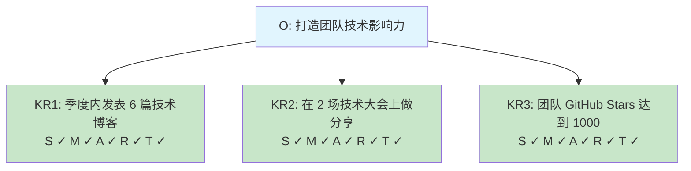

# 2.4 SMART 目标设定

#### 目录介绍
- [01.看一个真实案例](#01看一个真实案例)
- [02.断点自测三问](#02断点自测三问)
- [03.SMART 法的背景介绍](#03smart-法的背景介绍)
- [04.SMART 五个核心要素](#04smart-五个核心要素)
- [05.SMART 案例实战演练](#05smart-案例实战演练)
- [06.SMART 与 OKR 如何搭配](#06smart-与-okr-如何搭配)
- [07.SMART 常见五大误区](#07smart-常见五大误区)
- [08.这几个坑我踩过](#08这几个坑我踩过)
- [09.总结回顾本章节](#09总结回顾本章节)
- [10.后来发生的改变](#10后来发生的改变)
- [11.今天起改变三点](#11今天起改变三点)
- [12.课后作业思考下](#12课后作业思考下)

## 01.看一个真实案例

那年元旦后的第一周，部门要求每个人提交「个人年度发展计划」。我用了整整一个晚上写完，自我感觉非常完整：

> 「提升技术能力」「加强团队影响力」「多读技术书」「改善沟通方式」「锻炼身体保持健康」…

我把这份满满当当的计划发给 Leader，等着夸奖。结果第二天上午我就收到了回复：**整页文档被标了 11 处红色批注**，每条批注都是同一句话：

> 「什么叫『提升』？提升多少？什么时候提升到什么水平？」

我硬着头皮改了一版，把「提升技术能力」改成了「深入学习云原生技术」：又被打回。我再改成「今年把 Kubernetes 学好」：**还是被打回**。

第三次被打回时，Leader 给我发了张图片，是一张写着 SMART 五个字母的便签纸，配了一句话：

> 「你写的不是目标，是愿望。**把每条改成机器人都能照着执行的样子，再发我**」。

那一刻我突然懂了：我以为我在写「目标」，其实只是在罗列「想做的事」。**「提升」「加强」「改善」这些词，对我自己的大脑、对 Leader、对 HR 都是无效信息，因为没人能判断什么时候算完成**。

我用 SMART 把那 11 条全部重写了一遍：「今年内通过 CKA 考试，并独立完成公司三个核心服务的容器化改造，Q2 末完成第一个、Q4 末全部完成」，**这次秒过**。从那以后我才真正理解：**SMART 不是一个填表工具，它是一种把愿望变成可执行任务的语言**。下面这套方法，就是当年救我的东西。

## 02.断点自测三问

在往下读之前，先做三道判断题。任意一题命中，这一节就值得你认真读完。

| 断点 | 自测题 | 症状描述 |
|:----:|:------|:--------|
| 模糊词泛滥 | 你的目标里有没有「提升」「加强」「深入」「优化」这类词？ | 愿望冒充目标，无法验证 |
| 缺截止时间 | 你的目标是「今年内」还是「Q2 末」？ | 时间不精确 = 永远不开始 |
| A 定得太低 | 你上一个 SMART 目标做完时是不是「很轻松就完成了」？ | 无挑战 = 无成长 |

三道题依次对应本节的三条主线：**消灭模糊词、精确到季度、A 要「踮脚」**。你在哪一条上薄，就重点看那一段。

## 03.SMART 法的背景介绍

「今年要好好学习」「我要提升技术能力」「我想更加高效」：这些目标听起来很好，但有一个致命的问题：**太模糊了**。模糊的目标等于没有目标，因为你无法衡量自己是否达成了，也无法制定具体的行动计划。

人类的大脑对模糊的事物天然有回避倾向。**当目标不够清晰时，你的潜意识会找各种理由来拖延**：「反正也不知道做到什么程度算完成」。

SMART 原则由管理学大师彼得·德鲁克在 1954 年的《管理的实践》中提出雏形，后来由 George T. Doran 在 1981 年的论文中正式命名为 SMART。它是全球使用最广泛的目标设定工具之一。

## 04.SMART 五个核心要素

| 字母 | 要素 | 含义 |
|:----:|:----|:----|
| **S** | Specific 具体明确 | 清楚知道要做什么，能被机器人照着执行 |
| **M** | Measurable 可以衡量 | 用数字定义成功的标准 |
| **A** | Achievable 可以达成 | 踮踮脚够得着，不是跳跳都够不着 |
| **R** | Relevant 相关联的 | 和上级目标或核心职责有关 |
| **T** | Time-bound 有时间限制 | 有明确的截止时间 |

**S 具体**。目标必须是具体的、明确的，而不是含糊的。你需要清楚地知道自己要做什么。举几组对照：模糊的「提升技术能力」应改成「掌握 Kubernetes 容器编排，能独立完成集群部署和运维」；模糊的「多读书」应改成「每月读完 2 本技术类书籍并输出读书笔记」；模糊的「提高团队效率」应改成「将团队平均需求交付周期从 15 天缩短到 10 天」。

**M 可衡量**。目标必须是可以量化衡量的。「提升」了多少？「减少」了多少？用数字来定义成功的标准。可衡量的方式包括：**数量**（完成 XX 个）、**比率**（提升 XX%）、**时间**（缩短到 XX 天）、**评分**（达到 XX 分）。

**A 可达成**。目标必须是在你的能力和资源范围内可以达成的。太容易的目标没有挑战性，太难的目标容易让人放弃。**好的目标是「踮踮脚能够到」的**。判断是否可达成的方法：参考过去的数据、分析当前的资源、评估外部条件。

**R 相关**。目标必须与你的核心职责或上级目标相关联。**如果一个目标和你的工作方向无关，再好也不应该成为你的重点**。检验方法：问自己「这个目标完成了，对谁有价值？和团队 / 公司的大目标有什么关系？」如果答不上来，这个目标可能不值得投入。

**T 有时限**。目标必须有明确的截止时间。「我要学会 Python」和「我要在 3 个月内学会 Python 并完成一个实际项目」：**后者才是真正的目标**。**没有截止时间的目标永远不会开始**。

## 05.SMART 案例实战演练

**技术人员的 SMART 目标示例**：

- **S 具体**：学习 Go 语言，能独立开发和维护 Go 项目；
- **M 可衡量**：完成 3 个 Go 语言生产项目，通过团队技术评审；
- **A 可达成**：已有 C / Java 编程基础，团队有 Go 技术导师；
- **R 相关**：团队正在从 Java 迁移到 Go，这是核心技能需求；
- **T 有时限**：6 个月内完成，Q1 学基础、Q2 做实战项目。

**管理者的 SMART 目标示例**：

- **S**：提升团队的需求交付效率；
- **M**：平均交付周期从 15 天缩短到 10 天；
- **A**：已识别出 3 个主要瓶颈，有明确的优化方向；
- **R**：业务方多次反馈交付太慢，影响业务迭代速度；
- **T**：本季度内实现。

**个人生活的 SMART 目标示例**：

- **S**：养成跑步锻炼的习惯；
- **M**：每周跑步 3 次，每次 5 公里以上；
- **A**：目前能跑 3 公里，循序渐进增加距离；
- **R**：长期久坐导致亚健康，需要通过运动改善；
- **T**：3 个月内达成稳定的跑步习惯。

## 06.SMART 与 OKR 如何搭配

SMART 和 OKR 是天然的搭档。**OKR 中的 O 负责方向（不需要量化），KR 负责衡量标准；而 SMART 正好可以用来检验你的 KR 是否足够好**。

用 SMART 检查 KR 的清单：

1. 这个 KR 够具体吗？（S）
2. 这个 KR 能用数字衡量吗？（M）
3. 这个 KR 在本季度内可以达成吗？（A）
4. 这个 KR 和 O 有直接关联吗？（R）
5. 这个 KR 有明确的截止时间吗？（T）

**如果五个答案都是「是」，那这就是一个好的 KR**。举例：

## 07.SMART 常见五大误区

| 误区 | 表现 | 正确做法 |
|:----|:----|:----|
| **只关注 M 忽略 S** | 目标有数字但不具体 | 先明确做什么再量化 |
| **A 定得太低** | 目标太容易缺乏挑战 | 设定「踮脚够得着」的目标 |
| **R 与大方向脱节** | 个人目标和团队无关 | 先确认上级目标再设定 |
| **T 不够紧迫** | 写「今年内完成」等于没时限 | 细化到月或季度 |
| **定完不回顾** | SMART 变成一次性文档 | 每月回顾一次进度 |

## 08.这几个坑我踩过

**坑一：只 SMART 简单的目标**。我曾经把「每周跑 3 次」写成 SMART，但把核心的「职业突破」写成「努力提升」。**结果运动坚持得很好，职业反而原地踏步**。越重要的目标越要用 SMART：不要把 SMART 的力气花在无关紧要的事情上。

**坑二：假装 SMART**。我曾写了「6 个月内完成 Go 转型」，看着完全符合 SMART，**但我完全不知道每个月要做到什么程度**。结果第 5 个月才发现差距巨大。SMART 必须配合**月度里程碑**：每个 SMART 目标至少拆出 3 至 6 个里程碑节点，否则「6 个月内完成」跟「今年内完成」一样虚。

**坑三：SMART 目标定完就束之高阁**。前几年我每个季度按 SMART 写完目标就把文档存进云盘，中间不看、季度末拿出来打分。**这跟没定过 SMART 目标没区别**。SMART 目标至少每月要打开一次，看看进度、看看是否要调 A 或调 T。

## 09.总结回顾本章节

**模糊的目标等于没有目标。花 10 分钟用 SMART 把目标写清楚，能帮你在后续执行中节省大量时间和精力**。

你应该带走三件事：

1. **消灭模糊词**：提升、加强、改善、优化，这类词出现在目标里就一定要补一个数字。
2. **A 要「踮脚才能够着」**：太容易的目标没成长，太难的目标会放弃：只有「有把握完成 60% 至 70%」的目标是健康态。
3. **SMART 必须配月度里程碑**：一个只有截止日期没有中间节点的 SMART 目标，本质上还是空话。

## 10.后来发生的改变

**1. 第一周：建了一个「模糊词黑名单」**。我做的第一件事是建了一个「模糊词黑名单」，包括：**提升、加强、改善、深入、增强、优化、强化、做好**。只要这些词出现在我的目标文档里，我就强制自己改写。「深入学习云原生」改成「Q2 末通过 CKA 认证 + 完成两个微服务的容器化改造」；「加强代码质量」改成「今年内单元测试覆盖率从 35% 提升到 75%，线上 Bug 率下降 50%」。**仅仅这一步改造，就把我那份被打回三次的计划重写了一遍。这一次，Leader 没有标任何红字，直接通过**。

**2. 第一个月：所有目标文档一次过审**。更让我意外的是，从那以后我提交的所有目标文档（OKR、季度计划、转岗述职），**几乎全部一次过审**。原因很简单：SMART 帮我提前消除了所有可能的歧义点，Leader 看完后没什么可问的。我也因此节省了大量「反复改文档」的时间。粗略估算，**第一个月我至少省下了 8 小时本来要用来反复修改文档的时间**，全部投入到了真正推进目标的事上。

**3. 半年后：SMART 成了我团队的语言**。半年后我开始带 5 个人的小组。我做的第一件事就是把 SMART 引入团队：**所有 OKR、所有需求验收标准、所有项目里程碑，必须满足 SMART**。效果非常明显：**跨部门对齐效率翻倍**（产品经理来提需求，必须给出 SMART 的验收标准，避免「做完了发现不是想要的」）；**团队成员晋升答辩通过率显著提升**（因为大家学会了用数字描述贡献）；**我自己也跟着提了一级**（年终述职时，我把所有产出都写成了 SMART 的形式，评委一眼就能看到价值）。

回头看，那次被打回三次的「狼狈经历」，反而是我目标管理能力的起点。**如果你现在写目标也常常被人挑战「不够清晰」，下面这三点是你今天就能开始做的事**。

## 11.今天起改变三点

**1. 用 SMART 检查你当前的目标**。今天就用 SMART 的五个要素检查你当前的所有目标。打开你的 OKR / KPI / 个人计划，逐一检查每个目标是否满足 SMART。不满足的，立即修改。**你会发现，很多你以为清晰的目标其实并不符合 SMART 标准**。

**2. 消灭模糊描述**。从今天起消灭所有模糊描述。「提升」「优化」「加强」「改善」，这些词以后在你的目标中都不能单独出现。**必须跟上具体的数字**：「提升 30%」「优化到 2 秒以内」「从 3 次减少到 0 次」。可以像我一样建一个「模糊词黑名单」贴在显示器边上。

**3. 给每个目标加截止时间**。给你所有没有截止时间的目标加上截止时间。**没有截止时间的目标永远不会被完成**。今天就给它们都加上，哪怕是一个初步的估计也好过没有。更进一步的做法是：每个 SMART 目标都拆出 3 至 6 个月度里程碑。

## 12.课后作业思考下

1. **SMART 检查现有目标**：列出你当前最重要的 3 个目标（工作或生活），用 SMART 的标准逐一检查，看看哪些要素是缺失的，修改为完整的 SMART 目标。

2. **拖延项 SMART 化**：找一个你一直想做但一直没开始的事情，用 SMART 设定一个具体的目标和截止时间。然后用 PDCA 制定执行计划（详见 3.1），看看是否能推动你行动起来。

3. **团队目标观察**：观察你的团队 / 公司是如何设定目标的，有哪些不符合 SMART 原则的地方？你能提出什么改进建议？

4. **SMART 边界思辨**：思考：SMART 是否有局限性？在什么场景下 SMART 可能不够用？（提示：考虑创新性和探索性的工作）

---

> **下一站** ｜ 目标定得清楚了、也能被检验了。但真正开始之前，还差一层「知彼知己」的诊断。下一节我们用 **SWOT** 分析法看看自己手里的牌和外面的风向。
