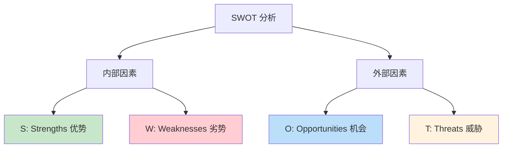

# 2.5 SWOT 分析方法论

#### 目录介绍
- [01.看一个真实案例](#01看一个真实案例)
- [02.断点自测三问](#02断点自测三问)
- [03.SWOT 分析法的背景](#03swot-分析法的背景)
- [04.SWOT 四大象限详解](#04swot-四大象限详解)
- [05.SWOT 分析六大步骤](#05swot-分析六大步骤)
- [06.SWOT 案例实战演练](#06swot-案例实战演练)
- [07.SWOT 四种应对策略](#07swot-四种应对策略)
- [08.这几个坑我踩过](#08这几个坑我踩过)
- [09.总结回顾本章节](#09总结回顾本章节)
- [10.后来发生的改变](#10后来发生的改变)
- [11.今天起改变三点](#11今天起改变三点)
- [12.课后作业思考下](#12课后作业思考下)

## 01.看一个真实案例

那年我工作快五年了，正好有一家成长很快的中厂给了我一个 offer：**薪资比当前涨 35%，岗位是技术专家**。听起来非常诱人，但我整整纠结了三个月。

我每天都在反复想：「走了的话，现在公司的期权要放弃，是不是太亏了？」「新公司听起来不错，但万一进去发现不是想象的那样呢？」「这个时间点跳是不是太早了？再等一年是不是更好？」

我跟身边几乎所有朋友、前同事、家人都聊过一遍：**有人劝我去，有人劝我留，结果我更纠结了**。每天上下班路上脑子里都在打架，工作也没心思做，整个人极度焦虑。直到三个月后，那家公司的 HR 给我发了最后通牒：「本周五前请给个答复，否则名额给别人」。

周四晚上我又一次失眠。凌晨两点我索性爬起来，决定把所有思路彻底捋清楚。我打开电脑搜「如何做职业决策」，第一篇文章就是 SWOT 分析。

我半信半疑地拿出一张 A4 纸，画了一个十字，分成四格：S、W、O、T。然后**强迫自己每个格子里都写满 5 条**：不许偷懒，不许逃避。

写完之后我整个人都安静下来了。**我看到的不再是模糊的「焦虑」，而是清清楚楚的 20 条事实**。更关键的是，当我做「SO 策略」分析（用我的优势抓住外部机会）时，我惊讶地发现，**我的两个核心优势（架构能力 + 业务理解）正好对应新公司最缺的两块**。

那一刻我做出了决定，第二天一早就回复了 HR。**后来这个决定被证明是我职业生涯最正确的几个决定之一**。下面这套方法，就是当年那张 A4 纸救我的东西。

## 02.断点自测三问

在往下读之前，先做三道判断题。任意一题命中，这一节就值得你认真读完。

| 断点 | 自测题 | 症状描述 |
|:----:|:------|:--------|
| 靠感觉决策 | 你上一次做重要决策，是靠 A4 纸列事实还是靠反复问朋友？ | 焦虑源于模糊，事实能替它减半 |
| 只列不交叉 | 你做过 SWOT 吗？做完之后有没有走到 SO/WO/ST/WT 四种策略？ | 只做 SWOT 不做策略 = 半张废纸 |
| 分析不复盘 | 你的 SWOT 上一次更新是什么时候？ | 外部环境变化后不更新等于失效 |

三道题依次对应本节的三条主线：**把焦虑变事实、交叉出策略、定期更新**。你在哪一条上薄，就重点看那一段。

## 03.SWOT 分析法的背景

在做重要决策之前，比如是否换工作、是否接手一个新项目、团队下季度的战略方向，你需要对当前的形势做一个全面的评估。**很多人做决策靠「感觉」，但感觉往往是不全面的，容易忽略关键因素**。SWOT 分析法就是一个帮你系统化、结构化评估形势的工具，让你在做决策前看清全貌。

SWOT 分析法由美国旧金山大学管理学教授海因茨·韦里克（Heinz Weihrich）在 20 世纪 80 年代提出。它最初用于企业战略规划，后来被广泛应用于个人发展、项目评估、竞品分析等各种场景。

## 04.SWOT 四大象限详解

| 象限 | 属性 | 核心问题 |
|:----|:----|:----|
| **S 优势** | 有利、内部 | 我们比别人强在哪？ |
| **W 劣势** | 不利、内部 | 我们比别人弱在哪？ |
| **O 机会** | 有利、外部 | 环境中有什么机遇？ |
| **T 威胁** | 不利、外部 | 环境中有什么风险？ |

**S 优势**。优势是你或你的团队 / 产品所具备的、优于竞争对手的内部因素。分析优势时可以问自己：我们做得比别人好的是什么？我们有哪些独特的资源或能力？别人认为我们的优势是什么？

**W 劣势**。劣势是你或你的团队 / 产品的内部短板。分析劣势时要保持诚实和客观：我们做得比别人差的是什么？哪些方面需要改进？别人经常批评我们什么？

**O 机会**。机会是外部环境中对你有利的因素。分析机会时要放宽视野：市场 / 行业有什么新趋势可以利用？竞争对手有什么弱点可以切入？有什么新技术或新政策对我们有利？

**T 威胁**。威胁是外部环境中可能对你造成不利影响的因素：竞争对手在做什么可能威胁到我们？市场 / 行业有什么不利的变化？有什么风险是我们无法控制的？

## 05.SWOT 分析六大步骤

**步骤一：明确分析对象**。SWOT 分析的第一步是明确你在分析什么。是分析自己的职业发展？还是分析团队的竞争力？还是分析一个产品的市场前景？**分析对象不同，SWOT 的内容也完全不同**。

**步骤二：头脑风暴列出要素**。针对每个象限，尽可能多地列出相关因素。建议每个象限列出 3 至 5 个要素。可以自己独立分析，也可以拉上团队一起头脑风暴。我自己的经验是：**强迫自己每个象限至少写满 5 条，因为前 2 条往往是表面的，第 3 条之后才是真正深入的洞察**。

**步骤三：交叉分析得出策略**。这是 SWOT 分析中最有价值的步骤：**把四个象限两两组合，得出四种应对策略**。很多人做完前两步就停下了，那 SWOT 就只是一张表，没有任何决策价值。真正的价值在第三步。

## 06.SWOT 案例实战演练

**个人职业分析示例**（三年经验的后端开发工程师）：

| 象限 | 要素 |
|:----|:----|
| **S** | Java 功底扎实、有大型项目经验、学习能力强 |
| **W** | 前端能力薄弱、英语一般、缺少管理经验 |
| **O** | 公司在推 Go 技术栈、云原生方向需求大、团队有晋升名额 |
| **T** | AI 可能替代部分编码工作、行业内卷严重、年龄焦虑渐显 |

**团队竞争力分析示例**：

- **S 优势**：技术团队能力强、有成熟的 CI/CD 流程、业务理解深；
- **W 劣势**：人员流动率偏高、缺少产品思维、文档积累不足；
- **O 机会**：公司业务在高速增长、新业务线需要技术支持、管理层重视技术建设；
- **T 威胁**：竞对团队规模更大、核心成员有被挖走的风险、技术债务积累。

## 07.SWOT 四种应对策略

四个象限两两组合，得出四种策略：

| 策略 | 组合 | 定位 | 典型思路 |
|:----|:----|:----|:----|
| **SO** | 优势 + 机会 | 积极进攻 | 用优势抓住机会（**优先执行**）|
| **WO** | 劣势 + 机会 | 补短利机 | 改善劣势来利用机会 |
| **ST** | 优势 + 威胁 | 以长制险 | 用优势来抵御威胁 |
| **WT** | 劣势 + 威胁 | 防守收缩 | 减少劣势避免威胁 |

**SO 策略：Java 功底扎实（S）+ 公司在推 Go 技术栈（O）** → 策略：利用扎实的编程基础快速转型 Go，抢占技术红利。

**WO 策略：缺少管理经验（W）+ 团队有晋升名额（O）** → 策略：主动学习管理知识，争取带小团队练手。

**ST 策略：学习能力强（S）+ AI 可能替代部分编码工作（T）** → 策略：学习 AI 相关技术，成为「AI + 传统开发」的复合型人才。

**WT 策略：缺少产品思维（W）+ 行业内卷严重（T）** → 策略：培养产品思维和业务理解能力，从纯技术向技术 + 业务复合发展。

## 08.这几个坑我踩过

**坑一：SWOT 只当成填表**。第一次做 SWOT 我认真填了四个格子，然后……就没有然后了。**四个格子填完不做交叉分析，等于把一堆事实平铺在纸上，没有产生任何决策价值**。后来我给自己定了一条规矩：任何一次 SWOT 必须走完 SO / WO / ST / WT 四种策略、并挑一个 Top 策略立即落地。

**坑二：对劣势自我美化**。我曾经在 W 象限里写「注意力容易被打断」这种其实不痛不痒的劣势，故意回避真正的痛点（缺乏公开影响力）。**结果 SWOT 做得漂亮，问题一个都没解决**。后来我强制自己：**W 象限里必须至少有一条让我读了觉得脸红的**，那才是真正需要面对的短板。

**坑三：不做定期复盘**。第一次做完 SWOT 后我以为自己「已经想清楚了」，一年内没再更新。但外部环境（新技术、新竞对、新政策）和内部条件（新技能、新经验）都在变。**一份不更新的 SWOT 半年后就是废纸**。现在我固定在元旦和七一前后各做一次。

## 09.总结回顾本章节

**SWOT 最大的价值不是「分析」，而是它强迫你把焦虑变成事实、把事实变成策略**。

你应该带走三件事：

1. **把模糊变具体**：焦虑往往来自模糊，写成 20 条事实后焦虑就消失了一大半。
2. **把感觉变策略**：交叉分析让你从「我应该做什么」直接得到「接下来三步具体做什么」。
3. **把单点变全局**：避免你只盯着一个因素（比如薪资）做决定，而忽略了机会和威胁。

**关键是：不要只做分析不做行动。SWOT 的价值在于它能指导你的决策和行动**。

## 10.后来发生的改变

**1. 一周内接下 offer**。我那张 A4 纸最终的 SWOT 是这样的。**S 优势**：架构设计能力强、5 年大型项目经验、业务理解深；**W 劣势**：缺乏从零搭团队的经验、公开影响力弱、技术广度待加强；**O 机会**：新公司缺架构和业务复合人才、薪资涨 35%、新业务线刚启动；**T 威胁**：期权放弃、新环境磨合风险、家庭阶段刚换房压力大。**交叉分析的 SO 策略一目了然：我的两个核心优势正好填补新公司两个最大缺口**。这是一个典型的「SO 进攻型」机会。一周内我接了 offer，三个月后顺利入职。

**2. 第一年 SO 策略跑赢同期**。入职后我严格按照 SO 策略走：**把架构能力和业务理解全部投入到新公司最缺的两个岗位职责上**。结果：**入职 6 个月**主导了核心系统的架构重构，被评为「季度优秀」；**入职 12 个月**晋升一级，薪资再涨 20%；**入职 18 个月**开始带 12 人团队，把 W 象限里「缺乏从零搭团队经验」这个短板也补上了。回头看，**正是 SO 策略让我没有一上来就什么都做、什么都补，而是把火力集中到自己最强 + 公司最需要的交集上**。

**3. 三年后 SWOT 变成固定动作**。后来我把「半年一次 SWOT」变成了固定动作。每年元旦和七一前后，我都会拿出 A4 纸重新做一次 SWOT。这个习惯带来三个长期收益：**重大决策从不焦虑**（后来又遇到过创业邀约、海外岗位、转 AI 方向等机会，每次都用 SWOT 快速决策，再没有「纠结三个月」的事）；**及时发现劣势的恶化**（某半年我发现「公开影响力弱」这条劣势从中等变严重，于是开始系统性输出技术博客）；**能更早察觉外部威胁**（AI 浪潮起来时，我提前 6 个月在 SWOT 里识别到了威胁，开始转型，比同事们走得早）。

## 11.今天起改变三点

**1. 做一次个人 SWOT 分析**。今天就做一次自己的个人 SWOT 分析。花 20 分钟，诚实地列出你的优势、劣势、机会和威胁。对劣势部分不要自我美化：**你不诚实面对的劣势，最终会在某个时刻给你带来麻烦**。强迫自己每个象限写满 5 条，前 2 条是表面的，第 3 至 5 条才是真正的洞察。

**2. 优先执行 SO 策略**。从 SWOT 分析中找出你的 SO 策略，优先执行。用你的优势去抓住当前的机会，这是投入产出比最高的策略。**不要急着去补短板，先把长板发挥到极致**。我自己就是靠这一条，在新公司一年内做到晋升加薪的。

**3. 定期更新 SWOT**。每半年重新做一次 SWOT 分析。你的内部条件在变，外部环境也在变。半年前的优势可能变成劣势，半年前不存在的机会可能已经出现。**把这件事固定到日历上：元旦和七一前后各一次，你会发现你的职业方向感会比身边人清晰得多**。

## 12.课后作业思考下

1. **个人 SWOT 完整流程**：为你自己的职业发展做一次完整的 SWOT 分析，每个象限至少列出 5 个要素，然后做交叉分析得出 SO / WO / ST / WT 四种策略。

2. **团队 SWOT 分析**：为你所在的团队做一次 SWOT 分析，看看团队的核心竞争力是什么，最大的风险是什么。把结果和你的 Leader 讨论一下。

3. **纠结决策实战**：找一个你正在犹豫的决策（换不换工作、接不接新项目等），用 SWOT 分析法来辅助决策，看看结论和你的直觉是否一致。

4. **SWOT vs 3C**：对比 SWOT 和 3C 方案设计法（详见 2.8），思考它们各自更适合什么场景。你能设计一个把两者结合使用的流程吗？

---

> **下一站** ｜ SWOT 帮你看清了「内 / 外、优 / 劣」，但复杂问题还需要一种更彻底的「拆干净」能力。下一节我们用 **MECE** 原则学习「不重不漏」地拆分问题。
