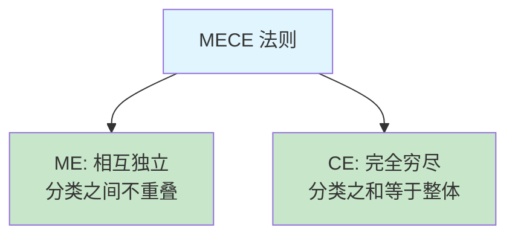

# 2.6 MECE 分析的方法

#### 目录介绍
- [01.看一个真实案例](#01看一个真实案例)
- [02.断点自测三问](#02断点自测三问)
- [03.MECE 法则背景介绍](#03mece-法则背景介绍)
- [04.MECE 核心含义解读](#04mece-核心含义解读)
- [05.MECE 拆解四大方法](#05mece-拆解四大方法)
- [06.MECE 案例实战演练](#06mece-案例实战演练)
- [07.MECE 常见三大误区](#07mece-常见三大误区)
- [08.这几个坑我踩过](#08这几个坑我踩过)
- [09.总结回顾本章节](#09总结回顾本章节)
- [10.后来发生的改变](#10后来发生的改变)
- [11.今天起改变三点](#11今天起改变三点)
- [12.课后作业思考下](#12课后作业思考下)

## 01.看一个真实案例

那次故障是我职业生涯永远忘不了的：**我们的核心服务在凌晨 3 点宕机了 47 分钟，影响了 30 万用户**。我作为责任人，第二天上午要给整个部门做故障复盘。

我熬了一整夜，写了一份 8 页的复盘报告。我以为自己写得很全面，原因列了整整 22 条，包括：

> 「代码 Bug、SQL 慢查询、缓存穿透、新人不熟悉、流量突增、监控告警延迟、服务器配置不够、数据库连接池小、运维不到位、压测不充分、code review 走过场、文档不完善……」

报告发出去的一瞬间，我以为自己已经覆盖了所有可能的角度。结果会议上，部门 Leader 看了 30 秒，把电脑一合，说了一句让我面红耳赤的话：

> 「你这个东西**乱七八糟的**：『代码 Bug』和『新人不熟悉』到底算一类还是两类？『压测不充分』和『监控告警延迟』是同一层级的吗？你这 22 条里，**至少有 8 条是重复的，又至少漏了 4 个关键维度**」。

我当场无语：**我以为列得越多越全，没想到反而暴露了我的混乱**。

会后一位前辈把我拉到楼下咖啡厅。他在我对面坐下，掏出一张餐巾纸说：「让我教你一个东西」。他在餐巾纸上画了一个矩形，分成 4 个格子，写上：**人 / 系统 / 流程 / 外部**。

然后说：「你那 22 条，全部能塞到这 4 个格子里，而且**每条只能进一个格子，不能重复**；同时**这 4 个格子加起来，要能覆盖所有可能的故障原因**。这就是 MECE」。

我当场用他的框架重新整理我的 22 条原因：

- **人**：新人不熟悉、code review 走过场、运维不到位 → 合并为「人员能力与流程不足」；
- **系统**：代码 Bug、SQL 慢查询、缓存穿透、连接池小 → 合并为「代码与配置缺陷」；
- **流程**：压测不充分、监控告警延迟、文档不完善 → 合并为「质量保障流程缺失」；
- **外部**：流量突增 → 不可控外部因素。

**22 条压缩成 4 大类，没有任何重复，且我突然发现还漏了「灾备能力」和「应急预案」两个关键维度**。这 4 大类一目了然，每一类下挂 3 至 5 条具体原因：这就是真正的复盘报告。那张餐巾纸我至今还留着。

## 02.断点自测三问

在往下读之前，先做三道判断题。任意一题命中，这一节就值得你认真读完。

| 断点 | 自测题 | 症状描述 |
|:----:|:------|:--------|
| 列得越多越乱 | 你上一份复盘 / 方案是不是「原因列一堆」但读起来抓不住重点？ | 项多层薄，重复又遗漏 |
| 没有拆分维度 | 你分析问题时是先想「拆分维度」，还是直接开始列原因？ | 无框架 = 想到哪写到哪 |
| 拆完不检查 | 你拆完后有没有回头问「两两不重叠 + 加起来覆盖」？ | 拆完就走，坑等在半路 |

三道题依次对应本节的三条主线：**先定维度再列条目、两两互斥、加起来穷尽**。你在哪一条上薄，就重点看那一段。

## 03.MECE 法则背景介绍

你有没有分析问题时遇到过这样的困境：**列了一堆原因，但总觉得不全面，可能遗漏了什么；又或者列出的原因之间有重叠，讨论时把同一个问题翻来覆去说了好几遍**。问题的根源在于：你的分析框架不够严谨。MECE 法则就是帮你建立严谨分析框架的工具。

MECE（Mutually Exclusive, Collectively Exhaustive）由全球顶级咨询公司麦肯锡提出，是麦肯锡方法论的核心基石。**几乎所有的咨询师在入职第一周就会学习 MECE 原则**。

## 04.MECE 核心含义解读

**ME 相互独立**。「相互独立」意味着你拆分出来的各个部分之间不能有重叠。比如把人按年龄分为「18 岁以下」「18 至 35 岁」「35 岁以上」就是相互独立的；但如果分为「学生」「上班族」「年轻人」就不是相互独立的，因为「年轻人」和「学生」「上班族」有重叠。

**CE 完全穷尽**。「完全穷尽」意味着你拆分出来的各个部分加在一起必须覆盖全部情况，不能遗漏。比如把性别分为「男」「女」是完全穷尽的；但如果只分为「男」「女」「儿童」就不是 MECE 的，**因为「儿童」和前两类重叠（ME 违反），而且这种分法的逻辑也不自洽**。

四种典型情况一看即懂：

| 情况 | 举例 | 判定 |
|:----|:----|:----|
| 不重叠 + 不遗漏 | 人按性别分：男 / 女 | 标准 MECE ✓ |
| 有重叠 + 不遗漏 | 人按身份分：学生 / 上班族 / 年轻人 | 违反 ME ✗ |
| 不重叠 + 有遗漏 | 收入来源：工资 / 投资 | 违反 CE ✗ |
| 有重叠 + 有遗漏 | 用户分：VIP / 活跃用户 | 两条都违反 ✗ |

## 05.MECE 拆解四大方法

四种拆解方法各有主场：

| 方法 | 适用场景 | 举例 |
|:----|:----|:----|
| **按流程** | 过程类问题 | 用户购买：浏览 → 加购 → 下单 → 收货 → 评价 |
| **按结构** | 组成类问题 | 公司收入 = A 业务 + B 业务 + C 业务 |
| **按公式** | 指标类问题 | 收入 = 用户数 × 客单价 × 频次 |
| **按二分法** | 快速粗分 | 用户：付费 / 非付费 |

**按流程拆解**。把一件事按照时间顺序或流程步骤来拆分，天然就是 MECE 的。比如分析「用户流失」问题，可以按流程拆解为：注册阶段流失、首次使用流失、持续使用阶段流失、付费阶段流失。**每个阶段互不重叠，加在一起覆盖了用户的全生命周期**。

**按公式拆解**。利用已有的公式来拆分。比如：**收入 = 用户数 × 客单价 × 购买频率**；**利润 = 收入 - 成本**；**转化率 = 转化人数 / 访问人数**。**公式中的每个因子天然就是 MECE 的**，因为它们数学上互不重叠且组合完整。

## 06.MECE 案例实战演练

**分析 App 留存率下降**：

- **第一层拆分（按用户类型）**：新用户留存下降 + 老用户留存下降 = 全部用户留存下降。这是 MECE 的。
- **第二层拆分（按原因）**：针对新用户，按流程拆解为「获客阶段」和「激活阶段」的问题；针对老用户，按因素拆解为「内部原因」（核心功能体验、需求变化）和「外部原因」（竞品替代）。

**分析项目延期原因**：

| 一级分类 | 二级原因 | 具体案例 |
|:----|:----|:----|
| **需求问题** | 需求变更频繁 / 需求不明确 | 产品经理频繁修改 PRD |
| **技术问题** | 方案不合理 / 技术难点超预期 | 未预估到第三方接口限制 |
| **资源问题** | 人力不足 / 关键人员请假 | 核心开发生病请假一周 |
| **流程问题** | 审批流程长 / 环境不可用 | 测试环境被其他项目占用 |

**检验 MECE**：四个一级分类之间是否重叠？需求 / 技术 / 资源 / 流程，基本不重叠。是否穷尽？加上「其他因素」兜底，可以认为是穷尽的。

## 07.MECE 常见三大误区

**误区一：过度追求完美 MECE**。在实际工作中，100% 完美的 MECE 往往很难做到。**不要为了追求完美而花太多时间纠结分类**：做到 80% 的 MECE 就已经比没有框架好得多了。

**误区二：层次太多太复杂**。MECE 拆分通常 2 至 3 层就够了。**层次太多会导致分析框架过于复杂，反而降低了分析效率**。

**误区三：忘记了分析的目的**。MECE 是工具，不是目的。拆分完之后的关键是：**通过拆分发现问题的关键所在，找到解决方案**。如果拆分得很漂亮但最后没有得出有价值的结论，那就是为了 MECE 而 MECE。

## 08.这几个坑我踩过

**坑一：MECE 层数堆到 4 层以上**。我曾经用 MECE 拆产品问题，一路拆到第 4 层，结果反而看不清主要矛盾。**MECE 是望远镜不是显微镜**：3 层就足够，再多就是自我陶醉。

**坑二：把 MECE 当结论**。我曾经交出过一份「特别 MECE」的市场分析，逻辑漂亮到无懈可击，**但整份文档没有提出任何一个可执行的动作**。Leader 看完只说了三个字：「所以呢？」MECE 只是拆解，不是结论：**拆完之后必须回答「所以我要做什么」**。

**坑三：一级分类之间悄悄重叠**。做需求分析时我列了「新用户 / 高频用户 / 付费用户」三类，看着挺全面，其实**「付费用户」和「新用户 / 高频用户」有大量交集**。检验 ME 的技巧：**任取两个分类问一句「有没有一个用户同时属于两个」，答「有」就不是 MECE**。

## 09.总结回顾本章节

**MECE 不是让你看起来更专业，它真的能让一份文档的价值翻几倍**。

你应该带走三件事：

1. **先定维度再列条目**：MECE 的核心不是「列」，而是「先想清楚从哪个维度去列」。
2. **两两互斥 + 加起来穷尽 = MECE**：拆完必须做这两项自检，任何一项不过就要重来。
3. **拆完之后必须回答「所以我要做什么」**：MECE 是工具不是结论，不能只交拆解不交行动。

## 10.后来发生的改变

**1. 第一周所有文档过 MECE**。我做的第一件事是给自己定了一条铁律：**任何要发出去的文档 / 汇报 / 方案，提交前必须用 MECE 自检一次**。具体动作只有两个问题：「我列的这些点，两两之间有重叠吗？」有就合并；「这些点加起来，覆盖了所有情况吗？」没覆盖就补。第一周内我自检了 5 份文档，**平均每份能合并 30% 的重复内容、补上 1 至 2 个漏掉的维度**。

**2. 第一个月故障复盘获评优秀范本**。一个月后，又出了一次（小）故障，又是我做复盘。这次我严格用 MECE 框架：一级 4 类（人 / 系统 / 流程 / 外部）、二级各拆 3 至 5 条具体原因、配套行动项。部门 Leader 看完只说了一句话：**「这才叫复盘报告。这份直接当模板，发到全部门」**。那一刻我才真正理解：**MECE 不是让你看起来更专业，它真的能让一份文档的价值翻几倍**。

**3. 半年后 MECE 成团队肌肉记忆**。半年后我开始带 6 人小组，我做的第一件事就是给团队全员普及 MECE，并定下三条规则：**所有文档「目录」必须 MECE**（一级标题之间不许重叠）；**所有问题分析必须先列 MECE 框架**（再往下填具体原因）；**所有方案设计必须用 MECE 检查覆盖度**（避免漏关键场景）。效果非常明显：**跨部门评审通过率显著提升**（评委一眼看清结构，不再追问「你是不是漏了 XX」）；**新人成长速度翻倍**（新人有了 MECE 这个万能脚手架，写文档不再「想到哪写哪」）；**我自己晋升答辩获最高评分**（因为整份述职用的就是 MECE 结构，评委非常容易理解）。

## 11.今天起改变三点

**1. 分析问题时先做 MECE 拆分**。下次分析问题时，**先做 MECE 拆分**。不要一上来就列原因，先想清楚用什么维度来拆分（流程？结构？公式？），确保拆分出来的部分不重叠、不遗漏。这个简单的步骤能大幅提升你分析问题的系统性。我自己每次写文档前都会先在草稿纸上画出 MECE 框架，再往下填内容。

**2. 用公式法拆解业务指标**。找一个你关心的业务指标，用公式法做 MECE 拆解。比如 **GMV = 用户数 × 转化率 × 客单价**。拆解后，你就能清楚地知道要提升 GMV 应该从哪个因子入手。**这种「指标拆解能力」是高级别工程师 / 产品经理的必备技能**。

**3. 检查你的汇报是否 MECE**。检查你最近的汇报或方案，看看分组是否符合 MECE。如果有重叠或遗漏，重新调整分组。一份 MECE 的汇报，逻辑清晰度会提升一个档次。**特别提醒：先看一级目录之间有没有重叠：这是最容易被忽视的地方**。

## 12.课后作业思考下

1. **完整 MECE 拆解练习**：选一个你正在面对的工作问题，用 MECE 法则做一次完整的拆解（至少 2 层），检查每一层是否满足「不重叠 + 不遗漏」。

2. **业务指标公式拆解**：找一个业务指标（如日活、转化率、客单价等），用公式法拆解为若干因子，分析哪个因子是当前最值得优化的。

3. **汇报 MECE 自检**：回顾你最近写的一份汇报或方案，检查其中的分类框架是否 MECE。如果不是，重新组织一下结构。

4. **MECE 与金字塔原理**：思考 MECE 和金字塔原理的关系：金字塔原理中的「归类分组」和 MECE 有什么联系？

---

> **下一站** ｜ 拆干净之后，接下来要解决一个更实际的问题：**面对一大堆事，我该先做哪个**。下一节讲**二八法则**：找到那 20% 决定 80% 结果的关键。
