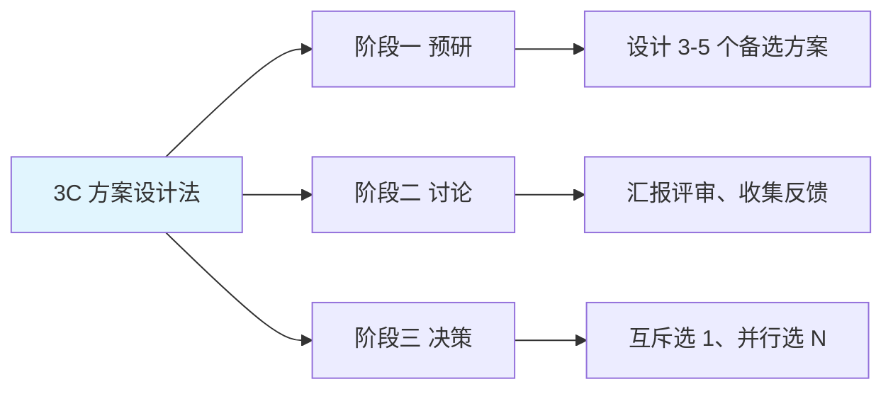

# 2.8 三种方案设计法

#### 目录介绍
- [01.看一个真实案例](#01看一个真实案例)
- [02.断点自测三问](#02断点自测三问)
- [03.先来看一个场景](#03先来看一个场景)
- [04.3C 方案设计法](#043c-方案设计法)
- [05.3C 分为三个阶段](#053c-分为三个阶段)
- [06.会耽误效率吗](#06会耽误效率吗)
- [07.对晋升的帮助](#07对晋升的帮助)
- [08.这几个坑我踩过](#08这几个坑我踩过)
- [09.总结回顾本章节](#09总结回顾本章节)
- [10.后来发生的改变](#10后来发生的改变)
- [11.今天起改变三点](#11今天起改变三点)
- [12.课后作业思考下](#12课后作业思考下)

## 01.看一个真实案例

我刚做技术 Leader 那一年，第一次拿一个比较重要的方案上技术委员会评审。我提前两天写了 30 页 PPT，自认为很完整：背景、目标、技术选型、上线计划，全都有。

评审那天，我开场不到 10 分钟就被打断了。一位资深架构师开口第一句话：**「你这个方案我看完了，只看到了你想做什么，没看到你为什么这么做」**。紧接着所有人开始追问：为什么用 A 不用 B？有没有考虑成本？如果数据量再翻 5 倍呢？兜底方案是什么？…我准备的 PPT 完全 hold 不住，被打了整整 40 分钟，最后方案被判「回去重做」。

走出会议室的时候我手是抖的。不是因为被骂，而是因为意识到，**我从头到尾，只准备了一个方案**。

会议结束后那位架构师在过道上拍了拍我：「小伙子方案不差，但你犯了所有新手都会犯的错：只准备一个方案，等于把所有质疑直接抛给评委。下次记住：**任何方案，至少准备 3 个备选；自己先把别人会问的问题答完，再来评审**」。

我当晚就回去把方案重写了一版：A、B、C 三个备选方案各列优缺点、成本、风险，最后写明「我推荐 A，因为 XX，相对 B/C 的代价是 XX」。**一周后再评审，全程顺利通过，老板还问我：「你这次怎么换了一种打开方式？」**

那是我职业生涯第一次真正理解什么叫「3C 方案设计法」：不是为了做 3 个方案，而是为了**让你自己在做选择之前，先逼着大脑做完一遍系统性的思考**。这一节，我会把它讲清楚。

## 02.断点自测三问

在往下读之前，先做三道判断题。任意一题命中，这一节就值得你认真读完。

| 断点 | 自测题 | 症状描述 |
|:----:|:------|:--------|
| 只准备一方案 | 你上一次汇报方案是「就这一个」还是「A/B/C 三个我推荐 A」？ | 单方案 = 把质疑全甩给评委 |
| 说 A 好、不讲为什么不选 B | 你会主动讲「为什么不选 B/C」吗？ | 让评委猜，等着被追问 |
| 拍脑袋决策 | 你上一次技术选型是「凭习惯」还是「有对比表」？ | 无对比 = 拍脑袋 |

三道题依次对应本节的三条主线：**至少 3 个方案、主动说清「为什么不选」、用表格代替感觉**。你在哪一条上薄，就重点看那一段。

## 03.先来看一个场景

在执行阶段，你可能经常遇到这样的情况：**领导审批或者跨部门同事协作的时候，别人对你的想法提出挑战**。

比如你提出了一个方案，其他人针对你的方案提了很多疑问，而这些疑问确实是你在做方案时没有考虑到的；或者有人提出了其他的方案，你一时也无法明确地证明你的方案优于别人的方案。

需要有理有据，所以在一开始的时候，你就要设计出有理有据的方案，这样才能让别人更加理解、支持和配合你。**那么为了让方案更加完善，可以罗列 3 种方案对比择优选用**。

每次做事的时候都至少设计 3 个方案，然后选择最优的 1 个或者几个方案去执行。这里的 C 代表 **Choice 选择**。所以，总结出了一个 **3C 方案设计法**。

## 04.3C 方案设计法

3C 方案设计法最典型的应用场景就是**基于上一级的 OKR 来制定自己的 OKR**。比如你是负责买量的运营人员，你的 Team Leader 基于上一级业务 OKR，分解出运营团队的某个 KR 是「新用户买量 60 万」，现在交给你来负责执行。

你会发现买量的渠道有很多种，包括抖音、快手、头条、百度、QQ 和微信等。**不同的渠道用户特性不同，方式不同，投入产出也不同，你不能每个渠道都买一点，而应该聚焦几个效果好的渠道**。

但到底哪几个渠道才是好的呢？你不能简单地凭感觉拍脑袋，而应该有理有据地推导出来。具体来说，就是**提出不同渠道买量的方案，对比这些方案的优缺点、投入成本和买量效果等**。如果最后你判断「抖音买量 50 万」和「百度买量 20 万」这两个方案比较好，那么就把这两个方案作为自己的 KR。

3C 方案设计法不局限于业务规划和业务方案设计，它也可以用来做技术方案，也可以用来做管理方案；**既适合比较重大的事项，也适合日常的判断选择**。哪怕是「周末家里要不要换一台扫地机器人」这种小事，用 3C 方法去想（A：换品牌 X；B：再用一年现在的；C：换成扫拖一体机），都比拍脑袋决策要靠谱得多。

## 05.3C 分为三个阶段

3C 方案设计法的使用过程可以分为三个阶段，每个阶段都能够从不同的角度帮助你完善思考，提升方案的说服力。

**阶段一：预研**。你需要设计出 3 至 5 个备选方案。这个过程会促使你思考多种可能性，避免思维狭隘错过了更好的方案；而研究不同方案的优缺点可以帮助你系统理解某个领域的知识和技能。**你可能并不一定能很快想出 3 个备选方案，这恰恰说明你对当前的领域或者事情还没有全面的理解和思考**，你需要强迫自己一定要想出 3 个备选方案，这个探索的过程就是一个自我提升的过程。

**阶段二：讨论**。你需要把备选方案向上级汇报，或者给其他人评审。这个过程会让其他人的信息、观点和疑问输入到你的大脑中，进一步全面完善你对每个方案的优缺点、依赖条件和所需资源的理解。

**阶段三：决策**。你需要挑选出最终的方案。**如果是互斥的方案，那么选出 1 个最优的落地就行了**。比如新招聘的员工表现不太理想，方案 1 是「立即辞退」，方案 2 是「不辞退，加大培养力度」，方案 3 是「延长试用期 1 个月」，你最终只能挑选 1 个方案落地。**如果是可以并行的方案，那么「3 选 2」或「5 选 3」也是可以的**，但是不建议「3 选 3」或「5 选 4」，因为这样执行的时候会没有重点。

**列出一些备选方案，只能说明你对领域有一定了解；选出合适的最终方案，才能说明你已经掌握了这个领域，能做到理论和实践相结合**。决策的过程会让你重新审视自己原来提出的方案，尤其是最初倾向的方案，帮助你发现方案的问题、理解的问题、乃至自己决策标准的问题。

## 06.会耽误效率吗

你可能会担心，每次都要做 3 个方案，要花不少时间吧，这个 3C 方案设计法会不会耽误做事效率啊？**其实这是一种片面的理解**。

首先，虽然前期准备的时间变长了，但是做一件事的整体效率变高了。「前期匆匆忙忙赶工，后期急急忙忙返工」，这样的情况你肯定遇到过吧？**如果你在前期预研的时候先选出更好的方案，那么更有可能一次就拿到好的结果。一次就把事情做好，肯定比重复好几次效率更高**。

其次，虽然负责人投入的精力变多了，但是整个团队的效率变高了。「方案潦潦草草，讨论轰轰烈烈」，这种情况你肯定也深有体会吧？**如果负责人在设计方案的时候投入更多的精力，那么后续整个团队讨论决策和执行的效率都会提高**。

正是因为考虑到效率，3C 方案设计法才提倡准备 3 至 5 个备选方案。方案数量的规律可以固化为一句话：

| 方案数 | 状态 | 说明 |
|:----:|:----|:----|
| **1 个** | 陷阱 | 思维狭隘、遗漏更好选项 |
| **2 个** | 困境 | 非此即彼、选择困难 |
| **3-5 个** | 选择 | 多角度思考、选优执行（最佳区间）|
| **> 5 个** | 冗余 | 讨论决策成本陡增，不建议 |

## 07.对晋升的帮助

如果你想提高自己的晋升成功率，首先要认识到回答问题不能光靠临场反应，更重要的是**在平时做事情的时候就要逐步积累**，正所谓「台上一分钟，台下十年功」。

晋升答辩的时候，在评委看来：**你能够想出 3 个以上的方案，说明你对领域有系统和全面的理解**，或者做事考虑非常周全；能够详细地分析多个备选方案的优缺点，说明你对领域有深入的理解；而**能够从多个方案中选出落地的方案并最终拿到结果，说明你有一套成熟的评价标准或者原则，展现了你的决策能力**。

有的主管可能只是简单地跟你提出「你要加深理解」「全面思考」「深入思考」「明白背后的原因」等比较虚的要求，你听完后还是一脸懵逼。但是学完这一讲，我想你就知道应该怎么做：**只要按照 3C 方案设计法来做事，就自然就能满足这些要求**。

## 08.这几个坑我踩过

**坑一：为了凑数硬造方案**。用 3C 的第一个月，我经常为了凑 3 个方案而生编硬造，结果三个方案里有两个明显是「陪衬」，反而让评委看出「不认真」。**方案 B 和 C 必须是真正被认真考虑过的**，如果只能想出 1 个，就直接说明「我调研了 A/B/C，其中 B 因为 XX 直接排除、C 因为 XX 明显劣于 A」也可以，比硬凑要真诚得多。

**坑二：三个方案维度不一致**。曾经做技术选型，A 用「性能好」描述、B 用「团队熟悉」描述、C 用「社区活跃」描述，看起来三个方案，实际不能横向比较。**必须先定评价维度**（成本 / 性能 / 风险 / 交付时间），每个方案在同样维度上打分：三个方案才可比。

**坑三：不主动讲「为什么不选 B」**。方案变成 3 个之后我曾经犯过一个错：只讲「A 好在哪里」，等评委问「那 B 呢」我再解释。**评委会觉得你没想清楚**。后来我强制自己：每次汇报都提前把「为什么不选 B/C」的段落写进 PPT，等评委开口前就讲。**质疑量骤降 70%**。

## 09.总结回顾本章节

**3C 方案设计法 = 每次做事至少设计 3 个方案 → 对比优缺点 → 选最优的 1 个或几个去执行**。

你应该带走三件事：

1. **任何重要决策面前，绝不只准备 1 个方案**：那是陷阱。
2. **评审 / 汇报时，把「为什么不选 B、C」讲清楚**：比讲「A 多么好」更有说服力。
3. **3C 的真正价值不是给别人看，而是逼自己提前完成系统思考**：思考完了，做起来才不会返工。

## 10.后来发生的改变

**1. 第一周所有事都列 3 个方案**。那次评审被打回之后的第一周，我给自己立了一条规矩：**只要是要做选择的事，无论大小，必须先在便签上列 3 个方案**。团队周会议程怎么排列 3 个方案；新人 onboarding 路线怎么走列 3 个方案；甚至中午吃什么…我都试着列 3 个备选。**第一周写得最痛苦的是技术选型场景**，我经常脑子里只有「那肯定就用 X 啊」，强行去想 Y 和 Z 的时候才发现：我根本没有真理由，只是因为习惯。**这种「强迫思考」反而让我开始重新审视很多过去拍脑袋的决策**。

**2. 第一个月方案评审 4 次 3 次一过**。接下来一个月，我把所有要走评审 / 上汇的方案，都按 3C 的格式重新做了一遍，并且学会了在评委开口前，**自己把「为什么不选 B/C」主动讲清楚**。效果立竿见影：一个月里我有 4 次方案评审，**3 次一次过，1 次只有小修改**。同部门一位资深同事跟我开玩笑：「你最近怎么开窍了，方案讲完连质疑都不知道从哪问起」。我心里清楚：不是我变聪明了，是我**把质疑提前消化在自己脑子里了**。

**3. 半年后我成了给别人把关的人**。半年之后的一次跨部门重大决策评审，我作为受邀评委被叫去给另一个团队提建议。**我提的第一个问题就是：「你这个方案我看完了，请问 B 方案、C 方案你考虑过吗？为什么没选？」和当年那位架构师对我说的一模一样**。那一刻我才意识到，**3C 方案设计法早已不是我用的「工具」，它已经长成了我看待问题的本能**。从一个被打回 40 分钟的菜鸟到能给别人方案把关：隔着的不是经验，是一套真正落到肌肉里的方法论。

## 11.今天起改变三点

**1. 任何决策前列 3 个方案**。从下一个任务开始，强迫自己列出至少 3 个方案。哪怕你觉得某个方案明显更好，也要逼自己想出另外两个备选方案。**这个过程本身就是在拓展你的思维边界**。如果你连 3 个方案都想不出来，说明你对这个领域的理解还不够深入，需要进一步学习。

**2. 用表格对比方案优缺点**。用一个简单的表格来对比方案。列出关键维度（成本、时间、风险、效果等），给每个方案打分。**不需要多复杂，一张 A4 纸就够了**。这个表格既能帮助你理性决策，也能在向上汇报时让领导快速理解你的思路。

**3. 记录你的决策理由**。每次做完决策后，记录下你选择某个方案的理由。一个月后回顾这些记录，看看你的决策标准是否合理、结果是否符合预期。**这个习惯能帮助你持续优化自己的决策能力**。

## 12.课后作业思考下

1. **回顾过往方案**：回忆你最近做过的一个方案或决策，当时你考虑了几个方案？如果只考虑了一个，试着事后补充两个备选方案，分析它们各自的优缺点。

2. **「1 个陷阱、2 个困境、3 个选择」验证**：思考这句话在你过去的工作中是否应验过，能否举出具体的例子？

3. **3C 完整流程实操**：选择一个你即将面临的工作决策（技术选型、方案设计、流程优化等），严格按照 3C 方案设计法的三个阶段来操作：预研 3 个方案 → 找人讨论 → 做出决策，记录全过程。

4. **主动开场练习**：在下一周内，至少 3 次在团队 / 家庭决策场合主动用「3 个备选方案」的方式开场，记录别人的反应和最终决策质量。

---

> **下一站** ｜ 方案选定之后，最后一步是把责任落到每一个人头上。下一节讲 **RACI 责任矩阵**：让「大家一起负责」这句糊涂话彻底消失。
