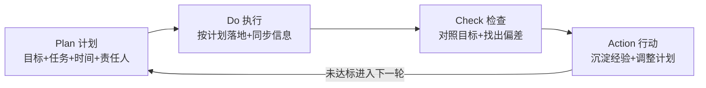

# 3.1 PDCA循环执行法
#### 目录介绍
- [01.连续延期四次的迭代](#01连续延期四次的迭代)
- [02.断点自测三问](#02断点自测三问)
- [03.PDCA是什么](#03pdca是什么)
- [04.P计划环节要点](#04p计划环节要点)
- [05.D执行环节要点](#05d执行环节要点)
- [06.C检查环节要点](#06c检查环节要点)
- [07.A行动环节要点](#07a行动环节要点)
- [08.PDCA完整案例演练](#08pdca完整案例演练)
- [09.这几个坑我踩过](#09这几个坑我踩过)
- [10.总结回顾这一节](#10总结回顾这一节)
- [11.后来发生的改变](#11后来发生的改变)
- [12.今天起改变三点](#12今天起改变三点)
- [13.课后作业思考下](#13课后作业思考下)
- [14.下一站番茄工作法](#14下一站番茄工作法)

## 01.连续延期四次的迭代

我第一次独立带迭代那年，运气特别背。一个普通的 2 周迭代版本，硬是被我连续延期了 4 次。第一次延期的理由是「产品需求改了」；第二次是「测试环境出问题了」；第三次是「接口对不上」；第四次干脆就是「我以为差不多了，结果还有 3 个 bug」。

到第四次延期那天的复盘会，老板没生气，只是平静地问了我两个问题：「你版本开始的时候有计划吗？」我说有的。「那你每天有按这个计划检查进度、对照偏差吗？」我愣住了。我有计划，但计划写完就再没看过；我每天都在干活，但从来没回头对过表。

老板那一刻只说了一句话：「你不是没有计划，你是只有 P，没有 DCA。」

会后老板把我拉进小会议室，在白板上画了 4 个字母的圈：P→D→C→A→P。他说：「任何一件事，有 P 没 C 就是赌博，有 D 没 A 就是消耗。从下个迭代开始，你每周固定时间做 Check，发现偏差就立刻 Action 调整计划，重新进入下一轮 P。」

那个迭代结束之后，我把每个版本都按 PDCA 跑了一遍。接下来连续 6 个迭代再没延过期一次。今天这一节，我把当年老板让我重做迭代的那套 PDCA 心法，完整讲给你。

## 02.断点自测三问

四断点里的「事中会失控」，PDCA 是核心解药。执行为什么会失控？不是因为你不努力，而是因为 P 之后没有 C，D 之后没有 A。用下面三问自测一下你最近这个项目：

| 断点自测三问 | 你最近这个项目 | 若答「否」意味着 |
| :--- | :--- | :--- |
| 计划写完之后每周你还看不看？ | □ 看 □ 不看 | 只有 P 没有 C，本质是赌博 |
| 执行过程中你有没有主动同步进度？ | □ 有 □ 没有 | 上级摸黑，协作方靠猜 |
| 事情做完之后你有没有沉淀 3 条改进点？ | □ 有 □ 没有 | 只有 D 没有 A，等于重复搬砖 |

三问里只要有一个「否」，就说明你的执行还停留在「盲目干活」阶段。PDCA 的价值不在四个字母本身，而在于把「计划-执行-检查-改进」串成一个不断转的圈。

## 03.PDCA是什么

PDCA 是执行阶段最基础也最核心的方法。规划得再好，如果没有落地执行、没有对照检查、没有循环改进，也产出不了任何价值。

PDCA 来源于美国质量管理专家休哈特在 1930 年提出的循环理论，20 世纪中后期由戴明带到日本企业，极大提升了日本制造业的竞争力，因此又被称为「戴明环」。它今天广泛应用于研发、运营、生产、教育各个领域，是真正放之四海皆准的执行框架。

四个字母各自的含义，用一张表说清楚：

| 环节 | 英文含义 | 中文含义 | 关键动作 | 常见失误 |
| :--- | :--- | :--- | :--- | :--- |
| P | Plan | 计划 | 明确目标、拆解任务、定人定时 | 只写目标不拆任务 |
| D | Do | 执行 | 按计划落地、及时同步信息 | 埋头干不同步 |
| C | Check | 检查 | 对照计划核对结果、找出偏差 | 干完就走不检查 |
| A | Action | 行动 | 沉淀经验教训、启动新循环 | 复盘一堆不落地 |

PDCA 的本质是「以目标为导向，基于事实来推动执行」。它不是让你凭感觉做事，而是让你有计划、有检查、有改进地完成每一项任务。它尤其适合 Team Leader、虚拟团队负责人、领域负责人这类需要「拆任务+管协作+对结果」的角色。

它和前面讲的 OKR、3C 方案设计的关系可以一句话概括：**OKR 定目标，3C 选方案，PDCA 落任务**（OKR 详见 2.3，3C 详见 2.8）。

## 04.P计划环节要点

计划环节的核心是「四要素齐全」：任务、目标、时间、责任人。缺一个都算没写完。

**任务要拆到可执行粒度**。比如「我要做一个需求」这不是任务，「需求分析→技术方案→编码→接口联调→自测」这才是任务。粒度参考「一个人 3 天以内能干完」。

**目标要有验收标准**。不是「优化性能」，而是「首屏加载从 5.2 秒降到 3 秒以内」。

**时间要有截止日**。不是「尽快」，而是「7 月 15 日之前」。

**责任人要唯一**。多个人负责等于没人负责（RACI 详见 2.9）。

在 P 环节还有三个反常识的实操经验，工作里经常用得上：

**一是紧急事情要长短结合**。很多人处理紧急事情会陷入两难：临时措施能快速处理但治标不治本，长期措施能根治但短期落不了地。正确做法是「短期先止血、长期做根治」，比如线上告警先扩容、再排查根因、最后架构优化。

**二是重要但不紧急的事拆成小项目**。大家都知道重要，但一提要做就没资源，于是永远拖着。解法是拆成 2 周一个的小闭环，按迭代推进，别指望一次做完。

**三是学会借上级的力量协调资源**。一开始预估的人力经常不够，如果需要借调其他团队，先自己找对方 TL 沟通，卡住了就找共同上级来协调，然后成立正式工作组。

## 05.D执行环节要点

执行环节的核心是「按计划落地」+「主动同步信息」。在这个环节，管理者最常犯两个极端错误。

**一是管得太多**。担心团队成员出错，事无巨细都要亲自参与。结果是自己累、成员无成长空间、事情反而做慢。

**二是管得太少**。只做任务分配，不做具体指导，出问题就找人背锅。结果是成员得不到成长，团队结果不确定性极高。

正确的做法是根据成员能力和任务难度采取不同风格：新人 + 复杂任务多指导，老人 + 熟悉任务多授权。这就是常说的「情境领导」。

执行环节还有个特别关键的动作：**主动同步信息**。很多人有个坏毛病，接到任务就闷头干，上级不问不说、出了问题也不上报，指望自己搞定。这是重大失误。一旦上级从其他渠道知道，一方面觉得尴尬，另一方面会认定你「隐瞒问题」，信任直接透支。

正确的做法是每天花 3-5 分钟同步三件事：**昨天做了什么、今天计划做什么、遇到什么阻塞需要支持**。哪怕只是发一条 IM 消息也够了。

## 06.C检查环节要点

检查环节是 PDCA 里 90% 的人做不好的环节。大家都急着 Do、急着报「已完成」，很少有人真的花 30 分钟坐下来把结果对照目标核一遍。

检查的关键是**对照原始计划**，明确四件事：

| 检查维度 | 关键问题 |
| :--- | :--- |
| 符合预期 | 哪些任务按时按质完成？ |
| 不达预期 | 哪些任务延期或质量打折？ |
| 超出预期 | 哪些结果比预期更好？值得推广。 |
| 遗留问题 | 哪些没在计划里但暴露出来了？ |

在分析不达预期的原因时，最容易犯的错误是**归因外部化**。大部分人倾向于把问题归结为「需求改了」「测试环境不稳」「接口方不给力」这种表面原因或客观原因，而不愿意归结为「计划评估不充分」「同步不及时」「自己方案设计有漏洞」这种内部原因。

只要有人抛出一个外部原因，团队成员都会长舒一口气，然后分析就到此为止了。这是执行环节的最大陷阱。正确的做法是采用 5W 根因分析法（详见 3.7），不断追问更深一层的根本原因。追到能被自己团队改变的那一层为止。

## 07.A行动环节要点

行动环节是基于检查结果，总结经验教训，明确下一步动作。

如果 Check 的结果是目标已经实现，那么当前 PDCA 循环结束，把成功经验沉淀成标准。

如果 Check 的结果是目标没有实现，那么就需要调整计划，把经验和教训作为输入，开始新一轮的 PDCA 循环，如此重复直到目标达成或者取消。

这个环节有两个操作细节要提醒：

**一是总结汇报和执行同步是两回事**。执行环节的同步是「进展 + 问题 + 里程碑」，行动环节的总结是「结果对照 + 经验教训 + 后续措施」。总结不一定要写 PPT，一封结构清晰的邮件就够了。

**二是每次最多挑 3 条改进点落到流程**。一个常见的误区是认为经验教训越多越好。有些负责人收集全体成员意见，列出 20 条问题、15 条改进，最后一条都落不下去。正确的做法是**只关注可能重复发生的、影响很大的问题**，每次最多 3 条，写清「谁在什么时间之前把什么动作变成什么流程」，能落地才有用。

## 08.PDCA完整案例演练

以真实的技术场景为例。某电商 App 出现用户投诉「页面加载慢」，团队要在两周内完成性能优化。

**P 计划环节**。负责人首先明确了目标：首屏加载时间从当前的 5.2 秒降低到 3 秒以内。然后把任务拆成 4 个子任务，采用「短期止血 + 长期根治」策略：

| 任务 | 负责人 | 工期 | 类型 |
| :--- | :--- | :--- | :--- |
| 性能数据采集 | 前端 A | 3 天 | 摸底 |
| 慢接口排查 | 后端 B | 3 天 | 短期 |
| CDN 和缓存优化 | 运维 C | 2 天 | 短期 |
| 前端渲染优化 | 前端 A | 4 天 | 长期 |

**D 执行环节**。团队按计划开始执行。前端 A 采集了线上性能数据，发现首屏有 3 个大图片未做懒加载；后端 B 排查出 2 个慢接口，平均响应时间超过 2 秒；运维 C 完成了 CDN 节点调整和缓存策略优化。

执行过程中，负责人每天用 5 分钟做信息同步：今天做了什么、遇到什么问题、明天计划做什么。发现后端 B 的慢接口优化需要改数据库索引，涉及 DBA 配合，及时向上级反馈并协调资源。

**C 检查环节**。两周后检查结果：首屏加载时间从 5.2 秒降低到 2.8 秒，达标。但发现一个新问题：某些低端机型的渲染时间仍然偏高。用 5W 分析法追问原因，追到最后是 JS 包体积过大导致的。

**A 行动环节**。复盘沉淀了三条：**成功经验一**是 CDN 优化效果最明显，后续推广到其他业务线；**成功经验二**是每日 5 分钟信息同步很有效，固化为团队流程；**改进教训**是 JS 包体积问题未提前发现，后续增加构建产物体积监控。

针对未解决的低端机型问题，启动新一轮 PDCA 循环：计划做代码分割和按需加载。

## 09.这几个坑我踩过

PDCA 讲起来只有四个字母，用起来坑非常多。我踩过的五个典型坑，都在下面这张表里：

| 常见误区 | 具体表现 | 正确做法 |
| :--- | :--- | :--- |
| 只写 P 不看 P | 计划文档写完贴云端，从此再没打开过 | 打印贴工位或钉住工作台，每周对一次 |
| D 阶段全程闷头干 | 上级问一次说一次，从不主动同步 | 每日 3-5 分钟同步进度+问题+需求 |
| C 阶段归因外部化 | 把问题都推给需求方/测试/接口方 | 5W 追问到本团队可改变的那一层 |
| A 阶段沉淀太多 | 一次列 20 条改进，一条都没落地 | 每次最多 3 条，写清人+时间+动作 |
| 没有下一轮 P | 目标没达成就悄悄放弃 | 未达标必须启动下一轮 PDCA |

其中最坑的是第一条：只写 P 不看 P。我早期版本的迭代计划全都写得很漂亮，评审时大家都说好，但从评审那一刻开始就没人打开过。等到延期那天再去翻，发现自己写过的时间节点已经过了半个月。**计划不是拿来一次性交差的，是拿来每周对表的。**

## 10.总结回顾这一节

PDCA 不是 4 个动作，是一个**永远转下去的圈**。不收口的执行只是消耗，不复盘的执行只是搬砖。

- **P 写了就要看**。每周拿出来对一次进度，否则等于没写。
- **D 必须可被同步**。不让上级摸黑，不让协作方靠猜。
- **C + A 才是分水岭**。90% 的人卡在这里，跨过去你就上了一个台阶。

PDCA 就是把执行过程分成计划、执行、检查、行动四个环节，从而把控过程、保证事情高效高质地落地。OKR、3C 方案设计和 PDCA 的关系是：**OKR 制定目标，3C 选择方案，PDCA 落实任务**。

## 11.后来发生的改变

老板那次谈话之后的下一个迭代，我做的第一件事不是写代码、不是开会，而是关上门花 1 个小时写 P。把版本目标用一句话写死，把所有任务列到表格里，每个任务定截止日和负责人，最后再写一行「什么情况算这个迭代成功」。写完之后我把整张表打印出来贴在工位旁边。后来组员开玩笑说：「你这版本看着就比上次清楚 10 倍。」那一周我没敲一行代码，但整个团队的方向第一次「对齐了」。

一个月里我强制自己每周五下午 5 点雷打不动做一次 Check：把当周所有任务对照 P 列出来，标三种颜色（绿色按时、黄色风险、红色延期）。每出现一个红黄，就当场写下 Action（要不要补人、要不要改方案、要不要砍范围）。效果立竿见影。原本要等到延期当天才暴露的问题，现在每周五就能提前 3-5 天发现。整整一个月，没有再出现过版本最后一天才发现「做不完」的情况。

半年之后部门做内部分享，老板点名让我讲「如何做版本管理」。我把那张破烂的 PDCA 圈图画在白板上，从 P 写到 A，台下听课的同事笑说：「你不是讲 PDCA 嘛，怎么一举一动都和这 4 个字母对得上。」我笑着回了一句：「因为我已经不是在『用』PDCA，我是在『活』在 PDCA 里。」那是我职业生涯里第一次意识到，方法论真正长在你身上的标志，不是你能讲出来，而是你不再需要刻意去讲。

## 12.今天起改变三点

**第一，做事前先花 15 分钟列 PDCA 计划**。下一次接到任务，不要急着动手。先用一个简单的表格写清：任务是什么、目标是什么、截止时间是什么、谁来做。有了这个计划，你的执行就会有方向感，也更容易向上汇报进度。

**第二，执行中每天 3 分钟主动同步信息**。不要等领导来问你进度，主动告诉领导：当前进展如何、遇到什么问题、是否需要协调资源。每天 3-5 分钟的信息同步，能避免大量后续的沟通成本，也能让协作方对你放心。

**第三，任务完成后必须做 Check + Action**。对照最初的计划检查：目标达成了吗？哪些做得好？哪些做得不够？最多总结 3 条经验教训，写清人、时间、动作，落实到具体流程。**不做 Check 和 Action 的 PDCA 等于没有闭环。**

## 13.课后作业思考下

1. 对照 PDCA 的四个环节，你觉得自己平时哪个环节做得最不到位？是 P 不细、D 不同步、C 不核对，还是 A 不落地？
2. 回忆一次你做完事情后没有做总结的经历，如果当时做了 Check 和 Action，结果可能会有什么不同？
3. 选择你当前正在进行的一个任务，用 PDCA 框架重新梳理一遍：目标是否明确？任务是否拆到可执行粒度？截止时间是否有？责任人是否唯一？
4. 尝试用 PDCA 管理一件生活中的事（比如健身、阅读、装修），体验一下这个方法在非工作场景中的效果。

## 14.下一站番茄工作法

PDCA 解决的是**大颗粒执行闭环**，一个迭代、一个项目、一件事怎么从头跑到尾。但真的坐下来干活的时候，你会发现另一个更小尺度的问题：手上明明有 P 有目标，一天下来还是被消息、会议、突发打断得干不完。

下一节讲番茄工作法，专治「一天什么都没干成」的病，把 PDCA 的 D 环节切成 25 分钟一段，让每一段专注都能真正落地。
