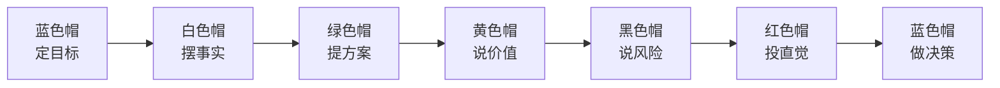

# 3.3 六顶思考帽方法
#### 目录介绍
- [01.吵了三小时没结论的会](#01吵了三小时没结论的会)
- [02.断点自测三问](#02断点自测三问)
- [03.六顶思考帽是什么](#03六顶思考帽是什么)
- [04.六顶帽子各自的含义](#04六顶帽子各自的含义)
- [05.团队讨论的标准流程](#05团队讨论的标准流程)
- [06.个人思考的使用方式](#06个人思考的使用方式)
- [07.两个真实案例演练](#07两个真实案例演练)
- [08.思考帽使用技巧](#08思考帽使用技巧)
- [09.这几个坑我踩过](#09这几个坑我踩过)
- [10.总结回顾这一节](#10总结回顾这一节)
- [11.后来发生的改变](#11后来发生的改变)
- [12.今天起改变三点](#12今天起改变三点)
- [13.课后作业思考下](#13课后作业思考下)
- [14.下一站金字塔汇报](#14下一站金字塔汇报)

## 01.吵了三小时没结论的会

那是我刚转管理岗第三个月。部门要决策一个非常重要的事：主力数据库要不要从 MySQL 迁到 TiDB。负责人拉了 8 个核心成员开会，我也在其中。

会议从下午 2 点开始。半小时后我就发现这场会要废了。A 同事在大谈「TiDB 的弹性扩展数据有多好看，能解决我们所有的扩容问题」；B 同事马上反驳：「你别瞎说，迁移失败的话你能负责吗？」C 同事插话：「我感觉这事不靠谱，直觉告诉我会出大问题」；D 同事冒出来：「要不我们再调研一下 OceanBase？」；E 同事：「你们有没有数据啊？光说没用！」

整个会议室像菜市场。**有人谈数据、有人谈风险、有人谈感受、有人谈新方案，所有人各说各的，谁也说服不了谁。**

三个小时后会议结束，没有任何结论。负责人脸色铁青地宣布「下周再开」。我走出会议室的时候，脑子里只有一个念头：「这种会再来三次，项目就崩了。」

下周二的复议会，空降的新总监来了。他看了一眼上次的会议纪要，皱了皱眉，然后做了一件让我至今印象深刻的事。他在白板上画了 6 个圆圈，分别填上白、红、黑、黄、绿、蓝六种颜色，然后说：「今天我们换个开法。每个阶段所有人只能讨论一种内容。前 5 分钟所有人只谈数据，谁夹带观点我打断；接下来 5 分钟所有人只说优点……」

会议在 30 分钟内结束，得出了清晰的结论：**采用渐进式迁移，新业务用 TiDB，老业务保持 MySQL，6 个月后评估**。

我当时整个人是震惊的。同样一群人、同样的话题，只是换了一种讨论结构，效率提升了 6 倍。会后我追上去问总监：「你这是什么方法？」他笑了笑：「德博诺的六顶思考帽，回去查一下。」下面这套救了我们部门会议效率的方法论，今天完整讲给你。

## 02.断点自测三问

四断点里的「事中会失控」，会议是重灾区。开一次没结论的会不仅浪费所有人 2 小时，还会让决策整体延后一周甚至一个月。用下面三问自测一下你团队最近的会议：

| 断点自测三问 | 你团队的会议 | 若答「否」意味着 |
| :--- | :--- | :--- |
| 讨论是「按角度」进行还是「凭直觉」乱抢话？ | □ 按角度 □ 乱抢话 | 思维混乱、效率低下 |
| 每场决策会都会同时看「风险」和「价值」吗？ | □ 都看 □ 只看一头 | 决策偏见严重 |
| 主持人有意识地控制节奏和收敛结论吗？ | □ 有 □ 没有 | 蓝色帽缺位，会议放飞 |

三问里有一个「否」，你就是在用「情绪流会议」代替「结构化会议」。六顶思考帽不是让你「戴帽子」，而是让所有人在同一时段只从同一个角度看问题，把混乱思维平行化。

## 03.六顶思考帽是什么

六顶思考帽（Six Thinking Hats）由英国心理学家爱德华·德·博诺（Edward de Bono）在 1985 年提出。他认为人在思考问题时应该把不同类型的思维分开进行，而不是混在一起。就像戴不同颜色的帽子一样，同一时间大家戴同一顶。

它解决的是一个非常朴素但普遍的问题：**同一时间大家用不同的思维方式思考同一个问题，导致混乱和争论**。

六顶帽子的角色分工，一张表看清：

| 帽子颜色 | 思维类型 | 核心问题 | 适用阶段 |
| :--- | :--- | :--- | :--- |
| 白色 | 事实与数据 | 已知信息是什么？还缺什么数据？ | 收集信息 |
| 红色 | 直觉与情感 | 直觉告诉我什么？ | 快速表达感受 |
| 黑色 | 风险与质疑 | 有什么问题和风险？ | 风险评估 |
| 黄色 | 乐观与价值 | 有什么好处和价值？ | 价值评估 |
| 绿色 | 创新与方案 | 有什么新想法？ | 头脑风暴 |
| 蓝色 | 管控与总结 | 该怎么组织讨论？ | 贯穿全程 |

## 04.六顶帽子各自的含义

**白色帽，事实与数据**。只谈事实和数据，不夹带观点和判断。比如「上个月用户留存率是 35%」「竞品的同类功能上线了 3 个月」这些都是白色帽的内容；「留存率太低了」不是白色帽的内容，因为它包含了判断。

**红色帽，直觉与情感**。允许你表达直觉、感受和预感，不需要给出理由。比如「我觉得这个方案用户不会买账」「我对这个项目有一种不好的预感」。红色帽的价值在于承认情感和直觉在决策中的作用，尤其经验丰富的人的直觉往往包含没被显性化的判断。

**黑色帽，风险与质疑**。专注于找出方案的问题、风险和隐患。比如「如果服务器宕机了怎么办？」「这个方案的成本可能超出预算」「历史上类似的项目都失败了」。黑色帽是最常被使用的帽子，但也是最容易被过度使用的帽子。

**黄色帽，乐观与价值**。专注于发现方案的优点、价值和机会。比如「这个方案能让用户体验大幅提升」「如果成功的话，我们能抢占市场先机」。黄色帽和黑色帽是一对搭档，确保你既看到风险也看到价值。

**绿色帽，创新与方案**。专注于创造性思维，提出新想法、新方案、新可能。比如「我们能不能换一种完全不同的技术方案？」「有没有可能和 XX 部门合作来降低成本？」绿色帽鼓励天马行空，暂时不考虑可行性。

**蓝色帽，管控与总结**。它是「帽子的帽子」，负责管控整个思考过程，决定什么时候戴什么帽子，最终做出总结。通常由会议主持人来扮演蓝色帽的角色。**蓝色帽缺位是会议失控的头号原因**。

## 05.团队讨论的标准流程

标准的六帽会议按下面的顺序推进：

关键规则只有一句：**同一时间所有人戴同一顶帽子**。当大家都在戴白色帽讨论数据时，不允许有人跳到黑色帽来质疑方案。这个简单的规则能大幅提升讨论效率。

时间上每顶帽子控制在 5-10 分钟。整场会议 40-60 分钟内可以完成一个中等复杂度的决策。会前把这套规则写进会议邀请里，会中在白板上贴 6 张彩色卡片，蓝色帽（主持人）负责控制节奏。

## 06.个人思考的使用方式

六顶思考帽不仅适合团队讨论，也适合个人独立思考。当你面对一个复杂决策时，可以依次戴上六顶帽子，从不同角度审视问题，避免思维偏见。

我自己每次面对重大决策（换工作、买房、孩子升学），都会先用六顶帽子在 A4 纸上过一遍，能挖出很多平时忽略的角度。操作方式很简单：

- 拿一张 A4 纸，横向对折两次划成 6 块
- 每块写一顶帽子的名字
- 每块用 3-5 分钟写下当前帽子视角下的所有想法
- 最后在 A4 纸背面写「蓝色帽结论」

一张纸 30 分钟，抵得上你在脑子里纠结一周。

## 07.两个真实案例演练

**案例一：是否将主力开发语言从 Java 迁移到 Go**

| 帽子 | 视角内容 |
| :--- | :--- |
| 白色 | Go 在性能测试中比 Java 快 30%，团队 15 人中只有 3 人有 Go 经验，迁移预计需 6 个月 |
| 红色 | 团队对学新语言既兴奋又焦虑，部分老成员担心自己跟不上 |
| 黄色 | 性能提升意味着节省 30% 服务器成本，Go 并发模型更适合业务场景 |
| 黑色 | 迁移期间可能影响需求交付，Go 生态不如 Java 成熟，招聘 Go 工程师更困难 |
| 绿色 | 渐进式迁移，新服务用 Go、老服务暂不迁移，同时组织全员 Go 培训 |
| 蓝色 | 采用渐进式迁移策略，新项目用 Go，先培训 3 个月再正式启动 |

**案例二：是否承接「6 个月做出 AI 智能客服」的高风险项目**

| 帽子 | 视角内容 |
| :--- | :--- |
| 白色 | 公司有 30 万客服工单数据，团队 0 人有 LLM 项目经验，预算 200 万 |
| 红色 | 团队整体兴奋（终于能做 AI 了），但 Leader 个人感觉风险偏大 |
| 黄色 | 成功后能为公司节省 60% 客服成本，团队进入 AI 赛道，个人简历加分 |
| 黑色 | 6 个月时间紧，团队完全没有 LLM 经验，模型效果可能不达预期，还有客户投诉风险 |
| 绿色 | 拆成两期，Q1 先做「AI 辅助人工」不替代，Q2 再做「全自动接管」 |
| 蓝色 | 接项目，但按绿色帽方案分两期推进，Q1 末设一个 Go / No-Go 决策点 |

可以看到，戴帽子的最大好处是你不会漏掉任何一个角度。如果没有黄色帽，团队可能只看风险就拒绝了；如果没有黑色帽，可能盲目接项目最后翻车。

## 08.思考帽使用技巧

第一，**每顶帽子的时间控制在 5-10 分钟**。时间太短讨论不充分，太长容易跑题。蓝色帽（主持人）负责控制时间和节奏，强烈建议用一个可见的倒计时器，时间到立刻切换。

第二，**黑色帽不要过度使用**。很多人天然倾向于找问题挑毛病，导致讨论变成「否定大会」。解决方法是确保黄色帽和黑色帽的时间相当，每次质疑一个风险后要求给出解决方案。

第三，**红色帽要快速**。红色帽讨论应该很短，每人 30 秒表达直觉感受即可，不需要解释理由，直觉本身就是信息。红色帽常常被低估，但实际上经验丰富的人的直觉，很多时候比数据更准。

第四，**顺序不是死的**。默认顺序是「蓝→白→绿→黄→黑→红→蓝」，但根据议题可以调整。比如做风险决策时可以「蓝→白→黑→绿→黄→红→蓝」，把风险前置。

第五，**蓝色帽必须有唯一人选**。这个人在会议全程只干一件事：控制节奏、切帽子、写结论。他不参与具体讨论，否则会瞬间失控。

## 09.这几个坑我踩过

在我用六顶思考帽的这几年里，踩过几个典型坑：

| 常见误区 | 具体表现 | 正确做法 |
| :--- | :--- | :--- |
| 没有蓝色帽 | 会议开着开着又乱了，大家又开始互怼 | 会前指定专职主持人，只管流程 |
| 帽子顺序死板 | 无论什么议题都用同一套顺序 | 风险类议题黑色帽前置，创新类议题绿色帽前置 |
| 允许「插话」 | 白色帽阶段有人蹦出观点，主持人不打断 | 白板上写规则，插话立刻被打断 |
| 黑色帽刷屏 | 大家都爱当「风险专家」，黄色帽只讲 2 分钟 | 强制黑黄时间相等，一比一 |
| 蓝色帽自己也发言 | 主持人忍不住加入具体讨论 | 主持人只写结论，全程不发表业务意见 |

其中最坑的是「没有蓝色帽」。我早期做过一次实验，让大家自己「注意戴什么帽子」，结果全程没人管，5 分钟之后又变回了菜市场。**六顶思考帽最大的价值不在六个帽子，而在那顶蓝色帽。**

## 10.总结回顾这一节

六顶思考帽的核心价值是「平行思维」，让所有人在同一时间从同一角度思考问题，避免思维混乱和争论不休。六个角度保证了思考的全面性，时间控制保证了讨论的效率。

我用六顶思考帽几年下来，发现它带来的不止是「开会更快」，更深的是三个改变：

- **告别情绪化讨论**。把「你说的不对」变成「我现在戴的是黑色帽，我看到的风险是……」，对事不对人。
- **让内向的人也能发声**。红色帽和绿色帽阶段非常适合平时不爱说话的人，强制让所有人参与。
- **决策质量提升**。再也不会因为漏掉某个角度而事后后悔。

## 11.后来发生的改变

回到开篇那场吵了三小时的会。从那位总监 30 分钟收尾的会议结束后，我做了下面这些改变。

我做的第一件事是把六顶帽子的简介贴在了显示器边上。每次自己思考一个问题前，强迫自己依次戴一遍六顶帽子。第一个被我用六帽法分析的，是「要不要主动申请带新人」这个决策。之前我只看到了「会占用我时间」（黑色帽），用六帽法之后我又看到了：黄色帽能锻炼我的管理能力对未来转岗管理有帮助；绿色帽可以把新人培养体系做成 SOP 反过来让我自己受益；红色帽直觉告诉我这是个好机会。我接了。半年后这个新人成了我团队的核心，让我个人产出翻倍。**如果不用六帽法，我大概率因为短期成本就拒绝了。**

接着我把六帽法引入了我自己组的所有技术评审。流程很简单：会前在会议邀请里就写明「本次会议采用六帽法，请按顺序准备」；会中白板上贴 6 张彩色卡片，蓝色帽（我）控制节奏；会后直接给出蓝色帽总结决策。效果非常明显：**我组的技术评审会平均时长从 2 小时降到 40 分钟，且决策返工率下降 70%**（之前经常评审完之后又被推翻重来）。

半年后部门做「360 反馈」调研，我被同事们提名为「会议效率最高的 Leader」。Leader 在反馈面谈时问我：「你怎么做到的？」我把六顶帽子的事讲给他听。后来这个方法被推广到了整个部门。最让我有成就感的是，那个曾经吵了三小时还没有结论的「主力数据库迁移」会议，从此再也没有出现过。所有重大决策会议都按六帽法的结构开，平均时长 40-60 分钟，且都能产生明确决策。

## 12.今天起改变三点

**第一，用六帽法分析一个你正在犹豫的决策**。选择一个你正在犹豫的决策，依次戴上六顶帽子分析。白色帽收集事实、红色帽感受直觉、黄色帽看好处、黑色帽看风险、绿色帽想方案、蓝色帽做总结。你会发现，这比「纠结来纠结去」高效得多。我自己第一次用就挖出了平时漏掉的两个关键角度。

**第二，下次团队讨论时引入六帽法**。在开始时说明规则：我们先用 5 分钟收集事实（白色帽），再用 5 分钟讨论价值（黄色帽），再用 5 分钟讨论风险（黑色帽）。这个简单的结构变化就能让讨论效率翻倍。特别推荐用六色卡片或彩色 PPT 给所有人可视化提示，效果立竿见影。

**第三，有意识地平衡你的黑色帽和黄色帽**。如果你发现自己习惯性地找问题、挑毛病（黑色帽过度），那就刻意多戴黄色帽，每提出一个质疑的同时也说出一个优点。反之亦然。**长期不平衡的人，要么会成为「杠精」，要么会成为「老好人」，两者都做不出好决策。**

## 13.课后作业思考下

1. 选一个你最近做过的重要决策，用六顶思考帽的方法重新分析一遍。你是否发现了之前遗漏的角度？
2. 观察你自己最常戴的是哪顶帽子（可能是黑色帽或红色帽），思考这对你的决策质量有什么影响。
3. 在下一次团队讨论中试用六顶思考帽方法，记录讨论的效率和结果质量与以往的差异。
4. 六顶思考帽和 3C 方案设计法（详见 2.8）可以如何结合使用？设计一个你自己的决策流程。

## 14.下一站金字塔汇报

六顶思考帽解决了「讨论怎么高效」的问题。但事中执行还有另一个关键节点：**讨论完了怎么向上汇报**。

同样一件事，有人 3 分钟把结论、依据、下一步说得干干净净；有人 30 分钟讲完，领导还听得一头雾水。差别不在信息量，而在结构。下一节讲金字塔汇报法，教你把再复杂的事，都能 30 秒讲清结论、3 分钟讲清逻辑、30 分钟讲透细节。
