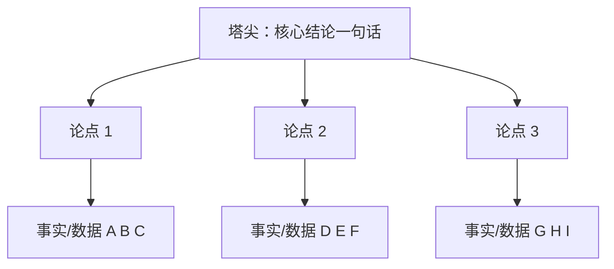

# 3.4 金字塔汇报方法
#### 目录介绍
- [01.被打断四次的季度汇报](#01被打断四次的季度汇报)
- [02.断点自测三问](#02断点自测三问)
- [03.汇报和总结不是一回事](#03汇报和总结不是一回事)
- [04.金字塔原理是什么](#04金字塔原理是什么)
- [05.金字塔四大原则](#05金字塔四大原则)
- [06.标准汇报的四段结构](#06标准汇报的四段结构)
- [07.写汇报的三招](#07写汇报的三招)
- [08.积木检查法验证](#08积木检查法验证)
- [09.这几个坑我踩过](#09这几个坑我踩过)
- [10.总结回顾这一节](#10总结回顾这一节)
- [11.后来发生的改变](#11后来发生的改变)
- [12.今天起改变三点](#12今天起改变三点)
- [13.课后作业思考下](#13课后作业思考下)
- [14.下一站STAR摸底](#14下一站star摸底)

## 01.被打断四次的季度汇报

那年我刚接手一个核心项目，第一次跟着部门 Leader 去给总监做季度汇报。我准备得非常用心：50 多页 PPT，从项目启动背景、整体进度、跨部门协作、技术细节、踩过的坑一项项往下讲。

讲到第 5 分钟，总监第一次抬头：「说重点。」

讲到第 12 分钟，总监第二次打断：「这些我都看到了，你最后想告诉我的是什么？」

讲到第 25 分钟，总监第三次发问：「你说团队很努力，那么具体的关键结果是什么？」

讲到第 40 分钟，他干脆把 PPT 关了：「这样吧，用一句话告诉我，这个季度你最想让我记住的是什么。」

我当场卡住了。我准备了 50 页 PPT，却答不出来「用一句话讲清楚什么」。走出会议室时，我手心全是汗。

会议结束后，部门 Leader 把我拉进小会议室，在白板上画了一座金字塔：最上面一行字「季度核心结论 1 句」，下面一层「3 个支撑论点」，再下面一层「每个论点 3 条数据/事实」。然后他对我说：「你不是没东西讲，是你没把东西按金字塔摆好。下次汇报，先在白板上画这座塔，塔尖是结论、塔身是论点、塔基是数据。摆完之后再开始写 PPT，永远先讲塔尖，永远不要从塔基讲起。」

那一刻我才意识到，**汇报不是「我做了什么」，汇报是「对方想听什么」**。从那天之后，我所有的汇报都先画金字塔再写一个字。后面这一节，就把那张救命的金字塔完整教给你。

## 02.断点自测三问

四断点里的「事中会失控」，汇报是最容易被低估的失控点。项目做得再好，讲不清楚等于没做。用下面三问自测一下你最近一次汇报：

| 断点自测三问 | 你最近一次汇报 | 若答「否」意味着 |
| :--- | :--- | :--- |
| 你能用一句话讲清楚汇报的核心结论吗？ | □ 能 □ 不能 | 没想清楚就来讲了 |
| 你的每个论点下面都有 3 条以上的事实/数据支撑吗？ | □ 有 □ 没有 | 观点悬空、听感空洞 |
| 汇报开头 30 秒内你有没有给出结论？ | □ 有 □ 没有 | 领导没耐心听下去 |

三问里有一个「否」，你的汇报就还停留在「把做过的事列一遍」阶段。金字塔汇报法的核心不是模板，而是**在写第一页 PPT 之前，先把这座塔画在纸上**。

## 03.汇报和总结不是一回事

先破除一个最常见的误解：**汇报的逻辑和总结的逻辑完全不同**。

| 维度 | 总结 | 汇报 |
| :--- | :--- | :--- |
| 目标对象 | 面向自己 | 面向领导 |
| 讲究点 | 个人贡献、事情价值、细节完整 | 团队结果、业务逻辑、关键突破 |
| 顺序 | 时间顺序（做了 A、做了 B） | 结论顺序（结果是 X、因为 1/2/3） |
| 密度 | 越全越好 | 越精越好 |

三个最常见的翻车场景都指向同一个根因：把总结当汇报讲：

- 领导打断：「不要讲这么多细节，挑重点讲！」（根因：缺乏重点信息提取）
- 领导点评：「感觉团队做了很多事情、也很辛苦，但没看到什么关键结果或突破！」（根因：忽略数据和成果）
- 大佬追问：「能不能用一两句话概括一下这一年的工作？」（根因：没有高度抽象的能力）

金字塔汇报法正是解决这三个问题的通用解药。它基于麦肯锡的金字塔原理，通过四个原则组织汇报内容，让你的汇报重点突出、逻辑清晰、主次分明。

## 04.金字塔原理是什么

金字塔原理是一种**重点突出、逻辑清晰、主次分明**的表达方式。核心思想：任何事情都可以归纳出一个中心思想，中心思想由 3-7 个论点支持，每个论点由 3-7 个论据支撑。层层往下延伸，形状像一座金字塔。

它背后是「结构化思维」的能力，把无序信息梳理为有序信息，并通过逻辑和框架有规律地拆解、细化、提炼、归因，最终找到有效解决方案。

金字塔原理不只是汇报方法，它是「思考+表达」的双重工具。会用金字塔的人写文档、发邮件、做 PPT、开会讲话都是一套结构，能显著提升表达效率与说服力。

## 05.金字塔四大原则

四大原则的关键含义、违反后果与实操要点，一张表看清：

| 原则 | 含义 | 违反后果 | 实操要点 |
| :--- | :--- | :--- | :--- |
| 结论先行 | 先说结论再说原因 | 领导没耐心听完 | 开头 30 秒必须给结论 |
| 自顶向下 | 上有结论、下有理由 | 结论缺乏支撑力 | 每个论点配 3-5 条数据 |
| 归类分组 | 同类信息归纳成组 | 信息零散难记忆 | 控制在 3-5 个分组 |
| 逻辑递进 | 同级内容有逻辑关联 | 听众感觉混乱 | 时间/空间/重要性/演绎四种顺序 |

**结论先行**是最重要的原则。如果你讲的内容比较多，别人找不到重要结论就没兴趣认真听；如果别人听完不明确结论或者把结论搞错了，你的汇报效果就大打折扣。具体做法：先重要（结论）后次要（结论）、先全局后细节、先总体后细分、先论点后论据、先结论后原因、先结果后过程。

**自顶向下**是让结论有说服力。光有结论是不行的，还要让别人信服。用下层信息支撑上层结论，上面有结论、下面有理由，结论概括理由、理由支撑结论，上下对应。

**归类分组**是控制信息量。汇报素材经常多到列几十行 Excel，直接讲下去谁都受不了。把类似的论点或论据抽象、归纳、提炼、总结成一组，最后形成 3-5 个分组。分组数量不要少于 3 个，少于 3 个说明分析可能不全面；不要多于 7 个，多于 7 个听众记不住。

**逻辑递进**是保证同级内容互相关联。所有逻辑关系都在四种顺序之内：时间顺序、空间顺序、重要性顺序、演绎顺序。同级内容要满足一致性（属于同一逻辑范围）和顺序性（按某种顺序排列）。比如「苹果、香蕉、葡萄、菠萝」都属于水果范围，牛奶不属于；「北上广深」既可以按地理位置从北到南排序，也可以按 GDP 从大到小排序。

## 06.标准汇报的四段结构

一个标准的汇报由下面 4 段组成，每段的目标和技巧不同：

| 段落 | 目标 | 技巧 |
| :--- | :--- | :--- |
| 总体结论 | 让领导整体上知道做得怎么样 | 1 句话核心结论 + 3 条分论点，PPT ≤ 3 页 |
| 具体分析 | 让领导相信论点真实有效 | 每个分论点配 3-5 条数据/事实 |
| 关键事项 | 展示做过的关键项目/突破 | 用全局大图、演进路径、时间轴呈现 |
| 总结改进 | 沉淀经验+明确下一步 | 改进措施必须真的准备做，下次会被追问 |

**总体结论**要在开头就形成印象。让听众第一时间知道整体表现（做得好、一般、不达预期、遇到很大困难）。

**具体分析**是让听众信任你的关键。同样按金字塔原理组织，每一条论点必须有数据支撑，不能停留在感觉。

**关键事项**是加分项，展示做过的标杆项目或业务突破。技术类汇报特别适合用架构演进图、时间轴、里程碑对比来呈现。

**总结改进**要谨慎写。不要拍脑袋、不要凑数。**列出来的改进措施一定是你接下来真的准备去做的**，因为下次汇报领导很可能会问「上次列的改进措施到底落实得怎么样」。

## 07.写汇报的三招

**第一招：地图写作法**。给领导呈现工作汇报有一个特别容易上手的结构：列清单。一二三四五要说什么清清楚楚，一打眼就能看明白。即使领导没时间看每件事说了什么，心中也有一个「地图」，大概说了 5 件事。**用结构化清单代替大段文字，整篇汇报会显得更简洁、更容易懂**。

**第二招：要事优先**。有时候结构已经很清晰，但领导扫两眼还是问「你的结论是什么？」这多半是开头没写好。做汇报时你总想先讲背景、讲思考过程，但领导可不这么想，他不耐烦、只想看重点。**汇报开头是黄金部分，一定要把最重要的行动方案、主张、观点全说出来**。领导带着结论去看方案，会更有针对性。

**第三招：事实说话**。汇报里凡是写观点必须有事实支撑。一篇汇报就像用积木搭一座塔，观点是最上面那块积木。观点想要站得住，下面每一块支撑的事实都得站得住。**只要有一个事实站不住，这块积木就塌了，整座塔可能就散了**。汇报最常见的第三大误区是「文字空洞」，就是不知道怎么把事实摆清楚。观点必须有数据、有案例、有对比、有量化。

## 08.积木检查法验证

写完汇报之后，还有一个关键动作：**积木检查法**。这是一种模拟领导阅读习惯的自检法。

领导的阅读习惯是从**框架 → 观点 → 事实**层层往下追。所以你要按同样顺序倒着回头查一遍：

| 检查层 | 检查动作 | 通过标准 |
| :--- | :--- | :--- |
| 塔尖（1 句话结论） | 遮住其他内容，只看这一句能不能让领导记住 | 能 |
| 塔身（3-5 个论点） | 每个论点是不是单独就能成立 | 都能 |
| 塔基（每个论点下的事实） | 每一条是不是有数据/案例/对比支撑 | 都有 |

心里装着一个画面：**只要有一块积木松动，整座塔就有可能塌**。写完汇报，一定要按这三层顺序倒过来自检一遍。这个动作平均只花 15 分钟，但能显著提升汇报被认可的概率。

## 09.这几个坑我踩过

金字塔汇报法学起来容易、用起来坑很多。我踩过的五个典型坑列在下面：

| 常见误区 | 具体表现 | 正确做法 |
| :--- | :--- | :--- |
| 直接从塔基讲起 | 上来就讲我做了什么细节 | 永远先讲塔尖那句话 |
| 塔尖藏在第 30 页 | 结论放在总结页，前面全在铺垫 | 结论移到第 1 页开头 |
| 论点堆砌 6 个以上 | 每个季度想显得做了很多 | 归纳到 3-5 个，其余作为附录 |
| 论点没有事实 | 「我们表现很好」但没有数据 | 每个论点配 3-5 条量化数据 |
| 改进措施凑数 | 为了显得会反思写了 6 条 | 只写真的准备做的 2-3 条 |

其中最坑的是「改进措施凑数」。我早期有一次在改进措施里写了「加强 code review 深度」，本意是显得反思充分。结果下季度汇报，总监第一句就问：「你上次写的加强 code review 深度，具体做了什么？」我当场哑口无言。**汇报里写下的每一条改进，下季度都会被回访。**

## 10.总结回顾这一节

金字塔汇报法一句话概括：**先讲结论、再讲分组论点、每个论点用 3-5 条事实/数据撑住。讲不出一句话总结的汇报，本质上都没准备好。**

三条最关键的实操：

- **开头 30 秒必须给结论**。给不出结论，等于浪费领导时间。
- **论点必须有数据支撑**。没数据的论点，听感等于空话。
- **写完永远倒过来检查**。用积木检查法逐层确认，观点下面都有事实撑住。

金字塔汇报法基于金字塔原理，包括 4 条基本原则（结论先行、自顶向下、归类分组、逻辑递进），标准汇报内容包括 4 个部分（总体结论、具体分析、关键事项、总结改进），关键事项一般使用全局大图、演进路径和时间轴等技巧呈现。

## 11.后来发生的改变

那次惨败之后的第一周，我做了一个看起来很笨的改变：**所有需要写的汇报，都不再直接打开 PPT，而是先在工位的小白板上画一座金字塔**。塔尖写一句话总结、塔身写 3 个论点、塔基写每个论点的支撑数据。第一次画的时候花了我整整 2 小时，因为我发现根本写不出「一句话总结」。这恰恰说明我之前 50 页 PPT 都没有真正想清楚。等我硬憋出那句话之后，PPT 反而 30 分钟就写完了。

接下来一个月，我把「结论先行」的原则贯彻到所有沟通里：周报第一行永远是「本周关键结论：XX」；IM 找 Leader 同步，第一句永远是「老板，下面 3 件事，结论已经先告诉您」；汇报 PPT 第一页永远是「本季度一句话总结 + 3 条分论点」。效果立竿见影：Leader 回复速度变快了，跨部门同事追问变少了，最让我意外的是有一次部门评会，总监指着我的 PPT 说「这页就该是大家汇报的标准范本」。

3 个月后，我又一次给那位总监做汇报。打开 PPT 第一页就是一句话：「本季度核心成果：项目按时上线 + 关键指标超预期 18% + 沉淀 2 套可复用方法论。」然后 3 张分论点页面、每张配 3-5 条数据。整个汇报 25 分钟，**总监一次都没打断**，听完只问了一个问题：「下一步你打算怎么扩展到其他业务线？」那一刻我清楚地知道，上次那座没画好的金字塔，这次终于稳稳地立住了。

## 12.今天起改变三点

**第一，任何汇报先画金字塔再写 PPT**。从下次汇报开始，永远先在白纸或白板上画一座塔：塔尖 1 句话核心结论、塔身 3 个论点、塔基每个论点下 3-5 条数据。写不出塔尖那句话就先别写 PPT，说明你自己都还没想清楚。这一步是所有汇报的核心。

**第二，写汇报用地图写作法**。先列出清晰的结构：要说几件事、每件事的要点是什么，让读者一目了然。不要写大段大段的文字，用 1、2、3 来组织信息，让领导像看地图一样快速定位到他关心的内容。地图清晰，读者的注意力就不会流失。

**第三，写完用积木检查法自检**。逐一检查每个观点是否都有具体事实和数据支撑。如果某个观点下面缺少事实支撑，要么补充数据，要么删掉这个观点。**一块积木不牢，整座塔都会塌。**

## 13.课后作业思考下

1. 找出你最近一次工作汇报（PPT 或文档），用金字塔原理的四大原则逐一检查：有没有结论先行？结构是否自顶向下？信息是否归类分组？同级内容是否有逻辑顺序？
2. 练习「一句话概括」的能力：用一句话概括你这个月/这个季度/这一年的核心工作成果。如果做不到，说明你对自己的工作缺乏高度抽象的能力。
3. 用金字塔汇报法重新组织一次你过去的工作汇报，对比修改前后的效果差异。
4. 找一篇你认为写得很好的工作汇报（可以是同事的，也可以是网上的范例），分析它是如何运用金字塔原理的。

## 14.下一站STAR摸底

金字塔汇报解决了「向上汇报」的表达问题。但事中执行还有一个高频场景：**当领导让你「摸摸底」某件事、某个人、某个模块的时候，你怎么快速摸清楚？**

比如「你去了解一下 A 项目上季度到底为什么延期」「你摸一下 B 团队现在的负载情况」，这类摸底任务如果没有结构，很容易变成东问一句西问一句、最后自己也说不清。下一节讲 STAR 摸底分析法，教你 4 步问完就能出结论。
