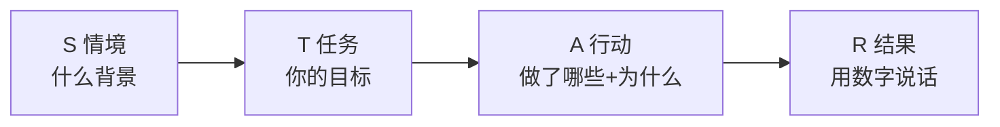

# 3.5 STAR摸底分析法
#### 目录介绍
- [01.面试被打断两次的挫败](#01面试被打断两次的挫败)
- [02.断点自测三问](#02断点自测三问)
- [03.STAR法则是什么](#03star法则是什么)
- [04.四个字母的关键问答](#04四个字母的关键问答)
- [05.面试场景应用](#05面试场景应用)
- [06.工作汇报与复盘应用](#06工作汇报与复盘应用)
- [07.STAR的三条底线](#07star的三条底线)
- [08.STAR的局限性](#08star的局限性)
- [09.这几个坑我踩过](#09这几个坑我踩过)
- [10.总结回顾这一节](#10总结回顾这一节)
- [11.后来发生的改变](#11后来发生的改变)
- [12.今天起改变三点](#12今天起改变三点)
- [13.课后作业思考下](#13课后作业思考下)
- [14.下一站五步问题处理](#14下一站五步问题处理)

## 01.面试被打断两次的挫败

那是我第一次跳槽，面试一家心仪的公司。聊到一半，面试官放下水杯，看着我说：「讲一下你做过最有挑战的一个项目吧。」

我心里一喜，这题我准备过。然后我一开口就开始说：「我们当时做了一个 HR 系统，里面有考勤、薪资、福利……」

我讲了大概七八分钟，从需求讲到技术选型，从联调讲到上线，越讲越急，怕漏掉哪个细节。结果面试官打断我两次：第一次「等一下，你在这个项目里具体负责什么？」第二次「你说效果好，好在哪？有数据吗？」我支支吾吾，半天答不上来。出门那一刻，我就知道这家凉了。果然第二天 HR 礼貌性地告诉我：「综合评估后……」

复盘的时候我找了一个做 HRBP 的前辈吃饭，把刚才的回答原模原样背给她听。她笑了笑，掏出一张餐巾纸，写了 4 个字母：**S — T — A — R**。她让我用这 4 个字母把刚才那段话重讲一遍。我憋了三分钟，重新组织：

- **S**：公司 800 人规模，HR 用 Excel 管考勤，每月 3 天加班对账，错误率 5%。
- **T**：我作为后端 Owner，负责 HR 系统从 0 到 1 的考勤模块，上线后错误率要降到 1% 以下。
- **A**：我做了三件事，梳理 12 类异常考勤场景、设计补卡审批流、推动 HR 培训。
- **R**：上线 3 个月，月度对账时间从 3 天降到 4 小时，错误率 0.6%，HR 满意度从 65% 升到 92%。

讲完那一刻我自己都愣住了。同样一段经历，结构变了，**份量也变了**。前辈说：「这就是 STAR。它不是模板，是让你学会站在听者角度讲故事。」下面这套 STAR 摸底分析法，就是那次教训之后我反复打磨、用在面试、汇报、复盘里的方法论。

## 02.断点自测三问

事中执行有一个隐形考场：**你什么时候能被别人「摸清楚」**。面试是摸底、汇报是摸底、跨部门第一次沟通也是摸底。摸底摸不清楚，往往不是你能力不够，而是结构不对。用三问自测：

| 断点自测三问 | 你最近一次讲经历 | 若答「否」意味着 |
| :--- | :--- | :--- |
| 你讲的是「我」还是「我们」？ | □ 我 □ 我们 | 个人贡献混在团队里被稀释 |
| 你的行动有没有讲清「为什么这么做」？ | □ 讲了 □ 只讲了做什么 | 只有动作没有判断力 |
| 你的结果有没有具体数字？ | □ 有 □ 没有 | 结果听起来像空话 |

三问里有一个「否」，你的表达就还停留在「讲故事」阶段，没进化到「讲经历」阶段。STAR 的价值不是四个字母，而是逼你把每段经历拆成「背景+个人任务+关键行动+量化结果」。

## 03.STAR法则是什么

STAR 是四个英文单词的首字母缩写：**S**ituation（情境）、**T**ask（任务）、**A**ction（行动）、**R**esult（结果）。它最早是面试官为收集信息设计的一套逻辑框架，后来被沿用到工作汇报、项目复盘、跨部门摸底等结构化表达场景中，成为讲清一段经历的通用骨架。

它解决的核心问题是：**为什么同一段经历，有的人讲完让人觉得「靠谱、可复用」，有的人讲完让人觉得「说了半天没重点」**。答案不在内容多寡，在四个格子是否填满。

四步前后呼应，听者才能在脑中「看见」你在那段经历里真实存在的样子，而不是一个含糊的「我们做了一个项目」。

## 04.四个字母的关键问答

四个字母各自的核心问题，一张表看清：

| 字母 | 中文 | 核心问题 | 常见失误 |
| :--- | :--- | :--- | :--- |
| S | 情境 | 做这件事的初衷是什么？项目背景是什么？ | 背景讲太长（超过总时长 20%） |
| T | 任务 | **你**承担的具体目标是什么？ | 说「我们」不说「我」 |
| A | 行动 | 你采取了哪些步骤？为什么这么选？ | 只讲做什么不讲为什么 |
| R | 结果 | 最终产出与目标差多少？（用数据说话） | 只有形容词没有数字 |

**S 情境**要短。它是背景交代，30 秒内讲完，让听者明白「这事发生在什么条件下」即可。如果 S 讲了 3 分钟，听者已经失去耐心听 A 了。

**T 任务**是最容易掉坑的字母。90% 的人会说「我们的目标是……」，但听者要听的是**你的**任务：在这个项目里，你个人负责的具体边界是什么？你和其他人的分工在哪？

**A 行动**是重心，占总时长 50% 以上。行动的关键不是「做了什么」，而是「为什么这么做」。凡是没有「为什么」的行动，都只是执行；带上「为什么」，才叫判断。

**R 结果**必须有数字。**没数字的结果就像没盐的菜，听完不留印象**。哪怕数字不够漂亮，也远比「效果不错」「反响很好」这种模糊表达有说服力。

## 05.面试场景应用

面试是 STAR 最经典的战场。面试官问「讲一个你做过最有挑战的项目」时，本质是在做 STAR 摸底。你有没有清晰的四段结构，直接决定评级高低。

以 01 节的 HR 系统为例，标准 STAR 回答控制在 3 分钟：

| 阶段 | 时长 | 内容 |
| :--- | :--- | :--- |
| S | 30 秒 | 800 人公司用 Excel 管考勤，月对账 3 天、错误率 5% |
| T | 20 秒 | 我作为后端 Owner，负责考勤模块，上线后错误率降到 1% 以下 |
| A | 90 秒 | 三件事：梳理 12 类异常场景、设计补卡审批流、推动 HR 培训。每件事讲一句「为什么」 |
| R | 30 秒 | 对账 3 天→4 小时，错误率 5%→0.6%，HR 满意度 65%→92% |

**面试 STAR 有一个隐藏加分项：讲完 R 后加一句「我的能力增量」**。比如「这段经历让我从『能写业务代码』变成『能主导小型模块从 0 到 1』」。这句话是很多面试候选人漏掉的、但面试官非常在意的信号。

## 06.工作汇报与复盘应用

STAR 不只是面试专用，它同样适合工作汇报和项目复盘。以「组织员工旅游」这个非技术场景为例：

**S 背景**。员工长时间工作压力大，团队凝聚力偏弱，公司决定在暑假举办一次员工旅游，目标是改善沟通协作、提升满意度。

**T 任务**。作为 HR 部门经办人，我负责策划和组织这次活动，覆盖目的地选择、行程安排、预算控制、现场执行四条主线。

**A 行动**。一是先做员工偏好调研，收集目的地和形式期望；二是与三家旅行社比价比方案，最终选出兼顾员工需求和公司预算的组合；三是制定详细行程、提前锁定住宿交通、召开行前会讲清安全须知；四是活动期间全程跟队，及时处置突发情况。

**R 结果**。参与率 90%，活动满意度 95%，事后一个季度的内部效率指标提升 10%，还沉淀出一份可复用的《员工活动组织 SOP》，这对我个人来说，是把「办一次活动」变成了「能办任何一次活动」的能力。

从这个例子能看到，STAR 不是技术圈的专利。**任何一段「你参与过、你负责过、你交付过」的经历，都可以套进这四个格子里**，把口头汇报升级成有信息密度的表达。

## 07.STAR的三条底线

结构讲完，最容易被忽略的是「讲述姿态」。同样一套 STAR，有人讲完像团队合影，有人讲完像个人特写，差别就在下面这三条底线上：

**第一，永远讲「我」，不讲「我们」**。听者想听的是你个人的贡献，不是团队的合影。凡是「我们做了……」的地方都要改成「我负责……」「我具体做了……」。团队协作是背景，个人边界才是重点。

**第二，行动要有「为什么」**。A 不只是动作清单，更要解释你为什么这么选。比如「我选择用消息队列而不是直接调用，是因为下游服务稳定性不足，需要有缓冲」。有为什么的行动才凸显判断力。

**第三，结果一定要有数字**。R 必须有量化。哪怕这个数字是「用户投诉从月均 30 单降到 5 单」这种非常朴素的数字，也远比「用户反馈很好」有力。没数字的结果无法验证，等于自说自话。

一句话总结这三条底线：**不要讲「我们做了什么」，要讲「在什么背景下，我承担了什么任务，做了哪几件具体的事，最后产生了哪些可以被量化的结果」。**

## 08.STAR的局限性

STAR 的四个格子既是脚手架，也可能成为紧箍咒。它有两个明显的局限：

**一是机械填空反而扣分**。一旦你只是机械地往里填字，听者一耳朵就能听出你在「背模板」，反而显得没有真情实感。避免的办法是**熟到「无意识使用」**：把 3-5 段核心经历写成 STAR 卡片，每张 200 字，反复讲熟。等你不再想「我现在讲到 T 了」的时候，才是真正会用 STAR。

**二是只适合讲已经发生的事**。它不擅长展示前瞻性思考，面对头脑风暴、方案探讨这类面向未来的场景，OST（目标-策略-战术）或 5W2H 会更顺手。**用 STAR 讲过去，用别的框架谈未来**，是最省心的分工。

## 09.这几个坑我踩过

在我用 STAR 的这几年里，踩过五个典型坑：

| 常见误区 | 具体表现 | 正确做法 |
| :--- | :--- | :--- |
| S 讲太长 | 背景讲 2 分钟，A 和 R 只剩 30 秒 | S 严格控制在总时长 20% 以内 |
| T 说「我们」 | 「我们的目标是提升 30%」 | 「在这个项目里我负责其中的 XX 模块」 |
| A 只有动作没有为什么 | 「我先做了 A，然后 B，最后 C」 | 每一件事后面加一句为什么 |
| R 只有形容词 | 「效果很好」「反响不错」 | 前后对比数据+提升百分比 |
| STAR 卡片没提前准备 | 现场编 → 结构混乱 | 3-5 段核心经历写成 200 字卡片 |

其中最坑的是第五条。**STAR 不是现场发挥的方法，是提前熟练的方法**。你必须在面试或汇报之前，把自己 3-5 段代表性经历各写成一张 STAR 卡片，反复讲到能脱稿。否则临场再套模板，一定会说结巴。

## 10.总结回顾这一节

STAR 是一个把「一段经历」讲清楚的通用骨架。核心是把无结构的口头表达升级成「情境+个人任务+关键行动+量化结果」四段结构。

- **S 短而清**：30 秒讲完背景。
- **T 讲个人**：只讲「我」，不讲「我们」。
- **A 讲判断**：每个动作都要有「为什么」。
- **R 讲数字**：没有数字的结果等于没有结果。

STAR 最典型的三个应用场景是**面试回答、工作汇报、项目复盘**。它最大的价值不在于「四个字母」，而在于逼你**站在听者角度**重新组织已经发生的事，让听者能在脑中「看见」你在那段经历里的真实存在。

## 11.后来发生的改变

那次面试失败后，我做的第一件事是把过去 3 年里最有代表性的 3 个项目（HR 系统、监控告警平台、移动端启动优化），分别用 STAR 写成了 3 段 200 字以内的小卡片。每段都强迫自己回答四个问题：这件事的背景是什么？为什么要做？我承担的具体任务是什么？我做了哪 3 件最关键的事？最后的数字是什么？写完读出声给老婆听，她听不懂技术，但听完能复述大概，那我就知道讲清楚了。

两个月后我再次面试，又是那道老题：「讲一个最有挑战的项目」。我深吸一口气按 STAR 讲：背景（30 秒）→ 任务（20 秒）→ 行动（90 秒，重点）→ 结果（30 秒，全是数字）。三分钟讲完，面试官点了点头：「数据很扎实，可以再往下聊技术细节吗？」那场面试我拿到了 offer，且评级比预期高一档。HR 反馈里有一句话我印象很深：**「表达结构清晰，能听到他自己干的事。」**

我后来带了一个 5 人小团队。每周周会，我让每个人用 STAR 讲一件本周最有价值的事：背景一句话、任务一句话、行动三件事、结果三个数字。刚开始大家不习惯，觉得「太刻板」。但坚持一个月后，团队季度汇报的质量肉眼可见地提升，leader 反馈说：「你们组的汇报，听着特别有信息密度。」我心里偷笑，这不就是当年那张餐巾纸救我命的方法么。

## 12.今天起改变三点

**第一，今天就选 3 个你做过的代表性项目，用 STAR 各写一张 200 字卡片**。背景是什么？你的任务是什么？你采取了什么行动？最终结果如何？写完后大声读一遍，检查逻辑是否通顺、数据是否具体。这些素材无论是面试、汇报还是晋升答辩，都能直接使用。

**第二，日常工作汇报有意识地融入 STAR 结构**。下次向领导汇报项目进展时，不要零散地说「我做了 ABC」，而是用 STAR 的结构来组织：「在 XX 背景下（S），我负责 XX 任务（T），采取了 XX 措施（A），最终取得了 XX 结果（R）」。这种结构化表达会让你的汇报更有说服力。

**第三，建立你自己的 STAR 素材库**。准备一个文档，每完成一个有价值的项目或任务，就用 STAR 法则记录一条。积累半年后你就会有一个丰富的素材库，无论是写年终总结、准备面试还是晋升答辩，都能随时调用。别等要用的时候才去写，那时候记忆早模糊了。

## 13.课后作业思考下

1. 用 STAR 法则描述你在当前工作中最有成就感的一个项目。注意：结果部分一定要有具体数据支撑。
2. 找一篇你之前写过的项目总结，用 STAR 法则重新组织一遍。对比修改前后，看看哪个版本更清晰更有说服力。
3. 模拟一个面试场景，让朋友用 STAR 法则向你提问一个问题（如「请描述你解决过的最复杂的技术问题」），练习你的 STAR 回答。
4. 对比 STAR 法则和金字塔汇报法（详见 3.4），思考它们各自更适合什么场景。你能总结出使用规则吗？

## 14.下一站五步问题处理

STAR 是「用来讲清一件事」的方法。但事中执行还有一个高频场景：**你不是要讲一件事，而是要立刻处理一个问题**。

比如线上告警、客户投诉、跨部门爆掉的项目，这类情况下你没时间套模板，需要一套快速「诊断+决策+落地」的处理流程。下一节讲五步问题处理法，教你从告警响起到问题闭环，5 步走完不留隐患。
