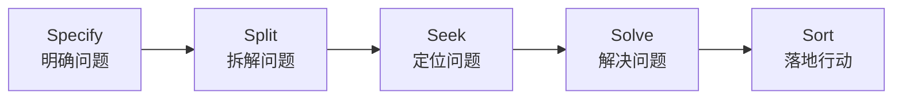

# 3.6 五步问题处理法
#### 目录介绍
- [01.干了三个月没数字的组长](#01干了三个月没数字的组长)
- [02.断点自测三问](#02断点自测三问)
- [03.5S问题处理法是什么](#035s问题处理法是什么)
- [04.第一步 Specify 明确问题](#04第一步-specify-明确问题)
- [05.第二步 Split 拆解问题](#05第二步-split-拆解问题)
- [06.第三步 Seek 定位问题](#06第三步-seek-定位问题)
- [07.第四步 Solve 解决问题](#07第四步-solve-解决问题)
- [08.第五步 Sort 落地行动](#08第五步-sort-落地行动)
- [09.这几个坑我踩过](#09这几个坑我踩过)
- [10.总结回顾这一节](#10总结回顾这一节)
- [11.后来发生的改变](#11后来发生的改变)
- [12.今天起改变三点](#12今天起改变三点)
- [13.课后作业思考下](#13课后作业思考下)
- [14.下一站五问根因](#14下一站五问根因)

## 01.干了三个月没数字的组长

那年我刚被提为小组长，老板交给我一句话：「最近团队效率好像不太行，你想想办法。」

我兴冲冲接下来后，连夜列了一堆动作：搞团建、改周会节奏、推代码规范、加自动化脚本、引入新工具、做内部分享。一口气干了 3 个月，自我感觉爆棚。结果季度复盘那天，老板一脸认真地问我：「那你说说，这 3 个月之后，『效率低』这个事情有没有变好？变好了多少？」

我沉默了 5 秒，憋出一句：「感觉……应该好了一点？」老板没笑，反问我：「**你连『效率低』到底是什么意思都没定义清楚，你怎么知道有没有变好？**」

那一刻我才意识到，过去 3 个月我做了一大堆事，但这些事没有任何一个能被衡量、能被验证、能被回答「问题真的解决了吗」。

老板在白板上写下 5 个字：**明、拆、定、解、落**，然后告诉我：「任何一个问题，缺一步都不行。先把问题明确下来（明），再把它拆成能下手的子问题（拆），追到根因（定），用 3C 给方案（解），最后挑 TOP3 落地（落）。」

后来我把这 5 个字记在工位上整整一年。再做「团队效率低」这件事，我先用调查问卷把「效率低」量化成「会议占比 35%、需求变更率 50%、发布耗时 4 小时」3 条具体数字，再分别拆解、定位、给方案、落地。3 个月后这 3 个数字分别变成了 18%、22%、1 小时。**这一次，老板没再问「有没有变好」。**

后面这一节我要分享的，就是把那 5 个字真正用起来的方法，5S 问题处理法。

## 02.断点自测三问

事中执行最容易失控的场景，是「你接到一个模糊的问题，直接一头扎进去」。用三问自测你最近一个正在处理的问题：

| 断点自测三问 | 你最近这个问题 | 若答「否」意味着 |
| :--- | :--- | :--- |
| 你能用一个具体的数字定义这个问题吗？ | □ 能 □ 不能 | 问题都没定义清楚就开干 |
| 你追到过这个问题的根因了吗（追到 3 层以上）？ | □ 追到 □ 没追 | 只在表面打转 |
| 你有没有把要做的事收敛到 TOP3？ | □ 收敛了 □ 没收敛 | 事情多而无重点 |

三问里只要有一个「否」，说明你还在「凭手感处理问题」，缺一步问题就在那一步原地复活。5S 就是让你把这 5 步一步不落地走完。

## 03.5S问题处理法是什么

处理问题就像大夫看病。光是看出来患者的病根在心脏还不够，还要明确心脏到底出了什么毛病、只用服药还是需要做手术、如果要做手术具体要怎么操刀。

问题处理是一个复杂的系统工程，既反映你的专业能力，又反映你的综合能力。所以问题既有可能成为拖垮你绩效的陷阱，也有可能成为你晋升的机遇，关键在于你如何有效地去处理。

很多人处理问题的方式是这样的：尝试一种解决方案失败了，再尝试另一种又失败了，然后再重复尝试。这种方式非常低效。最好的方式是建立一个思维框架，然后在这个框架上不断练习自己解决问题的能力。

5S 问题处理法就是这样一个框架，五步一字都不能少：

五步各自的核心动作和高频错误一张表看清：

| 步骤 | 英文 | 核心动作 | 常见错误 |
| :--- | :--- | :--- | :--- |
| 明 | Specify | 用数据量化问题 | 不定义就行动 |
| 拆 | Split | 大问题拆为独立子问题 | 一个人硬扛 |
| 定 | Seek | 5W 追问到根因 | 只看表面原因 |
| 解 | Solve | 用 3C 出多套方案 | 只给一个方案 |
| 落 | Sort | 按优先级挑 TOP3 落地 | 眉毛胡子一把抓 |

5S 不是孤立工具，它是 **5W（详见 3.7）+ 3C（详见 2.8）+ PDCA（详见 3.1）** 三件套的上层调度框架。

## 04.第一步 Specify 明确问题

有个朋友曾经遇到过这样的情况：领导跟他说，最近团队士气好像不高。他立刻分析了 8 点原因，并提出了针对性的改进意见，还觉得自己反应很快、能力很强。然后领导就让他负责提升士气，于是他组织培训和团队活动，搞各种评奖，推出各种新制度，干了一大堆事。半年后老板说：「感觉士气还是没什么变化。」

这是很多人都会犯的第一个错误：**问题本身都没有明确定义，就直接开始采取行动**。结果就是你做了很多事情，但无法衡量。

问题分三类，量化方式各不相同：

| 问题类型 | 举例 | 处理方式 |
| :--- | :--- | :--- |
| 已经用数据量化 | 「留存率下降 15%」 | 确认数据是否准确（源数据/计算是否出错） |
| 可量化但没量化 | 「业务增长放缓」 | 补上量化环节（100%→60% 还是 10%→6%？） |
| 无法直接量化 | 「团队士气不高」 | 用调查问卷综合多数人的主观感受 |

数据类问题不要因为「数据不会撒谎」就直接开干，源数据可能出错、计算过程可能出错、口径可能对不上。

模糊类问题必须先跟提出方对齐指标。老板说「利润增长速度不满意，希望更快」，你就要明确：老板关注的是季度增长率还是月增长率？「更快一些」具体是多快，20% 还是 50% 还是 200%？

主观类问题最棘手，一是可能只是领导个人感受、不代表真实存在；二是改善效果难以衡量。解法是用调查问卷把主观感受量化成分数，比如满意度从 65 分升到 85 分。

## 05.第二步 Split 拆解问题

明确问题之后，很多人急着分析原因。这就是第二个常见错误：**把自己当成拯救世界的超级英雄，以为可以一个人搞定所有的事情**。

如果问题很简单，一个人干确实可以。但大部分问题很复杂，甚至有些看起来简单的问题实际涉及多方，一个人分析一个月都搞不定。

拆解问题的做法是对问题做初步分析，把大问题拆解为几个独立的子问题，然后根据子问题的数量和规模，看看是否需要申请更多人力资源来一起参与。

拆解维度和小技巧：

| 问题类型 | 拆解维度 |
| :--- | :--- |
| 业务类问题 | 按业务类型拆、按客户群体拆 |
| 管理类问题 | 按流程拆、按事项分类拆 |
| 技术类问题 | 按模块拆、按调用链拆 |

拆解的三条通用原则：**子问题数量 2-5 个**（超过 5 个很难保证互相独立）、**子问题尽量互相独立**（避免解决 A 时又踩到 B）、**明确子问题负责人**（组成工作组、定期向上汇报）。

举两个例子。电商业务的「订单数下降 30%」，可以按业务类型拆，「男装下降 20%」「鞋类下降 30%」「食品下降 20%」，其他品类还在增长。于是一个大问题变成 3 个可以分别处理的子问题。又比如「团队研发效率不高」，调研发现反馈最多的前 4 个是「会议太多」「测试环境不足」「发布太麻烦」「需求变更太频繁」，一个人扛不下就分别找项目经理、测试负责人、运维负责人、产品负责人。

## 06.第三步 Seek 定位问题

半年的业务买量数据不升反降，老板让运营负责人赶紧想办法。他连夜构思方案，提出了几个大展拳脚的做法，比如 SEO 优化、增加更多渠道等。老板批准其中 3 个方案，半年后一看，投入多了几千万，买量数据却没起色，老板脸色很难看。

这就是第三个常见错误：**没有找到根本原因，就急于给出解决方案**。只找到表层原因，方案就无法从根本上解决问题，只能白白浪费时间和资源。

定位环节的核心工具是 **5W 根因分析法**（详见 3.7）：连续追问 5 个「为什么」，追到能被本团队改变的那一层为止。

以「加班太多导致士气不高」为例，沿两条线索追问，可能得到两个截然不同的根因：

**线索一：招聘方向**

- 为什么士气不高？加班太多。
- 为什么加班太多？人力不够。
- 为什么人力不够？招聘困难。
- 为什么招聘困难？市面上的 Go 程序员太少。
- 对应方案：招聘 C/C++ 程序员然后培养成 Go 程序员。

**线索二：流程方向**

- 为什么士气不高？加班太多。
- 为什么加班太多？项目执行混乱。
- 为什么项目执行混乱？没有项目经理。
- 对应方案：招聘专职项目经理。

同一个问题不同线索会导向完全不同的根因和方案。5W 的作用不是「一定要问满 5 层」，而是**逼你不停留在第一层**。

## 07.第四步 Solve 解决问题

定位出根本原因之后，就要提出解决方案。方案往往涉及资源投入（增加广告预算）、组织调整（成立专项小组）、系统增强（增加配置检查功能），所以需要上级的认可和支持。

这时很多人犯第四个错误：**思维局限，只做一个方案提交给上级**。你信心满满交上去，本来希望得到赞赏，结果发现上级有更多想法或不同方案，反而认为你考虑得不周全。

正确做法是提供多个方案，并给出建议方案和原因，最终让上级来挑选和拍板。这就是 **3C 方案设计法**（详见 2.8）：至少提出 3 个方案（保守/主推/激进），逐一列出优劣、成本、风险，最后给出你推荐的那一个并说明理由。

3C 的好处是：一方面让上级有「参与决策」的空间，另一方面万一你推荐的方案后来出问题，你已经在选型时暴露了所有风险，责任归属清晰。

## 08.第五步 Sort 落地行动

方案得到批准后就要落地执行。很多人在这一步犯第五个错误：**做事没有重点和优先级，眉毛胡子一把抓**。

在前面的步骤中，你可能拆解出 3 个子问题，每个子问题分析出 2-3 个根因，每个根因分别给出对应方案，接着每个方案又可以分成 3-5 件事。最后你发现可以做的事情有几十件。

如果你把这几十件事全都记在 Excel 里从第一件开始一件一件做，结果很可能是几个月过去还看不到什么效果。**领导并不关心你做了多少件事，他们关心的是问题有没有真正解决。**

优先级排序的技巧：

| 场景 | 优先级策略 |
| :--- | :--- |
| 单团队 | 挑 TOP3-5 事项集中做 |
| 多团队 | 挑 TOP10，每队负责 2-3 件 |
| 短期 | 按紧急程度排序 |
| 长期 | 按重要程度排序 |
| 分阶段 | 前 3 月 TOP3 是 ABC，后 3 月 TOP3 是 XYZ |

举例：「运营配置 URL 出错」这个问题，短期 TOP 事项可以是「上线流程优化」让测试来检查运营配置的内容；长期 TOP 事项可以是「后台管理系统优化」增加配置 URL 合法性和有效性检查功能。**短期止血，长期治本，两条线并行。**

## 09.这几个坑我踩过

5S 五步走下来，每一步都有典型坑。我踩过的五个坑总结在一张表里：

| 常见误区 | 具体表现 | 正确做法 |
| :--- | :--- | :--- |
| 明还没做完就开始解 | 老板说「效率低」立刻开搞 | 先花 10 分钟量化问题 |
| 独自硬扛 | 40 件相关的事一个人做 | 拆 2-5 个子问题+找责任人 |
| 追一层就停 | 「加班多」直接归咎「人不够」 | 至少追 3 层根因 |
| 只给一个方案 | 「我建议就这么做」 | 至少 3 个方案给上级选 |
| 列 30 件事挨个做 | 事情多做完也看不到效果 | 单团队 TOP3-5、多团队 TOP10 |

其中最坑的是第一条。「明还没做完就开始解」几乎是所有瞎忙的起点。**你如果没有把问题用数字定义清楚，你根本没法在结束时回答「问题有没有解决」这个问题。**

## 10.总结回顾这一节

5S 问题处理法 = **明、拆、定、解、落**。5 个字一字不能少，少哪一步，问题在那一步原地复活。

三条最关键的实操提醒：

- **千万不要在「明」还没做完的时候就开始「解」**。所有的瞎忙都从这里开始。
- **5S 不是孤立工具**。它是 5W + 3C + PDCA 三件套的上层调度框架。
- **落地永远 TOP3**。不要列 30 件事，你做不到，老板也不关心。

处理问题时容易犯的 5 个错误：问题本身都没有明确定义就直接开始采取行动；把自己当成拯救世界的超级英雄期望一个人搞定所有事；没有找到根本原因就急于给出解决方案；思维局限只做了一个方案提交给上级；做事没有重点和优先级眉毛胡子一把抓。每一个错都对应 5S 里的一步。

## 11.后来发生的改变

那次复盘之后的第一周，我给自己定了一条铁律：**所有交到我手里的「问题」，第一步必须先回答 3 件事**：这个问题用什么指标衡量？现在的数值是多少？目标值是多少？如果三件事我自己回答不上来，就一定先回去找老板/相关方对齐再开工。第一周里我推掉了 2 个原本要急着开工的任务，反而花了一整天去做「明确问题」。组员一开始很疑惑：「这都没动手，你天天在干嘛？」后来这两个任务的方案出得又快又准，老板第一次说：「这次方案讲完，我没什么问题问你。」

接下来一整个月，我把所有手上的事都按 5S 五步走了一遍：从「团队效率低」到「客诉率上升」再到「上线故障率高」。三件大事，每件都先量化、再拆解、再追根因、再 3C 给方案、最后挑 TOP3 落地。奇迹的事情发生了：以前我手忙脚乱处理 10 件事都没人记得，现在我专心处理 3 件事，每一件都有明确的「前后对比数字」可以拿出来汇报。月底周会上，老板第一次说：「本月你的输出是组里最有质感的。」

半年之后，部门做内部分享，老板让我给新来的两位组长分享「如何接老板交代的问题」。我把那 5 个字写在白板上，从「明」讲到「落」。讲到「明确问题」那一步时，台下一位老组长笑着插了一句：「这不就是把所有人最容易跳过的一步逼出来了吗？」那一刻我意识到，5S 真正改变我的，不是教会我多少招式，而是逼我戒掉「听完老板一句话就开干」的本能反应。从一个 3 个月没动静的菜鸟组长到能给别人讲方法的人，差的从来不是聪明，而是「做之前先想清楚」这一道工序。

## 12.今天起改变三点

**第一，接到问题先花 10 分钟明确它**。下次遇到问题时，不要着急给方案，先问自己：这个问题到底是什么？能不能用数据量化？影响范围有多大？只有把问题定义清楚了，后面的分析和解决才有意义。**没数据的问题就先做数据。**

**第二，学会拆解和求助**。如果一个问题你分析了半小时还没有头绪，说明这个问题比你想象的复杂。试着把大问题拆成 2-3 个子问题，看看是否需要拉其他人一起来分析。**会借力的人不是能力弱，而是更高效。**

**第三，落地永远只挑 TOP3**。当你列出了一堆要做的事情后，不要从第一条开始按顺序做。先挑出 TOP3 最重要且最紧急的事情集中突破，让领导和团队尽快看到效果。剩下的事情可以在后续迭代中逐步完成。**领导记得的不是你做了 30 件事，而是你解决了 3 件核心事。**

## 13.课后作业思考下

1. 你职业生涯中处理过的最棘手的问题是什么？用 5S 问题处理法的框架重新分析：你在哪个步骤做得好，哪个步骤犯了 5 个错误之一？
2. 回忆一次你「急于给方案」的经历，方案最终效果如何？如果当时先做了问题定位和根因分析，结果可能会有什么不同？
3. 选择一个你当前正在面对的工作问题，严格按照 5S 的五个步骤来处理：先明确问题→拆解子问题→定位根因→提出方案→优先级落地。记录全过程。
4. 思考一下：在你的团队中，哪些步骤经常被跳过？你认为可以采取什么措施来改善？

## 14.下一站五问根因

5S 讲的是「处理一个问题的整体流程」。其中最容易被跳过的是第三步「定位问题」，也就是追根因。

追根因不是「随便问几个为什么」，它有一套非常成熟的方法：丰田生产方式里流传下来的「Five Whys」，五问根因分析法。下一节讲这套方法，教你从表面现象一层层追到那个真正可以被改变的根本原因，而不是停在「客户方不给力」这种没意义的第一层。
