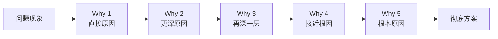

# 3.7 五问根因分析法
#### 目录介绍
- [01.同一个Bug我修了三次](#01同一个bug我修了三次)
- [02.断点自测三问](#02断点自测三问)
- [03.5W根因分析法是什么](#035w根因分析法是什么)
- [04.经典的机床停机案例](#04经典的机床停机案例)
- [05.业务目标场景应用](#05业务目标场景应用)
- [06.技术原理场景应用](#06技术原理场景应用)
- [07.管理改进场景应用](#07管理改进场景应用)
- [08.使用的四条原则](#08使用的四条原则)
- [09.这几个坑我踩过](#09这几个坑我踩过)
- [10.总结回顾这一节](#10总结回顾这一节)
- [11.后来发生的改变](#11后来发生的改变)
- [12.今天起改变三点](#12今天起改变三点)
- [13.课后作业思考下](#13课后作业思考下)
- [14.下一站鱼骨图](#14下一站鱼骨图)

## 01.同一个Bug我修了三次

那段时间我特别痛苦。线上有一个支付回调失败的 Bug，第一次出现时我修了「重试逻辑」；过了两周又出现，我加了「超时时间」；又过了一个月还是冒出来，我索性「加了报警监控」。结果运营那边很客气但很无奈：「这已经是这个月第三次了。」

复盘会上 Leader 把那三次的修复记录叠在一起，问我：「你三次给的方案都不一样，请问哪一个是真正的原因？」我答不出来。我下意识的回答都是「重试」「超时」「监控」，但这些根本不是原因，是症状。

Leader 没批评我，他只是拿过白板笔，从「支付回调失败」开始往下追问：

- 为什么失败？→ 因为对方接口返回了 504。
- 为什么 504？→ 因为我们这边阻塞太久。
- 为什么阻塞太久？→ 因为入参里多了一个我们循环里加锁等的字段。
- 为什么会加这个锁？→ 因为前一年某个老同事担心并发，写了个全局锁。
- 为什么这个全局锁一直没人去掉？→ 因为没人知道它存在。

5 个为什么之后，**真正的根因终于浮出水面：一段两年前埋下的、所有人都不知道的全局锁**。我整个人僵在那里。前面三次修的全部都是表象，难怪修了又来。Leader 拍拍我：「问题不是被解决的，是被追到根的。这个方法叫 5W 根因分析法，今天起你写到工位上去。」

后来这一节要讲的，就是把那次 Leader 在白板上画给我的 5 个为什么，完整教给你。

## 02.断点自测三问

事中执行「问题反复出现」几乎 100% 是根因没找到。你不追到根，问题永远会以另一种形式复活。用三问自测你最近处理的一个问题：

| 断点自测三问 | 你最近这个问题 | 若答「否」意味着 |
| :--- | :--- | :--- |
| 你追问了 3 层以上的「为什么」吗？ | □ 追了 □ 没追 | 只在表面打转 |
| 你的根因是「团队自己能改的」还是「客观外部的」？ | □ 自己能改 □ 客观外部 | 归因外部化，等于没归因 |
| 你的修复方案能保证问题「再也不出现」吗？ | □ 能 □ 不确定 | 修的是症状不是根因 |

三问里有一个「否」，说明你和当年那个「修了三次同一个 Bug 的我」是一样的。5W 的价值不是「问 5 次」，而是逼你**沿着因果链一直往下走，直到走到「干掉它问题就再也不会出现」的那一层**。

## 03.5W根因分析法是什么

5W 根因分析法（也叫 5Why 分析法、丰田五问法），最初由丰田集团创始人丰田佐吉提出，后来成为丰田汽车公司获得成功的重要方法。

根据丰田汽车公司前副社长大野耐一的描述，它的做法就是**重复问五次「为什么」，问题的本质和解决办法就会变得显而易见**。

它解决的是一个非常普遍但致命的问题：分析原因时只看到表层原因，没有深挖根本原因。结果给出的解决方案治标不治本，短时间做了应急处理，但按下葫芦浮起瓢，相关问题接连不断地冒出来。

关键原则是：**避开主观或自负的假设和逻辑陷阱，从结果着手，沿着因果关系链条顺藤摸瓜，直至找出原有问题的根本原因**。先问第一个「为什么」，获得答案后再问为何会发生，以此类推，问 5 次「为什么」或者更多，以此挖掘出问题的真正原因。

## 04.经典的机床停机案例

大野耐一举过一个丰田工厂机床停机的经典例子，这也是 5W 最标准的示范。

问题现象：机床停了，产线中断。

- 为什么机器停了？→ 因为机器超载，保险丝烧断了。
- 为什么机器会超载？→ 因为轴承的润滑不足。
- 为什么轴承会润滑不足？→ 因为润滑泵失灵了。
- 为什么润滑泵会失灵？→ 因为它的轮轴耗损了。
- 为什么润滑泵的轮轴会耗损？→ 因为杂质跑到里面去了。

停在不同的 Why 层，得到的修复方案完全不同：

| 停在哪一层 | 对应的修复动作 | 结果 |
| :--- | :--- | :--- |
| Why 1 | 更换保险丝 | 保险丝还会再烧 |
| Why 2 | 添加润滑油 | 机器还会再超载 |
| Why 3 | 更换润滑泵 | 新泵一样很快坏 |
| Why 4 | 更换轮轴 | 轮轴还会再坏 |
| Why 5 | 加装防杂质滤网 | 从根本上不再出现 |

只有追到 Why 5，才能找出真正的根因。**在这个例子里，前面 4 个都不是错的，都是「治标」；只有第 5 个是「治本」。** 这就是 5W 最核心的价值：让你不满足于任何一个中间层的答案。

## 05.业务目标场景应用

在某交易平台的业务规划目标讨论会上，我通过 3 个为什么了解到了业务目标背后的深层考虑：

- 问题 1：为什么今年的业务目标是成交金额翻番？→ 因为只有成交金额翻番我们才能达到盈亏平衡点。
- 问题 2：为什么今年要求达到盈亏平衡点？→ 因为集团要求我们的业务能够自负盈亏。
- 问题 3：我们本质上还属于创新业务，为什么集团要求我们的业务能够自负盈亏？→ 因为经济下行的影响，集团需要开源节流，减少非盈利业务的持续投入。

你可能觉得奇怪：怎么这个例子只问了 3 个为什么就结束了呢？因为 **5 个为什么只是一个形象的说法，不管几个为什么，关键在于通过追问找到根本原因**。业务目标场景通常追 2-3 层就能找到最上面那条决策线，追到集团战略/宏观环境这一层，业务目标就有了不可撼动的解释。

## 06.技术原理场景应用

5W 也是验证技术理解深度的好工具。在某次 Netty 培训课上，通过 5 个为什么来验证大家是否真的深入理解了 Netty 网络高性能的核心原理：

- 问题 1：为什么 Netty 网络处理性能高？→ 因为 Netty 采用了 Reactor 模式。
- 问题 2：为什么用了 Reactor 模式性能就高？→ 因为 Reactor 模式是基于 IO 多路复用的事件驱动模式。
- 问题 3：为什么 IO 多路复用性能高？→ 因为 IO 多路复用既不会像阻塞 IO 那样没有数据的时候挂起工作线程，也不需要像非阻塞 IO 那样轮询判断是否有数据。
- 问题 4：为什么 IO 多路复用既不需要挂起工作线程，也不需要轮询？→ 因为 IO 多路复用可以在一个监控线程里面监控很多的连接，没有 IO 操作的时候只要挂起监控线程；只要其中有连接可以进行 IO 操作的时候，操作系统就会唤起监控线程进行处理。
- 问题 5：那还是会挂起监控线程啊，为什么这样做就性能高呢？→ 这一层就要追到 OS 内核的 epoll 机制、CPU 上下文切换成本等真正的物理层原因。

大部分工程师能答到 Why 2，少数能答到 Why 4，但真正能追到 Why 5 的凤毛麟角。**技术深度的分水岭往往就在能不能再追一层**。

## 07.管理改进场景应用

管理场景常常是 5W 最能解决实际问题的地方。以「项目延迟」为例：

- 问题 1：为什么项目延迟了？→ 因为要等测试环境进行测试。
- 问题 2：为什么要等测试环境？→ 我们只有 2 套测试环境，都被另外两个项目占用。
- 问题 3：为什么只有 2 套测试环境？→ 现在没有机器，而且我们有将近 20 个子系统，搭建一套可用环境耗时可能要一周。
- 问题 4：为什么没有机器？→ 运维今年的预算用完了，不能购买新机器。
- 问题 5：为什么一定要用新机器，测试环境对性能要求高吗？→ 不高，基本能跑就行。
- 问题 6：那为什么不找运维申请过保机器？→ 之前没想过这个方案。

解决方案很简单：**直接找运维借几台过保的机器（使用超过 3 年、按规定要换掉的机器）搭测试环境**。这只是短期方案。深挖 Why 3 的回答还能发现另一个问题：搭建一套环境太耗时。于是测试开发部启动了一个基于 Docker 的快速搭建环境的项目，任何一个开发或测试同学花 5 分钟就能生成一套全新可用的环境。

这个例子完美展示了 5W 的双重价值：**短期给出立刻能落地的动作，长期暴露一个需要系统解决的根问题**。

## 08.使用的四条原则

用 5W 时有四条必须遵守的原则：

| 原则 | 含义 | 反例 |
| :--- | :--- | :--- |
| 多方考虑 | 每层「为什么」尽量找全所有可能原因 | 只沿一条线追，漏掉平行原因 |
| 客观追问 | 找的是原因，不是借口和理由 | 「因为需求方不给力」这种借口 |
| 三现原则 | 现场、现物、现实，用数据/事实 | 全靠猜测和假设 |
| 锲而不舍 | 不要认为答案是显而易见的 | 追一层就停 |

**三现原则**是丰田生产方式的精髓，中文叫「在现场通过现物掌握现实」。用大白话说就是：别在会议室里坐着推理，去现场看、去看实物、去查实际数据。软件工程里对应的动作就是：别在群里讨论 bug 原因，去看日志、去看监控、去看现场堆栈。

## 09.这几个坑我踩过

用 5W 这么多年，我踩过五个典型坑：

| 常见误区 | 具体表现 | 正确做法 |
| :--- | :--- | :--- |
| 数字迷信 | 强行追 5 次为什么 | 3-7 个都可以，关键是追到根 |
| 问题没定义就开追 | 「业务下滑」都没量化就开始问 | 先做 Specify（详见 3.6）再追问 |
| 只追一条线 | 沿一条因果链追到底，漏平行原因 | 每层平行原因都要列出来 |
| 归因外部化 | 追到「客户方问题」就停 | 追到「本团队可改变的那一层」 |
| 追问变撕逼 | 被问者觉得是在质疑他 | 事先说明这是方法不是质疑 |

其中最坑的是「追问变撕逼」。5W 在情绪管理不到位的团队里非常容易变成大型撕逼现场。当你连续追问「为什么」时，如果双方没有对这个方法充分达成认识，被问的人很可能觉得你在挑战和质疑他，最后闹得不欢而散。**开始前一定要花 30 秒说清楚：「接下来我们用 5W 追根因，问的不是你、问的是这件事本身。」** 这句话能显著降低对立情绪。

另外一条常犯：**问题数量不是关键**。5W 中的「5」只是一个形象说法。3 个也可以、7 个也可以，关键在于找到根本原因。但建议不要少于 3 个（少于 3 大概率找不到根因），也不要多于 7 个（超过 7 层还没找到，说明问题本身可能定义有问题，回去做 Specify）。

## 10.总结回顾这一节

5W 不是问 5 次，而是**沿着因果关系一直问，直到挖到那个「干掉它问题就再也不会出现」的根**。

三条最关键的实操：

- **修问题的标准只有一个**：那条因果链是不是被你走到底了。
- **同一个问题反复出现**：几乎 100% 是没问到第 4 个 Why。
- **用 5W 之前先确认问题被定义清楚**：否则越问越偏。

5W 根因分析法就是通过追问 5 个为什么来分析问题的根本原因，从而得到彻底的解决方案。它起源于生产过程的问题原因分析，但也可以应用于业务分析、技术学习和管理改进等场景。它是 5S 问题处理法（详见 3.6）里第三步「定位问题」的核心工具，也是所有复盘和事故分析的通用武器。

## 11.后来发生的改变

复盘会之后我做的第一件事，是用马克笔在工位玻璃上写了三个超大的字，**「再问一次」**。每次有同事跟我描述问题、或者我自己在写故障分析时，眼角余光只要扫到那三个字，我就会强迫自己再问一个为什么。第一周特别别扭，组员有时候还会抱怨：「这都问到第几遍了？」但很快他们也开始习惯，我们组的 bug 单上「根因」那一栏第一次出现了「两年前埋的全局锁」「一处历史代码 if 条件写反」这种真正的根。

那一个月之内我用 5W 处理了 12 个线上问题。最让我意外的不是任何一个具体的修复，而是**第二个月线上故障复发率从 35% 直接掉到 8%**。Leader 在月度会上说了一句话，我现在还记得：「你这个月的故障数没少多少，但你修的，是真的把它们修死了。」这话比任何表扬都让我开心。

半年之后我跟一个新来的同事一起处理一个性能问题，他给我的解释停在第二个 Why 的时候，我下意识就脱口而出：「那再为什么呢？」他愣了一下，然后两个小时之后跑过来跟我说：「哥，我又往下挖了三层，问题出在 ORM 框架的某个默认配置上。」那一刻我突然意识到，**5W 已经不再是我「刻意用」的方法，它长进了我的听感里**。任何人讲一个原因，我会自动判断「这是症状还是根因」。半年前那个连续修 3 次还修不好同一个 Bug 的我，已经回不去了。

## 12.今天起改变三点

**第一，遇到问题多问一个为什么**。下次遇到问题时，不要满足于第一个答案。无论是自己分析还是和别人讨论，都要多追问一层：为什么会这样？这个原因背后的原因是什么？哪怕只多问一个为什么，你对问题的理解都会更深一层。

**第二，用「问题会不会复发」作为根因判断标准**。给出的每一个原因，都问自己一个问题：**如果解决了这个原因，问题是否会彻底消失？** 如果答案是「不确定」或「可能还会出现」，那说明你找到的只是表面原因，需要继续深挖。这个自问句是 5W 最简单也最有效的自检。

**第三，用 5W 重新分析一个历史问题**。找一个你曾经处理过但效果不好的历史问题，用 5W 分析法重新分析一遍。当初给出的解决方案为什么效果不好？是因为没有找到根本原因吗？如果重新追问 5 个为什么，会得出什么不同的结论？这个练习能帮助你快速掌握 5W 分析的精髓。

## 13.课后作业思考下

1. 选择一个你最近在工作中遇到的问题，用 5W 根因分析法写出完整的追问过程（至少 3 个为什么），看看最终能找到什么根本原因。
2. 回忆一次你或团队「治标不治本」的经历。当时解决了表面问题，但过一段时间问题又以其他形式出现了。用 5W 分析法重新分析，找到你当初遗漏的根本原因。
3. 下次团队复盘或讨论问题时，尝试引导大家使用 5W 分析法。注意在开始前先说明方法，避免引起对立情绪。记录一下这次实践的效果和你的感受。
4. 用 5W 分析法分析一个生活中的问题（比如「为什么最近总是睡不好」「为什么这个月花超了预算」），体验一下这个方法在非工作场景中的威力。

## 14.下一站鱼骨图

5W 是「沿一条因果链纵向追问」的方法。它非常擅长追到一个「深层根因」，但也有一个缺陷：**它容易只沿一条线追，漏掉其他平行的原因**。

举个例子：机床停机可能不止「杂质」一个根因，还可能有「保养制度」「操作规程」「零件供应」等多个平行原因。要横向铺开所有可能的原因维度，就要用另一个和 5W 互补的工具：鱼骨图（因果图）。

下一节讲鱼骨图分析法，教你把 5W 的「深度」和鱼骨图的「广度」组合起来，把根因找得又深又全。
