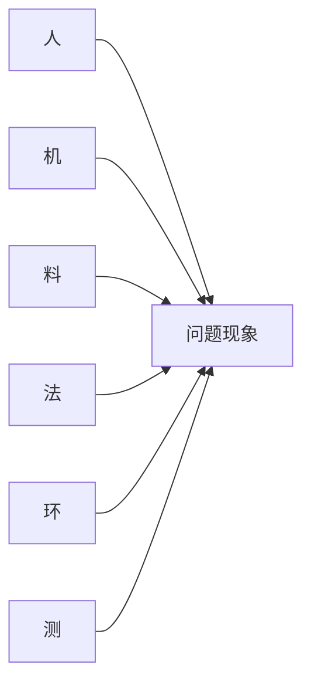
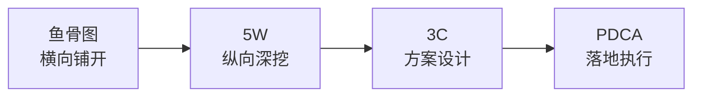

# 3.8 鱼骨图分析方法
#### 目录介绍
- [01.反复修4次的诡异Bug](#01反复修4次的诡异bug)
- [02.断点自测三问](#02断点自测三问)
- [03.鱼骨图是什么](#03鱼骨图是什么)
- [04.鱼骨图的三层结构](#04鱼骨图的三层结构)
- [05.绘制鱼骨图的四步](#05绘制鱼骨图的四步)
- [06.线上接口超时案例](#06线上接口超时案例)
- [07.用户投诉增多案例](#07用户投诉增多案例)
- [08.与其他方法的组合](#08与其他方法的组合)
- [09.这几个坑我踩过](#09这几个坑我踩过)
- [10.总结回顾这一节](#10总结回顾这一节)
- [11.后来发生的改变](#11后来发生的改变)
- [12.今天起改变三点](#12今天起改变三点)
- [13.课后作业思考下](#13课后作业思考下)
- [14.下一站过渡到事后复盘](#14下一站过渡到事后复盘)

## 01.反复修4次的诡异Bug

那段时间我们的核心服务出了一个非常诡异的问题：**每周三凌晨 2 点左右必然报警一次，报警过几分钟自动恢复，没造成大事故但反复发生**。我作为模块负责人，前后修了 4 次：

- 第一次：怀疑是定时任务太重，把任务时间改了。第二周还报。
- 第二次：怀疑是数据库慢查询，加了索引。第三周还报。
- 第三次：怀疑是某个 Cron Job，把它停了。第四周还报。
- 第四次：怀疑是网络抖动，让运维加了重试。第五周还报。

我每次都觉得「这次找到了」，但每次都被打脸。同事们开始打趣我：「你修的 Bug 都成精了吧？」我自己也快崩溃了。**我每次都是凭直觉猜一个原因然后去修，从来没有真正系统地分析过。**

第五次报警之后，老大把我叫到会议室，指着白板说：「你别再瞎修了，今天我要看你画一条鱼。」我一脸问号。他笑了笑：「鱼骨图。鱼头写『每周三凌晨 2 点报警』，然后画 5 条大骨头：人、代码、数据、流程、外部环境。每条骨头下面，穷尽列出所有可能的原因。不是你猜的，是所有可能的。」

我用了整整两小时画完那张鱼骨图。骨架展开后我自己都吓了一跳：**我之前 4 次猜的原因，加起来只覆盖了那张鱼上 28 条小刺中的 4 条。剩下 24 条我从来没想过！**

更关键的是，当我对每条小刺打分（可能性 + 影响度）后，第一名居然是一条我之前从没考虑过的：**「周二夜里运维的备份任务在凌晨 2 点抢占 IO」**。我跑去找运维一查，确实如此。第二周改了备份时间，报警再也没出现过。

下面这套救了我的鱼骨图方法论，今天完整讲给你。

## 02.断点自测三问

事中执行「凭直觉猜原因」是根因分析最大的敌人。5W 教会你追一条深，但如果这条深的方向本身就是错的，你追得再深也是南辕北辙。用三问自测：

| 断点自测三问 | 你最近这个问题 | 若答「否」意味着 |
| :--- | :--- | :--- |
| 你分析原因时穷举过所有可能的维度吗？ | □ 穷举了 □ 只想了 1-2 条 | 视野狭窄，大概率漏根因 |
| 你的分析有没有让不同角色（研发/运维/产品）参与？ | □ 有 □ 只有我 | 集体盲区 |
| 你对候选原因打过「可能性+影响度」分吗？ | □ 打过 □ 没打 | 优先级凭感觉 |

三问里有一个「否」，你的原因分析就还停留在「猜」。鱼骨图的价值不在图形本身，而在于**逼你穷举所有维度、再横向铺开所有可能**，然后再用 5W 纵向追根因。

## 03.鱼骨图是什么

鱼骨图（Fishbone Diagram）又叫因果图或石川图，由日本质量管理专家石川馨（Kaoru Ishikawa）在 1960 年代发明。因为它的形状像鱼骨头所以得名。它最初用于制造业的质量问题分析，后来被广泛应用于各行各业。

它解决的问题非常朴素但普遍：**当一个问题涉及多个层面的原因时，如果你只是在脑子里想或者随手列几条，很容易遗漏重要因素**。鱼骨图通过可视化的方式，帮你系统地梳理问题的所有可能原因，确保分析的全面性。

鱼骨图和 5W 根因分析法（详见 3.7）是天然的搭档。鱼骨图和 5W 的分工非常清晰：

| 工具 | 方向 | 作用 | 缺陷 |
| :--- | :--- | :--- | :--- |
| 鱼骨图 | 横向 | 铺开所有可能原因维度 | 不深入，容易停在表面 |
| 5W | 纵向 | 沿一条因果链追到根 | 不全面，容易漏平行原因 |

**先用鱼骨图把「宽度」铺出来，再用 5W 把每根重要的骨头「深度」追下去**，这才是完整的根因分析。

## 04.鱼骨图的三层结构

**鱼头**在图的最右边，写上你要分析的问题或不理想的结果。比如「系统崩溃」「用户投诉增多」「项目延期」。鱼头必须写得**具体且可衡量**：不要写「性能问题」，写「首屏加载 P95 从 2s 增至 5s」。

**鱼骨（大骨头）**从鱼头延伸出来的斜线，代表主要的原因分类。制造业经典的分类是「6M」，IT 行业可以灵活调整：

| 分类 | 制造业含义 | IT 行业对应 |
| :--- | :--- | :--- |
| 人 (Man/People) | 人员 | 开发人员、运维人员、值班人员 |
| 机 (Machine) | 设备 | 服务器、网络设备、云资源 |
| 料 (Material) | 材料 | 代码、配置、数据、依赖库 |
| 法 (Method) | 方法 | 流程、规范、发布策略 |
| 环 (Environment) | 环境 | 开发/测试/生产环境、外部依赖 |
| 测 (Measurement) | 度量 | 监控、告警、日志、测试覆盖 |

**小刺（小骨头）**每根大骨头上又延伸出小刺，代表具体的原因。小刺可以继续细分，形成更深层的原因分析。**推荐每根大骨头下至少列 5 条小刺**：前 2 条通常是表面原因，第 3-5 条才是真正有价值的候选。

## 05.绘制鱼骨图的四步

**第一步：确定问题（画鱼头）**。在纸/白板的右侧写下要分析的问题，画一条从左到右的横线作为鱼脊骨。问题描述必须具体，含数字更好。

**第二步：确定主分类（画大骨）**。根据问题的性质选择 4-6 个主要的原因分类，画成斜线连接到鱼脊骨上。分类不要超过 6 个，太多会导致分析框架过于复杂。

**第三步：头脑风暴（画小刺）**。针对每个分类，尽可能多地列出具体原因。团队一起做效果最好。四条头脑风暴原则：

- **不要评判**。先列出所有可能的原因，不要在过程中否定任何想法。
- **鼓励联想**。一个人提出的原因可能触发另一个人的联想。
- **数量优先**。先追求数量，后追求质量。
- **归类整理**。头脑风暴结束后，检查是否有重复或归类不当的。

**第四步：标记关键原因（圈重点）**。所有小刺列完之后，对每条打分（可能性 1-5 + 影响度 1-5，相乘得总分），挑分数最高的 2-3 条用红笔圈出，再用 5W 对这几条纵向深挖。

## 06.线上接口超时案例

一个典型的鱼骨图案例是「线上接口超时」。按 5 个维度铺开：

| 维度 | 具体小刺 |
| :--- | :--- |
| 开发（人） | SQL 未加索引；缺少降级处理；缺少超时配置 |
| 数据库（机/料） | 慢查询堆积；连接池耗尽；主从复制延迟 |
| 流量（环） | 突发流量暴增；爬虫异常访问；上游重试放大 |
| 监控（测） | 告警阈值过高；缺少慢接口监控；日志采样不足 |
| 流程（法） | 上线前未做压测；缺少容量评估；灰度不充分 |

铺开之后，用 5W 对 TOP3 深挖：

- **开发·SQL 未加索引** → 为什么？新人不熟悉 → 为什么？缺少代码 review → 根因：**缺少 SQL 审查流程**
- **监控·告警阈值过高** → 为什么？上次调高后没改回来 → 为什么？没有 review 机制 → 根因：**缺少告警配置 review**
- **流程·上线前未压测** → 为什么？时间紧 → 为什么？缺少强制流程 → 根因：**缺少上线前压测 checklist**

三个根因指向的是**三条流程改进**，而不是三次代码修复。这就是鱼骨图 + 5W 的威力：**表象是「接口超时」，根因是「三条缺失的流程」**。

## 07.用户投诉增多案例

鱼骨图也非常适合业务场景。「用户投诉增多」的横向铺开：

| 维度 | 具体小刺 |
| :--- | :--- |
| 产品 | 新版本功能复杂度增加、操作路径变长、缺少新手引导 |
| 技术 | 页面加载变慢、频繁出现 404、支付偶发失败 |
| 客服 | 响应速度变慢、话术不统一、问题升级流程不畅 |
| 运营 | 促销活动规则复杂、优惠券使用限制多、退款流程繁琐 |

这个案例很典型的一点是：如果你只是产品经理去分析投诉，你只会看到「产品」这条骨头；如果你只是技术负责人，你只会看到「技术」这条骨头。**跨职能的鱼骨图能揭示单一岗位永远看不到的根因**。这也是鱼骨图特别强调「团队共创」的原因。

## 08.与其他方法的组合

鱼骨图不是孤立工具，它嵌在事中执行的完整链路里：

- **鱼骨图**（本节）：横向铺开所有可能原因维度
- **5W**（详见 3.7）：对 TOP3 小刺纵向追根因
- **3C**（详见 2.8）：针对根因设计多套方案
- **PDCA**（详见 3.1）：把选定方案落地并持续改进

鱼骨图最大的价值是「全面性」，帮你确保不遗漏重要的原因分支。但它本身不负责深挖和解决问题，需要和 5W、3C、PDCA 等方法配合使用。**只画鱼骨图不追 5W = 停留在表面；只用 5W 不画鱼骨图 = 一条线追死钻牛角尖。**

## 09.这几个坑我踩过

用鱼骨图这些年我踩过几个典型坑：

| 常见误区 | 具体表现 | 正确做法 |
| :--- | :--- | :--- |
| 鱼头写得模糊 | 「性能问题」「用户体验差」 | 写具体+带数字：「P95 从 2s→5s」 |
| 主分类太多 | 列了 10 个大骨头 | 控制 4-6 个，多了合并 |
| 每根骨头只列 1-2 条 | 觉得「就这几条了」 | 强制每根至少 5 条小刺 |
| 一个人闭门画 | 只有自己的视角 | 跨角色团队一起画 |
| 画完不打分 | 挑重点全凭感觉 | 每条小刺打「可能性+影响度」分 |

其中最坑的是「一个人闭门画」。当年我画那张鱼骨图时如果没有请运维一起看，我可能永远想不到「备份任务抢 IO」这条小刺。**跨职能的视角是鱼骨图 80% 价值的来源**。做技术类根因分析尤其要拉上运维、DBA、SRE 一起画。

另外一条常见的坑是「打完分不敢面对高分小刺」。有时候打分排名第一的原因是「我们自己流程有缺陷」，团队会本能地不愿意接受。这时候一定要坚持数据说话，**打分是打分、修复是修复，先接受再解决**。

## 10.总结回顾这一节

鱼骨图是一个可视化的因果分析工具，通过分类的方式系统地梳理问题的所有可能原因。它和 5W 根因分析法是最佳搭档：**鱼骨图负责广度，5W 负责深度**。

三条最关键的实操：

- **鱼头写具体+带数字**。「接口超时」不够，「首屏 P95 从 2s→5s」才够。
- **每根骨头至少 5 条小刺**。前 2 条是表面，第 3-5 条才是关键。
- **跨职能一起画**。单一岗位永远看不到全景。

我用了多年鱼骨图后发现，它最大的价值不只是「找到原因」，而是**逼你跳出「凭直觉猜」的思维定势**。告别「猜一个修一次」，任何问题都先穷举所有可能再按可能性排序；暴露视野盲区，团队画鱼骨图时每个角色都能贡献一两条你独自永远想不到的原因；降低重复故障率，找到的不再是「表面原因」，而是真正的「根因」。

## 11.后来发生的改变

回到开篇那个反复修了 4 次的 Bug。从老大让我画那条鱼开始，我做了下面这些改变。

那张白板上的鱼骨图我至今记得清清楚楚：5 大骨头、28 根小刺。我对每根小刺打分（可能性 1-5 + 影响度 1-5），最高分的居然是我从没考虑过的「运维备份任务抢 IO」。第二天我跑去找运维一查，完全吻合。每周三凌晨 2 点是全量备份，恰好和报警时间点重合。运维改了备份时间，**报警从此消失**。那一刻我深刻意识到，我之前 4 次「修复」全部修在了无关的地方。如果不是鱼骨图逼我穷举，我可能再修 10 次都修不到。

我给自己定了一条规则：**所有线上问题/故障复盘，第一步必须画鱼骨图，禁止凭直觉直接动手修**。一个月内我用这套流程处理了 6 个问题：2 个当场就在鱼骨图里发现了之前漏掉的关键维度；3 个用鱼骨图 + 5W 找到了真正的根因，一次性修复；1 个通过团队画鱼骨图，让设计同事提供了关键线索。最让我意外的是，画一张鱼骨图平均只要 30 分钟，但能省下后面几次甚至几十次的「瞎修」时间。

一年后我开始带 8 人小组。我把「故障必画鱼骨图」作为团队铁规，并配了模板（鱼骨图 → 5W 深挖 → 3C 方案 → PDCA 落地 → 4D 复盘）。数据非常硬：**团队的重复故障率从原来的每月 4-6 次降到每月 1-2 次，下降 65%**。Leader 问我秘诀，我把那张白板上的鱼指给他看：「就是这条鱼。」更深层的改变是团队成员不再凭直觉行动了。每次出问题第一反应是「先画图分析」而不是「我猜是某某原因」。这种思维习惯的迁移，比解决任何一个具体问题都更值钱。

## 12.今天起改变三点

**第一，选一个当前问题今天就画一张鱼骨图**。花 15 分钟画一个鱼骨图。不需要多完美，先确定 4-5 个主分类，然后在每个分类下列出你能想到的所有具体原因。画完后你会对问题的全貌有一个清晰的认知。**强迫自己每根大骨头下至少列 5 条小刺**，前 2 条是表面，第 3-5 条才是关键。

**第二，鱼骨图 + 5W 联合使用**。对鱼骨图中你认为最可能的 2-3 个原因，用 5W 继续深挖。追问 3-5 个为什么，找到根本原因。**鱼骨图帮你不遗漏，5W 帮你挖到底，两者缺一不可**：只用鱼骨图容易停在表面，只用 5W 容易钻牛角尖。

**第三，下次团队复盘时画鱼骨图**。在白板上画一个鱼骨图。让不同角色的同事各自贡献原因，你会发现团队的集体智慧远超个人分析。**特别推荐让平时少发言的同事来贡献某一根大骨头的小刺**，他们的视角往往是团队的盲区。

## 13.课后作业思考下

1. 选一个你最近遇到的工作问题（bug、故障、延期等），用鱼骨图做一次完整的原因分析。主分类可以用：人员、技术、流程、工具、环境。
2. 在鱼骨图分析的基础上，对 TOP3 的可能原因用 5W 进行深挖，找出根本原因，然后用 3C 方案设计法提出解决方案。
3. 对比鱼骨图和 MECE 法则（详见 2.6），思考两者的异同。在什么场景下用鱼骨图更合适？什么场景下用 MECE 更合适？
4. 尝试把鱼骨图应用到生活问题中（比如「为什么最近总感觉累」「为什么存不下钱」），体验它在非工作场景中的效果。

## 14.下一站过渡到事后复盘

到这里，卷二第三章「事中执行」的 8 个方法就讲完了。让我们简单梳理一下这 8 节的位置：

- **3.1 PDCA**：整体执行闭环
- **3.2 番茄工作法**：个体注意力管理
- **3.3 六顶思考帽**：会议讨论结构化
- **3.4 金字塔汇报**：向上表达结构化
- **3.5 STAR 摸底**：讲清一段经历
- **3.6 五步问题处理**：从「明」到「落」全流程
- **3.7 五问根因**：纵向追到根
- **3.8 鱼骨图**：横向铺全面

事中执行做得再好，也不可能让一件事从头到尾完美。真正让你成长的，是每一次事后拿放大镜把自己做过的事再看一遍，**这就是第四章「事后复盘」要讲的内容**。

复盘不是「回顾」，它是一门有方法论的学问。下一章从 4.1「4D 复盘全流程」开始，教你把每一次经历都变成可复用的能力资产。
