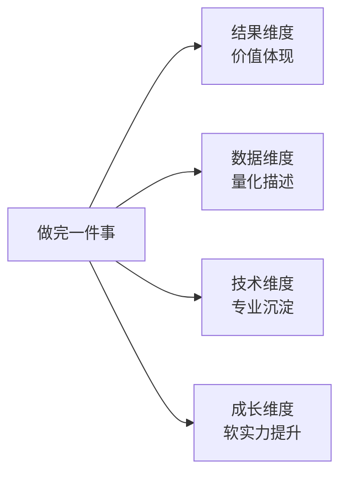

# 4.1 四维度总结分析
#### 目录介绍
- [01.晋升答辩没过的那一晚](#01晋升答辩没过的那一晚)
- [02.断点自测三问](#02断点自测三问)
- [03.4D总结法是什么](#034d总结法是什么)
- [04.结果维度分析](#04结果维度分析)
- [05.数据维度分析](#05数据维度分析)
- [06.技术维度分析](#06技术维度分析)
- [07.成长维度分析](#07成长维度分析)
- [08.三条总结说事情](#08三条总结说事情)
- [09.这几个坑我踩过](#09这几个坑我踩过)
- [10.总结回顾这一节](#10总结回顾这一节)
- [11.后来发生的改变](#11后来发生的改变)
- [12.今天起改变三点](#12今天起改变三点)
- [13.课后作业思考下](#13课后作业思考下)
- [14.下一站阶段复盘](#14下一站阶段复盘)

## 01.晋升答辩没过的那一晚

第一次晋升答辩那天我有 90% 的把握能过。准备了 60 页 PPT、列了一年里做的 11 个项目、加班记录都在邮件里翻得到。前 15 分钟我讲得行云流水，自我感觉炸裂。

直到一位评委放下笔，问了我一句话：「你这一年做的事情我都看到了，但是我没看到结果。你说做了一个『高可用架构升级』，我想问，升级前后系统可用性是多少？故障数从几次降到几次？带来了什么业务收益？」

我当场卡住了。我说「系统更稳了」「业务方反馈很好」，评委追问：「具体多稳？反馈具体是什么？」我答不上来。再问下一个项目，再卡。第三个项目，我已经满头是汗。**那场答辩我没过。**

晋升结果出来那晚我喝了点酒，给我师父打了电话。师父没安慰我，他只问我：「你那 11 个项目，有几个你是从结果、数据、技术、成长这 4 个维度都能说清楚的？」我沉默了很久，一个都没有。师父说：「你不是没做事，是你做完之后从来没有『按维度复盘』过。下次开始，每件事做完都按 4 个维度写下来：结果是什么、数据怎么变、技术上学到什么、个人能力涨了什么。这叫 4D 总结法，是你晋升以后的『弹药库』。」

后面这一年我严格按 4D 跑下来，第二次答辩 35 分钟讲了 3 个项目、每个项目都有「前后对比数字 + 技术沉淀 + 个人成长」，**全票通过**。今天这一节，就把那一年我走过的路，完整教给你。

## 02.断点自测三问

四断点的最后一个是「事后不复盘」。做完事情不总结，等于你干了一年、别人只能看到你「在忙」，看不到你「拿到了什么」。用三问自测你最近一年：

| 断点自测三问 | 你最近一年 | 若答「否」意味着 |
| :--- | :--- | :--- |
| 你能说出每个重要项目的「前后对比数字」吗？ | □ 能 □ 不能 | 结果没有量化 |
| 你有没有针对每件事沉淀过技术笔记？ | □ 有 □ 没有 | 技术只在肌肉里，别人看不见 |
| 你能说清楚这一年个人能力涨了什么吗？ | □ 能 □ 说不清 | 成长散在感觉里，无法证明 |

三问里有一个「否」，晋升答辩、年终述职、跳槽面试第一个被问倒的就是这个环节。4D 总结法就是把「做完的事」按 4 个维度装进你的弹药库。

## 03.4D总结法是什么

工作中，好方法能够提升你拿到好结果的概率，但是不能保证让你一定拿到好的结果，因为影响最终结果的因素太多了。就算大量使用方案设计法，决策过程仍然可能有失误；就算使用罗列执行计划，执行过程仍然可能出现偏差。

在汇报或答辩的时候，评委除了考察规划和执行相关的「为什么」之外，还会考察和做事结果相关的「为什么」。比如：你认为这个结果怎么样？为什么你认为这个结果不好？为什么你的方法挺好但是结果不好？你从这个结果得到什么经验和教训？

**结果好的事情，需要讲清楚你对结果的贡献；结果不好的事情，需要分析原因、总结经验教训。** 无论哪种情况，都需要一个通用的总结骨架，这就是 4D 总结法。

四个维度的核心问题一张表看清：

| 维度 | 核心问题 | 展现方式 | 常见误区 |
| :--- | :--- | :--- | :--- |
| 结果 Dimension 1 | 带来了什么价值？ | 业务指标/系统性能/效率质量 | 只说做了什么、不说效果 |
| 数据 Dimension 2 | 能用数据量化吗？ | 具体数字+评价标准 | 用「大大提升」等虚描述 |
| 技术 Dimension 3 | 技术上有什么收获？ | 新技术/深度理解/经验教训 | 只讲方法不讲效果 |
| 成长 Dimension 4 | 综合能力提升了什么？ | 业务理解/项目组织/沟通能力 | 只关注技术忽略软实力 |

## 04.结果维度分析

结果这个维度重点关注的是事情带来的价值。不同类型的团队在结果价值方面表现会有一些差异：

| 团队类型 | 结果总结方向 | 示例 |
| :--- | :--- | :--- |
| 业务开发团队 | 从业务角度总结 | 用户日活、GMV、留存率 |
| 技术优化团队 | 从技术给业务带来的价值 | 高可用方案让 P1 故障从 5 次降到 0 次 |
| 中间件/平台团队 | 系统性能、可用性、成本 | 若已产品化，可看销售量/流量 |
| 运维/测试团队 | 质量、效率、成本 | 自动化测试平台省 5000 人日 |

**不管做什么类型的事，都要能回答一个问题：这件事最终让「谁」的「什么」变好了「多少」。** 三个要素少一个，结果都讲不清。

## 05.数据维度分析

「提升了开发效率」这种比较虚的描述，应该改成「开发一个功能从 20 人天提升为 2 人天」这种使用具体数据的描述。

通过数据描述结果不但要列出相关数据，而且对数据背后的含义要有自己的理解，尤其是对数据的评价以及评价的标准。通过评价数据的方式，你可以培养自己的业务思维和理解力。

很多人一开始尝试时都会有一个疑问：感觉这个事情好像没办法用数据来描述啊？其实大部分情况**不是真的不能用数据来描述，而是你没有去搜集数据，没有养成用数据来说明的习惯**。

数据获取的三层递进：

- **第一优先：客观业务数据**。DAU、GMV、故障数、P95 延迟、覆盖率等，最有说服力。
- **第二优先：过程/研发数据**。发布耗时、代码 review 时长、bug 修复周期等，能反映流程效率。
- **第三优先：主观打分数据**。满意度调研、NPS、内部对齐会打分等，比纯文字描述强 10 倍。

结论是：**先搜集，再表达**。哪怕只能拿到「用户调研得分」「问卷反馈分布」「主观打分平均值」这种「半数据」，也比纯虚的描述强 10 倍。

## 06.技术维度分析

对于技术人员来说，做完一个项目或者方案之后，技术上有哪些提升、学到了什么新的技术、对哪些技术有了更深或者更全面的理解等，都可以在总结的时候系统地梳理一下。

虽然我们在设计方案的时候已经采用了 3C 方案设计法（详见 2.8）对领域进行了全面分析和研究，但并不代表这样就可以完全掌握所有相关的知识和技能。在具体落地过程中肯定还会遇到很多细节或者之前没有注意的地方。在事情做完后统一整理和总结经验教训，能够进一步提升技术深度。

技术维度的三种沉淀方式：

- **踩坑记录**：这次遇到了哪些坑、当时怎么解决的、根因是什么。
- **偏方笔记**：哪些「书上没写但很管用」的小技巧被自己发现了。
- **源码/边界笔记**：读过的源码、探到的框架边界、验证过的性能极限。

**把每个项目里「踩过的坑、用过的偏方、读过的源码、改过的边界」沉淀成笔记，3 个项目之后你就会发现自己在这块技术上的「信息密度」已经远超别人**。这些笔记既是复盘的产出，也是下次接类似项目的启动加速器。

## 07.成长维度分析

除了关注技术上的提升，还需要关注个人综合能力成长，也就是软实力提升，比如对业务的理解能力、项目组织能力、带领团队的能力、沟通能力和做事方法等。

**这些能力在 P5/P6 晋升的时候可能没那么重要，但是到了 P7 以后就会变得越来越重要，而且综合能力很难靠突击来提升，只能在平时工作中逐步积累。**

做完一个项目后，可以从以下角度去总结成长维度：

| 成长子维度 | 自问句 |
| :--- | :--- |
| 业务理解 | 目标用户是谁？他们有什么特点？我们解决了他什么问题？他为什么喜欢/不喜欢？ |
| 项目组织 | 我推动跨方对齐时的关键动作是什么？分工/进度/风险管理有什么改善？ |
| 沟通协作 | 我这次向上/横向/向下的沟通有什么改进？哪次沟通让我获得了额外资源？ |
| 做事方法 | 我这次在哪些方法上（OKR、PDCA、5W、鱼骨图）加深了实操能力？ |

随着做的项目越来越多，你通过总结得到的业务理解信息和能力也越积越多，到了一定阶段就可以量变引起质变。

## 08.三条总结说事情

做总结可以说是我们日常工作中非常重要的事情了，但却不是人人都能做得好。毕竟这个世界上，把简单问题复杂化很容易，而把复杂问题简单化很难。

无论什么总结，大到公司三年战略规划，小到如何接客服电话，一律要求**用三条说清楚**。三条总结不是「总结出最重要的三点」，而是**用三点把所有的事情说清楚**。

三条总结法的三条原则：

**第一，唯有简单，才能被理解**。被理解才能被记忆，被记忆才能被执行。现代社会是信息爆炸的社会，也是快节奏的社会，没有人有耐心花十分钟看完一篇文章，也没有人有兴趣去记忆十几、几十条原则。**唯有简单才能有效。**

**第二，如果你不能用三条说明白，说明你还没有想清楚**。有人会认为简单的问题可以三条总结、复杂的问题做不到三条总结。这恰恰是我们要解决的问题，我们追求的就是把最复杂的问题能用三条说清楚。

**第三，三条要能覆盖所有问题**。而不是总结了十条然后选取最重要的三条，后面还有七条八条。三条要真正涵盖问题的所有方面。

那如何做到三条总结呢？非常重要的一点是**归纳、总结、提炼，再归纳、再总结、再提炼**。把问题总结为十几条之后再分析：哪些属于细枝末节、哪些属于核心问题？核心问题中是否有些属于同类项可以合并？让自己不断向后退站到更高的高度进行归纳、总结和提炼，最终形成三条。

三条总结的过程，也是一个逼迫自己不断向上攀登认知更高峰的过程。**对越复杂的问题进行三条总结，就完成了一次自己认知的越大飞跃。**

## 09.这几个坑我踩过

用 4D 总结法多年，我踩过五个典型坑：

| 常见误区 | 具体表现 | 正确做法 |
| :--- | :--- | :--- |
| 只讲团队贡献 | 「我们团队做了 XX」讲得很热闹 | 讲清自己的具体贡献边界 |
| 效果只有形容词 | 「大大提升」「显著优化」 | 前后对比数字+评价标准 |
| 数据没有解读 | 列了一堆数字被追问就答不上 | 每个数字准备一句「我的理解」 |
| 技术只讲方法不讲效果 | 「我引入了 XX 算法」 | 「引入 XX 算法后 X 从 X 到 X」 |
| 忽略成长维度 | 只写技术，不写软实力 | 每次至少写 1 条软实力增量 |

其中最坑的是「数据没有解读」。有一次答辩我列了「P95 从 200ms 降到 80ms」，评委问：「80ms 在业界处于什么水平？」我当场卡住。**每一个数字后面都要准备一句「这个数字意味着什么」**，否则数字反而变成靶子。

另一个隐形坑是「答辩前才想起要复盘」。等到要用素材才回头找数据、翻聊天记录、问产品要 dashboard，一半的证据都已经模糊了。**4D 必须做在事情完成后一周内**，越晚数据流失越严重。

## 10.总结回顾这一节

总结不是「事后追忆」，是「对未来你的子弹库扩容」。**4D = 结果 + 数据 + 技术 + 成长，缺一不可。**

三条最关键的实操：

- **没有数据的总结都是给自己挖坑**。晋升答辩第一个被问倒的就是它。
- **4 个维度逐个写完之后，再用三条总结法压成 3 句话**。这才叫「讲得出来」。
- **总结的真正受益人不是别人，是 1 年后等着用素材的你自己**。

汇报工作成果时有四个常见的误区：只有结果没有效果；效果只有很虚的描述没有具体数据；对给出来的数据没有自己的理解和判断；只讲技术不讲成长。4D 总结法就是从结果、数据、技术、成长这 4 个维度（Dimension）来整理自己的做事收获，展示工作上的亮点。**当总结数量积累到一定程度的时候，还可以再系统地整理一下，写成文章发表或者拿去给团队做培训，那样效果会更好。**

## 11.后来发生的改变

师父电话挂断的当晚，我打开有道云笔记建了一个「4D 总结库」。规则很简单：从今天起，每做完一个项目（哪怕只是一个小需求），第二天必须填一份 4D 卡片。结果写业务指标/系统指标前后对比；数据写具体数字加我的解读；技术写踩坑和沉淀至少 3 条；成长写我个人能力上长了什么。第一周写得特别痛苦，几乎每一项都要回头去找数据、翻聊天记录、问产品要 dashboard 截图。但写完的那一刻有种「踏实感」，这件事我是真的「装到口袋里了」。

一个月之后，我的周报模板自动进化了。开头永远是「本周关键产出」3 行，每一行都带「前→后」对比数字。比如「发布耗时 45min → 12min」「用例覆盖率 62% → 81%」。最神奇的事情是**老板回我周报的频率显著提升**。以前他基本只回「收到」，现在他会追问：「发布耗时怎么压下来的？」「覆盖率提升后线上 bug 数据有没有变化？」这些追问反过来又帮助我把数据沉淀得更细。一个月之内我的「4D 总结库」已经累积了 14 张卡片。

第二次晋升答辩那天，我打开 PPT，没有再讲 11 个项目，**只讲了 3 件事**。但每件事都按 4D 摆得整整齐齐：结果有前后对比、数据有具体数字、技术有沉淀文档、成长有具体场景。整场 35 分钟，评委一共问了 6 个问题，5 个我都能直接翻 4D 卡片回答出来。最后那位上次问倒我的评委这次说了一句：「你这次讲的事虽然少，但每一件我都听明白了。」当晚结果出来，全票通过。那一刻我真的明白：**4D 不是为答辩准备的，4D 是让你这一年的所有努力『能被看见』**。

## 12.今天起改变三点

**第一，做完事情立即做 4D 总结**。从下一个做完的任务开始，用 4D 总结法做一次总结。哪怕只花 10 分钟，也要从结果、数据、技术、成长四个维度各写一条。**必须在事情完成后一周内完成**，越晚数据流失越严重。坚持积累，到了年终总结或者晋升答辩时，你会发现自己手里有大量的素材可以用。

**第二，用数据替代虚描述**。凡是涉及工作效果的描述，都逼自己找到具体数据。不说「提升了开发效率」，而说「开发一个功能从 20 人天缩减为 2 人天」；不说「系统更稳定了」，而说「P1 故障从每季度 5 次降低为 0 次」。**每个数字后面再补一句「这个数字意味着什么」**，才算完整。

**第三，关注成长维度的积累**。除了技术成长，开始关注综合能力成长。每做完一个项目问自己：我的业务理解是否更深入了？项目组织能力有没有提升？沟通协作有没有更顺畅？**这些软实力在 P7 以后会变得越来越重要，且无法突击补上，只能日积月累。**

## 13.课后作业思考下

1. 选择你最近完成的一个项目，用 4D 总结法从结果、数据、技术、成长四个维度各写 2-3 条总结，看看能否覆盖这个项目的核心亮点。
2. 检查你最近的一次工作汇报或总结，看看有多少处使用了「虚描述」（大大提升、显著优化等），试着把它们全部替换为具体的数据表述。
3. 用三条总结法概括你过去一年的工作，只用三条，把所有重要的事情说清楚。这个过程会逼迫你进行高度抽象和提炼。
4. 回顾你的综合能力成长：过去一年，你在业务理解、项目组织、沟通协作等方面分别有什么进步？如果不明显，思考一下原因和改进计划。

## 14.下一站阶段复盘

4D 总结法解决的是「单件事情做完之后怎么装进弹药库」的问题。但事后复盘还有一个更高层次的场景：**阶段性地把一段时间（一个季度、半年、一年）做的所有事一起看一遍，找规律、看趋势、定方向**。

这就是阶段复盘。单件事情的 4D 是「点」，阶段复盘是「线」，两者串起来才能形成你成长的「面」。下一节讲阶段复盘方法论，教你如何做出真正推动自己下一阶段成长的复盘，而不是流水账。
