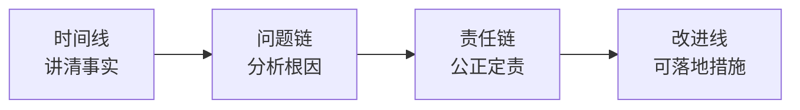

# 4.2 阶段复盘方法论
#### 目录介绍
- [01.同一类故障连续来三次](#01同一类故障连续来三次)
- [02.断点自测三问](#02断点自测三问)
- [03.复盘是什么](#03复盘是什么)
- [04.复盘的三个常见误区](#04复盘的三个常见误区)
- [05.四线复盘法](#05四线复盘法)
- [06.KPT复盘法](#06kpt复盘法)
- [07.问题复盘的完整模板](#07问题复盘的完整模板)
- [08.改进项落地铁三角](#08改进项落地铁三角)
- [09.这几个坑我踩过](#09这几个坑我踩过)
- [10.总结回顾这一节](#10总结回顾这一节)
- [11.后来发生的改变](#11后来发生的改变)
- [12.今天起改变三点](#12今天起改变三点)
- [13.课后作业思考下](#13课后作业思考下)
- [14.下一站生命线复盘](#14下一站生命线复盘)

## 01.同一类故障连续来三次

那一年我刚转岗到一个稳定性方向的小组，年中的时候我们出过一个 P2 故障：某个下游接口超时把上游线程池打满，最后业务侧大面积报错。当时我跟老板说：「写复盘了，加监控、加超时、加降级。」老板点头放过。

四个月后，**几乎一模一样**的故障又来了一次，只是触发的下游变成了另一个。我又写了一份复盘，加监控、加超时、加降级。再过四个月，**第三次**。这次老板没说话，把我们三次的复盘文档摆在一起，一字一句念给我听：

> 「第一次的改进事项里写：『后续梳理所有下游调用』，时间 9 月底，**没人跟进**。
> 第二次的改进事项里写：『增加全链路压测』，时间 1 月底，**没人验收**。
> 第三次……你想让我念吗？」

我当时整张脸是烧的。**我以为我在做复盘，其实只是在写「故障作文」。**

散会之前，老板对我说了一句话，我记到现在：「复盘不是写完那一刻完成的。复盘是从你把改进项交给具体的人、定下具体的时间、并且真的有人来验收那一天开始，才算真正发生。」

那次之后我才开始认真琢磨：到底什么才是一次「真正的」复盘？**时间线、问题链、责任链、改进线，这四条线一条都不能少**，少哪一条复盘都会变成一份没人记得的 Word 文档。

## 02.断点自测三问

四断点里「事后不复盘」有一种更隐蔽的形式：**你在复盘，但复盘没生效**。用三问自测你最近半年的复盘：

| 断点自测三问 | 你最近半年的复盘 | 若答「否」意味着 |
| :--- | :--- | :--- |
| 每一条改进项都有 Owner 和 DDL 吗？ | □ 都有 □ 没有 | 改进项是「空气」 |
| 到期后有专人验收改进项落地情况吗？ | □ 有 □ 没有 | 改进项没人管 |
| 同一类问题最近半年重复出现过吗？ | □ 没有 □ 有 | 上次复盘没落地 |

三问里有一个「否」，你的复盘就还停留在「写故障作文」阶段。真正的复盘从改进项被指派、落地、验收的那一天开始。

## 03.复盘是什么

复盘是一个围棋术语，指对局结束后回顾记录、检查招法的优劣和得失关键，并根据分析提出更好的招法，提升以后的对局能力。后来这个思路被引入到管理工作中。

技术人员主要参与的是**线上问题复盘**：业务或者系统出现了线上问题，在问题解决之后组织复盘。虽然无论做什么都不可能完全杜绝问题的发生，但这并不意味着我们只能坐以待毙。**1 年发生 3 次和 1 年发生 1 次，影响和意义完全不同。**

需要复盘的四类典型场景：

| 场景 | 复盘目的 |
| :--- | :--- |
| 线上故障/事故 | 找问题原因、避免复发 |
| 项目完结（成功或失败） | 沉淀经验教训 |
| OKR 目标没达到 | 反思年度产能与自身问题 |
| 生活中重大事件 | 事前事中事后梳理 |

**问题复盘的意义在于找到问题的原因然后加以改进，避免同样的问题反复出现，降低问题发生的概率和影响。**

## 04.复盘的三个常见误区

很多人对复盘有几个典型误区：

**误区一：把「复盘」等同于「回顾我做了什么」**。结束了一天的工作，睡前总结今天做了哪些事、有什么收获、打个分。这是「日记」，不是复盘。

**误区二：把复盘变成一次「怀旧会」**。项目做完开个总结会，大家凭回忆和直觉讲讲项目里做得好的经验、做得不好的地方，然后把内容整理下来封存起来。这也是很多人的习惯模式。**有用吗？有。但仅停留在这个程度远远不够。**

**误区三：把复盘写成「作文」**。用漂亮的词句写完文档、走完流程、归档结束。像我三次故障那样，写得再多也阻止不了下一次复发。

复盘的真正目的不是让自己觉得「我做了很多事情」很满足，也不是让自己发现「我做得还不够好」自责，而是：**把经验变成自己的养分吸收、化为己用，让自己比过去的自己再多迈出一步**。

事事总结、强调意识、举一反三，这是复盘的三条底层原则。原则上，所有线上问题（含 pre 发现的严重问题）都有必要复盘并形成文档；违规操作或严重主观意识问题升格处理，难以规避的技术问题酌情降级；凡是犯某个具体错误的都需要承担梳理上下游类似问题的责任，把问题当成学习机会。

## 05.四线复盘法

问题复盘的内容涵盖**事实、分析、定责、改进**四个部分。一次成功的复盘需要达成 4 个目标：讲清楚事实、全面且深入分析、得出让各方心服口服的定责结论、制定可以落地的改进措施。

四线复盘法就是通过时间线、问题链、责任链和改进线这 4 条不同的线索来展开复盘：

四条线各自的核心内容一张表看清：

| 线索 | 目标 | 关键内容 |
| :--- | :--- | :--- |
| 时间线 | 讲清事实 | 问题发现、处理措施、恢复时间、影响结果，精确到分钟 |
| 问题链 | 全面深入分析 | 问题的传导路径，通常多个原因「碰巧」组合而成 |
| 责任链 | 公正定责 | 结合影响+定级标准+问题链，确定团队或个人责任 |
| 改进线 | 制定落地措施 | 具体措施+改进责任人+时间节点 |

**时间线**是复盘的基础。时间信息非常关键，因为它能反映问题发现速度、各项措施执行时间和团队响应效率等指标。如果连事实都没讲清楚就开始分析、定责和改进，无异于搭建空中楼阁。

**问题链**是根因分析的核心。通常一个问题往往不是单一原因导致的，而是多个原因组合在一起导致的。只有分析整个问题的传导路径，才能全面地了解产生问题的过程。这里可以调用 5W（详见 3.7）和鱼骨图（详见 3.8）作为具体工具。

**责任链**是让复盘有约束力的关键。一个问题的发生往往是整个流程上多个环节相关的人处理有问题，才导致最终问题的发生。**定责必须基于事实和标准，不能按级别和关系拍脑袋。**

**改进线**是复盘的产出物。改进计划的思路来源于两个方面：时间线找到问题处理过程中不合理和可以优化的地方；问题链找到具体需要解决的问题。具体措施可以是流程调整、技术手段、团队方面的措施等。

**改进措施必须可以落地**。不能说「后期要更加认真」「后期写代码更细心」这种说了跟没说的话。要具体到「和之前代码对比、罗列 case、自测、同事 code review」这种可以真正执行的动作。

## 06.KPT复盘法

KPT 法与其说是一个方法，不如说是一个原则。它在复盘时问自己三个问题：

| 字母 | 含义 | 使用建议 |
| :--- | :--- | :--- |
| K | Keep 保持 | 哪些行为可以保持？→ 归纳为方法论 |
| P | Problem 问题 | 遇到了哪些问题？→ 整理为核对清单 |
| T | Try 尝试 | 我可以尝试做什么？→ 落到「行动卡片」 |

单纯把这些东西记下来意义不大，**你要真的落到实处才有用**：

- **Try 部分**可以跟「行动卡片」结合起来，用行动卡片把「尝试」落实、具体化。
- **Problem 部分**可以通过主题汇总和模板整理成一张核对清单，下次行动时对着打钩，减少思考成本。
- **Keep 部分**可以考虑归纳出方法论，无论是指导自己的实践还是传授给别人都非常有用。

KPT 比较适合**周复盘/月复盘**这种轻量场景，因为它足够快。四线复盘法比较适合**故障复盘/项目复盘**这种重量场景，因为它更全面。两者可以并存。

## 07.问题复盘的完整模板

一份完整的问题复盘至少包含下面 5 个部分：

**一是事故描述**。对事故的具体表现表述清楚：正常情况下逻辑是什么，出现问题后表现是什么，大概什么时候遇到的，可以用截图方式说明。

**二是影响数据**。数据口径要准确，要说明影响数据的计算公式。定级是根据受影响功能使用量、受影响用户数、资损三个维度来定级。若事故对这三个维度都有影响，需要把相关数据都统计，以影响最大的维度定级。

**三是事故回放**。事故时间线不要漏了关键节点，处理人、采取对应的行动和原因。时间线需要完整，包含事前、事中、事后的动作。初期到末期的过程是怎么样的？过程之中大致可以分为几个阶段，每一个阶段都发生了什么？我们是如何应对的？

**四是原因分析**。分成直接原因和深层原因两层：

- **直接原因**是直接导致事故发生的原因，常见的是代码逻辑问题、分支合并、并发等。
- **深层原因**是挖掘为什么会出现这个事情深层次原因，也要从事前、事中、事后角度分析。挖掘的方法可以在原有问题上再问为什么，比如为什么事故持续时间这么长？为什么代码逻辑有问题？为什么这个问题没有被发现？

**深层原因才是我们要复盘解决的问题**，能够避免相同问题再出现。

**五是解决方案与改进措施**。止损方案详细描述、解决方案详细描述并决定什么时候解决。改善措施一定要写切实可落地的，和原因分析得出的结论要相对应，并且要有完成时间和跟进人。

## 08.改进项落地铁三角

复盘最重要的目的和输出结果只有一个：**规律总结**。这种规律包括认知方面（对思考问题和解决问题的方法有哪些心得）和实践方面（如果历史重演，我们应该如何做）。

而所有的规律总结都要最终落到改进项上。改进项能不能落地，取决于三样东西，我称之为「改进项落地铁三角」：

| 要素 | 作用 | 缺失后果 |
| :--- | :--- | :--- |
| Owner | 具体到人 | 无人负责，改进项漂着 |
| DDL | 具体到日 | 无期限，永远做不完 |
| 验收人 | 到期核对 | 无人验收，等于没做 |

**三者缺一不可，缺一条这个改进项就等于没写。**

写复盘的时候一定要把这三个字段作为「必填项」，最好在文档里做成表格强制格式，任何一条改进项要有这三列才能提交。文档提交后半个月还没动静，验收人有责任在群里 @Owner 追进度。**复盘不是写报告，而是把「踩过的坑」变成「团队的护栏」，只有改进项被指派到人、定到天、并且被验收过，复盘才算真正发生过。**

## 09.这几个坑我踩过

我踩过的复盘坑里，五个最典型：

| 常见误区 | 具体表现 | 正确做法 |
| :--- | :--- | :--- |
| 复盘写成作文 | 措辞漂亮、无一条落地 | 每条改进带 Owner+DDL+验收人 |
| 改进项虚泛 | 「加强意识」「更细心」 | 落到具体动作和数字 |
| 定责按级别 | 谁级别低谁背 | 按「是否可避免+是否按规范」两维 |
| 只写一次的复盘 | 归档就结束 | 到期由验收人核对状态 |
| 同类问题反复出现 | 每次都写复盘、每次都出 | 第二次就升级处理 |

其中最坑的是「复盘写成作文」和「同类问题反复出现」是一对因果。第一份复盘没落地，就一定会有第二份、第三份。**同一类问题第二次出现就是警报，说明上一次复盘没落地，必须升级处理。**

另外一个隐形坑是「复盘会开成批斗会」。定责如果没有事实和标准的支撑，只按个人喜好和级别划，会伤害团队士气、把复盘变成没人敢参加的会。正确的做法是**先定「是否可避免」+「是否按规范」两个维度，再根据两维交叉划定责任**，而不是拍脑袋。

## 10.总结回顾这一节

复盘的终极目标是把「踩过的坑」变成「团队的护栏」，只有改进项被指派到人、定到天、并且被验收过，复盘才算真正发生过。

三条最关键的实操：

- **改进项必须有「人」和「时间」和「验收」**：没有 Owner 和 DDL 和验收人的改进项，等于没写。
- **同一类问题第二次出现就是警报**：说明上一次复盘没落地，必须升级处理。
- **复盘的产出物是 SOP，不是 Word**：能复用的经验要变成检查清单或自动化脚本，才能真正「举一反三」。

问题复盘的内容涵盖事实、分析、定责和改进 4 个部分。四线复盘法就是通过时间线、问题链、责任链和改进线这 4 条不同的线索来展开复盘，从而实现事实、分析、定责和改进这 4 个部分的目标。KPT 法是它的轻量版，适合周复盘/月复盘这种小尺度场景。

## 11.后来发生的改变

那次老板把三份复盘拍在我面前之后，我做的第一件事不是改流程，而是建了一张飞书表格，六列固定字段：**故障 ID、改进项、Owner、DDL、验收人、状态**。每一条改进项必须把这六列全部填满才能入库。表格设了自动提醒：DDL 前 3 天提醒 Owner，过期当天提醒 Owner + 验收人。一个月内，过去半年里 17 项**僵尸改进项**被全部清盘，其中真正落地的有 11 项，剩下 6 项重新评估后被合并或者关闭。这张表格后来成了我们组的「事故防线」。

我把「四线复盘法」贴在工位上，每次组里出问题都拉着相关人按四条线挨个过。时间线精确到分钟、每个原因追 3 个为什么、责任按「是否可避免+是否按规范」两个维度划、每条改进必须有 Owner+DDL+验收人三缺一不收。第一次按这个流程做的时候，复盘会从原来的 1 小时开到了 2.5 小时，会后我组员还跟我抱怨「开太久」。但**那一类故障从那以后再没复发过**。三个月后组员开始说：「原来复盘可以这样开。」

半年后部门年度总结，我被拉去做了一场跨组分享，主题就是「如何让复盘真正发生」。我把那张飞书表、四线复盘的模板、改进项验收 SOP，整套打包给了其他组。更让我意外的是年终述职那天，老板单独反馈了一句话：「你这一年最大的成长，不是修了多少 bug，而是开始对『同一类问题不再发生』负责了。」我才意识到，**复盘真正改的不是流程，而是一个工程师对「重复犯错」的容忍度**。

## 12.今天起改变三点

**第一，从本周开始养成每周复盘的习惯**。每周五下班前花 30 分钟，用 KPT 法回顾这一周：哪些做得好可以 Keep？哪些遇到了 Problem？下周可以 Try 什么？不需要写很多，3-5 条足够。坚持一个月后你会发现，你对自己工作质量的掌控力明显提升。

**第二，下次遇到线上问题或重大事故时，用四线复盘法来组织复盘**。先理清时间线（发生了什么），再分析问题链（为什么会发生），然后明确责任链（谁来负责），最后制定改进线（怎么避免再次发生）。按照这个框架来复盘，既全面又公正。**记住：每条改进必须带 Owner、DDL、验收人，三者缺一不收。**

**第三，把复盘得到的好经验固化为流程**。复盘最大的价值不是发现问题，而是让好的做法变成团队的标准操作。如果你发现某个做法效果很好，就把它写成 SOP（标准操作流程），让团队所有人都能受益。**能自动化的东西不要靠意识，能写成检查清单的不要靠记忆**，这才是复盘的终极目标。

## 13.课后作业思考下

1. 翻一翻你过去半年写过的复盘/总结，数一数：里面有多少改进项**真的被执行**了？比例如果低于 50%，说明复盘流程出了问题，问题出在哪？
2. 选最近发生的一件「事与愿违」的事（项目延期、汇报翻车、争吵），用**四线复盘法**写一份不超过一页的复盘，重点是「改进线」必须可落地。
3. 用 KPT 法对你**这一周**做一次复盘：哪些行为可以 Keep？遇到了哪些 Problem？下周可以 Try 什么？写完贴在工位上，下周五对着打钩。
4. 你生活中是如何进行复盘的？针对复盘的提升你有什么好的点子？可以尝试用四线复盘法分析一次你生活中的挫折事件。

## 14.下一站生命线复盘

到这里我们讲了两种复盘：**单件事情用 4D 装弹药库**（详见 4.1），**阶段问题用四线复盘找规律**（本节）。

但事后复盘还有一个更宏观的场景：**一个人的整段职业生涯**。如果说 4D 是「点」、四线复盘是「线」，那么生命线复盘就是「面」，**把你从入职第一天到今天所有的重要节点画在同一根轴上做一次深度体检**。

下一节讲生命线复盘方法，教你用一根时间轴看清「你从哪来、现在在哪、要到哪去」，让每一次成长都有可视化的坐标。
