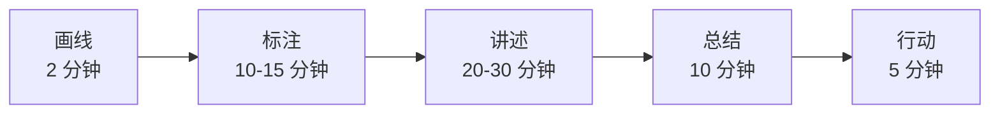

# 4.3 生命线分享游戏
#### 目录介绍
- [01.29岁生日的失眠夜](#0129岁生日的失眠夜)
- [02.断点自测三问](#02断点自测三问)
- [03.生命线分享是什么](#03生命线分享是什么)
- [04.第一步 画线记事件](#04第一步-画线记事件)
- [05.第二步 讲述与阐述](#05第二步-讲述与阐述)
- [06.第三步 回顾总结](#06第三步-回顾总结)
- [07.四种典型使用场景](#07四种典型使用场景)
- [08.生命线的自我复盘](#08生命线的自我复盘)
- [09.这几个坑我踩过](#09这几个坑我踩过)
- [10.总结回顾这一节](#10总结回顾这一节)
- [11.后来发生的改变](#11后来发生的改变)
- [12.今天起改变三点](#12今天起改变三点)
- [13.课后作业思考下](#13课后作业思考下)
- [14.下一站卷二结语](#14下一站卷二结语)

## 01.29岁生日的失眠夜

29 岁生日那个晚上，我一个人坐在客厅，关着灯，越想越焦虑。再过一年我就 30 岁了，但我对自己的人生毫无信心：工作做了 7 年，但好像一直在原地打转，每次跳槽都是因为「在这里不开心」，从来没想过「我到底想去哪」；学了一堆课程、买了一柜子书，但回头看真正读完用上的不到 10%，钱白花了一大堆。

那一晚我失眠到凌晨四点。脑子里反复出现一个问题：**我到底是个什么样的人？我过去 29 年到底学到了什么？**

天快亮的时候我突然想到，以前在一本书里看过「生命线」这个东西，说能帮人看清自己。我索性爬起来，找了一张 A4 纸，画了一条横线，最左是出生、最右是当下。然后**强迫自己回忆，至少标 15 件对人生有影响的事**。

我画了整整一个半小时。当我画完最后一笔，往后退一步看那张纸的时候，**我惊呆了**。我看到了三件以前从没意识到的事：

- **我每次重大决定都是「逃避型」**：离开老家是因为受不了父母管，从国企跳槽是因为受不了氛围，这一次想跳槽是因为受不了 PUA。**几乎没有一次是「奔着某个目标去」。**
- **我的高光时刻全部集中在「被人推着做」的事情上**：大学社团换届被推选会长那年我做出了人生最骄傲的项目，工作中第一个晋升也是被领导硬推的。
- **我的重大失误都有一个共同点，拖延到不能再拖**：感情的恶化、健康的下滑、机会的错过，全是因为我能拖就拖。

那一刻我哭了出来。**我居然 29 岁了才第一次真正「看见」自己**。下面这套生命线方法，就是那一晚救了我，从此让我每年都会做一次的工具。

## 02.断点自测三问

事后复盘的最高层次不是复盘一次事故，也不是复盘一个季度，而是**复盘整个人生阶段**。它对应「四断点」里最深一层的问题：你其实不知道自己是谁、要去哪。用三问自测：

| 断点自测三问 | 你现在的状态 | 若答「否」意味着 |
| :--- | :--- | :--- |
| 你能列出人生 10 个最关键的事件吗？ | □ 能 □ 不能 | 对自己的过去毫无梳理 |
| 你能说出重复出现的成功模式或失败模式吗？ | □ 能 □ 不能 | 陷在不自知的怪圈里 |
| 你能用一句话回答「我要去哪」吗？ | □ 能 □ 不能 | 前路模糊，容易漂 |

三问里有一个「否」，你就还欠自己一次「人生审计」。生命线复盘的价值不在图形，而在于把散落 20-30 年的经历放在同一条时间轴上做一次视觉化的对照。

## 03.生命线分享是什么

自我认知的重要性大家都知道，清晰且正确的自我认知决定了我们能不能更好的成长，以及更大概率地获得成功。但这并不是一件简单的事，说它是人生中最大的难题也不为过。多少人终其一生，对自己也没有正确的认识。

生命线分享是进行自我认知的一种工具，通过回顾与分析你过往的人生经历，挖掘出那些积极与消极的事件，看哪些节点对「你成为今天的你」产生了较大的影响。在这个过程中，你会更进一步认识到自己所具备的特质与缺陷，比如性格、能力、价值观等。

它和前两节复盘方法的关系是：

| 复盘层次 | 时间跨度 | 工具 |
| :--- | :--- | :--- |
| 单事件复盘 | 一件事 | 4D 总结法（详见 4.1） |
| 阶段复盘 | 一个季度/半年/一年 | 四线复盘/KPT（详见 4.2） |
| 人生复盘 | 出生至今 | 生命线（本节） |

**4D 是点、四线是线、生命线是面**。三者共同构成完整的复盘体系。整个生命线分享流程可以拆成五个步骤：

## 04.第一步 画线记事件

准备一张白纸，在白纸上画一条横线。横线的最左边表示你的出生时间点，最右边表示现在。留出足够的上下空间用于标注。

用 10-15 分钟时间回忆你成长过程中让你印象深刻的事情，然后把这些事情按照时间顺序在横线上一一标注出来。**至少标 10-15 件**，太少反映不出模式。

标注规则一张表看清：

| 位置 | 含义 |
| :--- | :--- |
| 横线上方 | 对你有积极影响的事件 |
| 横线下方 | 对你有消极影响的事件 |
| 距横线远近 | 事件对你的影响程度（越远影响越大） |

事件类型没有限制：学业选择、亲情关系、恋爱结婚、跳槽晋升、健康变化、财务大事、精神成长、社群加入……只要是你回忆时「有强烈感受」的都算。**不要美化，也不要遗漏那些你不愿面对的**。

## 05.第二步 讲述与阐述

对标注出的每一个事件进行讲述。讲述的时候要**尽量真实和完整**，包含时间、地点、人物、情景、情节等要素。同时要尽可能深入到故事中的每一个细节：

| 讲述要素 | 具体展开 |
| :--- | :--- |
| 客观 | 当时发生了什么？谁在场？地点是哪？ |
| 心理 | 你当时是怎么想的？有什么情绪？ |
| 行动 | 你做了什么？为什么这么做？ |
| 结果 | 最终得到了什么样的结果？ |
| 感受 | 你现在回头看有什么感受？ |

以自己画出的各个生命节点为起点，**想象是否存在不同的选择**，不同的选择是否会带来不同的结果，在不同选择上写出自己的情绪与感受。回过头来看，通过上帝视角看待过去，你觉得你的想法发生了什么样的变化？

**上帝视角**是这一步最关键的技巧。你现在的认知远高于当年做出决定的自己，用今天的视角重新审视当年的每个转折点，你会突然理解「为什么我当时那么怕」「为什么我要死磕那件事」。这些理解就是生命线复盘的核心产出。

## 06.第三步 回顾总结

回顾总结环节要看两类事件的共性：

**积极事件的共性 → 你的优点/成功模式**：善于沟通、执行力强、创新能力强、善于整合资源、擅长从零开始、只要下定决心就能做到……

**消极事件的共性 → 你的缺陷/失败模式**：没有明确目标、缺乏自律、拖延严重、回避问题、犹豫不决、总在关键时刻犹豫、容易被短期利益吸引……

**这些模式就是了解自己的钥匙**。再看看这些缺点是否如今依然影响着你：**你是不是陷在了一些不自知的怪圈里面走不出来，重复着失败？**

我的例子：我发现我的三个消极事件（跟父母的关系、大学谈崩的恋爱、离开国企那次跳槽）背后都是同一个模式，「不敢直接冲突所以选择逃避」。这个模式解释了我一半以上人生里的重要决定。**看见这个模式的那一刻，我才有能力去修正它。**

生命线绘画结束后，本着开放自愿的原则进行分享。**生命线分享其实就是另一种形式的人生复盘**，是一个能帮助你拨开记忆迷雾、让你尽可能真实认知自己的工具。

## 07.四种典型使用场景

生命线分享特别适合下面四种场景，每种场景节奏和禁忌不同：

| 场景 | 时长 | 关键节奏 | 禁忌 |
| :--- | :--- | :--- | :--- |
| 新团队破冰 | 每人 15 分钟 | 快速了解彼此背景 | 不强制分享敏感事件 |
| 年度团建 | 每人 20 分钟 | 加深老团队默契 | 鼓励分享近一年新增事件 |
| 一对一辅导 | 30-45 分钟 | 帮下属认识自己 | 以倾听为主、不做评判 |
| 职业规划 | 独立完成 | 梳理职业轨迹和方向 | 重点关注转折点选择逻辑 |

**新团队破冰**用生命线是最出彩的方式之一。相比自我介绍那种「我叫 XX、来自 XX、爱好是 XX」，生命线能让 5 人小组在一场活动内建立数月自我介绍都建立不起来的信任。

**一对一辅导**用生命线要格外小心边界。你是听众不是评审，你要做的是「点亮」而不是「评判」。**很多下属愿意分享真实的自己，是因为他们感觉这里是安全的。一旦你越界评价，这份信任就毁了。**

## 08.生命线的自我复盘

除了团队场景之外，生命线分享也是一个强大的**自我复盘工具**。每隔半年或一年，拿出之前画过的生命线，往后延伸，标注新增的事件。对比前后几次的生命线，你会清晰地看到自己的成长轨迹和变化趋势。

自我复盘时可以问自己三个问题：

| 自问句 | 目的 |
| :--- | :--- |
| 过去半年新增了哪些积极事件？ | 找到近期的成功模式 |
| 是不是正在重复以前的消极模式？ | 及时发现旧病复发 |
| 下一段生命线上我希望出现什么样的事件？ | 主动设计未来 |

**这种定期的「人生审计」能帮你保持清醒，避免在日常琐碎中迷失方向。**

生命线最迷人的地方在于它把「时间」这个最抽象的资源变得可以「看见」。人的记忆具备美化功能，回忆中的那个自己会比真实的自己更加优秀。故事一般都有因有果，当你深入讲述自己生命中的关键故事时，其实也在刨根问底寻找你成功或失败的根本原因。

如果你觉得这个方法对你有用，不妨把它作为一个常规项目，通过若干次人生复盘找到你的固有行为模式，总结出属于你的人生规律，为今后的行动提供参考和指引。

## 09.这几个坑我踩过

生命线看着简单，其实很容易滑入几个坑：

| 常见误区 | 具体表现 | 正确做法 |
| :--- | :--- | :--- |
| 只标积极事件 | 上方满、下方空 | 强制补下方，越痛越有价值 |
| 事件太少 | 只标 4-5 件 | 强制标 10-15 件才能显模式 |
| 只讲事实不讲感受 | 「我 XX 年考研」 | 加上当时的情绪+现在的理解 |
| 一次画完就结束 | 画完锁抽屉不再看 | 每半年补一次、每年重画一次 |
| 分享给不合适的人 | 讲给评判型的人听 | 只讲给信任 + 会倾听的人 |

其中最坑的是「只标积极事件」。人的自我保护机制会让我们下意识地美化过去，导致画出来的生命线全是「我人生中的高光时刻」。这种生命线基本没价值。**下方标出来的每一件消极事件都是一颗未爆的子弹，只有把它拿出来看清楚，你才有机会真正卸下它。**

另一个隐形坑是「分享给不合适的人」。生命线最忌讳讲给一个**评判型**的朋友听，他会挑刺、会说教、会给你分析对错。这不是生命线该有的氛围。**你要选那种「无评判、会倾听、有阅历」的人，你分享的时候他只会安静听、必要时问一句「后来呢」**。

## 10.总结回顾这一节

生命线分享是「人生级」的复盘工具。它做的事情很朴素，**在一张 A4 纸上，把 20-30 年的经历放在同一根时间轴上做一次视觉化的对照**，但它能挖出的东西，深过任何一本工具书。

三条最关键的实操：

- **必须至少标 10-15 件事**，才能显出模式。
- **必须包括下方（消极事件）**，否则等于自欺欺人。
- **必须每年重画一次**，让生命线变成成长坐标而不是纪念相册。

生命线分享是进行自我认知的一种工具。通过回顾与分析你过往的人生经历，挖掘出积极与消极的事件，看哪些节点对「你成为今天的你」产生了较大的影响。它是自我复盘、团队破冰、职业规划、一对一辅导都能用的通用工具，因为它触碰的是每个人最底层的东西，**「我是谁」**。

## 11.后来发生的改变

回到开篇那个 29 岁失眠的我。那张 A4 纸画完的清晨之后，我做了下面这些改变。

天亮之后我把那三个发现写在便签上，贴在了卧室门后。**发现一：我所有重大决定都是「逃避型」**，改变是以后每次重大决策必须先写「我要奔向什么」，而不是「我要逃离什么」；**发现二：我的高光全部来自被推着做的事**，改变是主动给自己制造「被推」的环境（公开承诺、找教练、加入硬核社群）；**发现三：我的重大失误都来自拖延**，改变是所有觉得「还能再等等」的事必须当下做出决定，否则就是默认放弃。这三条我贴了整整一年，每天起床第一眼就看到。

三个月后我把生命线分享给当时的女朋友（现在的老婆）听。她听完之后给了我一个之前我从没听过的反馈：「你说的那些『逃避』事件背后，其实都是因为你不敢让别人失望，所以宁可逃跑也不愿意正面冲突。」那一刻我又被点醒了，**原来我以为的「逃避」，本质是「讨好型人格」**。这个洞察是我一个人画图永远发现不了的，必须有信任的人帮我看见。后来我们俩约定，每年生日都做一次生命线分享，已经坚持了好几年。这成了我们关系最深的纽带之一。

第二年的我做了几件以前完全做不出的事：**第一次为「奔着想去的方向」跳槽**（为了进入心仪的赛道，主动降薪 20% 入职）；**公开报名了一个为期一年的写作训练营**（用「被推」的环境逼自己每周输出）；**和那个一直拖着没沟通的老父亲做了一次三小时的长谈**（多年的心结当场化解）。30 岁生日那天，我又拿出 A4 纸做了第二次生命线。当我把「过去一年新增的事件」标上去时，**横线上方的积极事件第一次超过了下方的消极事件**。更重要的是我终于第一次有了「我是谁、我要去哪」的清晰感。这种感觉，比之前涨多少薪水都更让我踏实。

## 12.今天起改变三点

**第一，今天就花 20 分钟画出你自己的生命线**。拿一张白纸，画一条横线，从出生到现在，标出至少 10 个对你人生有重大影响的事件。积极的放上面、消极的放下面，离横线的距离表示影响程度。**不要美化过去，也不要跳过让你痛的事件**。画完后你会对自己的人生轨迹有一个全新的认知。我自己第一次画完的那个清晨，看清了 29 年都没看清的三件事。

**第二，从生命线中找到你的行为模式**。看看那些让你成功的事件中，有没有共同的因素（比如「只要下定决心就能做到」「擅长从零开始做事」）？那些让你受挫的事件中，有没有共同的模式（比如「总是在关键时刻犹豫」「容易被短期利益吸引」）？**把发现的模式写成便签贴在卧室门后，每天提醒自己。** 我贴了整整一年，才把「逃避型决策」这个模式真正改掉。

**第三，找一个信任的人做一次分享**。找一个你信任的朋友或家人，做一次生命线分享。把你的生命线讲给对方听，详细描述那些关键事件。**对方的反馈往往能帮你看到自己看不到的盲点**，我自己就是被老婆点出「逃避」背后是「讨好型人格」的，这是一个人画图永远看不到的洞察。记住：分享的前提是信任和安全感，选那种会倾听而不是会评判的人。

## 13.课后作业思考下

1. 画出你的生命线，标出至少 10 个关键事件。对每个事件写一段话：当时发生了什么？你是怎么想的？怎么做的？结果如何？如果重来一次你会怎么做？
2. 从你的生命线中找出 3 个积极事件和 3 个消极事件，分析它们的共同点。你能从中发现什么关于自己的行为模式？把这些模式写成便签贴在卧室门后。
3. 把生命线往未来延伸：你希望未来 5 年在这条线上标注什么样的事件？这些期望反映了你什么样的人生追求？和第 2 题发现的模式对照，你是否需要先修掉某些模式才能实现这些期望？
4. 如果你是团队 Leader，试着在团队建设活动中组织一次生命线分享。注意提前说明「无评判、可保留」的规则。记录这次活动对团队关系和信任度的影响。

## 14.下一站卷二结语

到这里，卷二《自我精进·成事》的 25 个方法全部讲完了。让我们回到卷二开篇那张「做事链路四断点」的图上，看看这 25 个方法各自补在了哪一断点上：

| 断点 | 章节 | 核心方法 |
| :--- | :--- | :--- |
| 目标不成立 | 第 1 章 目标管理 | OKR / SMART / 目标分解 / 检查改进 |
| 事前没谋划 | 第 2 章 事前谋划 | SWOT / MECE / 二八 / 3C / RACI |
| 事中会失控 | 第 3 章 事中执行 | PDCA / 番茄 / 六顶帽 / 金字塔 / STAR / 5S / 5W / 鱼骨图 |
| 事后不复盘 | 第 4 章 事后复盘 | 4D / 四线复盘 / 生命线 |

如果说卷一《自我精进·学习》教你的是「怎么把知识变成能力」，那么卷二《自我精进·成事》教你的就是「怎么把能力变成结果」。**从「学到」到「做到」，中间隔的就是这 25 个方法。**

接下来请翻到卷二结语。那里等着你的，是这一路走来我最想留给你的三句话，它们不属于任何一节，只属于「读完了卷二的你」。
