# 4. 沟通能力的演进
#### 目录介绍
- [01.看一个真实案例](#01看一个真实案例)
- [02.什么是沟通能力](#02什么是沟通能力)
- [03.高效倾听的模型](#03高效倾听的模型)
- [04.三明治的沟通法](#04三明治的沟通法)
- [05.别总封闭性问题](#05别总封闭性问题)
- [06.情绪优先沟通法](#06情绪优先沟通法)
- [07.非暴力沟通模型](#07非暴力沟通模型)
- [08.沟通中提问技巧](#08沟通中提问技巧)
- [09.螺旋推进沟通法](#09螺旋推进沟通法)
- [10.柔和沟通六原则](#10柔和沟通六原则)
- [11.场景化沟通训练](#11场景化沟通训练)
- [12.总结回顾本章节](#12总结回顾本章节)
- [13.后来发生的改变](#13后来发生的改变)
- [14.今天起改变三点](#14今天起改变三点)
- [15.课后作业思考下](#15课后作业思考下)

## 01.看一个真实案例

那是一个周三晚上，我加班到 10 点回家，老婆在客厅坐着等我。我累得不想说话，进门换鞋。她看了看时间，说了一句："**你怎么每次都搞这么晚？是不是都不顾这个家？**"

我那时候火就上来了。我把电脑包往沙发一摔："**我加班是为了谁？我累一天回家还要被你审？你能不能先关心我累不累再说别的？**"

她"啪"地把手里的水杯放下，回卧室关门。我也赌气进了书房。**那一晚，到后面三天，我们没说一句话。**

第三天晚上她终于先开口，眼睛红红地说了一句让我愣住的话：**"我等你回来，是因为今天体检报告出来了，有点担心，我想跟你说说……我哪里在意你加班，我是想你了。"**

那一瞬间我脑袋"嗡"了一下。**我们吵了三天，吵的根本不是"加班晚不晚"——她要的是"我担心，你抱抱我"，我以为的是"她在指责我"。**

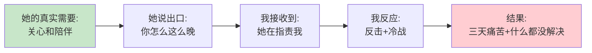

和好之后的那个周末，我做了一件以前从没做过的事：翻出我们的聊天记录，把最近半年吵过的架一条条过了一遍。结果让我在书桌前坐了很久——**十次争吵，八次是同一个剧本**：她带着需求开口，我听到的是指责；我带着疲惫回应，她听到的是冷漠。

| 吵架的导火索 | 她的真实需求 | 我听成的意思 |
|-------------|-------------|-------------|
| 你怎么又这么晚 | 想我、担心我 | 她在审判我 |
| 你就知道玩手机 | 想跟我说说话 | 她在挑刺 |
| 家里的事你从来不管 | 希望我搭把手 | 她在否定我的付出 |

**问题从来不在"晚不晚"本身，在于我把"需求"一次次听成了"指责"。**

那晚我抱着她，第一次认真问自己：**我是个工科男，每天写代码、做架构、评审技术方案都没问题，为什么一到沟通就跌到不及格？**

后来我读了《非暴力沟通》《关键对话》《好好说话》，想明白了一件事——**沟通不是天赋，不是机灵话，是一套有迹可循的系统**。听、说、问、推进，每一环都可以拆开练习。这篇要讲的，就是这套系统。

## 02.什么是沟通能力

先搞清楚一个被大多数人忽略的问题：什么才算"沟通"？

街头大妈们家长里短地唠嗑，算沟通吗？大学课堂上教授口若悬河地讲课，算沟通吗？

**都不算。**大妈聊天漫无目的，有"多向"没有"目的"；教授讲解有目的，但没有跟学生的互动，就只是单向输出。**沟通是"有目的的多向信息交流"**——目的和多向，缺一不可。形式倒不拘泥：谈话、邮件、留言、一个眼神，只要完成了信息和情感的往返，都算沟通。

这个定义给你两个随时可用的自检：**沟通是有目的的**——我此刻的言行，是在帮我达成初衷，还是在妨碍初衷？**沟通是多向的**——对方知道我的真实想法了吗？我了解对方的真实想法了吗？这两个问题，后面所有的方法里都会反复出现。

展开来讲，这套系统有五个可以练习的模块：

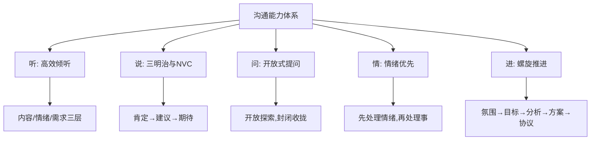

后面九节，就是把这五个模块一个一个拆开讲。

## 03.高效倾听的模型

倾听是整个系统的第一环——**沟通的顺序，是先听，后说。**

**高效倾听不只是听到内容，更是理解对方表达的情感、需求和意图。**它有六个可落地的动作：

1. **保持开放专注**：注意力完全放在对方身上，不刷手机、不走神。
2. **积极的身体语言**：面向对方、点头、保持眼神交流。
3. **避免打断对方**：哪怕不同意，也先让对方说完。
4. **反馈与确认**：复述对方的话、总结观点，确认"我理解的"和"你表达的"是一回事。
5. **理解和共情**：站在对方角度想问题。
6. **记录和总结**：关键信息适当记录，沟通后回顾。

但这六个动作只是"外功"。真正区分会听和不会听的，是内功——**倾听的三个层次**：

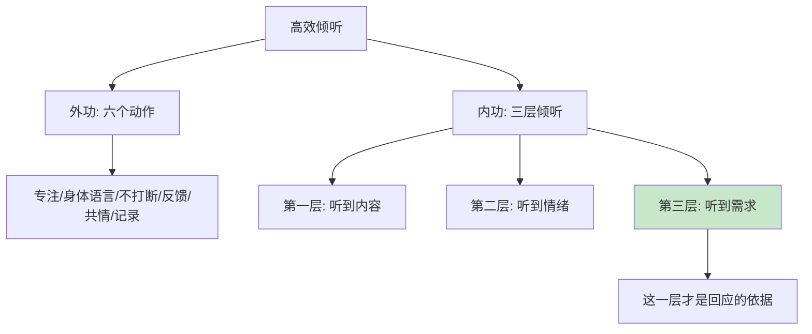

- **第一层，听到内容**：她说"你怎么这么晚"——字面上是在问时间。
- **第二层，听到情绪**：她的语气里有委屈、担心、失落。
- **第三层，听到需求**：她真正在说的是"我想你了，我需要你陪我"。

我那晚的失败，就是只听到第一层就开头反击。**大多数沟通的失败，不是因为没听到内容，而是因为只听到了内容。**

一个可执行的练习：对方每次说完，开口之前先在心里默答两个问题——"他现在的情绪是什么？他真正想要的是什么？"答不出来，说明你还没听完。

## 04.三明治的沟通法

听懂了对方，轮到你开口。开口里最难的一种，是**让对方改变**——提建议、给反馈、纠正问题。

一味批评最容易激发抵抗：对方的第一反应不是"我怎么改"，而是"我没错"。**三明治沟通法**就是为此设计的——把好的放在上下，把不好的夹在中间：

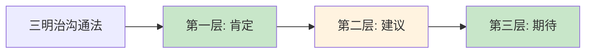

拿一次真实的代码评审举例。下属交上来的方案有明显漏洞，两种说法：

**直球版**："这个方案不行，数据一致性根本没考虑，重做。"

**三明治版**："整体思路是清楚的，服务拆分也合理（**肯定**）。数据一致性这一环有个漏洞，双写失败的时候两边会不一致，我们一起看看怎么补（**建议**）。这块补上，这个方案就能直接拿去立项了（**期待**）。"

同样的问题，第二种说法对方听得进去。原理不复杂：**先肯定，是卸下对方的防御；中间建议，指出具体的改变点；结尾期待，给对方一个改变之后的画面**——人不是被批评驱动的，是被"更好的自己"驱动的。

两个使用陷阱必须说在前面：**一是肯定要具体**——"你真棒"式的敷衍夸奖，只会让对方预感到"但是"要来了，反而更警惕；**二是别天天用**——三明治是重武器，日常小事直接说就好，把三明治留给真正需要对方改变的场合。

## 05.别总封闭性问题

会说之后，要会问。先看一个大多数人天天在犯的错误。

"你喜欢吃橙子吗？""你周末会去健身吗？"——这些都是**封闭式问题**：问题里预设了选项，对方只能答"是/否"，或从有限的选项里挑。它像一道选择题，把对话的空间提前焊死了。

**开放式问题**刚好相反："看你去了那么多地方，你最喜欢哪里？"——对方可以讲地点、讲经历、讲为什么喜欢，话匣子是自己打开的。**封闭式问题给对方一道选择题，开放式问题给对方一道作文题。**

日常聊天里，封闭式问题一多，对话会迅速枯死：

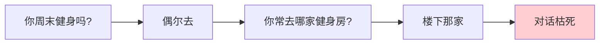

但封闭式问题并非一无是处，关键在**顺序**。真正会聊天的人用的是"漏斗式提问"：**先用开放式问题打开——"你周末休息的时候，一般最喜欢做什么？"等话题打开、聊到具体的事了，再用封闭式问题收拢——"那这周六要不要一起去爬山？"**

开放式负责探索，封闭式负责成交。**只开放，聊天飘着落不了地；只封闭，聊天干着走不下去。**先开后闭，一段对话才算完整。

## 06.情绪优先沟通法

前面讲的都是"事"的层面。沟通里最难的部分，是对方带着情绪来的时刻——伴侣的委屈、同事的火气、客户的不满。

先记住一条铁律：**情绪不通，道理不进。**人在情绪激动的时候，理性分析的能力会被大幅压制——这就是为什么对方在气头上时，你讲的每一句大道理，哪怕百分百正确，都只会火上浇油。**跟情绪讲道理，就像对着火灾念说明书。**

正确的动作永远是三步，顺序不能乱：

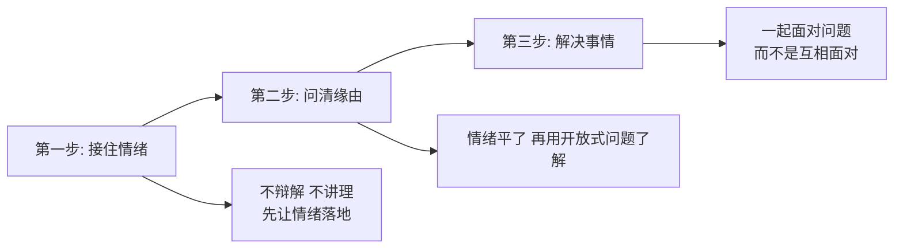

**第一步，接住情绪。**这一步最反直觉：不解释、不分对错，只让对方的情绪落地。对伴侣，可能是一个拥抱、一句"我知道你现在很难受"；对同事，可能是"这事换我我也来火"。**情绪被看见的那一刻，就已经消掉了一半。**

**第二步，问清缘由。**等情绪的浪头过去，再用开放式问题了解发生了什么："你跟我说说，具体怎么回事？"注意，是问，不是审。

**第三步，解决事情。**到这里才轮到分析问题、商量对策。此时你们的站位是"我们一起对问题"，而不是"我对你错"。

回头看开篇那晚：她说"你怎么每次都搞这么晚"，如果我的第一反应不是反击，而是接住情绪——"今天是不是有什么事？我听你说"——那三天的冷战，三分钟就能结束。**亲密关系里的大部分争吵，争的从来不是事，是"你有没有看见我"。**这条法则不只用于伴侣：对家人、对同事、对客户，只要对方带着情绪来，就先处理情绪。

## 07.非暴力沟通模型

情绪优先讲的是"接住对方的情绪"，这一节讲"管住自己的表达"。两者合起来，就是**非暴力沟通（NVC）**——由美国心理学家马歇尔·卢森堡创立，核心理念是：**冲突通常源于人的基本需要未被满足，而不是表面上争的那件事。**

NVC 有四个要素：**观察 / 感受 / 需要 / 请求**。

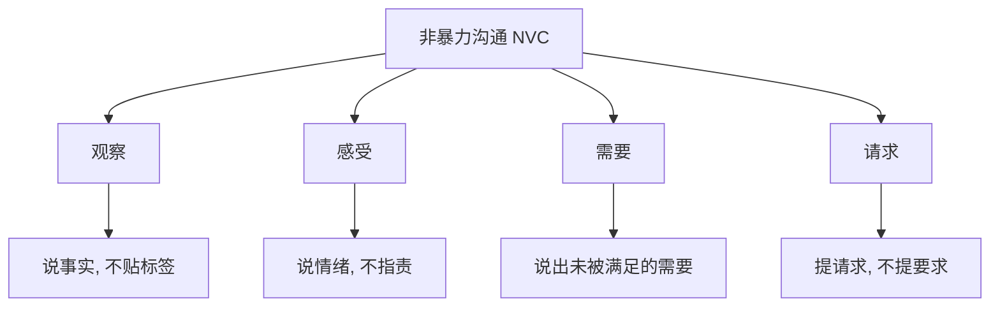

四个要素里，最关键的是两组对比：

| 错误做法 | 正确做法 | 区别在哪 |
|---------|---------|---------|
| 评论：你从来不顾这个家 | 观察：这周你有三天十点后到家 | 评论是贴标签，观察是摆事实 |
| 要求：你必须早点回来 | 请求：这周你能挑一天早点回来吃晚饭吗 | 要求被拒会引发惩罚，请求允许对方说不 |

现在，用 NVC 把开篇那句话重写一遍。她的原话："你怎么每次都搞这么晚？是不是都不顾这个家？"——翻译成四要素：

> "这周你有三天十点多到家（**观察**）。我一个人等你，挺担心也挺想你的（**感受**）。我很需要我们有一些相处的时间（**需要**）。这周你能挑一天早点回来，陪我吃顿晚饭吗（**请求**）？"

同一件事，两种说法。第一种是发射导弹，我本能反击；第二种是递出邀请，我只想抱她。**非暴力沟通不是把话说客气，是把"指责"翻译回"需求"**——指责让人竖起盾牌，需求让人走近。

我的回应同样可以是四要素："听到你这么说，我知道你等急了（观察+她的感受）。我今天累得话都不想说，但我不想让你担心（我的感受）。给我十分钟缓一缓，然后我们好好聊聊体检报告的事，好吗（请求）？"

NVC 还有四种高频落地场景：**面对自己的错误**——用"哀悼和自我宽恕"代替自我攻击；**表达感激**——对方做了什么、满足了我什么需要、我产生了什么感受；**表达愤怒**——先停下来深呼吸，找到愤怒背后的需要，再表达感受；**化解冲突**——先让双方的痛苦都被听到，再谈策略。

## 08.沟通中提问技巧

上一节讲了日常聊天里的开放与封闭。在工作沟通里，提问是一门更细的手艺——**四种方式，各管一段**：

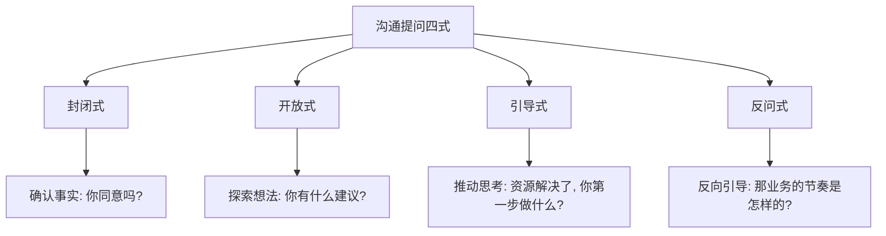

- **封闭式**：确认事实和快速决策——"这个方案你同意吗？""周五前能交付吗？"
- **开放式**：头脑风暴和探索——"你有什么建议？""你觉得问题出在哪？"
- **引导式**：推动对方思考行动——"如果资源的问题解决了，你第一步打算怎么做？"
- **反问式**：反向引导、深入了解——对方问"为什么排期这么紧"，你反问"那你了解业务侧的节奏是怎样的吗？"

**提问不只是获取信息，更是一种表达训练。**沟通里有一种高效的对话模式——"一问一答互探讨"：你一句我一句，彼此启发、彼此回应。

这种方式有一个重要前提：**不要把对话变成考试**。刻意去"考"对方，得到的只能是抗拒和敷衍。好的互动探讨有三个要点：**用好奇心代替考核心态；先给出自己的观点作为引子；对对方的回答及时反馈和追问。**会提问的人，能让对话自己生长。

## 09.螺旋推进沟通法

单次沟通的技巧都齐了，但重要的沟通——谈方案、谈合作、谈晋升——往往是一场"战役"，需要完整的推进章法。**"螺旋推进"是一种非直线、迂回推进的沟通模型**：五步依次走，任何一步崩塌，就退回上一步重建：

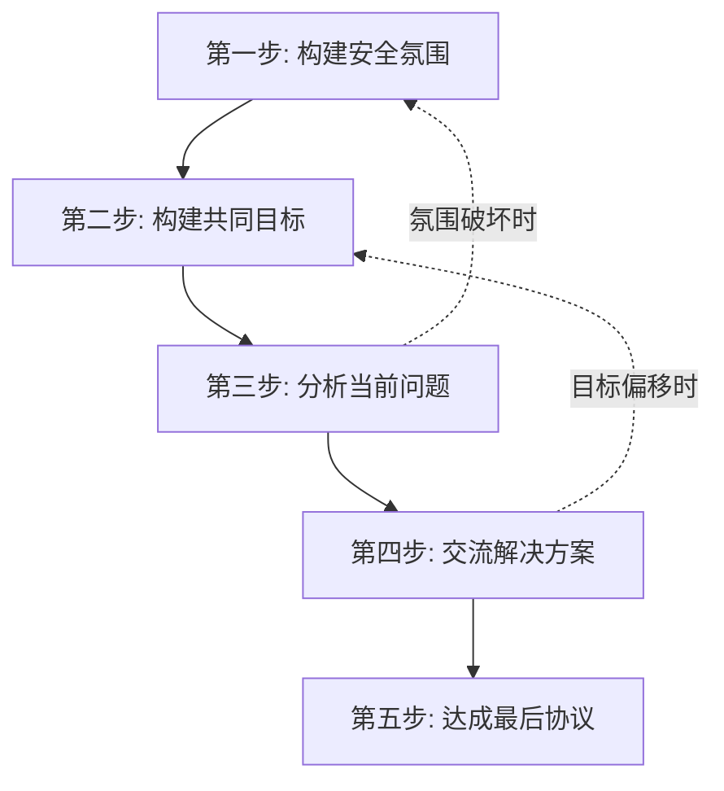

- **第一步，构建安全氛围**：先让对方相信你在意他的想法，再展开对话。对方感觉不安全，说出来的全是防御性的场面话。
- **第二步，构建共同目标**：让对方感觉"谈成了对双方都有利"，而不是"你只为自己的目的而来"。
- **第三步，分析问题**：原因没浮出水面之前，不急着讨论方案——方案错配了问题，谈得越拢错得越远。
- **第四步，交流方案**：带着"这是我的建议，想听你的反馈"的心态，**永远不要陷入"二选一"陷阱——坚信存在让大家都满意的第三种方案**。
- **第五步，达成协议**：达成后带头执行——这一次的兑现，是下一次沟通的信任本金。

"螺旋"两个字是精髓：**不是走完五步就一定成，而是崩了就退回去重建**——氛围被破坏，退回第一步；目标跑偏，退回第二步。多数沟通的失败不是在第五步崩的，而是在第一步埋的雷：**安全氛围没建好就开始推进，后面每一步都是在错误的地基上盖楼。**

## 10.柔和沟通六原则

到这里，内容和逻辑层面的问题都解决了。但还有一种失败：**你说的都对，对方就是不爱听**——问题不在逻辑，在你传递的情绪。这时你需要 SOFTEN 六原则，六个字母组成的单词本身就是答案——**柔和**：

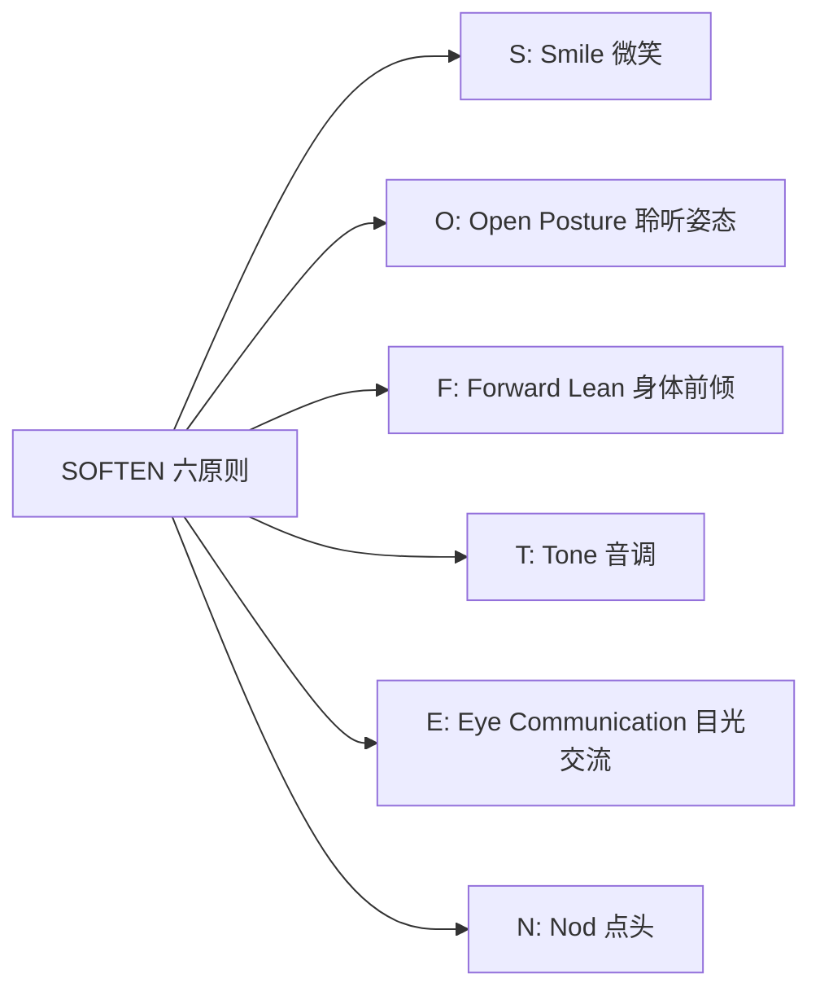

- **S：Smile（微笑）**——微笑不是讨好，是告诉对方"这次谈话没有敌意"。
- **O：Open Posture（开放姿态）**——面向讲话人站直或端坐，不抱臂、不侧身。
- **F：Forward Lean（身体前倾）**——身体微微前倾，是"我在认真听"最诚实的信号。
- **T：Tone（音调）**——重要内容放慢语速、加重语气；从头到尾一个调，重点全被淹没。
- **E：Eye Communication（目光交流）**——自然注视对方，躲闪的目光会让所有话减分。
- **N：Nod（点头）**——适时点头，不只表示赞同，更表示"我听见了"。

为什么身体语言这么重要？**对方对你的感受，很大一部分来自语调和姿态，而不是词句本身**——同样一句"你说得对"，冷着脸说和笑着说，是两句话。词句到达大脑之前，情绪已经先一步到达。所以开口前先检查你的表情、坐姿和语调，再检查措辞——**柔和的姿态，让你的正确更容易被接受。**

## 11.场景化沟通训练

最后，把所有方法落到四个最常见的场景里。

**向上沟通：核心是"节省领导的时间"。**我早年从一位 Leader 那里学到四条铁律，用了整整一年验证有效：

- **请示带方案**：不要问"这件事怎么办"，改问"我有 A、B 两个方案：A 是 XX，优点和风险是 XX；B 是 XX……我倾向 A，您看？"——**把决策成本压到最低**，领导只需回"OK"或"换 B"。
- **同步要拉齐**：每周一发三行计划、每周五发三行结论，主动同步给上下游。**"我以为对方在做"这句话，从此从你的语言里消失。**
- **汇报突成果**：任何周报月报，第一句永远是"**本期关键结果：XX，相比上期 +XX%**"，然后再展开过程——让领导 3 秒内知道你做成了什么。
- **分享说流程**：项目复盘讲清"我是怎么做的、踩了什么坑"，而不是只报结论——**你的经验就变成了团队的资产。**

这四条看起来简单，**但绝大多数职场人连"请示不带方案"这一关都过不去**。真正做到，你在领导眼里的成熟度会跳一整个台阶。

**平级沟通：核心是"把丑话说在前面"。**同事之间最容易出问题的是边界模糊和目标不一致。沟通前先明确三件事：谁负责什么、验收标准是什么、时间节点是什么；沟通后用一条消息把共识落到文字——"刚聊的结论我总结下：A 你负责，周五前给我，标准是 XX"。**事后五个字的扯皮成本，用事前三十个字的确认来消灭。**

**向下沟通：核心是"给反馈，不给打击"。**批评用三明治（见第 04 节），辅导用提问（见第 08 节）——下属来问"这个 bug 怎么解"，别直接给答案，先问"你自己排查到哪一步了？你觉得可能出在哪？"**你给的是答案，他学到的是依赖；你给的是问题，他学到的是方法。**

**亲密关系沟通：核心是"先处理情绪，再处理事情"。**情感的权重远大于信息的权重——对方向你倾诉时，要的不一定是解决方案，可能只是理解和陪伴（见第 06 节）。

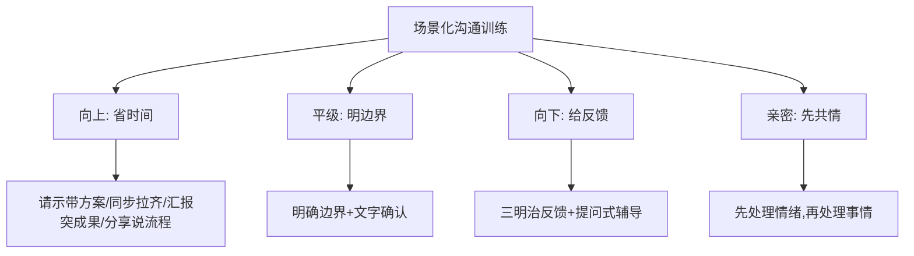

## 12.总结回顾本章节

**沟通不是天赋，是一套"先听 → 共情 → 提问 → 回应"的系统**——把它拆开练成习惯，技术男也能成为关系高手。

1. **先处理情绪，再处理事情**：情绪不通，道理不进。
2. **用观察代替评论，用请求代替要求**：非暴力沟通的最小可执行版本。
3. **结构化你的表达**：向上"结论先行 + 选项"，给反馈"三明治"，日常提问"先开后闭"。

## 13.后来发生的改变

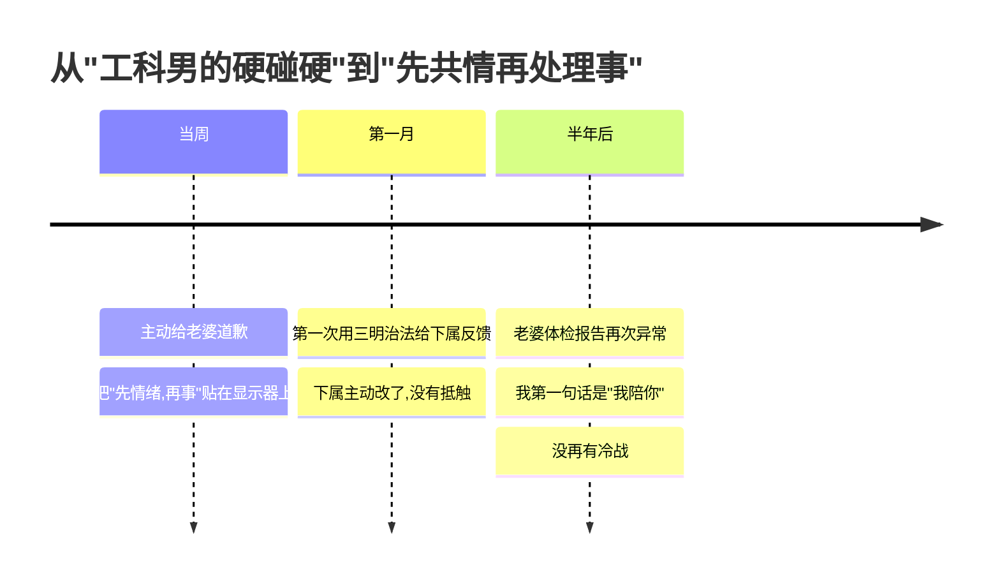

那次冷战和好之后，我做了三件事：

1. 主动给老婆道歉，**承认我把她的"求关心"听成了"在攻击"**；
2. 在显示器右下角贴了五个字：**"先情绪，再事"**；
3. 把买了很久没读的《非暴力沟通》《关键对话》翻出来——这次真的读完了。

最让我意外的是，**老婆看到那张便利贴的时候哭了。她说："你愿意把这个贴在工位上，我就觉得你是真的想改。"**

一个月后，我在带的实习生身上验证了这套方法。他写的代码有 5 处明显问题，**搁以前我会直接说"你这写的什么玩意儿"**。这次我按三明治说的：

> "你的整体思路其实没问题，框架搭得挺清楚（**肯定**）。
> 不过有 5 个地方我们一起看一下，可能可以优化（**建议**）。
> 改完以后这个模块在团队里就能成为一个标杆 demo（**期待**）。"

实习生的反应让我惊讶——**他不仅没抵触，还主动多改了 3 处他自己发现的小问题**。比起以前一对一吵到半夜，效率高了 10 倍。

半年后，老婆体检报告又有异常。她跟我说的那一刻，我没有像以前那样立刻"理性分析"——我先抱了她，说了三个字：**"我陪你。"**

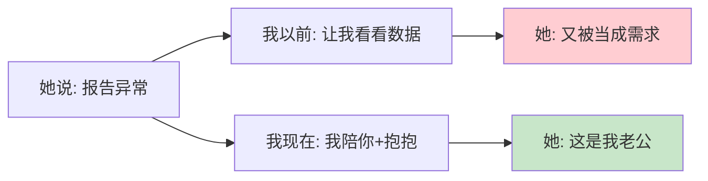

那次之后，我们家就再也没有冷战过。**不是不再有矛盾，是矛盾出现时我们都知道——先处理情绪，再处理事。**这套沟通系统，就这样重塑了我的家庭和职场。

## 14.今天起改变三点

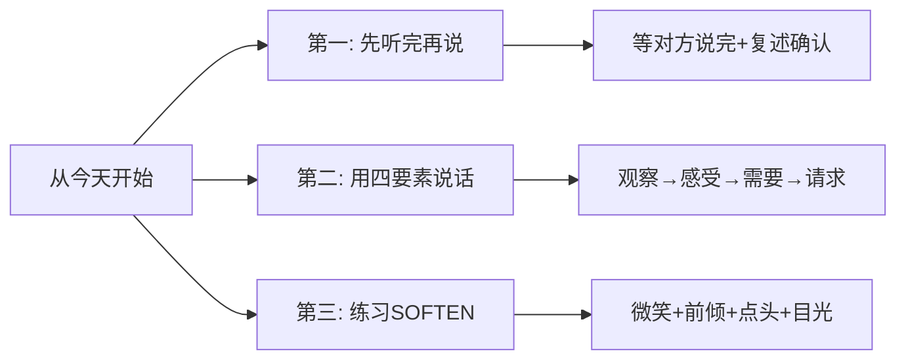

**第一，先听完再说。**任何沟通中，等对方说完再开口——不打断、不急于反驳。听完后先用一句话复述对方的核心意思："你说的是 XX，对吗？"确认理解正确，再表达自己。

**第二，用四要素组织表达。**不说"你总是 XX"，改说"当我看到 XX（**观察**），我感到 XX（**感受**），因为我需要 XX（**需要**），你能 XX 吗（**请求**）？"——本周至少完整地用一次。

**第三，刻意练习 SOFTEN。**明天的每一次对话：微笑、面向对方、适时前倾、用语调强调重点、保持目光交流、点头回应。坚持一周，别人对你的态度会有明显变化。

## 15.课后作业思考下

1. **三层倾听自测**：回忆你最近一次不愉快的沟通——你听到了第几层？对方的内容、情绪、需求分别是什么？如果重来一次，你会怎么回应？

2. **NVC 重写练习**：把那次沟通里你（或对方）说得最激烈的一句话，用四要素（观察、感受、需要、请求）重新组织一遍，写在纸上对比效果。

3. **三明治实操**：接下来一周，选一次真实的反馈场合（对下属、对孩子、对伴侣）刻意使用三明治法，记录对方的反应和以往有什么不同。

4. **向上沟通改造**：检查你最近一次发给领导的请示消息——带方案了吗？能让领导只回"OK/换 B"吗？不能的话，现在重写一遍。

---

> **📎 下一站** ｜ 会听、会说之后，还有一件被严重低估的事——"提问"。下一节我们聊《学会高效地提问》；再往后，第 3 章把你的表达力推向更大的舞台：幻灯片、公众演讲、技术演讲。
