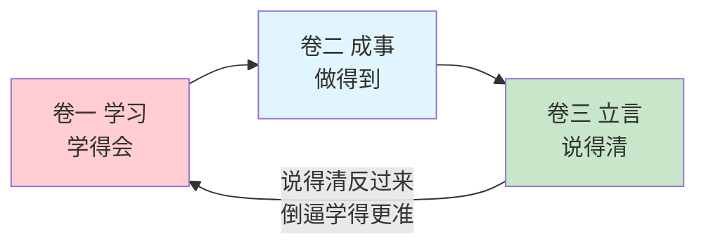

# 结语 想清楚，才能说明白

#### 目录介绍
- [结语 想清楚，才能说明白](#结语-想清楚才能说明白)
      - [目录介绍](#目录介绍)
  - [01.回到最初的那个问题](#01回到最初的那个问题)
  - [02.你真正该带走的三样东西](#02你真正该带走的三样东西)
  - [03.想清楚，才能说明白](#03想清楚才能说明白)
  - [04.三册在这里合龙](#04三册在这里合龙)

## 01.回到最初的那个问题

开篇的时候，我讲了自己述职翻车的经历：一年里干得最硬的一个专项，十五分钟的流水账讲完，评委只记得一句「你个人的核心贡献是什么」。

那时候我以为问题出在「不会说」。

现在你应该已经知道答案了：**「说不清」几乎从来不是嘴的问题，是三层欠账的问题**——底蕴不足、表达无方法、思维不成型。这本册子做的事情，就是把这三层一段一段补上：先攒弹药（底蕴），再学开枪（沟通与表达），最后练瞄准（思维）。

## 02.你真正该带走的三样东西

读完这本册子，如果你只记住三样东西，我希望是这三样：

| 带走什么 | 判断标准 | 它解决什么 |
|---------|---------|-----------|
| **一个持续攒底蕴的习惯** | 你有一个一直在变厚的素材库（语言、阅读、例子） | 说任何话，肚里都有货 |
| **两三个用顺手的表达框架** | 汇报能三句话讲清背景-冲突-结论；提问能一层层问到底 | 十分的内容，能呈现八分 |
| **一项想得深的日常训练** | 遇到观点先问「真的吗？为什么？」，能说出自己的判断 | 说什么都透，不再「有点道理」而已 |

注意，**这里面没有一条是「学会了话术」**。

话术是表层，是没货时的应急包装。这本册子从头到尾想让你相信的是：**表达的上限由底蕴和思维决定，方法只是让你逼近这个上限**——先立得住，才言得出。

## 03.想清楚，才能说明白

这本册子叫《立言》，四章里有一半篇幅在讲「立」——专注、记忆、感知、质疑、思考、情商。有些读者可能会问：一本讲表达的书，为什么要花一半篇幅讲思维？

因为我想让你带走的最重要的洞察是这一句：

> **所有说不清，都是没想清。**

回头看你的每一次「词不达意」：

- 汇报讲不出重点——不是因为嘴笨，是因为你还没想明白「这件事里最重要的到底是什么」；
- 观点说不透——不是因为词汇量不够，是因为你还没有把那个观点的前提、边界、反例想一遍；
- 被人一追问就慌——不是因为反应慢，是因为你的思考停在第一层，而对方的问句来自第二层。

**语言只是思维的搬运工。搬运工再卖力，仓库里没货、货没分类，搬出来的也只是一堆乱麻。**

所以，如果你只能从这本册子里带走一个习惯，我希望是它：**每次开口之前，先问自己一句——「这件事，我到底想明白了吗？」** 想明白的标志很简单：你能用一句话说出核心，再用三句话展开支撑。做不到，先别急着组织语言，回去接着想——或者承认「这块我还没想清楚」，这本身就是一种高级的清晰。

想清楚的人，说话自带结构；想不清楚的人，技巧越多越显得油腻。

## 04.三册在这里合龙

这本册子讲完，「学得会，做得到，说得清」的闭环也就合龙了。

三册各管一环，但它们不是流水线，是循环：

- **学得会，是输入**——没有持续的输入，做事和表达都会枯竭；
- **做得到，是输出**——学了一堆却做不成事，知识就只是收藏品；
- **说得清，是放大**——做了说不清，价值就困在你一个人的身体里；
- 而说得清会反过来倒逼输入——**要对外讲一件事，是检验你是否真懂它的最快方式**。为了讲清楚，你不得不回去重学、重想。

一个普通人变强的路径，就这么朴素：**学进去，做出来，说出去——然后，再学进去。**

这套书写到这里，方法的部分就全部交付了。书里没有一句话能替你走路——**路要你自己走，坑要你自己踩，话要你自己说出口。** 但请相信，这套书里的每一个方法，都是我这样一个普通人，用十几年的时间一个个踩出来、跑通过的。我能走通，你也能。

愿你从今天起：学得会，做得到，说得清。

---

> 上一章：[15. 情商能力的学习](./15.情商能力的学习.md) ｜ 接下来：[附录A 写给平凡人的话](./54.写给平凡人的话.md)
