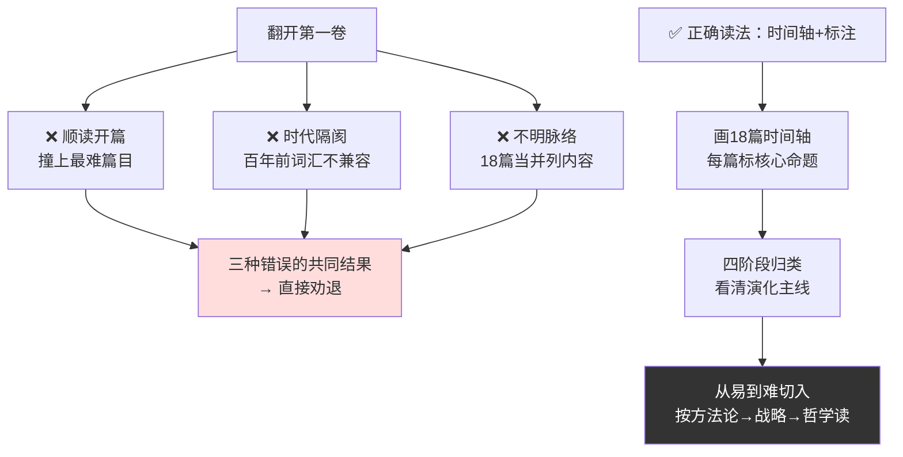
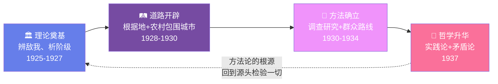
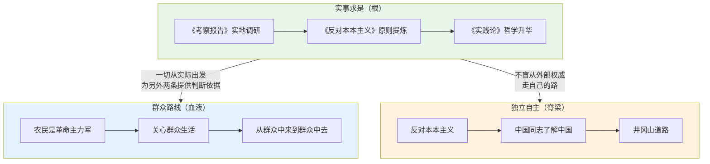
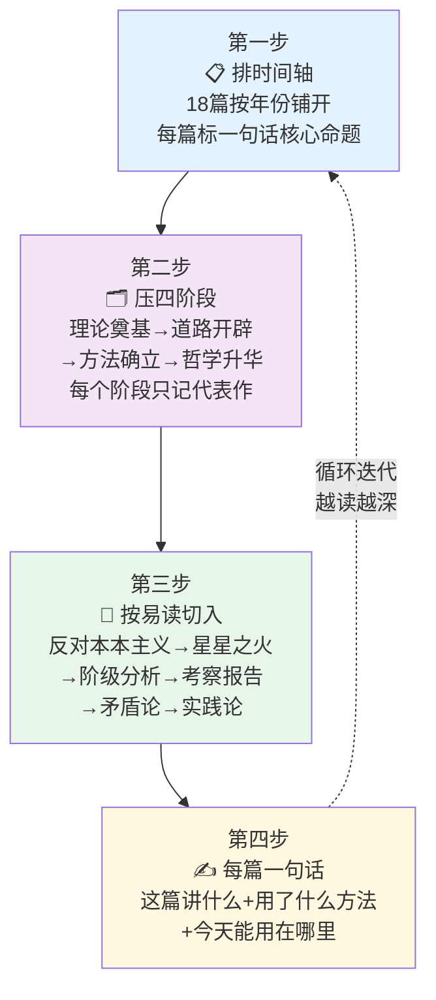
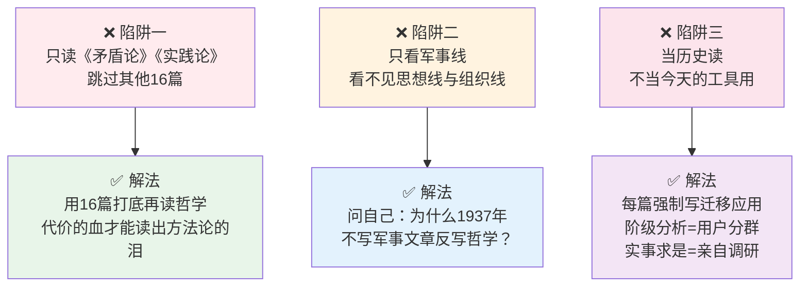

# 03.土地革命综述篇

- 01.被劝退的开篇
- 02.市面误读之辨
- 03.一九二五现场
- 04.原文四维精读
- 05.第一卷的价值
- 06.第一卷的框架
- 07.第一卷的主线
- 08.如何阅读这卷
- 09.第一卷的总览
- 10.方法论工具箱
- 11.三个认知陷阱
- 12.现实映射矩阵
- 13.一个反面教材
- 14.三年认知复利
- 15.收束三句金言

## 01.被劝退的开篇

初读《毛选》第一卷，开篇《中国社会各阶级的分析》满是陌生的旧时代概念，我只觉得与当下工作无关，草草略过，连《矛盾论》《实践论》这些思想根基都没摸到精髓，直接被劝退。

后来复盘才明白，读不下去并非书的问题，而是踩了三个坑：一是时代隔阂，百年前的词汇脱离日常语境；二是读法错误，顺读开篇就撞上最难篇目；三是不明脉络，18篇文章横跨十二年，误作并列内容，抓不住演化主线。

重读时我换了思路，先按时间轴梳理篇目，标注每篇的核心命题，瞬间理清了全貌：从辨明敌我、研判农运，到探索根据地发展，再到哲学层面总结方法，本质是一套完整的探索实录。理清脉络后，陌生概念不再是障碍，反而能读懂背后直面问题、破解分歧的思考逻辑。

三种错误读法与正确读法的对照，一图看透：

## 02.市面误读之辨

市面上讲第一卷的常见三种讲法：第一卷讲阶级斗争，过时了；第一卷讲农村包围城市，是中国特色革命经验。第一卷的精华是《实践论》《矛盾论》，其他可以跳。

这三种讲法都让人**敬而远之**，前两种把第一卷"封印"在历史里，第三种把第一卷"切碎"成两篇明星论文。**结果就是绝大多数人读完一句"经典"就走了，没人真去啃完整的第一卷**。

为什么这种讲法最流行？因为它**最讨巧**，讲者不用真懂第一卷的递进关系，听众也不用真去读 16 篇"非明星篇"，双方在"两篇哲学论文的舒适区"里完成了一次伪学习。

我想讲的第一卷完全不同：

**第一，第一卷是一份"摸石头过河的现场记录"**。不是"理论作品集"，是党在 1925-1937 年这十二年里**一边打仗一边总结经验、一边总结一边修正方向**的真实记录。每一篇都对应一次具体的危机、一次具体的争论、一次具体的判断。**还原现场，每一篇都是活的**。

**第二，第一卷有三条主线，缺一条都读不懂全貌**。不是只有"农村包围城市"这一条军事路线，还有**思想路线**（实事求是从哪里来）、**组织路线**（一支军队怎么从草寇变成铁军）。三条主线在十二年里同时演化、互相缠绕。**只看军事线的人，永远读不懂《矛盾论》为什么写在 1937 年而不是 1927 年**。

**第三，《实践论》《矛盾论》不是孤立明星，是"前 16 篇问题的总答案"**。它们俩看起来是哲学，其实是**对前面所有失败和成功的方法论级总结**，把十二年血的代价压成了两篇方法论。**没读过前 16 篇就直接读这两篇，读到的只是哲学；读完前 16 篇再读这两篇，读到的是"二十几万人命换来的判断方法"**。

## 03.一九二五现场

1925年12月《中国社会各阶级的分析》成文时，中国共产党成立仅四年，党员不足千人，在国共合作中处境弱势。彼时革命的首要命题，是分清“谁是敌人，谁是朋友”。

当时党内存在两种偏差：要么一味依附国民党，要么只看重工人运动，二者都忽视了占全国人口绝大多数的农民。32岁的毛泽东以经济地位为标尺系统划分社会阶级，明确工业无产阶级是革命领导力量，农民才是最广大、最忠实的同盟军，直接打破了党内主流认知，也奠定了新民主主义革命的基本思路。

《毛选》第一卷的18篇文章横跨12年，本质是一部“危机解决实录”：从研判农民运动、论证农村红色政权的生存逻辑、确立调查研究原则，到系统总结红军军事战略，最终以《实践论》《矛盾论》沉淀出哲学方法论。每一篇都对应一个现实拐点，解决一个当时争论不下的具体问题。

这十二年的探索，始终在三重压力下展开：帝国主义的外部侵略、封建土地制度的底层盘剥、官僚资本的权力垄断。读懂这一共同背景，第一卷就不再是陈旧文献，而是一套在多重重压下破局决策、校准路线的鲜活样本。

## 04.原文四维精读

这是全篇最硬核的一节。我从字眼、历史现场、内在张力、反共识四个维度，拆解第一卷的灵魂论断，**没有调查，没有发言权**。

> 原文出自1930年《反对本本主义》：“你对于那个问题不能解决么？那末，你就去调查那个问题的现状和它的历史罢！你完完全全调查明白了，你对那个问题就有解决的办法了。”

**一、字眼：两处被忽略的表达分量**

先看“**完完全全**”四个字。不是“调查清楚”“基本了解”，是毫无折扣的彻底查明。毛主席把标准钉得如此之死，正是预判了执行层的偷懒心态，有人跑三天基层就敢自称“调查过了”。在他这里，达不到“完完全全”的标准，就不算真正做过调查。

再看句尾的“**罢**”字。一句“你就去调查……罢”，带着催促与急切的语气，不是学者式的从容说理，更像看着同志走弯路而心急的引路者：“别再空谈争论，快去现场！”这份语气早已说明，这不是哲学论证，是一份纠偏的急救文件。

**二、现场：踩着实地底气发出的战书**

这句话写于1930年5月。36岁的毛主席刚刚在江西寻乌县蹲点二十天，逐户走访、逐笔记账，完成了八万字详尽到商品物价的《寻乌调查》。

当时党内本本主义盛行，照搬苏联经验强令红军攻打大城市的路线正在害人，一批从未扎根基层、只靠引经据典做决策的人，正把队伍一次次推向险境。毛主席这句话的潜台词掷地有声：你们马列背得再熟，可你们去过寻乌吗？知道农民的真实生计吗？都不知道，就没有发言权。

还原这个现场就会明白，它从来不是空泛的哲学口号，是以八万字一手调查为底气，向教条主义发出的宣战书。

**三、张力：用行动门槛定义表达资格**

这句话藏着一层极具冲击力的内在逻辑：用“调查”这个行动前提，去限定“发言”的表达权利。它直接推翻了“读书多就有话语权”的传统认知，过往读书人凭圣贤书便可纵论天下，毛主席却划下硬线：书本、典故、学问都不作数，没到过现场，就没有开口的资格。

毛选里这类结构反复出现：用行动定资格、用实践验真理。这不是修辞技巧，是一以贯之的世界观：所有脱离实地的空头理论家，都没有真正的话语权。

**四、反共识：不是有依据，是有一手现场**

市面上常把这句话解读成“说话要有依据”，这是彻底的误读。“说话有依据”是事后陈述者的姿态，引用几份报告、几组数据就算达标；而毛主席说的“调查”，是事前研究者的铁则，必须亲自沉到现场，用脚走访、用眼观察、用脑分析，拿到一手信息之后才有发言权。引用第三方报告不算数，那本质就是现代版的本本主义。

前者是轻飘飘的“我有数据”，后者是沉甸甸的“我到过现场”。二手信息和一手调研的分量天差地别，这就是鸡汤式解读和实干铁律的本质区别。

## 05.第一卷的价值

第一卷诞生于中国近代最黑暗错综，却也孕育希望的年代。彼时中国承受着三重重压：帝国主义加紧掠夺、日本妄图亡华；封建土地制度束缚生产力，农民深陷苦难；四大家族为代表的官僚资本垄断国民经济命脉。

在这样的时局下，中国革命的核心命题直指本质：谁是敌人、谁是朋友？革命该如何推进？第一卷的全部文章，正是对这两大根本问题的系统性回答。

作为毛泽东思想的源头活水，它的价值跨越时代：既记录了波澜壮阔的革命历程，更沉淀了深厚的思想智慧。

**世界观与方法论启示**：《实践论》《矛盾论》指明了一切从实际出发、理论联系实际的认知路径，教人在实践中认识、检验与发展真理；同时提供了矛盾分析工具，教人抓住主要矛盾与矛盾主要方面，做到具体问题具体分析。

**战略思维启示**：《中国社会各阶级的分析》《星星之火，可以燎原》展现了宏大的战略视野与深刻洞察力。它启示我们，无论局面多复杂，都要保持清醒判断，科学研判形势，厘清敌我格局，制定符合客观规律的长远战略。

**组织原则与领导艺术启示**：《关于纠正党内的错误思想》确立了思想建党、政治建军的原则，对各类组织强化自身建设、保持队伍的凝聚力与战斗力，具有普遍指导价值。

**工作方法启示**：《反对本本主义》《湖南农民运动考察报告》树立了调查研究与群众路线的典范。它提醒我们，正确的决策源于深入的一线调研，真正的力量蕴藏在最广大的群体之中。

## 06.第一卷的框架

第一卷的编辑并非简单的编年体，而是有着严谨的内在逻辑，它系统地展示了毛泽东思想的形成过程，即如何一步步地将马克思主义的普遍真理与中国革命的具体实践相结合的"第一次历史性飞跃"。其篇章结构可以概括为以下四个循序渐进的阶段：

**1.理论奠基阶段，核心问题**：中国革命的性质、动力、对象和前途是什么？

**代表篇章**：《中国社会各阶级的分析》、《湖南农民运动考察报告》。

**逻辑推进**：首先通过阶级分析，在理论上厘清了"敌、我、友"这个革命的首要问题。紧接着，通过实地调查，在实践上发现了中国革命最主要的动力，农民阶级，并论证了农民斗争在中国革命中的决定性作用。这为解决"如何革命"奠定了理论和群众基础。

**2.道路开辟阶段，核心问题**：在强大敌人占据中心城市的条件下，革命如何生存、立足并发展？如何建设一支新型的人民军队？

**代表篇章**：《中国的红色政权为什么能够存在？》、《井冈山的斗争》、《关于纠正党内的错误思想》、《星星之火，可以燎原》。

**逻辑推进**：在实践上创建并巩固了井冈山革命根据地后，毛泽东从理论上回答了"红色政权能否存在"的疑问，系统提出了"工农武装割据"的思想。随后，通过古田会议决议，确立了思想建党和政治建军的基本原则，确保了革命力量的先进性和战斗力。最终，《星星之火，可以燎原》将局部经验上升为全国性的战略思想，完整阐述了"农村包围城市"的革命道路。这一阶段，解决了革命的"载体"（军队）和"空间"（根据地）问题。

**3.方法确立阶段核心问题**：如何保证党的路线和政策不犯错误？如何实施正确的领导？

**代表篇章**：《反对本本主义》、《必须注意经济工作》、《关心群众生活，注意工作方法》。

**逻辑推进**：在解决了道路问题后，毛泽东将重点转向了工作方法。《反对本本主义》确立了"实事求是、群众路线、独立自主"这一毛泽东思想活的灵魂的雏形。而后两篇文章则具体阐述了在根据地建设中，如何通过发展经济、关心群众切身利益来赢得人民支持，将革命战略落实到具体的、有效的领导方法中。这解决了革命的"方法论"问题。

**4.哲学升华阶段核心问题**：如何从世界观和方法论的高度，彻底清算党内长期存在的"左"、右倾错误的思想根源？

**代表篇章**：《实践论》、《矛盾论》。

**逻辑推进**：这是全卷的高潮和总结。毛泽东将前十多年革命斗争的血的教训和成功经验，提升到马克思主义认识论和辩证法学说的高度进行系统总结。《实践论》针对的是党内教条主义者轻视实践、脱离实际的唯心论倾向；《矛盾论》针对的是他们看问题片面、孤立、僵化的形而上学倾向。这两篇著作提供了强大的思想武器，标志着毛泽东思想的系统化和成熟。

四阶段的演进逻辑，一张图就能记住：

## 07.第一卷三大主线

通览《毛选》第一卷可以清晰看到，实事求是、群众路线、独立自主这三个毛泽东思想活的灵魂，虽尚未被提炼为正式表述，却已作为核心思想主线贯穿全书，在十二年的革命实践中逐步成型。

**实事求是：从实地行动到哲学方法论**。实事求是是贯穿始终的根本思想路线。1927年《湖南农民运动考察报告》是深入实地调研的实践范本；1930年《反对本本主义》将其升华为行动原则，提出“没有调查，没有发言权”，直指教条主义弊病；1937年《实践论》则从哲学层面系统论证了认识与实践的辩证关系。从实地践行到原则提炼，再到哲学沉淀，这条“实践—口号—理论”的三段式上升路径，正是一个具体工作方法生长为核心思想的经典范本。其内核始终如一：一切从中国革命的实际出发，而非从书本教条或上级指令出发。

**群众路线：在反主流共识中扎根**。群众路线是贯穿全篇的根本立场与工作方法。从认定农民是革命的主力军，到提出“关心群众生活，注意工作方法”，“一切为了群众、一切依靠群众，从群众中来、到群众中去”的核心逻辑已完整成型。 这条路线并非党内天然共识：在当时“工人优先论”的主流氛围中，毛泽东力排众议将农民提升到革命主力军的位置，本身就是对自上而下精英判断的突破。群众路线从诞生起，就自带立足实际、反对照搬本本的鲜明特质。

**独立自主：跳出外部权威的自主探索**。独立自主是立足中国国情的根本立足点。《反对本本主义》中“中国革命斗争的胜利要靠中国同志了解中国情况”的论断，就是这一原则的最早宣言。彼时党在思想、组织上长期受共产国际指导，重大决策多需听命于莫斯科。而井冈山“农村包围城市”的道路，本质上是第一次绕开外部权威指挥、完全依据中国实际自主探索的革命路径。这种不盲从外来经验、敢于立足本土做判断的底气，正是独立自主原则最核心的内核。

这三大原则从不是抽象的理论总结，而是在一次次路线博弈、危机应对中打磨出来的行动准则，既是中国革命的破局密码，也是跨越时代的通用方法论。

三大主线的生长逻辑与相互关系：

## 08.如何阅读这卷

这些文章都是在特定历史条件下，为回答和解决中国革命面临的紧迫问题而写的。了解当时的社会状况、党内分歧和革命进程，能帮助你更深刻地理解文章的观点和决策。

具体怎么做？**每读一篇之前，先用三分钟搜一下"这一年发生了什么"**。比如读 1927 年的《湖南农民运动考察报告》之前，先查一下"1927 年发生了什么"，你会发现这一年发生了"四一二反革命政变"，国民党屠杀共产党人。这一搜，整篇文章的紧迫感就立刻浮现。

第一卷不仅提供了具体问题的答案，更珍贵的是其蕴含的**思想方法**，如**阶级分析法、调查研究、具体问题具体分析、把握主要矛盾、从实践中来再到实践中去**等。这些方法具有超越时空的普遍价值。

具体怎么做？**每读完一篇，问自己三个问题**，这篇用了哪个思想方法？这个方法的判断步骤是什么？这个方法今天能用在哪里？把这三个问题答出来，你才算真读懂了这篇。

如果时间有限，可优先阅读《中国社会各阶级的分析》《星星之火，可以燎原》《反对本本主义》《实践论》《矛盾论》等核心篇目。

具体顺序我建议是：**先读《反对本本主义》（最容易切入，方法论清晰）→ 再读《中国社会各阶级的分析》（结构思维，对照今天的"用户分群"）→ 然后读《星星之火，可以燎原》（战略乐观主义）→ 最后读《实践论》《矛盾论》（哲学总结）**。这个顺序避开了"上来就被劝退"的陷阱。

尝试将著作中的立场、观点、方法与当今的现实生活和工作实践相联系，思考其当代启示。

具体怎么做？**每读完一篇，强制自己写一句"这篇能用在我什么具体问题上"**。写不出来就说明你没读进去，回去重读。这个动作看起来轻，是把"知"变成"用"的唯一桥梁。

## 09.第一卷的总览

第一卷主要收录了毛泽东从 1925 年到 1937 年期间的重要著作，共 18 篇文章。这些文章深刻分析了中国社会的性质、革命的力量与道路，以及党的建设和军事战略等根本性问题，集中体现了毛泽东思想的初步形成和成熟。

| 文章名称 | 时间 | 核心要点 |
| :--- | :--- | :--- |
| **中国社会各阶级的分析** | 1925.12 | **分清敌友，找准核心矛盾** |
| 湖南农民运动考察报告 | 1927.03 | 尊重一线真实反馈，实践胜过书本 |
| 中国的红色政权为什么能够存在？ | 1928.10 | 劣势中抓核心优势，找准生存逻辑 |
| 井冈山的斗争 | 1928.11 | 直面困境，用真实复盘替代自我感动 |
| 关于纠正党内的错误思想 | 1929.12 | 向内纠错，统一认知 |
| **星星之火，可以燎原** | 1930.01 | **长期主义定力，微小积累终将爆发** |
| **反对本本主义** | 1930.05 | **没有调查就没有发言权** |
| 必须注意经济工作 | 1933.08 | 核心目标之外兼顾基础保障 |
| 怎样分析农村阶级 | 1933.10 | 建立清晰判断标准，凭标尺不凭感觉 |
| 我们的经济政策 | 1934.01 | 顺势制定适配策略，不生搬硬套 |
| 关心群众生活，注意工作方法 | 1934.01 | 抓结果更要抓方法人心 |
| 论反对日本帝国主义的策略 | 1935.12 | 团结整合一切可用力量 |
| 中国革命战争的战略问题 | 1936.12 | 从零散应对升级为体系化布局 |
| 关于蒋介石声明的声明 | 1936.12 | 看清本质，守住底线 |
| 中国共产党在抗日时期的任务 | 1937.05 | 认清阶段，动态调整重心 |
| 为争取千百万群众进入抗日民族统一战线而斗争 | 1937.05 | 把握主动权，掌控全局 |
| **实践论** | 1937.07 | **实践是检验真理的唯一标准** |
| **矛盾论** | 1937.08 | **抓主次矛盾，抓重点则其余自解** |

**注**：加粗五篇是全卷"必读五篇"——《阶级分析》给敌我判断、《星星之火》给道路选择、《反对本本主义》给方法论、《实践论》《矛盾论》给哲学总纲。时间有限只读这五篇也能吃透第一卷 80% 骨架；其余 13 篇是这五篇的具体展开。

## 10.方法论工具箱

把"读懂第一卷"这件事收拢为四个可操作动作，这是把这一卷思想变成肌肉记忆的唯一方式。

**第一步，把 18 篇按时间顺序排成一条线，每篇旁边标注一句话"它在回答什么问题"**。为什么必须先做这一步？因为第一卷最大的阅读障碍不是"难"，是"散"，18 篇散在十二年里看起来毫无关联。但只要排成一条线，**你立刻看见它们在递进，从 1925 年的"分清敌友"到 1937 年的"方法总结"，是一条连贯的认知升级线**。

具体怎么做？A4 纸横放，左边 1925 年、右边 1937 年，把 18 篇标题按写作时间钉在线上，15 分钟工作量，但回报是后面 50 小时阅读的清晰度。

**第二步，把 18 篇压缩到四个阶段**：理论奠基 → 道路开辟 → 方法确立 → 哲学升华。为什么必须压到四阶段？因为**人类大脑能记住的"块"不超过五个**，18 篇你记不住，4 个阶段你能记一辈子。把每篇文章先归到一个阶段里，然后只记四个阶段名，每个阶段只记一篇代表作，**你就掌握了第一卷 80% 的骨架**。

四个阶段对应的代表作：理论奠基 = 《阶级分析》、道路开辟 = 《星星之火》、方法确立 = 《反对本本主义》、哲学升华 = 《矛盾论》。这四篇读透，第一卷你已经读了半本。

**第三步，第一篇不要选《阶级分析》，从最容易切入的那篇开始读**。具体顺序我建议：《反对本本主义》 → 《星星之火，可以燎原》 → 《中国社会各阶级的分析》 → 《湖南农民运动考察报告》 → 《矛盾论》 → 《实践论》。

为什么这个顺序？《反对本本主义》是方法论文章，最容易和今天的工作联系起来；《星星之火》是战略乐观主义文章，读起来振奋人心；后面再回头读阶级分析和考察报告，已经有了底子；最后读《矛盾论》《实践论》才能真懂，因为它们是对前面所有篇目的方法论总结。

**第四步，每读完一篇，强制自己写一句话总结**。不是"做笔记"，是"写一句话"，告诉一个完全没读过这篇的人这篇在讲什么。能写出来就懂了，写不出来就没懂。

更进一步，每篇还要写**两句话的迁移应用**：第一句"这篇用了什么思想方法"、第二句"这个方法今天能用在我什么具体问题上"。能写出这两句的，才是真把这篇变成了自己的工具。

四步走完，排时间轴、抓四阶段、按易读切入、每篇一句话，一卷厚书被压缩成一张可操作的认知地图。**真正的第一卷读者不是读得早，是地图画得早**。

四步阅读法一目了然：

## 11.三个认知陷阱

知道了"第一卷有四阶段"还不够，真正踩坑的地方在这三处：

**第一个陷阱，最常见的错误，只读《矛盾论》《实践论》，跳过其他 16 篇**。很多人觉得"反正这两篇是精华，其他都是历史细节"。**这是彻底错的**，《矛盾论》《实践论》是对前 16 篇所有失败和成功的方法论总结，没有那 16 篇打底，这两篇你只能读到"哲学"，读不到"代价"。同样是"具体问题具体分析"这八个字，读过前 16 篇你知道这八个字背后压着王明路线让 30 万红军变 7000 人的代价，没读过的人只觉得是一句方法论金句。**前者是震撼，后者是知识**。

**第二个陷阱，只看"农村包围城市"这条军事线，看不见思想线和组织线**。这一卷真正的厚度在另外两条线：思想线（实事求是从哪里长出来）、组织线（一支军队怎么从草寇变成铁军）。只看军事线的人，永远读不懂为什么《反对本本主义》比《星星之火》还要重要。具体识别方法：**问自己一句，"为什么 1937 年抗战开始时，毛主席不写军事文章，反而写《矛盾论》《实践论》两篇哲学？"**，能答出这个问题的人，才算抓住了三条主线。

**第三个陷阱，把第一卷当历史读，不当今天的工具用**。很多人读第一卷的姿态是"学习党史"，记年代、记人物、记会议。这种读法没错但很浅。**第一卷真正的力量是它的方法论可以直接迁移到今天**，"阶级分析"今天就是"用户分群"，"农村包围城市"今天就是"差异化竞争从下沉市场切入"，"实事求是"今天就是"亲自调研而不是看二手报告"。

识别方法：**每读完一篇，强制自己写一句"这篇能用在我什么具体工作上"**。写不出来的，重读。

三个认知陷阱的对照：

## 12.现实映射矩阵

把第一卷的四阶段方法论，映射到三个现代场景：

**一、理论奠基｜《中国社会各阶级的分析》**
**核心：先分层、再行动，杜绝盲目发力**
**个人成长**：人脉分层，区分支持者、中立者、消耗者，舍弃无效社交。
**团队管理**：成员分层，划分核心、协作、观望，差异化分工。
**商业竞争**：用户分层，聚焦核心付费、盘活潜在用户，避免无差别运营。

**二、道路开辟｜《星星之火，可以燎原》**
**核心：低谷不硬刚，小赛道扎根，积累势能等爆发**
**个人成长**：拒绝内卷，深耕擅长细分领域，先扎根再扩张。
**团队管理**：不攻坚硬骨头，优先轻量化高收益项目，以小胜积大胜。
**商业竞争**：避开大厂锋芒，深耕垂直细分，打造差异化优势。

**三、方法确立｜《反对本本主义》**
**核心：摒弃教条空想，决策基于真实调研**
**个人成长**：拒绝盲从二手信息，关键决策亲自调研。
**团队管理**：制度先小范围试点，验证后全员落地。
**商业竞争**：迭代贴合真实用户场景，杜绝主观臆断。

**四、哲学升华｜《实践论》《矛盾论》**
**核心：抓主要矛盾，以实践闭环校验认知**
**个人成长**：摒弃琐事内耗，聚焦核心目标，用实践迭代认知。
**团队管理**：聚焦核心卡点，持续复盘迭代。
**商业竞争**：抓取市场核心矛盾，用数据验证决策。

第一卷的四个阶段不是历史，是任何一次"从零到一"的标准动作。无论个人成长、带团队还是创业，底层逻辑完全同构。

## 13.一个反面教材

再看一个反面切片，读懂跳过第一卷要走多少弯路。

朋友老吴2020年读毛选，听信“《论持久战》最实用”，跳过第一卷直接从第二卷读起。读完便照搬“防御—相持—反攻”三阶段框架套进自己的创业项目，兴奋了好一阵。可项目跑了一年，产品、用户、团队接连出问题，完全没按预期推进。他困惑不已：明明用了经典方法，为什么不灵？

细问才知道，他既没做过用户分层分析，也没实地走访过目标用户，连核心服务对象是谁都没摸清。跳过了阶级分析、调查研究这些基础，直接套用高阶战术，本质是没打地基就盖楼。

这个案例背后藏着两个关键认知：

第一，第一卷是地基，不是补充。所有上层方法论成立都有前提，先分清敌我、摸清现状、找对同盟。基础动作缺位，再精妙的理论都会失效。

第二，“过时”往往是借口。真正过时的只是特定历史名词，而非分群、调研、抓主要矛盾的底层方法。剥去时代外壳，第一卷的思维逻辑至今通用。

## 14.三年认知复利

把时间轴画完那周，我回头再读《中国社会各阶级的分析》，原来我能看懂它了。它不是一堆过时的名词，而是**党在 1925 年回答"谁是朋友谁是敌人"的第一次完整作业**。我读完之后第一次在书上标了线，还做了脑图。

最深的感受是，**有了时间轴，每一个名词都有了"时间坐标"**。"小资产阶级的右翼"在 1925 年那个具体时刻指代谁、对应今天什么人，我能立刻翻译出来。**没有时间坐标的概念都是飘的，钉在时间轴上的概念才是实的**。

更让我意外的是，**这种"时间轴 + 一句话标注"的读法让我开始真正会推荐书**。以前别人问"毛选第一卷怎么读"，我只能说"挺好，你读读吧"，这是没读过的人的标准答复。现在我能说："先画 18 篇时间轴，按四阶段归类，然后按《反对本本主义》→《星星之火》的顺序倒着读"，这是真懂的人才能给的答复。

半年后我再读第二卷《论持久战》，发现自己完全看得懂，因为第一卷已经教会我**矛盾分析、阶级分析、实事求是**。没有第一卷的底子，第二、三、四卷都是空中楼阁。我现在给想读毛选的同事的第一条建议就是：**从第一卷开始，一篇不跳**。

三年之后，第一卷已经成了我做"从零开始"任何事的标准模板，**任何一个新领域、新项目、新团队，我都先按第一卷的四阶段走一遍**：先做"阶级分析"（搞清楚谁是用户/同盟军/对手）、再开"道路开辟"（找一个能站住的小切入点）、再"方法确立"（把试点方法固化）、最后"哲学升华"（把经验上升为团队方法论）。

这个习惯让我避开了很多大坑。我见过太多人在新事面前**直接套战略、直接抄方法论**，他们不缺勤奋，缺的是地基。**第一卷给我的最大礼物，就是教会我永远先做"从零到一"的地基动作**。

## 15.收束三句金言

**第一卷是毛选的思想源头**，搞懂它，后三卷就开了坦途。这是整一卷书留给我最硬的一句。

你应该带走的三件事：**1.四阶段递进**：理论奠基 → 道路开辟 → 方法确立 → 哲学升华。**2.三条主线贯穿**：实事求是、群众路线、独立自主，一条都不能跳。**3.重点篇优先**：《阶级分析》《星星之火》《反对本本主义》《实践论》《矛盾论》。

**一句留给你的反问**：你今天面对的那个新领域、新项目、新难题，**有没有先做过"阶级分析"，搞清楚谁是用户、谁是同盟、谁是对手**？如果没有，先别上"战略"，你现在缺的不是方法论，是地基。

